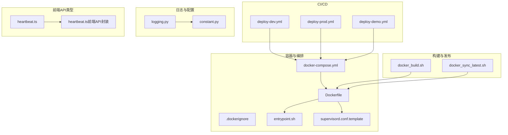
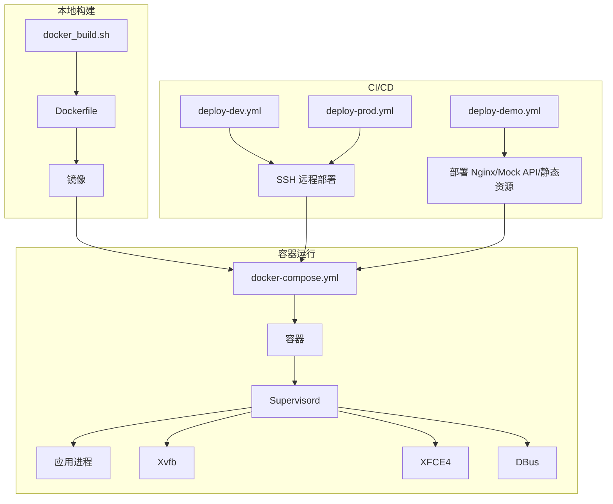
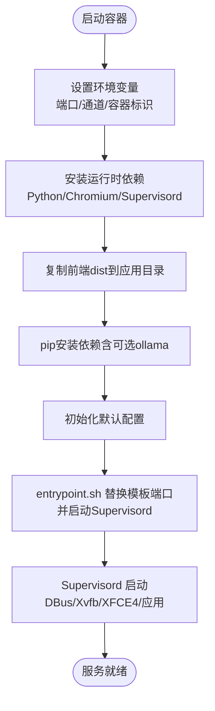
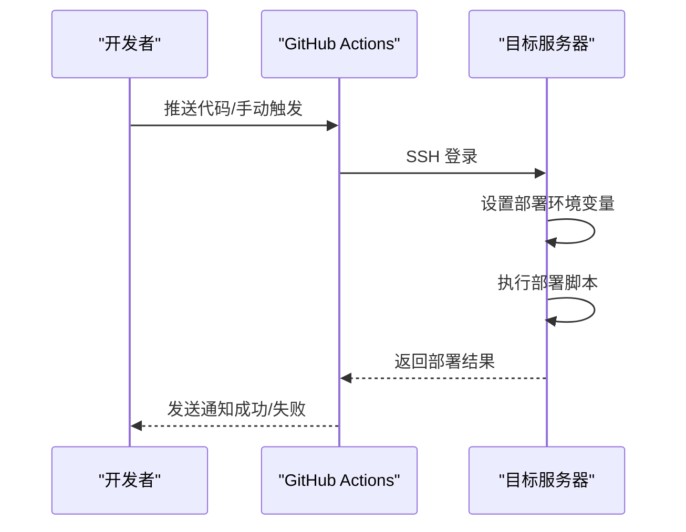
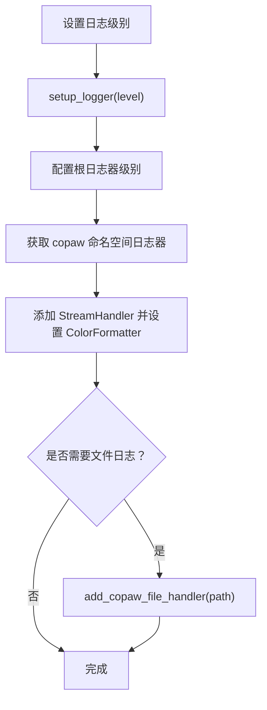
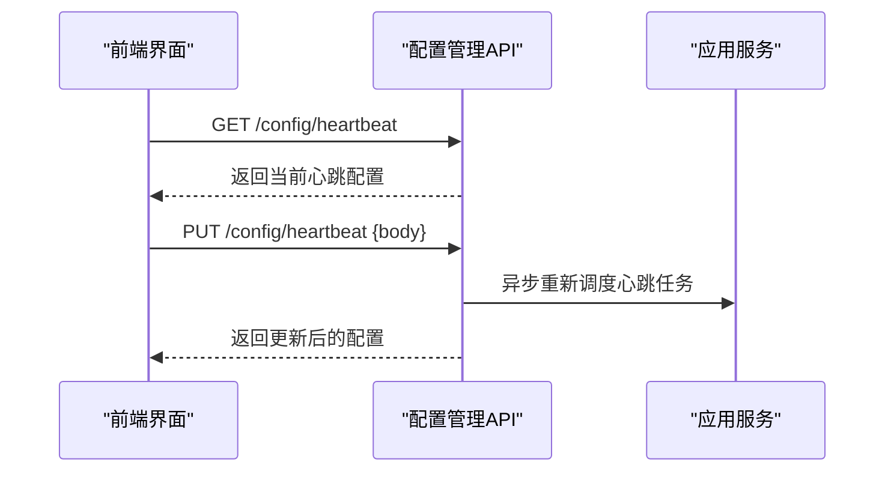
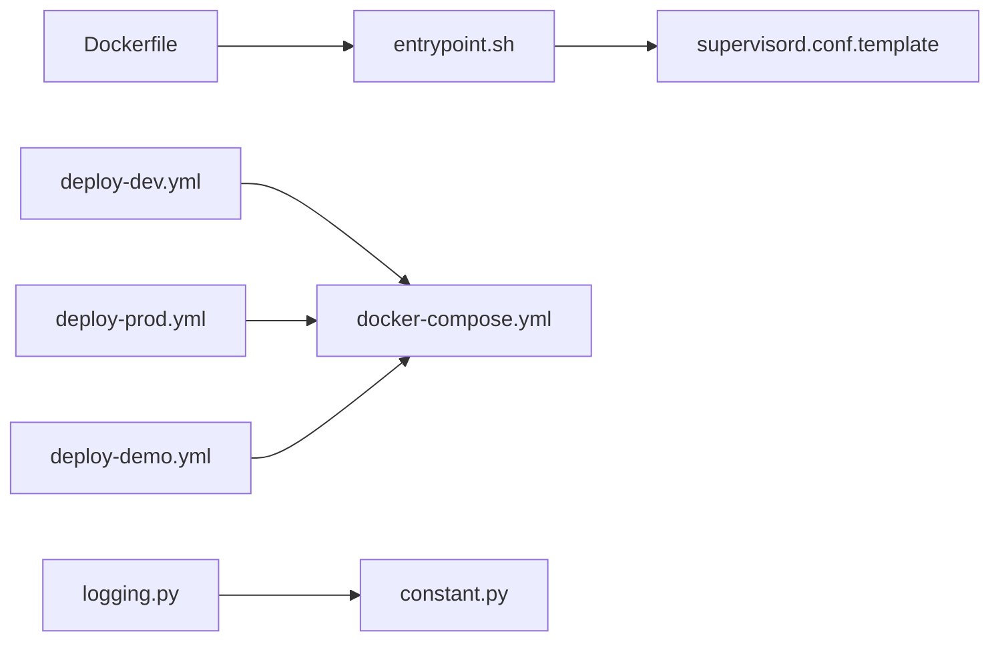

# 部署与运维

<cite>
**本文引用的文件**   
- [Dockerfile](file://copaw/deploy/Dockerfile)
- [docker-compose.yml](file://copaw/docker-compose.yml)
- [.dockerignore](file://copaw/.dockerignore)
- [entrypoint.sh](file://copaw/deploy/entrypoint.sh)
- [supervisord.conf.template](file://copaw/deploy/config/supervisord.conf.template)
- [docker_build.sh](file://copaw/scripts/docker_build.sh)
- [docker_sync_latest.sh](file://copaw/scripts/docker_sync_latest.sh)
- [pyproject.toml](file://copaw/pyproject.toml)
- [setup.py](file://copaw/setup.py)
- [deploy-dev.yml](file://.github/workflows/deploy-dev.yml)
- [deploy-prod.yml](file://.github/workflows/deploy-prod.yml)
- [deploy-demo.yml](file://.github/workflows/deploy-demo.yml)
- [logging.py](file://copaw/src/copaw/utils/logging.py)
- [constant.py](file://copaw/src/copaw/constant.py)
- [heartbeat.ts](file://copaw/console/src/api/types/heartbeat.ts)
- [heartbeat.ts（前端API封装）](file://copaw/console/src/api/modules/heartbeat.ts)
- [REST API/配置管理API.md](file://specs/copaw-repowiki/content/API参考/REST API/配置管理API.md)
- [监控与日志.md](file://specs/copaw-repowiki/content/部署运维/监控与日志.md)
- [调试与故障排除.md](file://specs/copaw-repowiki/content/开发指南/调试与故障排除.md)
- [db.py（示例）](file://modules-practice/module-04/backend/db.py)
- [config.py（示例）](file://modules-practice/module-05/backend/app/config.py)
</cite>

## 目录
1. [简介](#简介)
2. [项目结构](#项目结构)
3. [核心组件](#核心组件)
4. [架构总览](#架构总览)
5. [详细组件分析](#详细组件分析)
6. [依赖分析](#依赖分析)
7. [性能考虑](#性能考虑)
8. [故障排除指南](#故障排除指南)
9. [结论](#结论)
10. [附录](#附录)

## 简介
本指南面向部署与运维工程师，提供从容器化打包、编排部署、CI/CD流水线到生产环境性能优化、监控与日志、数据库与缓存、负载均衡、日志管理、错误追踪、故障排除、备份恢复与灾难恢复的全流程操作说明。文档基于仓库中的实际部署脚本、Docker镜像构建配置、Supervisord进程管理模板、GitHub Actions流水线以及日志与配置常量等文件进行梳理与总结。

## 项目结构
围绕部署与运维的关键文件分布如下：
- 容器化与编排
  - Dockerfile：多阶段构建，包含前端构建与Python运行时，安装Chromium与Supervisord，注入Supervisord模板与入口脚本。
  - docker-compose.yml：定义数据卷与服务端口映射，挂载工作目录与密钥目录。
  - .dockerignore：排除构建产物与开发缓存，仅保留必要的dist。
  - entrypoint.sh：替换Supervisord模板中的端口变量并启动Supervisord。
  - supervisord.conf.template：定义DBus、应用、Xvfb、XFCE4等程序及其日志与优先级。
- 构建与发布
  - docker_build.sh：多阶段构建镜像，支持通道白/黑名单构建参数，输出运行说明。
  - docker_sync_latest.sh：使用buildx imagetools将预发布镜像同步至latest标签。
- CI/CD
  - deploy-dev.yml：推送主分支触发开发/测试环境部署。
  - deploy-prod.yml：手动触发生产环境部署，支持分支选择与二次确认。
  - deploy-demo.yml：演示站部署，包括Nginx配置、Mock API与静态资源。
- 日志与配置
  - logging.py：日志命名空间、着色格式化、文件处理器与访问日志过滤。
  - constant.py：工作目录、密钥目录、心跳文件、日志级别、容器标识、CORS、并发与限流等环境变量解析与默认值。
- 前端API类型
  - heartbeat.ts：心跳配置类型定义。
  - heartbeat.ts（前端API封装）：前端对心跳配置接口的封装。

**图示来源**
- [Dockerfile:1-103](file://copaw/deploy/Dockerfile#L1-L103)
- [docker-compose.yml:1-23](file://copaw/docker-compose.yml#L1-L23)
- [.dockerignore:1-59](file://copaw/.dockerignore#L1-L59)
- [entrypoint.sh:1-10](file://copaw/deploy/entrypoint.sh#L1-L10)
- [supervisord.conf.template:1-40](file://copaw/deploy/config/supervisord.conf.template#L1-L40)
- [docker_build.sh:1-32](file://copaw/scripts/docker_build.sh#L1-L32)
- [docker_sync_latest.sh:1-77](file://copaw/scripts/docker_sync_latest.sh#L1-L77)
- [deploy-dev.yml:1-62](file://.github/workflows/deploy-dev.yml#L1-L62)
- [deploy-prod.yml:1-89](file://.github/workflows/deploy-prod.yml#L1-L89)
- [deploy-demo.yml:1-179](file://.github/workflows/deploy-demo.yml#L1-L179)
- [logging.py:1-185](file://copaw/src/copaw/utils/logging.py#L1-L185)
- [constant.py:1-271](file://copaw/src/copaw/constant.py#L1-L271)
- [heartbeat.ts:1-11](file://copaw/console/src/api/types/heartbeat.ts#L1-L11)
- [heartbeat.ts（前端API封装）:1-12](file://copaw/console/src/api/modules/heartbeat.ts#L1-L12)

**章节来源**
- [Dockerfile:1-103](file://copaw/deploy/Dockerfile#L1-L103)
- [docker-compose.yml:1-23](file://copaw/docker-compose.yml#L1-L23)
- [.dockerignore:1-59](file://copaw/.dockerignore#L1-L59)
- [entrypoint.sh:1-10](file://copaw/deploy/entrypoint.sh#L1-L10)
- [supervisord.conf.template:1-40](file://copaw/deploy/config/supervisord.conf.template#L1-L40)
- [docker_build.sh:1-32](file://copaw/scripts/docker_build.sh#L1-L32)
- [docker_sync_latest.sh:1-77](file://copaw/scripts/docker_sync_latest.sh#L1-L77)
- [deploy-dev.yml:1-62](file://.github/workflows/deploy-dev.yml#L1-L62)
- [deploy-prod.yml:1-89](file://.github/workflows/deploy-prod.yml#L1-L89)
- [deploy-demo.yml:1-179](file://.github/workflows/deploy-demo.yml#L1-L179)
- [logging.py:1-185](file://copaw/src/copaw/utils/logging.py#L1-L185)
- [constant.py:1-271](file://copaw/src/copaw/constant.py#L1-L271)
- [heartbeat.ts:1-11](file://copaw/console/src/api/types/heartbeat.ts#L1-L11)
- [heartbeat.ts（前端API封装）:1-12](file://copaw/console/src/api/modules/heartbeat.ts#L1-L12)

## 核心组件
- 容器镜像与运行时
  - 多阶段构建：前端构建阶段与运行时阶段分离，运行时包含Python、Chromium、Supervisord，并注入前端dist。
  - 环境变量：工作目录、密钥目录、端口、通道白/黑名单、容器标识等。
  - 进程管理：Supervisord管理DBus、应用、Xvfb、XFCE4，统一输出日志。
- 编排与持久化
  - docker-compose定义数据卷与端口映射，分别挂载工作目录与密钥目录，保障配置与状态持久化。
- 构建与发布
  - docker_build.sh支持通道过滤构建参数，输出运行说明。
  - docker_sync_latest.sh使用buildx imagetools将预发布镜像同步为latest标签。
- CI/CD流水线
  - 开发环境：推送主分支触发SSH远程部署脚本。
  - 生产环境：手动触发，支持分支选择与二次确认，SSH远程部署。
  - 演示站：部署Nginx配置、Mock API与静态资源，systemd管理服务。
- 日志与配置
  - logging.py：仅输出copaw命名空间日志，控制台着色与文件处理器按平台差异处理。
  - constant.py：工作目录、心跳文件、日志级别、容器标识、CORS、并发与限流等环境变量解析与默认值。

**章节来源**
- [Dockerfile:1-103](file://copaw/deploy/Dockerfile#L1-L103)
- [docker-compose.yml:1-23](file://copaw/docker-compose.yml#L1-L23)
- [docker_build.sh:1-32](file://copaw/scripts/docker_build.sh#L1-L32)
- [docker_sync_latest.sh:1-77](file://copaw/scripts/docker_sync_latest.sh#L1-L77)
- [deploy-dev.yml:1-62](file://.github/workflows/deploy-dev.yml#L1-L62)
- [deploy-prod.yml:1-89](file://.github/workflows/deploy-prod.yml#L1-L89)
- [deploy-demo.yml:1-179](file://.github/workflows/deploy-demo.yml#L1-L179)
- [logging.py:1-185](file://copaw/src/copaw/utils/logging.py#L1-L185)
- [constant.py:1-271](file://copaw/src/copaw/constant.py#L1-L271)

## 架构总览
下图展示容器化部署与进程管理的整体架构，以及CI/CD触发与远程部署的关系。

**图示来源**
- [docker_build.sh:1-32](file://copaw/scripts/docker_build.sh#L1-L32)
- [Dockerfile:1-103](file://copaw/deploy/Dockerfile#L1-L103)
- [docker-compose.yml:1-23](file://copaw/docker-compose.yml#L1-L23)
- [supervisord.conf.template:1-40](file://copaw/deploy/config/supervisord.conf.template#L1-L40)
- [deploy-dev.yml:1-62](file://.github/workflows/deploy-dev.yml#L1-L62)
- [deploy-prod.yml:1-89](file://.github/workflows/deploy-prod.yml#L1-L89)
- [deploy-demo.yml:1-179](file://.github/workflows/deploy-demo.yml#L1-L179)

## 详细组件分析

### 容器化与运行时
- 多阶段构建
  - 前端构建阶段：使用Node镜像构建console前端dist。
  - 运行时阶段：安装Python、Chromium、Supervisord、vim、gettext、Xfce4等依赖，注入前端dist，pip安装包，初始化默认配置。
- 环境变量与端口
  - 默认端口8088，可通过COPAW_PORT覆盖。
  - 通道白/黑名单：COPAW_ENABLED_CHANNELS/COPAW_DISABLED_CHANNELS。
  - 容器标识：COPAW_RUNNING_IN_CONTAINER。
- 进程管理
  - Supervisord模板定义DBus、应用、Xvfb、XFCE4程序，设置日志文件与优先级，保证Chromium无头运行与桌面环境可用。

**图示来源**
- [Dockerfile:1-103](file://copaw/deploy/Dockerfile#L1-L103)
- [entrypoint.sh:1-10](file://copaw/deploy/entrypoint.sh#L1-L10)
- [supervisord.conf.template:1-40](file://copaw/deploy/config/supervisord.conf.template#L1-L40)

**章节来源**
- [Dockerfile:1-103](file://copaw/deploy/Dockerfile#L1-L103)
- [entrypoint.sh:1-10](file://copaw/deploy/entrypoint.sh#L1-L10)
- [supervisord.conf.template:1-40](file://copaw/deploy/config/supervisord.conf.template#L1-L40)

### 编排与持久化
- 数据卷
  - copaw-data：工作目录（配置、会话、媒体等）。
  - copaw-secrets：密钥目录（敏感配置）。
- 端口映射
  - 本地回环绑定：127.0.0.1:8088:8088。
- 安全与隔离
  - .dockerignore排除开发缓存、测试、IDE与日志，仅保留必要dist与配置。

**章节来源**
- [docker-compose.yml:1-23](file://copaw/docker-compose.yml#L1-L23)
- [.dockerignore:1-59](file://copaw/.dockerignore#L1-L59)

### 构建与发布
- docker_build.sh
  - 支持通道白/黑名单构建参数，输出运行说明与端口覆盖方式。
- docker_sync_latest.sh
  - 使用buildx imagetools将预发布镜像同步为latest标签，支持阿里云镜像仓库与Docker Hub。

**章节来源**
- [docker_build.sh:1-32](file://copaw/scripts/docker_build.sh#L1-L32)
- [docker_sync_latest.sh:1-77](file://copaw/scripts/docker_sync_latest.sh#L1-L77)

### CI/CD流水线与自动化部署
- 开发环境部署（deploy-dev.yml）
  - 触发条件：推送main分支且匹配指定路径。
  - 执行步骤：SSH连接ECS，设置DEPLOY_*环境变量，执行部署脚本。
- 生产环境部署（deploy-prod.yml）
  - 触发方式：workflow_dispatch，支持选择分支与二次确认。
  - 执行步骤：SSH连接ECS，设置DEPLOY_*环境变量，执行部署脚本。
- 演示站部署（deploy-demo.yml）
  - 部署Nginx配置、Mock API与静态资源，systemd管理Mock API服务。

**图示来源**
- [deploy-dev.yml:1-62](file://.github/workflows/deploy-dev.yml#L1-L62)
- [deploy-prod.yml:1-89](file://.github/workflows/deploy-prod.yml#L1-L89)
- [deploy-demo.yml:1-179](file://.github/workflows/deploy-demo.yml#L1-L179)

**章节来源**
- [deploy-dev.yml:1-62](file://.github/workflows/deploy-dev.yml#L1-L62)
- [deploy-prod.yml:1-89](file://.github/workflows/deploy-prod.yml#L1-L89)
- [deploy-demo.yml:1-179](file://.github/workflows/deploy-demo.yml#L1-L179)

### 日志管理与监控
- 日志系统
  - 仅输出copaw命名空间日志，避免第三方库噪声。
  - 控制台输出：着色级别前缀、时间戳、消息体格式化、相对路径显示。
  - 文件输出：Windows/Linux使用简单文件处理器；macOS使用轮转文件处理器。
  - 访问日志过滤：可配置路径子串列表抑制uvicorn访问日志。
  - 动态级别设置：支持字符串映射到数值级别，通过环境变量在启动时生效。
- 配置与常量
  - 工作目录、密钥目录、心跳文件、日志级别、容器标识、CORS、并发与限流等环境变量解析与默认值。
- 监控与可观测性
  - Supervisord日志文件：app、xvfb、xfce4、dbus分别输出日志，便于定位问题。
  - 建议结合容器日志驱动与外部轮转策略，完善日志保留与清理。

**图示来源**
- [logging.py:104-185](file://copaw/src/copaw/utils/logging.py#L104-L185)

**章节来源**
- [logging.py:1-185](file://copaw/src/copaw/utils/logging.py#L1-L185)
- [constant.py:1-271](file://copaw/src/copaw/constant.py#L1-L271)
- [监控与日志.md:138-341](file://specs/copaw-repowiki/content/部署运维/监控与日志.md#L138-L341)
- [调试与故障排除.md:134-167](file://specs/copaw-repowiki/content/开发指南/调试与故障排除.md#L134-L167)

### 数据库与缓存
- 示例：SQLite（模块04）
  - 使用Flask g上下文管理数据库连接，行工厂为sqlite3.Row。
  - 初始化表结构：通知通道配置与消息模板。
- 示例：配置管理（模块05）
  - 开发/测试/生产三套配置，SQLALCHEMY_ECHO开关与调试相关设置。
- 建议
  - 生产环境可替换为PostgreSQL等高可用数据库。
  - 缓存可采用Redis或Memcached，结合连接池与健康检查。
  - 数据库迁移与备份策略需纳入CI/CD与运维流程。

**章节来源**
- [db.py（示例）:1-55](file://modules-practice/module-04/backend/db.py#L1-L55)
- [config.py（示例）:51-76](file://modules-practice/module-05/backend/app/config.py#L51-L76)

### 负载均衡与高可用
- 容器内无内置LB：应用通过Supervisord管理单实例进程。
- 建议
  - 在容器外使用Nginx/Traefik/HAProxy做反向代理与负载均衡。
  - 多副本部署时结合健康检查与自动重启策略。
  - 对Chromium无头运行与桌面环境需求，确保Xvfb/XFCE4在容器内可用。

**章节来源**
- [supervisord.conf.template:1-40](file://copaw/deploy/config/supervisord.conf.template#L1-L40)

### 心跳与配置热重载
- 前端类型与API
  - HeartbeatConfig：enabled、every、target、activeHours。
  - 前端API封装：GET/PUT /config/heartbeat。
- 后端API
  - GET /config/heartbeat：读取心跳配置（未配置时使用默认值）。
  - PUT /config/heartbeat：更新心跳配置（异步重新调度）。
- 使用场景
  - 配置变更后无需重启应用即可生效，提升运维效率。

**图示来源**
- [heartbeat.ts:1-11](file://copaw/console/src/api/types/heartbeat.ts#L1-L11)
- [heartbeat.ts（前端API封装）:1-12](file://copaw/console/src/api/modules/heartbeat.ts#L1-L12)
- [REST API/配置管理API.md:174-203](file://specs/copaw-repowiki/content/API参考/REST API/配置管理API.md#L174-L203)

**章节来源**
- [heartbeat.ts:1-11](file://copaw/console/src/api/types/heartbeat.ts#L1-L11)
- [heartbeat.ts（前端API封装）:1-12](file://copaw/console/src/api/modules/heartbeat.ts#L1-L12)
- [REST API/配置管理API.md:174-203](file://specs/copaw-repowiki/content/API参考/REST API/配置管理API.md#L174-L203)

## 依赖分析
- 组件耦合
  - Dockerfile与Supervisord模板强关联：端口由模板决定，entrypoint负责注入。
  - CI/CD流水线与远程部署脚本耦合：通过SSH执行部署脚本。
  - 日志系统与应用生命周期耦合：日志初始化贯穿应用启动与停止。
- 外部依赖
  - Docker/Supervisord/Chromium/Playwright等运行时依赖。
  - GitHub Actions与ECS服务器的SSH交互。

**图示来源**
- [Dockerfile:1-103](file://copaw/deploy/Dockerfile#L1-L103)
- [entrypoint.sh:1-10](file://copaw/deploy/entrypoint.sh#L1-L10)
- [supervisord.conf.template:1-40](file://copaw/deploy/config/supervisord.conf.template#L1-L40)
- [deploy-dev.yml:1-62](file://.github/workflows/deploy-dev.yml#L1-L62)
- [deploy-prod.yml:1-89](file://.github/workflows/deploy-prod.yml#L1-L89)
- [deploy-demo.yml:1-179](file://.github/workflows/deploy-demo.yml#L1-L179)
- [docker-compose.yml:1-23](file://copaw/docker-compose.yml#L1-L23)
- [logging.py:1-185](file://copaw/src/copaw/utils/logging.py#L1-L185)
- [constant.py:1-271](file://copaw/src/copaw/constant.py#L1-L271)

**章节来源**
- [Dockerfile:1-103](file://copaw/deploy/Dockerfile#L1-L103)
- [entrypoint.sh:1-10](file://copaw/deploy/entrypoint.sh#L1-L10)
- [supervisord.conf.template:1-40](file://copaw/deploy/config/supervisord.conf.template#L1-L40)
- [deploy-dev.yml:1-62](file://.github/workflows/deploy-dev.yml#L1-L62)
- [deploy-prod.yml:1-89](file://.github/workflows/deploy-prod.yml#L1-L89)
- [deploy-demo.yml:1-179](file://.github/workflows/deploy-demo.yml#L1-L179)
- [docker-compose.yml:1-23](file://copaw/docker-compose.yml#L1-L23)
- [logging.py:1-185](file://copaw/src/copaw/utils/logging.py#L1-L185)
- [constant.py:1-271](file://copaw/src/copaw/constant.py#L1-L271)

## 性能考虑
- 并发与限流
  - LLM最大并发、每分钟查询数（QPM）、速率限制暂停与抖动、获取信号量超时等参数可在环境变量中配置与调优。
- 日志与I/O
  - 文件处理器按平台差异选择，避免锁竞争；macOS使用轮转处理器。
- 进程与资源
  - Supervisord管理多个程序，注意优先级与资源分配；Chromium无头运行需Xvfb支持。
- 建议
  - 生产环境开启容器日志驱动与外部轮转策略。
  - 结合Prometheus/Grafana或APM工具进行指标采集与告警。

**章节来源**
- [constant.py:184-246](file://copaw/src/copaw/constant.py#L184-L246)
- [logging.py:142-185](file://copaw/src/copaw/utils/logging.py#L142-L185)

## 故障排除指南
- 日志级别无效
  - 检查COPAW_LOG_LEVEL是否正确设置，确认启动时已读取。
- 日志未落盘
  - 确认应用生命周期中已调用添加文件处理器，检查工作目录权限与路径。
- 遥测未上传
  - 网络不可达或超时属于预期行为；检查标记文件是否存在且版本一致。
- Supervisord程序未启动
  - 检查autostart/autorestart与优先级，查看对应stdout/stderr日志文件。
- 进程查找失败
  - Windows平台回退到WMIC方案；类Unix平台确认ps命令可用。
- 容器端口冲突
  - 修改COPAW_PORT与docker-compose端口映射，避免冲突。
- 通道不可用
  - 检查COPAW_ENABLED_CHANNELS/COPAW_DISABLED_CHANNELS配置，确认所需依赖已安装。

**章节来源**
- [监控与日志.md:316-341](file://specs/copaw-repowiki/content/部署运维/监控与日志.md#L316-L341)
- [调试与故障排除.md:134-167](file://specs/copaw-repowiki/content/开发指南/调试与故障排除.md#L134-L167)
- [supervisord.conf.template:1-40](file://copaw/deploy/config/supervisord.conf.template#L1-L40)

## 结论
本指南基于仓库中的实际部署与运维文件，给出了从容器化打包、编排、CI/CD到日志与监控、数据库与缓存、负载均衡、心跳与配置热重载的完整操作说明。建议在生产环境中结合容器日志驱动与外部轮转策略、数据库高可用与备份恢复方案、以及完善的监控告警体系，确保系统的稳定性与可维护性。

## 附录
- 配置差异与注意事项
  - 开发环境：允许CORS Origins列表、调试信息较多；禁用OpenAPI文档。
  - 生产环境：关闭CORS Origins、禁用OpenAPI文档；严格日志级别与文件轮转。
  - 演示站：独立Nginx配置与Mock API，便于快速验证。
- 备份与灾难恢复
  - 数据卷备份：定期备份copaw-data与copaw-secrets。
  - 镜像与标签：使用docker_sync_latest.sh保持latest标签一致性。
  - 回滚策略：结合CI/CD与SSH部署脚本，支持快速回滚。

**章节来源**
- [constant.py:146-182](file://copaw/src/copaw/constant.py#L146-L182)
- [docker_sync_latest.sh:1-77](file://copaw/scripts/docker_sync_latest.sh#L1-L77)
- [deploy-demo.yml:1-179](file://.github/workflows/deploy-demo.yml#L1-L179)