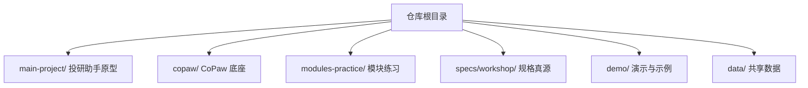
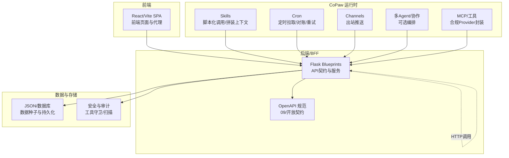
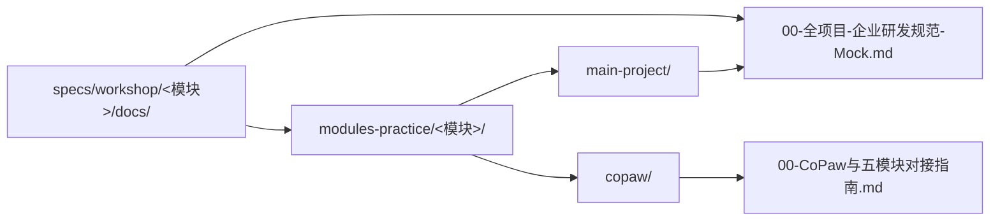
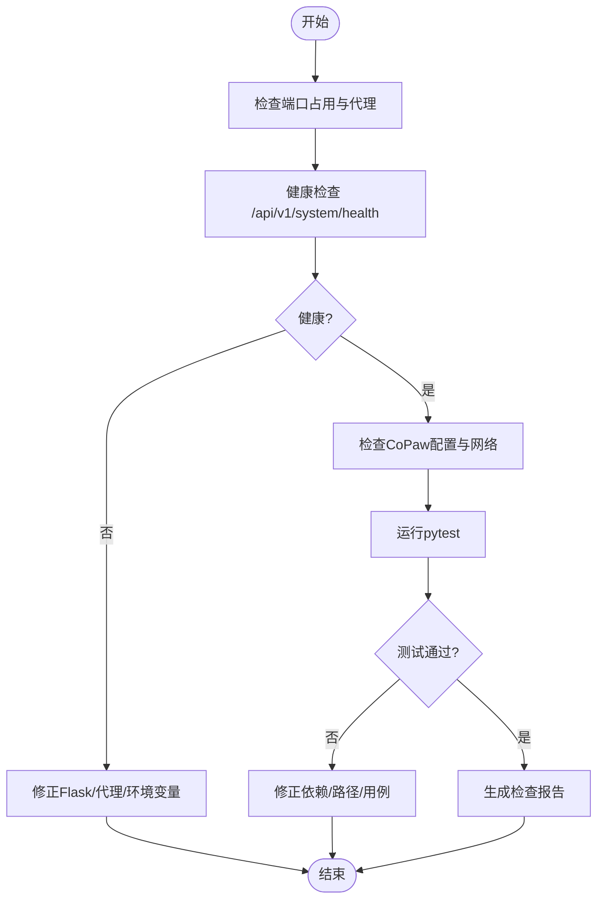

# 学习路径规划

<cite>
**本文引用的文件**
- [README.md](file://README.md)
- [AGENTS.md](file://AGENTS.md)
- [modules-practice/README.md](file://modules-practice/README.md)
- [modules-practice/WORKSHOP-五天一页纸.md](file://modules-practice/WORKSHOP-五天一页纸.md)
- [specs/workshop/README.md](file://specs/workshop/README.md)
- [specs/workshop/module-01-investment-assistant/README.md](file://specs/workshop/module-01-investment-assistant/README.md)
- [specs/workshop/module-03-knowledge-copaw/README.md](file://specs/workshop/module-03-knowledge-copaw/README.md)
- [specs/workshop/module-05-multi-agent/README.md](file://specs/workshop/module-05-multi-agent/README.md)
- [specs/workshop/00-全项目-企业研发规范-Mock.md](file://specs/workshop/00-全项目-企业研发规范-Mock.md)
- [specs/workshop/00-CoPaw与五模块对接指南.md](file://specs/workshop/00-CoPaw与五模块对接指南.md)
- [main-project/README.md](file://main-project/README.md)
- [modules-practice/module-01-investment-assistant/README.md](file://modules-practice/module-01-investment-assistant/README.md)
- [modules-practice/module-02/README.md](file://modules-practice/module-02/README.md)
- [modules-practice/module-04/README.md](file://modules-practice/module-04/README.md)
- [scripts/workshop-checker.py](file://scripts/workshop-checker.py)
- [copaw/README.md](file://copaw/README.md)
</cite>

## 目录
1. [引言](#引言)
2. [项目结构](#项目结构)
3. [核心组件](#核心组件)
4. [架构总览](#架构总览)
5. [详细组件分析](#详细组件分析)
6. [依赖分析](#依赖分析)
7. [性能考虑](#性能考虑)
8. [故障排查指南](#故障排查指南)
9. [结论](#结论)
10. [附录](#附录)

## 引言
本学习路径面向“5天IRA Workshop”的渐进式培训，围绕主应用（ira/）、CoPaw底座、模块练习（modules-practice/）与规格文档（specs/workshop/）协同设计，帮助不同背景学员建立从“界面到契约、从实现到规范”的完整认知闭环。课程采用“一页纸”路线图，明确每日主题、产出与验收标准，并通过模块化练习与统一规格真源，形成“主线对照 + 深度专项”的教学结构。

## 项目结构
- 顶层仓库包含主项目、CoPaw底座、模块练习、演示与示例、规格文档与数据目录，形成“原型 + 底座 + 练习 + 规格 + 演示”的一体化布局。
- 五天路线图与每日产出集中于“modules-practice/WORKSHOP-五天一页纸.md”，模块索引与入口位于“modules-practice/README.md”，规格真源位于“specs/workshop/”。

图表来源
- [README.md:13-26](file://README.md#L13-L26)
- [AGENTS.md:10-22](file://AGENTS.md#L10-L22)

章节来源
- [README.md:13-26](file://README.md#L13-L26)
- [AGENTS.md:10-22](file://AGENTS.md#L10-L22)

## 核心组件
- 主项目（ira/）：Flask + Vite 前端，OpenAPI 对齐，提供可运行原型与测试体系。
- CoPaw 底座：多Agent、多渠道、技能扩展、安全与本地模型能力，作为运行时编排与扩展层。
- 模块练习（modules-practice/）：按M1～M5拆分的独立练习包，配套specs/workshop中的规格真源。
- 规格文档（specs/workshop/）：统一的契约真源，涵盖Proposal/Spec/TC/任务地图/OpenAPI等。
- 演示与示例（demo/、samples/）：静态站、Mock API与集成样例，支撑CI/CD与演示。

章节来源
- [main-project/README.md:1-47](file://main-project/README.md#L1-L47)
- [copaw/README.md:1-526](file://copaw/README.md#L1-L526)
- [modules-practice/README.md:1-38](file://modules-practice/README.md#L1-L38)
- [specs/workshop/README.md:1-37](file://specs/workshop/README.md#L1-L37)

## 架构总览
整体采用“BFF + 多模块 + CoPaw编排”的协作架构：模块API契约以各模块09与openapi为准，CoPaw作为运行时“胶水层”负责定时、封装、通道与可选多Agent编排，不替代业务真源与合规规则。

图表来源
- [specs/workshop/00-全项目-企业研发规范-Mock.md:49-87](file://specs/workshop/00-全项目-企业研发规范-Mock.md#L49-L87)
- [specs/workshop/00-CoPaw与五模块对接指南.md:11-26](file://specs/workshop/00-CoPaw与五模块对接指南.md#L11-L26)

章节来源
- [specs/workshop/00-全项目-企业研发规范-Mock.md:49-87](file://specs/workshop/00-全项目-企业研发规范-Mock.md#L49-L87)
- [specs/workshop/00-CoPaw与五模块对接指南.md:11-26](file://specs/workshop/00-CoPaw与五模块对接指南.md#L11-L26)

## 详细组件分析

### 第一天：认识原型与数据边界
- 学习目标
  - 熟悉主项目（ira/）前后端与OpenAPI边界，理解演示数据与生产数据的红线。
  - 通过CoPaw控制台快速扫描渠道、Skills与模型配置，建立“运行时扩展”的初步认知。
- 核心知识点
  - 本地启动与代理：前端代理到后端5000端口，健康检查与基本页面。
  - CoPaw控制台：渠道启用、Skills触发方式、模型Provider配置（不展示真实Key）。
- 实践任务
  - 本地跑通主项目前后端，完成1条主流程草图。
  - 在CoPaw控制台完成“渠道/技能/模型”扫描清单。
- 交付物
  - 本地可运行截图、流程草图、CoPaw控制台扫描记录。
- 评估标准（课堂打勾）
  - 至少满足2/3：跑通前后端、明确演示数据边界、完成1张主流程草图。

章节来源
- [main-project/README.md:9-31](file://main-project/README.md#L9-L31)
- [AGENTS.md:397-423](file://AGENTS.md#L397-L423)
- [copaw/README.md:109-125](file://copaw/README.md#L109-L125)
- [modules-practice/WORKSHOP-五天一页纸.md:24-32](file://modules-practice/WORKSHOP-五天一页纸.md#L24-L32)

### 第二天：从界面回到契约：API与模块边界
- 学习目标
  - 从界面回到契约，定位核心API，理解蓝图与OpenAPI的对应关系。
  - 运行pytest，理解测试策略与质量门禁。
- 核心知识点
  - 蓝图拆分与域划分：backend/app/blueprints/。
  - OpenAPI对齐：/api/v1路径与契约一致性。
  - 测试：pytest执行与覆盖率/门禁。
- 实践任务
  - 任选1条用户路径，写出Given/When/Then验收草案。
  - 定位1条核心API，写出契约要点；运行pytest并记录结果。
- 交付物
  - 验收草案（Given/When/Then）、API契约要点、pytest执行截图。
- 评估标准（课堂打勾）
  - 至少满足2/3：定位1条核心API、写出1条Given/When/Then、完成1次后端测试执行。

章节来源
- [AGENTS.md:397-423](file://AGENTS.md#L397-L423)
- [main-project/README.md:32-38](file://main-project/README.md#L32-L38)
- [modules-practice/WORKSHOP-五天一页纸.md:24-32](file://modules-practice/WORKSHOP-五天一页纸.md#L24-L32)

### 第三天：知识库与AI底座分工
- 学习目标
  - 参与Proposal/Spec评审，明确CoPaw与BFF职责边界。
  - 通读冻结Spec，理解“技能/工作流/对话入口 vs BFF契约”的分工。
- 核心知识点
  - M3规格包：Proposal → Spec（冻结）→ TC → 任务地图 → Tasks → OpenAPI。
  - CoPaw能力：Skills、Workflow、对话入口；BFF负责REST、入库与组装。
- 实践任务
  - 完成M3 Proposal/Spec/TC口径一致性核对；跑通1条问答链路；记录1条范围外决策。
- 交付物
  - 规格评审记录、问答链路演示、范围外决策清单。
- 评估标准（课堂打勾）
  - 至少满足2/3：M3 Proposal/Spec/TC口径一致、跑通1条问答链路、记录1条范围外决策。

章节来源
- [specs/workshop/module-03-knowledge-copaw/README.md:1-18](file://specs/workshop/module-03-knowledge-copaw/README.md#L1-L18)
- [specs/workshop/README.md:7-17](file://specs/workshop/README.md#L7-L17)
- [specs/workshop/00-全项目-企业研发规范-Mock.md:49-87](file://specs/workshop/00-全项目-企业研发规范-Mock.md#L49-L87)
- [modules-practice/WORKSHOP-五天一页纸.md:24-32](file://modules-practice/WORKSHOP-五天一页纸.md#L24-L32)

### 第四天：数据集成与扩展能力
- 学习目标
  - 理解多源数据“来源—用途—留存—合规”四列简表，掌握降级策略。
  - 跟练Glue管道代码，了解模块05多Agent后端结构。
- 核心知识点
  - M2：GlueCoding多源采集、清洗、调度与可观测；Cron/Skill触发BFF，MCP封装合规Provider。
  - M4：多渠道推送样例，与课程Spec对齐。
  - M5：多Agent投研平台练习，理解后端结构与编排策略。
- 实践任务
  - 完成M2或M4的端到端演示；说明降级策略；完成1条模块对照结论。
- 交付物
  - 端到端演示截图、降级策略说明、模块对照结论。
- 评估标准（课堂打勾）
  - 至少满足2/3：完成M2或M4端到端演示、说明降级策略、完成1条模块对照结论。

章节来源
- [modules-practice/module-02/README.md:1-45](file://modules-practice/module-02/README.md#L1-L45)
- [modules-practice/module-04/README.md:1-75](file://modules-practice/module-04/README.md#L1-L75)
- [specs/workshop/module-05-multi-agent/README.md:1-27](file://specs/workshop/module-05-multi-agent/README.md#L1-L27)
- [specs/workshop/00-CoPaw与五模块对接指南.md:11-26](file://specs/workshop/00-CoPaw与五模块对接指南.md#L11-L26)
- [modules-practice/WORKSHOP-五天一页纸.md:24-32](file://modules-practice/WORKSHOP-五天一页纸.md#L24-L32)

### 第五天：从代码到环境：部署与质量
- 学习目标
  - 理解Demo环境与真实生产的差异，掌握CI/CD流程与质量工具。
  - 配置pre-commit，完成部署/运行演示与问题清单。
- 核心知识点
  - Demo部署：Nginx配置、Mock API、systemd服务与GitHub Actions。
  - CI/CD：deploy-demo.yml等工作流；ECS部署流程。
  - 代码质量：pre-commit钩子、Black/isort/ESLint/Prettier等。
- 实践任务
  - 读通1条GitHub Actions流程；完成部署/运行演示；输出问题清单与优先级。
- 交付物
  - CI流程说明、部署演示截图、问题清单与优先级。
- 评估标准（课堂打勾）
  - 至少满足2/3：完成部署/运行演示、输出问题清单与优先级、完成课程复盘与后续计划。

章节来源
- [AGENTS.md:239-271](file://AGENTS.md#L239-L271)
- [AGENTS.md:288-311](file://AGENTS.md#L288-L311)
- [modules-practice/WORKSHOP-五天一页纸.md:24-32](file://modules-practice/WORKSHOP-五天一页纸.md#L24-L32)

## 依赖分析
- 规模与耦合
  - 规格真源（specs/workshop/）与练习代码（modules-practice/）分离，降低耦合，便于评审与版本管理。
  - 主项目（ira/）与CoPaw底座并行存在，通过HTTP调用共享契约，避免重复实现。
- 外部依赖与集成点
  - CoPaw：Skills、Cron、Channels、MCP、多Agent等运行时能力。
  - 云资源：阿里云部分服务（ECS、RDS、OSS、SLS、API网关、百炼/灵积Key等）。
- 潜在循环依赖
  - 通过“契约真源优先级”与“HTTP调用”避免循环依赖：模块09与openapi为真源，CoPaw仅作为胶水层调用。

图表来源
- [specs/workshop/README.md:19-31](file://specs/workshop/README.md#L19-L31)
- [specs/workshop/00-CoPaw与五模块对接指南.md:21-26](file://specs/workshop/00-CoPaw与五模块对接指南.md#L21-L26)
- [specs/workshop/00-全项目-企业研发规范-Mock.md:49-87](file://specs/workshop/00-全项目-企业研发规范-Mock.md#L49-L87)

章节来源
- [specs/workshop/README.md:19-31](file://specs/workshop/README.md#L19-L31)
- [specs/workshop/00-CoPaw与五模块对接指南.md:21-26](file://specs/workshop/00-CoPaw与五模块对接指南.md#L21-L26)
- [specs/workshop/00-全项目-企业研发规范-Mock.md:49-87](file://specs/workshop/00-全项目-企业研发规范-Mock.md#L49-L87)

## 性能考虑
- 接口与数据模型
  - 以模块09与openapi为契约真源，确保前后端一致，减少不必要往返。
- 运行时扩展
  - CoPaw仅作为“胶水层”，避免将简单CRUD、鉴权中间件搬进Agent循环，防止绕路带来的延迟与复杂度。
- 本地与云资源
  - 本地模型（llama.cpp/Ollama/LM Studio）可降低网络抖动影响；云端服务需关注带宽与并发。

## 故障排查指南
- 常见问题
  - 端口冲突：优先调整本地PORT并在演示说明中标注。
  - API不可用：检查代理、Flask端口（5000）、健康检查路径。
  - CoPaw无法连接：确认Provider配置、网络连通与容器host绑定。
  - 测试失败：检查pytest依赖、PYTHONPATH与测试文件命名。
- 自动检查与评分
  - 使用workshop-checker.py进行Spec文档检查、代码检查与追溯链检查，生成排行榜与JSON报告，便于课堂评估与反馈。

图表来源
- [scripts/workshop-checker.py:1-485](file://scripts/workshop-checker.py#L1-L485)

章节来源
- [scripts/workshop-checker.py:1-485](file://scripts/workshop-checker.py#L1-L485)

## 结论
本学习路径以“一页纸”路线图为纲，结合主项目原型、CoPaw底座与模块练习，形成“从界面到契约、从实现到规范”的闭环。通过统一规格真源与课堂验收打勾，确保学员在5天内达成“理解边界—定位契约—掌握编排—落地部署”的学习目标，并为后续深化（如多Agent投研、知识库问答）奠定基础。

## 附录
- 个性化学习建议
  - 初学者：优先完成主项目前后端跑通与CoPaw控制台扫描，再逐步深入模块练习。
  - 有经验开发者：重点关注契约真源与HTTP调用一致性，强化CoPaw胶水层最佳实践。
  - 系统架构师：聚焦“BFF契约真源 + CoPaw运行时边界”，评估模块间集成与降级策略。
- 学习进度跟踪与评估
  - 每日验收打勾：D1-D5各阶段至少满足2/3通过标准。
  - 自动检查：使用workshop-checker.py生成报告，支持排行榜与JSON导出。
- 最终交付物
  - 每日产出物清单与模块对照结论；M3规格评审记录；M2/M4端到端演示；部署/运行演示与问题清单。

章节来源
- [modules-practice/WORKSHOP-五天一页纸.md:57-66](file://modules-practice/WORKSHOP-五天一页纸.md#L57-L66)
- [scripts/workshop-checker.py:427-485](file://scripts/workshop-checker.py#L427-L485)