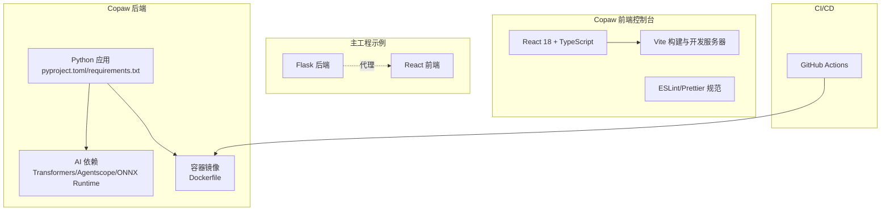
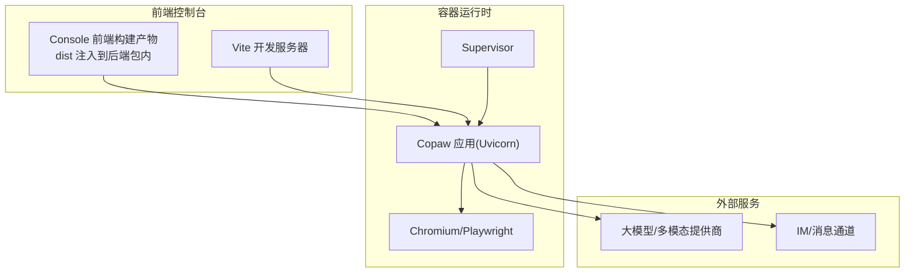
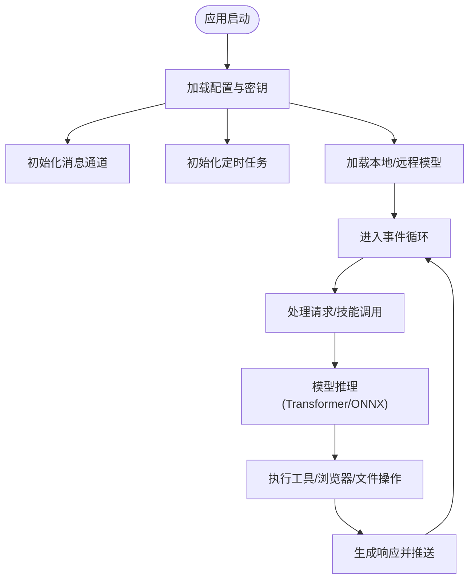
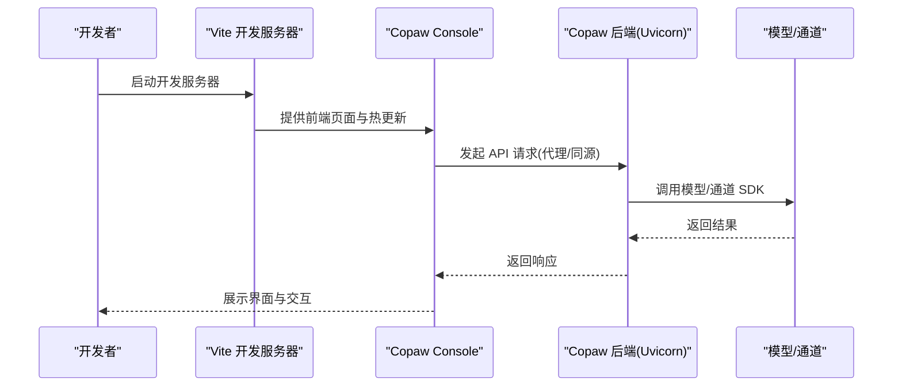
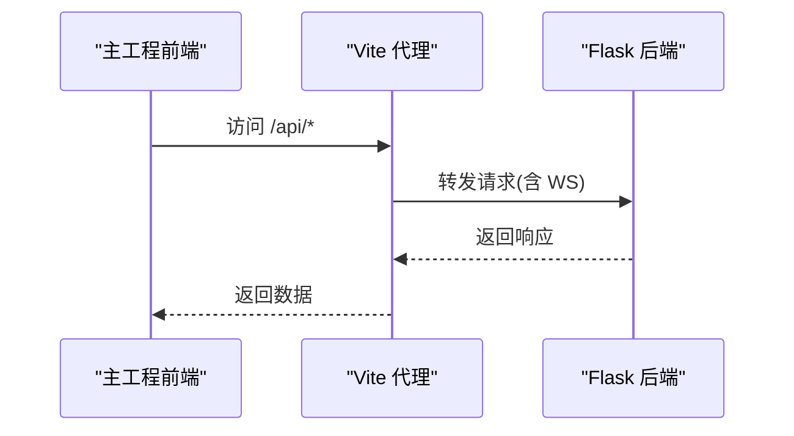
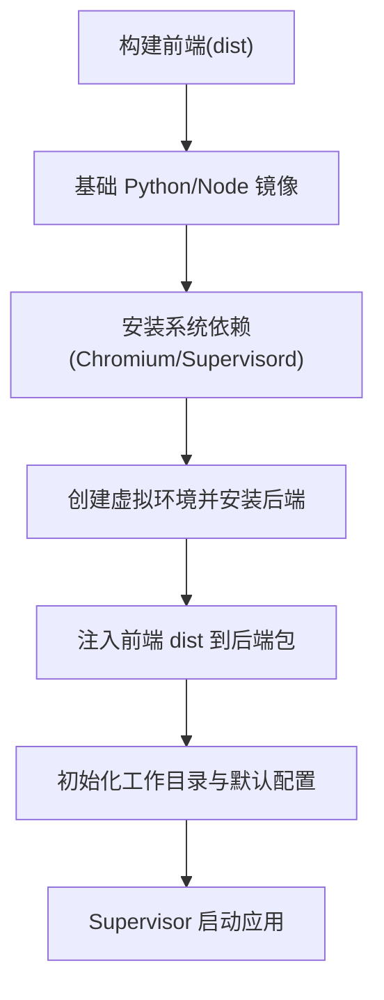
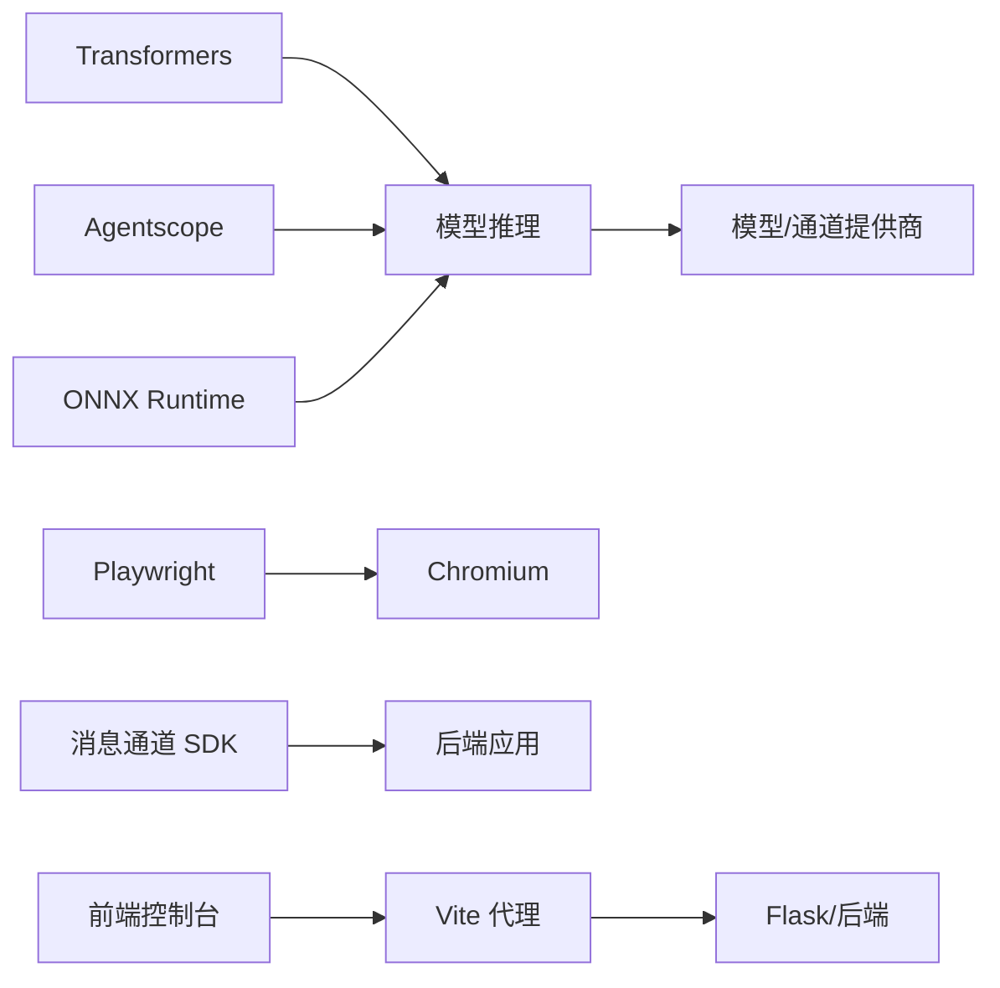

# 技术栈概览

<cite>
**本文引用的文件**
- [copaw/pyproject.toml](file://copaw/pyproject.toml)
- [copaw/console/package.json](file://copaw/console/package.json)
- [copaw/console/vite.config.ts](file://copaw/console/vite.config.ts)
- [copaw/console/tsconfig.json](file://copaw/console/tsconfig.json)
- [copaw/console/tsconfig.app.json](file://copaw/console/tsconfig.app.json)
- [copaw/console/tsconfig.node.json](file://copaw/console/tsconfig.node.json)
- [copaw/console/eslint.config.js](file://copaw/console/eslint.config.js)
- [copaw/deploy/Dockerfile](file://copaw/deploy/Dockerfile)
- [main-project/backend/requirements.txt](file://main-project/backend/requirements.txt)
- [main-project/frontend/package.json](file://main-project/frontend/package.json)
- [main-project/frontend/vite.config.ts](file://main-project/frontend/vite.config.ts)
- [main-project/frontend/tsconfig.json](file://main-project/frontend/tsconfig.json)
- [.github/workflows/deploy-prod.yml](file://.github/workflows/deploy-prod.yml)
</cite>

## 目录
1. [简介](#简介)
2. [项目结构](#项目结构)
3. [核心组件](#核心组件)
4. [架构总览](#架构总览)
5. [详细组件分析](#详细组件分析)
6. [依赖分析](#依赖分析)
7. [性能考虑](#性能考虑)
8. [故障排查指南](#故障排查指南)
9. [结论](#结论)
10. [附录](#附录)

## 简介
本文件为 IRA 项目的“技术栈概览”，聚焦后端（Python、FastAPI/Flask、SQLAlchemy 等）、前端（React 18、Vite、TypeScript 等）、AI 相关（Transformers、Agentscope、ONNX Runtime 等），以及开发与部署工具链（Docker、GitHub Actions、ESLint、Prettier 等）。文档旨在帮助开发者理解技术选型的背景、优势与协作关系，并提供版本兼容性与升级路径建议。

## 项目结构
IRA 仓库包含多个子项目与示例模块，其中与技术栈直接相关的关键部分如下：
- 后端（Copaw 主体）：Python 包与 CLI，集成 AI 能力与多通道能力；同时提供容器化运行方案。
- 前端控制台（Copaw Console）：基于 React 18 + TypeScript 的管理界面，由 Vite 构建。
- 主工程（main-project）：包含独立的 Flask 后端与 React 前端示例，便于理解前后端分离与代理配置。
- 工作流与部署：GitHub Actions 工作流用于手动部署到生产环境；Dockerfile 提供多阶段构建与运行时环境。

图表来源
- [copaw/pyproject.toml:1-107](file://copaw/pyproject.toml#L1-L107)
- [copaw/console/package.json:1-60](file://copaw/console/package.json#L1-L60)
- [copaw/console/vite.config.ts:1-49](file://copaw/console/vite.config.ts#L1-L49)
- [main-project/backend/requirements.txt:1-7](file://main-project/backend/requirements.txt#L1-L7)
- [main-project/frontend/package.json:1-25](file://main-project/frontend/package.json#L1-L25)
- [copaw/deploy/Dockerfile:1-103](file://copaw/deploy/Dockerfile#L1-L103)
- [.github/workflows/deploy-prod.yml:1-89](file://.github/workflows/deploy-prod.yml#L1-L89)

章节来源
- [copaw/pyproject.toml:1-107](file://copaw/pyproject.toml#L1-L107)
- [copaw/console/package.json:1-60](file://copaw/console/package.json#L1-L60)
- [copaw/console/vite.config.ts:1-49](file://copaw/console/vite.config.ts#L1-L49)
- [main-project/backend/requirements.txt:1-7](file://main-project/backend/requirements.txt#L1-L7)
- [main-project/frontend/package.json:1-25](file://main-project/frontend/package.json#L1-L25)
- [main-project/frontend/vite.config.ts:1-26](file://main-project/frontend/vite.config.ts#L1-L26)
- [copaw/deploy/Dockerfile:1-103](file://copaw/deploy/Dockerfile#L1-L103)
- [.github/workflows/deploy-prod.yml:1-89](file://.github/workflows/deploy-prod.yml#L1-L89)

## 核心组件
- 后端技术栈（Copaw）
  - 语言与框架：Python（3.10–3.13），Uvicorn（ASGI 服务器），集成多种渠道 SDK 与调度器。
  - AI/模型推理：Transformers、Agentscope、ONNX Runtime、Google GenAI、ModelScope、HuggingFace Hub。
  - 数据与工具：PyYAML、JSON Repair、Segno、Pillow、apScheduler、Playwright、PyWebview 等。
  - 可选后端：llama-cpp-python、mlx-lm（macOS）、ollama、openai-whisper。
- 前端技术栈（Copaw Console）
  - React 18、TypeScript、Ant Design、Zustand、React Router、Less、i18n。
  - 构建与开发：Vite、ESLint、Prettier、TypeScript 编译。
- 主工程（main-project）
  - 后端：Flask、Flask-CORS、pytest、requests、python-dotenv。
  - 前端：React 18、React Router、TypeScript、Vite。
- 部署与工具链
  - 容器：Docker 多阶段构建，Supervisor 管理进程，Chromium 支持自动化。
  - CI/CD：GitHub Actions 手动部署工作流。
  - 代码质量：ESLint、Prettier、pytest、pytest-asyncio、pre-commit。

章节来源
- [copaw/pyproject.toml:1-107](file://copaw/pyproject.toml#L1-L107)
- [copaw/console/package.json:1-60](file://copaw/console/package.json#L1-L60)
- [main-project/backend/requirements.txt:1-7](file://main-project/backend/requirements.txt#L1-L7)
- [main-project/frontend/package.json:1-25](file://main-project/frontend/package.json#L1-L25)
- [copaw/deploy/Dockerfile:1-103](file://copaw/deploy/Dockerfile#L1-L103)

## 架构总览
下图展示 Copaw 后端与前端控制台的协作关系，以及容器化运行时与外部服务的交互。

图表来源
- [copaw/deploy/Dockerfile:1-103](file://copaw/deploy/Dockerfile#L1-L103)
- [copaw/console/vite.config.ts:1-49](file://copaw/console/vite.config.ts#L1-L49)

## 详细组件分析

### 后端（Copaw）技术栈与协作
- 语言与运行时
  - Python 版本约束：>=3.10,<3.14，确保与新特性与第三方库兼容。
  - ASGI 服务器：Uvicorn，支持高性能异步请求处理。
- AI 与推理
  - Transformers：文本与多模态处理。
  - Agentscope：多智能体框架与运行时。
  - ONNX Runtime：跨平台推理加速（上限版本限制避免不兼容）。
  - Google GenAI、ModelScope、HuggingFace Hub：接入云端/开源模型生态。
- 通道与自动化
  - Playwright + PyWebview：网页自动化与桌面截图。
  - 多 IM SDK：Discord、Telegram、钉钉、飞书、企业微信、QQ、Matrix 等。
- 调度与任务
  - apscheduler：定时任务与心跳检测。
- 数据与安全
  - PyYAML、JSON Repair、Segno（二维码）、Pillow（图像处理）。
  - 安全扫描与工具守卫规则在包内打包，便于离线部署。

图表来源
- [copaw/pyproject.toml:1-107](file://copaw/pyproject.toml#L1-L107)

章节来源
- [copaw/pyproject.toml:1-107](file://copaw/pyproject.toml#L1-L107)

### 前端控制台（Copaw Console）技术栈与协作
- 框架与状态
  - React 18、TypeScript、Ant Design、Zustand、i18n。
- 构建与开发体验
  - Vite 提供快速热更新与生产构建；ESLint 与 Prettier 保证代码风格一致。
  - Less 支持样式预处理；路由使用 React Router。
- 开发服务器与代理
  - Vite 开发服务器监听 5173；可通过环境变量注入 API 基础地址，构建时注入常量。
- 与后端的集成
  - 控制台构建产物被复制进后端包目录，容器运行时由 Uvicorn 提供静态资源服务。

图表来源
- [copaw/console/vite.config.ts:1-49](file://copaw/console/vite.config.ts#L1-L49)
- [copaw/console/package.json:1-60](file://copaw/console/package.json#L1-L60)

章节来源
- [copaw/console/package.json:1-60](file://copaw/console/package.json#L1-L60)
- [copaw/console/vite.config.ts:1-49](file://copaw/console/vite.config.ts#L1-L49)
- [copaw/console/tsconfig.json:1-8](file://copaw/console/tsconfig.json#L1-L8)
- [copaw/console/tsconfig.app.json:1-31](file://copaw/console/tsconfig.app.json#L1-L31)
- [copaw/console/tsconfig.node.json:1-23](file://copaw/console/tsconfig.node.json#L1-L23)
- [copaw/console/eslint.config.js:1-29](file://copaw/console/eslint.config.js#L1-L29)

### 主工程（main-project）前后端分离与代理
- 后端（Flask）
  - 使用 Flask 3.x，启用 CORS，提供测试与请求库支持。
- 前端（React）
  - React 18、TypeScript、Vite，路由使用 React Router。
- 代理配置
  - Vite 代理将 /api 前缀转发至后端地址，支持 WebSocket。

图表来源
- [main-project/frontend/vite.config.ts:1-26](file://main-project/frontend/vite.config.ts#L1-L26)
- [main-project/backend/requirements.txt:1-7](file://main-project/backend/requirements.txt#L1-L7)
- [main-project/frontend/package.json:1-25](file://main-project/frontend/package.json#L1-L25)

章节来源
- [main-project/frontend/vite.config.ts:1-26](file://main-project/frontend/vite.config.ts#L1-L26)
- [main-project/backend/requirements.txt:1-7](file://main-project/backend/requirements.txt#L1-L7)
- [main-project/frontend/package.json:1-25](file://main-project/frontend/package.json#L1-L25)

### 容器化与部署
- 多阶段构建
  - 第一阶段：Node 基础镜像构建前端控制台，输出 dist。
  - 第二阶段：安装 Python、Chromium、supervisord，创建虚拟环境，安装后端包（带可选依赖），注入前端 dist。
- 运行时
  - Supervisor 管理进程；Chromium 以系统浏览器方式运行，禁用下载以复用已安装版本。
  - 环境变量控制端口、工作目录与通道白名单/黑名单。
- 生产部署
  - GitHub Actions 手动触发，通过 SSH 在目标服务器执行部署脚本，支持分支选择与部署确认。

图表来源
- [copaw/deploy/Dockerfile:1-103](file://copaw/deploy/Dockerfile#L1-L103)

章节来源
- [copaw/deploy/Dockerfile:1-103](file://copaw/deploy/Dockerfile#L1-L103)
- [.github/workflows/deploy-prod.yml:1-89](file://.github/workflows/deploy-prod.yml#L1-L89)

## 依赖分析
- 后端依赖关系
  - AI 推理链路：Transformers/Agentscope/ONNX Runtime → 模型提供方（Google GenAI/ModelScope/HuggingFace Hub）。
  - 自动化链路：Playwright → Chromium → 浏览器操作。
  - 通道集成：各 IM SDK 与消息通道管理器。
- 前端依赖关系
  - Ant Design + Antd Style 提供 UI 基础；Zustand 管理全局状态；i18n 支持多语言。
  - Vite 作为构建与开发工具；ESLint/Prettier 保障代码质量。
- 主工程前后端
  - 前端通过 Vite 代理访问后端 API；后端启用 CORS 以便跨域。

图表来源
- [copaw/pyproject.toml:1-107](file://copaw/pyproject.toml#L1-L107)
- [main-project/backend/requirements.txt:1-7](file://main-project/backend/requirements.txt#L1-L7)
- [main-project/frontend/vite.config.ts:1-26](file://main-project/frontend/vite.config.ts#L1-L26)

章节来源
- [copaw/pyproject.toml:1-107](file://copaw/pyproject.toml#L1-L107)
- [main-project/backend/requirements.txt:1-7](file://main-project/backend/requirements.txt#L1-L7)
- [main-project/frontend/vite.config.ts:1-26](file://main-project/frontend/vite.config.ts#L1-L26)

## 性能考虑
- 推理性能
  - ONNX Runtime 用于跨平台推理加速；注意版本上限以避免不兼容问题。
  - Transformers 与模型提供方（如 ModelScope、HuggingFace Hub）需结合缓存与批处理策略优化。
- 自动化与渲染
  - Chromium/Playwright 在容器中运行，禁用沙箱与跳过浏览器下载可减少开销。
- 前端构建
  - Vite 的按需编译与热更新提升开发效率；生产构建开启压缩与 Tree-shaking。
- 服务器与并发
  - Uvicorn 异步处理高并发请求；合理设置进程与线程数以平衡吞吐与延迟。

## 故障排查指南
- 容器启动失败
  - 检查 Chromium 安装与权限；确认环境变量（端口、通道开关）是否正确。
  - 查看 Supervisor 日志与后端日志定位异常。
- 前端无法访问后端
  - 确认 Vite 代理配置与后端 CORS 设置；检查 /api 前缀是否匹配。
- 模型加载或推理异常
  - 核对 Transformers/ONNX Runtime 版本；确认模型提供方凭据与网络连通性。
- 部署失败
  - 查看 GitHub Actions 日志与远端服务器部署脚本输出；确认分支与确认参数。

章节来源
- [copaw/deploy/Dockerfile:1-103](file://copaw/deploy/Dockerfile#L1-L103)
- [main-project/frontend/vite.config.ts:1-26](file://main-project/frontend/vite.config.ts#L1-L26)
- [.github/workflows/deploy-prod.yml:1-89](file://.github/workflows/deploy-prod.yml#L1-L89)

## 结论
IRA 项目采用“Python 后端 + React 前端 + AI 推理 + 容器化部署”的技术组合，兼顾易用性与扩展性。后端通过 Agentscope 与 Transformers 实现多智能体与多模态能力，前端以 Ant Design 与 Zustand 提供现代化交互体验。Docker 多阶段构建与 GitHub Actions 手动部署流程确保了交付的一致性与可控性。建议在后续版本中持续关注依赖版本兼容性与性能优化，逐步引入更完善的可观测性与灰度发布机制。

## 附录

### 版本兼容性与升级路径
- Python
  - 当前约束：>=3.10,<3.14；升级时需验证第三方库（尤其是 Transformers、Agentscope、ONNX Runtime）的兼容性。
- 前端
  - React 18、TypeScript ~5.8、Vite ~6.3、ESLint ~9、Prettier 3.0；升级时遵循语义化版本并进行端到端测试。
- 后端
  - Flask 3.x、Uvicorn、PyYAML、Pydantic 生态；升级时优先在独立分支验证。
- AI 与推理
  - Transformers、Agentscope、ONNX Runtime、Google GenAI、ModelScope、HuggingFace Hub；严格遵循版本上限/下限，避免破坏性变更。
- 容器与系统
  - Debian 系列基础镜像、Chromium、Supervisord；升级需评估浏览器自动化行为与系统库变动。

### 最佳实践
- 代码质量
  - 使用 ESLint 与 Prettier 统一风格；在提交前运行类型检查与格式化校验。
- 构建与发布
  - 多阶段 Docker 构建；将前端 dist 注入后端包，减少部署步骤。
- 部署与运维
  - 使用 GitHub Actions 手动部署并记录部署日志；在生产环境启用健康检查与回滚策略。
- 性能与安全
  - 对模型调用与浏览器自动化进行超时与重试控制；对敏感配置使用环境变量与密钥管理。