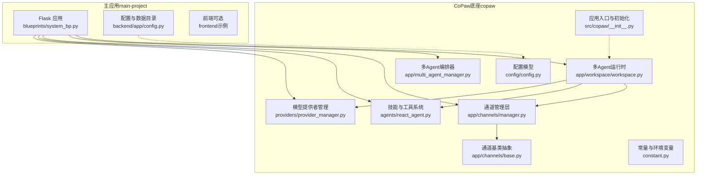
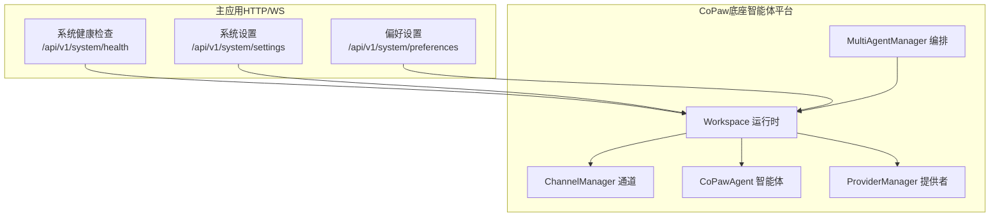
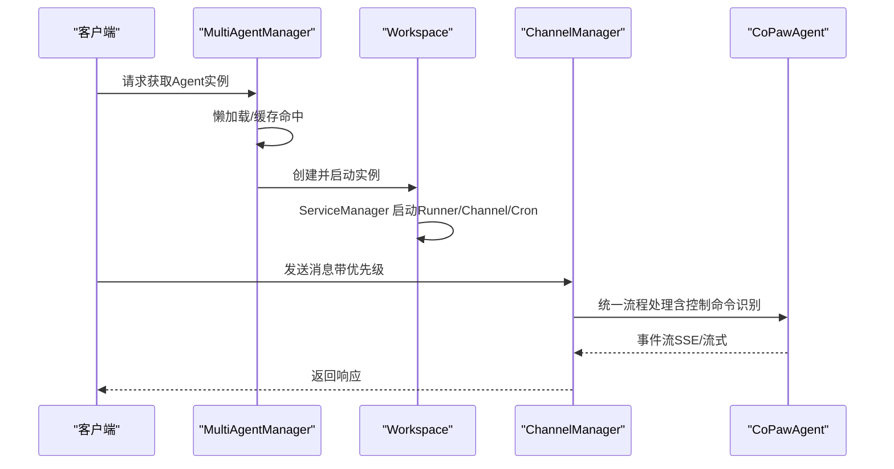
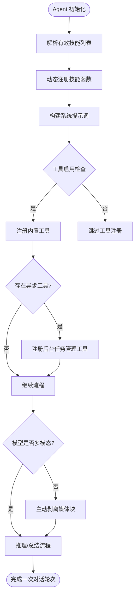
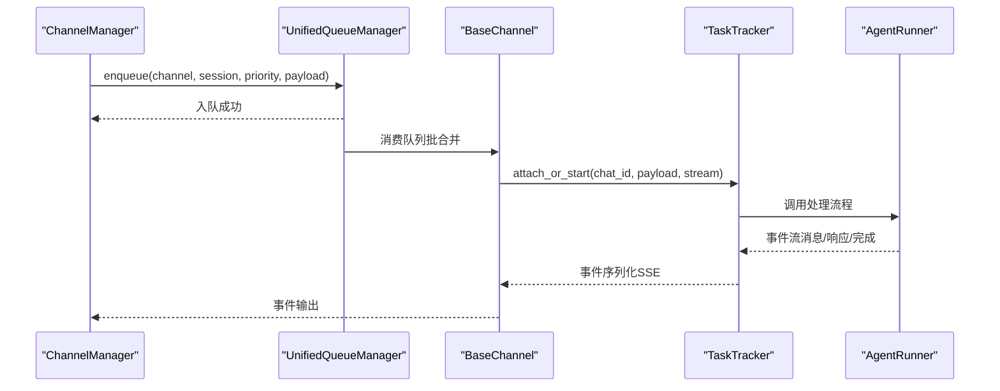
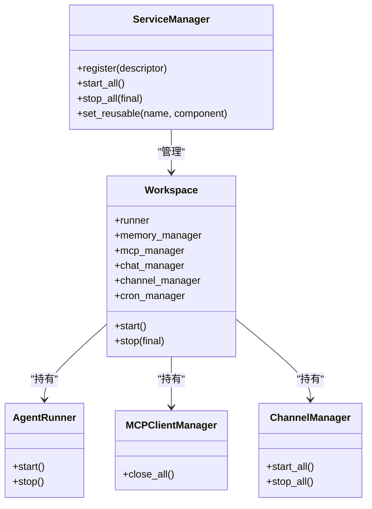
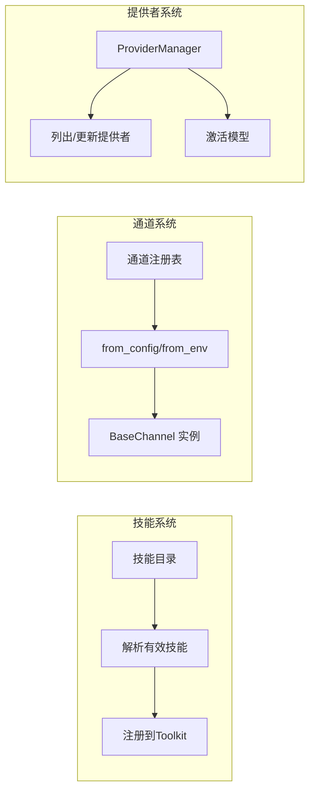
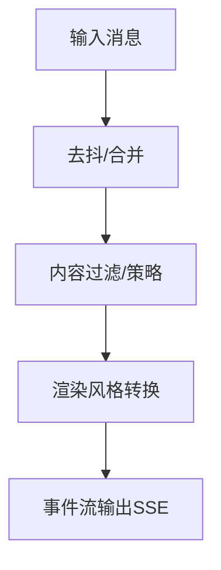
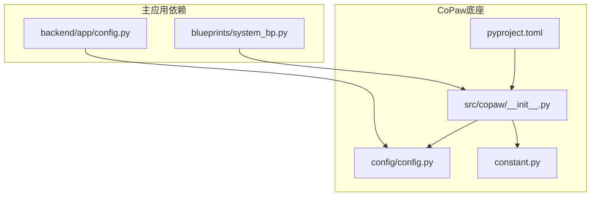

# 架构设计理念

<cite>
**本文引用的文件**
- [README.md](file://copaw/README.md)
- [README.md](file://main-project/README.md)
- [__init__.py](file://copaw/src/copaw/__init__.py)
- [react_agent.py](file://copaw/src/copaw/agents/react_agent.py)
- [multi_agent_manager.py](file://copaw/src/copaw/app/multi_agent_manager.py)
- [workspace.py](file://copaw/src/copaw/app/workspace/workspace.py)
- [manager.py](file://copaw/src/copaw/app/channels/manager.py)
- [base.py](file://copaw/src/copaw/app/channels/base.py)
- [provider_manager.py](file://copaw/src/copaw/providers/provider_manager.py)
- [agent.py](file://copaw/src/copaw/app/routers/agent.py)
- [system_bp.py](file://main-project/backend/app/blueprints/system_bp.py)
- [config.py](file://main-project/backend/app/config.py)
- [config.py](file://copaw/src/copaw/config/config.py)
- [constant.py](file://copaw/src/copaw/constant.py)
- [pyproject.toml](file://copaw/pyproject.toml)
- [requirements.txt](file://main-project/backend/requirements.txt)
</cite>

## 目录
1. [引言](#引言)
2. [项目结构](#项目结构)
3. [核心组件](#核心组件)
4. [架构总览](#架构总览)
5. [详细组件分析](#详细组件分析)
6. [依赖关系分析](#依赖关系分析)
7. [性能考量](#性能考量)
8. [故障排查指南](#故障排查指南)
9. [结论](#结论)
10. [附录](#附录)

## 引言
本文件面向IRA项目，系统阐述其架构设计理念与实现要点，重点包括：
- monorepo架构的设计哲学与边界划分
- 主应用与CoPaw底座的分离策略
- 多Agent系统的架构模式（动态代理管理、技能插件系统、通道抽象设计）
- 微服务化在项目中的落地方式与组件解耦协作机制
- 插件化设计（技能系统、通道系统、提供者系统）的扩展机制
- 事件驱动架构与中间件模式的应用
- 通过架构图与组件交互流程图帮助开发者快速理解整体设计

## 项目结构
IRA采用monorepo组织方式，将“主应用（main-project）”与“CoPaw底座（copaw）”分层解耦：
- 主应用（main-project）：以Flask为核心的服务端，提供统一的API网关与业务能力，负责与外部系统集成与数据处理。
- CoPaw底座（copaw）：以Python为基础的智能体平台，提供多Agent运行时、通道抽象、技能系统、模型提供者管理、内存与任务编排等能力。

**图表来源**
- [system_bp.py:1-94](file://main-project/backend/app/blueprints/system_bp.py#L1-L94)
- [config.py:1-10](file://main-project/backend/app/config.py#L1-L10)
- [__init__.py:1-33](file://copaw/src/copaw/__init__.py#L1-L33)
- [workspace.py:1-389](file://copaw/src/copaw/app/workspace/workspace.py#L1-L389)
- [multi_agent_manager.py:1-462](file://copaw/src/copaw/app/multi_agent_manager.py#L1-L462)
- [manager.py:1-711](file://copaw/src/copaw/app/channels/manager.py#L1-L711)
- [base.py:1-800](file://copaw/src/copaw/app/channels/base.py#L1-L800)
- [react_agent.py:1-800](file://copaw/src/copaw/agents/react_agent.py#L1-L800)
- [provider_manager.py:1-800](file://copaw/src/copaw/providers/provider_manager.py#L1-L800)
- [config.py:1-800](file://copaw/src/copaw/config/config.py#L1-L800)
- [constant.py:1-271](file://copaw/src/copaw/constant.py#L1-L271)

**章节来源**
- [README.md:1-47](file://main-project/README.md#L1-L47)
- [README.md:1-526](file://copaw/README.md#L1-L526)
- [pyproject.toml:1-107](file://copaw/pyproject.toml#L1-L107)
- [requirements.txt:1-7](file://main-project/backend/requirements.txt#L1-L7)

## 核心组件
- 多Agent运行时（Workspace）：封装单个Agent的完整运行时，包含Runner、ChannelManager、MemoryManager、MCPClientManager、CronManager等核心子系统，通过ServiceManager统一管理生命周期与依赖注入。
- 多Agent编排器（MultiAgentManager）：支持按需懒加载、零停机热重载、并发启动与优雅停止，确保多Agent实例的隔离与高可用。
- 通道管理层（ChannelManager）：统一队列与消费模型，支持多通道聚合、优先级调度、去抖合并、控制命令识别与任务跟踪。
- 通道抽象（BaseChannel）：定义通道契约与消息流，屏蔽不同渠道差异，提供渲染风格、内容过滤、会话合并等通用能力。
- 智能体（CoPawAgent）：基于ReActAgent扩展，内置工具集、动态技能加载、内存管理钩子、MCP客户端注册与媒体块处理。
- 模型提供者管理（ProviderManager）：统一管理内置与自定义提供者，支持模型发现、能力探测、激活与持久化。
- 配置与常量（CopawConfig/Constant）：集中管理运行参数、环境变量、默认行为与全局常量，保证一致性与可观测性。

**章节来源**
- [workspace.py:1-389](file://copaw/src/copaw/app/workspace/workspace.py#L1-L389)
- [multi_agent_manager.py:1-462](file://copaw/src/copaw/app/multi_agent_manager.py#L1-L462)
- [manager.py:1-711](file://copaw/src/copaw/app/channels/manager.py#L1-L711)
- [base.py:1-800](file://copaw/src/copaw/app/channels/base.py#L1-L800)
- [react_agent.py:1-800](file://copaw/src/copaw/agents/react_agent.py#L1-L800)
- [provider_manager.py:1-800](file://copaw/src/copaw/providers/provider_manager.py#L1-L800)
- [config.py:1-800](file://copaw/src/copaw/config/config.py#L1-L800)
- [constant.py:1-271](file://copaw/src/copaw/constant.py#L1-L271)

## 架构总览
IRA采用“主应用 + 底座平台”的双层架构：
- 主应用负责业务API、数据存储与外部集成，通过统一的健康检查与设置接口暴露能力。
- CoPaw底座提供智能体运行时与基础设施，通过清晰的接口与中间件模式与主应用解耦。

**图表来源**
- [system_bp.py:21-94](file://main-project/backend/app/blueprints/system_bp.py#L21-L94)
- [workspace.py:1-389](file://copaw/src/copaw/app/workspace/workspace.py#L1-L389)
- [multi_agent_manager.py:1-462](file://copaw/src/copaw/app/multi_agent_manager.py#L1-L462)
- [manager.py:1-711](file://copaw/src/copaw/app/channels/manager.py#L1-L711)
- [react_agent.py:1-800](file://copaw/src/copaw/agents/react_agent.py#L1-L800)
- [provider_manager.py:1-800](file://copaw/src/copaw/providers/provider_manager.py#L1-L800)

## 详细组件分析

### 多Agent系统与动态代理管理
- 动态代理管理：MultiAgentManager支持按需加载、零停机热重载、并发启动与后台清理，确保Agent实例在无中断情况下完成切换。
- Workspace作为独立运行时容器，内部通过ServiceManager声明式注册组件，支持可复用组件（如MemoryManager、ChatManager）在热重载时保留状态。
- 控制命令与任务跟踪：通道层对控制命令进行识别与优先级处理，结合TaskTracker实现任务取消与串流事件输出。

**图表来源**
- [multi_agent_manager.py:34-311](file://copaw/src/copaw/app/multi_agent_manager.py#L34-L311)
- [workspace.py:322-380](file://copaw/src/copaw/app/workspace/workspace.py#L322-L380)
- [manager.py:362-446](file://copaw/src/copaw/app/channels/manager.py#L362-L446)
- [base.py:760-800](file://copaw/src/copaw/app/channels/base.py#L760-L800)
- [react_agent.py:665-775](file://copaw/src/copaw/agents/react_agent.py#L665-L775)

**章节来源**
- [multi_agent_manager.py:1-462](file://copaw/src/copaw/app/multi_agent_manager.py#L1-L462)
- [workspace.py:1-389](file://copaw/src/copaw/app/workspace/workspace.py#L1-L389)
- [manager.py:1-711](file://copaw/src/copaw/app/channels/manager.py#L1-L711)
- [base.py:1-800](file://copaw/src/copaw/app/channels/base.py#L1-L800)
- [react_agent.py:1-800](file://copaw/src/copaw/agents/react_agent.py#L1-L800)

### 技能插件系统与工具体系
- 技能系统：CoPawAgent在初始化时解析有效技能集合，并从工作区动态注册技能函数，支持按渠道筛选与命名冲突策略。
- 工具体系：内置工具集（文件读写、搜索、浏览器控制、截图、音频转写等），支持异步执行与后台任务管理工具自动注册。
- 媒体块处理：针对非多模态模型，提供主动剥离与被动回退的媒体块处理逻辑，保障消息稳定性。

**图表来源**
- [react_agent.py:306-378](file://copaw/src/copaw/agents/react_agent.py#L306-L378)
- [react_agent.py:183-304](file://copaw/src/copaw/agents/react_agent.py#L183-L304)
- [react_agent.py:665-775](file://copaw/src/copaw/agents/react_agent.py#L665-L775)

**章节来源**
- [react_agent.py:1-800](file://copaw/src/copaw/agents/react_agent.py#L1-L800)

### 通道抽象设计与事件驱动
- 通道抽象：BaseChannel定义统一的消息契约与渲染风格，支持内容过滤、会话合并、去抖处理与控制命令识别。
- 事件驱动：ChannelManager引入统一队列与消费者模型，按会话与优先级进行批处理与事件流输出，结合TaskTracker实现任务生命周期管理。
- 中间件模式：通道层通过渲染器、策略配置与回调注入，形成可插拔的中间件链路，便于扩展与定制。

**图表来源**
- [manager.py:302-446](file://copaw/src/copaw/app/channels/manager.py#L302-L446)
- [base.py:374-535](file://copaw/src/copaw/app/channels/base.py#L374-L535)
- [base.py:659-758](file://copaw/src/copaw/app/channels/base.py#L659-L758)

**章节来源**
- [manager.py:1-711](file://copaw/src/copaw/app/channels/manager.py#L1-L711)
- [base.py:1-800](file://copaw/src/copaw/app/channels/base.py#L1-L800)

### 微服务化与组件解耦
- 组件边界：Workspace作为运行时容器，内部组件通过ServiceDescriptor声明式注册，避免硬编码初始化顺序与依赖。
- 生命周期管理：ServiceManager统一启动/停止，支持可复用组件与并发初始化，降低耦合度。
- API层解耦：主应用通过blueprints暴露统一接口，CoPaw底座通过路由与上下文获取当前Agent，实现前后端与平台层的解耦。

**图表来源**
- [workspace.py:142-288](file://copaw/src/copaw/app/workspace/workspace.py#L142-L288)
- [workspace.py:322-380](file://copaw/src/copaw/app/workspace/workspace.py#L322-L380)

**章节来源**
- [workspace.py:1-389](file://copaw/src/copaw/app/workspace/workspace.py#L1-L389)

### 插件化设计（技能/通道/提供者）
- 技能系统：通过工作区技能目录与注册表解析有效技能，支持按渠道筛选与命名冲突策略，实现“即插即用”的能力扩展。
- 通道系统：通道注册表与工厂方法支持从环境或配置创建通道实例，统一注入进程处理器与回调，便于新增渠道。
- 提供者系统：ProviderManager集中管理内置与自定义提供者，支持模型发现、能力探测与持久化，提供统一的模型选择与激活接口。

**图表来源**
- [react_agent.py:306-341](file://copaw/src/copaw/agents/react_agent.py#L306-L341)
- [manager.py:87-213](file://copaw/src/copaw/app/channels/manager.py#L87-L213)
- [provider_manager.py:620-751](file://copaw/src/copaw/providers/provider_manager.py#L620-L751)

**章节来源**
- [react_agent.py:1-800](file://copaw/src/copaw/agents/react_agent.py#L1-L800)
- [manager.py:1-711](file://copaw/src/copaw/app/channels/manager.py#L1-L711)
- [provider_manager.py:1-800](file://copaw/src/copaw/providers/provider_manager.py#L1-L800)

### 事件驱动架构与中间件模式
- 事件驱动：ChannelManager以队列与消费者模型实现事件驱动，消息按会话与优先级批处理，事件流通过SSE输出。
- 中间件模式：BaseChannel通过渲染风格、内容过滤与策略配置形成中间件链，支持在消息进入与离开时进行统一处理。

**图表来源**
- [base.py:178-282](file://copaw/src/copaw/app/channels/base.py#L178-L282)
- [base.py:446-514](file://copaw/src/copaw/app/channels/base.py#L446-L514)

**章节来源**
- [base.py:1-800](file://copaw/src/copaw/app/channels/base.py#L1-L800)

## 依赖关系分析
- 主应用依赖CoPaw底座提供的运行时能力（Workspace、ChannelManager、AgentRunner等），通过blueprints与路由进行解耦。
- CoPaw底座内部组件通过ServiceManager解耦，依赖配置与常量模块提供统一参数。
- 依赖注入与版本约束：pyproject.toml定义了核心依赖与可选特性，主应用requirements.txt定义了Flask生态依赖。

**图表来源**
- [system_bp.py:1-94](file://main-project/backend/app/blueprints/system_bp.py#L1-L94)
- [config.py:1-10](file://main-project/backend/app/config.py#L1-L10)
- [__init__.py:1-33](file://copaw/src/copaw/__init__.py#L1-L33)
- [config.py:1-800](file://copaw/src/copaw/config/config.py#L1-L800)
- [constant.py:1-271](file://copaw/src/copaw/constant.py#L1-L271)
- [pyproject.toml:1-107](file://copaw/pyproject.toml#L1-L107)

**章节来源**
- [pyproject.toml:1-107](file://copaw/pyproject.toml#L1-L107)
- [requirements.txt:1-7](file://main-project/backend/requirements.txt#L1-L7)

## 性能考量
- 并发与限流：多Agent编排支持并发启动与后台清理，通道层通过统一队列与批处理减少重复开销；提供者层具备全局并发与QPM限制，避免API限流。
- 内存与上下文压缩：Agent运行配置包含上下文压缩阈值与保留比例，结合记忆摘要与工具结果压缩，降低长对话成本。
- 媒体块处理：针对非多模态模型的媒体块主动剥离与被动回退，减少无效调用与失败重试。

[本节为通用指导，无需特定文件引用]

## 故障排查指南
- 健康检查与设置：通过系统健康接口确认CoPaw桥接与多Agent状态，检查设置与偏好项以定位配置问题。
- 日志与追踪：应用初始化阶段设置日志级别，请求中注入追踪ID，便于问题定位与链路追踪。
- 通道与队列：关注ChannelManager的入队超时与取消，检查队列清理循环与消费者状态。
- 提供者与模型：验证提供者模型发现与能力探测，确认激活模型与本地模型恢复任务。

**章节来源**
- [system_bp.py:21-94](file://main-project/backend/app/blueprints/system_bp.py#L21-L94)
- [__init__.py:1-33](file://copaw/src/copaw/__init__.py#L1-L33)
- [manager.py:302-348](file://copaw/src/copaw/app/channels/manager.py#L302-L348)
- [provider_manager.py:685-708](file://copaw/src/copaw/providers/provider_manager.py#L685-L708)

## 结论
IRA通过monorepo实现“主应用 + 底座平台”的清晰边界，CoPaw底座以多Agent运行时为核心，结合通道抽象、技能插件与提供者管理，形成高度可扩展的智能体平台。微服务化体现在组件解耦与中间件模式上，事件驱动架构确保消息处理的低延迟与高吞吐。插件化设计贯穿技能、通道与提供者三个层面，配合统一配置与常量体系，使系统在可维护性、可扩展性与可观察性方面达到平衡。

[本节为总结性内容，无需特定文件引用]

## 附录
- API与路由：主应用通过blueprints暴露系统健康、设置与偏好接口；CoPaw侧通过FastAPI路由提供Agent文件管理、语言与运行配置等接口。
- 环境与配置：主应用通过环境变量确定数据目录；CoPaw通过常量模块与dotenv加载环境变量，统一默认行为与参数校验。

**章节来源**
- [system_bp.py:21-94](file://main-project/backend/app/blueprints/system_bp.py#L21-L94)
- [agent.py:1-505](file://copaw/src/copaw/app/routers/agent.py#L1-L505)
- [config.py:1-10](file://main-project/backend/app/config.py#L1-L10)
- [constant.py:1-271](file://copaw/src/copaw/constant.py#L1-L271)