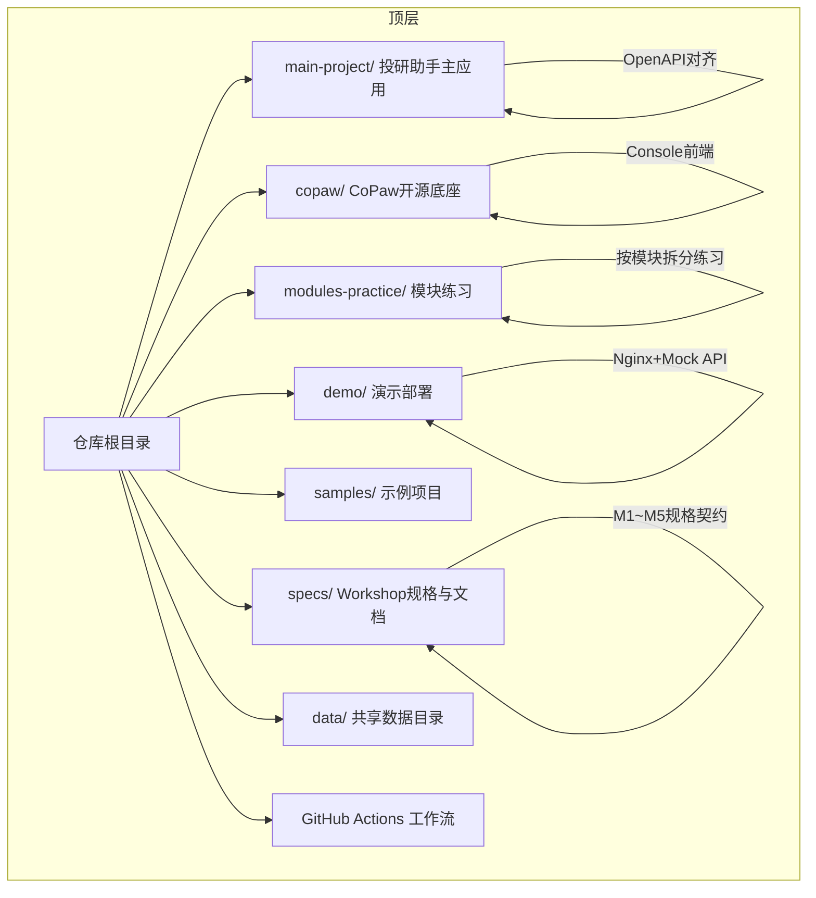
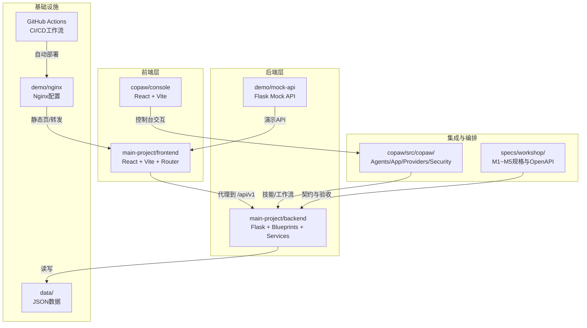
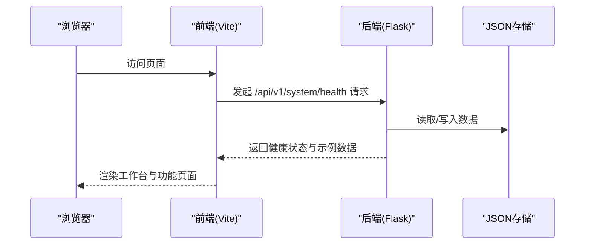
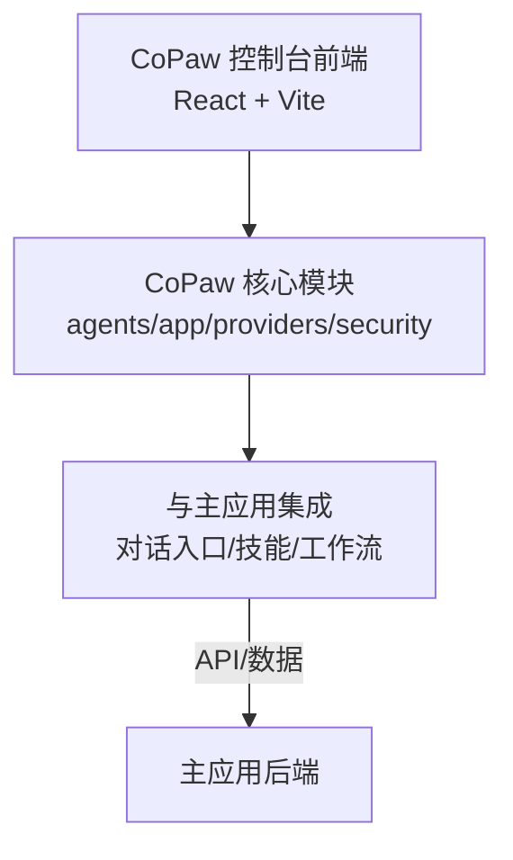
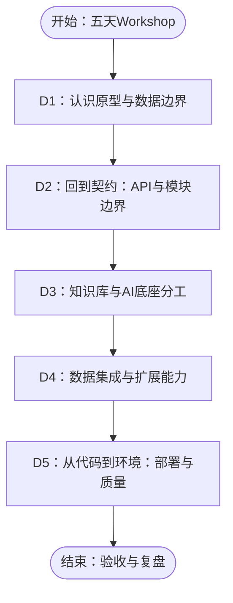
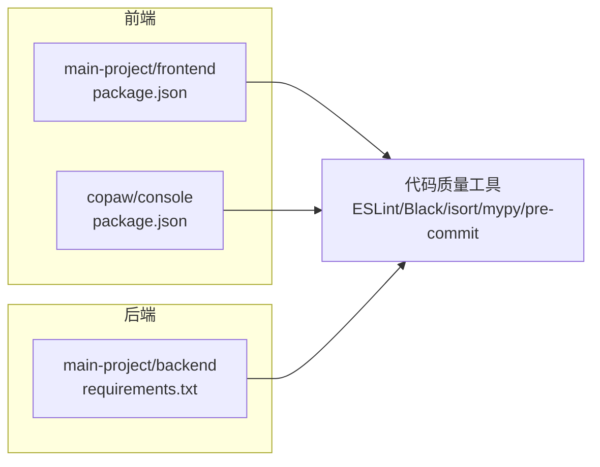

# 项目介绍

<cite>
**本文引用的文件**
- [README.md](file://README.md)
- [AGENTS.md](file://AGENTS.md)
- [main-project/README.md](file://main-project/README.md)
- [modules-practice/README.md](file://modules-practice/README.md)
- [modules-practice/WORKSHOP-五天一页纸.md](file://modules-practice/WORKSHOP-五天一页纸.md)
- [specs/workshop/README.md](file://specs/workshop/README.md)
- [copaw/README.md](file://copaw/README.md)
- [copaw/website/README.md](file://copaw/website/README.md)
- [main-project/backend/app/openapi_spec.py](file://main-project/backend/app/openapi_spec.py)
- [main-project/frontend/package.json](file://main-project/frontend/package.json)
- [main-project/backend/requirements.txt](file://main-project/backend/requirements.txt)
- [copaw/console/package.json](file://copaw/console/package.json)
</cite>

## 目录
1. [引言](#引言)
2. [项目结构](#项目结构)
3. [核心组件](#核心组件)
4. [架构总览](#架构总览)
5. [详细组件分析](#详细组件分析)
6. [依赖分析](#依赖分析)
7. [性能考虑](#性能考虑)
8. [故障排查指南](#故障排查指南)
9. [结论](#结论)
10. [附录](#附录)

## 引言
IRA投研助手项目是一个为期5天的Workshop学习演示工程，采用monorepo组织形式，包含主应用、CoPaw开源底座、模块化练习、演示与示例等子项目。项目的核心目标是通过“原型可运行 + 规格化交付 + 多Agent编排”的方式，帮助学员系统掌握从界面到API、从数据到合规、从单体到多Agent的投研辅助系统设计与实现方法。

价值主张
- 教学导向：以“每天一个主题”的节奏，将复杂系统拆解为可对照、可复现的学习模块。
- 技术落地：主应用对齐OpenAPI、前端代理后端、后端Flask路由模块化，形成可演进的原型基线。
- 能力拓展：结合CoPaw底座，讲解“对话入口/技能/工作流”与“BFF/入库/组装”的职责分工，支撑企业级落位。
- 风险隔离：明确所有行情、报告、情感等均为示例/模拟数据，不构成投资建议，确保教学边界清晰。

## 项目结构
顶层采用monorepo布局，围绕“主项目 + 底座 + 练习 + 演示 + 规格 + 数据”的结构展开，既保证教学主线统一，又允许各模块独立演进与对照。

图表来源
- [AGENTS.md:10-22](file://AGENTS.md#L10-L22)
- [README.md:13-25](file://README.md#L13-L25)

章节来源
- [README.md:1-26](file://README.md#L1-L26)
- [AGENTS.md:10-22](file://AGENTS.md#L10-L22)

## 核心组件
- 主应用（main-project）
  - 后端：Flask 3.x + Python ≥ 3.8，API对齐OpenAPI，支持健康检查、工作台、合规、血缘、研报、推送、知识库等标签域。
  - 前端：React + Vite + React Router，开发代理到后端，提供16个页面组件与通用组件。
  - 数据：JSON文件存储，可通过脚本初始化。
- CoPaw底座（copaw）
  - 提供多Agent协作、多渠道接入、技能扩展、本地部署、安全机制等能力，控制台前端基于React + Vite。
- 模块练习（modules-practice）
  - M1~M5按主题拆分，涵盖“基础对话”“多源数据”“知识库+CoPaw”“推送”“多Agent编排”，并配套统一规格（specs/workshop）。
- 演示与示例（demo/samples）
  - demo提供Nginx + Mock API + 静态页的演示部署；samples提供独立示例工程，便于对比与迁移。
- 规格与文档（specs）
  - specs/workshop为各模块的契约真源，包含Proposal/Spec/TC/OpenAPI等，确保产品、架构与研发在同一“书架”评审与版本管理。

章节来源
- [main-project/README.md:1-47](file://main-project/README.md#L1-L47)
- [AGENTS.md:26-128](file://AGENTS.md#L26-L128)
- [modules-practice/README.md:1-38](file://modules-practice/README.md#L1-L38)
- [specs/workshop/README.md:1-37](file://specs/workshop/README.md#L1-L37)
- [copaw/README.md:1-526](file://copaw/README.md#L1-L526)

## 架构总览
整体采用“前端代理 + 后端API + 规格契约 + 底座集成”的架构，主应用提供统一的OpenAPI与页面体验，CoPaw作为可插拔的AI助手底座参与对话入口、技能与工作流编排，模块练习与规格文档指导实现与验收，演示与示例提供部署与迁移参考。

图表来源
- [AGENTS.md:36-53](file://AGENTS.md#L36-L53)
- [AGENTS.md:92-107](file://AGENTS.md#L92-L107)
- [AGENTS.md:138-152](file://AGENTS.md#L138-L152)
- [specs/workshop/README.md:7-16](file://specs/workshop/README.md#L7-L16)
- [copaw/website/README.md:1-111](file://copaw/website/README.md#L1-L111)

## 详细组件分析

### 主应用（main-project）：可运行原型与OpenAPI对齐
- 技术栈与目录
  - 后端：Flask 3.x，14个API蓝图、7个业务服务、OpenAPI规范、JSON存储。
  - 前端：React + Vite + React Router + TypeScript，16个页面组件、6个通用组件、API客户端、数据与配置。
- OpenAPI对齐
  - 规范覆盖系统、仪表盘、合规、血缘、研报、情感、推送、知识库、报告等标签域，支持Swagger UI与示例响应。
- 快速启动与测试
  - 提供数据种子脚本、后端Flask启动、前端Vite开发、pytest测试的完整流程。

图表来源
- [main-project/backend/app/openapi_spec.py:6-47](file://main-project/backend/app/openapi_spec.py#L6-L47)
- [main-project/README.md:9-30](file://main-project/README.md#L9-L30)

章节来源
- [main-project/README.md:1-47](file://main-project/README.md#L1-L47)
- [main-project/backend/app/openapi_spec.py:1-200](file://main-project/backend/app/openapi_spec.py#L1-L200)
- [main-project/frontend/package.json:1-25](file://main-project/frontend/package.json#L1-L25)
- [main-project/backend/requirements.txt:1-7](file://main-project/backend/requirements.txt#L1-L7)

### CoPaw底座：AI助手底座与控制台
- 能力概览
  - 多Agent系统、多渠道接入、技能扩展、多层安全、本地部署（llama.cpp/Ollama/LM Studio）。
- 控制台前端
  - React + Vite，提供聊天与Agent配置界面，端口默认8088。
- 与主应用的关系
  - 主应用可作为“BFF/入库/组装”的实现，CoPaw负责“对话入口/技能/工作流”的编排与扩展。

图表来源
- [copaw/README.md:81-128](file://copaw/README.md#L81-L128)
- [copaw/console/package.json:1-60](file://copaw/console/package.json#L1-L60)
- [AGENTS.md:193-204](file://AGENTS.md#L193-L204)

章节来源
- [copaw/README.md:1-526](file://copaw/README.md#L1-L526)
- [copaw/website/README.md:1-111](file://copaw/website/README.md#L1-L111)
- [AGENTS.md:81-128](file://AGENTS.md#L81-L128)

### 模块练习（modules-practice）：五天路线与每日产出
- 五天路线
  - D1：认识原型与数据边界；D2：回到契约（API与模块边界）；D3：知识库与AI底座分工；D4：数据集成与扩展能力；D5：从代码到环境（部署与质量）。
- 模块对照
  - M1（独立小全栈）与主应用对照；M2（多源数据）为数据管道与契约纵深；M3（知识库+CoPaw）为规格化交付范本；M4（推送样例）；M5（多Agent编排）加深分析编排能力。

图表来源
- [modules-practice/WORKSHOP-五天一页纸.md:22-31](file://modules-practice/WORKSHOP-五天一页纸.md#L22-L31)

章节来源
- [modules-practice/README.md:1-38](file://modules-practice/README.md#L1-L38)
- [modules-practice/WORKSHOP-五天一页纸.md:1-66](file://modules-practice/WORKSHOP-五天一页纸.md#L1-L66)

### 规格与文档（specs/workshop）：契约真源与版本管理
- 布局与约定
  - M1~M5各模块的Proposal/Spec/TC/OpenAPI等契约文档集中于specs/workshop，实现代码位于modules-practice，便于评审与版本管理。
- 契约优先级
  - 模块docs/openapi优先于练习代码，演示页/样例仅作参考，不覆盖契约真源。
- 冻结点建议
  - D2冻结接口命名与路径前缀；D3冻结关键返回体与错误体，后续仅允许向后兼容新增。

章节来源
- [specs/workshop/README.md:1-37](file://specs/workshop/README.md#L1-L37)

### 演示与示例（demo/samples）：部署与迁移参考
- Demo
  - Nginx + Mock API + 静态页，配合CI自动部署到ECS，提供演示入口与API验证。
- Samples
  - 独立示例工程（如Node.js + Express与钉钉集成），便于对比与迁移。

章节来源
- [AGENTS.md:131-164](file://AGENTS.md#L131-L164)
- [AGENTS.md:219-237](file://AGENTS.md#L219-L237)

## 依赖分析
- 前端依赖
  - 主应用前端：React、React Router、TypeScript、Vite。
  - CoPaw控制台前端：Ant Design、AntD Design Icons、i18n、Markdown渲染、Zustand状态管理等。
- 后端依赖
  - Flask 3.x、CORS、pytest、requests、python-dotenv等。
- 工具链
  - Vite、ESLint/Prettier、Black/isort/mypy、pre-commit等，保障代码质量与一致性。

图表来源
- [main-project/frontend/package.json:1-25](file://main-project/frontend/package.json#L1-L25)
- [copaw/console/package.json:1-60](file://copaw/console/package.json#L1-L60)
- [main-project/backend/requirements.txt:1-7](file://main-project/backend/requirements.txt#L1-L7)

章节来源
- [AGENTS.md:288-311](file://AGENTS.md#L288-L311)

## 性能考虑
- 前端开发体验
  - Vite提供快速冷启动与热更新；代理到后端端口，减少跨域与调试成本。
- 后端API设计
  - OpenAPI对齐与蓝图模块化，有助于缓存、限流与可观测性扩展。
- 数据存储
  - JSON文件适合演示与小规模数据；生产建议迁移至数据库并引入索引与备份策略。
- 部署与CD
  - Demo采用Nginx + Mock API，结合GitHub Actions实现自动化部署；生产可扩展至容器化与云原生。

## 故障排查指南
- 常见问题
  - 端口占用：确认前端（5173）、后端（5000）、CoPaw控制台（8088）、Demo（80/443）端口未被占用。
  - 依赖缺失：主应用后端需安装Flask/CORS/pytest等；前端需安装Node.js与npm/pnpm。
  - 数据目录：确保IRA_DATA_DIR正确指向data目录，或使用种子脚本初始化。
  - CI部署：Demo部署需配置ECS_HOST/ECS_USER/ECS_PASSWORD等Secrets。
- 定位建议
  - 从前端代理链路入手，逐步定位到后端API与数据存储；结合OpenAPI文档核对请求/响应。
  - 使用pytest验证后端逻辑；在CoPaw控制台验证技能与工作流编排。

章节来源
- [AGENTS.md:373-382](file://AGENTS.md#L373-L382)
- [AGENTS.md:239-271](file://AGENTS.md#L239-L271)
- [main-project/README.md:9-30](file://main-project/README.md#L9-L30)

## 结论
IRA投研助手项目通过monorepo将“原型可运行 + 规格化交付 + 底座集成 + 模块练习 + 演示示例”有机串联，既满足教学演练的完整性，又为后续工程化落地提供清晰的参照路径。所有演示数据均为示例/模拟，不构成投资建议，教学过程中应始终强调数据边界与合规要求。

## 附录
- 快速参考
  - 主项目：后端Flask、前端Vite、OpenAPI对齐、pytest测试。
  - CoPaw：控制台前端、多Agent、多渠道、安全机制。
  - 练习模块：M1~M5按天推进，对照主应用与规格文档。
  - 演示部署：Nginx + Mock API + GitHub Actions自动部署。
- 学习路径建议
  - D1：跑通主应用前后端，理解数据边界；D2：定位API与契约；D3：学习知识库与CoPaw分工；D4：完成M2/M4端到端；D5：读通CI/CD与部署差异。

章节来源
- [AGENTS.md:397-423](file://AGENTS.md#L397-L423)
- [README.md:7-12](file://README.md#L7-L12)