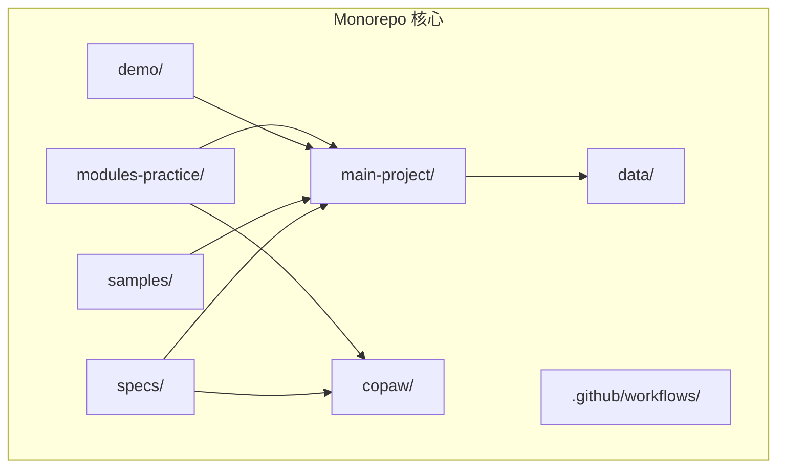
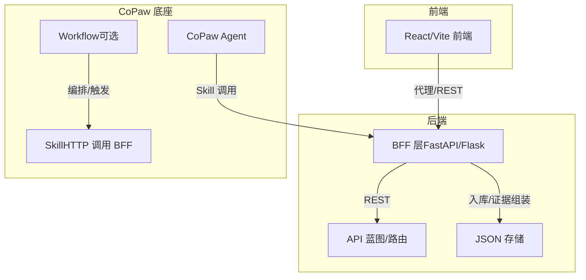
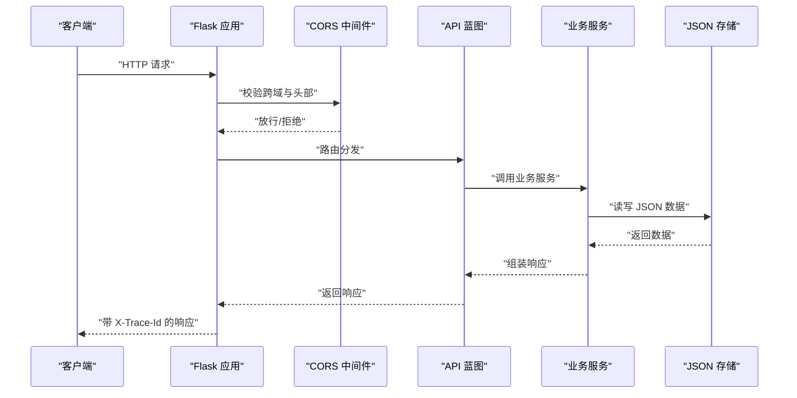
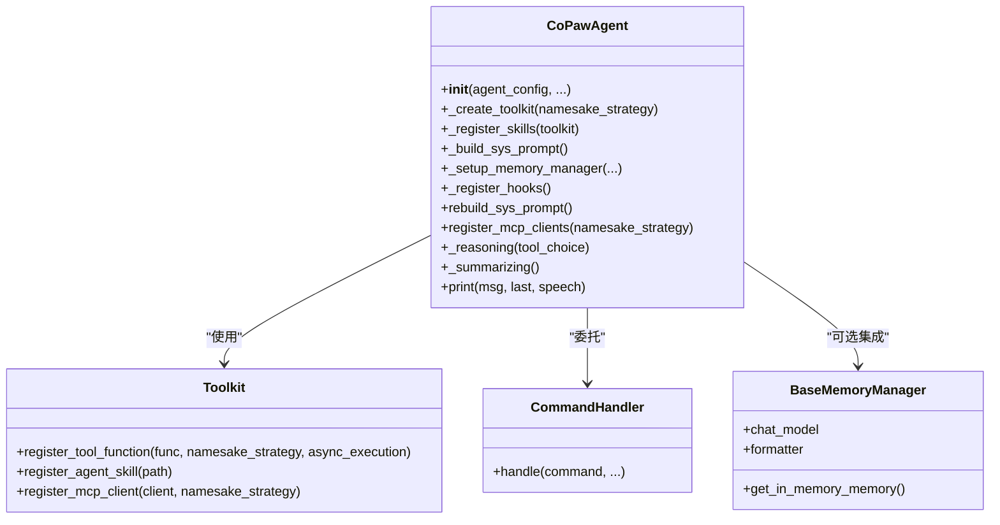
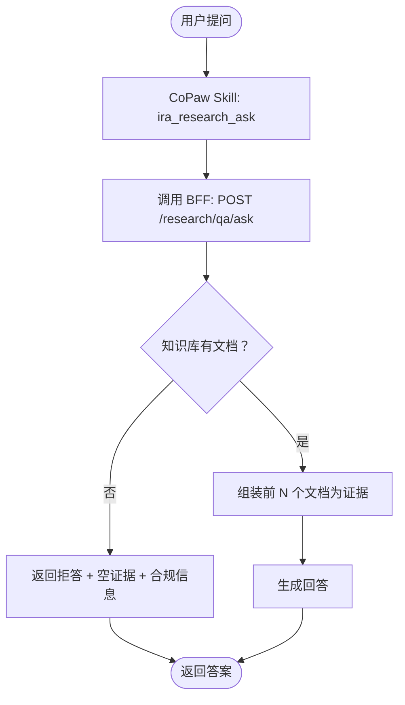
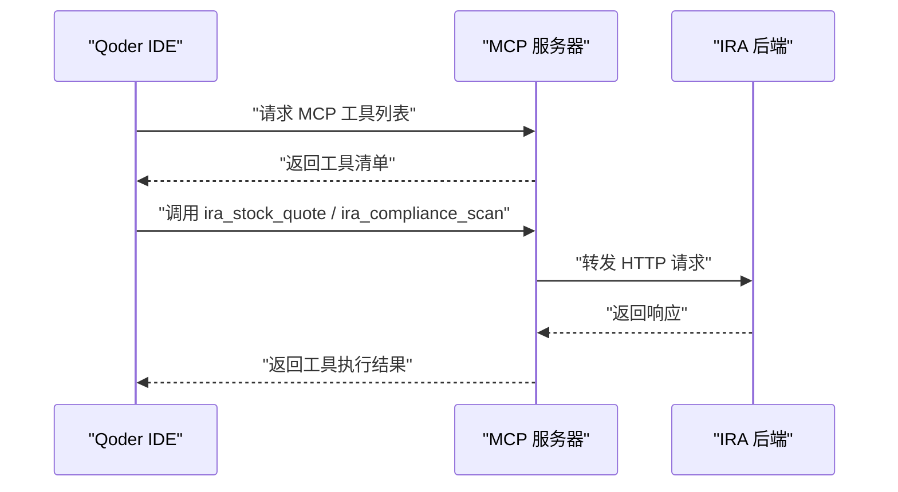
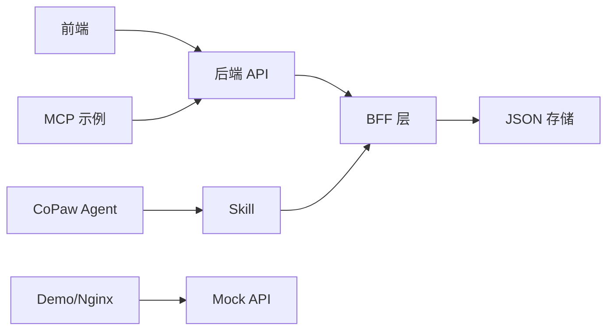

# 项目概述

<cite>
**本文引用的文件**
- [AGENTS.md](file://AGENTS.md)
- [README.md](file://main-project/README.md)
- [README.md](file://copaw/README.md)
- [README.md](file://specs/workshop/README.md)
- [__init__.py](file://copaw/src/copaw/__init__.py)
- [__init__.py](file://main-project/backend/app/__init__.py)
- [research_bp.py](file://main-project/backend/app/blueprints/research_bp.py)
- [react_agent.py](file://copaw/src/copaw/agents/react_agent.py)
- [main.py](file://modules-practice/module-03/app/main.py)
- [01-Spec-知识库与问答-CoPaw底座-v0.1.md](file://specs/workshop/module-03-knowledge-copaw/docs/01-Spec-知识库与问答-CoPaw底座-v0.1.md)
- [README.md](file://samples/04-mcp-ira-tools/README.md)
</cite>

## 目录
1. [简介](#简介)
2. [项目结构](#项目结构)
3. [核心组件](#核心组件)
4. [架构总览](#架构总览)
5. [详细组件分析](#详细组件分析)
6. [依赖分析](#依赖分析)
7. [性能考虑](#性能考虑)
8. [故障排查指南](#故障排查指南)
9. [结论](#结论)
10. [附录](#附录)

## 简介
IRA 投研助手项目是一个面向“5天工作坊”的可运行原型与学习体系，围绕“投研助手”主题，采用 monorepo 架构组织主项目、CoPaw 底座、模块练习、演示与示例代码。项目目标是通过渐进式学习路径，帮助学员从基础到高级掌握：
- 主项目（IRA）的前后端架构与 API 设计
- 基于 CoPaw 的智能体（Agent）与技能（Skill）编排
- 多源数据集成与 GlueCoding 工作流
- 多渠道推送与合规扫描
- 多 Agent 投研平台的高级实践

项目强调“契约优先”的规格文档与“可演进”的实现策略，确保教学与工程实践的一致性。

## 项目结构
项目采用 monorepo 组织，核心目录如下：
- main-project：主项目（投研助手原型），包含后端 Flask 服务与前端 React/Vite 应用
- copaw：CoPaw AI 助手底座（AgentScope 开源项目），提供多 Agent、多渠道、技能扩展与安全机制
- modules-practice：模块练习（M1～M5），每个模块独立实现，便于分天教学与对照
- demo：演示部署项目（Nginx + Mock API），用于快速上线与联调
- samples：示例项目（如 MCP 工具桥接）
- specs：需求规格文档（Workshop 模块契约与 OpenAPI）
- data：共享数据目录（JSON 文件）
- .github/workflows：CI/CD 自动化部署

图表来源
- [AGENTS.md:12-22](file://AGENTS.md#L12-L22)

章节来源
- [AGENTS.md:10-22](file://AGENTS.md#L10-L22)
- [README.md:1-47](file://main-project/README.md#L1-L47)

## 核心组件
- 主项目（IRA）
  - 后端：Flask 3.x + 蓝图（blueprints）组织 14 个 API 模块，OpenAPI 规范对齐
  - 前端：React + Vite + React Router + TypeScript，16 个页面组件
  - 数据：JSON 文件存储，支持数据种子脚本初始化
- CoPaw 底座
  - 多 Agent 系统、多渠道接入、技能扩展、本地模型支持、多层安全
  - 控制台前端（React + Vite），提供 Web UI
- 模块练习（M1～M5）
  - M1：投研助手基础版（独立实现）
  - M2：GlueCoding 多源数据集成
  - M3：知识库与问答（CoPaw 底座）
  - M4：多渠道推送（待开发）
  - M5：多 Agent 投研平台
- 演示与示例
  - demo：Nginx + Mock API 部署
  - samples：MCP 工具桥接示例

章节来源
- [AGENTS.md:26-128](file://AGENTS.md#L26-L128)
- [README.md:1-47](file://main-project/README.md#L1-L47)
- [README.md:1-526](file://copaw/README.md#L1-L526)
- [README.md:1-37](file://specs/workshop/README.md#L1-L37)

## 架构总览
IRA 采用“BFF + 多 Agent”混合架构：
- BFF 层负责 REST API、入库与证据组装
- CoPaw 作为智能体与技能编排底座，通过 Skill 调用 BFF API，实现“对话入口 + 工作流”
- 前端通过代理访问后端 API，形成统一的开发体验

图表来源
- [AGENTS.md:39-53](file://AGENTS.md#L39-L53)
- [01-Spec-知识库与问答-CoPaw底座-v0.1.md:39-58](file://specs/workshop/module-03-knowledge-copaw/docs/01-Spec-知识库与问答-CoPaw底座-v0.1.md#L39-L58)

章节来源
- [AGENTS.md:39-53](file://AGENTS.md#L39-L53)
- [01-Spec-知识库与问答-CoPaw底座-v0.1.md:39-58](file://specs/workshop/module-03-knowledge-copaw/docs/01-Spec-知识库与问答-CoPaw底座-v0.1.md#L39-L58)

## 详细组件分析

### 主项目（IRA）后端架构
- 应用工厂模式：通过 create_app 注册 CORS、蓝图与全局中间件
- 蓝图组织：认证、系统、仪表盘、合规、血缘、研究、情感、通知、知识库、数据摄取、报告、技能等 14 个蓝图
- OpenAPI 规范：集中定义 API 行为与数据模型
- Trace 机制：统一 X-Trace-Id 头部，贯穿请求与响应

图表来源
- [__init__.py:21-79](file://main-project/backend/app/__init__.py#L21-L79)
- [research_bp.py:73-172](file://main-project/backend/app/blueprints/research_bp.py#L73-L172)

章节来源
- [__init__.py:21-79](file://main-project/backend/app/__init__.py#L21-L79)
- [research_bp.py:73-172](file://main-project/backend/app/blueprints/research_bp.py#L73-L172)

### CoPaw 智能体与技能编排
- CoPawAgent：ReActAgent 增强版，内置工具、动态技能加载、内存管理、命令处理与安全守卫
- 工具注册：按配置启用/禁用，支持异步任务管理工具
- 技能加载：从工作空间目录解析有效技能，按通道过滤
- 系统提示构建：从工作目录文件与环境上下文构建系统提示
- 多模态适配：主动/被动剥离媒体块，保证模型兼容性
- MCP 客户端：支持 HTTP/STDIO 两类传输，具备断线恢复与重连机制

图表来源
- [react_agent.py:69-182](file://copaw/src/copaw/agents/react_agent.py#L69-L182)
- [react_agent.py:183-304](file://copaw/src/copaw/agents/react_agent.py#L183-L304)
- [react_agent.py:306-341](file://copaw/src/copaw/agents/react_agent.py#L306-L341)
- [react_agent.py:380-414](file://copaw/src/copaw/agents/react_agent.py#L380-L414)

章节来源
- [react_agent.py:69-182](file://copaw/src/copaw/agents/react_agent.py#L69-L182)
- [react_agent.py:183-304](file://copaw/src/copaw/agents/react_agent.py#L183-L304)
- [react_agent.py:306-341](file://copaw/src/copaw/agents/react_agent.py#L306-L341)
- [react_agent.py:380-414](file://copaw/src/copaw/agents/react_agent.py#L380-L414)

### 模块 M3：知识库与问答（CoPaw 底座）
- 规格契约：定义了 KB 文档列表、索引状态、材料上传、研报问答等 API 行为
- BFF 实现：FastAPI 应用，提供 /api/v1 路由组，支持 CORS、文件上传、证据组装与合规信息
- CoPaw 映射：通过 Skill 将用户问题转为 POST /research/qa/ask，再将 answer 与 evidence_refs 格式化展示

图表来源
- [01-Spec-知识库与问答-CoPaw底座-v0.1.md:121-156](file://specs/workshop/module-03-knowledge-copaw/docs/01-Spec-知识库与问答-CoPaw底座-v0.1.md#L121-L156)
- [main.py:268-325](file://modules-practice/module-03/app/main.py#L268-L325)

章节来源
- [01-Spec-知识库与问答-CoPaw底座-v0.1.md:62-156](file://specs/workshop/module-03-knowledge-copaw/docs/01-Spec-知识库与问答-CoPaw底座-v0.1.md#L62-L156)
- [main.py:156-325](file://modules-practice/module-03/app/main.py#L156-L325)

### 示例：MCP 工具桥接（IRA API → CoPaw/MCP）
- 将 IRA 后端已有 API 封装为 MCP 工具，供 Qoder IDE / CoPaw 等客户端调用
- 示例工具：行情查询、合规扫描
- 配置：在 Qoder 设置中添加 MCP 服务器，设置 IRA API 基地址

图表来源
- [README.md:1-65](file://samples/04-mcp-ira-tools/README.md#L1-L65)

章节来源
- [README.md:1-65](file://samples/04-mcp-ira-tools/README.md#L1-L65)

## 依赖分析
- 技术栈与版本
  - 主项目后端：Flask 3.x、CORS、pytest、requests、python-dotenv
  - 主项目前端：React + Vite + React Router + TypeScript
  - CoPaw：AgentScope Runtime、多渠道 SDK、本地模型支持、安全扫描与工具守卫
  - 模块 M3：FastAPI、CORS、Pydantic（数据模型）
- 依赖关系
  - CoPaw 通过 Skill 调用 BFF API，形成“对话入口 + 编排”的耦合边界
  - 主项目后端通过蓝图模块化 API，降低耦合并提升可维护性
  - 演示与示例通过独立进程/容器部署，隔离环境与依赖

图表来源
- [__init__.py:21-79](file://main-project/backend/app/__init__.py#L21-L79)
- [react_agent.py:69-182](file://copaw/src/copaw/agents/react_agent.py#L69-L182)
- [README.md:1-37](file://specs/workshop/README.md#L1-L37)

章节来源
- [__init__.py:21-79](file://main-project/backend/app/__init__.py#L21-L79)
- [README.md:1-37](file://specs/workshop/README.md#L1-L37)

## 性能考虑
- 后端性能
  - 蓝图拆分与中间件（CORS、Trace）在请求链路中尽量保持轻量
  - JSON 存储适合 Workshop 级别数据规模，生产环境建议迁移至数据库
- 前端性能
  - Vite 开发服务器热更新，生产构建输出 dist 目录
- CoPaw 性能
  - 工具与技能按需启用，避免不必要的注册
  - 多模态媒体块的主动/被动剥离减少模型调用失败与重试成本

## 故障排查指南
- 启动与环境
  - 主项目：后端需设置数据目录环境变量，前端需安装依赖并运行开发服务器
  - CoPaw：可通过 pip 安装或脚本安装，支持 Docker 与桌面应用
- API 与契约
  - 若出现 Spec 版本不支持，检查请求头 X-Spec-Version 是否符合 ira-1.0.0/1.1.0
  - 无证据时返回空证据列表与拒答模板，属正常行为
- 安全与合规
  - CoPaw 提供工具守卫与技能扫描，建议开启并定期更新规则
- MCP 工具
  - 确认 MCP 服务器命令、参数与环境变量配置正确，检查 IRA API 基地址可达

章节来源
- [README.md:9-47](file://main-project/README.md#L9-L47)
- [README.md:109-128](file://copaw/README.md#L109-L128)
- [research_bp.py:73-172](file://main-project/backend/app/blueprints/research_bp.py#L73-L172)
- [README.md:1-65](file://samples/04-mcp-ira-tools/README.md#L1-L65)

## 结论
IRA 投研助手项目通过 monorepo 与 Workshop 规格化组织，实现了从基础到高级的渐进式学习路径。主项目提供完整的前后端原型，CoPaw 作为智能体与技能编排底座，模块练习与示例项目强化实战能力。项目强调契约优先与可演进实现，既适合初学者入门，也为有经验的开发者提供了足够的技术深度与扩展空间。

## 附录
- 学习路径建议（5 天）
  - Day 1：熟悉主项目与 CoPaw 能力
  - Day 2：深入研究后端蓝图与前端页面
  - Day 3：基于 CoPaw 的知识库问答实现
  - Day 4：模块练习（M2、M5）与示例项目
  - Day 5：CI/CD 部署与代码质量工具

章节来源
- [AGENTS.md:397-423](file://AGENTS.md#L397-L423)