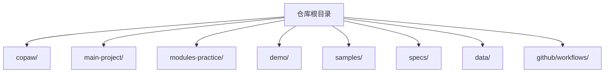
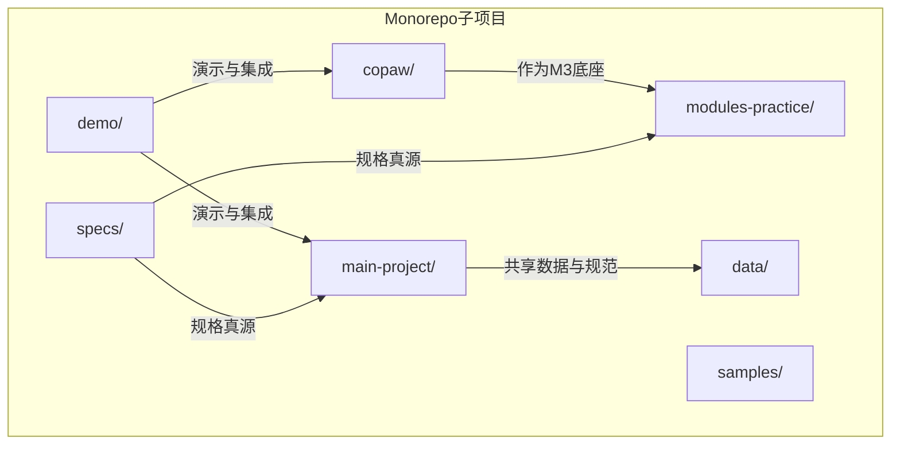
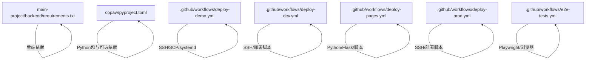

# 项目结构说明

<cite>
**本文档引用的文件**
- [.github/workflows/ai-code-review.yml](file://.github/workflows/ai-code-review.yml)
- [.github/workflows/deploy-demo.yml](file://.github/workflows/deploy-demo.yml)
- [.github/workflows/deploy-dev.yml](file://.github/workflows/deploy-dev.yml)
- [.github/workflows/deploy-pages.yml](file://.github/workflows/deploy-pages.yml)
- [.github/workflows/deploy-prod.yml](file://.github/workflows/deploy-prod.yml)
- [.github/workflows/e2e-tests.yml](file://.github/workflows/e2e-tests.yml)
- [.gitignore](file://.gitignore)
- [.pre-commit-config.yaml](file://.pre-commit-config.yaml)
- [AGENTS.md](file://AGENTS.md)
- [copaw/README.md](file://copaw/README.md)
- [copaw/pyproject.toml](file://copaw/pyproject.toml)
- [main-project/README.md](file://main-project/README.md)
- [main-project/backend/requirements.txt](file://main-project/backend/requirements.txt)
- [modules-practice/README.md](file://modules-practice/README.md)
- [specs/workshop/README.md](file://specs/workshop/README.md)
</cite>

## 目录
1. [简介](#简介)
2. [项目结构总览](#项目结构总览)
3. [核心目录详解](#核心目录详解)
4. [Monorepo架构概览](#monorepo架构概览)
5. [配置文件与脚本组织原则](#配置文件与脚本组织原则)
6. [文件查找与导航指南](#文件查找与导航指南)
7. [.gitignore忽略策略说明](#.gitignore忽略策略说明)
8. [新开发者快速入门路径](#新开发者快速入门路径)
9. [依赖关系分析](#依赖关系分析)
10. [性能与维护性考量](#性能与维护性考量)
11. [故障排查指南](#故障排查指南)
12. [结论](#结论)

## 简介
IRA项目是一个面向“5天投研助手Workshop”的Monorepo工程，包含主项目、AI助手底座（CoPaw）、演示部署（demo）、模块练习（modules-practice）、规格文档（specs）、示例项目（samples）、共享数据（data）以及CI/CD自动化工作流。项目采用“规格真源 + 练习实现”的分离模式，既保证了需求契约的稳定性，又提供了可运行的对照实现，便于教学与工程化落地。

## 项目结构总览
项目采用顶层目录分层组织，核心目录包括：
- copaw/：AI助手底座（AgentScope开源项目），提供多Agent协作、多渠道接入、技能扩展与安全机制
- main-project/：投研助手主项目（monorepo），包含Flask后端与React前端
- modules-practice/：模块练习区，按M1～M5拆分的独立学习模块
- demo/：演示部署项目（Nginx + Mock API + 静态页面）
- samples/：示例项目集合
- specs/：需求规格文档（含workshop规格与copaw知识库）
- data/：共享数据目录（被.gitignore忽略）
- .github/workflows/：CI/CD自动化工作流

图表来源
- [AGENTS.md:10-22](file://AGENTS.md#L10-L22)

章节来源
- [AGENTS.md:10-22](file://AGENTS.md#L10-L22)

## 核心目录详解

### copaw/：AI助手底座
- 定位：AgentScope团队开源的个人AI助手，支持多Agent协作、多渠道接入、技能扩展与安全扫描
- 技术栈：Python后端 + React前端控制台 + Docker镜像
- 关键子目录：
  - src/copaw/：核心Python包，包含agents、app、cli、providers、security等模块
  - console/：控制台前端（React + Vite）
  - website/：官方网站与文档站点
  - tests/：单元与集成测试
  - scripts/：安装、打包、Docker构建脚本
- 快速启动：支持pip安装、脚本安装、Docker三种方式，控制台默认端口8088

章节来源
- [copaw/README.md:81-128](file://copaw/README.md#L81-L128)
- [copaw/pyproject.toml:1-107](file://copaw/pyproject.toml#L1-L107)

### main-project/：投研助手主项目
- 定位：5天Workshop的主故事线应用，提供完整的前后端原型
- 技术栈：Flask 3.x + Python ≥ 3.8（后端）；React + Vite + TS（前端）
- 目录结构要点：
  - backend/app/：包含14个API蓝图与7个业务服务，遵循OpenAPI规范
  - frontend/src/：包含16个页面组件、6个通用组件、API客户端与配置
  - scripts/：部署脚本与数据种子
  - config/：认证配置
  - docs/：部署文档与架构图
- 快速启动：先执行数据种子，再分别启动后端（5000端口）与前端（5173端口）

章节来源
- [main-project/README.md:1-47](file://main-project/README.md#L1-L47)
- [AGENTS.md:28-78](file://AGENTS.md#L28-L78)

### modules-practice/：模块练习区
- 定位：按M1～M5风格拆分的独立练习包，便于分天教学与对照实现
- 关键模块：
  - M1 基础版：独立投研对话小全栈（简化实现），与主项目同命题不同体量
  - M2 GlueCoding 多源数据：多源采集、清洗、调度、可观测
  - M2 改进版：Glue静态页/样式练习
  - M3 知识库与问答（CoPaw底座）：基于CoPaw构建知识库问答系统
  - M4 推送：多渠道推送样例
  - M5 多Agent：多Agent基金投研平台
- 组织原则：规格真源在specs/workshop/，练习代码在modules-practice/，二者分离便于评审与版本管理

章节来源
- [modules-practice/README.md:1-38](file://modules-practice/README.md#L1-L38)
- [specs/workshop/README.md:1-37](file://specs/workshop/README.md#L1-L37)

### demo/：演示部署项目
- 定位：演示与集成样例，包含Nginx配置、Mock API与静态页面
- 技术栈：Nginx + Flask（Python）+ HTML/CSS/JS
- 目录结构：
  - mock-api/：Mock API服务与依赖
  - nginx/：Nginx配置
  - scripts/：部署脚本
  - static/：演示静态资源
- 自动化部署：通过GitHub Actions将配置与文件部署到ECS，支持手动触发与路径变更触发

章节来源
- [AGENTS.md:131-164](file://AGENTS.md#L131-L164)
- [.github/workflows/deploy-demo.yml:1-179](file://.github/workflows/deploy-demo.yml#L1-L179)

### samples/：示例项目
- 定位：各类示例与集成样例，如Qoder CLI与钉钉集成、API示例、调试重构示例等
- 作用：提供可运行的最小示例，便于理解特定技术栈或集成方式

章节来源
- [AGENTS.md:219-237](file://AGENTS.md#L219-L237)

### specs/：需求规格文档
- 定位：项目规格与契约的真源，包含workshop规格与copaw知识库
- 结构：
  - workshop/：各模块的Proposal/Spec/TC/任务拆解/OpenAPI等
  - copaw-repowiki/：CoPaw项目知识库文档
- 约定：模块docs/为行为与字段的冻结契约，实现不得与其冲突

章节来源
- [specs/workshop/README.md:1-37](file://specs/workshop/README.md#L1-L37)
- [AGENTS.md:273-286](file://AGENTS.md#L273-L286)

### data/：共享数据目录
- 定位：项目共享的数据文件（JSON），被.gitignore忽略
- 用途：主项目数据种子脚本初始化数据，演示与练习可共享

章节来源
- [AGENTS.md:313-324](file://AGENTS.md#L313-L324)
- [.gitignore:19-22](file://.gitignore#L19-L22)

## Monorepo架构概览
IRA采用Monorepo组织多个相互独立又有关联的子项目：
- 独立性：copaw/、main-project/、modules-practice/、demo/、samples/、specs/均为独立子项目，拥有自己的依赖、脚本与文档
- 关联性：通过共享的CI/CD、规范文档与数据目录形成协同；CoPaw作为M3模块的底座被复用；demo用于演示与集成验证

图表来源
- [AGENTS.md:10-22](file://AGENTS.md#L10-L22)
- [modules-practice/README.md:15-22](file://modules-practice/README.md#L15-L22)
- [specs/workshop/README.md:7-15](file://specs/workshop/README.md#L7-L15)

## 配置文件与脚本组织原则
- 配置文件分类：
  - 环境配置：.env、.env.*（被.gitignore忽略），示例配置在.env.example
  - 代码质量：.pre-commit-config.yaml（根、IRA、CoPaw三处配置）
  - CI/CD：.github/workflows/下的各工作流文件
- 脚本文件分类：
  - 部署脚本：main-project/scripts/、demo/scripts/
  - 安装与打包：copaw/scripts/
  - 工作坊检查：scripts/workshop-checker.py
- 组织原则：
  - 各子项目自包含配置与脚本，避免跨项目耦合
  - 共享配置（如.gitignore、pre-commit）在根目录统一管理
  - CI/CD按职责划分，demo、dev、prod、pages、e2e等独立工作流

章节来源
- [AGENTS.md:288-324](file://AGENTS.md#L288-L324)
- [.pre-commit-config.yaml:1-41](file://.pre-commit-config.yaml#L1-L41)
- [.github/workflows/deploy-demo.yml:1-179](file://.github/workflows/deploy-demo.yml#L1-L179)
- [.github/workflows/deploy-dev.yml:1-62](file://.github/workflows/deploy-dev.yml#L1-L62)
- [.github/workflows/deploy-pages.yml:1-102](file://.github/workflows/deploy-pages.yml#L1-L102)
- [.github/workflows/deploy-prod.yml:1-89](file://.github/workflows/deploy-prod.yml#L1-L89)
- [.github/workflows/e2e-tests.yml:1-80](file://.github/workflows/e2e-tests.yml#L1-L80)

## 文件查找与导航指南
- 快速定位：
  - 主项目API蓝图：main-project/backend/app/blueprints/
  - 主项目前端页面：main-project/frontend/src/pages/
  - CoPaw Agent实现：copaw/src/copaw/agents/
  - CoPaw CLI命令：copaw/src/copaw/cli/
  - Demo Nginx配置：demo/nginx/ira-demo.conf
  - 部署工作流：.github/workflows/deploy-demo.yml
- 端口分配参考：
  - IRA Backend：5000
  - IRA Frontend：5173
  - CoPaw Console：8088
  - Demo Nginx：80/443
  - Mock API：5001

章节来源
- [AGENTS.md:373-394](file://AGENTS.md#L373-L394)

## .gitignore忽略策略说明
忽略策略与原因：
- 前端产物与缓存：避免提交node_modules、dist、.env等开发产物与敏感配置
- 后端缓存：忽略__pycache__与pytest缓存，减少无关文件污染
- 数据目录：data/*.json与uploads/被忽略，保护真实数据与上传文件
- 环境与虚拟环境：.env、.venv、.tmp等
- 练习模块：modules-practice/**下统一忽略node_modules、__pycache__、pytest缓存、.env、dist、数据库与日志

章节来源
- [.gitignore:1-38](file://.gitignore#L1-L38)

## 新开发者快速入门路径
建议按以下路径快速熟悉项目：
- 第1天：基础熟悉
  - 阅读main-project/README.md了解主项目
  - 启动IRA前后端，熟悉界面与功能
  - 浏览copaw/README.md了解CoPaw能力
- 第2天：深入IRA
  - 研究main-project/backend/app/blueprints/了解API设计
  - 查看main-project/frontend/src/pages/了解前端架构
  - 运行测试，理解测试策略
- 第3天：CoPaw集成
  - 学习module-03/了解基于CoPaw的知识库实现
  - 阅读冻结版Spec文档
  - 尝试启动CoPaw并配置模型
- 第4天：模块练习
  - 完成module-02/ GlueCoding多源数据集成
  - 探索module-05/高级功能
  - 研究示例项目samples/
- 第5天：部署与CI/CD
  - 学习.github/workflows/自动化部署
  - 理解Demo项目的ECS部署流程
  - 配置代码质量工具（pre-commit）

章节来源
- [AGENTS.md:397-423](file://AGENTS.md#L397-L423)

## 依赖关系分析
- 语言与框架依赖：
  - Python：Flask（主项目后端）、pytest、dotenv等
  - JavaScript/TypeScript：Node.js、npm、Vite、React、ESLint、Prettier等
  - Docker：容器化部署与镜像构建
- 包管理与构建：
  - copaw/pyproject.toml定义了动态版本、包发现、可选依赖（dev、local、llamacpp、ollama、whisper、full）
  - main-project/backend/requirements.txt定义后端依赖
- CI/CD依赖：
  - GitHub Actions工作流依赖SSH、scp、systemd等远程部署工具

图表来源
- [main-project/backend/requirements.txt:1-7](file://main-project/backend/requirements.txt#L1-L7)
- [copaw/pyproject.toml:1-107](file://copaw/pyproject.toml#L1-L107)
- [.github/workflows/deploy-demo.yml:1-179](file://.github/workflows/deploy-demo.yml#L1-L179)
- [.github/workflows/deploy-dev.yml:1-62](file://.github/workflows/deploy-dev.yml#L1-L62)
- [.github/workflows/deploy-pages.yml:1-102](file://.github/workflows/deploy-pages.yml#L1-L102)
- [.github/workflows/deploy-prod.yml:1-89](file://.github/workflows/deploy-prod.yml#L1-L89)
- [.github/workflows/e2e-tests.yml:1-80](file://.github/workflows/e2e-tests.yml#L1-L80)

## 性能与维护性考量
- 性能：
  - 前端开发使用Vite，构建优化与热更新提升开发体验
  - 后端使用Flask，轻量且易于扩展
  - Docker镜像支持本地与云端部署，便于弹性扩容
- 维护性：
  - 规格真源与实现分离，降低契约漂移风险
  - CI/CD工作流自动化部署与测试，减少人工干预
  - 预提交钩子限制大文件与私钥，保障仓库健康

## 故障排查指南
- Demo部署失败：
  - 检查ECS主机连通性与凭据配置
  - 查看GitHub Actions日志中的SSH/SCP/systemd执行结果
  - 确认Nginx配置备份与重载是否成功
- E2E测试失败：
  - 检查Playwright浏览器安装与依赖
  - 查看测试报告与结果归档
- 本地启动问题：
  - 确认端口占用（5000、5173、8088等）
  - 检查环境变量与依赖安装
  - 参考各子项目的README与AGENTS.md中的常用命令

章节来源
- [.github/workflows/deploy-demo.yml:169-179](file://.github/workflows/deploy-demo.yml#L169-L179)
- [.github/workflows/e2e-tests.yml:67-80](file://.github/workflows/e2e-tests.yml#L67-L80)
- [AGENTS.md:327-372](file://AGENTS.md#L327-L372)

## 结论
IRA项目通过清晰的Monorepo结构、规范的规格真源与实现分离、完善的CI/CD自动化与代码质量工具，形成了一个可教、可学、可跑、可演的完整工程体系。新开发者可按“5天学习路径”逐步深入，先从主项目与CoPaw入手，再进入模块练习与部署实践，最终掌握从需求到上线的全流程能力。