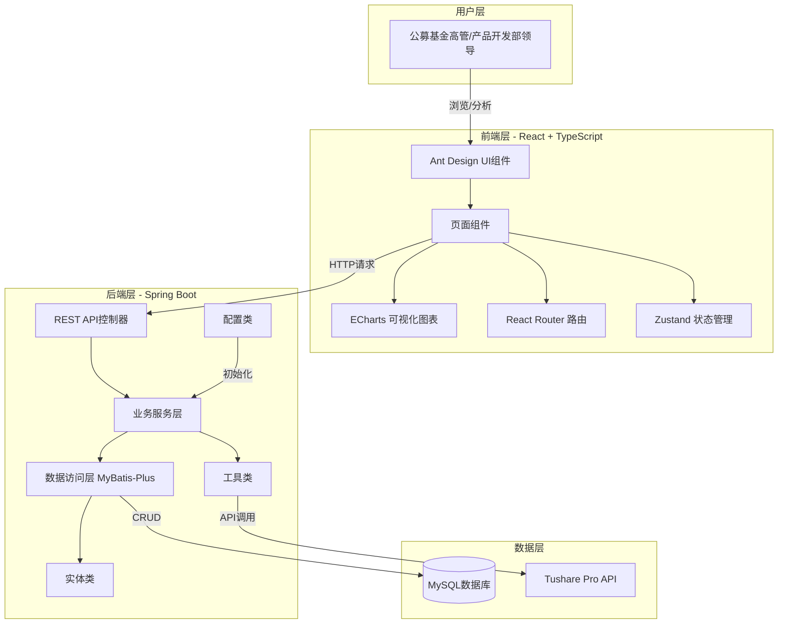
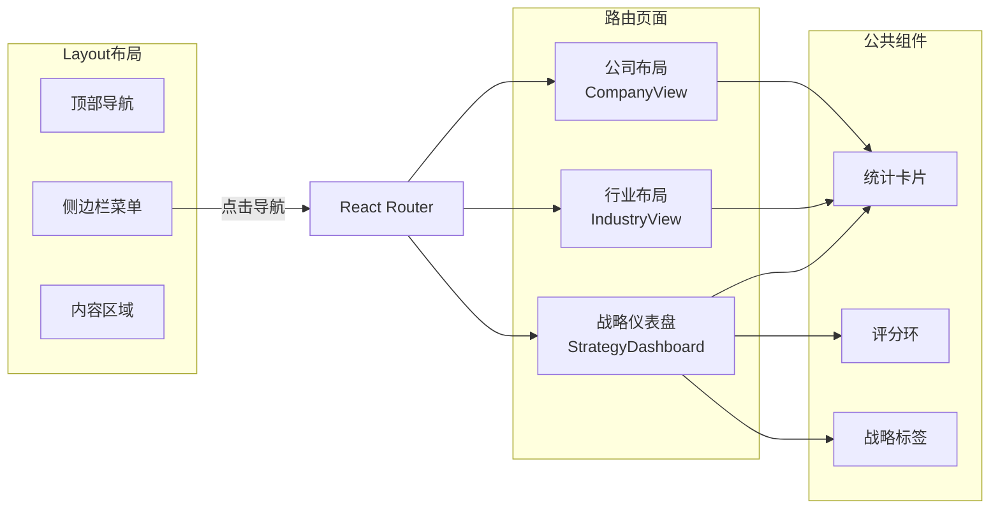
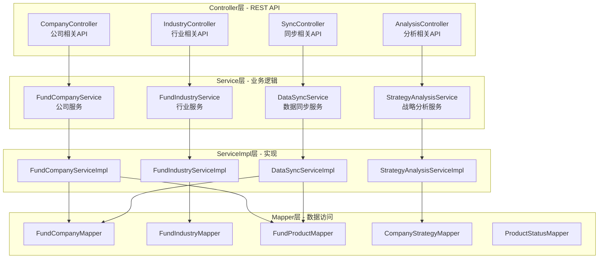
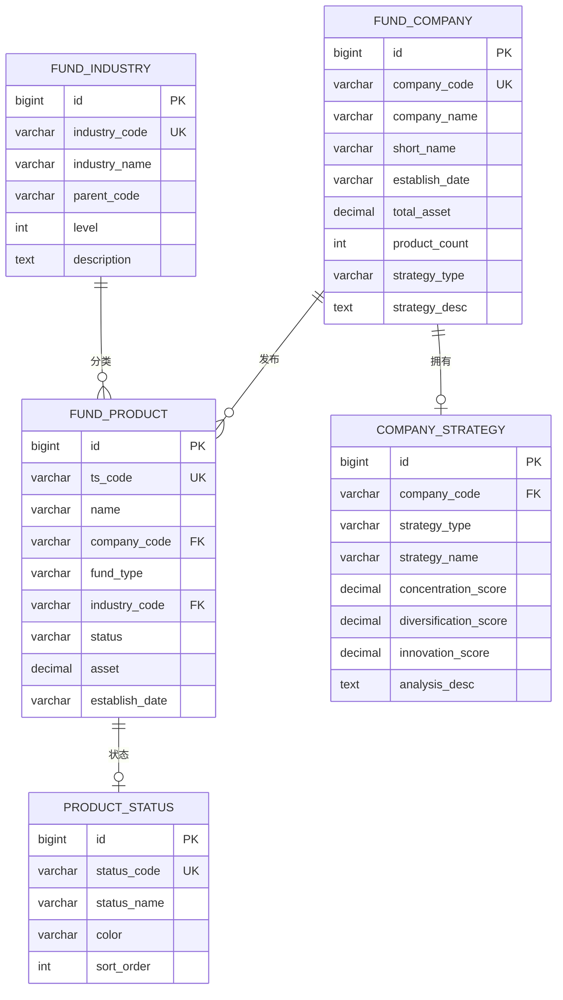
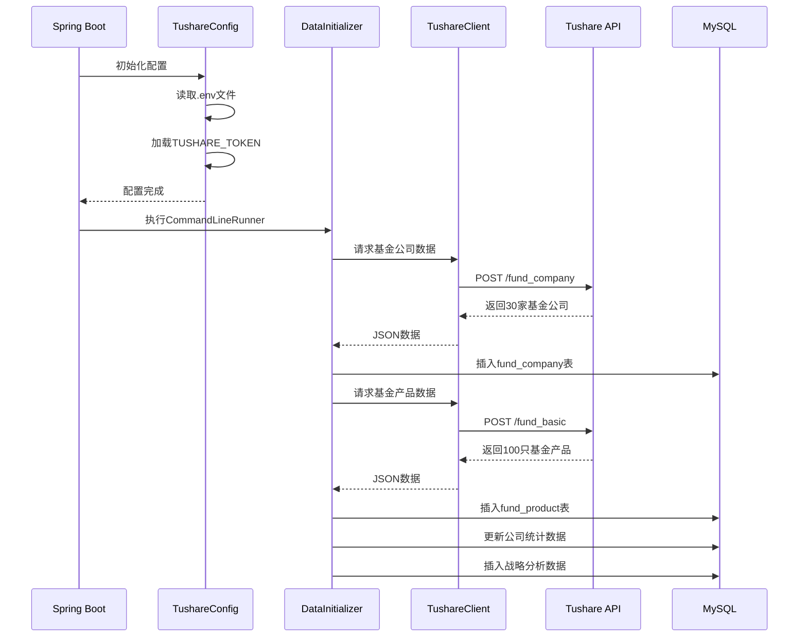
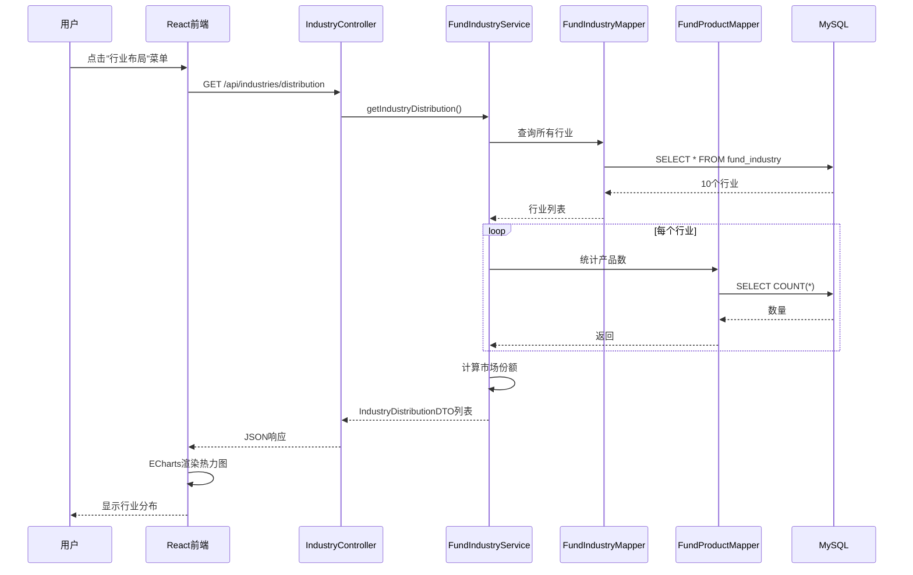
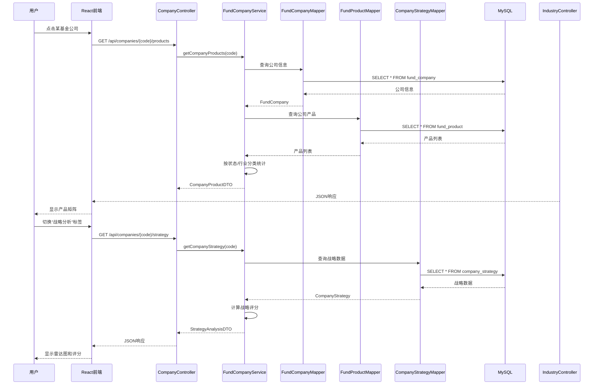
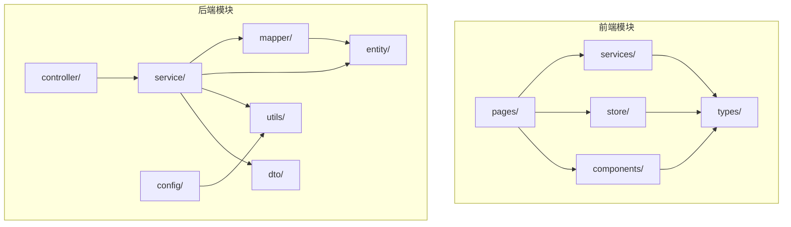
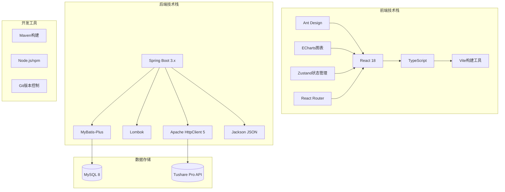
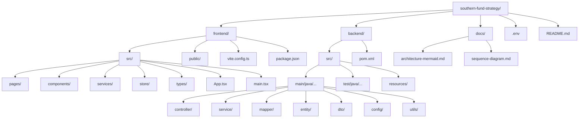

# 南方基金产品布局战略系统 - 架构图

## 1. 系统整体架构图

## 2. 前端页面结构图

## 3. 后端服务架构图

## 4. 数据实体关系图

## 5. 数据流图 - 系统启动初始化

## 6. 数据流图 - 用户查看行业布局

## 7. 数据流图 - 用户查看公司详情

## 8. 模块依赖关系图

## 9. 技术栈全景图

## 10. 项目文件结构图

---

## 图谱分析结果

基于代码扫描生成的知识图谱分析:

### 关键节点 (连接数最多)
| 排名 | 节点 | 连接数 | 说明 |
|------|------|--------|------|
| 1 | FundCompanyServiceImpl.java | 21 | 公司服务实现核心 |
| 2 | DataInitializer.java | 19 | 数据初始化器 |
| 3 | StrategyAnalysisServiceImpl.java | 19 | 战略分析服务实现 |
| 4 | DataSyncServiceImpl.java | 19 | 数据同步服务实现 |
| 5 | FundIndustryServiceImpl.java | 17 | 行业服务实现 |
| 6 | TushareClient.java | 15 | Tushare API客户端 |
| 7 | CompanyView.tsx | 12 | 公司视图页面 |
| 8 | StrategyDashboard.tsx | 10 | 战略仪表盘页面 |
| 9 | TushareApiTest.java | 10 | API测试类 |
| 10 | TushareConfig.java | 10 | 配置类 |

### 社区分布 (代码模块分组)
- 社区0: 9节点 - 前端页面组件
- 社区1: 7节点 - 后端服务实现
- 社区2-6: 6节点 - 各业务模块
- 其他: 5节点 - 工具类和配置

### 架构特点
1. **分层清晰**: Controller -> Service -> Mapper 三层架构
2. **前后端分离**: React前端 + Spring Boot后端
3. **数据驱动**: 从Tushare API获取真实数据
4. **模块化**: 按业务功能划分模块，职责单一
