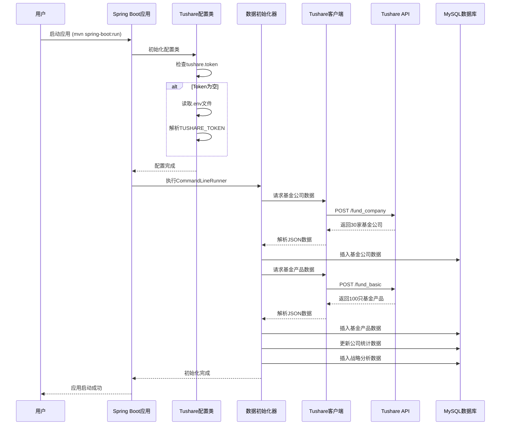
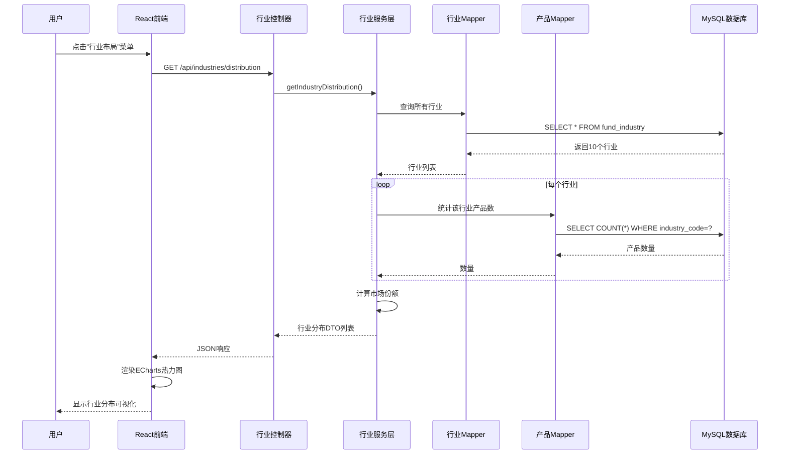
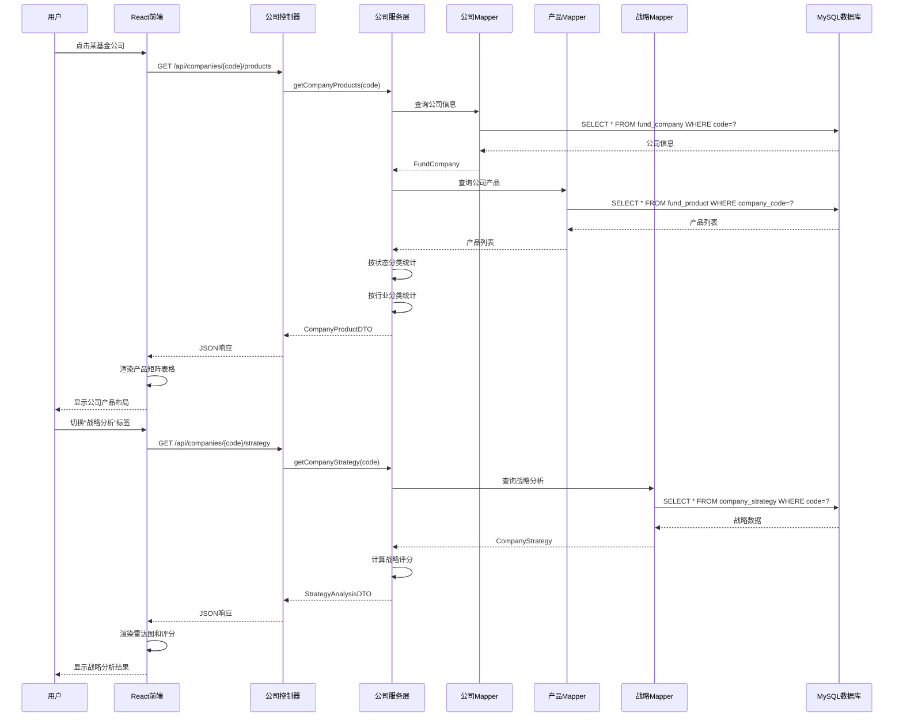
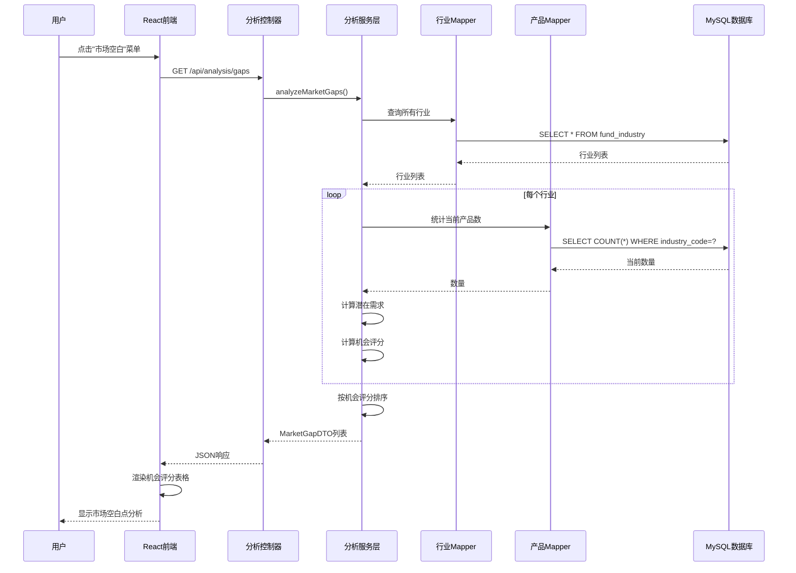
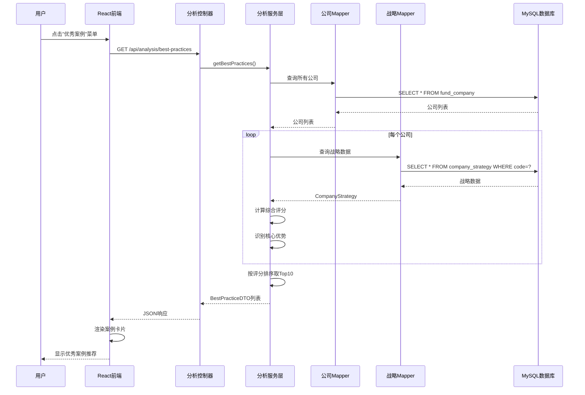
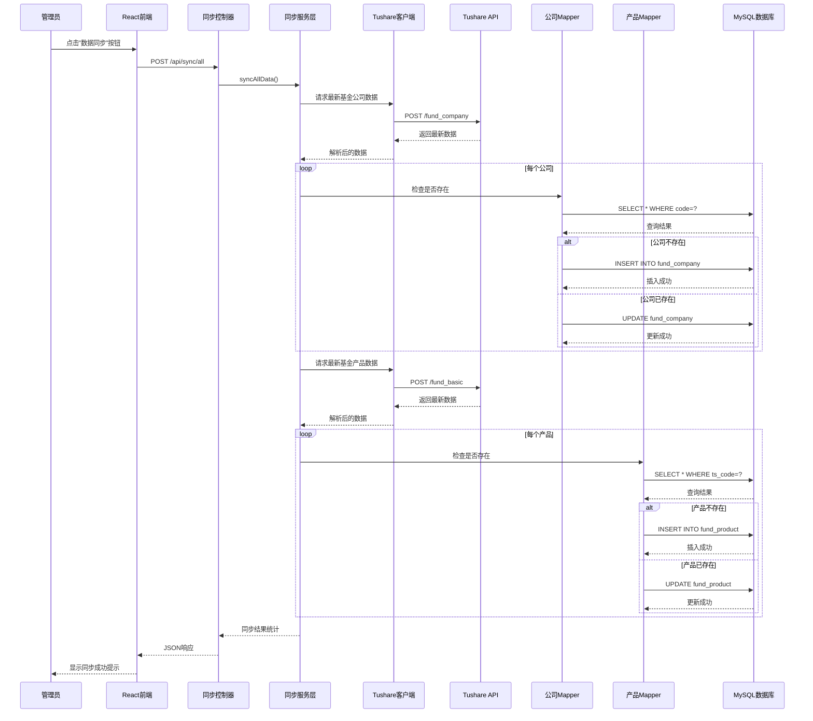
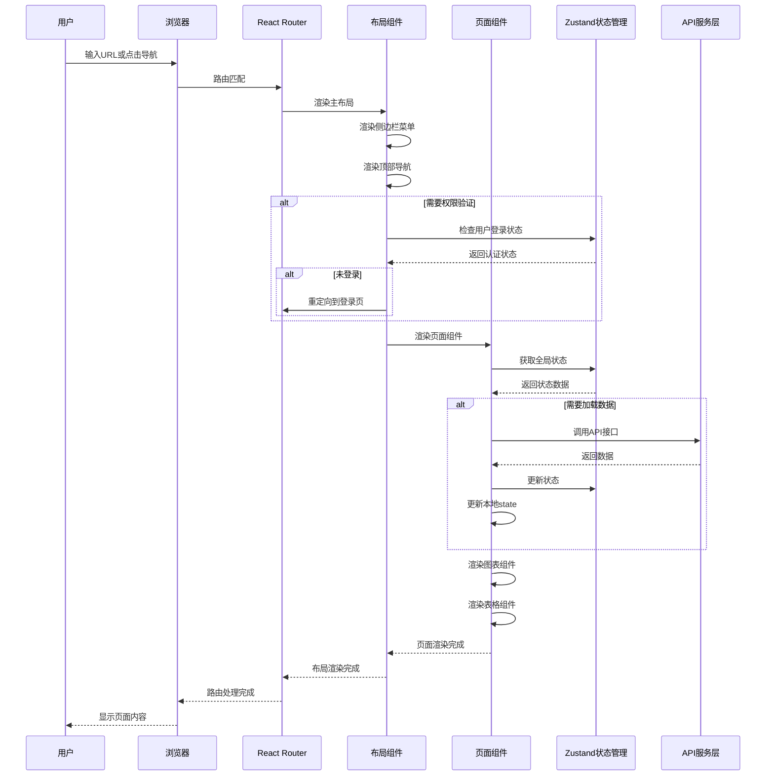

# 南方基金产品布局战略系统 - 时序图

## 1. 系统启动与数据初始化流程

## 2. 用户查看行业布局流程

## 3. 用户查看公司详情流程

## 4. 市场空白点分析流程

## 5. 优秀案例推荐流程

## 6. 数据同步流程

## 7. 前端路由跳转流程

## 组件说明

| 组件 | 职责 |
|------|------|
| **Spring Boot应用** | 后端服务入口，负责应用生命周期管理 |
| **TushareConfig** | 配置管理，自动加载.env文件中的Token |
| **DataInitializer** | 应用启动时初始化数据 |
| **TushareClient** | 封装Tushare API调用 |
| **XxxController** | REST API控制器，处理HTTP请求 |
| **XxxService** | 业务逻辑层，处理核心业务 |
| **XxxMapper** | 数据访问层，使用MyBatis-Plus |
| **React前端** | 用户界面，使用Ant Design + ECharts |
| **Zustand** | 前端状态管理 |
| **React Router** | 前端路由管理 |
