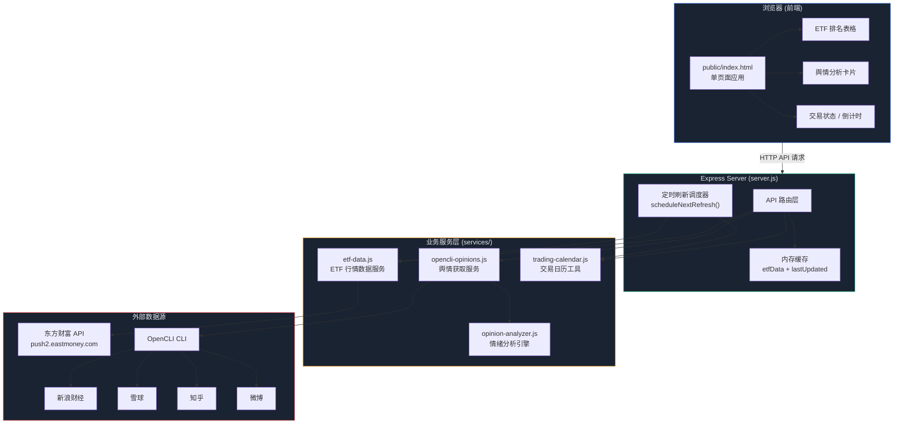
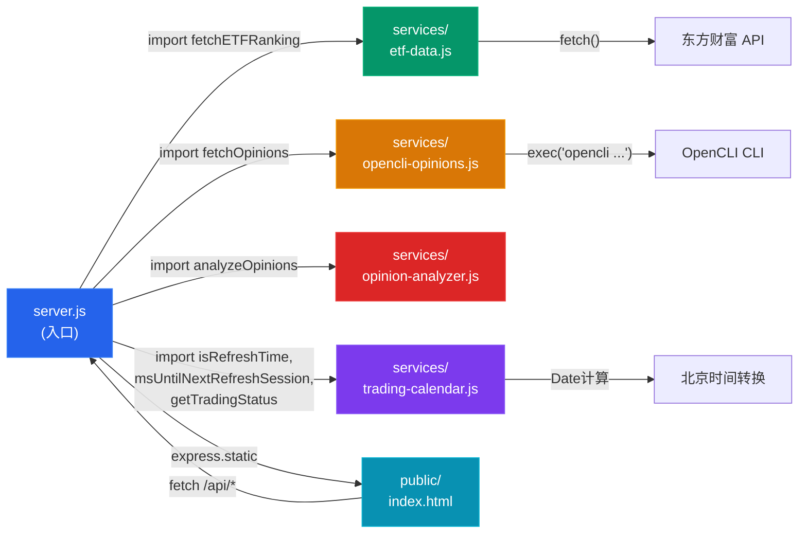
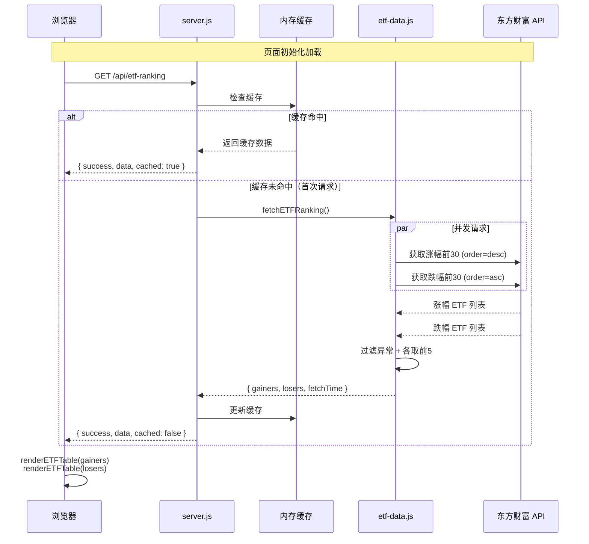
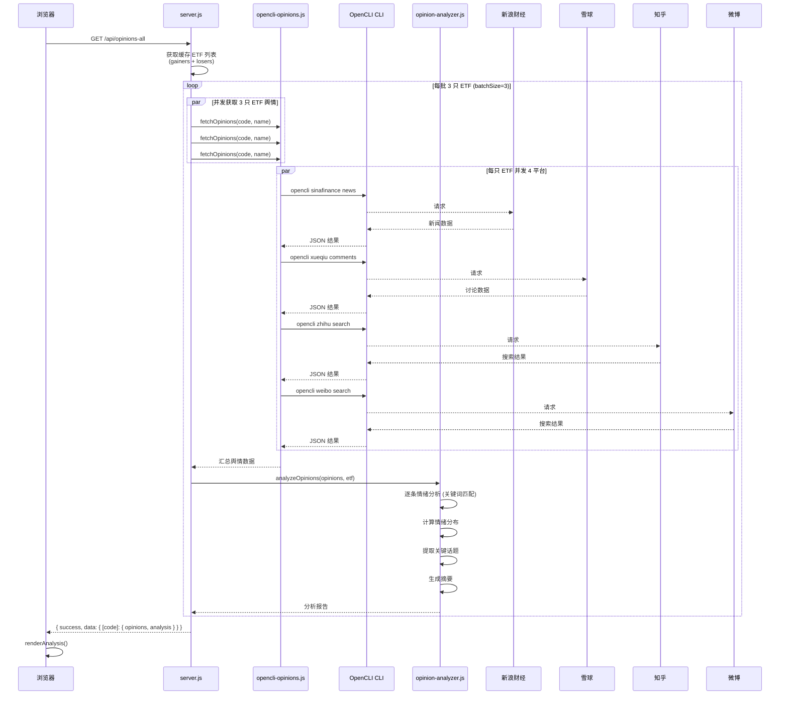
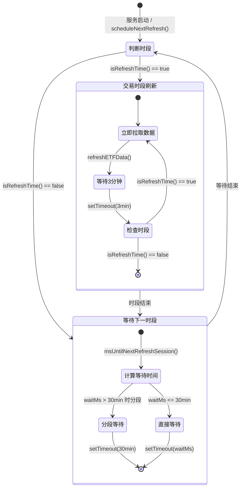
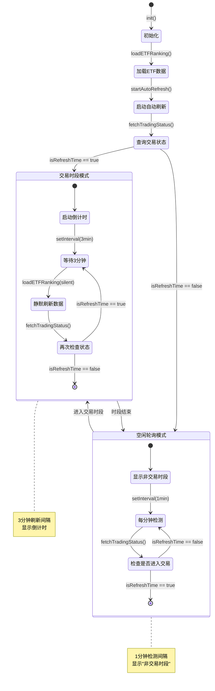
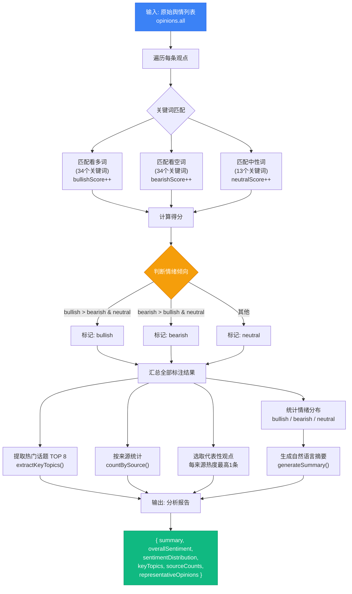
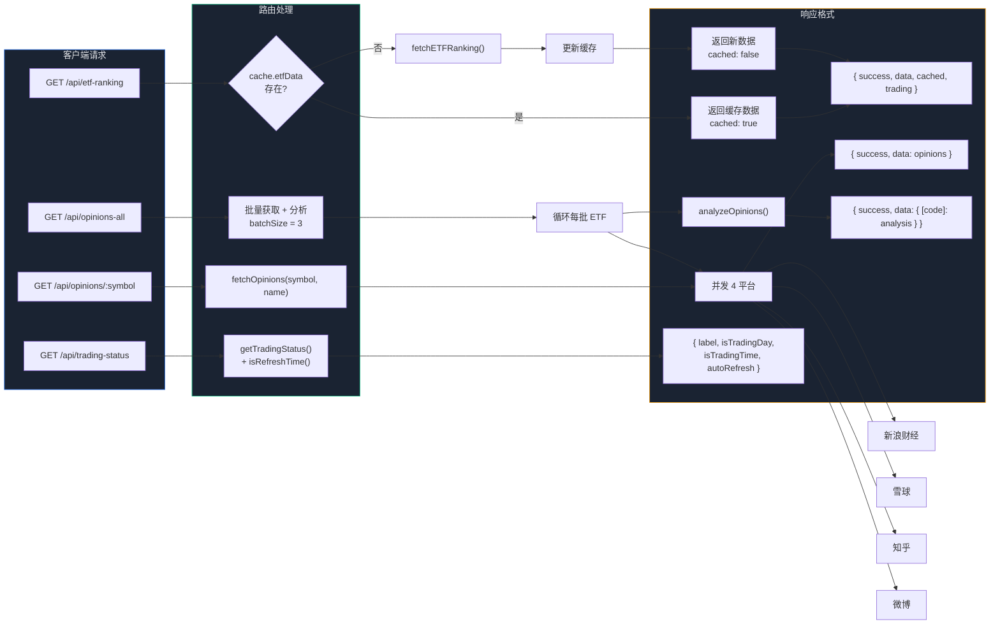
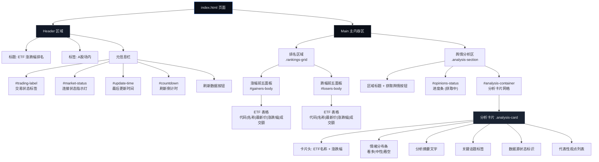

# ETF 涨跌幅排名网站 - Mermaid 架构图集

---

## 1. 系统架构总览

---

## 2. 模块依赖关系图

---

## 3. ETF 数据加载时序图

---

## 4. 舆情分析完整时序图

---

## 5. 服务端定时刷新调度状态机

---

## 6. 前端自动刷新调度状态机

---

## 7. A 股交易时段时间线

```mermaid
gantt
    title A 股交易日时段分布 (北京时间)
    dateFormat HH:mm
    axisFormat %H:%M

    section 刷新时段
    上午刷新 (含集合竞价)    :active, r1, 09:15, 11:30
    下午刷新 (含盘后缓冲)    :active, r2, 12:55, 15:05

    section 正式交易
    上午盘                    :crit, t1, 09:30, 11:30
    下午盘                    :crit, t2, 13:00, 15:00

    section 非交易
    盘前                      :done, n1, 00:00, 09:15
    午间休市                  :done, n2, 11:30, 12:55
    盘后                      :done, n3, 15:05, 23:59
```

---

## 8. 情绪分析处理流程

---

## 9. API 路由请求流程图

---

## 10. 前端页面组件结构

