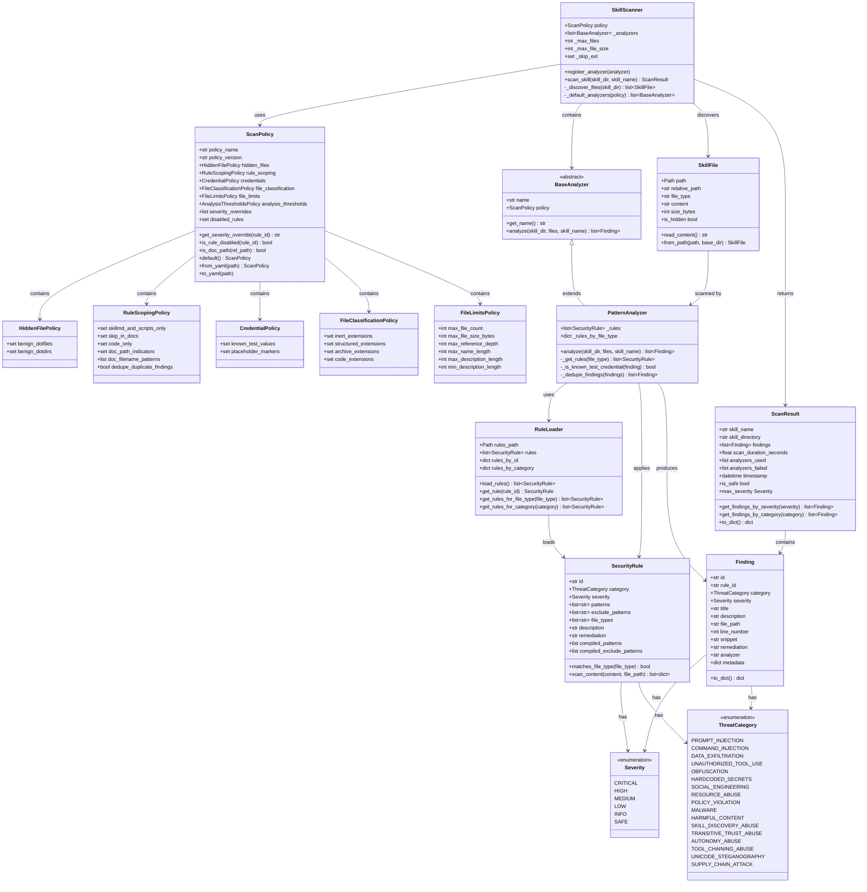
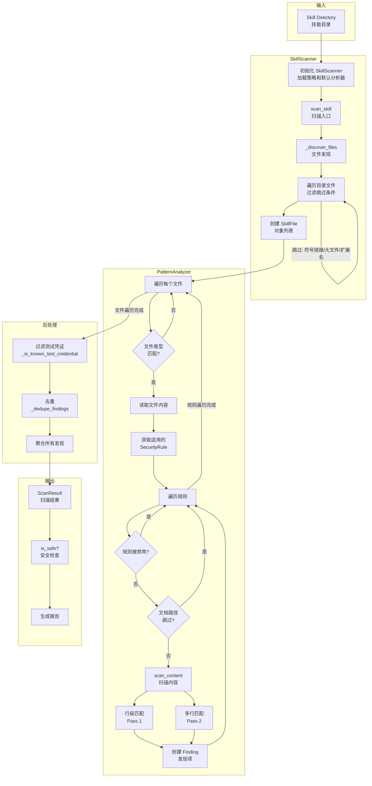
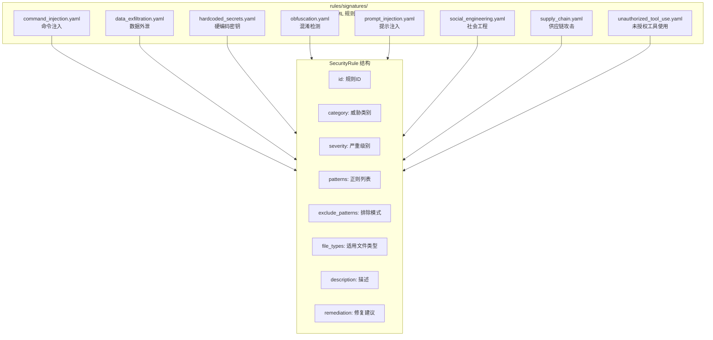
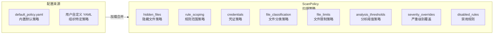

# Skill Scanner 模块架构文档

> 生成日期：2026-04-13  
> 模块路径：`copaw/src/copaw/security/skill_scanner/`

---

## 1. 概述

Skill Scanner 是 CoPaw 安全模块的核心组件，用于对 Agent Skill 进行静态安全扫描。它通过 YAML 正则签名规则检测潜在的安全威胁，支持可定制的扫描策略。

### 核心能力

- **文件发现**：递归遍历技能目录，自动过滤非扫描文件
- **多规则匹配**：基于 YAML 签名文件的正则模式匹配
- **策略定制**：支持组织级策略配置（允许列表、严重级别覆盖等）
- **威胁分类**：覆盖 17 种威胁类别

---

## 2. 类图



---

## 3. 扫描流程图



---

## 4. 规则签名文件结构



---

## 5. 策略配置结构



---

## 6. 模块职责说明

| 组件 | 文件路径 | 职责 |
|------|----------|------|
| **SkillScanner** | `scanner.py` | 扫描 orchestrator，协调文件发现和分析器执行 |
| **BaseAnalyzer** | `analyzers/__init__.py` | 分析器抽象基类 |
| **PatternAnalyzer** | `analyzers/pattern_analyzer.py` | 基于 YAML 正则签名的静态分析器 |
| **RuleLoader** | `analyzers/pattern_analyzer.py` | 从 YAML 文件加载和索引安全规则 |
| **SecurityRule** | `analyzers/pattern_analyzer.py` | 单个安全检测规则（正则模式 + 元数据） |
| **ScanPolicy** | `scan_policy.py` | 可定制的扫描策略（允许列表、范围控制等） |
| **SkillFile** | `models.py` | 技能包中的文件模型 |
| **Finding** | `models.py` | 安全发现项（规则匹配结果） |
| **ScanResult** | `models.py` | 扫描结果聚合（包含所有发现项和元数据） |

---

## 7. 威胁类别 (ThreatCategory)

| 类别 | 说明 |
|------|------|
| PROMPT_INJECTION | 提示注入攻击 |
| COMMAND_INJECTION | 命令注入攻击 |
| DATA_EXFILTRATION | 数据外泄 |
| UNAUTHORIZED_TOOL_USE | 未授权工具使用 |
| OBFUSCATION | 代码混淆 |
| HARDCODED_SECRETS | 硬编码密钥 |
| SOCIAL_ENGINEERING | 社会工程 |
| RESOURCE_ABUSE | 资源滥用 |
| POLICY_VIOLATION | 策略违规 |
| MALWARE | 恶意软件 |
| HARMFUL_CONTENT | 有害内容 |
| SKILL_DISCOVERY_ABUSE | Skill 发现滥用 |
| TRANSITIVE_TRUST_ABUSE | 传递信任滥用 |
| AUTONOMY_ABUSE | 自主性滥用 |
| TOOL_CHAINING_ABUSE | 工具链滥用 |
| UNICODE_STEGANOGRAPHY | Unicode 隐写 |
| SUPPLY_CHAIN_ATTACK | 供应链攻击 |

---

## 8. 目录结构

```
skill_scanner/
├── analyzers/
│   ├── __init__.py              # BaseAnalyzer 基类
│   └── pattern_analyzer.py      # PatternAnalyzer, RuleLoader, SecurityRule
├── data/
│   └── default_policy.yaml      # 默认扫描策略
├── rules/signatures/
│   ├── command_injection.yaml   # 命令注入规则
│   ├── data_exfiltration.yaml   # 数据外泄规则
│   ├── hardcoded_secrets.yaml   # 硬编码密钥规则
│   ├── obfuscation.yaml         # 混淆检测规则
│   ├── prompt_injection.yaml    # 提示注入规则
│   ├── social_engineering.yaml  # 社会工程规则
│   ├── supply_chain.yaml        # 供应链攻击规则
│   └── unauthorized_tool_use.yaml # 未授权工具使用规则
├── __init__.py
├── models.py                    # SkillFile, Finding, ScanResult, 枚举
├── scan_policy.py               # ScanPolicy 及策略子类
└── scanner.py                   # SkillScanner 主类
```
