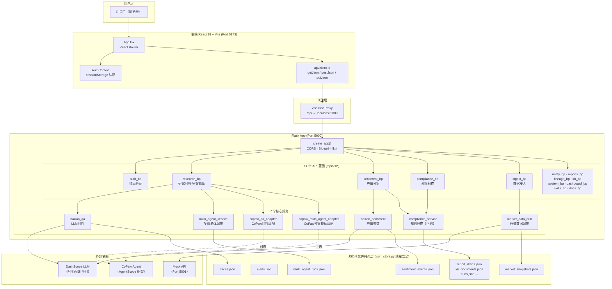
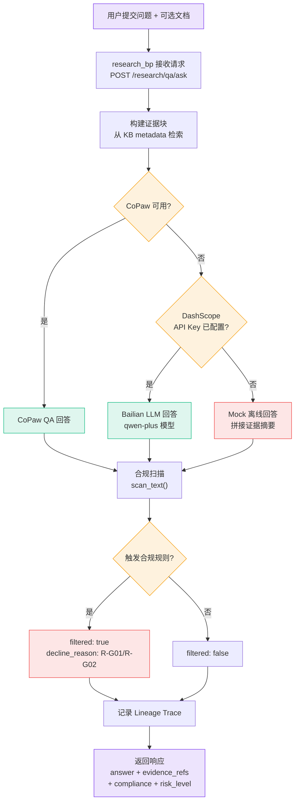
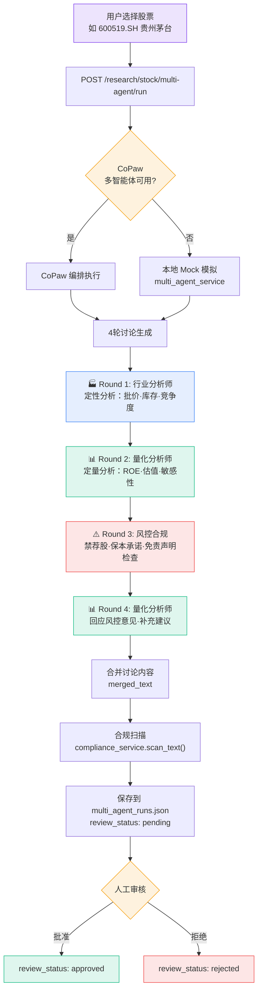
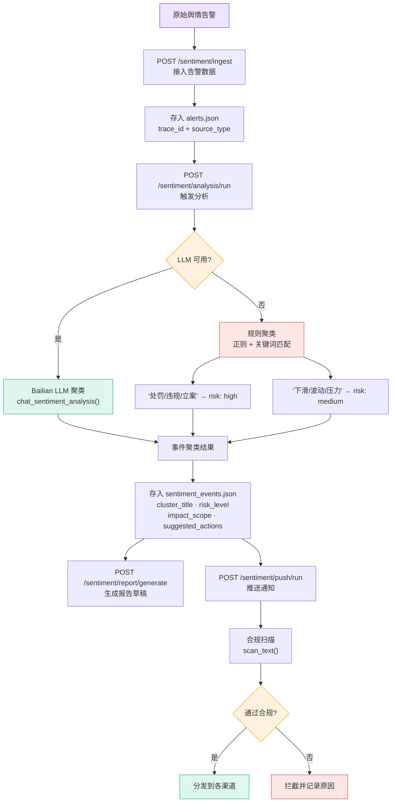
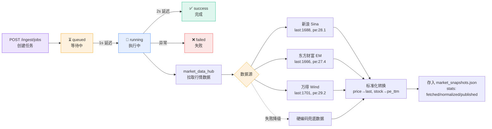
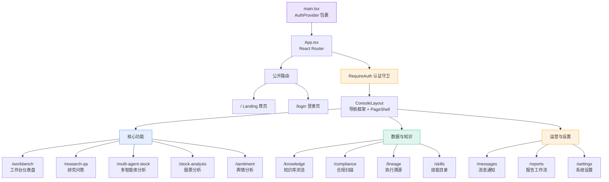
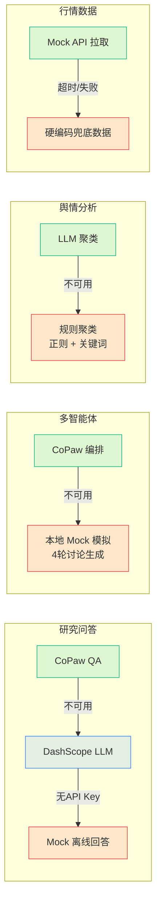

# IRA 投研助手 — 系统架构流程图（Mermaid）

---

## 1. 整体系统架构

```mermaid
graph TB
    subgraph 用户层
        User["👤 用户（浏览器）"]
    end

    subgraph 前端["前端 React 18 + Vite (Port 5173)"]
        FE_App["App.tsx<br/>React Router"]
        FE_Auth["AuthContext<br/>sessionStorage 认证"]
        FE_API["api/client.ts<br/>getJson / postJson / putJson"]
    end

    subgraph 代理层
        Proxy["Vite Dev Proxy<br/>/api → localhost:5000"]
    end

    subgraph 后端["Flask App (Port 5000)"]
        Flask["create_app()<br/>CORS · Blueprint注册"]

        subgraph 蓝图层["14 个 API 蓝图 (/api/v1/*)"]
            BP_Auth["auth_bp<br/>登录验证"]
            BP_Research["research_bp<br/>研究问答·多智能体"]
            BP_Sentiment["sentiment_bp<br/>舆情分析"]
            BP_Compliance["compliance_bp<br/>合规扫描"]
            BP_Ingest["ingest_bp<br/>数据接入"]
            BP_Others["notify_bp · reports_bp<br/>lineage_bp · kb_bp<br/>system_bp · dashboard_bp<br/>skills_bp · docs_bp"]
        end

        subgraph 服务层["7 个核心服务"]
            SVC_Bailian["bailian_qa<br/>LLM问答"]
            SVC_Multi["multi_agent_service<br/>多智能体编排"]
            SVC_Compliance["compliance_service<br/>规则扫描（正则）"]
            SVC_Market["market_data_hub<br/>行情数据编排"]
            SVC_Sentiment["bailian_sentiment<br/>舆情聚类"]
            SVC_CoPaw_QA["copaw_qa_adapter<br/>CoPaw问答适配"]
            SVC_CoPaw_MA["copaw_multi_agent_adapter<br/>CoPaw多智能体适配"]
        end
    end

    subgraph 外部依赖
        LLM["DashScope LLM<br/>（阿里百炼·千问）"]
        CoPaw["CoPaw Agent<br/>（AgentScope 框架）"]
        MockAPI["Mock API<br/>（Port 5001）"]
    end

    subgraph 数据层["JSON 文件持久层 (json_store.py 线程安全)"]
        DB_Traces["traces.json"]
        DB_Alerts["alerts.json"]
        DB_Events["sentiment_events.json"]
        DB_Runs["multi_agent_runs.json"]
        DB_Snapshots["market_snapshots.json"]
        DB_Others["report_drafts.json<br/>kb_documents.json<br/>rules.json ..."]
    end

    User --> FE_App
    FE_App --> FE_Auth
    FE_App --> FE_API
    FE_API --> Proxy
    Proxy --> Flask

    Flask --> BP_Auth
    Flask --> BP_Research
    Flask --> BP_Sentiment
    Flask --> BP_Compliance
    Flask --> BP_Ingest
    Flask --> BP_Others

    BP_Research --> SVC_Bailian
    BP_Research --> SVC_Multi
    BP_Research --> SVC_CoPaw_QA
    BP_Research --> SVC_CoPaw_MA
    BP_Sentiment --> SVC_Sentiment
    BP_Sentiment --> SVC_Compliance
    BP_Compliance --> SVC_Compliance
    BP_Ingest --> SVC_Market

    SVC_Bailian --> LLM
    SVC_Sentiment --> LLM
    SVC_CoPaw_QA -.->|可选| CoPaw
    SVC_CoPaw_MA -.->|可选| CoPaw
    SVC_Market --> MockAPI

    SVC_Bailian --> DB_Traces
    SVC_Multi --> DB_Runs
    SVC_Sentiment --> DB_Events
    SVC_Market --> DB_Snapshots
    SVC_Compliance --> DB_Others
```

---

## 2. 研究问答流程

```mermaid
flowchart TD
    A["用户提交问题 + 可选文档"] --> B["research_bp 接收请求<br/>POST /research/qa/ask"]
    B --> C["构建证据块<br/>从 KB metadata 检索"]
    C --> D{"CoPaw 可用?"}

    D -->|是| E["CoPaw QA 回答"]
    D -->|否| F{"DashScope<br/>API Key 已配置?"}

    F -->|是| G["Bailian LLM 回答<br/>qwen-plus 模型"]
    F -->|否| H["Mock 离线回答<br/>拼接证据摘要"]

    E --> I["合规扫描<br/>scan_text()"]
    G --> I
    H --> I

    I --> J{"触发合规规则?"}
    J -->|是| K["filtered: true<br/>decline_reason: R-G01/R-G02"]
    J -->|否| L["filtered: false"]

    K --> M["记录 Lineage Trace"]
    L --> M

    M --> N["返回响应<br/>answer + evidence_refs<br/>+ compliance + risk_level"]

    style A fill:#7c3aed22,stroke:#7c3aed
    style N fill:#7c3aed22,stroke:#7c3aed
    style D fill:#f59e0b22,stroke:#f59e0b
    style F fill:#f59e0b22,stroke:#f59e0b
    style J fill:#f59e0b22,stroke:#f59e0b
    style E fill:#10b98122,stroke:#10b981
    style G fill:#10b98122,stroke:#10b981
    style H fill:#ef444422,stroke:#ef4444
    style K fill:#ef444422,stroke:#ef4444
```

---

## 3. 多智能体股票分析流程

```mermaid
flowchart TD
    A["用户选择股票<br/>如 600519.SH 贵州茅台"] --> B["POST /research/stock/multi-agent/run"]
    B --> C{"CoPaw<br/>多智能体可用?"}

    C -->|是| D["CoPaw 编排执行"]
    C -->|否| E["本地 Mock 模拟<br/>multi_agent_service"]

    D --> F["4轮讨论生成"]
    E --> F

    F --> G["🏭 Round 1: 行业分析师<br/>定性分析：批价·库存·竞争度"]
    G --> H["📊 Round 2: 量化分析师<br/>定量分析：ROE·估值·敏感性"]
    H --> I["⚠️ Round 3: 风控合规<br/>禁荐股·保本承诺·免责声明检查"]
    I --> J["📊 Round 4: 量化分析师<br/>回应风控意见·补充建议"]

    J --> K["合并讨论内容<br/>merged_text"]
    K --> L["合规扫描<br/>compliance_service.scan_text()"]
    L --> M["保存到 multi_agent_runs.json<br/>review_status: pending"]
    M --> N{"人工审核"}

    N -->|批准| O["review_status: approved"]
    N -->|拒绝| P["review_status: rejected"]

    style A fill:#7c3aed22,stroke:#7c3aed
    style C fill:#f59e0b22,stroke:#f59e0b
    style N fill:#f59e0b22,stroke:#f59e0b
    style G fill:#3b82f622,stroke:#3b82f6
    style H fill:#10b98122,stroke:#10b981
    style I fill:#ef444422,stroke:#ef4444
    style J fill:#10b98122,stroke:#10b981
    style O fill:#10b98122,stroke:#10b981
    style P fill:#ef444422,stroke:#ef4444
```

---

## 4. 舆情分析管线

```mermaid
flowchart TD
    A["原始舆情告警"] --> B["POST /sentiment/ingest<br/>接入告警数据"]
    B --> C["存入 alerts.json<br/>trace_id + source_type"]
    C --> D["POST /sentiment/analysis/run<br/>触发分析"]
    D --> E{"LLM 可用?"}

    E -->|是| F["Bailian LLM 聚类<br/>chat_sentiment_analysis()"]
    E -->|否| G["规则聚类<br/>正则 + 关键词匹配"]

    G --> G1["'处罚/违规/立案' → risk: high"]
    G --> G2["'下滑/波动/压力' → risk: medium"]

    F --> H["事件聚类结果"]
    G1 --> H
    G2 --> H

    H --> I["存入 sentiment_events.json<br/>cluster_title · risk_level<br/>impact_scope · suggested_actions"]

    I --> J["POST /sentiment/report/generate<br/>生成报告草稿"]
    I --> K["POST /sentiment/push/run<br/>推送通知"]

    K --> L["合规扫描<br/>scan_text()"]
    L --> M{"通过合规?"}
    M -->|是| N["分发到各渠道"]
    M -->|否| O["拦截并记录原因"]

    style A fill:#7c3aed22,stroke:#7c3aed
    style E fill:#f59e0b22,stroke:#f59e0b
    style M fill:#f59e0b22,stroke:#f59e0b
    style F fill:#10b98122,stroke:#10b981
    style G fill:#ef444422,stroke:#ef4444
    style N fill:#10b98122,stroke:#10b981
    style O fill:#ef444422,stroke:#ef4444
```

---

## 5. 数据接入流程（Job 状态机）

```mermaid
flowchart LR
    A["POST /ingest/jobs<br/>创建任务"] --> B["⏳ queued<br/>等待中"]
    B -->|"1s 延迟"| C["🔄 running<br/>执行中"]
    C -->|"2s 延迟"| D["✅ success<br/>完成"]
    C -->|"异常"| E["❌ failed<br/>失败"]

    C --> F["market_data_hub<br/>拉取行情数据"]

    F --> G{"数据源"}
    G --> G1["新浪 Sina<br/>last:1688, pe:28.1"]
    G --> G2["东方财富 EM<br/>last:1666, pe:27.4"]
    G --> G3["万得 Wind<br/>last:1701, pe:29.2"]
    G -.->|"失败降级"| G4["硬编码兜底数据"]

    G1 --> H["标准化转换<br/>price→last, stock→pe_ttm"]
    G2 --> H
    G3 --> H
    G4 --> H

    H --> I["存入 market_snapshots.json<br/>stats: fetched/normalized/published"]

    style A fill:#7c3aed22,stroke:#7c3aed
    style B fill:#f59e0b22,stroke:#f59e0b
    style C fill:#3b82f622,stroke:#3b82f6
    style D fill:#10b98122,stroke:#10b981
    style E fill:#ef444422,stroke:#ef4444
    style G fill:#f59e0b22,stroke:#f59e0b
```

---

## 6. 前端路由结构

```mermaid
graph TD
    Entry["main.tsx<br/>AuthProvider 包裹"] --> Router["App.tsx<br/>React Router"]

    Router --> Public["公开路由"]
    Router --> Guard["RequireAuth 认证守卫"]

    Public --> Landing["/ Landing 首页"]
    Public --> Login["/login 登录页"]

    Guard --> Layout["ConsoleLayout<br/>导航框架 + PageShell"]

    Layout --> Core["核心功能"]
    Layout --> Data["数据与知识"]
    Layout --> Ops["运营与设置"]

    Core --> Workbench["/workbench<br/>工作台仪表盘"]
    Core --> ResearchQA["/research-qa<br/>研究问答"]
    Core --> MultiAgent["/multi-agent-stock<br/>多智能体分析"]
    Core --> StockAnalysis["/stock-analysis<br/>股票分析"]
    Core --> Sentiment["/sentiment<br/>舆情分析"]

    Data --> Knowledge["/knowledge<br/>知识库浏览"]
    Data --> Compliance["/compliance<br/>合规扫描"]
    Data --> Lineage["/lineage<br/>执行溯源"]
    Data --> Skills["/skills<br/>技能目录"]

    Ops --> Messages["/messages<br/>消息通知"]
    Ops --> Reports["/reports<br/>报告工作流"]
    Ops --> Settings["/settings<br/>系统设置"]

    style Entry fill:#7c3aed22,stroke:#7c3aed
    style Guard fill:#f59e0b22,stroke:#f59e0b
    style Core fill:#3b82f622,stroke:#3b82f6
    style Data fill:#10b98122,stroke:#10b981
    style Ops fill:#f59e0b22,stroke:#f59e0b
```

---

## 7. 服务降级策略总览

```mermaid
flowchart LR
    subgraph 研究问答
        QA1["CoPaw QA"] -->|不可用| QA2["DashScope LLM"]
        QA2 -->|无API Key| QA3["Mock 离线回答"]
    end

    subgraph 多智能体
        MA1["CoPaw 编排"] -->|不可用| MA2["本地 Mock 模拟<br/>4轮讨论生成"]
    end

    subgraph 舆情分析
        SA1["LLM 聚类"] -->|不可用| SA2["规则聚类<br/>正则 + 关键词"]
    end

    subgraph 行情数据
        MD1["Mock API 拉取"] -->|超时/失败| MD2["硬编码兜底数据"]
    end

    style QA1 fill:#10b98122,stroke:#10b981
    style QA2 fill:#3b82f622,stroke:#3b82f6
    style QA3 fill:#ef444422,stroke:#ef4444
    style MA1 fill:#10b98122,stroke:#10b981
    style MA2 fill:#ef444422,stroke:#ef4444
    style SA1 fill:#10b98122,stroke:#10b981
    style SA2 fill:#ef444422,stroke:#ef4444
    style MD1 fill:#10b98122,stroke:#10b981
    style MD2 fill:#ef444422,stroke:#ef4444
```
