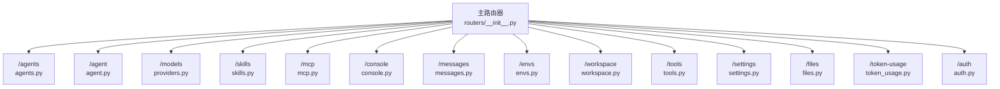
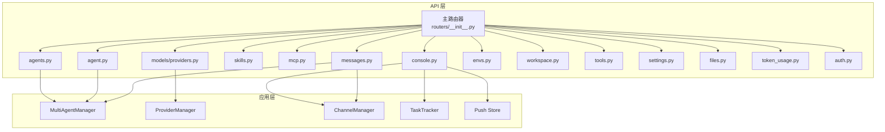
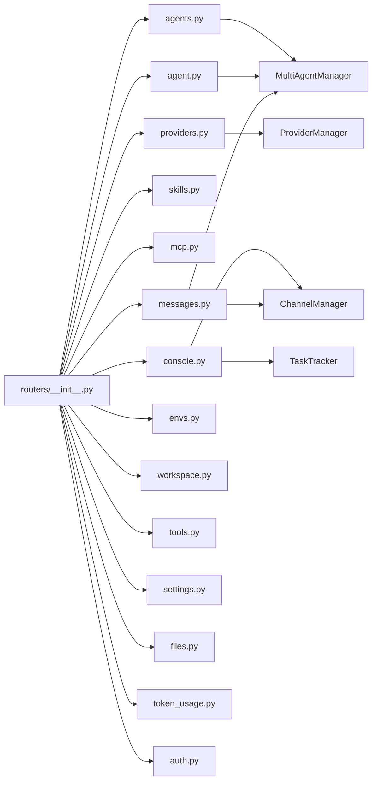

# API参考文档

<cite>
**本文档引用的文件**
- [src/qwenpaw/app/routers/__init__.py](file://src/qwenpaw/app/routers/__init__.py)
- [src/qwenpaw/app/routers/agent.py](file://src/qwenpaw/app/routers/agent.py)
- [src/qwenpaw/app/routers/agents.py](file://src/qwenpaw/app/routers/agents.py)
- [src/qwenpaw/app/routers/auth.py](file://src/qwenpaw/app/routers/auth.py)
- [src/qwenpaw/app/routers/envs.py](file://src/qwenpaw/app/routers/envs.py)
- [src/qwenpaw/app/routers/providers.py](file://src/qwenpaw/app/routers/providers.py)
- [src/qwenpaw/app/routers/skills.py](file://src/qwenpaw/app/routers/skills.py)
- [src/qwenpaw/app/routers/mcp.py](file://src/qwenpaw/app/routers/mcp.py)
- [src/qwenpaw/app/routers/console.py](file://src/qwenpaw/app/routers/console.py)
- [src/qwenpaw/app/routers/settings.py](file://src/qwenpaw/app/routers/settings.py)
- [src/qwenpaw/app/routers/tools.py](file://src/qwenpaw/app/routers/tools.py)
- [src/qwenpaw/app/routers/workspace.py](file://src/qwenpaw/app/routers/workspace.py)
- [src/qwenpaw/app/routers/messages.py](file://src/qwenpaw/app/routers/messages.py)
- [src/qwenpaw/app/routers/files.py](file://src/qwenpaw/app/routers/files.py)
- [src/qwenpaw/app/routers/token_usage.py](file://src/qwenpaw/app/routers/token_usage.py)
</cite>

## 目录
1. [简介](#简介)
2. [项目结构](#项目结构)
3. [核心组件](#核心组件)
4. [架构总览](#架构总览)
5. [详细组件分析](#详细组件分析)
6. [依赖分析](#依赖分析)
7. [性能考虑](#性能考虑)
8. [故障排查指南](#故障排查指南)
9. [结论](#结论)
10. [附录](#附录)

## 简介
本文件为 QwenPaw 的完整 API 参考文档，覆盖代理管理、渠道与消息、技能管理、模型与提供商、环境变量、MCP 客户端、控制台聊天与上传、工作区打包/解包、令牌用量统计等全部 RESTful 接口。文档同时说明认证方式、错误处理策略、安全与速率限制建议、版本控制与向后兼容性提示，并提供常见使用场景的调用示例与客户端实现要点。

## 项目结构
API 路由集中于 src/qwenpaw/app/routers 下，通过主路由器聚合挂载。每个模块负责一类资源或功能域，如 /agents、/models、/skills、/mcp、/console、/messages、/envs、/workspace 等。

图表来源
- [src/qwenpaw/app/routers/__init__.py](file://src/qwenpaw/app/routers/__init__.py)

章节来源
- [src/qwenpaw/app/routers/__init__.py](file://src/qwenpaw/app/routers/__init__.py)

## 核心组件
- 认证与授权：支持登录、注册、状态检查、令牌校验与更新资料；受环境变量控制开关。
- 多代理管理：创建、删除、启用/禁用、排序、读取/更新配置、列出工作区文件与内存文件。
- 代理配置与运行：语言、音频模式、转录提供者、活动模型、系统提示文件等。
- 模型与提供商：列出/配置提供商、自定义提供商、发现模型、测试连接、模型配置、活动模型设置。
- 技能管理：技能池与工作区技能列表、从 Hub 搜索/安装、上传 ZIP、创建/保存技能、导入冲突处理、扫描安全风险。
- MCP 客户端：创建/更新/删除/启用切换、查询可用工具、敏感信息掩码展示。
- 控制台与消息：SSE 流式对话、停止会话、文件上传、推送消息拉取。
- 渠道消息发送：通过通道主动发送文本消息（需 X-Agent-Id 头）。
- 环境变量：批量读取/写入/删除。
- 工作区：下载/上传整个工作区为 ZIP，安全校验与合并。
- 工具：内置工具列表与启用/异步执行配置。
- 设置：UI 语言设置（无需认证）。
- 文件预览：静态文件预览接口。
- 令牌用量：按日期/模型/提供商聚合统计。

章节来源
- [src/qwenpaw/app/routers/auth.py](file://src/qwenpaw/app/routers/auth.py)
- [src/qwenpaw/app/routers/agents.py](file://src/qwenpaw/app/routers/agents.py)
- [src/qwenpaw/app/routers/agent.py](file://src/qwenpaw/app/routers/agent.py)
- [src/qwenpaw/app/routers/providers.py](file://src/qwenpaw/app/routers/providers.py)
- [src/qwenpaw/app/routers/skills.py](file://src/qwenpaw/app/routers/skills.py)
- [src/qwenpaw/app/routers/mcp.py](file://src/qwenpaw/app/routers/mcp.py)
- [src/qwenpaw/app/routers/console.py](file://src/qwenpaw/app/routers/console.py)
- [src/qwenpaw/app/routers/messages.py](file://src/qwenpaw/app/routers/messages.py)
- [src/qwenpaw/app/routers/envs.py](file://src/qwenpaw/app/routers/envs.py)
- [src/qwenpaw/app/routers/workspace.py](file://src/qwenpaw/app/routers/workspace.py)
- [src/qwenpaw/app/routers/tools.py](file://src/qwenpaw/app/routers/tools.py)
- [src/qwenpaw/app/routers/settings.py](file://src/qwenpaw/app/routers/settings.py)
- [src/qwenpaw/app/routers/files.py](file://src/qwenpaw/app/routers/files.py)
- [src/qwenpaw/app/routers/token_usage.py](file://src/qwenpaw/app/routers/token_usage.py)

## 架构总览
下图展示了 API 路由与核心服务的关系：各路由模块通过上下文获取代理工作区、通道管理器、多代理管理器、提供商管理器等，实现对代理、模型、技能、MCP、消息、工作区等资源的统一编排。

图表来源
- [src/qwenpaw/app/routers/__init__.py](file://src/qwenpaw/app/routers/__init__.py)
- [src/qwenpaw/app/routers/agents.py](file://src/qwenpaw/app/routers/agents.py)
- [src/qwenpaw/app/routers/agent.py](file://src/qwenpaw/app/routers/agent.py)
- [src/qwenpaw/app/routers/providers.py](file://src/qwenpaw/app/routers/providers.py)
- [src/qwenpaw/app/routers/console.py](file://src/qwenpaw/app/routers/console.py)
- [src/qwenpaw/app/routers/messages.py](file://src/qwenpaw/app/routers/messages.py)

## 详细组件分析

### 认证与授权 (/auth)
- 登录：POST /api/auth/login（用户名+密码）
- 注册：POST /api/auth/register（仅允许一次，受环境变量控制）
- 状态：GET /api/auth/status（是否启用认证、是否存在用户）
- 校验：GET /api/auth/verify（Bearer 令牌）
- 更新资料：POST /api/auth/update-profile（当前密码+新用户名/新密码）

认证方式
- 使用 Bearer 令牌进行后续请求鉴权（除 /auth/status 外均需）。

安全与速率限制
- 建议在网关层实施登录失败次数限制与 IP 限速；注册仅允许一次，避免重放攻击。

章节来源
- [src/qwenpaw/app/routers/auth.py](file://src/qwenpaw/app/routers/auth.py)

### 多代理管理 (/agents)
- 列表：GET /api/agents
- 重排：PUT /api/agents/order
- 创建：POST /api/agents（自动分配 ID，初始化工作区与默认文件）
- 读取：GET /api/agents/{agentId}
- 更新：PUT /api/agents/{agentId}
- 删除：DELETE /api/agents/{agentId}（不可删除 default）
- 启用/禁用：PATCH /api/agents/{agentId}/toggle
- 代理工作区文件：GET /api/agents/{agentId}/files
- 读取工作区文件：GET /api/agents/{agentId}/files/{filename}
- 写入工作区文件：PUT /api/agents/{agentId}/files/{filename}
- 代理内存文件：GET /api/agents/{agentId}/memory

代理配置要点
- 支持语言、通道、心跳、MCP、工具等配置项；更新后触发热重载。

章节来源
- [src/qwenpaw/app/routers/agents.py](file://src/qwenpaw/app/routers/agents.py)

### 代理配置与运行 (/agent)
- 工作区文件：GET /api/agent/files；读取：GET /api/agent/files/{md_name}；写入：PUT /api/agent/files/{md_name}
- 内存文件：GET /api/agent/memory；读取：GET /api/agent/memory/{md_name}；写入：PUT /api/agent/memory/{md_name}
- 语言：GET /api/agent/language；PUT /api/agent/language（支持 zh/en/ru）
- 音频模式：GET /api/agent/audio-mode；PUT /api/agent/audio-mode（auto/native）
- 转录提供者类型：GET /api/agent/transcription-provider-type；PUT /api/agent/transcription-provider-type（disabled/whisper_api/local_whisper）
- 本地 Whisper 状态：GET /api/agent/local-whisper-status
- 转录提供者列表：GET /api/agent/transcription-providers
- 设置转录提供者：PUT /api/agent/transcription-provider
- 运行配置：GET /api/agent/running-config；PUT /api/agent/running-config
- 系统提示文件：GET /api/agent/system-prompt-files；PUT /api/agent/system-prompt-files

章节来源
- [src/qwenpaw/app/routers/agent.py](file://src/qwenpaw/app/routers/agent.py)

### 模型与提供商 (/models)
- 列出提供商：GET /api/models
- 配置提供商：PUT /api/models/{provider_id}/config
- 创建自定义提供商：POST /api/models/custom-providers
- 测试提供商连接：POST /api/models/{provider_id}/test
- 发现模型：POST /api/models/{provider_id}/discover?save=true
- 测试指定模型：POST /api/models/{provider_id}/models/test
- 删除自定义提供商：DELETE /api/models/custom-providers/{provider_id}
- 添加模型到提供商：POST /api/models/{provider_id}/models
- 探测多模态能力：POST /api/models/{provider_id}/models/{model_id:path}/probe-multimodal
- 从提供商移除模型：DELETE /api/models/{provider_id}/models/{model_id:path}
- 配置模型生成参数：PUT /api/models/{provider_id}/models/{model_id:path}/config
- 获取活动模型：GET /api/models/active?scope=effective|global|agent&agent_id=...
- 设置活动模型：PUT /api/models/active（支持全局或特定代理）

版本与兼容
- 活动模型作用域：effective（优先代理，否则全局）、global（仅全局）、agent（仅代理，需提供 agent_id）。

章节来源
- [src/qwenpaw/app/routers/providers.py](file://src/qwenpaw/app/routers/providers.py)

### 技能管理 (/skills)
- 工作区技能列表：GET /api/skills
- 强制刷新：POST /api/skills/refresh
- Hub 搜索：GET /api/skills/hub/search?q=&limit=
- 工作区技能源：GET /api/skills/workspaces
- 从 Hub 安装开始：POST /api/skills/hub/install/start（返回任务 ID）
- 查询安装状态：GET /api/skills/hub/install/status/{task_id}
- 取消安装：POST /api/skills/hub/install/cancel/{task_id}
- 技能池列表：GET /api/skills/pool
- 刷新技能池：POST /api/skills/pool/refresh
- 内置来源：GET /api/skills/pool/builtin-sources
- 创建工作区技能：POST /api/skills（支持 references/scripts/config）
- 上传 ZIP：POST /api/skills/upload（支持重命名映射）
- 创建技能池技能：POST /api/skills/pool/create
- 保存/改名技能池：PUT /api/skills/pool/save
- 下载技能池到工作区：POST /api/skills/pool/download（可批量目标工作区）

安全扫描
- 安装/导入过程若触发安全扫描失败，返回 422 并携带严重级别与发现详情。

章节来源
- [src/qwenpaw/app/routers/skills.py](file://src/qwenpaw/app/routers/skills.py)

### MCP 客户端管理 (/mcp)
- 列出客户端：GET /api/mcp
- 获取客户端：GET /api/mcp/{client_key}
- 创建客户端：POST /api/mcp（返回掩码后的敏感信息）
- 更新客户端：PUT /api/mcp/{client_key}（支持恢复原始敏感值）
- 切换启用：PATCH /api/mcp/{client_key}/toggle
- 删除客户端：DELETE /api/mcp/{client_key}
- 查询工具：GET /api/mcp/{client_key}/tools（需已连接）

敏感信息掩码
- 返回的环境变量与 HTTP 头部值进行掩码保护，避免泄露。

章节来源
- [src/qwenpaw/app/routers/mcp.py](file://src/qwenpaw/app/routers/mcp.py)

### 控制台与消息流 (/console)
- 流式聊天：POST /api/console/chat（SSE，支持断线重连 reconnect=true）
- 停止会话：POST /api/console/chat/stop?chat_id=...
- 文件上传：POST /api/console/upload（最大 10MB）
- 推送消息：GET /api/console/push-messages?session_id=...

消息格式
- SSE 数据帧逐条推送，异常时以 JSON 字符串形式回传错误对象。

章节来源
- [src/qwenpaw/app/routers/console.py](file://src/qwenpaw/app/routers/console.py)

### 主动消息发送 (/messages)
- 发送文本消息：POST /api/messages/send（需要 X-Agent-Id 头）
- 参数：channel、target_user、target_session、text
- 成功返回 success 与 message

章节来源
- [src/qwenpaw/app/routers/messages.py](file://src/qwenpaw/app/routers/messages.py)

### 环境变量管理 (/envs)
- 列出：GET /api/envs
- 批量保存：PUT /api/envs（全量替换，未提供的键将被移除）
- 删除：DELETE /api/envs/{key}

章节来源
- [src/qwenpaw/app/routers/envs.py](file://src/qwenpaw/app/routers/envs.py)

### 工作区打包与上传 (/workspace)
- 下载：GET /api/workspace/download（返回 ZIP 流）
- 上传：POST /api/workspace/upload（ZIP 合并到工作区，防止路径穿越）

章节来源
- [src/qwenpaw/app/routers/workspace.py](file://src/qwenpaw/app/routers/workspace.py)

### 内置工具管理 (/tools)
- 列表：GET /api/tools
- 切换启用：PATCH /api/tools/{tool_name}/toggle
- 更新异步执行：PATCH /api/tools/{tool_name}/async-execution

章节来源
- [src/qwenpaw/app/routers/tools.py](file://src/qwenpaw/app/routers/tools.py)

### 全局设置 (/settings)
- 获取语言：GET /api/settings/language
- 更新语言：PUT /api/settings/language（支持 en/zh/ja/ru）

章节来源
- [src/qwenpaw/app/routers/settings.py](file://src/qwenpaw/app/routers/settings.py)

### 文件预览 (/files)
- 预览：GET /api/files/preview/{filepath:path}（支持 HEAD）

章节来源
- [src/qwenpaw/app/routers/files.py](file://src/qwenpaw/app/routers/files.py)

### 令牌用量统计 (/token-usage)
- 获取汇总：GET /api/token-usage?start_date=&end_date=&model=&provider=

章节来源
- [src/qwenpaw/app/routers/token_usage.py](file://src/qwenpaw/app/routers/token_usage.py)

## 依赖分析
- 路由聚合：主路由器集中挂载所有子路由，形成统一入口。
- 上下文依赖：多数路由通过 get_agent_for_request 获取代理工作区；部分路由依赖 MultiAgentManager、ProviderManager 等。
- 通道与任务：控制台聊天依赖 ChannelManager、TaskTracker；消息发送依赖 ChannelManager。
- 安全扫描：技能安装/导入阶段集成安全扫描，失败返回 422。

图表来源
- [src/qwenpaw/app/routers/__init__.py](file://src/qwenpaw/app/routers/__init__.py)
- [src/qwenpaw/app/routers/agents.py](file://src/qwenpaw/app/routers/agents.py)
- [src/qwenpaw/app/routers/agent.py](file://src/qwenpaw/app/routers/agent.py)
- [src/qwenpaw/app/routers/providers.py](file://src/qwenpaw/app/routers/providers.py)
- [src/qwenpaw/app/routers/console.py](file://src/qwenpaw/app/routers/console.py)
- [src/qwenpaw/app/routers/messages.py](file://src/qwenpaw/app/routers/messages.py)

## 性能考虑
- SSE 流式响应：控制台聊天采用流式传输，客户端应正确处理断线重连与背压。
- 热重载：代理配置更新后触发非阻塞热重载，避免长时间阻塞请求。
- ZIP 操作：工作区打包/上传为 IO 密集型，建议在后台线程执行并限制并发。
- 提供商连接测试：避免在生产中频繁发起连接测试，建议缓存结果或按需探测。
- 令牌用量统计：按日期范围查询，建议前端限制时间跨度，减少数据库压力。

## 故障排查指南
- 401 未认证：检查 Authorization 头是否为 Bearer 令牌，或是否满足注册/登录条件。
- 403 禁止访问：认证未启用或已存在用户，或缺少权限。
- 404 资源不存在：代理、通道、技能、MCP 客户端、文件等不存在。
- 422 安全扫描失败：技能导入被拦截，查看返回的严重级别与发现详情。
- 500 服务器内部错误：多代理管理器未初始化、通道管理器未就绪、模型连接失败等。
- 上传限制：文件过大、内容类型不匹配、ZIP 路径穿越校验失败。

章节来源
- [src/qwenpaw/app/routers/auth.py](file://src/qwenpaw/app/routers/auth.py)
- [src/qwenpaw/app/routers/skills.py](file://src/qwenpaw/app/routers/skills.py)
- [src/qwenpaw/app/routers/console.py](file://src/qwenpaw/app/routers/console.py)
- [src/qwenpaw/app/routers/messages.py](file://src/qwenpaw/app/routers/messages.py)
- [src/qwenpaw/app/routers/workspace.py](file://src/qwenpaw/app/routers/workspace.py)

## 结论
本 API 文档系统性覆盖了 QwenPaw 的核心能力：多代理生命周期管理、模型与提供商配置、技能生态、MCP 客户端、控制台与通道消息、工作区与环境变量、工具与设置、文件预览与令牌用量统计。建议在生产环境中结合认证、速率限制、安全扫描与监控体系，确保系统的稳定性与安全性。

## 附录

### WebSocket 接口说明
- 当前 API 未提供专用 WebSocket 端点；控制台聊天通过 SSE 实现流式交互，适用于浏览器与标准 HTTP 客户端。

### 版本控制与向后兼容
- 路由前缀统一为 /api；版本号未在路由中显式暴露。建议在网关层维护版本策略，逐步迁移旧字段与行为，保持兼容。

### 常见使用场景与示例

- 登录与获取令牌
  - POST /api/auth/login
  - 请求体：{"username":"...","password":"..."}
  - 成功返回：{"token":"...","username":"..."}

- 创建代理并初始化工作区
  - POST /api/agents
  - 请求体：{"name":"...","description":"","language":"zh|en|ru","skill_names":[]}

- 设置活动模型（代理级）
  - PUT /api/models/active
  - 请求体：{"provider_id":"...","model":"...","scope":"agent","agent_id":"..."}

- 从 Hub 安装技能
  - POST /api/skills/hub/install/start
  - 返回任务 ID，轮询 GET /api/skills/hub/install/status/{task_id}

- 控制台流式聊天
  - POST /api/console/chat（SSE）
  - 断线重连：在请求体中设置 reconnect=true

- 主动发送消息
  - POST /api/messages/send
  - 头部：X-Agent-Id: ...
  - 请求体：{"channel":"console","target_user":"...","target_session":"...","text":"..."}

- 环境变量管理
  - PUT /api/envs（全量替换）
  - DELETE /api/envs/{key}

- 工作区打包与上传
  - GET /api/workspace/download
  - POST /api/workspace/upload（multipart/form-data）

- 获取令牌用量
  - GET /api/token-usage?start_date=YYYY-MM-DD&end_date=YYYY-MM-DD&model=&provider=