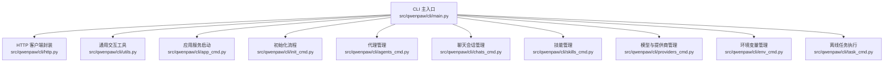
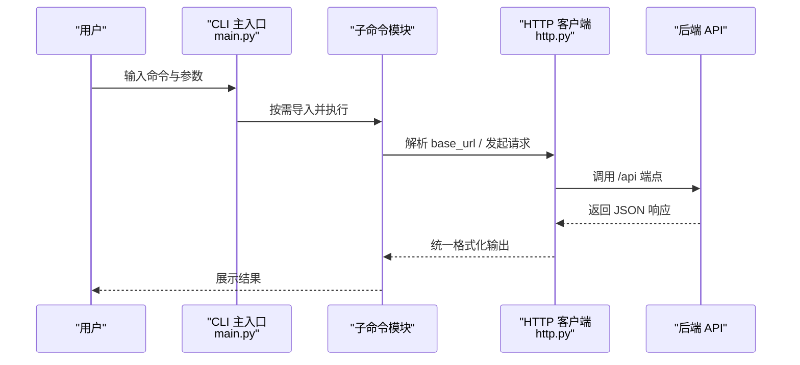
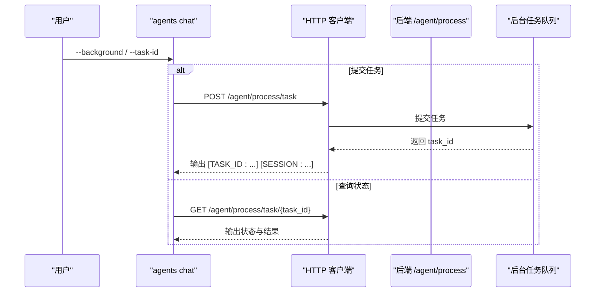
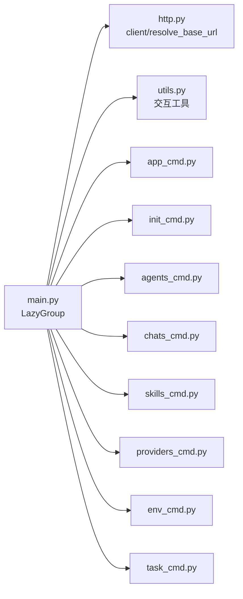

# CLI API

<cite>
**本文引用的文件**
- [main.py](file://src/qwenpaw/cli/main.py)
- [http.py](file://src/qwenpaw/cli/http.py)
- [utils.py](file://src/qwenpaw/cli/utils.py)
- [app_cmd.py](file://src/qwenpaw/cli/app_cmd.py)
- [init_cmd.py](file://src/qwenpaw/cli/init_cmd.py)
- [agents_cmd.py](file://src/qwenpaw/cli/agents_cmd.py)
- [chats_cmd.py](file://src/qwenpaw/cli/chats_cmd.py)
- [skills_cmd.py](file://src/qwenpaw/cli/skills_cmd.py)
- [providers_cmd.py](file://src/qwenpaw/cli/providers_cmd.py)
- [env_cmd.py](file://src/qwenpaw/cli/env_cmd.py)
- [task_cmd.py](file://src/qwenpaw/cli/task_cmd.py)
- [cli.en.md](file://website/public/docs/cli.en.md)
</cite>

## 目录
1. [简介](#简介)
2. [项目结构](#项目结构)
3. [核心组件](#核心组件)
4. [架构总览](#架构总览)
5. [详细组件分析](#详细组件分析)
6. [依赖分析](#依赖分析)
7. [性能考虑](#性能考虑)
8. [故障排除指南](#故障排除指南)
9. [结论](#结论)
10. [附录](#附录)

## 简介
本文件为 QwenPaw 命令行接口（CLI）的权威文档，覆盖所有子命令及其用法、参数、输出格式、最佳实践与自动化方案。CLI 通过统一入口聚合各功能模块，支持模型与环境变量管理、通道与聊天会话管理、代理间通信、计划任务、技能配置以及离线任务执行等能力。CLI 同时提供与 Web API 的映射关系与数据同步机制说明，便于在本地或服务器环境中进行脚本化与自动化运维。

## 项目结构
CLI 入口定义于主模块，采用延迟加载（LazyGroup）策略按需导入子命令模块，避免启动时全量导入带来的开销。HTTP 客户端封装统一了 API 基址解析与 JSON 输出格式化；通用交互工具集中于 utils 模块，屏蔽第三方库细节。

图表来源
- [main.py:95-171](file://src/qwenpaw/cli/main.py#L95-L171)
- [http.py:14-44](file://src/qwenpaw/cli/http.py#L14-L44)
- [utils.py:15-226](file://src/qwenpaw/cli/utils.py#L15-L226)
- [app_cmd.py:15-112](file://src/qwenpaw/cli/app_cmd.py#L15-L112)
- [init_cmd.py:119-523](file://src/qwenpaw/cli/init_cmd.py#L119-L523)
- [agents_cmd.py:374-680](file://src/qwenpaw/cli/agents_cmd.py#L374-L680)
- [chats_cmd.py:15-276](file://src/qwenpaw/cli/chats_cmd.py#L15-L276)
- [skills_cmd.py:213-275](file://src/qwenpaw/cli/skills_cmd.py#L213-L275)
- [providers_cmd.py:469-812](file://src/qwenpaw/cli/providers_cmd.py#L469-L812)
- [env_cmd.py:10-99](file://src/qwenpaw/cli/env_cmd.py#L10-L99)
- [task_cmd.py:173-289](file://src/qwenpaw/cli/task_cmd.py#L173-L289)

章节来源
- [main.py:95-171](file://src/qwenpaw/cli/main.py#L95-L171)
- [http.py:14-44](file://src/qwenpaw/cli/http.py#L14-L44)

## 核心组件
- CLI 主入口与延迟加载：定义全局选项（host/port）、版本与帮助，注册子命令组，按需导入具体命令模块。
- HTTP 客户端与基址解析：自动补全 /api 前缀，统一 JSON 输出，支持命令级与全局级 base-url 解析。
- 通用交互工具：封装确认、选择、复选框等交互，屏蔽第三方依赖。
- 应用服务启动：启动后端服务，持久化最近使用的 host/port，支持日志级别与访问日志过滤。
- 初始化流程：引导式创建工作目录、配置文件、心跳检查清单，交互式配置通道、LLM 提供商与技能。
- 子命令模块：agents、chats、skills、models/providers、env、task 等，均遵循统一的参数与输出规范。

章节来源
- [main.py:58-93](file://src/qwenpaw/cli/main.py#L58-L93)
- [http.py:27-44](file://src/qwenpaw/cli/http.py#L27-L44)
- [utils.py:15-226](file://src/qwenpaw/cli/utils.py#L15-L226)
- [app_cmd.py:55-112](file://src/qwenpaw/cli/app_cmd.py#L55-L112)
- [init_cmd.py:119-523](file://src/qwenpaw/cli/init_cmd.py#L119-L523)

## 架构总览
CLI 通过统一入口聚合子命令，子命令根据需要调用 HTTP 客户端访问后端 API 或直接操作本地工作区。延迟加载确保启动性能，HTTP 封装保证请求一致性与可测试性。

图表来源
- [main.py:95-171](file://src/qwenpaw/cli/main.py#L95-L171)
- [http.py:14-44](file://src/qwenpaw/cli/http.py#L14-L44)

## 详细组件分析

### 命令：qwenpaw app
- 功能：启动后端服务，支持绑定地址、端口、自动重载、日志级别与访问日志过滤。
- 关键行为：
  - 记录最近使用的 host/port，供其他命令继承。
  - 设置日志级别环境变量。
  - 开发模式下启用 reload 并注入环境变量以兼容浏览器控制。
  - 可抑制特定路径的访问日志。
- 参数与默认值：
  - --host 默认 127.0.0.1
  - --port 默认 8088
  - --reload 默认关闭
  - --log-level 默认 info
  - --workers 已弃用，始终单进程
- 输出：启动成功后，可通过浏览器访问 Console；未构建前端时根路径返回 API 友好消息。

章节来源
- [app_cmd.py:55-112](file://src/qwenpaw/cli/app_cmd.py#L55-L112)
- [cli.en.md:34-53](file://website/public/docs/cli.en.md#L34-L53)

### 命令：qwenpaw init
- 功能：首次安装与初始化，引导创建工作目录、配置文件、默认代理工作区、技能池、语言 MD 文件与心跳检查清单。
- 关键流程：
  - 安全提示与遥测收集（可选）。
  - 初始化默认代理工作区与内置 QA 代理。
  - 可选配置通道、LLM 提供商与模型、技能、环境变量。
  - 支持 --defaults 非交互模式，支持 --force 覆盖现有文件。
- 输出：逐步反馈与最终完成提示。

章节来源
- [init_cmd.py:119-523](file://src/qwenpaw/cli/init_cmd.py#L119-L523)
- [cli.en.md:16-33](file://website/public/docs/cli.en.md#L16-L33)

### 命令：qwenpaw models
- 子命令：
  - list：列出所有提供商、当前激活模型与密钥状态。
  - config：交互式配置提供商（含自定义提供商）、添加模型、设置活跃模型。
  - config-key：仅配置指定提供商的 API 密钥。
  - set-llm：交互式切换活跃模型。
  - add-provider/remove-provider：管理自定义提供商。
  - add-model/remove-model：管理用户添加的模型（除 Ollama 外）。
  - download/local/remove-local：本地模型下载、列出与删除（llama.cpp/Ollama/LM Studio）。
- 关键行为：
  - 自动检测本地模型管理器依赖，缺失时报错并指引安装扩展包。
  - 下载进度轮询与超时处理，支持取消。
  - 对 Ollama 的特殊处理：模型列表由 Ollama 动态提供，不支持手动增删。
- 输出：统一 JSON 格式，必要时显示掩码后的密钥。

章节来源
- [providers_cmd.py:469-812](file://src/qwenpaw/cli/providers_cmd.py#L469-L812)
- [cli.en.md:98-176](file://website/public/docs/cli.en.md#L98-L176)

### 命令：qwenpaw env
- 子命令：
  - list：列出所有已配置的环境变量。
  - set：设置或更新某个变量。
  - delete：删除某个变量。
- 关键行为：
  - 仅存储与读取变量值，不验证其有效性。
  - 删除不存在变量时返回错误并退出。
- 输出：list 显示键值对；set/delete 成功后打印确认信息。

章节来源
- [env_cmd.py:10-99](file://src/qwenpaw/cli/env_cmd.py#L10-L99)
- [cli.en.md:177-197](file://website/public/docs/cli.en.md#L177-L197)

### 命令：qwenpaw channels
- 子命令：
  - list：列出所有通道及状态（敏感信息掩码）。
  - send：向目标用户/会话发送一次性消息（需 5 个必填参数）。
  - install/add/remove：安装/添加/移除通道模块与配置。
  - config：交互式启用/禁用通道并填写凭据。
- 关键行为：
  - send 为单向推送，不期望响应；需先通过 chats list 获取 session 与用户 ID。
  - 支持多代理参数 --agent-id。
- 输出：统一 JSON 格式；send 成功后返回消息发送状态。

章节来源
- [cli.en.md:204-294](file://website/public/docs/cli.en.md#L204-L294)

### 命令：qwenpaw agents
- 子命令：
  - list：列出所有已配置代理（ID、名称、描述、工作区）。
  - chat：与另一个代理进行双向对话，支持实时模式与背景任务模式。
- 实时模式参数：
  - --from-agent/--agent-id：发送方代理 ID（等价）
  - --to-agent：接收方代理 ID
  - --text：消息内容
  - --session-id：会话 ID（复用上下文），省略则自动生成
  - --mode：final（默认，完整响应）或 stream（增量响应）
  - --timeout：请求超时秒数（默认 300）
  - --json-output：输出完整 JSON 而非纯文本
  - --base-url：覆盖 API 基址
- 背景任务模式（新增）：
  - --background：提交为后台任务，立即返回 task_id 与 session_id
  - --task-id：查询已有后台任务状态（与 --background 搭配）
  - 状态流：submitted → pending → running → finished；finished 包含 completed 或 failed
- 关键行为：
  - 自动为消息添加来源标识前缀，避免混淆。
  - session_id 管理：默认每次生成新会话；复用上次输出首行的 session_id 进行续聊。
  - stream 模式与 background 互斥。
- 输出：
  - 文本模式：[SESSION: xxx] 头部 + 内容
  - JSON 模式：完整响应对象
  - 背景任务：[TASK_ID: xxx] [SESSION: xxx]

图表来源
- [agents_cmd.py:511-680](file://src/qwenpaw/cli/agents_cmd.py#L511-L680)

章节来源
- [agents_cmd.py:374-680](file://src/qwenpaw/cli/agents_cmd.py#L374-L680)
- [cli.en.md:297-398](file://website/public/docs/cli.en.md#L297-L398)

### 命令：qwenpaw chats
- 子命令：
  - list：列出所有会话，支持按 user-id 与 channel 过滤。
  - get：查看指定会话详情与消息历史。
  - create：从 JSON 文件或内联参数创建会话。
  - update：重命名会话。
  - delete：删除会话元数据（不清理 Redis 会话状态）。
- 关键行为：
  - create 支持 -f 指定 JSON 文件或内联参数（session-id、user-id、channel 必填）。
  - 支持多代理参数 --agent-id。
- 输出：统一 JSON 格式；404 场景抛出 Click 异常。

章节来源
- [chats_cmd.py:15-276](file://src/qwenpaw/cli/chats_cmd.py#L15-L276)
- [cli.en.md:487-515](file://website/public/docs/cli.en.md#L487-L515)

### 命令：qwenpaw skills
- 子命令：
  - list：列出所有技能及其启用/禁用状态。
  - config：交互式勾选启用/禁用技能（支持“全选/全不选”切换）。
- 关键行为：
  - 通过工作区清单与技能池进行同步与变更预览。
  - 支持多代理参数 --agent-id。
- 输出：list 列表与统计；config 交互确认后应用变更。

章节来源
- [skills_cmd.py:213-275](file://src/qwenpaw/cli/skills_cmd.py#L213-L275)
- [cli.en.md:518-542](file://website/public/docs/cli.en.md#L518-L542)

### 命令：qwenpaw task
- 功能：在无 Web 服务的情况下，以“离线模式”运行单次任务指令，支持超时、迭代次数限制、输出目录与令牌用量统计。
- 关键参数：
  - -i/--instruction：任务指令文本或 .md 文件路径
  - -m/--model：覆盖模型（provider/model 或 model）
  - --max-iters：最大 ReAct 迭代次数（默认 30）
  - -t/--timeout：最大执行时间（默认 900 秒）
  - --no-guard：禁用工具守卫安全检查
  - --skills-dir：外部技能目录（绕过清单）
  - --output-dir：输出目录（生成 result.json）
  - --agent-id：代理 ID（默认 default）
- 行为：
  - 读取指令文本（文件路径或内联）。
  - 加载代理配置，按需覆盖模型。
  - 在隔离工作区中执行，记录耗时与令牌用量。
  - 将结果写入输出目录（若指定）。
- 输出：JSON 格式，包含 status、elapsed_seconds、response、usage 等字段；根据状态退出码 0/1。

章节来源
- [task_cmd.py:173-289](file://src/qwenpaw/cli/task_cmd.py#L173-L289)

## 依赖分析
- 延迟加载：主入口通过 LazyGroup 注册子命令，按需导入，降低启动成本。
- HTTP 封装：client 统一添加 /api 前缀，resolve_base_url 支持命令级与全局级 base-url 解析。
- 交互工具：utils 抽象 questionary，提供确认、选择、复选框等交互，便于测试与替换。
- 子命令耦合度：各子命令相对独立，主要通过 http.py 与后端 API 交互；部分命令（如 init、skills、providers）直接操作本地工作区。

图表来源
- [main.py:95-171](file://src/qwenpaw/cli/main.py#L95-L171)
- [http.py:14-44](file://src/qwenpaw/cli/http.py#L14-L44)
- [utils.py:15-226](file://src/qwenpaw/cli/utils.py#L15-L226)

章节来源
- [main.py:58-93](file://src/qwenpaw/cli/main.py#L58-L93)
- [http.py:27-44](file://src/qwenpaw/cli/http.py#L27-L44)

## 性能考虑
- 启动性能：延迟加载减少冷启动时间，适合在 CI/CD 或容器启动场景快速可用。
- 请求性能：HTTP 客户端统一超时与 /api 前缀，避免重复计算；stream 模式适合长任务的增量反馈。
- 本地模型：下载过程带超时与取消逻辑，避免长时间阻塞；建议在稳定网络环境下执行下载。
- 日志与调试：--log-level debug/trace 可用于定位问题；访问日志可按路径片段过滤，减少噪音。

## 故障排除指南
- 无法连接后端：
  - 确认 qwenpaw app 已启动且监听地址正确。
  - 使用 --host/--port 或全局 --host/--port 覆盖默认地址。
- 404 错误：
  - chats get/delete 等命令遇到 404 会抛出异常；请确认会话 ID 是否正确。
- 背景任务状态异常：
  - 使用 --background --task-id 查询状态；若返回 404，任务可能已过期或不存在。
- 模型下载失败：
  - 检查网络与源选择；必要时取消后重试；确认本地模型管理器依赖已安装。
- 权限与安全：
  - 初始化时的安全提示必须接受；多用户共享实例需严格限制通道与工具范围。

章节来源
- [chats_cmd.py:104-111](file://src/qwenpaw/cli/chats_cmd.py#L104-L111)
- [agents_cmd.py:272-372](file://src/qwenpaw/cli/agents_cmd.py#L272-L372)
- [providers_cmd.py:36-76](file://src/qwenpaw/cli/providers_cmd.py#L36-L76)
- [init_cmd.py:30-55](file://src/qwenpaw/cli/init_cmd.py#L30-L55)

## 结论
QwenPaw CLI 提供了从初始化到日常运维的完整命令集，覆盖模型与环境变量、通道与聊天、代理协作、计划任务、技能管理与离线任务执行。通过统一的 HTTP 封装与延迟加载机制，CLI 在易用性与性能之间取得平衡。配合 Web Console 与 API，可满足个人助理到团队协作的多种场景。

## 附录

### 常用命令组合与最佳实践
- 初始化与配置
  - qwenpaw init --defaults：脚本化首次部署。
  - qwenpaw models config：交互式配置提供商与模型。
  - qwenpaw env set KEY VALUE：为工具注入环境变量。
- 代理协作
  - qwenpaw agents list：发现可用代理。
  - qwenpaw agents chat --from-agent A --to-agent B --text "..."：实时对话。
  - qwenpaw agents chat --background --from-agent A --to-agent B --text "复杂任务"：后台任务，稍后用 --task-id 查询。
- 通道与通知
  - qwenpaw chats list --channel dingtalk：查询会话。
  - qwenpaw channels send --agent-id bot --channel dingtalk --target-user u --target-session s --text "完成"：主动推送。
- 计划任务
  - qwenpaw cron create --type text --cron "0 9 * * *" --channel dingtalk ...：每日早安提醒。
- 技能管理
  - qwenpaw skills list / config：按需启用/禁用技能。
- 离线任务
  - qwenpaw task -i "分析数据" --output-dir ./results：离线执行并落盘结果。

章节来源
- [cli.en.md:16-631](file://website/public/docs/cli.en.md#L16-L631)

### 配置方法、环境变量与认证机制
- 配置文件位置与覆盖：
  - 默认工作目录：~/.qwenpaw
  - 可通过 QWENPAW_WORKING_DIR、QWENPAW_CONFIG_FILE 覆盖
- 全局选项：
  - --host/--port：API 地址与端口；未指定时读取上次运行记录
  - -h/--help：显示帮助
- 认证与密钥：
  - 模型提供商 API 密钥通过 models config-key 或 config 流程配置
  - 环境变量通过 env set/delete 管理，供工具使用

章节来源
- [cli.en.md:559-602](file://website/public/docs/cli.en.md#L559-L602)
- [http.py:27-44](file://src/qwenpaw/cli/http.py#L27-L44)

### 与 Web API 的对应关系与数据同步
- CLI 通过 http.py 统一访问 /api 端点，参数与输出与 Console 保持一致。
- 数据同步：
  - 会话与聊天：chats list/get/create/update/delete 与 Console 的会话管理一致。
  - 代理协作：agents chat 与 Console 的代理间通信一致。
  - 计划任务：cron list/get/state/create/delete/pause/resume/run 与 Console 的计划任务一致。
  - 技能与模型：skills 与 models 与 Console 的技能池与模型管理一致。
- 离线任务：task 命令在本地执行，不依赖后端服务，适合批处理与自动化脚本。

章节来源
- [http.py:14-44](file://src/qwenpaw/cli/http.py#L14-L44)
- [cli.en.md:487-631](file://website/public/docs/cli.en.md#L487-L631)