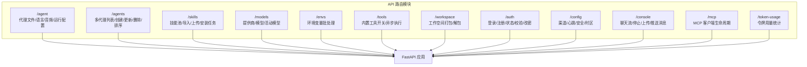
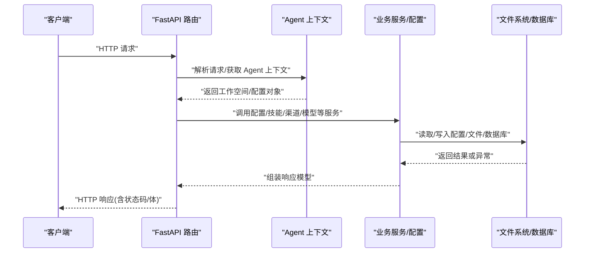
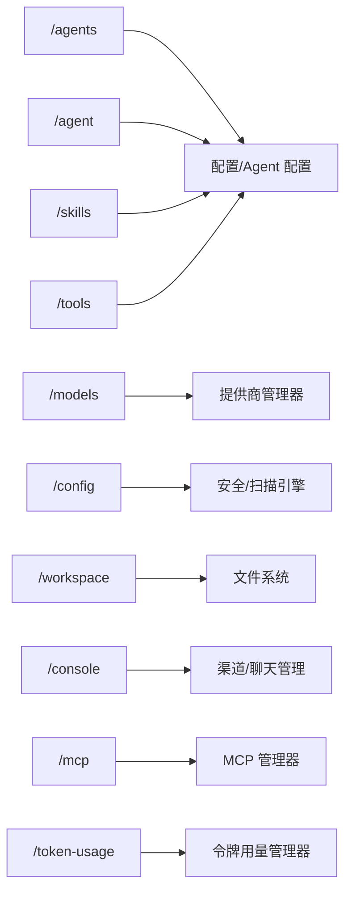

# RESTful API

<cite>
**本文引用的文件**
- [src/qwenpaw/app/routers/agent.py](file://src/qwenpaw/app/routers/agent.py)
- [src/qwenpaw/app/routers/agents.py](file://src/qwenpaw/app/routers/agents.py)
- [src/qwenpaw/app/routers/skills.py](file://src/qwenpaw/app/routers/skills.py)
- [src/qwenpaw/app/routers/providers.py](file://src/qwenpaw/app/routers/providers.py)
- [src/qwenpaw/app/routers/envs.py](file://src/qwenpaw/app/routers/envs.py)
- [src/qwenpaw/app/routers/tools.py](file://src/qwenpaw/app/routers/tools.py)
- [src/qwenpaw/app/routers/workspace.py](file://src/qwenpaw/app/routers/workspace.py)
- [src/qwenpaw/app/routers/auth.py](file://src/qwenpaw/app/routers/auth.py)
- [src/qwenpaw/app/routers/config.py](file://src/qwenpaw/app/routers/config.py)
- [src/qwenpaw/app/routers/console.py](file://src/qwenpaw/app/routers/console.py)
- [src/qwenpaw/app/routers/skills_stream.py](file://src/qwenpaw/app/routers/skills_stream.py)
- [src/qwenpaw/app/routers/mcp.py](file://src/qwenpaw/app/routers/mcp.py)
- [src/qwenpaw/app/routers/token_usage.py](file://src/qwenpaw/app/routers/token_usage.py)
</cite>

## 目录
1. [简介](#简介)
2. [项目结构](#项目结构)
3. [核心组件](#核心组件)
4. [架构总览](#架构总览)
5. [详细组件分析](#详细组件分析)
6. [依赖分析](#依赖分析)
7. [性能考虑](#性能考虑)
8. [故障排查指南](#故障排查指南)
9. [结论](#结论)
10. [附录](#附录)

## 简介
本文件为 QwenPaw 的完整 RESTful API 文档，覆盖代理管理、技能管理、渠道配置、模型与提供商、环境变量、工具、工作空间、认证与配置等模块。文档逐项列出端点的 URL 模式、请求方法、参数、响应格式与典型错误码，并提供认证机制说明、版本控制策略与向后兼容性保障，以及常见使用场景的调用流程与客户端实现要点。

## 项目结构
后端基于 FastAPI 构建，按功能域划分路由模块，统一前缀组织 API 命名空间：
- 代理相关：/agent、/agents
- 技能相关：/skills、/skills/ai/optimize/stream
- 渠道与配置：/config
- 模型与提供商：/models
- 环境变量：/envs
- 工具：/tools
- 工作空间：/workspace
- 认证：/auth
- 控制台与聊天：/console
- MCP 客户端：/mcp
- 令牌用量：/token-usage

图表来源
- [src/qwenpaw/app/routers/agent.py](file://src/qwenpaw/app/routers/agent.py)
- [src/qwenpaw/app/routers/agents.py](file://src/qwenpaw/app/routers/agents.py)
- [src/qwenpaw/app/routers/skills.py](file://src/qwenpaw/app/routers/skills.py)
- [src/qwenpaw/app/routers/providers.py](file://src/qwenpaw/app/routers/providers.py)
- [src/qwenpaw/app/routers/envs.py](file://src/qwenpaw/app/routers/envs.py)
- [src/qwenpaw/app/routers/tools.py](file://src/qwenpaw/app/routers/tools.py)
- [src/qwenpaw/app/routers/workspace.py](file://src/qwenpaw/app/routers/workspace.py)
- [src/qwenpaw/app/routers/auth.py](file://src/qwenpaw/app/routers/auth.py)
- [src/qwenpaw/app/routers/config.py](file://src/qwenpaw/app/routers/config.py)
- [src/qwenpaw/app/routers/console.py](file://src/qwenpaw/app/routers/console.py)
- [src/qwenpaw/app/routers/mcp.py](file://src/qwenpaw/app/routers/mcp.py)
- [src/qwenpaw/app/routers/token_usage.py](file://src/qwenpaw/app/routers/token_usage.py)

章节来源
- [src/qwenpaw/app/routers/agent.py](file://src/qwenpaw/app/routers/agent.py)
- [src/qwenpaw/app/routers/agents.py](file://src/qwenpaw/app/routers/agents.py)
- [src/qwenpaw/app/routers/skills.py](file://src/qwenpaw/app/routers/skills.py)
- [src/qwenpaw/app/routers/providers.py](file://src/qwenpaw/app/routers/providers.py)
- [src/qwenpaw/app/routers/envs.py](file://src/qwenpaw/app/routers/envs.py)
- [src/qwenpaw/app/routers/tools.py](file://src/qwenpaw/app/routers/tools.py)
- [src/qwenpaw/app/routers/workspace.py](file://src/qwenpaw/app/routers/workspace.py)
- [src/qwenpaw/app/routers/auth.py](file://src/qwenpaw/app/routers/auth.py)
- [src/qwenpaw/app/routers/config.py](file://src/qwenpaw/app/routers/config.py)
- [src/qwenpaw/app/routers/console.py](file://src/qwenpaw/app/routers/console.py)
- [src/qwenpaw/app/routers/mcp.py](file://src/qwenpaw/app/routers/mcp.py)
- [src/qwenpaw/app/routers/token_usage.py](file://src/qwenpaw/app/routers/token_usage.py)

## 核心组件
- 认证与授权
  - 支持启用/禁用认证、单用户注册、登录签发令牌、令牌校验、修改凭据。
  - 需要 Bearer 令牌访问受保护资源。
- 配置与热重载
  - 多数写操作会触发配置热重载，确保变更即时生效。
- 工作空间与文件系统
  - 提供工作空间打包下载与上传合并能力，支持路径合法性校验与目录合并策略。
- 安全与扫描
  - 技能扫描白名单、工具守卫规则、文件敏感路径保护等安全策略可读写。

章节来源
- [src/qwenpaw/app/routers/auth.py](file://src/qwenpaw/app/routers/auth.py)
- [src/qwenpaw/app/routers/config.py](file://src/qwenpaw/app/routers/config.py)
- [src/qwenpaw/app/routers/workspace.py](file://src/qwenpaw/app/routers/workspace.py)

## 架构总览
下图展示关键模块间交互与数据流向，体现“请求—路由—上下文—服务—持久化”的通用模式。

图表来源
- [src/qwenpaw/app/routers/agent.py](file://src/qwenpaw/app/routers/agent.py)
- [src/qwenpaw/app/routers/agents.py](file://src/qwenpaw/app/routers/agents.py)
- [src/qwenpaw/app/routers/skills.py](file://src/qwenpaw/app/routers/skills.py)
- [src/qwenpaw/app/routers/providers.py](file://src/qwenpaw/app/routers/providers.py)
- [src/qwenpaw/app/routers/config.py](file://src/qwenpaw/app/routers/config.py)
- [src/qwenpaw/app/routers/workspace.py](file://src/qwenpaw/app/routers/workspace.py)

## 详细组件分析

### 认证 API（/auth）
- 端点与方法
  - GET /auth/status → 获取认证状态（是否启用、是否存在用户）
  - POST /auth/register → 注册首个用户（仅一次）
  - POST /auth/login → 登录并获取令牌
  - GET /auth/verify → 校验 Bearer 令牌有效性
  - POST /auth/update-profile → 更新用户名/密码
- 请求参数与响应
  - 登录/注册：用户名、密码；成功返回 token 与用户名
  - 校验：Authorization: Bearer …；成功返回 valid 与用户名
  - 更新：当前密码、新用户名/新密码；成功返回新 token 与用户名
- 典型状态码
  - 200 成功；400 参数无效；401 未认证/令牌无效；403 认证未启用/已注册；409 冲突（注册失败）

章节来源
- [src/qwenpaw/app/routers/auth.py](file://src/qwenpaw/app/routers/auth.py)

### 环境变量 API（/envs）
- 端点与方法
  - GET /envs → 列出全部环境变量
  - PUT /envs → 批量保存（全量替换，不存在键将被移除）
  - DELETE /envs/{key} → 删除指定键
- 请求参数与响应
  - PUT 请求体为键值对映射；返回当前全部变量
  - DELETE 返回删除后的剩余变量列表
- 典型状态码
  - 200 成功；400 键为空；404 不存在该键

章节来源
- [src/qwenpaw/app/routers/envs.py](file://src/qwenpaw/app/routers/envs.py)

### 工具 API（/tools）
- 端点与方法
  - GET /tools → 列出内置工具及其启用状态、描述、异步执行标志
  - PATCH /tools/{tool_name}/toggle → 切换工具启用状态
  - PATCH /tools/{tool_name}/async-execution → 设置异步执行
- 请求参数与响应
  - PATCH toggle：请求体嵌入布尔值 enabled
  - PATCH async-execution：请求体嵌入布尔值 async_execution
  - 均返回 ToolInfo 结构
- 典型状态码
  - 200 成功；404 未找到工具

章节来源
- [src/qwenpaw/app/routers/tools.py](file://src/qwenpaw/app/routers/tools.py)

### 工作空间 API（/workspace）
- 端点与方法
  - GET /workspace/download → 流式下载工作空间为 zip
  - POST /workspace/upload → 上传 zip 并合并到工作空间
- 请求参数与响应
  - 下载：无请求体，返回 application/zip 流
  - 上传：multipart/form-data，file 字段为 zip；返回 success
- 安全与限制
  - 上传进行 zip 合法性检查与路径穿越防护
  - 合并策略：文件覆盖、目录递归合并
- 典型状态码
  - 200 成功；400 非法 zip/路径不安全/文件过大；404 工作空间不存在；500 合并失败

章节来源
- [src/qwenpaw/app/routers/workspace.py](file://src/qwenpaw/app/routers/workspace.py)

### 代理文件与运行配置（/agent）
- 端点与方法
  - GET /agent/files → 列表工作区 Markdown 文件
  - GET /agent/files/{md_name} → 读取工作区 Markdown 文件
  - PUT /agent/files/{md_name} → 写入工作区 Markdown 文件
  - GET /agent/memory → 列表记忆区 Markdown 文件
  - GET /agent/memory/{md_name} → 读取记忆区 Markdown 文件
  - PUT /agent/memory/{md_name} → 写入记忆区 Markdown 文件
  - GET /agent/language → 获取代理语言设置
  - PUT /agent/language → 更新代理语言并可复制对应 MD 文件
  - GET /agent/audio-mode → 获取音频处理模式
  - PUT /agent/audio-mode → 设置音频处理模式
  - GET /agent/transcription-provider-type → 获取转录提供商类型
  - PUT /agent/transcription-provider-type → 设置转录提供商类型
  - GET /agent/local-whisper-status → 本地 Whisper 可用性检查
  - GET /agent/transcription-providers → 列出可转录提供商与当前选择
  - PUT /agent/transcription-provider → 设置转录提供商
  - GET /agent/running-config → 获取运行配置
  - PUT /agent/running-config → 更新运行配置并触发热重载
  - GET /agent/system-prompt-files → 获取系统提示文件列表
  - PUT /agent/system-prompt-files → 更新系统提示文件列表并触发热重载
- 请求参数与响应
  - 文件读写：请求体为包含 content 的对象；响应为写入成功或文件元数据列表
  - 语言/音频/转录：请求体为包含相应键的对象；响应为当前设置
  - 运行配置/系统提示：请求体为配置对象；响应为更新后的配置
- 典型状态码
  - 200 成功；400 无效参数；404 文件不存在；500 内部错误

章节来源
- [src/qwenpaw/app/routers/agent.py](file://src/qwenpaw/app/routers/agent.py)

### 多代理管理（/agents）
- 端点与方法
  - GET /agents → 列出所有代理（含排序、描述、工作区）
  - PUT /agents/order → 持久化代理顺序
  - GET /agents/{agentId} → 获取代理详情
  - POST /agents → 创建新代理（自动生成短 ID）
  - PUT /agents/{agentId} → 更新代理配置并触发热重载
  - DELETE /agents/{agentId} → 删除代理（不可删除默认代理）
  - PATCH /agents/{agentId}/toggle → 启用/禁用代理（不可禁用默认代理）
  - GET /agents/{agentId}/files → 列表代理工作区 Markdown 文件
  - GET /agents/{agentId}/files/{filename} → 读取代理工作区文件
  - PUT /agents/{agentId}/files/{filename} → 写入代理工作区文件
  - GET /agents/{agentId}/memory → 列表代理记忆区文件
- 请求参数与响应
  - 创建：请求体包含 name/description/workspace_dir/language/skill_names；返回代理引用
  - 更新：请求体为代理配置对象；返回更新后的配置
  - 文件读写：请求体为包含 content 的对象；返回写入结果
- 典型状态码
  - 200 成功；201 创建成功；400 重复/非法；404 未找到；500 内部错误

章节来源
- [src/qwenpaw/app/routers/agents.py](file://src/qwenpaw/app/routers/agents.py)

### 技能管理（/skills）
- 端点与方法
  - GET /skills → 列出工作区技能（含 enabled/tags/config 等）
  - POST /skills/refresh → 强制对齐清单并返回最新技能列表
  - GET /skills/workspaces → 列出各工作区的技能概览
  - GET /skills/hub/search?q=&limit= → 搜索技能库
  - POST /skills/hub/install/start → 开始从技能库安装任务（返回任务信息）
  - GET /skills/hub/install/status/{task_id} → 查询安装任务状态
  - POST /skills/hub/install/cancel/{task_id} → 取消安装任务
  - GET /skills/pool → 列出技能池技能
  - POST /skills/pool/refresh → 刷新技能池清单
  - GET /skills/pool/builtin-sources → 列出内置源
  - POST /skills → 在工作区创建技能（可选启用）
  - POST /skills/upload → 上传 zip 导入技能（可重命名映射）
  - POST /skills/pool/create → 在技能池创建技能
  - PUT /skills/pool/save → 保存/重命名技能池技能
- 请求参数与响应
  - 安装任务：bundle_url/version/enable/target_name/overwrite；返回 HubInstallTask
  - 技能创建/上传：请求体包含 name/content/references/scripts/config/enable 等；返回创建结果
  - 技能池保存：source_name/name/content/config；返回保存结果
- 安全与扫描
  - 导入/创建技能若触发安全扫描失败，返回 422 并包含扫描结果摘要
- 典型状态码
  - 200 成功；201 创建成功；400 参数无效；404 未找到；409 冲突（重名/冲突）；422 安全扫描失败

章节来源
- [src/qwenpaw/app/routers/skills.py](file://src/qwenpaw/app/routers/skills.py)

### 模型与提供商 API（/models）
- 端点与方法
  - GET /models → 列出所有提供商
  - PUT /models/{provider_id}/config → 配置提供商（api_key/base_url/chat_model/generate_kwargs）
  - POST /models/custom-providers → 创建自定义提供商
  - POST /models/{provider_id}/test → 测试提供商连接
  - POST /models/{provider_id}/discover → 发现提供商可用模型
  - POST /models/{provider_id}/models → 添加模型到提供商
  - DELETE /models/custom-providers/{provider_id} → 删除自定义提供商
  - POST /models/{provider_id}/models/{model_id:path}/probe-multimodal → 探测多模态能力
  - DELETE /models/{provider_id}/models/{model_id:path} → 从提供商移除模型
  - PUT /models/{provider_id}/models/{model_id:path}/config → 配置模型生成参数
  - GET /models/active → 获取有效活动模型（支持作用域：effective/global/agent）
  - PUT /models/active → 设置活动模型（支持全局/代理作用域）
- 请求参数与响应
  - 活动模型：请求体包含 provider_id/model/作用域/agent_id；返回 ActiveModelsInfo
  - 多模态探测：返回 supports_* 与消息
- 典型状态码
  - 200 成功；400 参数无效/连接失败；404 未找到提供商/模型；500 保存失败

章节来源
- [src/qwenpaw/app/routers/providers.py](file://src/qwenpaw/app/routers/providers.py)

### 配置 API（/config）
- 端点与方法
  - GET /config/channels → 列出所有可用渠道配置
  - GET /config/channels/types → 列出渠道类型标识
  - PUT /config/channels → 批量更新渠道配置
  - GET /config/channels/{channel} → 获取特定渠道配置
  - PUT /config/channels/{channel} → 更新特定渠道配置
  - GET /config/channels/{channel}/qrcode → 获取渠道授权二维码
  - GET /config/channels/{channel}/qrcode/status → 轮询二维码授权状态
  - GET /config/heartbeat → 获取心跳配置
  - PUT /config/heartbeat → 更新心跳配置并后台重调度
  - GET /config/agents/llm-routing → 获取代理 LLM 路由设置
  - PUT /config/agents/llm-routing → 更新代理 LLM 路由设置
  - GET /config/user-timezone → 获取用户时区
  - PUT /config/user-timezone → 设置用户时区
  - GET /config/security/tool-guard → 获取工具守卫设置
  - PUT /config/security/tool-guard → 更新工具守卫设置并重载规则
  - GET /config/security/tool-guard/builtin-rules → 获取内置规则
  - GET /config/security/file-guard → 获取文件守卫设置
  - PUT /config/security/file-guard → 更新文件守卫设置并重载规则
  - GET /config/security/skill-scanner → 获取技能扫描器设置
  - PUT /config/security/skill-scanner → 更新技能扫描器设置
  - GET /config/security/skill-scanner/blocked-history → 获取拦截历史
  - DELETE /config/security/skill-scanner/blocked-history → 清空拦截历史
  - DELETE /config/security/skill-scanner/blocked-history/{index} → 删除单条拦截记录
  - POST /config/security/skill-scanner/whitelist → 加入白名单
  - DELETE /config/security/skill-scanner/whitelist/{skill_name} → 移除白名单
- 请求参数与响应
  - 渠道 QR 码：返回二维码图片与轮询令牌；轮询返回状态与凭证
  - 心跳：请求体为 enabled/every/target/active_hours；返回更新后的配置
  - 安全设置：请求体为对应配置对象；返回更新后的配置
- 典型状态码
  - 200 成功；400 参数无效；404 未找到；500 保存失败

章节来源
- [src/qwenpaw/app/routers/config.py](file://src/qwenpaw/app/routers/config.py)

### 控制台与聊天 API（/console）
- 端点与方法
  - POST /console/chat → SSE 流式聊天（支持断线重连 reconnect=true）
  - POST /console/chat/stop → 停止指定聊天
  - POST /console/upload → 上传媒体文件用于聊天
  - GET /console/push-messages → 获取待推送消息（可按会话过滤）
- 请求参数与响应
  - 聊天：请求体为 AgentRequest 或等价字典；SSE 流返回事件数据
  - 停止：请求体包含 chat_id；返回 stopped
  - 上传：multipart/form-data，file 字段；返回存储路径、原始文件名与大小
  - 推送消息：可选 session_id；返回消息数组
- 典型状态码
  - 200 成功；400 参数无效/文件过大；503 控制台通道不可用；502 MCP 服务器查询失败

章节来源
- [src/qwenpaw/app/routers/console.py](file://src/qwenpaw/app/routers/console.py)

### MCP 客户端 API（/mcp）
- 端点与方法
  - GET /mcp → 列出所有 MCP 客户端（带安全掩码的 env/headers）
  - GET /mcp/{client_key} → 获取指定客户端详情
  - POST /mcp → 创建客户端（返回新建客户端信息）
  - PUT /mcp/{client_key} → 更新客户端（支持部分字段）
  - PATCH /mcp/{client_key}/toggle → 切换启用状态
  - DELETE /mcp/{client_key} → 删除客户端
  - GET /mcp/{client_key}/tools → 列出连接的 MCP 服务器工具
- 请求参数与响应
  - 客户端创建/更新：包含 name/description/enabled/transport/url/headers/command/args/env/cwd 等；返回 MCPClientInfo
  - 工具列表：返回工具名称、描述与输入模式
- 安全与掩码
  - 返回的 env/headers 值进行安全掩码处理
- 典型状态码
  - 200 成功；201 创建成功；400 已存在/参数无效；404 未找到；502/MCP 查询失败；503 MCP 尚未就绪

章节来源
- [src/qwenpaw/app/routers/mcp.py](file://src/qwenpaw/app/routers/mcp.py)

### 令牌用量 API（/token-usage）
- 端点与方法
  - GET /token-usage → 获取令牌用量汇总（按日期/模型/提供商聚合）
- 查询参数
  - start_date、end_date（YYYY-MM-DD，默认近 30 天）
  - model、provider（可选过滤）
- 响应
  - TokenUsageSummary 对象（具体结构以实现为准）
- 典型状态码
  - 200 成功；400 参数无效

章节来源
- [src/qwenpaw/app/routers/token_usage.py](file://src/qwenpaw/app/routers/token_usage.py)

### 技能 AI 优化流（/skills/ai/optimize/stream）
- 端点与方法
  - POST /skills/ai/optimize/stream → 流式优化现有技能内容
- 请求参数
  - content：当前技能内容
  - language：优化语言（en/zh/ru）
- 响应
  - SSE 流，分片返回增量文本，最后发送完成标记
- 典型状态码
  - 200 成功；400 无可用模型配置；500 优化失败

章节来源
- [src/qwenpaw/app/routers/skills_stream.py](file://src/qwenpaw/app/routers/skills_stream.py)

## 依赖分析
- 组件耦合
  - 路由层通过上下文获取 Agent 与工作空间，再调用配置/技能/渠道/模型等服务
  - 多数写操作依赖配置持久化与热重载调度
- 外部依赖
  - 提供商管理器负责模型发现、连接测试、多模态探测
  - 技能扫描器与工具守卫引擎在写入/创建技能时参与安全校验
- 循环依赖
  - 路由模块之间无直接循环导入，通过共享服务与配置模块解耦

图表来源
- [src/qwenpaw/app/routers/agents.py](file://src/qwenpaw/app/routers/agents.py)
- [src/qwenpaw/app/routers/agent.py](file://src/qwenpaw/app/routers/agent.py)
- [src/qwenpaw/app/routers/skills.py](file://src/qwenpaw/app/routers/skills.py)
- [src/qwenpaw/app/routers/providers.py](file://src/qwenpaw/app/routers/providers.py)
- [src/qwenpaw/app/routers/config.py](file://src/qwenpaw/app/routers/config.py)
- [src/qwenpaw/app/routers/tools.py](file://src/qwenpaw/app/routers/tools.py)
- [src/qwenpaw/app/routers/workspace.py](file://src/qwenpaw/app/routers/workspace.py)
- [src/qwenpaw/app/routers/console.py](file://src/qwenpaw/app/routers/console.py)
- [src/qwenpaw/app/routers/mcp.py](file://src/qwenpaw/app/routers/mcp.py)
- [src/qwenpaw/app/routers/token_usage.py](file://src/qwenpaw/app/routers/token_usage.py)

## 性能考虑
- 流式响应
  - 控制台聊天与技能优化采用 SSE 流式输出，降低内存占用并提升交互体验
- 异步与后台任务
  - 热重载、心跳重调度、MCP 工具查询等均在后台异步执行，避免阻塞主请求
- 文件操作
  - 工作空间打包/解包在子线程执行，避免阻塞事件循环
- 缓存与探测
  - 提供商连接测试与模型探测尽量复用临时实例，避免破坏配置

## 故障排查指南
- 认证相关
  - 401 未认证/令牌无效：确认 Authorization 头与令牌有效期
  - 403 认证未启用/已注册：检查服务端认证开关与用户状态
- 技能与安全
  - 422 安全扫描失败：查看扫描器返回的严重级别与发现项，必要时加入白名单
  - 409 冲突：重名/命名冲突，参考建议的新名称
- 渠道与 MCP
  - 503 MCP 尚未就绪：等待连接建立或稍后重试
  - 502 MCP 服务器查询失败：检查远端 MCP 服务可用性
- 工作空间
  - 400 非法 zip/路径不安全：确保上传的是合法 zip，且不含路径穿越
- 模型与提供商
  - 404 未找到提供商/模型：确认提供商 ID 与模型 ID 存在
  - 400 连接失败：检查 api_key/base_url/chat_model 配置

章节来源
- [src/qwenpaw/app/routers/skills.py](file://src/qwenpaw/app/routers/skills.py)
- [src/qwenpaw/app/routers/console.py](file://src/qwenpaw/app/routers/console.py)
- [src/qwenpaw/app/routers/mcp.py](file://src/qwenpaw/app/routers/mcp.py)
- [src/qwenpaw/app/routers/workspace.py](file://src/qwenpaw/app/routers/workspace.py)
- [src/qwenpaw/app/routers/providers.py](file://src/qwenpaw/app/routers/providers.py)

## 结论
本 API 文档系统性覆盖了 QwenPaw 的核心功能域，提供了端点清单、参数说明、响应格式与错误码指引，并强调了认证、安全与热重载等关键机制。建议客户端在调用受保护端点时始终携带 Bearer 令牌，并在批量写入后关注热重载带来的配置生效时间。对于技能与安全相关操作，建议结合扫描器与白名单策略，确保合规与稳定。

## 附录

### 认证机制说明
- 令牌类型：Bearer
- 适用范围：除 /auth/status 与 /auth/register（首次）外，其余受保护端点均需令牌
- 校验方式：/auth/verify 校验令牌有效性与用户名
- 修改凭据：/auth/update-profile 需提供当前密码

章节来源
- [src/qwenpaw/app/routers/auth.py](file://src/qwenpaw/app/routers/auth.py)

### API 版本控制与向后兼容
- 当前路由未显式附加版本号前缀（如 /v1），建议客户端固定目标版本并关注后续变更
- 写操作多数具备向后兼容行为（如全量替换环境变量），但新增字段需注意兼容性

章节来源
- [src/qwenpaw/app/routers/envs.py](file://src/qwenpaw/app/routers/envs.py)
- [src/qwenpaw/app/routers/config.py](file://src/qwenpaw/app/routers/config.py)

### 常见使用场景与调用流程

#### 场景一：创建并配置新代理
- 步骤
  - POST /agents → 创建代理并返回代理引用
  - PUT /agents/{agentId} → 更新代理配置（模型/渠道/工具等）
  - PUT /agents/{agentId}/files/{filename} → 写入初始工作区文件
  - PUT /agents/{agentId}/toggle → 启用代理
- 关键点
  - 更新后触发热重载，等待生效

章节来源
- [src/qwenpaw/app/routers/agents.py](file://src/qwenpaw/app/routers/agents.py)
- [src/qwenpaw/app/routers/workspace.py](file://src/qwenpaw/app/routers/workspace.py)

#### 场景二：从技能库安装技能并优化
- 步骤
  - POST /skills/hub/install/start → 启动安装任务
  - GET /skills/hub/install/status/{task_id} → 轮询任务状态
  - POST /skills/ai/optimize/stream → 流式优化技能内容
  - PUT /skills/pool/save → 保存优化后的技能
- 关键点
  - 安装任务失败时检查扫描器返回的严重级别与规则

章节来源
- [src/qwenpaw/app/routers/skills.py](file://src/qwenpaw/app/routers/skills.py)
- [src/qwenpaw/app/routers/skills_stream.py](file://src/qwenpaw/app/routers/skills_stream.py)

#### 场景三：配置提供商与活动模型
- 步骤
  - POST /models/custom-providers → 创建自定义提供商
  - POST /models/{provider_id}/discover → 发现可用模型
  - PUT /models/active → 设置活动模型（全局或代理级）
- 关键点
  - 设置代理级活动模型需提供 agent_id

章节来源
- [src/qwenpaw/app/routers/providers.py](file://src/qwenpaw/app/routers/providers.py)

#### 场景四：工作空间备份与恢复
- 步骤
  - GET /workspace/download → 下载 zip
  - POST /workspace/upload → 上传 zip 并合并
- 关键点
  - 上传会进行 zip 合法性与路径穿越检查

章节来源
- [src/qwenpaw/app/routers/workspace.py](file://src/qwenpaw/app/routers/workspace.py)