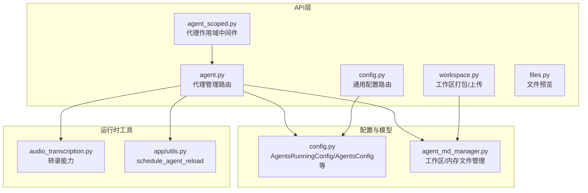
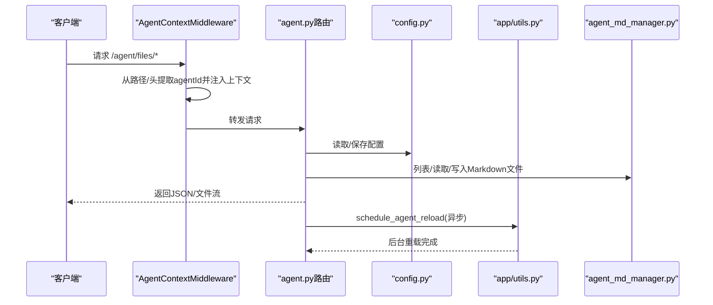
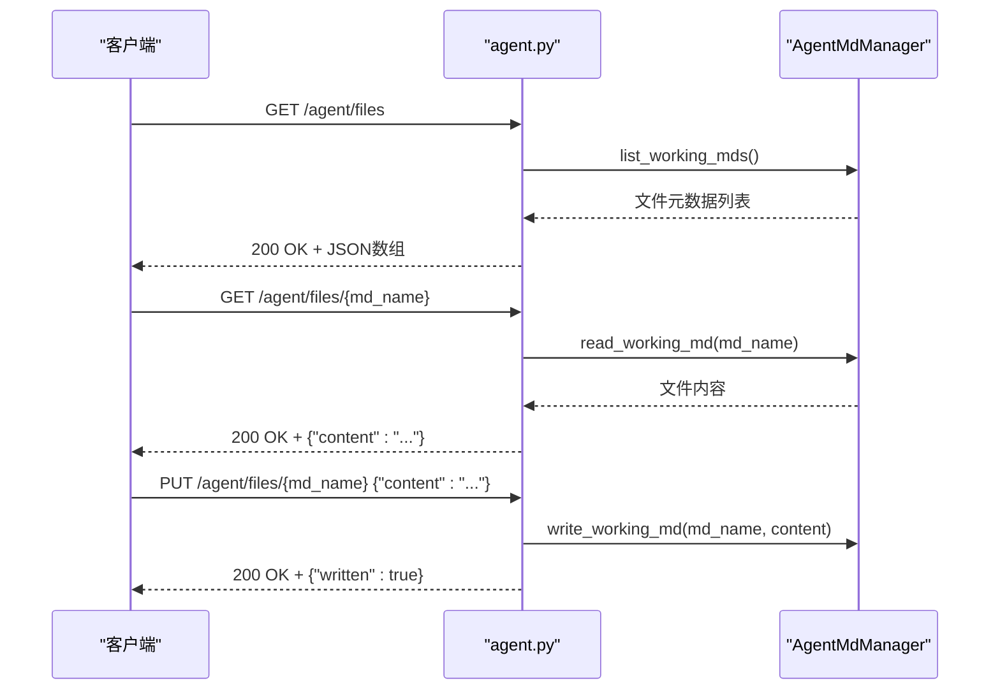
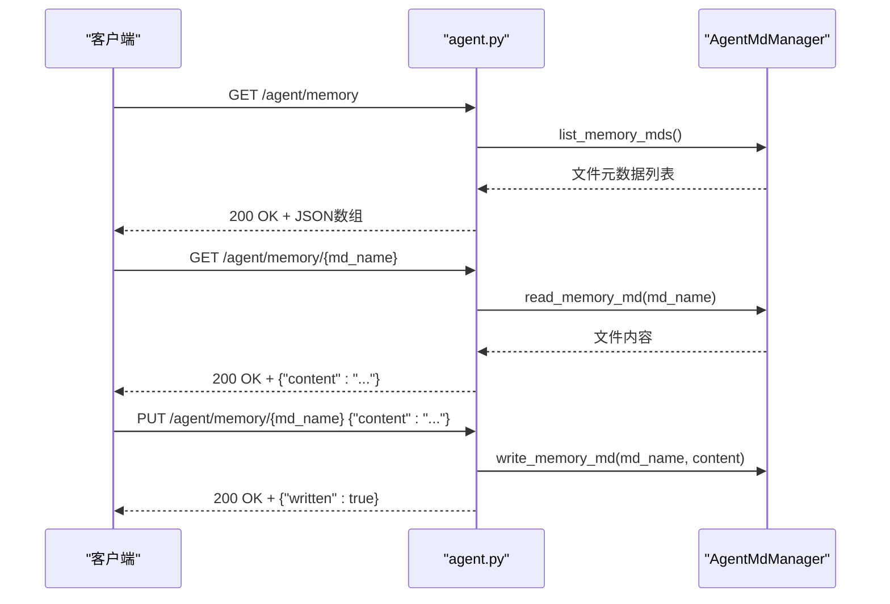
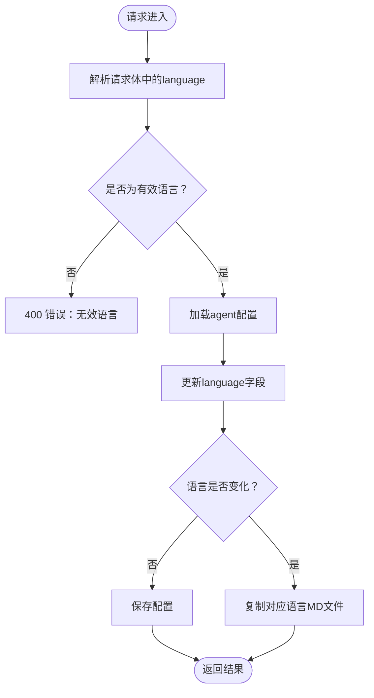
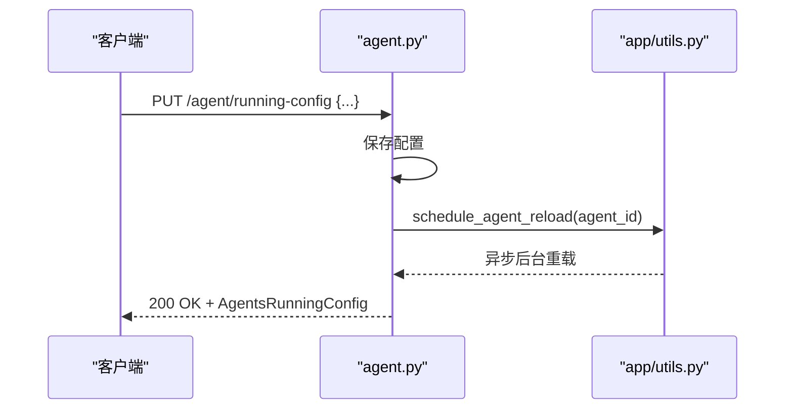
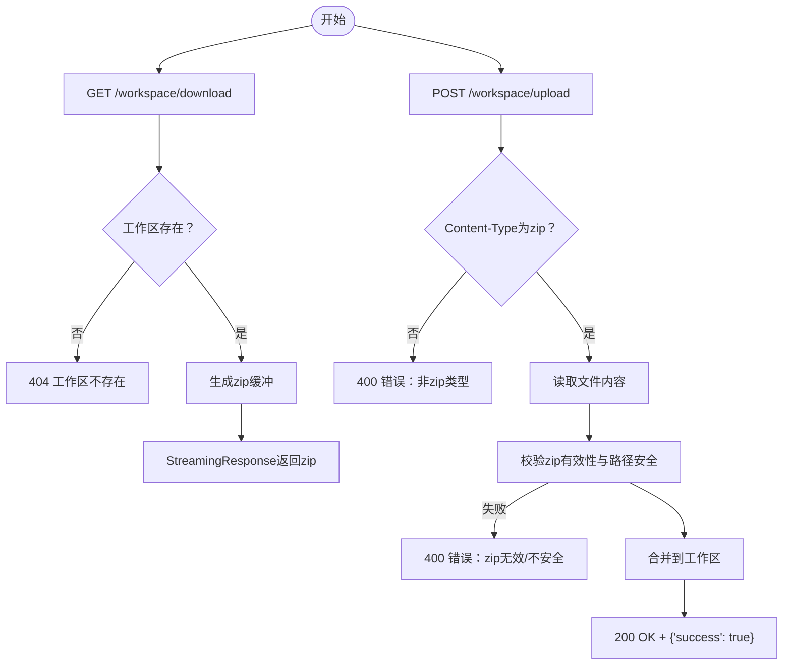
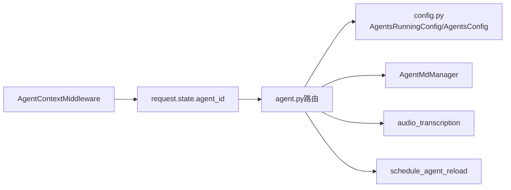

# 代理管理API

<cite>
**本文引用的文件**
- [src/qwenpaw/app/routers/agent.py](file://src/qwenpaw/app/routers/agent.py)
- [src/qwenpaw/app/routers/agent_scoped.py](file://src/qwenpaw/app/routers/agent_scoped.py)
- [src/qwenpaw/app/routers/config.py](file://src/qwenpaw/app/routers/config.py)
- [src/qwenpaw/app/routers/workspace.py](file://src/qwenpaw/app/routers/workspace.py)
- [src/qwenpaw/app/routers/files.py](file://src/qwenpaw/app/routers/files.py)
- [src/qwenpaw/config/config.py](file://src/qwenpaw/config/config.py)
- [src/qwenpaw/agents/memory/agent_md_manager.py](file://src/qwenpaw/agents/memory/agent_md_manager.py)
- [src/qwenpaw/agents/utils/audio_transcription.py](file://src/qwenpaw/agents/utils/audio_transcription.py)
- [src/qwenpaw/app/utils.py](file://src/qwenpaw/app/utils.py)
- [src/qwenpaw/agents/md_files/en/AGENTS.md](file://src/qwenpaw/agents/md_files/en/AGENTS.md)
- [src/qwenpaw/agents/md_files/zh/AGENTS.md](file://src/qwenpaw/agents/md_files/zh/AGENTS.md)
</cite>

## 目录
1. [简介](#简介)
2. [项目结构](#项目结构)
3. [核心组件](#核心组件)
4. [架构总览](#架构总览)
5. [详细组件分析](#详细组件分析)
6. [依赖分析](#依赖分析)
7. [性能考量](#性能考量)
8. [故障排查指南](#故障排查指南)
9. [结论](#结论)
10. [附录](#附录)

## 简介
本文件为 QwenPaw 代理管理API的详细RESTful接口文档，覆盖以下核心领域：
- 代理文件管理：工作区与内存目录的Markdown文件列表、读取、写入
- 代理内存管理：内存目录的Markdown文件管理
- 代理语言设置：获取与更新代理MD文件的语言（zh/en/ru）
- 音频模式配置：incoming voice消息的处理模式（auto/native）
- 语音转录配置：转录提供方类型、可用提供方、当前配置提供方、本地Whisper可用性检查
- 运行时配置：代理运行参数（AgentsRunningConfig）的获取与更新
- 系统提示文件管理：代理系统提示中启用的Markdown文件列表的获取与更新
- 工作区打包下载与上传：将代理工作区打包为zip下载，或将zip合并到工作区

本API采用FastAPI实现，支持热重载（非阻塞后台任务）以应用配置变更，并对异常进行统一HTTP状态码返回。

## 项目结构
下图展示与代理管理API相关的关键模块及其交互关系：

图表来源
- [src/qwenpaw/app/routers/agent.py:1-505](file://src/qwenpaw/app/routers/agent.py#L1-L505)
- [src/qwenpaw/app/routers/agent_scoped.py:1-92](file://src/qwenpaw/app/routers/agent_scoped.py#L1-L92)
- [src/qwenpaw/app/routers/config.py:1-644](file://src/qwenpaw/app/routers/config.py#L1-L644)
- [src/qwenpaw/app/routers/workspace.py:1-203](file://src/qwenpaw/app/routers/workspace.py#L1-L203)
- [src/qwenpaw/app/routers/files.py:1-25](file://src/qwenpaw/app/routers/files.py#L1-L25)
- [src/qwenpaw/config/config.py:453-788](file://src/qwenpaw/config/config.py#L453-L788)
- [src/qwenpaw/agents/memory/agent_md_manager.py:1-126](file://src/qwenpaw/agents/memory/agent_md_manager.py#L1-L126)
- [src/qwenpaw/agents/utils/audio_transcription.py:1-318](file://src/qwenpaw/agents/utils/audio_transcription.py#L1-L318)
- [src/qwenpaw/app/utils.py:1-59](file://src/qwenpaw/app/utils.py#L1-L59)

章节来源
- [src/qwenpaw/app/routers/agent.py:1-505](file://src/qwenpaw/app/routers/agent.py#L1-L505)
- [src/qwenpaw/app/routers/agent_scoped.py:1-92](file://src/qwenpaw/app/routers/agent_scoped.py#L1-L92)
- [src/qwenpaw/app/routers/config.py:1-644](file://src/qwenpaw/app/routers/config.py#L1-L644)
- [src/qwenpaw/app/routers/workspace.py:1-203](file://src/qwenpaw/app/routers/workspace.py#L1-L203)
- [src/qwenpaw/app/routers/files.py:1-25](file://src/qwenpaw/app/routers/files.py#L1-L25)
- [src/qwenpaw/config/config.py:453-788](file://src/qwenpaw/config/config.py#L453-L788)
- [src/qwenpaw/agents/memory/agent_md_manager.py:1-126](file://src/qwenpaw/agents/memory/agent_md_manager.py#L1-L126)
- [src/qwenpaw/agents/utils/audio_transcription.py:1-318](file://src/qwenpaw/agents/utils/audio_transcription.py#L1-L318)
- [src/qwenpaw/app/utils.py:1-59](file://src/qwenpaw/app/utils.py#L1-L59)

## 核心组件
- 代理文件管理路由（/agent/files/*）
  - GET /agent/files：列出工作区Markdown文件元数据
  - GET /agent/files/{md_name}：读取指定工作区Markdown文件内容
  - PUT /agent/files/{md_name}：写入/更新工作区Markdown文件内容
- 代理内存管理路由（/agent/memory/*）
  - GET /agent/memory：列出内存目录Markdown文件元数据
  - GET /agent/memory/{md_name}：读取指定内存Markdown文件内容
  - PUT /agent/memory/{md_name}：写入/更新内存Markdown文件内容
- 代理语言设置（/agent/language）
  - GET /agent/language：获取当前代理语言
  - PUT /agent/language：更新代理语言（支持zh/en/ru），必要时复制对应语言的MD文件
- 音频模式配置（/agent/audio-mode）
  - GET /agent/audio-mode：获取音频处理模式（auto/native）
  - PUT /agent/audio-mode：设置音频处理模式（auto/native）
- 语音转录配置（/agent/transcription-*）
  - GET /agent/transcription-provider-type：获取转录提供方类型（disabled/whisper_api/local_whisper）
  - PUT /agent/transcription-provider-type：设置转录提供方类型
  - GET /agent/local-whisper-status：检查本地Whisper可用性（ffmpeg与openai-whisper）
  - GET /agent/transcription-providers：列出可用的转录提供方及当前配置
  - PUT /agent/transcription-provider：设置转录提供方（空字符串表示取消）
- 运行时配置（/agent/running-config）
  - GET /agent/running-config：获取当前代理运行时配置（AgentsRunningConfig）
  - PUT /agent/running-config：更新运行时配置并触发非阻塞热重载
- 系统提示文件管理（/agent/system-prompt-files）
  - GET /agent/system-prompt-files：获取当前启用的系统提示Markdown文件列表
  - PUT /agent/system-prompt-files：更新系统提示文件列表并触发热重载
- 工作区文件操作（/workspace/*）
  - GET /workspace/download：将代理工作区打包为zip并下载
  - POST /workspace/upload：上传zip并合并到工作区（覆盖/合并策略）

章节来源
- [src/qwenpaw/app/routers/agent.py:38-505](file://src/qwenpaw/app/routers/agent.py#L38-L505)
- [src/qwenpaw/app/routers/workspace.py:112-203](file://src/qwenpaw/app/routers/workspace.py#L112-L203)
- [src/qwenpaw/config/config.py:453-788](file://src/qwenpaw/config/config.py#L453-L788)
- [src/qwenpaw/agents/memory/agent_md_manager.py:21-126](file://src/qwenpaw/agents/memory/agent_md_manager.py#L21-L126)
- [src/qwenpaw/agents/utils/audio_transcription.py:87-147](file://src/qwenpaw/agents/utils/audio_transcription.py#L87-L147)

## 架构总览
代理管理API通过“代理作用域中间件”注入agentId上下文，使下游路由能够基于当前激活的代理执行操作。配置变更通过非阻塞后台任务触发热重载，确保API响应快速返回。

图表来源
- [src/qwenpaw/app/routers/agent_scoped.py:15-51](file://src/qwenpaw/app/routers/agent_scoped.py#L15-L51)
- [src/qwenpaw/app/routers/agent.py:38-106](file://src/qwenpaw/app/routers/agent.py#L38-L106)
- [src/qwenpaw/app/utils.py:15-59](file://src/qwenpaw/app/utils.py#L15-L59)
- [src/qwenpaw/agents/memory/agent_md_manager.py:21-126](file://src/qwenpaw/agents/memory/agent_md_manager.py#L21-L126)

## 详细组件分析

### 代理文件管理（/agent/files/*）
- 端点设计
  - GET /agent/files：返回工作区Markdown文件列表（含文件名、大小、路径、创建/修改时间）
  - GET /agent/files/{md_name}：返回指定工作区文件内容
  - PUT /agent/files/{md_name}：写入/更新工作区文件内容，自动补全.md扩展名
- 数据模型
  - 文件元数据：filename、size、path、created_time、modified_time
  - 文件内容：content
- 错误处理
  - 未找到文件：404
  - 其他异常：500
- 示例
  - 获取文件列表：GET /agent/files
  - 读取文件：GET /agent/files/AGENTS.md
  - 写入文件：PUT /agent/files/PROFILE.md（请求体：{"content":"..."})

图表来源
- [src/qwenpaw/app/routers/agent.py:38-106](file://src/qwenpaw/app/routers/agent.py#L38-L106)
- [src/qwenpaw/agents/memory/agent_md_manager.py:21-73](file://src/qwenpaw/agents/memory/agent_md_manager.py#L21-L73)

章节来源
- [src/qwenpaw/app/routers/agent.py:38-106](file://src/qwenpaw/app/routers/agent.py#L38-L106)
- [src/qwenpaw/agents/memory/agent_md_manager.py:21-73](file://src/qwenpaw/agents/memory/agent_md_manager.py#L21-L73)

### 代理内存管理（/agent/memory/*）
- 端点设计
  - GET /agent/memory：返回内存目录Markdown文件列表
  - GET /agent/memory/{md_name}：返回指定内存文件内容
  - PUT /agent/memory/{md_name}：写入/更新内存文件内容
- 数据模型
  - 文件元数据同上
  - 文件内容同上
- 错误处理
  - 未找到文件：404
  - 其他异常：500

图表来源
- [src/qwenpaw/app/routers/agent.py:109-177](file://src/qwenpaw/app/routers/agent.py#L109-L177)
- [src/qwenpaw/agents/memory/agent_md_manager.py:74-126](file://src/qwenpaw/agents/memory/agent_md_manager.py#L74-L126)

章节来源
- [src/qwenpaw/app/routers/agent.py:109-177](file://src/qwenpaw/app/routers/agent.py#L109-L177)
- [src/qwenpaw/agents/memory/agent_md_manager.py:74-126](file://src/qwenpaw/agents/memory/agent_md_manager.py#L74-L126)

### 代理语言设置（/agent/language）
- 端点设计
  - GET /agent/language：返回当前语言与agent_id
  - PUT /agent/language：更新语言（仅允许zh/en/ru），若语言变化则复制对应语言的MD文件到工作区
- 参数校验
  - 无效语言：400（返回允许值列表）
- 返回
  - 成功：{"language": "...", "copied_files": [...], "agent_id": "..."}

图表来源
- [src/qwenpaw/app/routers/agent.py:180-259](file://src/qwenpaw/app/routers/agent.py#L180-L259)

章节来源
- [src/qwenpaw/app/routers/agent.py:180-259](file://src/qwenpaw/app/routers/agent.py#L180-L259)

### 音频模式配置（/agent/audio-mode）
- 端点设计
  - GET /agent/audio-mode：返回当前音频模式（auto/native）
  - PUT /agent/audio-mode：设置音频模式（auto/native）
- 参数校验
  - 无效模式：400（返回允许值列表）
- 返回
  - 成功：{"audio_mode": "auto"|"native"}

章节来源
- [src/qwenpaw/app/routers/agent.py:262-306](file://src/qwenpaw/app/routers/agent.py#L262-L306)

### 语音转录配置（/agent/transcription-*）
- 端点设计
  - GET /agent/transcription-provider-type：返回转录提供方类型（disabled/whisper_api/local_whisper）
  - PUT /agent/transcription-provider-type：设置转录提供方类型
  - GET /agent/local-whisper-status：返回本地Whisper可用性（ffmpeg与openai-whisper）
  - GET /agent/transcription-providers：返回可用提供方列表与当前配置ID
  - PUT /agent/transcription-provider：设置转录提供方ID（空字符串表示取消）
- 参数校验
  - 无效提供方类型：400（返回允许值列表）
- 返回
  - 本地可用性：{"available": true|false, "ffmpeg_installed": true|false, "whisper_installed": true|false}
  - 可用提供方：{"providers": [...], "configured_provider_id": "..."}
  - 设置成功：{"provider_id": "..."}

章节来源
- [src/qwenpaw/app/routers/agent.py:309-424](file://src/qwenpaw/app/routers/agent.py#L309-L424)
- [src/qwenpaw/agents/utils/audio_transcription.py:87-147](file://src/qwenpaw/agents/utils/audio_transcription.py#L87-L147)

### 运行时配置（/agent/running-config）
- 端点设计
  - GET /agent/running-config：返回AgentsRunningConfig
  - PUT /agent/running-config：更新AgentsRunningConfig并触发非阻塞热重载
- 返回
  - 成功：返回更新后的AgentsRunningConfig

图表来源
- [src/qwenpaw/app/routers/agent.py:427-464](file://src/qwenpaw/app/routers/agent.py#L427-L464)
- [src/qwenpaw/app/utils.py:15-59](file://src/qwenpaw/app/utils.py#L15-L59)

章节来源
- [src/qwenpaw/app/routers/agent.py:427-464](file://src/qwenpaw/app/routers/agent.py#L427-L464)
- [src/qwenpaw/app/utils.py:15-59](file://src/qwenpaw/app/utils.py#L15-L59)

### 系统提示文件管理（/agent/system-prompt-files）
- 端点设计
  - GET /agent/system-prompt-files：返回当前启用的系统提示Markdown文件列表
  - PUT /agent/system-prompt-files：更新列表并触发非阻塞热重载
- 返回
  - 成功：返回更新后的文件列表

章节来源
- [src/qwenpaw/app/routers/agent.py:467-504](file://src/qwenpaw/app/routers/agent.py#L467-L504)

### 工作区文件操作（/workspace/*）
- 端点设计
  - GET /workspace/download：将代理工作区打包为zip并下载
  - POST /workspace/upload：上传zip并合并到工作区（覆盖/合并策略）
- 安全与校验
  - 上传zip有效性与路径穿越防护
  - 下载工作区不存在时返回404
- 返回
  - 下载：application/zip流
  - 上传：{"success": true}

图表来源
- [src/qwenpaw/app/routers/workspace.py:112-203](file://src/qwenpaw/app/routers/workspace.py#L112-L203)

章节来源
- [src/qwenpaw/app/routers/workspace.py:112-203](file://src/qwenpaw/app/routers/workspace.py#L112-L203)

## 依赖分析
- 代理作用域中间件
  - 优先从路径提取agentId，其次从请求头X-Agent-Id读取
  - 将agentId注入request.state，供下游路由使用
- 配置与模型
  - AgentsRunningConfig：代理运行时行为参数
  - AgentsConfig：根配置项（包含audio_mode、transcription_*等）
- 工具与服务
  - AgentMdManager：工作区/内存目录的Markdown文件读写
  - audio_transcription：转录提供方能力检测与调用
  - schedule_agent_reload：非阻塞热重载

图表来源
- [src/qwenpaw/app/routers/agent_scoped.py:15-51](file://src/qwenpaw/app/routers/agent_scoped.py#L15-L51)
- [src/qwenpaw/app/routers/agent.py:1-505](file://src/qwenpaw/app/routers/agent.py#L1-L505)
- [src/qwenpaw/config/config.py:453-788](file://src/qwenpaw/config/config.py#L453-L788)
- [src/qwenpaw/agents/memory/agent_md_manager.py:1-126](file://src/qwenpaw/agents/memory/agent_md_manager.py#L1-L126)
- [src/qwenpaw/agents/utils/audio_transcription.py:1-318](file://src/qwenpaw/agents/utils/audio_transcription.py#L1-L318)
- [src/qwenpaw/app/utils.py:1-59](file://src/qwenpaw/app/utils.py#L1-L59)

章节来源
- [src/qwenpaw/app/routers/agent_scoped.py:15-51](file://src/qwenpaw/app/routers/agent_scoped.py#L15-L51)
- [src/qwenpaw/app/routers/agent.py:1-505](file://src/qwenpaw/app/routers/agent.py#L1-L505)
- [src/qwenpaw/config/config.py:453-788](file://src/qwenpaw/config/config.py#L453-L788)
- [src/qwenpaw/agents/memory/agent_md_manager.py:1-126](file://src/qwenpaw/agents/memory/agent_md_manager.py#L1-L126)
- [src/qwenpaw/agents/utils/audio_transcription.py:1-318](file://src/qwenpaw/agents/utils/audio_transcription.py#L1-L318)
- [src/qwenpaw/app/utils.py:1-59](file://src/qwenpaw/app/utils.py#L1-L59)

## 性能考量
- 非阻塞热重载：配置更新后通过schedule_agent_reload在后台异步触发重载，避免阻塞API响应
- I/O优化：工作区打包/上传采用异步线程执行压缩/解压，减少主线程占用
- 转录能力检测：本地Whisper可用性检查仅依赖外部工具存在性判断，避免不必要的初始化开销

## 故障排查指南
- 400 错误
  - 语言设置/音频模式/转录提供方类型参数非法
  - 上传文件类型非zip或zip无效/包含不安全路径
- 404 错误
  - 读取文件不存在（工作区/内存目录）
  - 工作区不存在（下载）
  - 通道二维码授权渠道不支持
- 500 错误
  - 文件读写异常
  - 工作区合并失败
  - 其他内部异常

章节来源
- [src/qwenpaw/app/routers/agent.py:80-83](file://src/qwenpaw/app/routers/agent.py#L80-L83)
- [src/qwenpaw/app/routers/workspace.py:133-202](file://src/qwenpaw/app/routers/workspace.py#L133-L202)
- [src/qwenpaw/app/routers/config.py:156-186](file://src/qwenpaw/app/routers/config.py#L156-L186)

## 结论
本API围绕代理工作区与内存的Markdown文件管理、语言与音频处理配置、转录能力配置、运行时参数以及系统提示文件列表提供了完整的REST接口。通过代理作用域中间件与非阻塞热重载机制，保证了在多代理场景下的隔离性与配置变更的即时生效体验。建议在生产环境中结合访问控制与配额限制，确保API的安全与稳定。

## 附录
- 支持的语言与示例文件
  - 英文模板：AGENTS.md
  - 中文模板：AGENTS.md
- 常见使用场景
  - 动态切换代理语言并复制对应MD文件
  - 配置音频模式为native以直传音频
  - 选择Whisper API或本地Whisper作为转录后端
  - 调整AgentsRunningConfig以优化推理与并发
  - 启用/禁用系统提示中的特定Markdown文件

章节来源
- [src/qwenpaw/agents/md_files/en/AGENTS.md:1-142](file://src/qwenpaw/agents/md_files/en/AGENTS.md#L1-L142)
- [src/qwenpaw/agents/md_files/zh/AGENTS.md:1-142](file://src/qwenpaw/agents/md_files/zh/AGENTS.md#L1-L142)