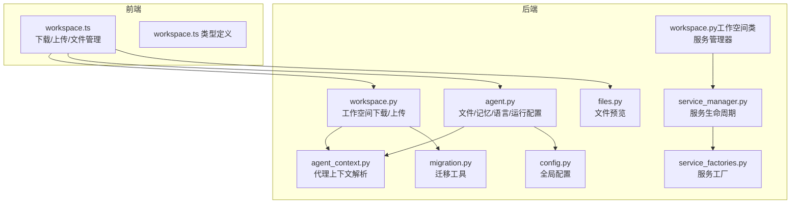
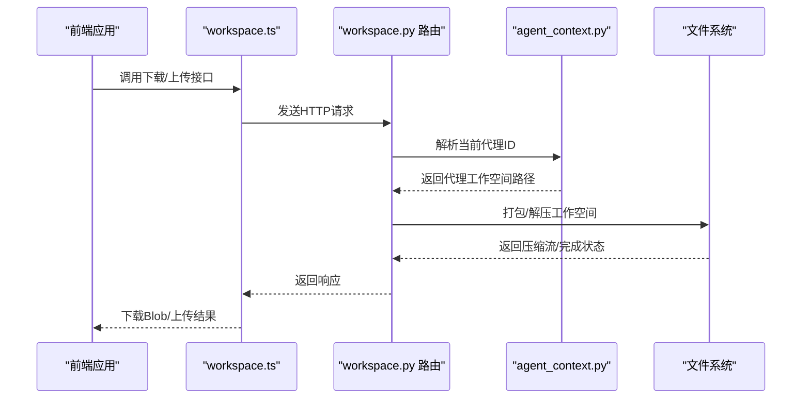
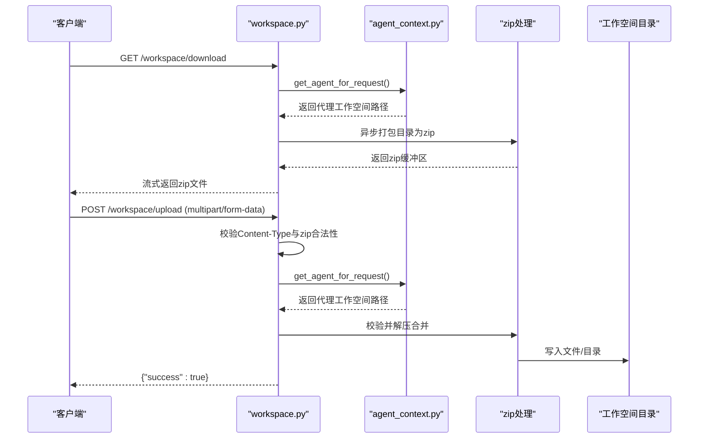
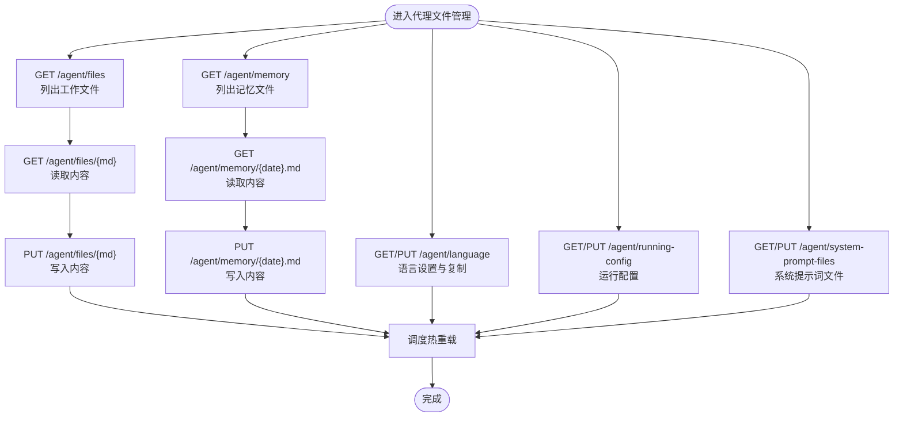
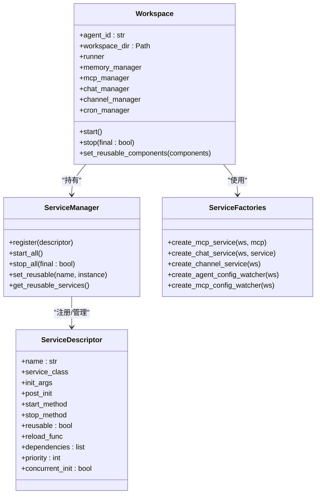
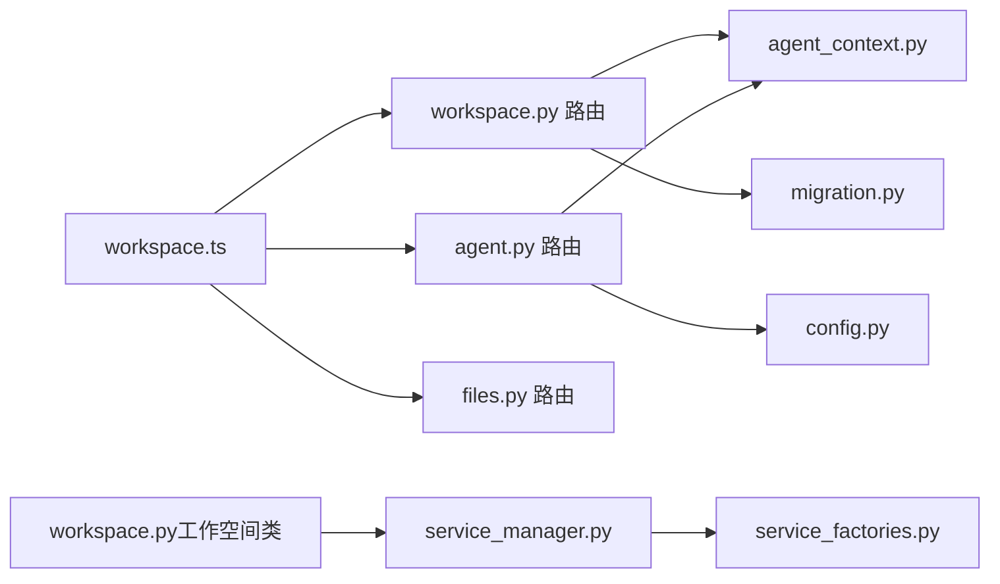

# 工作空间管理API

<cite>
**本文档引用的文件**
- [workspace.py](file://src/qwenpaw/app/routers/workspace.py)
- [agent.py](file://src/qwenpaw/app/routers/agent.py)
- [files.py](file://src/qwenpaw/app/routers/files.py)
- [workspace.ts](file://console/src/api/modules/workspace.ts)
- [workspace.ts 类型定义](file://console/src/api/types/workspace.ts)
- [workspace.py（工作空间类）](file://src/qwenpaw/app/workspace/workspace.py)
- [service_manager.py](file://src/qwenpaw/app/workspace/service_manager.py)
- [service_factories.py](file://src/qwenpaw/app/workspace/service_factories.py)
- [agent_context.py](file://src/qwenpaw/app/agent_context.py)
- [migration.py](file://src/qwenpaw/app/migration.py)
- [config.py](file://src/qwenpaw/config/config.py)
</cite>

## 目录
1. [简介](#简介)
2. [项目结构](#项目结构)
3. [核心组件](#核心组件)
4. [架构总览](#架构总览)
5. [详细组件分析](#详细组件分析)
6. [依赖关系分析](#依赖关系分析)
7. [性能考虑](#性能考虑)
8. [故障排除指南](#故障排除指南)
9. [结论](#结论)
10. [附录](#附录)

## 简介
本文件为 QwenPaw 工作空间管理API的详细RESTful文档，覆盖以下主题：
- 工作空间的创建、配置、文件管理、权限控制与状态监控
- 工作空间的存储结构、文件组织、访问权限与共享机制
- 备份恢复、迁移升级与清理维护的API接口
- 工作空间配额管理、资源统计与使用监控
- 工作空间与代理的绑定关系、切换机制与隔离策略
- 工作空间模板、批量操作与自动化管理

## 项目结构
工作空间管理API由后端FastAPI路由与前端TypeScript模块共同组成，核心文件如下：
- 后端路由：工作空间打包下载/上传、代理文件与记忆文件管理、预览文件
- 前端模块：封装下载、上传、文件列表与内容读写、每日记忆文件管理、系统提示词文件管理

**图表来源**
- [workspace.ts:1-149](file://console/src/api/modules/workspace.ts#L1-L149)
- [workspace.ts 类型定义:1-22](file://console/src/api/types/workspace.ts#L1-L22)
- [workspace.py:1-203](file://src/qwenpaw/app/routers/workspace.py#L1-L203)
- [agent.py:1-505](file://src/qwenpaw/app/routers/agent.py#L1-L505)
- [files.py:1-25](file://src/qwenpaw/app/routers/files.py#L1-L25)
- [agent_context.py:1-155](file://src/qwenpaw/app/agent_context.py#L1-L155)
- [config.py:1-200](file://src/qwenpaw/config/config.py#L1-L200)
- [migration.py:1-200](file://src/qwenpaw/app/migration.py#L1-L200)
- [workspace.py（工作空间类）:1-389](file://src/qwenpaw/app/workspace/workspace.py#L1-L389)
- [service_manager.py:1-421](file://src/qwenpaw/app/workspace/service_manager.py#L1-L421)
- [service_factories.py:1-171](file://src/qwenpaw/app/workspace/service_factories.py#L1-L171)

**章节来源**
- [workspace.py:1-203](file://src/qwenpaw/app/routers/workspace.py#L1-L203)
- [agent.py:1-505](file://src/qwenpaw/app/routers/agent.py#L1-L505)
- [files.py:1-25](file://src/qwenpaw/app/routers/files.py#L1-L25)
- [workspace.ts:1-149](file://console/src/api/modules/workspace.ts#L1-L149)
- [workspace.ts 类型定义:1-22](file://console/src/api/types/workspace.ts#L1-L22)

## 核心组件
- 工作空间下载/上传路由：提供将代理工作空间打包为zip下载，以及将zip合并到工作空间的上传能力，并内置安全校验防止路径穿越。
- 代理文件与记忆文件管理：提供工作目录与记忆目录的Markdown文件列表、读取、写入；支持按日期管理记忆文件。
- 文件预览：提供文件预览能力，确保仅返回真实存在的文件。
- 代理上下文：根据请求参数、头部或配置解析当前活跃代理，实现多代理隔离。
- 工作空间类与服务管理：工作空间封装独立运行时组件（运行器、通道管理、内存管理、MCP客户端、定时任务），通过服务管理器统一注册与生命周期管理。

**章节来源**
- [workspace.py:112-203](file://src/qwenpaw/app/routers/workspace.py#L112-L203)
- [agent.py:38-178](file://src/qwenpaw/app/routers/agent.py#L38-L178)
- [files.py:9-25](file://src/qwenpaw/app/routers/files.py#L9-L25)
- [agent_context.py:28-113](file://src/qwenpaw/app/agent_context.py#L28-L113)
- [workspace.py（工作空间类）:47-389](file://src/qwenpaw/app/workspace/workspace.py#L47-L389)
- [service_manager.py:74-421](file://src/qwenpaw/app/workspace/service_manager.py#L74-L421)
- [service_factories.py:18-171](file://src/qwenpaw/app/workspace/service_factories.py#L18-L171)

## 架构总览
工作空间管理API围绕“代理上下文 + 工作空间服务”展开，前端通过workspace.ts调用后端路由，后端路由解析当前代理，定位其工作空间目录，执行文件打包/解压、文件读写、预览等操作。

**图表来源**
- [workspace.ts:61-114](file://console/src/api/modules/workspace.ts#L61-L114)
- [workspace.py:126-203](file://src/qwenpaw/app/routers/workspace.py#L126-L203)
- [agent_context.py:28-113](file://src/qwenpaw/app/agent_context.py#L28-L113)

## 详细组件分析

### 工作空间下载/上传API
- 下载工作空间
  - 方法：GET /workspace/download
  - 功能：将代理工作空间打包为zip并以流式响应返回，文件名包含代理ID与时间戳。
  - 安全：若工作空间不存在则返回404；成功时设置Content-Disposition头。
- 上传工作空间
  - 方法：POST /workspace/upload
  - 功能：接收zip文件，进行有效性与路径穿越校验，然后合并到工作空间（文件覆盖、目录合并）。
  - 安全：校验zip合法性与路径安全性，异常时返回400或500。

**图表来源**
- [workspace.py:112-203](file://src/qwenpaw/app/routers/workspace.py#L112-L203)
- [agent_context.py:28-113](file://src/qwenpaw/app/agent_context.py#L28-L113)

**章节来源**
- [workspace.py:112-203](file://src/qwenpaw/app/routers/workspace.py#L112-L203)

### 代理文件与记忆文件管理API
- 列表工作文件
  - 方法：GET /agent/files
  - 功能：列出工作目录下的Markdown文件元数据。
- 读取工作文件
  - 方法：GET /agent/files/{md_name}
  - 功能：读取指定工作文件内容。
- 写入工作文件
  - 方法：PUT /agent/files/{md_name}
  - 功能：创建或更新工作文件。
- 列表记忆文件
  - 方法：GET /agent/memory
  - 功能：列出记忆目录下的Markdown文件元数据。
- 读取记忆文件
  - 方法：GET /agent/memory/{md_name}
  - 功能：读取指定记忆文件内容。
- 写入记忆文件
  - 方法：PUT /agent/memory/{md_name}
  - 功能：创建或更新记忆文件。
- 语言设置与热重载
  - 获取/设置代理语言，必要时复制对应语言的MD文件到工作空间。
- 运行配置
  - 获取/设置代理运行配置，支持异步调度热重载。
- 系统提示词文件
  - 获取/设置启用的系统提示词文件列表，支持异步调度热重载。

**图表来源**
- [agent.py:38-178](file://src/qwenpaw/app/routers/agent.py#L38-L178)
- [agent.py:427-505](file://src/qwenpaw/app/routers/agent.py#L427-L505)

**章节来源**
- [agent.py:38-178](file://src/qwenpaw/app/routers/agent.py#L38-L178)
- [agent.py:427-505](file://src/qwenpaw/app/routers/agent.py#L427-L505)

### 文件预览API
- 预览文件
  - 方法：GET /files/preview/{filepath}
  - 功能：对绝对或相对路径进行规范化与存在性检查，返回文件内容。
  - 安全：仅允许真实存在的文件被预览，否则返回404。

**章节来源**
- [files.py:9-25](file://src/qwenpaw/app/routers/files.py#L9-L25)

### 代理上下文与多代理隔离
- 上下文解析优先级：显式agent_id参数 > 请求状态中的agent_id > 请求头X-Agent-Id > 配置中的活跃代理。
- 校验代理存在性与启用状态，未初始化或多代理管理器未就绪时返回相应错误。
- 提供会话ID上下文变量，便于跨异步调用传递。

**章节来源**
- [agent_context.py:28-113](file://src/qwenpaw/app/agent_context.py#L28-L113)

### 工作空间类与服务管理
- 工作空间类职责：封装独立代理实例，包含运行器、通道管理、内存管理、MCP客户端、定时任务等组件。
- 服务管理器：统一注册、启动/停止、依赖解析与组件复用；支持并发/顺序初始化与优雅关闭。
- 服务工厂：负责创建与注入聊天管理、通道管理、MCP配置监听等服务。

**图表来源**
- [workspace.py（工作空间类）:47-389](file://src/qwenpaw/app/workspace/workspace.py#L47-L389)
- [service_manager.py:74-421](file://src/qwenpaw/app/workspace/service_manager.py#L74-L421)
- [service_factories.py:18-171](file://src/qwenpaw/app/workspace/service_factories.py#L18-L171)

**章节来源**
- [workspace.py（工作空间类）:47-389](file://src/qwenpaw/app/workspace/workspace.py#L47-L389)
- [service_manager.py:74-421](file://src/qwenpaw/app/workspace/service_manager.py#L74-L421)
- [service_factories.py:18-171](file://src/qwenpaw/app/workspace/service_factories.py#L18-L171)

### 迁移与升级
- 从单代理结构迁移到多代理结构：自动创建默认代理工作空间，迁移历史工作空间文件与目录，生成agent.json并更新根配置。
- 迁移过程包含原子写入agent.json、复制技能目录、冲突处理等步骤，保证数据一致性与可回退性。

**章节来源**
- [migration.py:54-227](file://src/qwenpaw/app/migration.py#L54-L227)
- [migration.py:229-521](file://src/qwenpaw/app/migration.py#L229-L521)

## 依赖关系分析
- 前端workspace.ts依赖后端路由与类型定义，负责下载/上传与文件管理。
- 后端路由依赖代理上下文解析当前代理，定位工作空间目录。
- 工作空间类依赖服务管理器与服务工厂，实现组件化与可复用。
- 全局配置与迁移工具为工作空间提供基础环境与升级路径。

**图表来源**
- [workspace.ts:1-149](file://console/src/api/modules/workspace.ts#L1-L149)
- [workspace.py:1-203](file://src/qwenpaw/app/routers/workspace.py#L1-L203)
- [agent.py:1-505](file://src/qwenpaw/app/routers/agent.py#L1-L505)
- [files.py:1-25](file://src/qwenpaw/app/routers/files.py#L1-L25)
- [agent_context.py:1-155](file://src/qwenpaw/app/agent_context.py#L1-L155)
- [migration.py:1-200](file://src/qwenpaw/app/migration.py#L1-L200)
- [workspace.py（工作空间类）:1-389](file://src/qwenpaw/app/workspace/workspace.py#L1-L389)
- [service_manager.py:1-421](file://src/qwenpaw/app/workspace/service_manager.py#L1-L421)
- [service_factories.py:1-171](file://src/qwenpaw/app/workspace/service_factories.py#L1-L171)
- [config.py:1-200](file://src/qwenpaw/config/config.py#L1-L200)

**章节来源**
- [workspace.ts:1-149](file://console/src/api/modules/workspace.ts#L1-L149)
- [workspace.py:1-203](file://src/qwenpaw/app/routers/workspace.py#L1-L203)
- [agent.py:1-505](file://src/qwenpaw/app/routers/agent.py#L1-L505)
- [files.py:1-25](file://src/qwenpaw/app/routers/files.py#L1-L25)
- [agent_context.py:1-155](file://src/qwenpaw/app/agent_context.py#L1-L155)
- [migration.py:1-200](file://src/qwenpaw/app/migration.py#L1-L200)
- [workspace.py（工作空间类）:1-389](file://src/qwenpaw/app/workspace/workspace.py#L1-L389)
- [service_manager.py:1-421](file://src/qwenpaw/app/workspace/service_manager.py#L1-L421)
- [service_factories.py:1-171](file://src/qwenpaw/app/workspace/service_factories.py#L1-L171)
- [config.py:1-200](file://src/qwenpaw/config/config.py#L1-L200)

## 性能考虑
- 异步I/O：工作空间下载采用异步线程池执行zip打包，避免阻塞事件循环。
- 并发启动：服务管理器按优先级分组并发初始化可并发的服务，缩短启动时间。
- 流式传输：下载接口以StreamingResponse返回zip，降低内存占用。
- 资源统计：建议在前端或独立服务中基于文件计数与大小统计工作空间资源使用情况，结合配额限制实现资源治理。

## 故障排除指南
- 下载失败（404）：确认代理工作空间目录是否存在。
- 上传失败（400）：检查Content-Type是否为zip类型，确认zip合法性与路径安全性。
- 上传失败（500）：查看服务器日志，关注解压合并过程中的异常。
- 文件预览失败（404）：确认文件路径是否为真实存在的文件。
- 代理不可用（404/403）：检查代理是否存在且已启用，确认活跃代理配置。
- 热重载无效：确认已触发调度热重载流程，检查相关配置字段是否正确。

**章节来源**
- [workspace.py:126-203](file://src/qwenpaw/app/routers/workspace.py#L126-L203)
- [files.py:14-24](file://src/qwenpaw/app/routers/files.py#L14-L24)
- [agent_context.py:70-113](file://src/qwenpaw/app/agent_context.py#L70-L113)

## 结论
本文档系统梳理了QwenPaw工作空间管理API的端点、数据模型与交互流程，明确了工作空间的存储结构、文件组织、访问权限与共享机制，提供了备份恢复、迁移升级与清理维护的接口规范，并阐述了与代理的绑定关系、切换机制与隔离策略。建议在生产环境中结合配额管理与资源统计，完善工作空间的运维与监控体系。

## 附录

### API端点一览
- 工作空间
  - GET /workspace/download：下载工作空间为zip
  - POST /workspace/upload：上传zip并合并到工作空间
- 代理文件与记忆
  - GET /agent/files：列出工作文件
  - GET /agent/files/{md_name}：读取工作文件
  - PUT /agent/files/{md_name}：写入工作文件
  - GET /agent/memory：列出记忆文件
  - GET /agent/memory/{md_name}：读取记忆文件
  - PUT /agent/memory/{md_name}：写入记忆文件
  - GET /agent/language：获取代理语言
  - PUT /agent/language：设置代理语言
  - GET /agent/running-config：获取运行配置
  - PUT /agent/running-config：设置运行配置
  - GET /agent/system-prompt-files：获取系统提示词文件列表
  - PUT /agent/system-prompt-files：设置系统提示词文件列表
- 文件预览
  - GET /files/preview/{filepath}：预览文件

**章节来源**
- [workspace.py:112-203](file://src/qwenpaw/app/routers/workspace.py#L112-L203)
- [agent.py:38-178](file://src/qwenpaw/app/routers/agent.py#L38-L178)
- [agent.py:427-505](file://src/qwenpaw/app/routers/agent.py#L427-L505)
- [files.py:9-25](file://src/qwenpaw/app/routers/files.py#L9-L25)