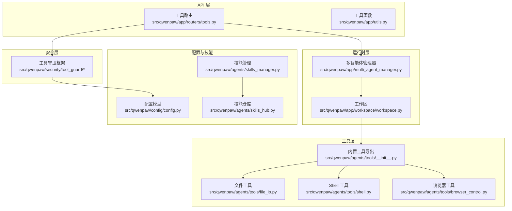
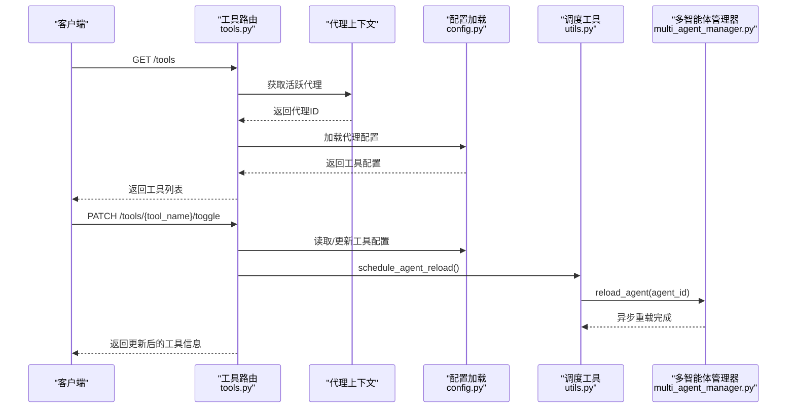
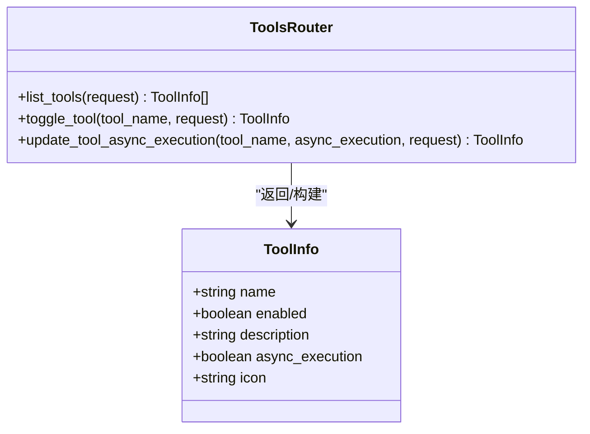
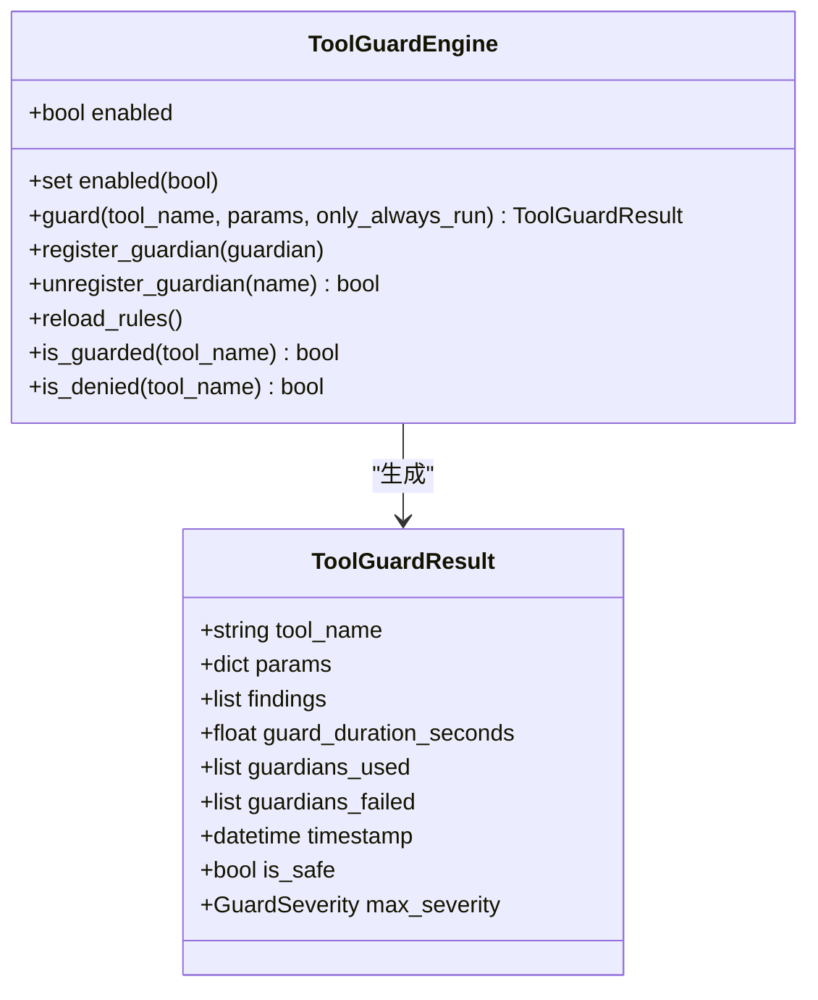
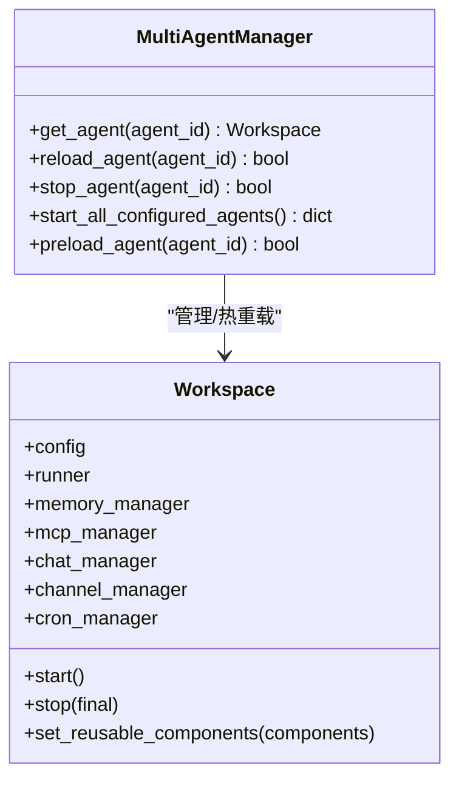
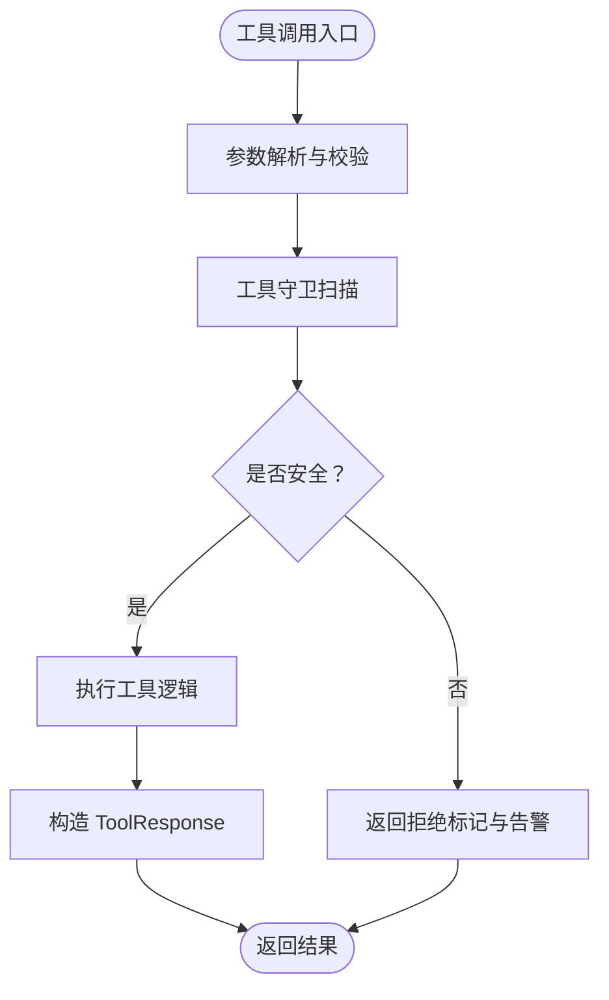
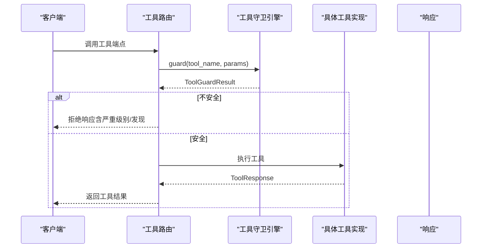
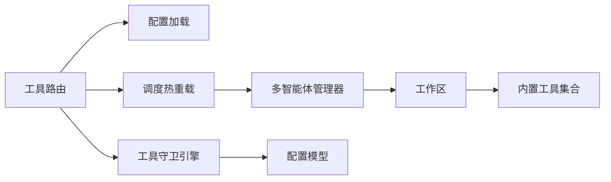

# 工具管理API

<cite>
**本文档引用的文件**
- [src/qwenpaw/app/routers/tools.py](file://src/qwenpaw/app/routers/tools.py)
- [src/qwenpaw/agents/tools/__init__.py](file://src/qwenpaw/agents/tools/__init__.py)
- [src/qwenpaw/agents/tools/file_io.py](file://src/qwenpaw/agents/tools/file_io.py)
- [src/qwenpaw/agents/tools/shell.py](file://src/qwenpaw/agents/tools/shell.py)
- [src/qwenpaw/agents/tools/browser_control.py](file://src/qwenpaw/agents/tools/browser_control.py)
- [src/qwenpaw/security/tool_guard/__init__.py](file://src/qwenpaw/security/tool_guard/__init__.py)
- [src/qwenpaw/security/tool_guard/engine.py](file://src/qwenpaw/security/tool_guard/engine.py)
- [src/qwenpaw/security/tool_guard/models.py](file://src/qwenpaw/security/tool_guard/models.py)
- [src/qwenpaw/app/utils.py](file://src/qwenpaw/app/utils.py)
- [src/qwenpaw/app/workspace/workspace.py](file://src/qwenpaw/app/workspace/workspace.py)
- [src/qwenpaw/app/multi_agent_manager.py](file://src/qwenpaw/app/multi_agent_manager.py)
- [src/qwenpaw/config/config.py](file://src/qwenpaw/config/config.py)
- [src/qwenpaw/agents/skills_manager.py](file://src/qwenpaw/agents/skills_manager.py)
- [src/qwenpaw/agents/skills_hub.py](file://src/qwenpaw/agents/skills_hub.py)
</cite>

## 目录
1. [简介](#简介)
2. [项目结构](#项目结构)
3. [核心组件](#核心组件)
4. [架构总览](#架构总览)
5. [详细组件分析](#详细组件分析)
6. [依赖关系分析](#依赖关系分析)
7. [性能考虑](#性能考虑)
8. [故障排除指南](#故障排除指南)
9. [结论](#结论)
10. [附录](#附录)

## 简介
本文件为 QwenPaw 的工具管理 API 完整 RESTful 文档，覆盖内置工具与自定义工具的注册、配置、权限控制与执行监控等端点。内容包括：
- 工具元数据与参数定义
- 权限控制与安全策略（预调用守卫）
- 工具调用接口、参数校验、结果处理与错误回传
- 工具沙箱隔离、资源限制与超时控制
- 工具依赖管理、版本控制与兼容性检查
- 工具开发规范、调试接口与性能监控建议

## 项目结构
QwenPaw 将工具管理 API 放置于 FastAPI 路由模块中，并通过工作区（Workspace）与多智能体管理器（MultiAgentManager）进行生命周期与热重载管理。安全方面通过工具守卫（Tool Guard）框架在工具调用前进行参数扫描与风险评估。

**图表来源**
- [src/qwenpaw/app/routers/tools.py:1-181](file://src/qwenpaw/app/routers/tools.py#L1-L181)
- [src/qwenpaw/app/multi_agent_manager.py:1-470](file://src/qwenpaw/app/multi_agent_manager.py#L1-L470)
- [src/qwenpaw/app/workspace/workspace.py:1-389](file://src/qwenpaw/app/workspace/workspace.py#L1-L389)
- [src/qwenpaw/agents/tools/__init__.py:1-48](file://src/qwenpaw/agents/tools/__init__.py#L1-L48)
- [src/qwenpaw/security/tool_guard/engine.py:1-238](file://src/qwenpaw/security/tool_guard/engine.py#L1-L238)
- [src/qwenpaw/config/config.py:1-800](file://src/qwenpaw/config/config.py#L1-L800)
- [src/qwenpaw/agents/skills_manager.py:1-800](file://src/qwenpaw/agents/skills_manager.py#L1-L800)
- [src/qwenpaw/agents/skills_hub.py:1-800](file://src/qwenpaw/agents/skills_hub.py#L1-L800)

**章节来源**
- [src/qwenpaw/app/routers/tools.py:1-181](file://src/qwenpaw/app/routers/tools.py#L1-L181)
- [src/qwenpaw/app/multi_agent_manager.py:1-470](file://src/qwenpaw/app/multi_agent_manager.py#L1-L470)
- [src/qwenpaw/app/workspace/workspace.py:1-389](file://src/qwenpaw/app/workspace/workspace.py#L1-L389)

## 核心组件
- 工具路由：提供工具列表、启用/禁用切换、异步执行设置更新等端点。
- 工具守卫：在工具调用前扫描参数，识别高危模式并生成结果。
- 多智能体管理器与工作区：负责工具配置的热重载与运行时生命周期管理。
- 内置工具集合：文件读写、Shell 执行、浏览器自动化等常用能力。
- 配置系统：提供工具与安全策略的全局与代理级配置。

**章节来源**
- [src/qwenpaw/app/routers/tools.py:23-181](file://src/qwenpaw/app/routers/tools.py#L23-L181)
- [src/qwenpaw/security/tool_guard/engine.py:53-238](file://src/qwenpaw/security/tool_guard/engine.py#L53-L238)
- [src/qwenpaw/app/multi_agent_manager.py:21-320](file://src/qwenpaw/app/multi_agent_manager.py#L21-L320)
- [src/qwenpaw/agents/tools/__init__.py:1-48](file://src/qwenpaw/agents/tools/__init__.py#L1-L48)
- [src/qwenpaw/config/config.py:704-712](file://src/qwenpaw/config/config.py#L704-L712)

## 架构总览
工具管理 API 的请求流从 FastAPI 路由进入，解析当前活跃代理的工作区配置，读取或更新工具开关与异步执行策略，并通过后台任务触发热重载。工具调用前由工具守卫引擎进行参数扫描，最终返回统一的响应格式。

**图表来源**
- [src/qwenpaw/app/routers/tools.py:36-127](file://src/qwenpaw/app/routers/tools.py#L36-L127)
- [src/qwenpaw/app/utils.py:15-59](file://src/qwenpaw/app/utils.py#L15-L59)
- [src/qwenpaw/app/multi_agent_manager.py:208-320](file://src/qwenpaw/app/multi_agent_manager.py#L208-L320)

## 详细组件分析

### 工具路由与端点规范
- 基础路径：/tools
- 标签：tools

端点一览：
- GET /tools  
  功能：列出当前活跃代理的所有内置工具及其启用状态、描述、是否异步执行、图标等。  
  响应：工具信息数组（ToolInfo）。  
  错误：无工具配置时返回空数组。

- PATCH /tools/{tool_name}/toggle  
  功能：切换指定工具的启用状态。  
  请求路径参数：tool_name（字符串）。  
  响应：更新后的工具信息（ToolInfo）。  
  错误：工具不存在时返回 404。

- PATCH /tools/{tool_name}/async-execution  
  功能：更新工具的异步执行设置。  
  请求路径参数：tool_name（字符串）。  
  请求体：async_execution（布尔值）。  
  响应：更新后的工具信息（ToolInfo）。  
  错误：工具不存在时返回 404。

数据模型（ToolInfo）字段：
- name：工具函数名（字符串）
- enabled：是否启用（布尔值）
- description：描述（字符串，默认空）
- async_execution：是否异步执行（布尔值，默认 false）
- icon：图标（字符串，默认🔧）

**图表来源**
- [src/qwenpaw/app/routers/tools.py:23-181](file://src/qwenpaw/app/routers/tools.py#L23-L181)

**章节来源**
- [src/qwenpaw/app/routers/tools.py:36-181](file://src/qwenpaw/app/routers/tools.py#L36-L181)

### 工具守卫（预调用安全）
工具守卫在工具调用前扫描参数，识别命令注入、敏感文件访问、资源滥用等威胁，聚合结果并返回严重级别与发现列表。支持规则型守护与文件路径守护，可按配置启用/禁用与动态重载规则。

关键组件：
- ToolGuardEngine：编排所有守护者，聚合结果，支持仅运行“始终运行”的守护者。
- GuardSeverity/GuardThreatCategory：严重级别与威胁类别枚举。
- ToolGuardResult：一次工具调用的守卫结果聚合。
- 规则与环境变量：可通过环境变量或配置控制是否启用、受保护工具集与拒绝工具集。

**图表来源**
- [src/qwenpaw/security/tool_guard/engine.py:53-238](file://src/qwenpaw/security/tool_guard/engine.py#L53-L238)
- [src/qwenpaw/security/tool_guard/models.py:1-185](file://src/qwenpaw/security/tool_guard/models.py#L1-L185)

**章节来源**
- [src/qwenpaw/security/tool_guard/__init__.py:1-59](file://src/qwenpaw/security/tool_guard/__init__.py#L1-L59)
- [src/qwenpaw/security/tool_guard/engine.py:53-238](file://src/qwenpaw/security/tool_guard/engine.py#L53-L238)
- [src/qwenpaw/security/tool_guard/models.py:1-185](file://src/qwenpaw/security/tool_guard/models.py#L1-L185)

### 工作区与多智能体管理
- MultiAgentManager：集中管理多个 Workspace 实例，支持懒加载、零停机热重载、延迟清理旧实例等。
- Workspace：封装单个代理的完整运行时组件（运行器、内存管理、通道、MCP、计划任务等），支持服务化注册与可复用组件热替换。

**图表来源**
- [src/qwenpaw/app/multi_agent_manager.py:21-320](file://src/qwenpaw/app/multi_agent_manager.py#L21-L320)
- [src/qwenpaw/app/workspace/workspace.py:47-389](file://src/qwenpaw/app/workspace/workspace.py#L47-L389)

**章节来源**
- [src/qwenpaw/app/multi_agent_manager.py:21-320](file://src/qwenpaw/app/multi_agent_manager.py#L21-L320)
- [src/qwenpaw/app/workspace/workspace.py:47-389](file://src/qwenpaw/app/workspace/workspace.py#L47-L389)

### 内置工具能力
- 文件工具：读取/写入/编辑/追加文件；自动编码选择与输出截断提示。
- Shell 工具：跨平台命令执行；线程池与进程组控制；超时与强制终止；输出解码与错误回传。
- 浏览器工具：Playwright 驱动；会话持久化；页面/帧监听；空闲回收；CDP 连接支持。

**图表来源**
- [src/qwenpaw/security/tool_guard/engine.py:169-227](file://src/qwenpaw/security/tool_guard/engine.py#L169-L227)
- [src/qwenpaw/agents/tools/file_io.py:66-206](file://src/qwenpaw/agents/tools/file_io.py#L66-L206)
- [src/qwenpaw/agents/tools/shell.py:284-444](file://src/qwenpaw/agents/tools/shell.py#L284-L444)
- [src/qwenpaw/agents/tools/browser_control.py:642-800](file://src/qwenpaw/agents/tools/browser_control.py#L642-L800)

**章节来源**
- [src/qwenpaw/agents/tools/file_io.py:66-206](file://src/qwenpaw/agents/tools/file_io.py#L66-L206)
- [src/qwenpaw/agents/tools/shell.py:284-444](file://src/qwenpaw/agents/tools/shell.py#L284-L444)
- [src/qwenpaw/agents/tools/browser_control.py:642-800](file://src/qwenpaw/agents/tools/browser_control.py#L642-L800)

### 工具调用流程（序列图）

**图表来源**
- [src/qwenpaw/app/routers/tools.py:36-181](file://src/qwenpaw/app/routers/tools.py#L36-L181)
- [src/qwenpaw/security/tool_guard/engine.py:169-227](file://src/qwenpaw/security/tool_guard/engine.py#L169-L227)

## 依赖关系分析
- 工具路由依赖代理上下文与配置加载，更新后通过调度工具触发热重载。
- 工具守卫依赖配置与环境变量决定启用状态与规则集。
- 工作区与多智能体管理器负责工具配置的持久化与热重载。
- 内置工具集合提供文件、Shell、浏览器等基础能力。

**图表来源**
- [src/qwenpaw/app/routers/tools.py:45-127](file://src/qwenpaw/app/routers/tools.py#L45-L127)
- [src/qwenpaw/app/utils.py:15-59](file://src/qwenpaw/app/utils.py#L15-L59)
- [src/qwenpaw/app/multi_agent_manager.py:208-320](file://src/qwenpaw/app/multi_agent_manager.py#L208-L320)
- [src/qwenpaw/app/workspace/workspace.py:120-140](file://src/qwenpaw/app/workspace/workspace.py#L120-L140)
- [src/qwenpaw/agents/tools/__init__.py:1-48](file://src/qwenpaw/agents/tools/__init__.py#L1-L48)
- [src/qwenpaw/security/tool_guard/engine.py:53-154](file://src/qwenpaw/security/tool_guard/engine.py#L53-L154)
- [src/qwenpaw/config/config.py:704-712](file://src/qwenpaw/config/config.py#L704-L712)

**章节来源**
- [src/qwenpaw/app/routers/tools.py:45-127](file://src/qwenpaw/app/routers/tools.py#L45-L127)
- [src/qwenpaw/app/utils.py:15-59](file://src/qwenpaw/app/utils.py#L15-L59)
- [src/qwenpaw/app/multi_agent_manager.py:208-320](file://src/qwenpaw/app/multi_agent_manager.py#L208-L320)
- [src/qwenpaw/agents/tools/__init__.py:1-48](file://src/qwenpaw/agents/tools/__init__.py#L1-L48)
- [src/qwenpaw/security/tool_guard/engine.py:53-154](file://src/qwenpaw/security/tool_guard/engine.py#L53-L154)
- [src/qwenpaw/config/config.py:704-712](file://src/qwenpaw/config/config.py#L704-L712)

## 性能考虑
- 工具守卫：默认启用，可在环境变量或配置中调整；规则重载支持动态更新，避免重启。
- 热重载：使用非阻塞后台任务触发，确保 API 响应快速返回。
- 资源限制：Shell 工具提供超时控制与进程组终止；浏览器工具具备空闲回收机制。
- 输出截断：文件读取工具对大文本进行智能截断并提示续读。

[本节为通用指导，无需特定文件引用]

## 故障排除指南
- 工具未找到（404）：确认工具名称正确且存在于当前代理配置的内置工具集中。
- 守卫拒绝：查看 ToolGuardResult 中的严重级别与发现详情，根据规则调整参数或提升权限。
- 热重载失败：检查后台任务日志，确认多智能体管理器已初始化并可访问。
- Shell 超时：适当增加超时时间或优化命令执行逻辑。
- 浏览器异常：检查 Playwright 安装与可执行路径，必要时使用系统默认浏览器或容器模式。

**章节来源**
- [src/qwenpaw/app/routers/tools.py:104-126](file://src/qwenpaw/app/routers/tools.py#L104-L126)
- [src/qwenpaw/security/tool_guard/engine.py:169-227](file://src/qwenpaw/security/tool_guard/engine.py#L169-L227)
- [src/qwenpaw/app/utils.py:49-59](file://src/qwenpaw/app/utils.py#L49-L59)
- [src/qwenpaw/agents/tools/shell.py:367-410](file://src/qwenpaw/agents/tools/shell.py#L367-L410)
- [src/qwenpaw/agents/tools/browser_control.py:262-290](file://src/qwenpaw/agents/tools/browser_control.py#L262-L290)

## 结论
QwenPaw 的工具管理 API 提供了完善的工具注册、配置与权限控制能力，结合工具守卫与热重载机制，既保证了安全性也兼顾了易用性。内置工具覆盖文件、Shell、浏览器等常见场景，适合在生产环境中进行扩展与定制。

[本节为总结性内容，无需特定文件引用]

## 附录

### API 端点定义

- GET /tools  
  功能：列出内置工具列表与状态  
  认证：需要认证  
  响应：200 返回工具信息数组  
  其他：404 工具配置缺失时返回空数组

- PATCH /tools/{tool_name}/toggle  
  功能：切换工具启用状态  
  认证：需要认证  
  路径参数：tool_name（字符串）  
  响应：200 返回更新后的工具信息  
  其他：404 工具不存在

- PATCH /tools/{tool_name}/async-execution  
  功能：更新工具异步执行设置  
  认证：需要认证  
  路径参数：tool_name（字符串）  
  请求体：async_execution（布尔值）  
  响应：200 返回更新后的工具信息  
  其他：404 工具不存在

**章节来源**
- [src/qwenpaw/app/routers/tools.py:36-181](file://src/qwenpaw/app/routers/tools.py#L36-L181)

### 工具守卫配置要点
- 启用控制：可通过环境变量或配置项控制是否启用工具守卫。
- 受保护工具集：可配置仅对特定工具执行守卫。
- 规则重载：支持动态重载规则，无需重启服务。
- 结果聚合：返回严重级别、发现数量与守护者使用情况。

**章节来源**
- [src/qwenpaw/security/tool_guard/engine.py:35-154](file://src/qwenpaw/security/tool_guard/engine.py#L35-L154)
- [src/qwenpaw/security/tool_guard/models.py:103-176](file://src/qwenpaw/security/tool_guard/models.py#L103-L176)

### 工具开发规范与调试建议
- 参数校验：在工具实现中严格校验输入类型与范围，返回明确的错误消息。
- 超时与资源限制：为耗时操作设置超时，避免阻塞主线程。
- 日志与追踪：记录关键步骤与异常，便于问题定位。
- 安全优先：遵循最小权限原则，避免直接执行不受控命令或访问敏感路径。

[本节为通用指导，无需特定文件引用]