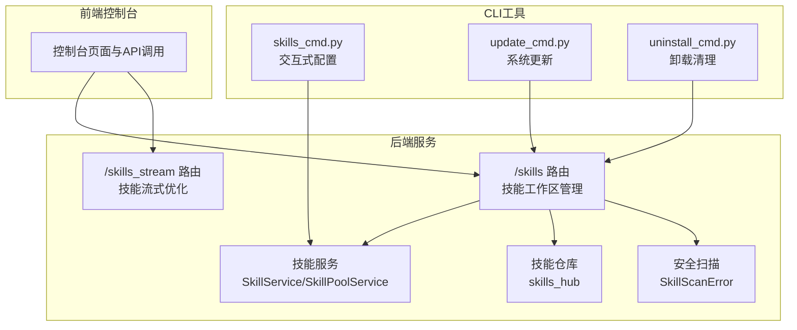
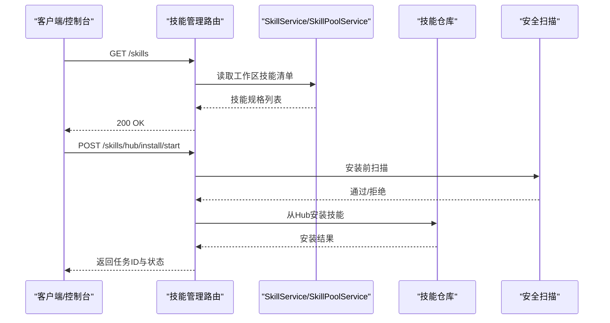
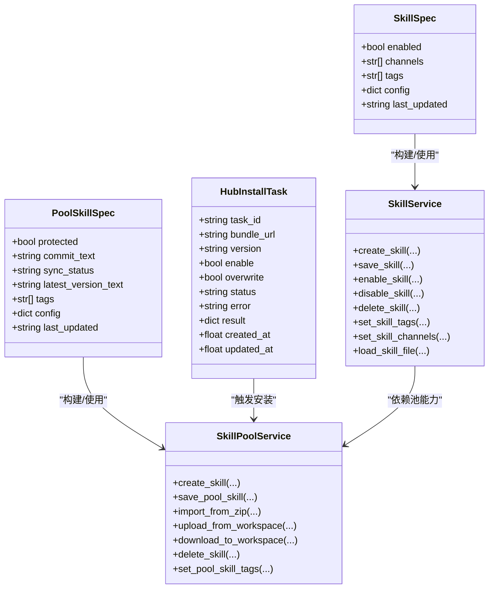

# 技能管理API

<cite>
**本文档引用的文件**
- [skills.py](file://src/qwenpaw/app/routers/skills.py)
- [skills_stream.py](file://src/qwenpaw/app/routers/skills_stream.py)
- [skills_cmd.py](file://src/qwenpaw/cli/skills_cmd.py)
- [uninstall_cmd.py](file://src/qwenpaw/cli/uninstall_cmd.py)
- [update_cmd.py](file://src/qwenpaw/cli/update_cmd.py)
</cite>

## 目录
1. [简介](#简介)
2. [项目结构](#项目结构)
3. [核心组件](#核心组件)
4. [架构总览](#架构总览)
5. [详细组件分析](#详细组件分析)
6. [依赖关系分析](#依赖关系分析)
7. [性能考虑](#性能考虑)
8. [故障排除指南](#故障排除指南)
9. [结论](#结论)
10. [附录](#附录)

## 简介
本文件为 QwenPaw 技能管理API的完整RESTful接口文档，覆盖技能仓库管理、技能安装与卸载、技能配置与标签管理、批量操作以及技能流式优化等能力。文档面向开发者与运维人员，提供端点定义、请求/响应模型、参数校验规则、错误处理机制与最佳实践，帮助快速集成与扩展。

## 项目结构
技能管理相关的核心实现位于后端FastAPI路由模块中，前端控制台通过HTTP调用这些API完成技能的浏览、安装、启用/禁用、配置与删除等操作；CLI工具提供命令行下的技能配置与环境维护能力。

图表来源
- [skills.py:62-1424](file://src/qwenpaw/app/routers/skills.py#L62-L1424)
- [skills_stream.py:128-249](file://src/qwenpaw/app/routers/skills_stream.py#L128-L249)
- [skills_cmd.py:213-275](file://src/qwenpaw/cli/skills_cmd.py#L213-L275)
- [update_cmd.py:631-731](file://src/qwenpaw/cli/update_cmd.py#L631-L731)
- [uninstall_cmd.py:46-90](file://src/qwenpaw/cli/uninstall_cmd.py#L46-L90)

章节来源
- [skills.py:1-1424](file://src/qwenpaw/app/routers/skills.py#L1-L1424)
- [skills_stream.py:1-249](file://src/qwenpaw/app/routers/skills_stream.py#L1-L249)
- [skills_cmd.py:1-275](file://src/qwenpaw/cli/skills_cmd.py#L1-L275)
- [update_cmd.py:1-731](file://src/qwenpaw/cli/update_cmd.py#L1-L731)
- [uninstall_cmd.py:1-90](file://src/qwenpaw/cli/uninstall_cmd.py#L1-L90)

## 核心组件
- 技能工作区管理路由：提供技能列表、搜索、安装、启用/禁用、配置、标签、批量操作、文件读取等端点。
- 技能池管理路由：提供技能池列表、刷新、内置源、导入/导出、下载到工作区、删除、配置与标签管理等端点。
- 流式优化路由：提供基于大模型的技能内容优化流式接口。
- 安全扫描：统一拦截与标准化安全扫描异常，返回稳定的错误负载。
- CLI工具：提供交互式技能配置、系统更新与卸载清理。

章节来源
- [skills.py:533-1424](file://src/qwenpaw/app/routers/skills.py#L533-L1424)
- [skills_stream.py:170-249](file://src/qwenpaw/app/routers/skills_stream.py#L170-L249)
- [skills_cmd.py:120-275](file://src/qwenpaw/cli/skills_cmd.py#L120-L275)
- [update_cmd.py:631-731](file://src/qwenpaw/cli/update_cmd.py#L631-L731)
- [uninstall_cmd.py:46-90](file://src/qwenpaw/cli/uninstall_cmd.py#L46-L90)

## 架构总览
技能管理API采用分层设计：
- 表示层：FastAPI路由定义HTTP端点与请求/响应模型。
- 业务层：SkillService与SkillPoolService封装技能的增删改查、启用/禁用、导入导出、配置与标签管理。
- 集成层：与技能仓库（skills_hub）交互，支持从Hub安装、导入内置技能、下载到工作区等。
- 安全层：统一的安全扫描拦截，保障技能内容合规。
- 前端/CLI：通过HTTP或命令行与后端交互。

图表来源
- [skills.py:582-641](file://src/qwenpaw/app/routers/skills.py#L582-L641)
- [skills.py:436-474](file://src/qwenpaw/app/routers/skills.py#L436-L474)

## 详细组件分析

### 技能工作区管理（/skills）
- 列表与刷新
  - GET /skills：获取当前工作区技能清单
  - POST /skills/refresh：强制重合manifest并返回最新清单
- 搜索与Hub安装
  - GET /skills/hub/search：按关键词与限制数搜索Hub技能
  - POST /skills/hub/install/start：启动从Hub安装的任务（异步）
  - GET /skills/hub/install/status/{task_id}：查询安装任务状态
  - POST /skills/hub/install/cancel/{task_id}：取消安装任务
- 创建与上传
  - POST /skills：创建工作区技能（可选择启用）
  - POST /skills/upload：上传ZIP包导入技能（支持重命名映射、覆盖与启用）
- 编辑与保存
  - PUT /skills/save：保存或重命名编辑工作区技能
  - PUT /{skill_name}/config：更新技能配置
  - DELETE /{skill_name}/config：清空技能配置
  - PUT /{skill_name}/tags：设置技能标签（最多8个，单个长度<=16）
  - PUT /{skill_name}/channels：设置技能可用通道
- 启用/禁用/删除
  - POST /{skill_name}/enable：启用技能（含安全扫描）
  - POST /{skill_name}/disable：禁用技能
  - DELETE /{skill_name}：删除已禁用技能
- 批量操作
  - POST /batch-enable：批量启用（逐项返回结果）
  - POST /batch-disable：批量禁用
  - POST /batch-delete：批量删除（逐项返回结果）
- 文件读取
  - GET /{skill_name}/files/{file_path}：读取技能内部文件内容

章节来源
- [skills.py:533-1424](file://src/qwenpaw/app/routers/skills.py#L533-L1424)

### 技能池管理（/skills/pool）
- 列表与刷新
  - GET /skills/pool：获取技能池技能清单
  - POST /skills/pool/refresh：强制重合manifest并返回最新清单
- 内置源与导入
  - GET /skills/pool/builtin-sources：列出可导入的内置源
  - POST /skills/pool/import：从Hub导入技能到池
  - POST /skills/pool/import-builtin：导入内置技能
  - POST /skills/pool/{skill_name}/update-builtin：更新单个内置技能
- 创建与编辑
  - POST /skills/pool/create：创建池技能
  - PUT /skills/pool/save：编辑或另存为池技能
  - POST /skills/pool/upload-zip：上传ZIP导入池技能
  - POST /skills/pool/upload：将工作区技能上传到池
- 下载到工作区
  - POST /skills/pool/download：将池技能批量下载到各工作区（原子性）
- 配置与标签
  - GET /skills/pool/{skill_name}/config：读取池技能配置
  - PUT /skills/pool/{skill_name}/config：更新池技能配置
  - DELETE /skills/pool/{skill_name}/config：清空池技能配置
  - PUT /skills/pool/{skill_name}/tags：设置池技能标签
- 删除
  - DELETE /skills/pool/{skill_name}：删除池技能

章节来源
- [skills.py:643-1059](file://src/qwenpaw/app/routers/skills.py#L643-L1059)

### 技能流式优化（/skills/ai/optimize/stream）
- POST /skills/ai/optimize/stream：以SSE流式返回AI对技能内容的优化建议
  - 请求体包含技能内容与语言（en/zh/ru）
  - 返回data: {"text": "..."} 的增量文本片段，最后一条为{"done": true}

章节来源
- [skills_stream.py:170-249](file://src/qwenpaw/app/routers/skills_stream.py#L170-L249)

### 安全扫描与错误处理
- 统一拦截技能扫描异常，返回稳定结构的422响应：
  - type: "security_scan_failed"
  - detail: 异常描述
  - skill_name: 报告的技能名称
  - max_severity: 最高风险等级
  - findings: 发现列表（包含严重程度、标题、描述、文件路径、行号、规则ID）

章节来源
- [skills.py:68-108](file://src/qwenpaw/app/routers/skills.py#L68-L108)

### CLI技能管理
- 交互式配置：skills group config/list
  - 支持多选启用/禁用，自动安装池中未存在的技能
- 系统更新：update 命令检测并升级QwenPaw
- 卸载清理：uninstall 命令移除环境与shell配置

章节来源
- [skills_cmd.py:213-275](file://src/qwenpaw/cli/skills_cmd.py#L213-L275)
- [update_cmd.py:631-731](file://src/qwenpaw/cli/update_cmd.py#L631-L731)
- [uninstall_cmd.py:46-90](file://src/qwenpaw/cli/uninstall_cmd.py#L46-L90)

## 依赖关系分析
- 路由依赖：/skills 与 /skills/pool 路由均依赖 SkillService 与 SkillPoolService 进行业务操作。
- Hub集成：安装/导入/内置更新等操作依赖 skills_hub 提供的仓库能力。
- 安全扫描：所有写入型操作（创建/保存/导入/安装）在执行前进行安全扫描，失败时返回统一错误格式。
- 并发与事务：Hub安装任务使用锁与取消事件保证并发安全；批量下载到工作区采用快照回滚策略确保原子性。

图表来源
- [skills.py:111-127](file://src/qwenpaw/app/routers/skills.py#L111-L127)
- [skills.py:224-235](file://src/qwenpaw/app/routers/skills.py#L224-L235)
- [skills.py:476-531](file://src/qwenpaw/app/routers/skills.py#L476-L531)

## 性能考虑
- 异步安装：Hub安装任务在独立协程中运行，避免阻塞主线程。
- 流式优化：SSE返回增量文本，降低前端等待时间。
- 并发控制：安装任务使用锁保护全局状态，防止竞态。
- 大文件限制：ZIP上传大小上限为100MB，内容类型白名单限定，避免资源滥用。
- 批量操作：逐项返回结果，便于前端及时反馈，同时减少单次请求的复杂度。

章节来源
- [skills.py:242-247](file://src/qwenpaw/app/routers/skills.py#L242-L247)
- [skills_stream.py:170-249](file://src/qwenpaw/app/routers/skills_stream.py#L170-L249)

## 故障排除指南
- 安全扫描失败（422）：检查技能内容是否符合策略，查看返回的最高风险等级与发现列表，修复后重试。
- 安装冲突（409）：根据建议重命名或覆盖，或选择不同的目标名称。
- 任务不存在（404）：确认任务ID正确且未过期。
- 参数校验失败（422/400）：检查标签数量与长度、JSON格式、文件类型与大小等。
- 删除失败（409）：仅允许删除已禁用的技能，请先禁用再删除。
- 流式优化不可用：检查模型配置，若未配置模型则返回错误提示。

章节来源
- [skills.py:68-108](file://src/qwenpaw/app/routers/skills.py#L68-L108)
- [skills.py:1107-1133](file://src/qwenpaw/app/routers/skills.py#L1107-L1133)
- [skills_stream.py:180-195](file://src/qwenpaw/app/routers/skills_stream.py#L180-L195)

## 结论
本API提供了完整的技能生命周期管理能力，覆盖工作区与技能池双视角，支持Hub集成、安全扫描、批量操作与流式优化。通过明确的错误处理与并发控制，确保在复杂场景下的稳定性与可维护性。建议在生产环境中结合权限控制与审计日志，进一步提升安全性与可观测性。

## 附录

### API端点一览（按功能分组）
- 工作区技能
  - GET /skills
  - POST /skills/refresh
  - GET /skills/hub/search
  - POST /skills/hub/install/start
  - GET /skills/hub/install/status/{task_id}
  - POST /skills/hub/install/cancel/{task_id}
  - POST /skills
  - POST /skills/upload
  - PUT /skills/save
  - PUT /{skill_name}/config
  - DELETE /{skill_name}/config
  - PUT /{skill_name}/tags
  - PUT /{skill_name}/channels
  - POST /{skill_name}/enable
  - POST /{skill_name}/disable
  - DELETE /{skill_name}
  - POST /batch-enable
  - POST /batch-disable
  - POST /batch-delete
  - GET /{skill_name}/files/{file_path}
- 技能池
  - GET /skills/pool
  - POST /skills/pool/refresh
  - GET /skills/pool/builtin-sources
  - POST /skills/pool/import
  - POST /skills/pool/import-builtin
  - POST /skills/pool/{skill_name}/update-builtin
  - POST /skills/pool/create
  - PUT /skills/pool/save
  - POST /skills/pool/upload-zip
  - POST /skills/pool/upload
  - POST /skills/pool/download
  - GET /skills/pool/{skill_name}/config
  - PUT /skills/pool/{skill_name}/config
  - DELETE /skills/pool/{skill_name}/config
  - PUT /skills/pool/{skill_name}/tags
  - DELETE /skills/pool/{skill_name}
- 流式优化
  - POST /skills/ai/optimize/stream

章节来源
- [skills.py:533-1424](file://src/qwenpaw/app/routers/skills.py#L533-L1424)
- [skills_stream.py:170-249](file://src/qwenpaw/app/routers/skills_stream.py#L170-L249)

### 数据模型与字段说明
- SkillSpec（工作区技能规格）
  - enabled: 是否启用
  - channels: 可用通道列表，默认["all"]
  - tags: 标签列表
  - config: 配置字典
  - last_updated: 更新时间字符串
- PoolSkillSpec（技能池技能规格）
  - protected: 是否受保护
  - commit_text: 提交信息摘要
  - sync_status: 同步状态
  - latest_version_text: 最新版本文本
  - tags: 标签列表
  - config: 配置字典
  - last_updated: 更新时间字符串
- HubInstallTask（Hub安装任务）
  - task_id: 任务ID
  - bundle_url: 技能包URL
  - version: 版本标签
  - enable: 安装后是否启用
  - overwrite: 是否覆盖
  - status: 任务状态（pending/importing/completed/failed/cancelled）
  - error: 错误信息
  - result: 成功结果（包含安装的技能名、启用状态、来源）
  - created_at/updated_at: 时间戳

章节来源
- [skills.py:111-127](file://src/qwenpaw/app/routers/skills.py#L111-L127)
- [skills.py:224-235](file://src/qwenpaw/app/routers/skills.py#L224-L235)

### 参数校验与限制
- 标签：最多8个，单个长度不超过16字符
- ZIP上传：类型必须为zip之一，大小不超过100MB
- 任务状态：枚举值限定
- JSON重命名映射：必须为对象格式

章节来源
- [skills.py:64-66](file://src/qwenpaw/app/routers/skills.py#L64-L66)
- [skills.py:1107-1118](file://src/qwenpaw/app/routers/skills.py#L1107-L1118)
- [skills.py:242-247](file://src/qwenpaw/app/routers/skills.py#L242-L247)
- [skills.py:712-726](file://src/qwenpaw/app/routers/skills.py#L712-L726)

### 权限控制与依赖管理
- 权限控制：建议在网关或中间件层统一鉴权，确保不同代理ID的工作区隔离。
- 依赖管理：技能内容中的依赖需遵循安全扫描策略；Hub安装与导入会进行扫描拦截。
- 版本兼容：内置源与池技能的版本信息用于同步状态展示；更新内置技能时注意兼容性。

章节来源
- [skills.py:655-659](file://src/qwenpaw/app/routers/skills.py#L655-L659)
- [skills.py:1042-1048](file://src/qwenpaw/app/routers/skills.py#L1042-L1048)