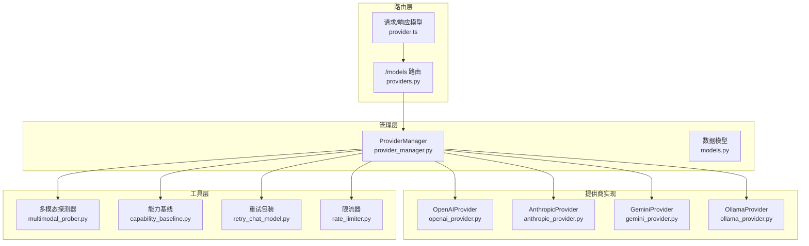
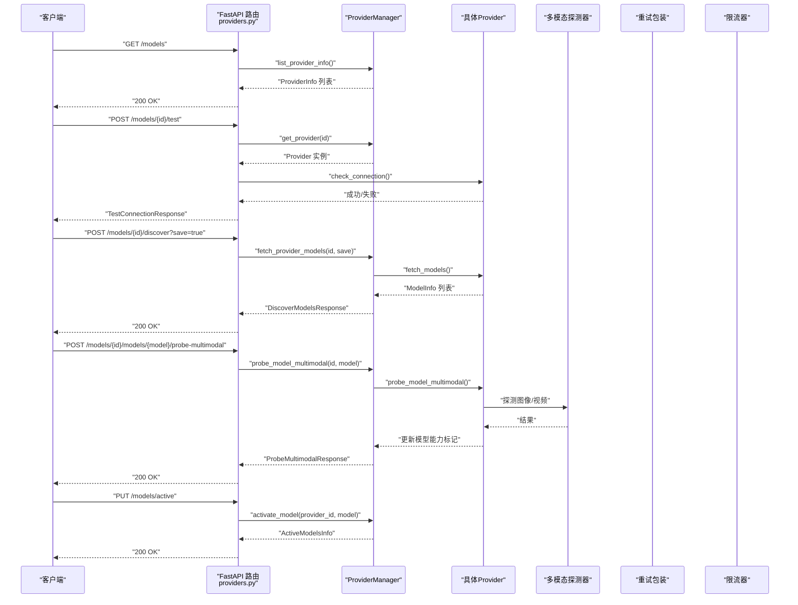
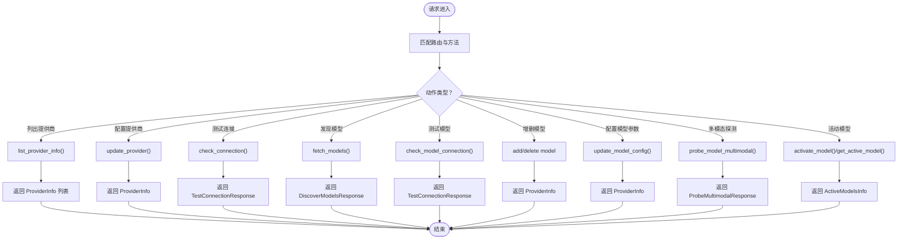
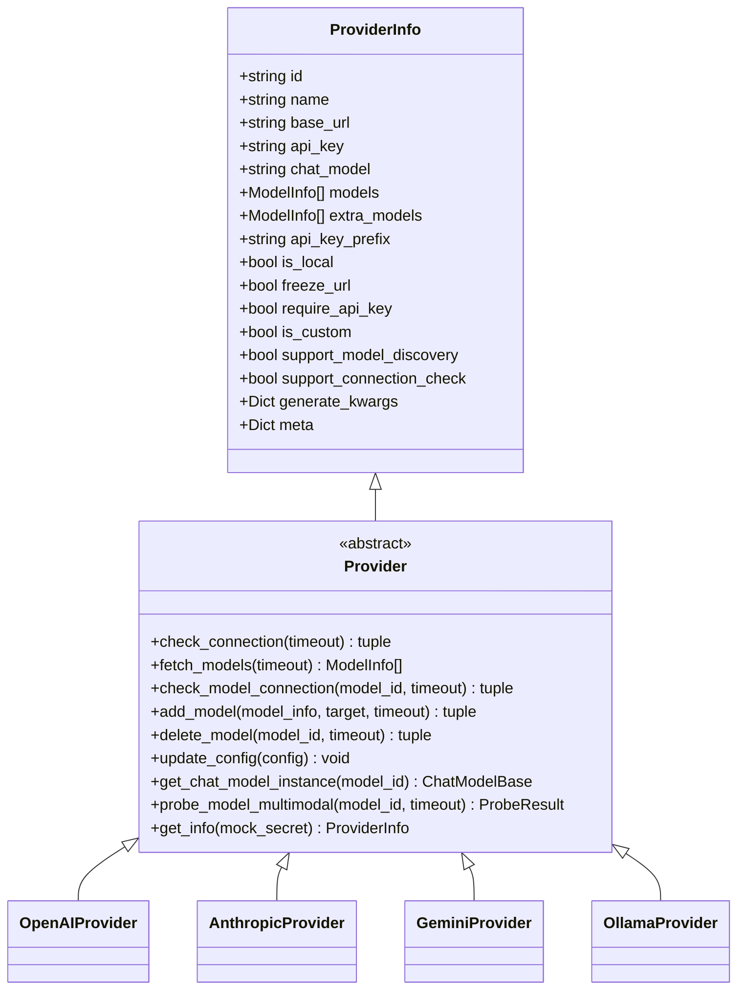
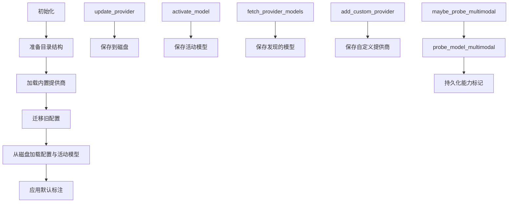
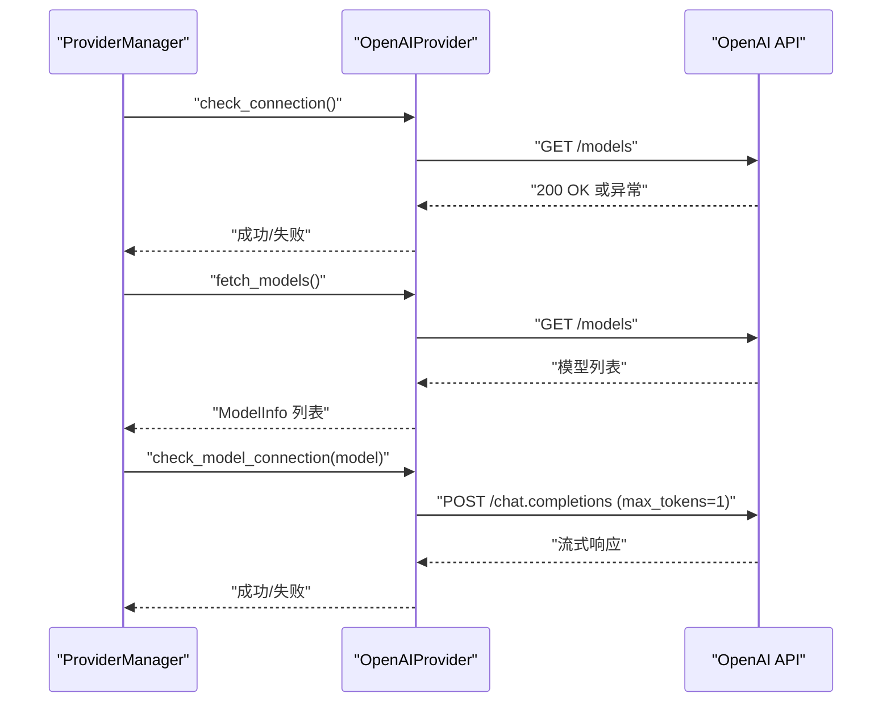
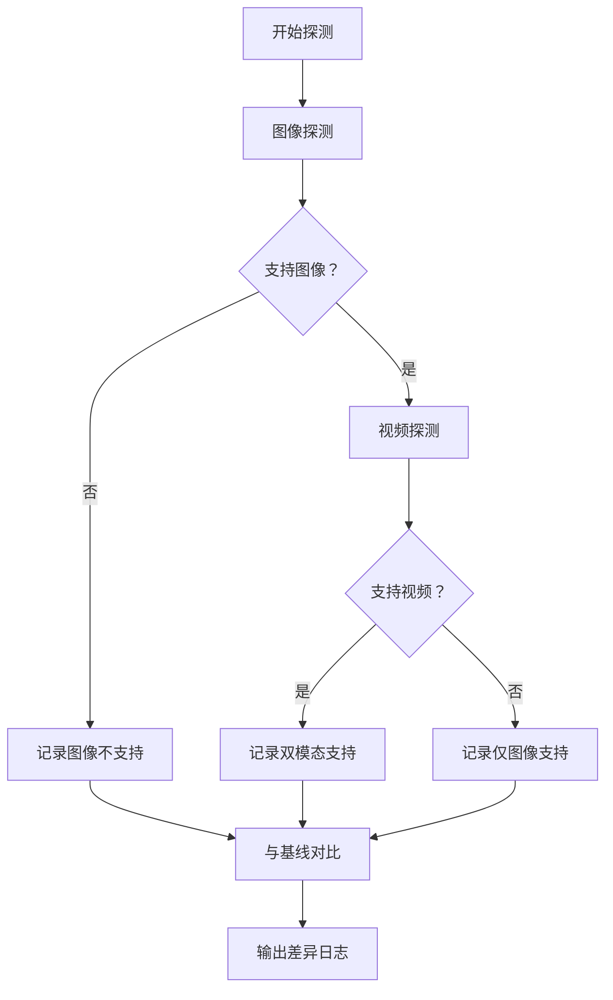
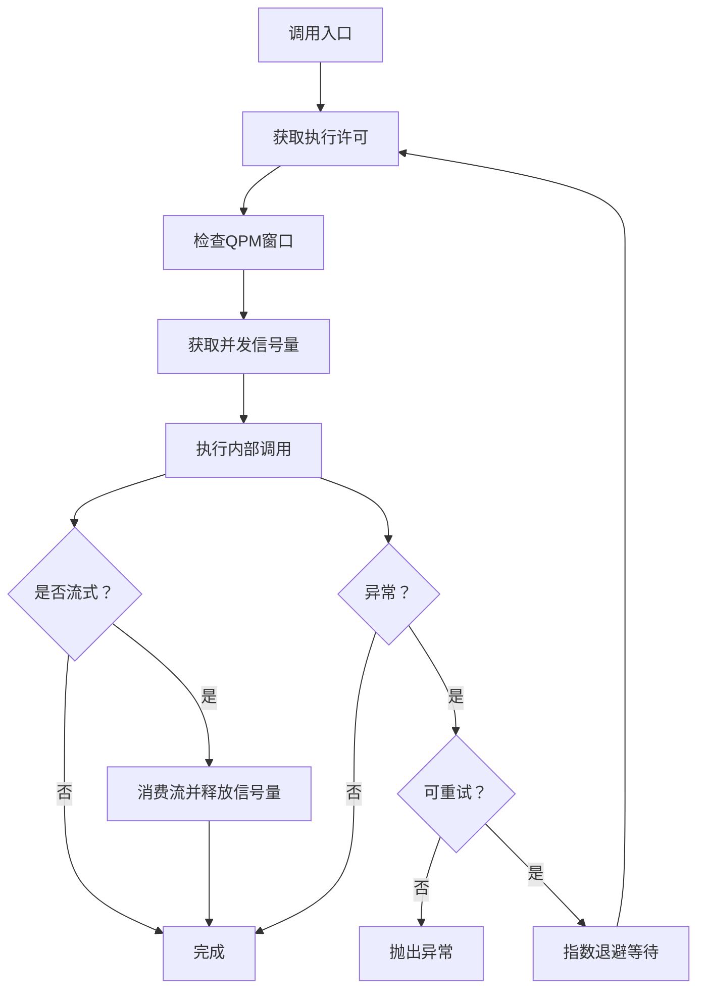
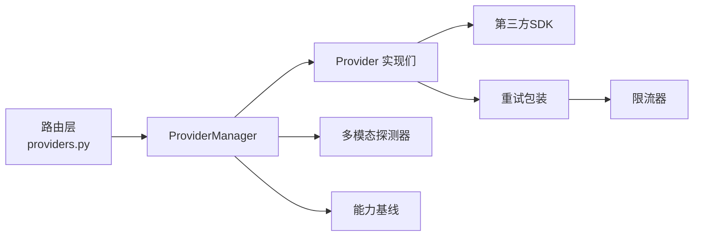

# 模型提供商API

<cite>
**本文档引用的文件**
- [src/qwenpaw/app/routers/providers.py](file://src/qwenpaw/app/routers/providers.py)
- [src/qwenpaw/providers/provider.py](file://src/qwenpaw/providers/provider.py)
- [src/qwenpaw/providers/provider_manager.py](file://src/qwenpaw/providers/provider_manager.py)
- [src/qwenpaw/providers/models.py](file://src/qwenpaw/providers/models.py)
- [src/qwenpaw/providers/openai_provider.py](file://src/qwenpaw/providers/openai_provider.py)
- [src/qwenpaw/providers/anthropic_provider.py](file://src/qwenpaw/providers/anthropic_provider.py)
- [src/qwenpaw/providers/gemini_provider.py](file://src/qwenpaw/providers/gemini_provider.py)
- [src/qwenpaw/providers/ollama_provider.py](file://src/qwenpaw/providers/ollama_provider.py)
- [src/qwenpaw/providers/multimodal_prober.py](file://src/qwenpaw/providers/multimodal_prober.py)
- [src/qwenpaw/providers/capability_baseline.py](file://src/qwenpaw/providers/capability_baseline.py)
- [src/qwenpaw/providers/retry_chat_model.py](file://src/qwenpaw/providers/retry_chat_model.py)
- [src/qwenpaw/providers/rate_limiter.py](file://src/qwenpaw/providers/rate_limiter.py)
- [src/qwenpaw/cli/providers_cmd.py](file://src/qwenpaw/cli/providers_cmd.py)
- [console/src/api/modules/provider.ts](file://console/src/api/modules/provider.ts)
</cite>

## 目录
1. [简介](#简介)
2. [项目结构](#项目结构)
3. [核心组件](#核心组件)
4. [架构总览](#架构总览)
5. [详细组件分析](#详细组件分析)
6. [依赖关系分析](#依赖关系分析)
7. [性能考虑](#性能考虑)
8. [故障排除指南](#故障排除指南)
9. [结论](#结论)
10. [附录](#附录)

## 简介
本文件为 QwenPaw 模型提供商管理API的完整RESTful API文档，覆盖以下主题：
- 提供商注册与配置（OpenAI、Anthropic、Gemini、Ollama等）
- 连接测试与可用性检测
- 能力探测（图像/视频多模态支持）
- 模型列表获取与动态发现
- 活动模型槽位管理（全局/代理特定）
- 错误诊断与连接优化
- 配置验证与最佳实践

该API通过FastAPI路由暴露，配合ProviderManager统一管理内置与自定义提供商，并提供细粒度的重试与限流机制以提升稳定性。

## 项目结构
后端采用分层设计：
- 路由层：FastAPI路由定义与请求响应模型
- 管理层：ProviderManager负责提供商生命周期、持久化与活动模型槽位
- 提供商实现层：针对不同平台的Provider子类（OpenAI、Anthropic、Gemini、Ollama）
- 工具层：能力基线、多模态探测器、重试与限流

**图表来源**
- [src/qwenpaw/app/routers/providers.py:1-634](file://src/qwenpaw/app/routers/providers.py#L1-L634)
- [src/qwenpaw/providers/provider_manager.py:670-1599](file://src/qwenpaw/providers/provider_manager.py#L670-L1599)
- [src/qwenpaw/providers/openai_provider.py:25-550](file://src/qwenpaw/providers/openai_provider.py#L25-L550)
- [src/qwenpaw/providers/anthropic_provider.py:27-256](file://src/qwenpaw/providers/anthropic_provider.py#L27-L256)
- [src/qwenpaw/providers/gemini_provider.py:27-332](file://src/qwenpaw/providers/gemini_provider.py#L27-L332)
- [src/qwenpaw/providers/ollama_provider.py:16-86](file://src/qwenpaw/providers/ollama_provider.py#L16-L86)
- [src/qwenpaw/providers/multimodal_prober.py:1-102](file://src/qwenpaw/providers/multimodal_prober.py#L1-L102)
- [src/qwenpaw/providers/capability_baseline.py:55-679](file://src/qwenpaw/providers/capability_baseline.py#L55-L679)
- [src/qwenpaw/providers/retry_chat_model.py:204-477](file://src/qwenpaw/providers/retry_chat_model.py#L204-L477)
- [src/qwenpaw/providers/rate_limiter.py:30-279](file://src/qwenpaw/providers/rate_limiter.py#L30-L279)

**章节来源**
- [src/qwenpaw/app/routers/providers.py:1-634](file://src/qwenpaw/app/routers/providers.py#L1-L634)
- [src/qwenpaw/providers/provider_manager.py:670-1599](file://src/qwenpaw/providers/provider_manager.py#L670-L1599)

## 核心组件
- Provider/ProviderInfo：抽象提供商定义与配置信息载体
- ProviderManager：提供商注册、持久化、活动模型槽位管理
- 具体提供商实现：OpenAI、Anthropic、Gemini、Ollama
- 多模态探测器：统一的图像/视频探测流程与结果
- 能力基线：官方文档标注与实际探测对比
- 重试与限流：透明重试与并发/速率控制

**章节来源**
- [src/qwenpaw/providers/provider.py:17-314](file://src/qwenpaw/providers/provider.py#L17-L314)
- [src/qwenpaw/providers/provider_manager.py:670-1599](file://src/qwenpaw/providers/provider_manager.py#L670-L1599)
- [src/qwenpaw/providers/multimodal_prober.py:75-102](file://src/qwenpaw/providers/multimodal_prober.py#L75-L102)
- [src/qwenpaw/providers/capability_baseline.py:20-90](file://src/qwenpaw/providers/capability_baseline.py#L20-L90)

## 架构总览
下图展示从HTTP请求到提供商调用的完整链路，包括能力探测与重试限流：

**图表来源**
- [src/qwenpaw/app/routers/providers.py:147-634](file://src/qwenpaw/app/routers/providers.py#L147-L634)
- [src/qwenpaw/providers/provider_manager.py:847-1098](file://src/qwenpaw/providers/provider_manager.py#L847-L1098)
- [src/qwenpaw/providers/openai_provider.py:57-125](file://src/qwenpaw/providers/openai_provider.py#L57-L125)
- [src/qwenpaw/providers/multimodal_prober.py:75-102](file://src/qwenpaw/providers/multimodal_prober.py#L75-L102)
- [src/qwenpaw/providers/retry_chat_model.py:204-477](file://src/qwenpaw/providers/retry_chat_model.py#L204-L477)
- [src/qwenpaw/providers/rate_limiter.py:70-151](file://src/qwenpaw/providers/rate_limiter.py#L70-L151)

## 详细组件分析

### 路由与端点定义
- 列出所有提供商：GET /models
- 配置提供商：PUT /models/{provider_id}/config
- 测试提供商连接：POST /models/{provider_id}/test
- 发现可用模型：POST /models/{provider_id}/discover?save=true
- 测试指定模型：POST /models/{provider_id}/models/test
- 添加/删除模型：POST /models/{provider_id}/models, DELETE /models/{provider_id}/models/{model_id}
- 配置模型参数：PUT /models/{provider_id}/models/{model_id}/config
- 多模态探测：POST /models/{provider_id}/models/{model_id}/probe-multimodal
- 获取/设置活动模型：GET/PUT /models/active

**图表来源**
- [src/qwenpaw/app/routers/providers.py:147-634](file://src/qwenpaw/app/routers/providers.py#L147-L634)

**章节来源**
- [src/qwenpaw/app/routers/providers.py:147-634](file://src/qwenpaw/app/routers/providers.py#L147-L634)

### Provider 抽象与数据模型
- ModelInfo：模型标识、名称、多模态支持标记、探测来源、生成参数覆盖
- ProviderInfo/Provider：提供商标识、名称、基础URL、API密钥、聊天模型类名、模型列表、附加模型、前缀、本地/冻结URL/需要密钥、模型发现/连接检查支持、生成参数、元数据
- Provider 抽象方法：check_connection、fetch_models、check_model_connection、add_model/delete_model、update_config、get_chat_model_instance、probe_model_multimodal、get_info

**图表来源**
- [src/qwenpaw/providers/provider.py:17-314](file://src/qwenpaw/providers/provider.py#L17-L314)
- [src/qwenpaw/providers/openai_provider.py:25-550](file://src/qwenpaw/providers/openai_provider.py#L25-L550)
- [src/qwenpaw/providers/anthropic_provider.py:27-256](file://src/qwenpaw/providers/anthropic_provider.py#L27-L256)
- [src/qwenpaw/providers/gemini_provider.py:27-332](file://src/qwenpaw/providers/gemini_provider.py#L27-L332)
- [src/qwenpaw/providers/ollama_provider.py:16-86](file://src/qwenpaw/providers/ollama_provider.py#L16-L86)

**章节来源**
- [src/qwenpaw/providers/provider.py:17-314](file://src/qwenpaw/providers/provider.py#L17-L314)

### ProviderManager 管理逻辑
- 初始化：准备目录、加载内置提供商、迁移旧配置、从磁盘恢复配置与活动模型
- 更新提供商：update_provider（持久化）、激活模型 activate_model、保存/清除活动模型
- 模型发现：fetch_provider_models（可选保存）
- 自定义提供商：add_custom_provider/remove_custom_provider
- 多模态探测：probe_model_multimodal（持久化更新），自动探测 maybe_probe_multimodal
- 插件提供商注册：register_plugin_provider
- 安全存储：敏感字段加密/解密、权限设置

**图表来源**
- [src/qwenpaw/providers/provider_manager.py:696-1599](file://src/qwenpaw/providers/provider_manager.py#L696-L1599)

**章节来源**
- [src/qwenpaw/providers/provider_manager.py:696-1599](file://src/qwenpaw/providers/provider_manager.py#L696-L1599)

### OpenAI 兼容提供商
- 连接检查：调用 models.list
- 模型发现：解析 models.list 响应
- 模型连接测试：发送最小文本请求并消费流
- 多模态探测：图像/视频探测，带语义校验避免静默接受
- 聊天模型实例：OpenAIChatModelCompat

**图表来源**
- [src/qwenpaw/providers/openai_provider.py:57-125](file://src/qwenpaw/providers/openai_provider.py#L57-L125)

**章节来源**
- [src/qwenpaw/providers/openai_provider.py:57-125](file://src/qwenpaw/providers/openai_provider.py#L57-L125)

### Anthropic 提供商
- 连接检查：调用 models.list
- 模型发现：解析响应数据
- 模型连接测试：messages.create 并消费流
- 多模态探测：仅图像探测（不支持视频）

**章节来源**
- [src/qwenpaw/providers/anthropic_provider.py:66-127](file://src/qwenpaw/providers/anthropic_provider.py#L66-L127)

### Gemini 提供商
- 连接检查：异步 models.list
- 模型发现：异步遍历并标准化模型名
- 模型连接测试：generate_content_stream
- 多模态探测：图像/视频探测，使用 inline_data/file_data

**章节来源**
- [src/qwenpaw/providers/gemini_provider.py:68-131](file://src/qwenpaw/providers/gemini_provider.py#L68-L131)

### Ollama 提供商
- 适配OpenAI兼容端点：自动规范化URL（去除末尾/v1）
- 不支持手动增删模型：需通过Ollama CLI管理
- 聊天模型实例：OpenAIChatModelCompat

**章节来源**
- [src/qwenpaw/providers/ollama_provider.py:16-86](file://src/qwenpaw/providers/ollama_provider.py#L16-L86)

### 多模态探测与能力基线
- 探测器：统一的图像/视频探测常量与结果结构
- 基线：按提供商与模型记录期望能力（文档标注）
- 对比：将探测结果与基线对比，输出差异日志

**图表来源**
- [src/qwenpaw/providers/multimodal_prober.py:75-102](file://src/qwenpaw/providers/multimodal_prober.py#L75-L102)
- [src/qwenpaw/providers/capability_baseline.py:604-679](file://src/qwenpaw/providers/capability_baseline.py#L604-L679)

**章节来源**
- [src/qwenpaw/providers/multimodal_prober.py:75-102](file://src/qwenpaw/providers/multimodal_prober.py#L75-L102)
- [src/qwenpaw/providers/capability_baseline.py:604-679](file://src/qwenpaw/providers/capability_baseline.py#L604-L679)

### 重试与限流
- 重试策略：指数退避、最大重试次数、可重试状态码与异常类型
- 限流策略：并发信号量、QPM滑动窗口、全局429暂停与抖动
- 包装器：RetryChatModel在每次调用前后管理信号量与重试

**图表来源**
- [src/qwenpaw/providers/retry_chat_model.py:269-477](file://src/qwenpaw/providers/retry_chat_model.py#L269-L477)
- [src/qwenpaw/providers/rate_limiter.py:70-151](file://src/qwenpaw/providers/rate_limiter.py#L70-L151)

**章节来源**
- [src/qwenpaw/providers/retry_chat_model.py:269-477](file://src/qwenpaw/providers/retry_chat_model.py#L269-L477)
- [src/qwenpaw/providers/rate_limiter.py:70-151](file://src/qwenpaw/providers/rate_limiter.py#L70-L151)

## 依赖关系分析
- 路由依赖 ProviderManager 提供统一管理
- 具体Provider实现依赖对应SDK（OpenAI、Anthropic、Google GenAI）
- 多模态探测器与能力基线被ProviderManager用于能力标注与对比
- 重试与限流作为通用中间件应用于聊天模型实例

**图表来源**
- [src/qwenpaw/app/routers/providers.py:1-634](file://src/qwenpaw/app/routers/providers.py#L1-L634)
- [src/qwenpaw/providers/provider_manager.py:670-1599](file://src/qwenpaw/providers/provider_manager.py#L670-L1599)
- [src/qwenpaw/providers/retry_chat_model.py:204-477](file://src/qwenpaw/providers/retry_chat_model.py#L204-L477)
- [src/qwenpaw/providers/rate_limiter.py:30-279](file://src/qwenpaw/providers/rate_limiter.py#L30-L279)

**章节来源**
- [src/qwenpaw/app/routers/providers.py:1-634](file://src/qwenpaw/app/routers/providers.py#L1-L634)
- [src/qwenpaw/providers/provider_manager.py:670-1599](file://src/qwenpaw/providers/provider_manager.py#L670-L1599)

## 性能考虑
- 并发控制：通过信号量限制同时进行的请求，避免上游限流或过载
- QPM滑动窗口：在分钟级维度控制请求速率，减少突发流量
- 429协调：当收到429时设置全局暂停时间，配合抖动分散唤醒时间
- 指数退避：对瞬时错误进行指数退避重试，降低雪崩风险
- 流式响应：在流式场景中尽早释放信号量，避免长时间占用

[本节为通用指导，无需特定文件引用]

## 故障排除指南
- 连接失败
  - 检查 base_url 与网络连通性
  - 确认 API 密钥格式与前缀（如 sk-）
  - 使用 /models/{id}/test 进行快速验证
- 模型不可用
  - 使用 /models/{id}/models/test 验证具体模型
  - 若为自定义提供商，可能不支持连接检查
- 多模态探测异常
  - 某些提供商对媒体关键字有严格限制，会直接拒绝
  - 探测器包含语义校验，避免“静默接受”导致的误判
- 限流与重试
  - 观察限流器统计信息，调整并发与QPM配置
  - 对于429，优先遵循Retry-After头或默认暂停时间

**章节来源**
- [src/qwenpaw/providers/openai_provider.py:269-294](file://src/qwenpaw/providers/openai_provider.py#L269-L294)
- [src/qwenpaw/providers/anthropic_provider.py:233-255](file://src/qwenpaw/providers/anthropic_provider.py#L233-L255)
- [src/qwenpaw/providers/gemini_provider.py:309-331](file://src/qwenpaw/providers/gemini_provider.py#L309-L331)
- [src/qwenpaw/providers/retry_chat_model.py:124-140](file://src/qwenpaw/providers/retry_chat_model.py#L124-L140)
- [src/qwenpaw/providers/rate_limiter.py:152-174](file://src/qwenpaw/providers/rate_limiter.py#L152-L174)

## 结论
本API提供了统一、可扩展的模型提供商管理能力，覆盖从配置、连接测试、模型发现到多模态探测与活动模型管理的完整闭环。通过ProviderManager与具体Provider实现的分离，系统既支持内置提供商（OpenAI、Anthropic、Gemini、Ollama等），也允许用户添加自定义提供商。结合重试与限流机制，可在复杂网络环境下保持稳定与高效。

[本节为总结性内容，无需特定文件引用]

## 附录

### API 端点一览（摘要）
- GET /models：列出所有提供商
- PUT /models/{provider_id}/config：配置提供商（base_url、api_key、chat_model、generate_kwargs）
- POST /models/{provider_id}/test：测试提供商连接
- POST /models/{provider_id}/discover?save=true：发现可用模型
- POST /models/{provider_id}/models/test：测试指定模型
- POST /models/{provider_id}/models：添加模型
- DELETE /models/{provider_id}/models/{model_id}：删除模型
- PUT /models/{provider_id}/models/{model_id}/config：配置模型参数
- POST /models/{provider_id}/models/{model_id}/probe-multimodal：探测多模态能力
- GET /models/active：获取当前有效模型（支持作用域：effective/global/agent）
- PUT /models/active：设置活动模型（支持作用域：global/agent）

**章节来源**
- [src/qwenpaw/app/routers/providers.py:147-634](file://src/qwenpaw/app/routers/providers.py#L147-L634)

### 配置参数与认证方式
- OpenAI/兼容：支持 api_key 前缀（如 sk-），可配置 base_url；部分提供商冻结URL
- Anthropic：支持 api_key 前缀（如 sk-ant-），使用 AnthropicChatModel
- Gemini：使用 GeminiChatModel，支持模型发现
- Ollama：本地托管，通常不需要API密钥；自动规范化URL至 /v1

**章节来源**
- [src/qwenpaw/providers/openai_provider.py:25-550](file://src/qwenpaw/providers/openai_provider.py#L25-L550)
- [src/qwenpaw/providers/anthropic_provider.py:27-256](file://src/qwenpaw/providers/anthropic_provider.py#L27-L256)
- [src/qwenpaw/providers/gemini_provider.py:27-332](file://src/qwenpaw/providers/gemini_provider.py#L27-L332)
- [src/qwenpaw/providers/ollama_provider.py:16-86](file://src/qwenpaw/providers/ollama_provider.py#L16-L86)

### 最佳实践
- 在生产环境启用重试与限流，合理设置并发与QPM
- 使用 /models/{id}/discover 动态获取最新模型列表
- 对多模态需求明确的场景，先执行 /probe-multimodal 再选择模型
- 自定义提供商建议禁用连接检查（避免UI误判），但保留模型发现能力
- 定期清理未使用的模型与提供商，减少配置复杂度

[本节为通用指导，无需特定文件引用]