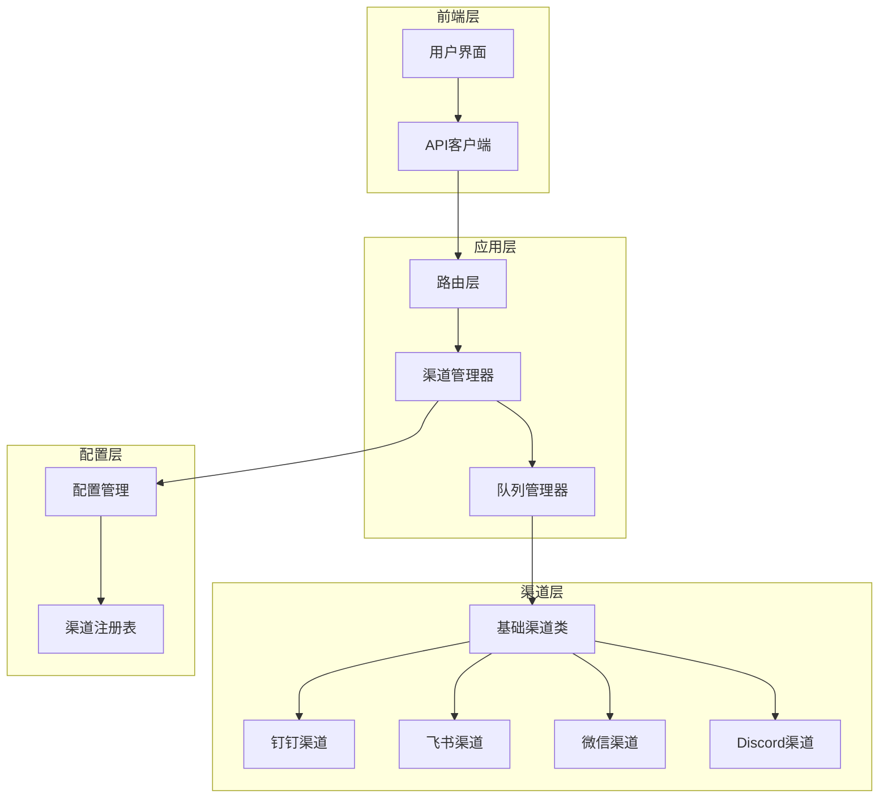
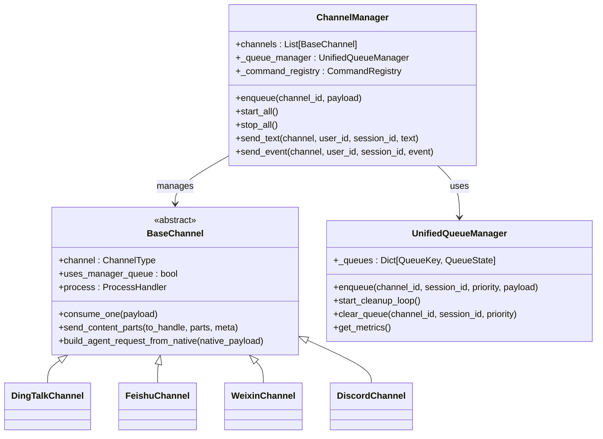
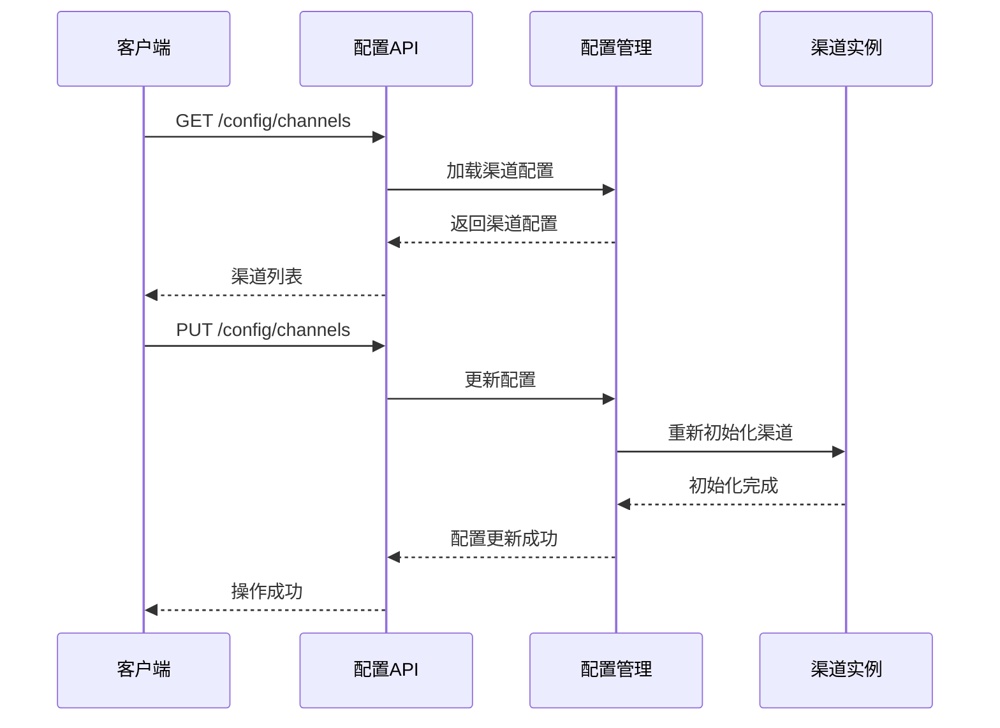
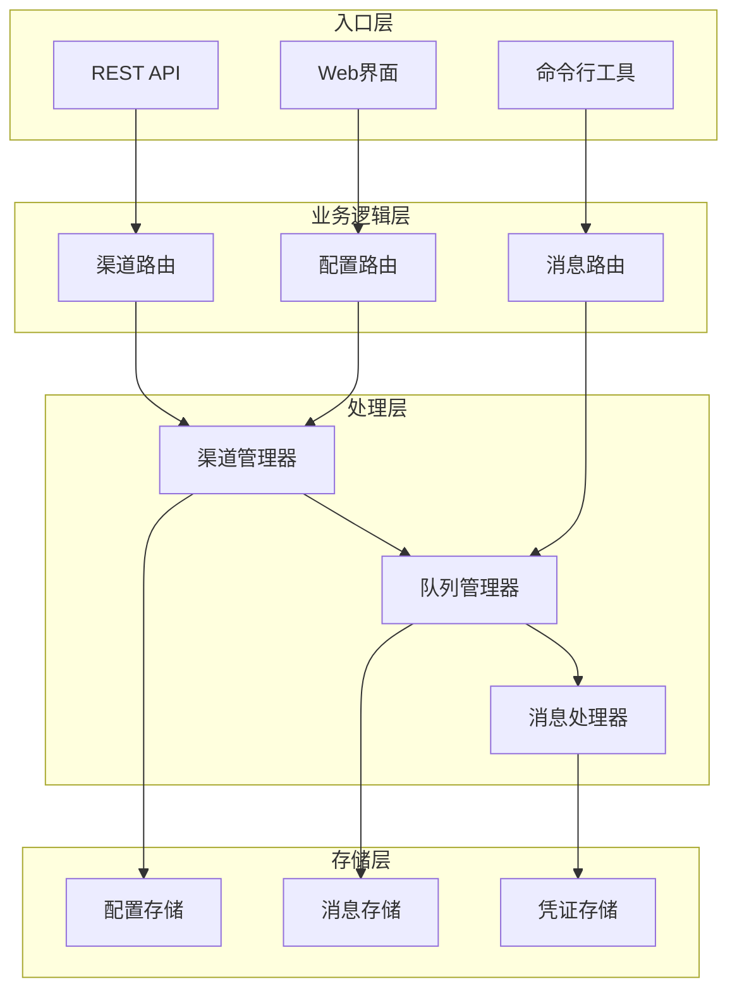
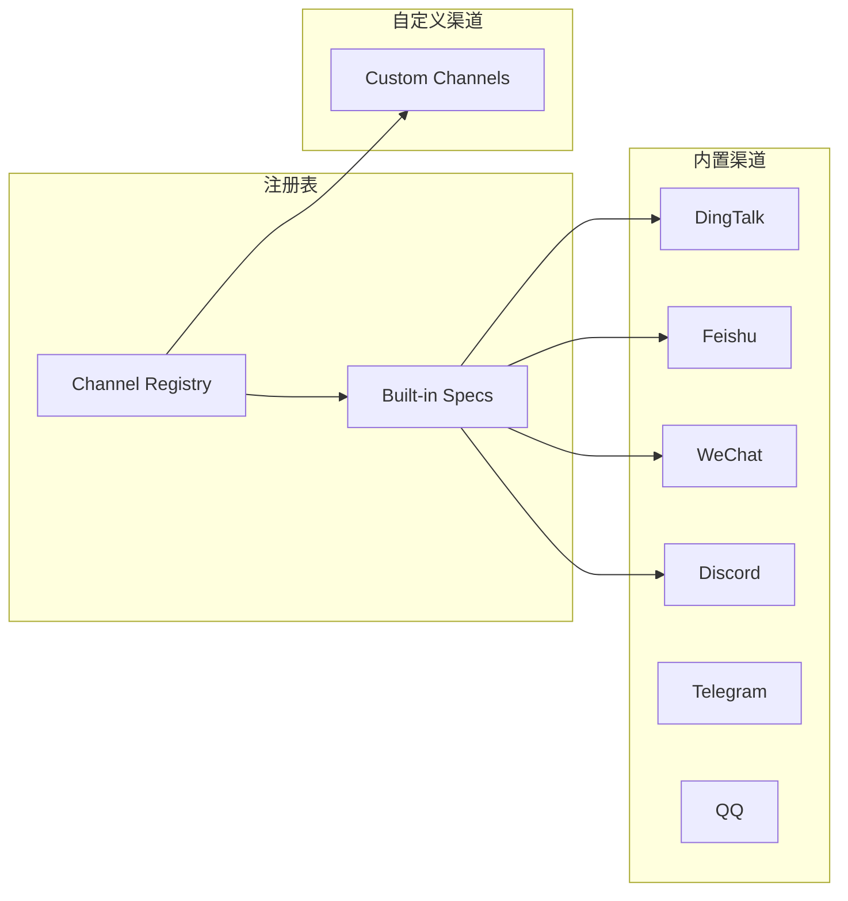
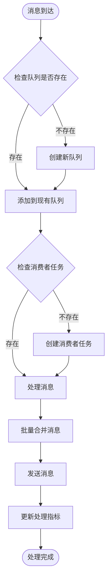

# 渠道管理API

<cite>
**本文档引用的文件**
- [channel.ts](file://console/src/api/modules/channel.ts)
- [config.ts](file://src/qwenpaw/app/routers/config.py)
- [manager.py](file://src/qwenpaw/app/channels/manager.py)
- [base.py](file://src/qwenpaw/app/channels/base.py)
- [schema.py](file://src/qwenpaw/app/channels/schema.py)
- [registry.py](file://src/qwenpaw/app/channels/registry.py)
- [unified_queue_manager.py](file://src/qwenpaw/app/channels/unified_queue_manager.py)
- [channel.py](file://src/qwenpaw/app/channels/dingtalk/channel.py)
- [channel.py](file://src/qwenpaw/app/channels/feishu/channel.py)
- [channel.py](file://src/qwenpaw/app/channels/weixin/channel.py)
- [channel.py](file://src/qwenpaw/app/channels/discord_/channel.py)
</cite>

## 目录
1. [简介](#简介)
2. [项目结构](#项目结构)
3. [核心组件](#核心组件)
4. [架构概览](#架构概览)
5. [详细组件分析](#详细组件分析)
6. [依赖关系分析](#依赖关系分析)
7. [性能考虑](#性能考虑)
8. [故障排除指南](#故障排除指南)
9. [结论](#结论)

## 简介

QwenPaw渠道管理API是一个基于FastAPI构建的RESTful API系统，用于管理各种即时通讯渠道的配置和通信。该系统支持多种主流渠道，包括钉钉、飞书、微信、Discord等，并提供了统一的渠道抽象层来处理不同类型的消息格式和认证方式。

该API系统的核心特性包括：
- 统一的渠道配置管理
- 实时消息路由和处理
- 支持多种消息类型（文本、图片、音频、视频、文件）
- 渠道认证和授权管理
- 连接状态监控和重连机制
- 批量操作和权限控制

## 项目结构

QwenPaw采用模块化架构设计，主要分为以下几个层次：

**图表来源**
- [config.ts:1-644](file://src/qwenpaw/app/routers/config.py#L1-L644)
- [manager.py:1-711](file://src/qwenpaw/app/channels/manager.py#L1-L711)
- [base.py:1-800](file://src/qwenpaw/app/channels/base.py#L1-L800)

**章节来源**
- [config.ts:1-644](file://src/qwenpaw/app/routers/config.py#L1-L644)
- [manager.py:1-711](file://src/qwenpaw/app/channels/manager.py#L1-L711)

## 核心组件

### 渠道管理器 (ChannelManager)

ChannelManager是整个渠道系统的中枢控制器，负责管理所有渠道实例并协调消息处理流程。

**图表来源**
- [manager.py:68-711](file://src/qwenpaw/app/channels/manager.py#L68-L711)
- [base.py:70-800](file://src/qwenpaw/app/channels/base.py#L70-L800)
- [unified_queue_manager.py:60-498](file://src/qwenpaw/app/channels/unified_queue_manager.py#L60-L498)

### 渠道配置系统

系统支持动态渠道配置管理，通过统一的配置接口管理所有渠道的设置。

**图表来源**
- [config.ts:64-141](file://src/qwenpaw/app/routers/config.py#L64-L141)

**章节来源**
- [manager.py:68-711](file://src/qwenpaw/app/channels/manager.py#L68-L711)
- [base.py:70-800](file://src/qwenpaw/app/channels/base.py#L70-L800)
- [config.ts:64-141](file://src/qwenpaw/app/routers/config.py#L64-L141)

## 架构概览

QwenPaw的渠道管理架构采用了事件驱动的设计模式，通过异步队列系统实现高并发的消息处理能力。

**图表来源**
- [config.ts:1-644](file://src/qwenpaw/app/routers/config.py#L1-L644)
- [manager.py:1-711](file://src/qwenpaw/app/channels/manager.py#L1-L711)
- [unified_queue_manager.py:1-498](file://src/qwenpaw/app/channels/unified_queue_manager.py#L1-L498)

## 详细组件分析

### 渠道配置API

#### 基础配置管理

系统提供了完整的渠道配置管理接口，支持渠道的增删改查操作。

**GET /config/channels/types**
- 功能：获取所有可用的渠道类型
- 返回：渠道类型数组
- 示例：`["dingtalk", "feishu", "wechat", "discord"]`

**GET /config/channels**
- 功能：获取所有渠道的配置
- 返回：渠道配置对象
- 示例：包含每个渠道的启用状态、认证信息等

**PUT /config/channels**
- 功能：批量更新所有渠道配置
- 请求体：完整的渠道配置对象
- 响应：更新后的配置

**GET /config/channels/{channel_name}**
- 功能：获取指定渠道的配置
- 参数：channel_name（渠道名称）
- 返回：单个渠道的配置

**PUT /config/channels/{channel_name}**
- 功能：更新指定渠道的配置
- 参数：channel_name（渠道名称）
- 请求体：渠道配置对象

**章节来源**
- [config.ts:64-283](file://src/qwenpaw/app/routers/config.py#L64-L283)

### 渠道认证API

#### 二维码登录支持

系统为需要二维码登录的渠道提供了统一的认证接口。

**GET /config/channels/{channel}/qrcode**
- 功能：获取渠道认证二维码
- 参数：channel（渠道名称）
- 返回：包含二维码图像和轮询令牌的对象

**GET /config/channels/{channel}/qrcode/status**
- 功能：轮询认证状态
- 参数：channel（渠道名称）、token（轮询令牌）
- 返回：认证状态和凭证信息

**章节来源**
- [config.ts:146-187](file://src/qwenpaw/app/routers/config.py#L146-L187)

### 渠道消息发送API

#### 文本消息发送

系统提供了统一的文本消息发送接口，支持所有已配置的渠道。

**POST /messages/send**
- 功能：向指定渠道发送文本消息
- 请求体：包含目标渠道、接收者、消息内容等信息
- 响应：发送结果和消息ID

#### 多媒体消息发送

系统支持发送包含图片、音频、视频、文件等多媒体内容的消息。

**POST /messages/send-media**
- 功能：发送多媒体消息
- 请求体：包含媒体文件URL或本地路径
- 响应：媒体处理结果

**章节来源**
- [manager.py:630-711](file://src/qwenpaw/app/channels/manager.py#L630-L711)

### 渠道状态监控

#### 连接状态管理

系统提供了渠道连接状态的实时监控和管理功能。

**GET /channels/status**
- 功能：获取所有渠道的连接状态
- 返回：每个渠道的状态信息（在线/离线、最后活动时间等）

**GET /channels/{channel}/metrics**
- 功能：获取指定渠道的性能指标
- 参数：channel（渠道名称）
- 返回：处理统计、队列长度、错误率等指标

**章节来源**
- [unified_queue_manager.py:430-498](file://src/qwenpaw/app/channels/unified_queue_manager.py#L430-L498)

## 依赖关系分析

### 渠道注册系统

系统通过注册表机制管理所有可用的渠道类型，支持内置渠道和自定义渠道的扩展。

**图表来源**
- [registry.py:20-36](file://src/qwenpaw/app/channels/registry.py#L20-L36)
- [registry.py:190-195](file://src/qwenpaw/app/channels/registry.py#L190-L195)

### 渠道类型定义

系统使用统一的渠道类型标识符来确保不同渠道的一致性。

**内置渠道类型**：
- `imessage` - Apple Messages
- `discord` - Discord聊天平台
- `dingtalk` - 钉钉企业级通讯
- `feishu` - 飞书多维协作平台
- `qq` - QQ互联
- `telegram` - Telegram即时通讯
- `mattermost` - Mattermost团队协作
- `mqtt` - MQTT消息传输协议
- `console` - 控制台调试通道
- `matrix` - Matrix去中心化通讯
- `voice` - 语音通话渠道
- `wecom` - 企业微信
- `xiaoyi` - 小艺助手
- `weixin` - 微信iLink Bot
- `onebot` - OneBot标准协议

**章节来源**
- [schema.py:31-42](file://src/qwenpaw/app/channels/schema.py#L31-L42)
- [registry.py:20-36](file://src/qwenpaw/app/channels/registry.py#L20-L36)

## 性能考虑

### 队列管理系统

系统采用统一的队列管理器来处理高并发消息，确保消息的有序处理和资源的有效利用。

**图表来源**
- [unified_queue_manager.py:119-164](file://src/qwenpaw/app/channels/unified_queue_manager.py#L119-L164)

### 消息处理优化

系统实现了多种优化策略来提高消息处理效率：

1. **批量处理**：自动合并同一会话中的连续消息
2. **去重机制**：防止重复消息的处理
3. **超时控制**：避免队列阻塞和内存泄漏
4. **资源清理**：自动清理空闲队列和过期资源

**章节来源**
- [unified_queue_manager.py:376-428](file://src/qwenpaw/app/channels/unified_queue_manager.py#L376-L428)

## 故障排除指南

### 常见问题诊断

#### 渠道连接失败

**症状**：渠道无法正常接收或发送消息
**可能原因**：
1. 认证信息过期或错误
2. 网络连接问题
3. API配额限制
4. 渠道权限不足

**解决步骤**：
1. 验证渠道配置的正确性
2. 检查网络连接状态
3. 重新生成或刷新认证令牌
4. 确认渠道权限设置

#### 消息延迟

**症状**：消息发送延迟或处理缓慢
**可能原因**：
1. 队列积压
2. 网络延迟
3. API限流
4. 资源不足

**解决步骤**：
1. 检查队列长度和处理指标
2. 优化网络配置
3. 调整API调用频率
4. 增加系统资源

#### 权限问题

**症状**：消息被拒绝或无法发送
**可能原因**：
1. 用户不在允许列表中
2. 群组权限限制
3. 机器人权限不足
4. 内容审核拦截

**解决步骤**：
1. 检查允许列表配置
2. 验证群组权限设置
3. 确认机器人权限范围
4. 审核内容合规性

### 日志和监控

系统提供了全面的日志记录和监控功能，帮助快速定位和解决问题。

**关键日志级别**：
- **DEBUG**：详细的操作跟踪和调试信息
- **INFO**：正常的系统操作和状态信息
- **WARNING**：潜在问题和异常情况
- **ERROR**：严重错误和故障

**监控指标**：
- 渠道连接状态
- 消息处理吞吐量
- 队列长度和等待时间
- 错误率和重试次数
- 资源使用情况

**章节来源**
- [manager.py:320-348](file://src/qwenpaw/app/channels/manager.py#L320-L348)
- [unified_queue_manager.py:430-498](file://src/qwenpaw/app/channels/unified_queue_manager.py#L430-L498)

## 结论

QwenPaw渠道管理API提供了一个功能完整、可扩展的渠道管理解决方案。通过统一的API接口和灵活的架构设计，系统能够有效管理多种即时通讯渠道，满足不同场景下的消息传递需求。

**主要优势**：
1. **统一接口**：提供一致的API体验，简化多渠道管理
2. **高可用性**：内置重连机制和故障恢复能力
3. **高性能**：异步处理和队列管理确保高并发性能
4. **可扩展性**：支持自定义渠道的轻松集成
5. **安全性**：完善的权限控制和认证机制

**适用场景**：
- 企业级多渠道客服系统
- 自动化消息推送平台
- 跨平台即时通讯解决方案
- 智能机器人消息管理

通过合理配置和使用，QwenPaw渠道管理API能够为企业提供稳定可靠的消息传递服务，提升用户体验和工作效率。