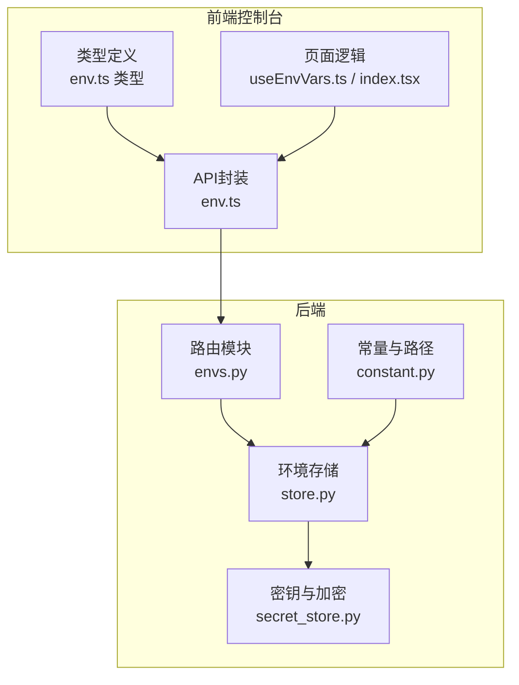
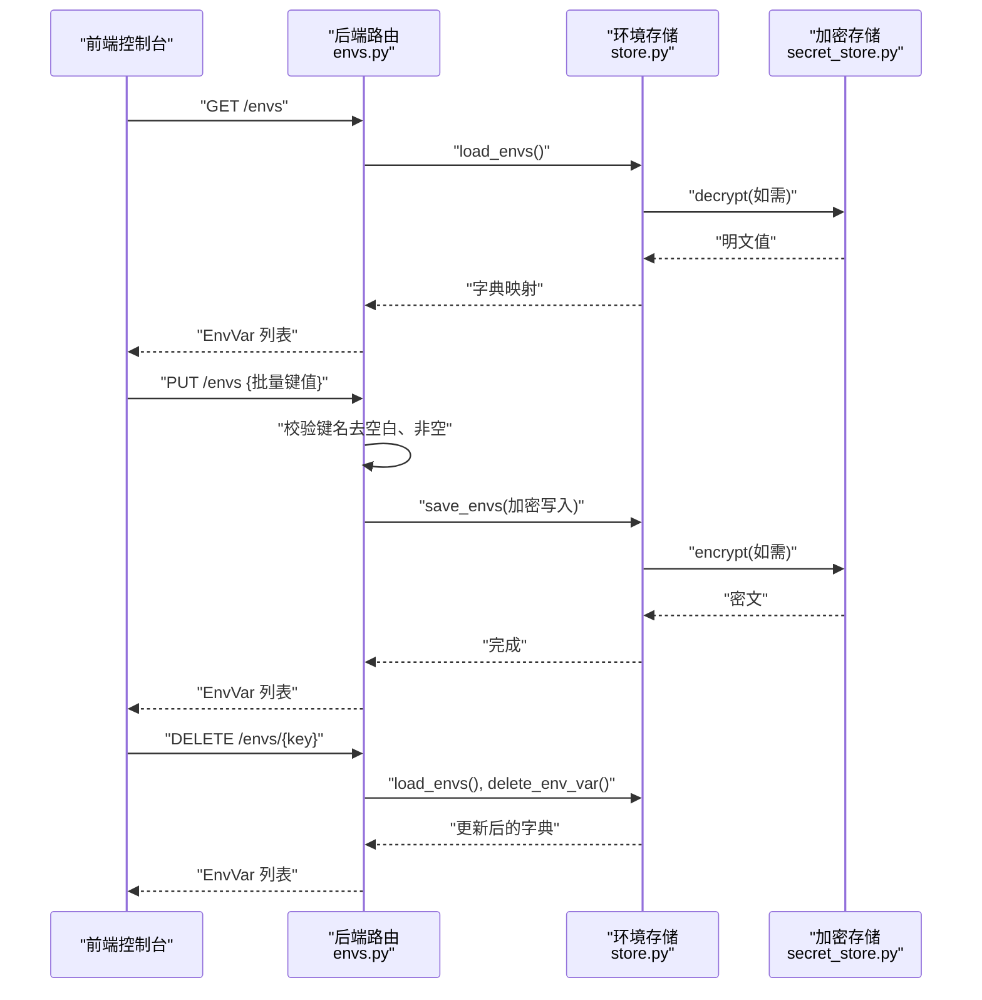
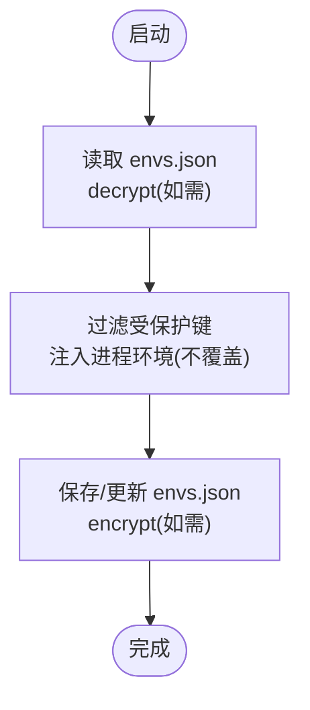
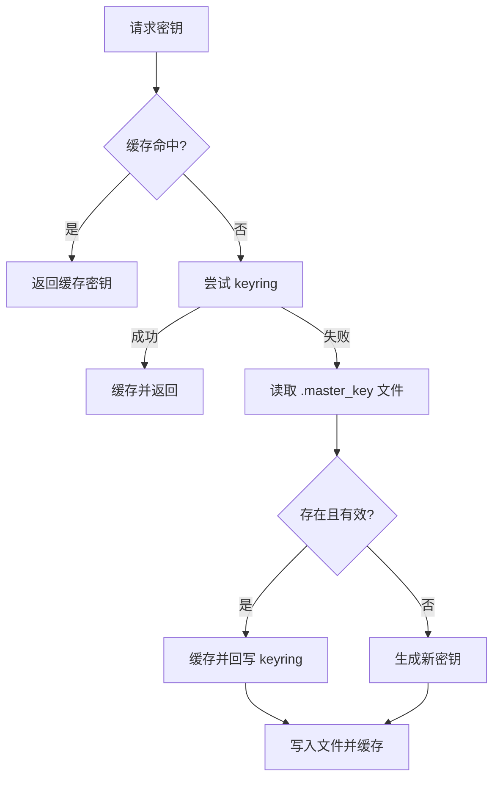
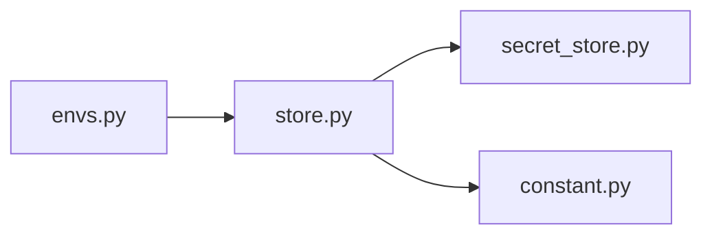

# 环境变量API

<cite>
**本文引用的文件**
- [src/qwenpaw/app/routers/envs.py](file://src/qwenpaw/app/routers/envs.py)
- [src/qwenpaw/envs/store.py](file://src/qwenpaw/envs/store.py)
- [src/qwenpaw/security/secret_store.py](file://src/qwenpaw/security/secret_store.py)
- [src/qwenpaw/constant.py](file://src/qwenpaw/constant.py)
- [console/src/api/modules/env.ts](file://console/src/api/modules/env.ts)
- [console/src/api/types/env.ts](file://console/src/api/types/env.ts)
- [console/src/pages/Settings/Environments/useEnvVars.ts](file://console/src/pages/Settings/Environments/useEnvVars.ts)
- [console/src/pages/Settings/Environments/index.tsx](file://console/src/pages/Settings/Environments/index.tsx)
</cite>

## 目录
1. [简介](#简介)
2. [项目结构](#项目结构)
3. [核心组件](#核心组件)
4. [架构总览](#架构总览)
5. [详细组件分析](#详细组件分析)
6. [依赖分析](#依赖分析)
7. [性能考虑](#性能考虑)
8. [故障排查指南](#故障排查指南)
9. [结论](#结论)
10. [附录](#附录)

## 简介
本文件为 QwenPaw 环境变量管理的 RESTful API 文档，覆盖以下能力与规范：
- 增删改查：列出、批量保存、删除单个环境变量
- 批量操作：全量替换所有环境变量
- 加密存储：对敏感值进行透明加解密与持久化
- 运行时注入：启动时将非受保护变量注入到进程环境
- 命名规范与校验：键名合法性、重复性检查
- 作用域与继承：受保护键不注入进程；支持按工作区/代理隔离（通过工作区目录与服务管理）
- 安全策略：主密钥管理、密文前缀、容器/CI 兼容策略
- 配置分离：开发/测试/生产环境可通过不同目录与密钥策略实现隔离

## 项目结构
围绕环境变量 API 的关键文件分布如下：
- 后端路由与模型定义：src/qwenpaw/app/routers/envs.py
- 存储与运行时注入：src/qwenpaw/envs/store.py
- 加密存储层：src/qwenpaw/security/secret_store.py
- 环境变量加载器与路径：src/qwenpaw/constant.py
- 控制台前端 API 封装与使用：console/src/api/modules/env.ts、console/src/api/types/env.ts、console/src/pages/Settings/Environments/useEnvVars.ts、console/src/pages/Settings/Environments/index.tsx

图表来源
- [src/qwenpaw/app/routers/envs.py:1-81](file://src/qwenpaw/app/routers/envs.py#L1-L81)
- [src/qwenpaw/envs/store.py:1-263](file://src/qwenpaw/envs/store.py#L1-L263)
- [src/qwenpaw/security/secret_store.py:1-291](file://src/qwenpaw/security/secret_store.py#L1-L291)
- [src/qwenpaw/constant.py:1-307](file://src/qwenpaw/constant.py#L1-L307)
- [console/src/api/modules/env.ts:1-19](file://console/src/api/modules/env.ts#L1-L19)
- [console/src/api/types/env.ts:1-5](file://console/src/api/types/env.ts#L1-L5)
- [console/src/pages/Settings/Environments/useEnvVars.ts:1-34](file://console/src/pages/Settings/Environments/useEnvVars.ts#L1-L34)
- [console/src/pages/Settings/Environments/index.tsx:30-228](file://console/src/pages/Settings/Environments/index.tsx#L30-L228)

章节来源
- [src/qwenpaw/app/routers/envs.py:1-81](file://src/qwenpaw/app/routers/envs.py#L1-L81)
- [src/qwenpaw/envs/store.py:1-263](file://src/qwenpaw/envs/store.py#L1-L263)
- [src/qwenpaw/security/secret_store.py:1-291](file://src/qwenpaw/security/secret_store.py#L1-L291)
- [src/qwenpaw/constant.py:1-307](file://src/qwenpaw/constant.py#L1-L307)
- [console/src/api/modules/env.ts:1-19](file://console/src/api/modules/env.ts#L1-L19)
- [console/src/api/types/env.ts:1-5](file://console/src/api/types/env.ts#L1-L5)
- [console/src/pages/Settings/Environments/useEnvVars.ts:1-34](file://console/src/pages/Settings/Environments/useEnvVars.ts#L1-L34)
- [console/src/pages/Settings/Environments/index.tsx:30-228](file://console/src/pages/Settings/Environments/index.tsx#L30-L228)

## 核心组件
- 路由与端点
  - GET /envs：返回所有环境变量列表
  - PUT /envs：批量保存（全量替换），键名去空白，空键报错
  - DELETE /envs/{key}：删除指定键，不存在时报 404
- 存储与运行时注入
  - 持久化：envs.json（加密值，0o600 权限）
  - 注入：仅在应用启动时将非受保护键注入进程环境，且不覆盖已存在的系统/运行时环境变量
- 加密存储
  - 主密钥：优先从操作系统钥匙串读取，失败则回退到 SECRET_DIR/.master_key 文件（0o600）
  - 密文前缀：ENC:，首次访问自动迁移明文
  - 多线程安全：双检锁缓存主密钥与 Fernet 实例
- 前端集成
  - 控制台 Settings/Environments 页面通过 API 封装调用后端，包含键名校验（字母下划线开头、仅字母数字下划线、唯一性）与错误提示

章节来源
- [src/qwenpaw/app/routers/envs.py:32-81](file://src/qwenpaw/app/routers/envs.py#L32-L81)
- [src/qwenpaw/envs/store.py:142-263](file://src/qwenpaw/envs/store.py#L142-L263)
- [src/qwenpaw/security/secret_store.py:213-247](file://src/qwenpaw/security/secret_store.py#L213-L247)
- [console/src/api/modules/env.ts:4-18](file://console/src/api/modules/env.ts#L4-L18)
- [console/src/pages/Settings/Environments/index.tsx:212-228](file://console/src/pages/Settings/Environments/index.tsx#L212-L228)

## 架构总览
环境变量管理的端到端流程如下：

图表来源
- [src/qwenpaw/app/routers/envs.py:32-81](file://src/qwenpaw/app/routers/envs.py#L32-L81)
- [src/qwenpaw/envs/store.py:142-240](file://src/qwenpaw/envs/store.py#L142-L240)
- [src/qwenpaw/security/secret_store.py:213-247](file://src/qwenpaw/security/secret_store.py#L213-L247)

## 详细组件分析

### 后端路由与数据模型
- 数据模型
  - EnvVar：包含 key、value 字段
- 端点
  - GET /envs：返回排序后的 EnvVar 列表
  - PUT /envs：接收键值映射，进行键名校验与清理，全量替换
  - DELETE /envs/{key}：删除指定键，不存在返回 404

章节来源
- [src/qwenpaw/app/routers/envs.py:20-81](file://src/qwenpaw/app/routers/envs.py#L20-L81)

### 环境存储与运行时注入
- 加载与持久化
  - load_envs：从 envs.json 读取并解密，若检测到明文则迁移为密文
  - save_envs：加密后写回 envs.json，设置 0o600 权限
- 运行时注入
  - load_envs_into_environ：仅注入非受保护键，且不覆盖已存在的系统/运行时环境变量
  - 受保护键（如工作目录相关）不注入进程环境
- 同步策略
  - _sync_environ：先移除旧键（仅当值未被外部修改），再注入新键

图表来源
- [src/qwenpaw/envs/store.py:242-263](file://src/qwenpaw/envs/store.py#L242-L263)
- [src/qwenpaw/envs/store.py:142-221](file://src/qwenpaw/envs/store.py#L142-L221)

章节来源
- [src/qwenpaw/envs/store.py:84-91](file://src/qwenpaw/envs/store.py#L84-L91)
- [src/qwenpaw/envs/store.py:104-135](file://src/qwenpaw/envs/store.py#L104-L135)
- [src/qwenpaw/envs/store.py:142-221](file://src/qwenpaw/envs/store.py#L142-L221)
- [src/qwenpaw/envs/store.py:242-263](file://src/qwenpaw/envs/store.py#L242-L263)

### 加密存储与主密钥管理
- 主密钥来源与顺序
  - 进程缓存 → 操作系统钥匙串（keyring）→ 文件 SECRET_DIR/.master_key → 生成新密钥并回写
- 加密/解密
  - encrypt：明文转 ENC:<密文>
  - decrypt：带 ENC: 前缀才解密，失败时返回原文以保证降级
  - is_encrypted：判断是否密文
- 容器/CI 兼容
  - 在容器、无显示设备 Linux 或 CI 环境跳过钥匙串访问，直接使用文件存储

图表来源
- [src/qwenpaw/security/secret_store.py:154-189](file://src/qwenpaw/security/secret_store.py#L154-L189)
- [src/qwenpaw/security/secret_store.py:213-247](file://src/qwenpaw/security/secret_store.py#L213-L247)

章节来源
- [src/qwenpaw/security/secret_store.py:49-68](file://src/qwenpaw/security/secret_store.py#L49-L68)
- [src/qwenpaw/security/secret_store.py:154-189](file://src/qwenpaw/security/secret_store.py#L154-L189)
- [src/qwenpaw/security/secret_store.py:213-247](file://src/qwenpaw/security/secret_store.py#L213-L247)

### 前端集成与键名校验
- API 封装
  - listEnvs、saveEnvs、deleteEnv
- 使用示例
  - useEnvVars：拉取并缓存环境变量列表
- 键名校验（客户端侧）
  - 必须非空
  - 正则匹配：字母或下划线开头，仅允许字母、数字、下划线
  - 不允许重复键

章节来源
- [console/src/api/modules/env.ts:4-18](file://console/src/api/modules/env.ts#L4-L18)
- [console/src/api/types/env.ts:1-5](file://console/src/api/types/env.ts#L1-L5)
- [console/src/pages/Settings/Environments/useEnvVars.ts:1-34](file://console/src/pages/Settings/Environments/useEnvVars.ts#L1-L34)
- [console/src/pages/Settings/Environments/index.tsx:212-228](file://console/src/pages/Settings/Environments/index.tsx#L212-L228)

## 依赖分析
- 组件耦合
  - 路由层依赖存储层；存储层依赖加密层；常量层提供路径与默认值
- 外部依赖
  - keyring（可选）、cryptography（Fernet）、os、pathlib、json
- 潜在循环依赖
  - 通过延迟导入避免常量模块与密钥模块之间的循环

图表来源
- [src/qwenpaw/app/routers/envs.py:10](file://src/qwenpaw/app/routers/envs.py#L10)
- [src/qwenpaw/envs/store.py:20-21](file://src/qwenpaw/envs/store.py#L20-L21)
- [src/qwenpaw/constant.py:1-10](file://src/qwenpaw/constant.py#L1-L10)

章节来源
- [src/qwenpaw/app/routers/envs.py:10](file://src/qwenpaw/app/routers/envs.py#L10)
- [src/qwenpaw/envs/store.py:20-21](file://src/qwenpaw/envs/store.py#L20-L21)
- [src/qwenpaw/constant.py:1-10](file://src/qwenpaw/constant.py#L1-L10)

## 性能考虑
- I/O 优化
  - 写入前仅对新增/变更值执行加密，减少不必要的重加密
  - 批量保存采用一次性写入，避免多次磁盘 IO
- 内存与并发
  - 主密钥与 Fernet 实例缓存，避免重复初始化
  - 双检锁确保多线程安全下的最小锁竞争
- 运行时注入
  - 仅在启动阶段注入一次，后续通过 API 更新不会自动重注进程环境，降低频繁写入风险

## 故障排查指南
- 常见错误与处理
  - PUT /envs 提交空键：后端返回 400，提示键不能为空
  - DELETE /envs/{key} 不存在：返回 404，提示未找到
  - 解密失败或主密钥变更：返回原始密文，系统降级处理
  - envs.json 权限不足或损坏：记录警告并回退为空集
- 建议排查步骤
  - 检查前端键名校验错误提示，修正键名格式与重复项
  - 查看后端日志中关于 envs.json 读写与权限的警告
  - 在容器/CI 环境确认未误用 keyring，必要时检查 SECRET_DIR/.master_key 文件权限

章节来源
- [src/qwenpaw/app/routers/envs.py:54-63](file://src/qwenpaw/app/routers/envs.py#L54-L63)
- [src/qwenpaw/app/routers/envs.py:73-80](file://src/qwenpaw/app/routers/envs.py#L73-L80)
- [src/qwenpaw/security/secret_store.py:232-241](file://src/qwenpaw/security/secret_store.py#L232-L241)
- [src/qwenpaw/envs/store.py:172-180](file://src/qwenpaw/envs/store.py#L172-L180)

## 结论
本 API 以“持久化 + 进程注入”的双层设计实现环境变量管理，结合透明加密与受保护键策略，兼顾易用性与安全性。前端提供直观的键名校验与批量操作体验。通过工作区与服务管理，可进一步实现按代理/工作区的配置隔离与动态加载。

## 附录

### API 规范

- 列出环境变量
  - 方法：GET
  - 路径：/envs
  - 响应：EnvVar 数组（按 key 排序）
- 批量保存环境变量
  - 方法：PUT
  - 路径：/envs
  - 请求体：键值映射（键名会去除首尾空白，空键将触发 400）
  - 响应：EnvVar 数组（全量替换后的结果）
- 删除环境变量
  - 方法：DELETE
  - 路径：/envs/{key}
  - 响应：EnvVar 数组（删除后的结果）

章节来源
- [src/qwenpaw/app/routers/envs.py:32-81](file://src/qwenpaw/app/routers/envs.py#L32-L81)

### 数据模型

- EnvVar
  - key: string
  - value: string

章节来源
- [src/qwenpaw/app/routers/envs.py:20-25](file://src/qwenpaw/app/routers/envs.py#L20-L25)
- [console/src/api/types/env.ts:1-5](file://console/src/api/types/env.ts#L1-L5)

### 命名规范与值类型验证
- 键名规范
  - 非空
  - 正则：以字母或下划线开头，仅包含字母、数字、下划线
  - 唯一性：不允许重复键
- 值类型
  - 字符串类型（后端统一转换为字符串）
- 作用域与继承
  - 受保护键（如工作目录相关）不注入进程环境
  - 进程环境变量优先于持久化变量（注入阶段不覆盖）

章节来源
- [src/qwenpaw/envs/store.py:84-91](file://src/qwenpaw/envs/store.py#L84-L91)
- [src/qwenpaw/envs/store.py:104-135](file://src/qwenpaw/envs/store.py#L104-L135)
- [console/src/pages/Settings/Environments/index.tsx:212-228](file://console/src/pages/Settings/Environments/index.tsx#L212-L228)

### 加密存储与安全策略
- 密文前缀：ENC:
- 主密钥来源：keyring → 文件 → 生成新密钥
- 容器/CI 兼容：跳过 keyring 访问，直接使用文件存储
- 权限：envs.json 0o600；密钥文件 0o600

章节来源
- [src/qwenpaw/security/secret_store.py:28-32](file://src/qwenpaw/security/secret_store.py#L28-L32)
- [src/qwenpaw/security/secret_store.py:49-68](file://src/qwenpaw/security/secret_store.py#L49-L68)
- [src/qwenpaw/security/secret_store.py:154-189](file://src/qwenpaw/security/secret_store.py#L154-L189)
- [src/qwenpaw/envs/store.py:190-196](file://src/qwenpaw/envs/store.py#L190-L196)

### 配置分离与切换
- 工作目录与密钥目录
  - 通过常量模块解析 QWENPAW_WORKING_DIR、QWENPAW_SECRET_DIR 等环境变量
  - 支持 COPAW_ 兼容回退键
- 开发/测试/生产隔离建议
  - 通过不同工作目录与密钥目录实现物理隔离
  - 在容器/CI 中避免依赖 keyring，使用文件密钥并严格控制权限

章节来源
- [src/qwenpaw/constant.py:89-111](file://src/qwenpaw/constant.py#L89-L111)
- [src/qwenpaw/constant.py:19-25](file://src/qwenpaw/constant.py#L19-L25)