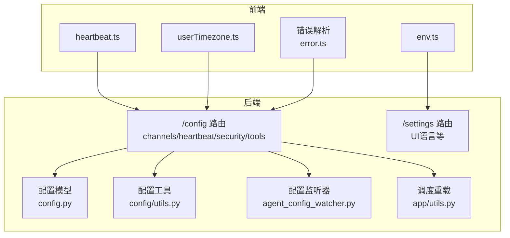
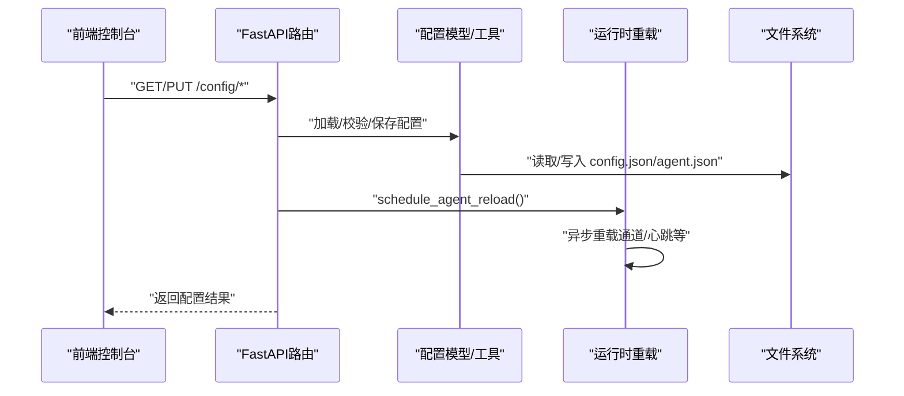
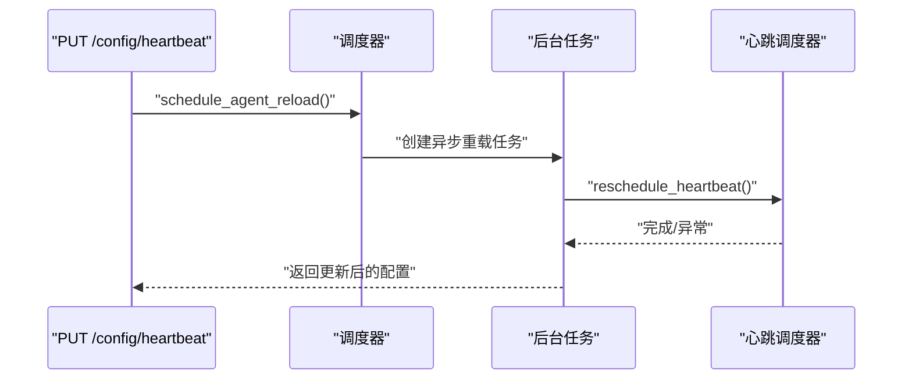
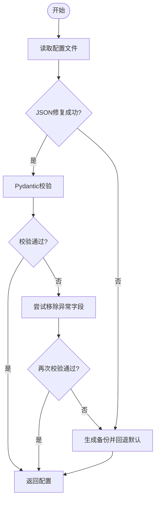
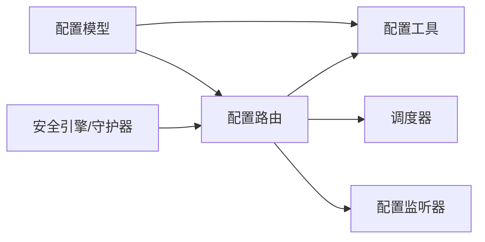

# 系统配置API

<cite>
**本文档引用的文件**
- [src/qwenpaw/app/routers/config.py](file://src/qwenpaw/app/routers/config.py)
- [src/qwenpaw/config/config.py](file://src/qwenpaw/config/config.py)
- [src/qwenpaw/app/routers/schemas_config.py](file://src/qwenpaw/app/routers/schemas_config.py)
- [src/qwenpaw/app/routers/settings.py](file://src/qwenpaw/app/routers/settings.py)
- [src/qwenpaw/config/utils.py](file://src/qwenpaw/config/utils.py)
- [src/qwenpaw/app/agent_config_watcher.py](file://src/qwenpaw/app/agent_config_watcher.py)
- [src/qwenpaw/app/utils.py](file://src/qwenpaw/app/utils.py)
- [src/qwenpaw/constant.py](file://src/qwenpaw/constant.py)
- [src/qwenpaw/app/migration.py](file://src/qwenpaw/app/migration.py)
- [src/qwenpaw/security/tool_guard/guardians/file_guardian.py](file://src/qwenpaw/security/tool_guard/guardians/file_guardian.py)
- [src/qwenpaw/utils/logging.py](file://src/qwenpaw/utils/logging.py)
- [console/src/api/modules/heartbeat.ts](file://console/src/api/modules/heartbeat.ts)
- [console/src/api/modules/userTimezone.ts](file://console/src/api/modules/userTimezone.ts)
- [console/src/api/modules/env.ts](file://console/src/api/modules/env.ts)
- [console/src/utils/error.ts](file://console/src/utils/error.ts)
</cite>

## 目录
1. [简介](#简介)
2. [项目结构](#项目结构)
3. [核心组件](#核心组件)
4. [架构总览](#架构总览)
5. [详细组件分析](#详细组件分析)
6. [依赖分析](#依赖分析)
7. [性能考虑](#性能考虑)
8. [故障排除指南](#故障排除指南)
9. [结论](#结论)
10. [附录](#附录)

## 简介
本文件为 QwenPaw 系统的“系统配置API”技术文档，覆盖全局配置管理、模块配置、运行时配置与配置验证等端点；详细说明系统参数、网络设置、日志配置、安全策略与性能调优的API接口；提供配置模板、默认值管理与配置迁移的完整规范；包含配置热更新、回滚机制与一致性检查的功能说明；并给出配置文件格式、验证规则与错误处理的API规范；同时提供配置备份、导入导出与批量修改的管理接口，以及配置审计、变更历史与版本控制的完整文档。

## 项目结构
QwenPaw 的配置API主要由后端FastAPI路由层、配置模型定义、工具函数与前端API封装组成。后端路由位于 app/routers 下，配置模型与工具位于 config 子包，前端API封装位于 console/src/api/modules。

图表来源
- [src/qwenpaw/app/routers/config.py:45-644](file://src/qwenpaw/app/routers/config.py#L45-L644)
- [src/qwenpaw/app/routers/settings.py:15-59](file://src/qwenpaw/app/routers/settings.py#L15-L59)
- [src/qwenpaw/config/config.py:1132-1439](file://src/qwenpaw/config/config.py#L1132-L1439)
- [src/qwenpaw/config/utils.py:491-552](file://src/qwenpaw/config/utils.py#L491-L552)
- [src/qwenpaw/app/agent_config_watcher.py:35-277](file://src/qwenpaw/app/agent_config_watcher.py#L35-L277)
- [src/qwenpaw/app/utils.py:15-59](file://src/qwenpaw/app/utils.py#L15-L59)
- [console/src/api/modules/heartbeat.ts:1-15](file://console/src/api/modules/heartbeat.ts#L1-L15)
- [console/src/api/modules/userTimezone.ts:1-15](file://console/src/api/modules/userTimezone.ts#L1-L15)
- [console/src/api/modules/env.ts:1-18](file://console/src/api/modules/env.ts#L1-L18)

章节来源
- [src/qwenpaw/app/routers/config.py:45-644](file://src/qwenpaw/app/routers/config.py#L45-L644)
- [src/qwenpaw/app/routers/settings.py:15-59](file://src/qwenpaw/app/routers/settings.py#L15-L59)
- [src/qwenpaw/config/config.py:1132-1439](file://src/qwenpaw/config/config.py#L1132-L1439)

## 核心组件
- 配置路由层：提供通道、心跳、安全（工具守卫、文件守卫、技能扫描）、用户时区、代理环境变量等API。
- 配置模型层：定义通道、心跳、运行时、安全策略、工具集等配置数据结构与默认值。
- 工具层：负责配置读取、写入、路径归一化、自动修复与备份、迁移等。
- 运行时热更新：通过调度器与配置监听器实现非阻塞热重载。
- 前端API封装：统一请求方法与类型定义，便于控制台使用。

章节来源
- [src/qwenpaw/app/routers/config.py:45-644](file://src/qwenpaw/app/routers/config.py#L45-L644)
- [src/qwenpaw/config/config.py:208-1439](file://src/qwenpaw/config/config.py#L208-L1439)
- [src/qwenpaw/config/utils.py:491-552](file://src/qwenpaw/config/utils.py#L491-L552)
- [src/qwenpaw/app/utils.py:15-59](file://src/qwenpaw/app/utils.py#L15-L59)
- [src/qwenpaw/app/agent_config_watcher.py:35-277](file://src/qwenpaw/app/agent_config_watcher.py#L35-L277)

## 架构总览
下图展示配置API在系统中的交互关系：前端通过HTTP请求访问后端路由，路由层调用配置模型与工具函数进行读写与校验，并触发运行时热更新或后台任务。

图表来源
- [src/qwenpaw/app/routers/config.py:122-140](file://src/qwenpaw/app/routers/config.py#L122-L140)
- [src/qwenpaw/app/utils.py:15-59](file://src/qwenpaw/app/utils.py#L15-L59)
- [src/qwenpaw/config/utils.py:533-544](file://src/qwenpaw/config/utils.py#L533-L544)

## 详细组件分析

### 全局配置管理（/config）
- 通道配置
  - 列出所有可用通道与类型
  - 更新全部通道配置
  - 获取/更新单个通道配置
  - 支持二维码授权（部分通道）
- 心跳配置
  - 获取/更新心跳周期、目标、活跃时段
  - 后台重新调度心跳任务
- 用户时区
  - 获取/更新用户IANA时区
- 安全配置
  - 工具守卫：启用/禁用、受保护工具列表、自定义规则、内置规则枚举
  - 文件守卫：启用/禁用、敏感文件路径集合
  - 技能扫描：模式（阻断/告警/关闭）、超时、白名单、阻断历史查询与清理
- 代理环境变量
  - 列表/批量保存/删除环境变量（用于网络代理）

章节来源
- [src/qwenpaw/app/routers/config.py:64-103](file://src/qwenpaw/app/routers/config.py#L64-L103)
- [src/qwenpaw/app/routers/config.py:106-113](file://src/qwenpaw/app/routers/config.py#L106-L113)
- [src/qwenpaw/app/routers/config.py:116-140](file://src/qwenpaw/app/routers/config.py#L116-L140)
- [src/qwenpaw/app/routers/config.py:146-186](file://src/qwenpaw/app/routers/config.py#L146-L186)
- [src/qwenpaw/app/routers/config.py:189-282](file://src/qwenpaw/app/routers/config.py#L189-L282)
- [src/qwenpaw/app/routers/config.py:285-342](file://src/qwenpaw/app/routers/config.py#L285-L342)
- [src/qwenpaw/app/routers/config.py:372-396](file://src/qwenpaw/app/routers/config.py#L372-L396)
- [src/qwenpaw/app/routers/config.py:402-430](file://src/qwenpaw/app/routers/config.py#L402-L430)
- [src/qwenpaw/app/routers/config.py:433-457](file://src/qwenpaw/app/routers/config.py#L433-L457)
- [src/qwenpaw/app/routers/config.py:468-519](file://src/qwenpaw/app/routers/config.py#L468-L519)
- [src/qwenpaw/app/routers/config.py:525-568](file://src/qwenpaw/app/routers/config.py#L525-L568)
- [src/qwenpaw/app/routers/config.py:571-644](file://src/qwenpaw/app/routers/config.py#L571-L644)

### 配置模型与默认值
- 通道配置模型：包含IMessage、Discord、钉钉、飞书、QQ、Telegram、MQTT、Mattermost、Matrix、企业微信、小艺、微信、OneBot等通道的字段与默认值。
- 心跳配置：启用开关、间隔、目标、活跃时段。
- 运行时配置：最大迭代次数、LLM重试与退避、并发限制、QPM限流、获取令牌超时、上下文压缩、工具结果压缩、记忆摘要与嵌入配置等。
- 安全配置：工具守卫、文件守卫、技能扫描的子配置与默认值。
- 工具集配置：内置工具的启用/禁用、显示图标、异步执行等。
- 多智能体配置：根配置包含代理引用、活动代理、系统提示文件等；每个智能体独立的agent.json存储其完整配置。

章节来源
- [src/qwenpaw/config/config.py:39-227](file://src/qwenpaw/config/config.py#L39-L227)
- [src/qwenpaw/config/config.py:242-254](file://src/qwenpaw/config/config.py#L242-L254)
- [src/qwenpaw/config/config.py:453-606](file://src/qwenpaw/config/config.py#L453-L606)
- [src/qwenpaw/config/config.py:1047-1130](file://src/qwenpaw/config/config.py#L1047-L1130)
- [src/qwenpaw/config/config.py:1007-1023](file://src/qwenpaw/config/config.py#L1007-L1023)
- [src/qwenpaw/config/config.py:1132-1263](file://src/qwenpaw/config/config.py#L1132-L1263)

### 运行时配置与热更新
- 热更新流程：PUT更新配置后，通过调度器在后台异步重载指定智能体，避免阻塞请求响应。
- 配置监听器：轮询agent.json变更并应用通道与心跳等配置更新。
- 后台任务：心跳更新后在后台重新调度心跳任务，异常会记录警告日志。

图表来源
- [src/qwenpaw/app/routers/config.py:308-342](file://src/qwenpaw/app/routers/config.py#L308-L342)
- [src/qwenpaw/app/utils.py:15-59](file://src/qwenpaw/app/utils.py#L15-L59)
- [src/qwenpaw/app/agent_config_watcher.py:252-277](file://src/qwenpaw/app/agent_config_watcher.py#L252-L277)

章节来源
- [src/qwenpaw/app/utils.py:15-59](file://src/qwenpaw/app/utils.py#L15-L59)
- [src/qwenpaw/app/agent_config_watcher.py:252-277](file://src/qwenpaw/app/agent_config_watcher.py#L252-L277)

### 配置验证与错误处理
- 配置读取：支持自动修复JSON语法问题、路径归一化、向后兼容字段转换。
- 验证失败：当模型校验失败时，尝试移除异常字段并回退到默认配置，同时生成备份文件。
- 错误解析：前端提供错误详情解析工具，从错误消息中提取JSON化的detail。

图表来源
- [src/qwenpaw/config/utils.py:456-530](file://src/qwenpaw/config/utils.py#L456-L530)
- [console/src/utils/error.ts:1-11](file://console/src/utils/error.ts#L1-L11)

章节来源
- [src/qwenpaw/config/utils.py:456-530](file://src/qwenpaw/config/utils.py#L456-L530)
- [console/src/utils/error.ts:1-11](file://console/src/utils/error.ts#L1-L11)

### 配置模板与默认值管理
- 默认值来源：常量与模型字段默认值共同构成系统默认行为。
- 环境变量：通过EnvVarLoader读取并提供边界检查与默认值。
- 模板建议：
  - 通道配置：按需启用，填写必要凭据与媒体目录。
  - 心跳配置：设置合理的间隔与目标文件，可选活跃时段。
  - 安全策略：根据场景选择工具守卫与技能扫描模式，维护白名单。
  - 运行时参数：结合API配额与延迟调整并发与退避策略。

章节来源
- [src/qwenpaw/constant.py:28-86](file://src/qwenpaw/constant.py#L28-L86)
- [src/qwenpaw/config/config.py:242-254](file://src/qwenpaw/config/config.py#L242-L254)
- [src/qwenpaw/config/config.py:453-606](file://src/qwenpaw/config/config.py#L453-L606)

### 配置迁移与版本控制
- 多智能体迁移：将旧版单智能体配置迁移到新的多智能体结构，保留根配置兼容字段。
- 工作区迁移：将历史工作区文件复制到新位置，保持向后兼容。
- 版本控制：迁移完成后更新根配置并记录日志，确保降级兼容性。

章节来源
- [src/qwenpaw/config/config.py:1304-1438](file://src/qwenpaw/config/config.py#L1304-L1438)
- [src/qwenpaw/app/migration.py:156-226](file://src/qwenpaw/app/migration.py#L156-L226)

### 配置备份、导入导出与批量修改
- 备份机制：配置文件不可用时自动备份原文件并回退默认配置。
- 导入导出：通过批量保存环境变量接口实现“全量替换”的导入导出模式。
- 批量修改：通道与安全配置均支持整包更新，前端可组合多个PATCH/PUT请求实现批量修改。

章节来源
- [src/qwenpaw/config/utils.py:436-453](file://src/qwenpaw/config/utils.py#L436-L453)
- [src/qwenpaw/app/routers/config.py:116-140](file://src/qwenpaw/app/routers/config.py#L116-L140)
- [src/qwenpaw/app/routers/config.py:402-430](file://src/qwenpaw/app/routers/config.py#L402-L430)
- [console/src/api/modules/env.ts:7-12](file://console/src/api/modules/env.ts#L7-L12)

### 配置审计、变更历史与一致性检查
- 变更历史：技能扫描提供阻断历史查询与清理接口。
- 一致性检查：配置模型包含字段校验（如LLM退避cap≥base），不满足条件时报错。
- 一致性保障：路径归一化确保跨平台与工作目录变更的一致性；迁移过程保留旧字段以保证降级兼容。

章节来源
- [src/qwenpaw/app/routers/config.py:549-568](file://src/qwenpaw/app/routers/config.py#L549-L568)
- [src/qwenpaw/config/utils.py:41-74](file://src/qwenpaw/config/utils.py#L41-L74)
- [src/qwenpaw/config/config.py:538-549](file://src/qwenpaw/config/config.py#L538-L549)

## 依赖分析
- 路由依赖：/config路由依赖配置模型与工具函数；/settings路由独立于配置模型。
- 运行时依赖：热更新依赖调度器与配置监听器；心跳更新依赖后台任务。
- 安全依赖：工具守卫与文件守卫依赖引擎与守护器；技能扫描依赖扫描器与白名单。

图表来源
- [src/qwenpaw/app/routers/config.py:45-644](file://src/qwenpaw/app/routers/config.py#L45-L644)
- [src/qwenpaw/config/config.py:1132-1439](file://src/qwenpaw/config/config.py#L1132-L1439)
- [src/qwenpaw/config/utils.py:491-552](file://src/qwenpaw/config/utils.py#L491-L552)
- [src/qwenpaw/app/utils.py:15-59](file://src/qwenpaw/app/utils.py#L15-L59)
- [src/qwenpaw/app/agent_config_watcher.py:35-277](file://src/qwenpaw/app/agent_config_watcher.py#L35-L277)

章节来源
- [src/qwenpaw/app/routers/config.py:45-644](file://src/qwenpaw/app/routers/config.py#L45-L644)
- [src/qwenpaw/config/config.py:1132-1439](file://src/qwenpaw/config/config.py#L1132-L1439)

## 性能考虑
- 并发与限流：通过LLM_MAX_CONCURRENT、LLM_MAX_QPM、退避策略与获取令牌超时控制API调用压力。
- 上下文压缩：合理设置记忆压缩阈值与保留比例，平衡性能与上下文完整性。
- 工具结果压缩：对近期与旧工具结果分别设定字节阈值，减少冗余内容。
- 日志级别：生产环境建议提升日志级别，减少IO开销。

章节来源
- [src/qwenpaw/constant.py:220-282](file://src/qwenpaw/constant.py#L220-L282)
- [src/qwenpaw/config/config.py:295-442](file://src/qwenpaw/config/config.py#L295-L442)
- [src/qwenpaw/utils/logging.py:121-164](file://src/qwenpaw/utils/logging.py#L121-L164)

## 故障排除指南
- 配置文件损坏：自动修复JSON语法问题；若仍失败则备份并回退默认配置。
- 热更新失败：后台重载任务异常会被记录为警告，不影响当前请求响应。
- 工具守卫/文件守卫：更新后立即重载规则，确保生效。
- 技能扫描白名单冲突：添加重复条目会返回冲突错误，需先移除再添加。
- 环境变量注入：受保护键不会注入到进程环境，避免破坏系统稳定性。

章节来源
- [src/qwenpaw/config/utils.py:456-530](file://src/qwenpaw/config/utils.py#L456-L530)
- [src/qwenpaw/app/utils.py:49-57](file://src/qwenpaw/app/utils.py#L49-L57)
- [src/qwenpaw/app/routers/config.py:600-621](file://src/qwenpaw/app/routers/config.py#L600-L621)
- [src/qwenpaw/security/tool_guard/guardians/file_guardian.py:244-247](file://src/qwenpaw/security/tool_guard/guardians/file_guardian.py#L244-L247)

## 结论
QwenPaw 的配置API以清晰的路由分层、严谨的模型校验与完善的工具链为基础，提供了从全局到模块、从静态到动态的全栈配置能力。通过热更新、迁移与备份机制，系统在功能扩展与运维稳定性之间取得良好平衡。建议在生产环境中结合限流与日志策略，配合白名单与扫描策略，确保安全与性能的双重保障。

## 附录

### API端点一览（按模块）
- 通道配置
  - GET /config/channels
  - GET /config/channels/types
  - PUT /config/channels
  - GET /config/channels/{channel_name}
  - PUT /config/channels/{channel_name}
  - GET /config/channels/{channel}/qrcode
  - GET /config/channels/{channel}/qrcode/status
- 心跳配置
  - GET /config/heartbeat
  - PUT /config/heartbeat
- 用户时区
  - GET /config/user-timezone
  - PUT /config/user-timezone
- 安全配置
  - GET /config/security/tool-guard
  - PUT /config/security/tool-guard
  - GET /config/security/tool-guard/builtin-rules
  - GET /config/security/file-guard
  - PUT /config/security/file-guard
  - GET /config/security/skill-scanner
  - PUT /config/security/skill-scanner
  - GET /config/security/skill-scanner/blocked-history
  - DELETE /config/security/skill-scanner/blocked-history
  - DELETE /config/security/skill-scanner/blocked-history/{index}
  - POST /config/security/skill-scanner/whitelist
  - DELETE /config/security/skill-scanner/whitelist/{skill_name}
- UI设置（/settings）
  - GET /settings/language
  - PUT /settings/language
- 代理环境变量（/envs）
  - GET /envs
  - PUT /envs
  - DELETE /envs/{key}

章节来源
- [src/qwenpaw/app/routers/config.py:64-644](file://src/qwenpaw/app/routers/config.py#L64-L644)
- [src/qwenpaw/app/routers/settings.py:39-58](file://src/qwenpaw/app/routers/settings.py#L39-L58)
- [console/src/api/modules/env.ts:4-17](file://console/src/api/modules/env.ts#L4-L17)