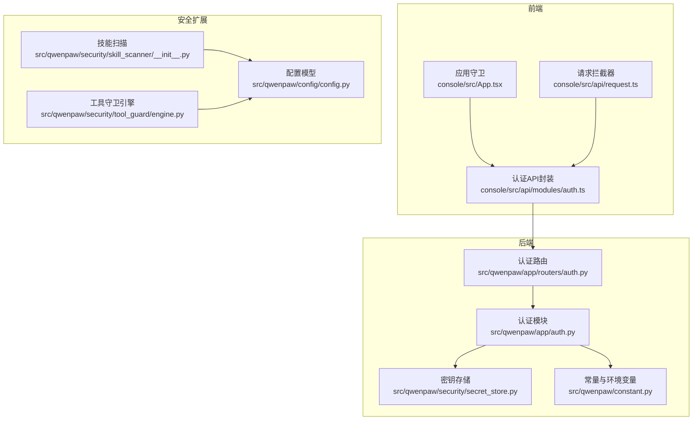
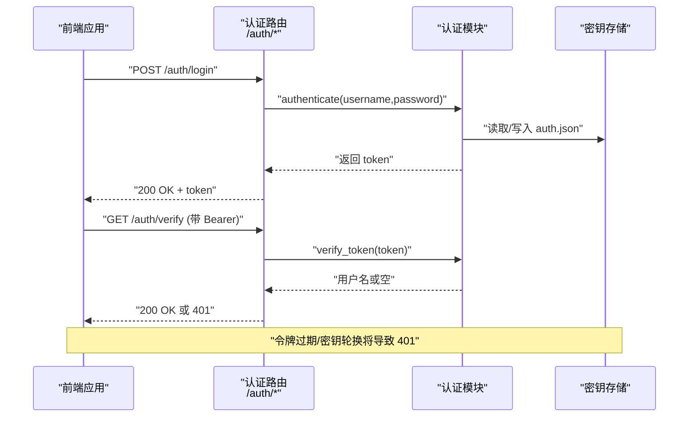
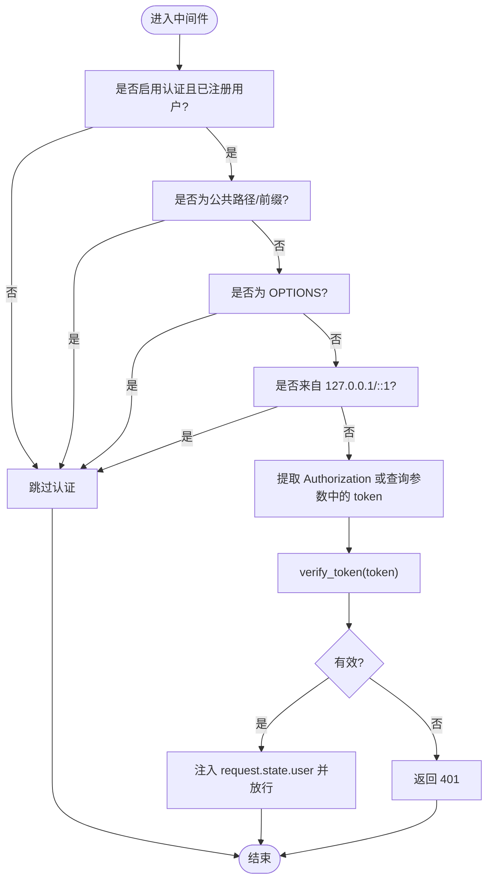
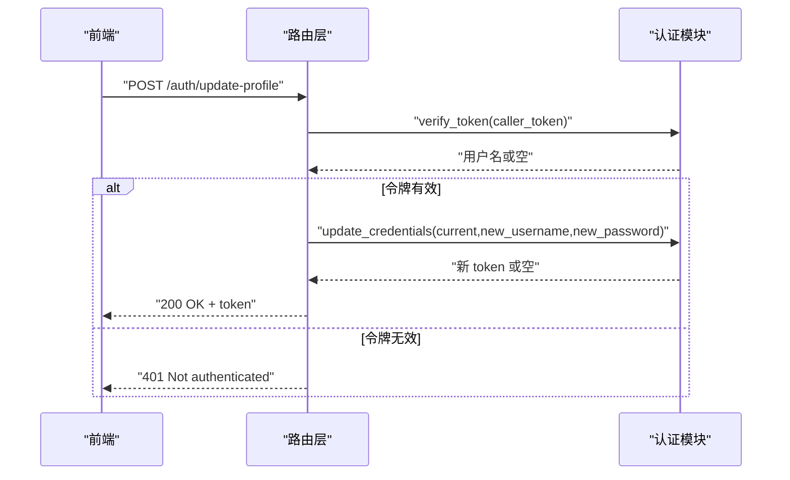
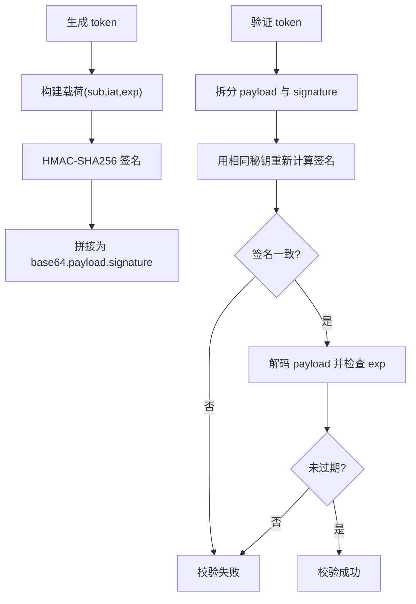
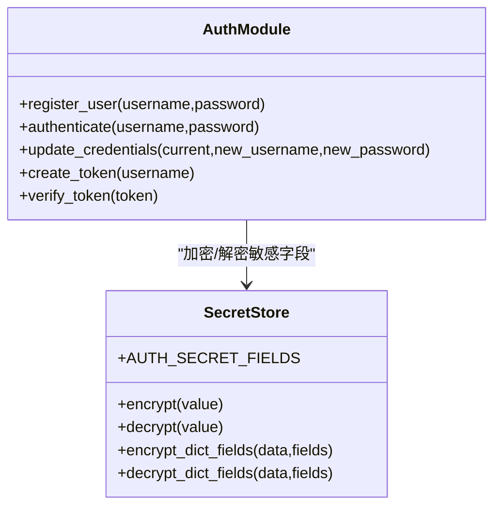
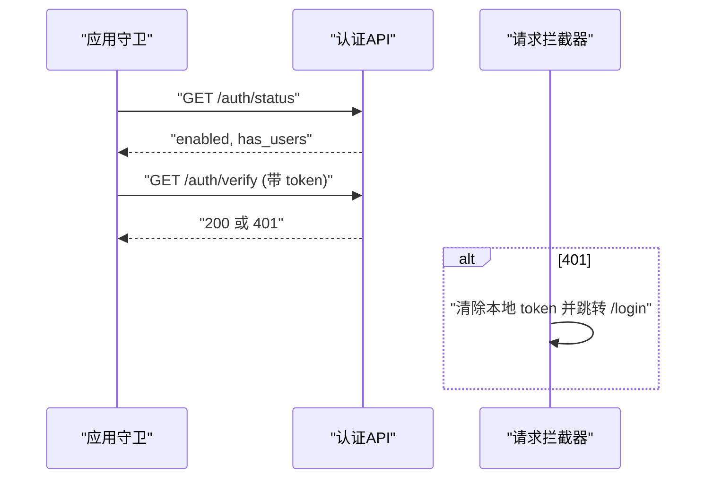
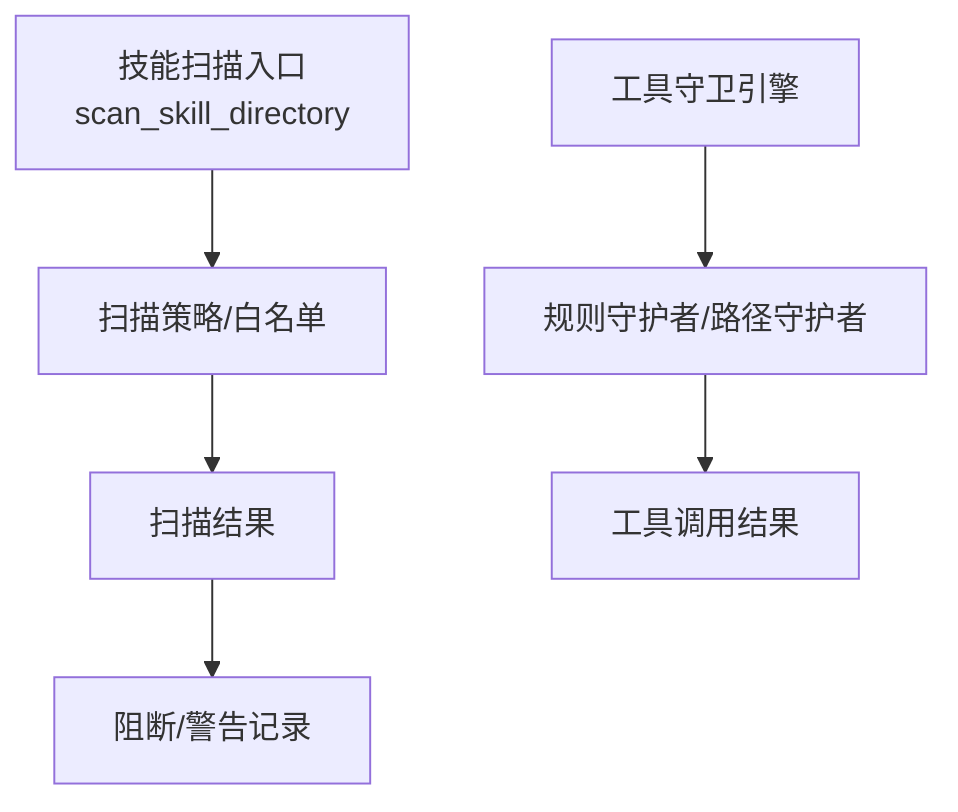
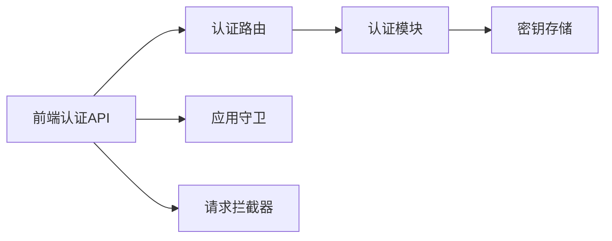

# 认证授权API

<cite>
**本文档引用的文件**
- [src/qwenpaw/app/auth.py](file://src/qwenpaw/app/auth.py)
- [src/qwenpaw/app/routers/auth.py](file://src/qwenpaw/app/routers/auth.py)
- [src/qwenpaw/security/secret_store.py](file://src/qwenpaw/security/secret_store.py)
- [src/qwenpaw/constant.py](file://src/qwenpaw/constant.py)
- [console/src/api/modules/auth.ts](file://console/src/api/modules/auth.ts)
- [console/src/App.tsx](file://console/src/App.tsx)
- [console/src/api/request.ts](file://console/src/api/request.ts)
- [src/qwenpaw/security/skill_scanner/__init__.py](file://src/qwenpaw/security/skill_scanner/__init__.py)
- [src/qwenpaw/security/tool_guard/engine.py](file://src/qwenpaw/security/tool_guard/engine.py)
- [src/qwenpaw/config/config.py](file://src/qwenpaw/config/config.py)
- [website/public/docs/security.en.md](file://website/public/docs/security.en.md)
</cite>

## 目录
1. [简介](#简介)
2. [项目结构](#项目结构)
3. [核心组件](#核心组件)
4. [架构总览](#架构总览)
5. [详细组件分析](#详细组件分析)
6. [依赖关系分析](#依赖关系分析)
7. [性能考虑](#性能考虑)
8. [故障排除指南](#故障排除指南)
9. [结论](#结论)
10. [附录](#附录)

## 简介
本文件为 QwenPaw 的认证授权 API 提供完整的 RESTful 接口文档，覆盖用户登录、注册、状态查询、令牌验证与更新、会话控制等核心能力；同时阐述基于 HMAC-SHA256 的 JWT 令牌生成、校验与失效机制，以及单用户设计下的凭据存储与密钥轮换策略。文档还整合了前端认证流程、中间件拦截逻辑、安全扫描与工具守卫等扩展能力，帮助开发者与运维人员正确集成与部署。

## 项目结构
认证授权相关的核心代码分布在后端 Python 模块与前端 TypeScript 模块中：
- 后端：认证中间件、路由与令牌处理位于 Python 路由模块与认证模块
- 前端：认证 API 封装、全局守卫与请求拦截位于前端模块
- 安全：密钥存储、技能扫描与工具守卫提供纵深防御

**图表来源**
- [src/qwenpaw/app/auth.py:1-441](file://src/qwenpaw/app/auth.py#L1-L441)
- [src/qwenpaw/app/routers/auth.py:1-174](file://src/qwenpaw/app/routers/auth.py#L1-L174)
- [src/qwenpaw/security/secret_store.py:1-291](file://src/qwenpaw/security/secret_store.py#L1-L291)
- [src/qwenpaw/constant.py:1-307](file://src/qwenpaw/constant.py#L1-L307)
- [console/src/api/modules/auth.ts:1-75](file://console/src/api/modules/auth.ts#L1-L75)
- [console/src/App.tsx:49-104](file://console/src/App.tsx#L49-L104)
- [console/src/api/request.ts:60-104](file://console/src/api/request.ts#L60-L104)
- [src/qwenpaw/security/skill_scanner/__init__.py:1-514](file://src/qwenpaw/security/skill_scanner/__init__.py#L1-L514)
- [src/qwenpaw/security/tool_guard/engine.py:1-238](file://src/qwenpaw/security/tool_guard/engine.py#L1-L238)
- [src/qwenpaw/config/config.py:1-200](file://src/qwenpaw/config/config.py#L1-L200)

**章节来源**
- [src/qwenpaw/app/auth.py:1-441](file://src/qwenpaw/app/auth.py#L1-L441)
- [src/qwenpaw/app/routers/auth.py:1-174](file://src/qwenpaw/app/routers/auth.py#L1-L174)
- [console/src/api/modules/auth.ts:1-75](file://console/src/api/modules/auth.ts#L1-L75)

## 核心组件
- 认证中间件：对受保护路径进行 Bearer 令牌校验，支持本地回环跳过与 WebSocket 查询参数传递
- 认证路由：提供登录、注册、状态查询、令牌验证与资料更新等端点
- 令牌机制：基于 HMAC-SHA256 的自签名 JWT，7 天有效期，支持密钥轮换导致的会话失效
- 密钥存储：使用 Fernet 对称加密存储敏感字段（如 JWT 秘钥），支持系统钥匙串与文件两种后端
- 前端认证：封装登录/注册/状态查询 API，全局守卫与请求拦截实现自动登出与错误处理

**章节来源**
- [src/qwenpaw/app/auth.py:371-441](file://src/qwenpaw/app/auth.py#L371-L441)
- [src/qwenpaw/app/routers/auth.py:41-174](file://src/qwenpaw/app/routers/auth.py#L41-L174)
- [src/qwenpaw/security/secret_store.py:149-291](file://src/qwenpaw/security/secret_store.py#L149-L291)
- [console/src/api/modules/auth.ts:14-75](file://console/src/api/modules/auth.ts#L14-L75)

## 架构总览
下图展示了认证授权的端到端流程：前端通过认证 API 发起登录/注册，后端生成或校验令牌；后续请求由中间件拦截并校验令牌；密钥存储模块负责敏感数据的加密持久化。

**图表来源**
- [src/qwenpaw/app/routers/auth.py:41-114](file://src/qwenpaw/app/routers/auth.py#L41-L114)
- [src/qwenpaw/app/auth.py:121-166](file://src/qwenpaw/app/auth.py#L121-L166)
- [src/qwenpaw/security/secret_store.py:213-242](file://src/qwenpaw/security/secret_store.py#L213-L242)

**章节来源**
- [src/qwenpaw/app/routers/auth.py:41-114](file://src/qwenpaw/app/routers/auth.py#L41-L114)
- [src/qwenpaw/app/auth.py:121-166](file://src/qwenpaw/app/auth.py#L121-L166)

## 详细组件分析

### 认证中间件（AuthMiddleware）
- 功能：对受保护路径进行 Bearer 令牌校验；跳过公共路径、预检请求与本地回环请求；WebSocket 通过查询参数传递令牌
- 行为：未携带令牌或令牌无效时返回 401；校验通过后在请求上下文中注入用户信息

**图表来源**
- [src/qwenpaw/app/auth.py:371-441](file://src/qwenpaw/app/auth.py#L371-L441)

**章节来源**
- [src/qwenpaw/app/auth.py:371-441](file://src/qwenpaw/app/auth.py#L371-L441)

### 认证路由与端点
- 登录：POST /auth/login，校验凭据并返回 token
- 注册：POST /auth/register，仅允许一次注册，需启用认证
- 状态：GET /auth/status，返回认证开关与是否已注册
- 验证：GET /auth/verify，校验 Bearer 令牌有效性
- 更新资料：POST /auth/update-profile，支持修改用户名与密码，密码变更触发密钥轮换

**图表来源**
- [src/qwenpaw/app/routers/auth.py:122-174](file://src/qwenpaw/app/routers/auth.py#L122-L174)
- [src/qwenpaw/app/auth.py:305-340](file://src/qwenpaw/app/auth.py#L305-L340)

**章节来源**
- [src/qwenpaw/app/routers/auth.py:41-174](file://src/qwenpaw/app/routers/auth.py#L41-L174)
- [src/qwenpaw/app/auth.py:305-340](file://src/qwenpaw/app/auth.py#L305-L340)

### 令牌生成与验证（HMAC-SHA256）
- 生成：以用户名、签发时间与过期时间为载荷，使用 JWT 秘钥进行 HMAC-SHA256 签名
- 校验：验证签名与过期时间，失败则拒绝访问
- 失效：密码重置或 JWT 秘钥轮换会导致所有现有会话失效

**图表来源**
- [src/qwenpaw/app/auth.py:121-166](file://src/qwenpaw/app/auth.py#L121-L166)

**章节来源**
- [src/qwenpaw/app/auth.py:121-166](file://src/qwenpaw/app/auth.py#L121-L166)

### 凭据与密钥存储
- 用户凭据：单用户设计，注册后保存盐值与哈希；密码采用 salted SHA-256
- JWT 秘钥：首次使用自动生成并加密存储；更新密码时轮换秘钥以使旧会话失效
- 密钥存储：优先使用系统钥匙串，失败时回退至文件存储；敏感字段透明加密

**图表来源**
- [src/qwenpaw/app/auth.py:246-340](file://src/qwenpaw/app/auth.py#L246-L340)
- [src/qwenpaw/security/secret_store.py:254-291](file://src/qwenpaw/security/secret_store.py#L254-L291)

**章节来源**
- [src/qwenpaw/app/auth.py:246-340](file://src/qwenpaw/app/auth.py#L246-L340)
- [src/qwenpaw/security/secret_store.py:254-291](file://src/qwenpaw/security/secret_store.py#L254-L291)

### 前端认证流程
- 登录/注册：调用后端 /auth/* 接口，成功后保存 token
- 全局守卫：启动时检查认证状态与令牌有效性，无效则重定向至登录页
- 请求拦截：收到 401 自动清除 token 并跳转登录页

**图表来源**
- [console/src/App.tsx:49-104](file://console/src/App.tsx#L49-L104)
- [console/src/api/modules/auth.ts:44-75](file://console/src/api/modules/auth.ts#L44-L75)
- [console/src/api/request.ts:74-80](file://console/src/api/request.ts#L74-L80)

**章节来源**
- [console/src/App.tsx:49-104](file://console/src/App.tsx#L49-L104)
- [console/src/api/modules/auth.ts:14-75](file://console/src/api/modules/auth.ts#L14-L75)
- [console/src/api/request.ts:74-80](file://console/src/api/request.ts#L74-L80)

### 安全扫描与工具守卫
- 技能扫描：对技能目录进行威胁检测，支持阻断/警告/关闭模式，记录阻断历史
- 工具守卫：对工具调用参数进行规则与路径级检查，支持动态规则加载与拒绝列表

**图表来源**
- [src/qwenpaw/security/skill_scanner/__init__.py:424-514](file://src/qwenpaw/security/skill_scanner/__init__.py#L424-L514)
- [src/qwenpaw/security/tool_guard/engine.py:169-227](file://src/qwenpaw/security/tool_guard/engine.py#L169-L227)

**章节来源**
- [src/qwenpaw/security/skill_scanner/__init__.py:424-514](file://src/qwenpaw/security/skill_scanner/__init__.py#L424-L514)
- [src/qwenpaw/security/tool_guard/engine.py:169-227](file://src/qwenpaw/security/tool_guard/engine.py#L169-L227)

## 依赖关系分析
- 认证路由依赖认证模块提供的登录、注册、令牌验证与更新函数
- 认证模块依赖密钥存储模块进行敏感字段的加解密
- 前端认证 API 封装依赖后端路由；全局守卫与请求拦截器依赖认证 API

**图表来源**
- [src/qwenpaw/app/routers/auth.py:1-174](file://src/qwenpaw/app/routers/auth.py#L1-L174)
- [src/qwenpaw/app/auth.py:1-441](file://src/qwenpaw/app/auth.py#L1-L441)
- [src/qwenpaw/security/secret_store.py:1-291](file://src/qwenpaw/security/secret_store.py#L1-L291)
- [console/src/api/modules/auth.ts:1-75](file://console/src/api/modules/auth.ts#L1-L75)
- [console/src/App.tsx:49-104](file://console/src/App.tsx#L49-L104)
- [console/src/api/request.ts:60-104](file://console/src/api/request.ts#L60-L104)

**章节来源**
- [src/qwenpaw/app/routers/auth.py:1-174](file://src/qwenpaw/app/routers/auth.py#L1-L174)
- [src/qwenpaw/app/auth.py:1-441](file://src/qwenpaw/app/auth.py#L1-L441)
- [src/qwenpaw/security/secret_store.py:1-291](file://src/qwenpaw/security/secret_store.py#L1-L291)
- [console/src/api/modules/auth.ts:1-75](file://console/src/api/modules/auth.ts#L1-L75)
- [console/src/App.tsx:49-104](file://console/src/App.tsx#L49-L104)
- [console/src/api/request.ts:60-104](file://console/src/api/request.ts#L60-L104)

## 性能考虑
- 令牌校验为纯内存操作，开销极低
- 密钥存储采用缓存实例，避免重复初始化
- 技能扫描默认使用线程池与缓存，避免重复扫描
- 建议：合理设置扫描超时与缓存条目上限，避免高并发场景下的资源占用

[本节为通用指导，无需特定文件来源]

## 故障排除指南
- 401 未认证：检查 Authorization 头或查询参数中的 token 是否存在且未过期；确认中间件未对本地回环请求误拦截
- 403 禁止访问：认证未启用或已注册用户不存在时，注册端点可能被拒绝
- 令牌过期：7 天有效期到期后需重新登录
- 密钥轮换：密码重置或通过命令轮换 JWT 秘钥会导致旧会话全部失效，需重新登录
- 前端自动登出：请求拦截器在收到 401 时会清除本地 token 并跳转登录页

**章节来源**
- [src/qwenpaw/app/auth.py:371-441](file://src/qwenpaw/app/auth.py#L371-L441)
- [src/qwenpaw/app/routers/auth.py:41-114](file://src/qwenpaw/app/routers/auth.py#L41-L114)
- [console/src/api/request.ts:74-80](file://console/src/api/request.ts#L74-L80)
- [website/public/docs/security.en.md:689-740](file://website/public/docs/security.en.md#L689-L740)

## 结论
QwenPaw 的认证授权体系以单用户、最小依赖为核心设计，结合 HMAC-SHA256 令牌与密钥存储，提供了简洁可靠的访问控制能力。配合前端全局守卫与请求拦截、技能扫描与工具守卫，形成从传输到执行的多层安全防护。建议在生产环境中严格限制暴露面、定期轮换密钥，并通过扫描与守卫策略降低风险。

[本节为总结性内容，无需特定文件来源]

## 附录

### RESTful API 规范

- 基础路径
  - 前缀：/api/auth
  - 内容类型：application/json

- 认证开关与状态
  - GET /status
    - 返回：enabled（布尔）、has_users（布尔）
    - 说明：用于判断是否启用认证及是否存在用户

- 登录
  - POST /login
    - 请求体：username、password
    - 成功：token、username
    - 失败：401 无效凭据

- 注册（单用户）
  - POST /register
    - 请求体：username、password
    - 成功：token、username
    - 失败：403/409 等错误

- 令牌验证
  - GET /verify
    - 请求头：Authorization: Bearer <token>
    - 成功：valid=true、username
    - 失败：401 缺少或无效 token

- 更新资料
  - POST /update-profile
    - 请求头：Authorization: Bearer <token>
    - 请求体：current_password、new_username（可选）、new_password（可选）
    - 成功：新的 token 与用户名
    - 失败：400 参数不合法、401 当前密码错误、403 未启用或无用户

**章节来源**
- [src/qwenpaw/app/routers/auth.py:41-174](file://src/qwenpaw/app/routers/auth.py#L41-L174)

### 令牌生命周期与会话控制
- 生成：携带 sub、iat、exp 字段，使用 HMAC-SHA256 签名
- 校验：比对签名与过期时间，失败即 401
- 失效：密码重置或密钥轮换导致旧 token 失效
- 前端：localStorage 存储 token，401 自动清除并跳转登录

**章节来源**
- [src/qwenpaw/app/auth.py:121-166](file://src/qwenpaw/app/auth.py#L121-L166)
- [console/src/api/request.ts:74-80](file://console/src/api/request.ts#L74-L80)
- [website/public/docs/security.en.md:726-740](file://website/public/docs/security.en.md#L726-L740)

### 安全策略与最佳实践
- 单用户设计：仅允许一个管理员账户，简化密钥管理
- 密钥存储：使用 Fernet 加密敏感字段，优先系统钥匙串
- 扫描与守卫：启用技能扫描与工具守卫，阻断高危行为
- 部署建议：限制暴露面、使用 HTTPS、定期轮换密钥、监控 401 异常

**章节来源**
- [src/qwenpaw/security/secret_store.py:149-291](file://src/qwenpaw/security/secret_store.py#L149-L291)
- [src/qwenpaw/security/skill_scanner/__init__.py:424-514](file://src/qwenpaw/security/skill_scanner/__init__.py#L424-L514)
- [src/qwenpaw/security/tool_guard/engine.py:169-227](file://src/qwenpaw/security/tool_guard/engine.py#L169-L227)
- [website/public/docs/security.en.md:726-740](file://website/public/docs/security.en.md#L726-L740)