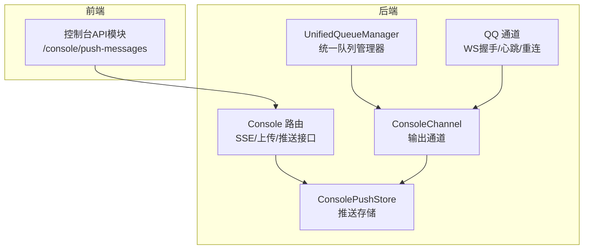
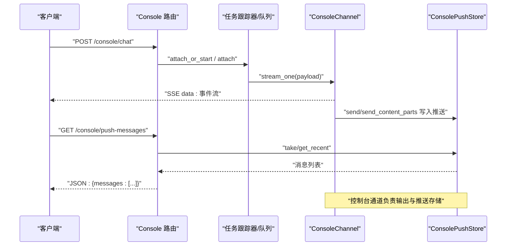
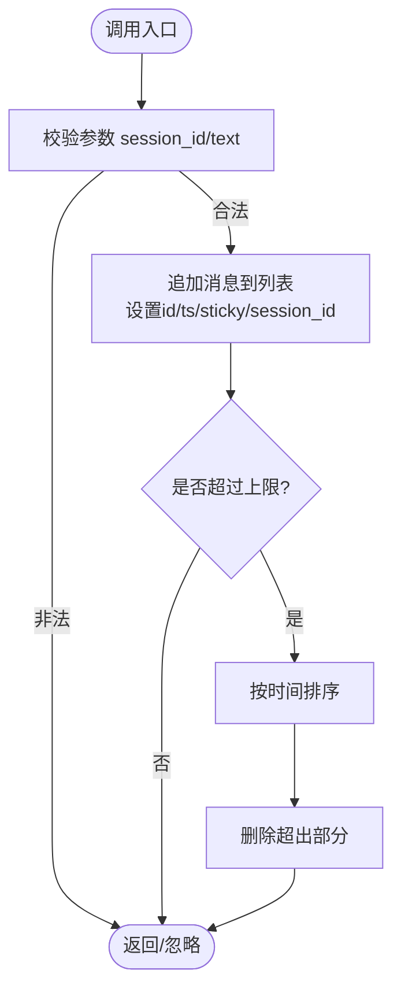
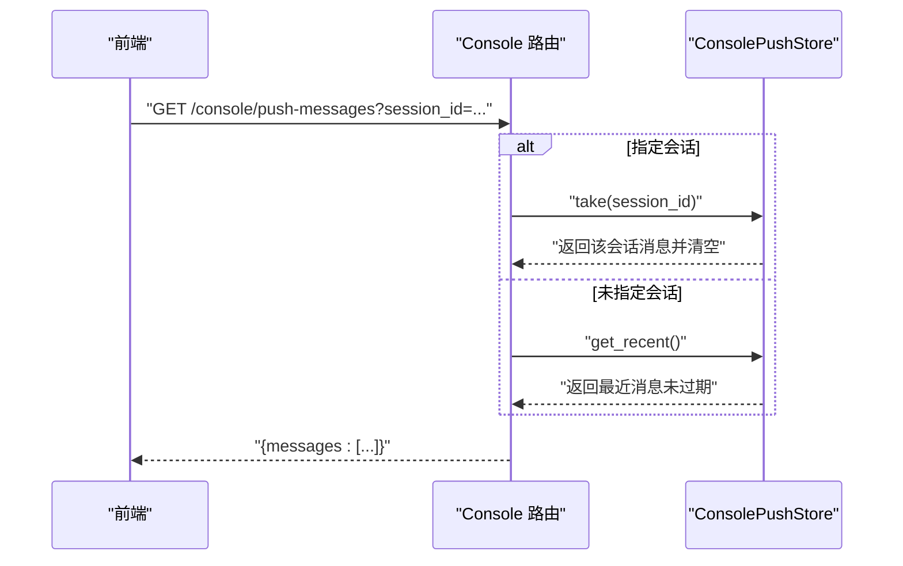
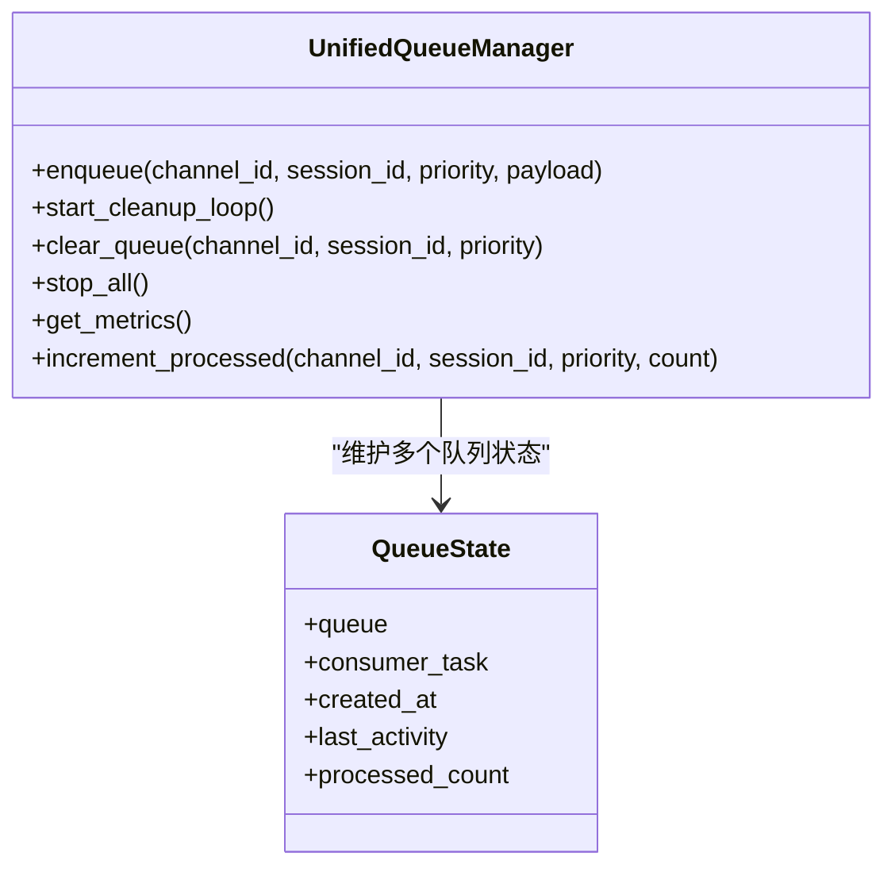
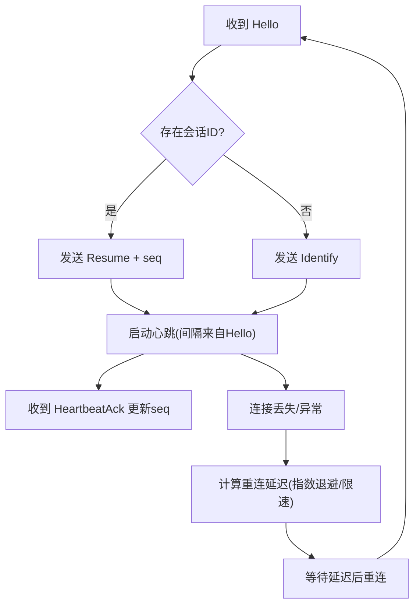
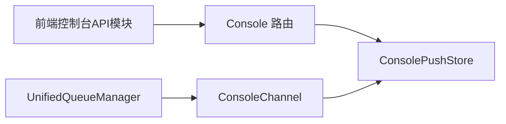

# WebSocket API

<cite>
**本文引用的文件**
- [src/qwenpaw/app/console_push_store.py](file://src/qwenpaw/app/console_push_store.py)
- [src/qwenpaw/app/routers/console.py](file://src/qwenpaw/app/routers/console.py)
- [src/qwenpaw/app/channels/console/channel.py](file://src/qwenpaw/app/channels/console/channel.py)
- [src/qwenpaw/app/channels/unified_queue_manager.py](file://src/qwenpaw/app/channels/unified_queue_manager.py)
- [src/qwenpaw/app/channels/qq/channel.py](file://src/qwenpaw/app/channels/qq/channel.py)
- [console/src/api/modules/console.ts](file://console/src/api/modules/console.ts)
</cite>

## 目录
1. [简介](#简介)
2. [项目结构](#项目结构)
3. [核心组件](#核心组件)
4. [架构总览](#架构总览)
5. [组件详解](#组件详解)
6. [依赖关系分析](#依赖关系分析)
7. [性能与监控](#性能与监控)
8. [故障排查指南](#故障排查指南)
9. [结论](#结论)
10. [附录：客户端使用与最佳实践](#附录客户端使用与最佳实践)

## 简介
本文件面向QwenPaw的实时通信能力，系统化梳理控制台推送存储（ConsolePushStore）、统一队列管理器（UnifiedQueueManager）以及通道层的WebSocket连接与消息分发机制。文档覆盖以下主题：
- 实时通信连接建立流程与断线重连策略
- 消息格式规范与事件类型定义
- 控制台推送存储的消息路由与消费模型
- 统一队列管理器的并发隔离、优先级与自动清理
- 认证流程、心跳机制与SSE/WS适配
- 客户端连接示例、消息处理与错误处理策略
- 性能优化与监控方法

## 项目结构
围绕WebSocket与实时推送的关键目录与文件如下：
- 控制台推送存储：用于在会话维度缓存并提供“推送消息”
- 控制台HTTP路由：提供SSE接口与文件上传
- 控制台通道：负责将消息打印到终端并写入推送存储
- 统一队列管理器：按通道/会话/优先级隔离的异步队列与消费者
- 通用QQ通道：展示WebSocket握手、心跳、断线重连等通用模式
- 前端控制台API模块：定义获取推送消息的接口

图表来源
- [src/qwenpaw/app/console_push_store.py:1-97](file://src/qwenpaw/app/console_push_store.py#L1-L97)
- [src/qwenpaw/app/routers/console.py:1-216](file://src/qwenpaw/app/routers/console.py#L1-L216)
- [src/qwenpaw/app/channels/console/channel.py:1-590](file://src/qwenpaw/app/channels/console/channel.py#L1-L590)
- [src/qwenpaw/app/channels/unified_queue_manager.py:1-498](file://src/qwenpaw/app/channels/unified_queue_manager.py#L1-L498)
- [src/qwenpaw/app/channels/qq/channel.py:1423-1457](file://src/qwenpaw/app/channels/qq/channel.py#L1423-L1457)
- [console/src/api/modules/console.ts:1-11](file://console/src/api/modules/console.ts#L1-L11)

章节来源
- [src/qwenpaw/app/console_push_store.py:1-97](file://src/qwenpaw/app/console_push_store.py#L1-L97)
- [src/qwenpaw/app/routers/console.py:1-216](file://src/qwenpaw/app/routers/console.py#L1-L216)
- [src/qwenpaw/app/channels/console/channel.py:1-590](file://src/qwenpaw/app/channels/console/channel.py#L1-L590)
- [src/qwenpaw/app/channels/unified_queue_manager.py:1-498](file://src/qwenpaw/app/channels/unified_queue_manager.py#L1-L498)
- [src/qwenpaw/app/channels/qq/channel.py:1423-1457](file://src/qwenpaw/app/channels/qq/channel.py#L1423-L1457)
- [console/src/api/modules/console.ts:1-11](file://console/src/api/modules/console.ts#L1-L11)

## 核心组件
- ConsolePushStore：内存中的会话级推送消息存储，支持追加、按会话提取、全局最近消息与过期裁剪。
- Console 路由：提供SSE流式响应（聊天）、停止运行、文件上传；提供/consolse/push-messages拉取接口。
- ConsoleChannel：将消息打印到终端，并在需要时写入推送存储，支持内容部件（文本/媒体）解析与会话ID解析。
- UnifiedQueueManager：基于三元键（通道ID、会话ID、优先级）的动态队列与消费者，支持自动清理空闲队列与指标采集。
- 通用QQ通道：展示WebSocket握手、心跳、断线重连与事件处理的典型模式。

章节来源
- [src/qwenpaw/app/console_push_store.py:1-97](file://src/qwenpaw/app/console_push_store.py#L1-L97)
- [src/qwenpaw/app/routers/console.py:1-216](file://src/qwenpaw/app/routers/console.py#L1-L216)
- [src/qwenpaw/app/channels/console/channel.py:1-590](file://src/qwenpaw/app/channels/console/channel.py#L1-L590)
- [src/qwenpaw/app/channels/unified_queue_manager.py:1-498](file://src/qwenpaw/app/channels/unified_queue_manager.py#L1-L498)
- [src/qwenpaw/app/channels/qq/channel.py:1423-1457](file://src/qwenpaw/app/channels/qq/channel.py#L1423-L1457)

## 架构总览
下图展示了从HTTP请求到SSE事件流、再到控制台通道输出与推送存储的整体路径，以及统一队列管理器在消息分发中的作用。

图表来源
- [src/qwenpaw/app/routers/console.py:68-148](file://src/qwenpaw/app/routers/console.py#L68-L148)
- [src/qwenpaw/app/channels/console/channel.py:332-448](file://src/qwenpaw/app/channels/console/channel.py#L332-L448)
- [src/qwenpaw/app/console_push_store.py:22-96](file://src/qwenpaw/app/console_push_store.py#L22-L96)

## 组件详解

### 控制台推送存储（ConsolePushStore）
- 存储结构：单列表，每条消息含唯一ID、文本、时间戳、会话ID与可选元数据；支持粘性标记。
- 追加策略：超过最大数量时按时间排序删除最旧条目；默认最多保留500条，有效期60秒。
- 提取消息：
  - 按会话ID提取并清空该会话消息
  - 获取所有未过期消息并清空存储
  - 获取最近消息（未消费，供多标签页共享）
- 并发安全：使用异步锁保护列表操作。

图表来源
- [src/qwenpaw/app/console_push_store.py:22-38](file://src/qwenpaw/app/console_push_store.py#L22-L38)

章节来源
- [src/qwenpaw/app/console_push_store.py:1-97](file://src/qwenpaw/app/console_push_store.py#L1-L97)

### Console 路由与SSE
- /console/chat：接收Agent请求，启动或附加到任务跟踪器的队列，返回SSE事件流；支持断线重连attach。
- /console/chat/stop：停止指定聊天任务。
- /console/upload：保存上传文件至媒体目录，限制大小。
- /console/push-messages：按会话提取或获取最近未过期消息。

图表来源
- [src/qwenpaw/app/routers/console.py:201-215](file://src/qwenpaw/app/routers/console.py#L201-L215)
- [src/qwenpaw/app/console_push_store.py:41-96](file://src/qwenpaw/app/console_push_store.py#L41-L96)

章节来源
- [src/qwenpaw/app/routers/console.py:1-216](file://src/qwenpaw/app/routers/console.py#L1-L216)
- [console/src/api/modules/console.ts:1-11](file://console/src/api/modules/console.ts#L1-L11)

### ConsoleChannel：消息输出与推送
- 会话ID解析：优先使用显式meta中的session_id，否则采用“console:sender_id”。
- 输出与推送：将消息部件（文本/媒体）打印到终端，并在需要时写入推送存储。
- 流式事件：通过stream_one生成SSE事件，支持令牌用量统计与媒体消息补充。

章节来源
- [src/qwenpaw/app/channels/console/channel.py:192-276](file://src/qwenpaw/app/channels/console/channel.py#L192-L276)
- [src/qwenpaw/app/channels/console/channel.py:332-448](file://src/qwenpaw/app/channels/console/channel.py#L332-L448)
- [src/qwenpaw/app/channels/console/channel.py:543-576](file://src/qwenpaw/app/channels/console/channel.py#L543-L576)

### 统一队列管理器（UnifiedQueueManager）
- 隔离与并发：三元键（通道ID、会话ID、优先级）隔离队列，同键严格串行，不同键并发处理。
- 动态消费者：首次入队时创建消费者任务，空闲超时自动清理。
- 指标与监控：提供队列数量、每个队列长度、处理计数、年龄与空闲时长等信息。
- 生命周期：支持优雅停止，取消所有消费者并清理。

图表来源
- [src/qwenpaw/app/channels/unified_queue_manager.py:60-498](file://src/qwenpaw/app/channels/unified_queue_manager.py#L60-L498)

章节来源
- [src/qwenpaw/app/channels/unified_queue_manager.py:1-498](file://src/qwenpaw/app/channels/unified_queue_manager.py#L1-L498)

### WebSocket连接、认证、心跳与断线重连（以QQ通道为例）
- 握手与会话恢复：收到Hello后根据是否存在会话ID决定发送Identify或Resume，并启动心跳。
- 心跳控制：根据Hello中的心跳间隔启动定时器，收到HeartbeatAck更新序列号。
- 断线重连：计算递增退避延迟，快速连续断开触发限速与令牌刷新提示，支持RESUMED时重置重连状态。
- 无效会话：根据是否可恢复决定是否清除会话ID与序列号。

图表来源
- [src/qwenpaw/app/channels/qq/channel.py:1423-1457](file://src/qwenpaw/app/channels/qq/channel.py#L1423-L1457)

章节来源
- [src/qwenpaw/app/channels/qq/channel.py:1423-1457](file://src/qwenpaw/app/channels/qq/channel.py#L1423-L1457)

## 依赖关系分析
- Console 路由依赖ConsolePushStore进行消息拉取。
- ConsoleChannel在输出消息时写入ConsolePushStore，供前端轮询或SSE消费。
- UnifiedQueueManager作为通用消息分发基础设施，可被各通道复用以实现有序、隔离、可扩展的并发处理。
- 前端控制台API模块通过GET /console/push-messages与后端交互。

图表来源
- [src/qwenpaw/app/routers/console.py:201-215](file://src/qwenpaw/app/routers/console.py#L201-L215)
- [src/qwenpaw/app/console_push_store.py:1-97](file://src/qwenpaw/app/console_push_store.py#L1-L97)
- [src/qwenpaw/app/channels/console/channel.py:543-576](file://src/qwenpaw/app/channels/console/channel.py#L543-L576)
- [src/qwenpaw/app/channels/unified_queue_manager.py:1-498](file://src/qwenpaw/app/channels/unified_queue_manager.py#L1-L498)
- [console/src/api/modules/console.ts:1-11](file://console/src/api/modules/console.ts#L1-L11)

章节来源
- [src/qwenpaw/app/routers/console.py:1-216](file://src/qwenpaw/app/routers/console.py#L1-L216)
- [src/qwenpaw/app/console_push_store.py:1-97](file://src/qwenpaw/app/console_push_store.py#L1-L97)
- [src/qwenpaw/app/channels/console/channel.py:1-590](file://src/qwenpaw/app/channels/console/channel.py#L1-L590)
- [src/qwenpaw/app/channels/unified_queue_manager.py:1-498](file://src/qwenpaw/app/channels/unified_queue_manager.py#L1-L498)
- [console/src/api/modules/console.ts:1-11](file://console/src/api/modules/console.ts#L1-L11)

## 性能与监控
- 队列容量与背压：统一队列管理器支持队列最大长度配置，入队时带超时避免无限阻塞。
- 自动清理：空闲队列在超时后自动取消消费者并释放资源，降低内存占用。
- 指标采集：提供队列总数、每个队列的长度、处理计数、年龄与空闲时长等指标，便于监控。
- 推送存储上限：固定数量与时间窗口，避免长期运行导致内存膨胀。
- SSE优化：使用StreamingResponse与SSE格式，减少HTTP开销；断线重连通过attach实现。

章节来源
- [src/qwenpaw/app/channels/unified_queue_manager.py:80-117](file://src/qwenpaw/app/channels/unified_queue_manager.py#L80-L117)
- [src/qwenpaw/app/channels/unified_queue_manager.py:376-427](file://src/qwenpaw/app/channels/unified_queue_manager.py#L376-L427)
- [src/qwenpaw/app/channels/unified_queue_manager.py:430-471](file://src/qwenpaw/app/channels/unified_queue_manager.py#L430-L471)
- [src/qwenpaw/app/console_push_store.py:18-19](file://src/qwenpaw/app/console_push_store.py#L18-L19)

## 故障排查指南
- SSE连接中断
  - 检查/consolse/chat是否正确attach或传入reconnect=true。
  - 关注服务端日志中“Console chat stream error”异常。
- 推送消息缺失
  - 确认ConsoleChannel已启用且消息包含有效session_id。
  - 使用/consolse/push-messages查询是否被take清空或已过期。
- 队列积压
  - 通过get_metrics检查队列长度与处理计数，确认消费者是否正常运行。
  - 调整队列最大长度与清理间隔以适应负载。
- WebSocket频繁断线
  - 查看断线重连延迟是否处于指数退避范围，是否存在快速断开触发限速。
  - 留意INVALID_SESSION事件对会话ID与序列号的影响。

章节来源
- [src/qwenpaw/app/routers/console.py:127-148](file://src/qwenpaw/app/routers/console.py#L127-L148)
- [src/qwenpaw/app/channels/unified_queue_manager.py:430-471](file://src/qwenpaw/app/channels/unified_queue_manager.py#L430-L471)
- [src/qwenpaw/app/channels/qq/channel.py:1423-1457](file://src/qwenpaw/app/channels/qq/channel.py#L1423-L1457)

## 结论
QwenPaw通过ConsolePushStore与Console 路由实现了稳定的实时消息拉取能力，结合ConsoleChannel的SSE事件流与统一队列管理器的并发隔离与自动清理机制，形成了高可用、可观测的实时通信基础。通道层（如QQ通道）提供了WebSocket握手、心跳与断线重连的通用范式，便于扩展到其他实时通道。

## 附录：客户端使用与最佳实践
- 客户端连接示例
  - 使用SSE客户端订阅/consolse/chat，支持断线重连attach。
  - 使用GET /consolse/push-messages轮询或去重消费。
- 消息处理
  - SSE事件体遵循标准SSE格式，逐条data字段承载事件对象。
  - 控制台通道支持文本与媒体消息，前端需分别渲染。
- 错误处理
  - 对SSE异常返回包含error字段的事件，客户端应捕获并提示。
  - 对/consolse/push-messages返回空数组属正常，表示无新消息。
- 性能优化
  - 合理设置队列最大长度与清理间隔，避免积压。
  - 前端对重复ID进行去重，避免重复渲染。
  - 上传文件前先检查大小限制，避免失败重试造成压力。

章节来源
- [src/qwenpaw/app/routers/console.py:68-148](file://src/qwenpaw/app/routers/console.py#L68-L148)
- [src/qwenpaw/app/routers/console.py:201-215](file://src/qwenpaw/app/routers/console.py#L201-L215)
- [console/src/api/modules/console.ts:1-11](file://console/src/api/modules/console.ts#L1-L11)