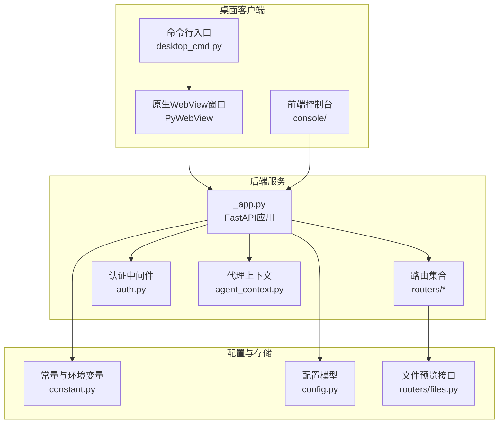
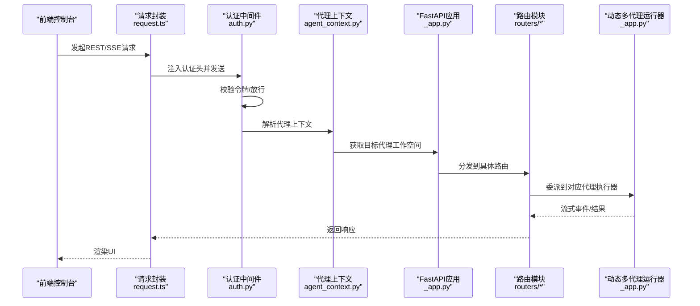
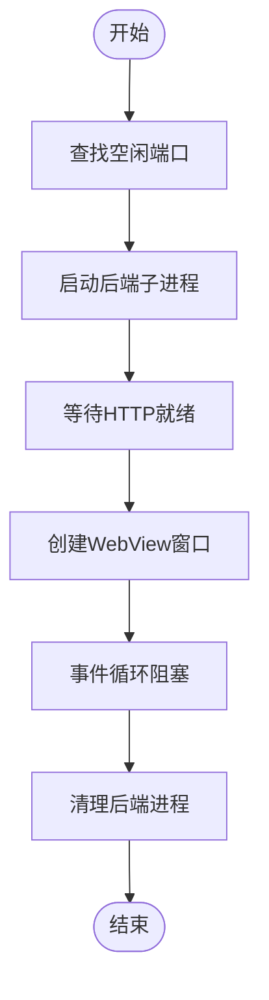
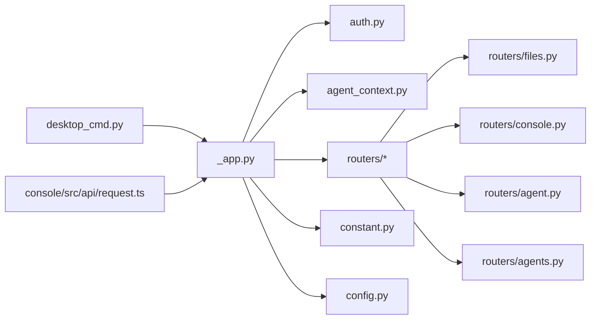

# 桌面应用API

<cite>
**本文档引用的文件**
- [desktop_cmd.py](file://src/qwenpaw/cli/desktop_cmd.py)
- [_app.py](file://src/qwenpaw/app/_app.py)
- [main.py](file://src/qwenpaw/cli/main.py)
- [config.py](file://src/qwenpaw/config/config.py)
- [files.py](file://src/qwenpaw/app/routers/files.py)
- [__init__.py](file://src/qwenpaw/app/routers/__init__.py)
- [console.py](file://src/qwenpaw/app/routers/console.py)
- [constant.py](file://src/qwenpaw/constant.py)
- [system_info.py](file://src/qwenpaw/utils/system_info.py)
- [build_macos.sh](file://scripts/pack/build_macos.sh)
- [request.ts](file://console/src/api/request.ts)
- [auth.py](file://src/qwenpaw/app/auth.py)
- [agent_context.py](file://src/qwenpaw/app/agent_context.py)
- [agent.py](file://src/qwenpaw/app/routers/agent.py)
- [agents.py](file://src/qwenpaw/app/routers/agents.py)
- [desktop.en.md](file://website/public/docs/desktop.en.md)
</cite>

## 目录
1. [简介](#简介)
2. [项目结构](#项目结构)
3. [核心组件](#核心组件)
4. [架构总览](#架构总览)
5. [详细组件分析](#详细组件分析)
6. [依赖分析](#依赖分析)
7. [性能考虑](#性能考虑)
8. [故障排查指南](#故障排查指南)
9. [结论](#结论)
10. [附录](#附录)

## 简介
本文件面向QwenPaw桌面应用的API设计与实现，聚焦桌面客户端与后端服务之间的通信接口，涵盖API客户端封装、请求处理与响应解析机制；同时记录桌面应用特有的功能接口（本地文件操作、系统集成与用户界面交互）、配置管理、数据存储与同步机制，并提供使用示例、错误处理与性能优化建议。此外，文档还说明了桌面应用与Web控制台在API层面的一致性保障与功能映射关系，以及安装配置、更新机制与故障诊断方法，并对跨平台兼容性与系统要求进行说明。

## 项目结构
桌面应用采用“命令行入口 + FastAPI后端 + 前端控制台”的分层架构：
- 命令行入口负责启动桌面窗口与后端服务进程；
- 后端服务通过FastAPI提供REST与流式SSE接口；
- 前端控制台通过统一的请求封装与认证头进行调用；
- 配置与工作目录位于用户主目录下的专用路径，支持多代理与本地模型管理。

图表来源
- [desktop_cmd.py:1-270](file://src/qwenpaw/cli/desktop_cmd.py#L1-L270)
- [_app.py:424-569](file://src/qwenpaw/app/_app.py#L424-L569)
- [__init__.py:1-60](file://src/qwenpaw/app/routers/__init__.py#L1-L60)
- [auth.py:371-441](file://src/qwenpaw/app/auth.py#L371-L441)
- [agent_context.py:28-113](file://src/qwenpaw/app/agent_context.py#L28-L113)
- [constant.py:89-120](file://src/qwenpaw/constant.py#L89-L120)
- [config.py:714-790](file://src/qwenpaw/config/config.py#L714-L790)
- [files.py:1-25](file://src/qwenpaw/app/routers/files.py#L1-L25)

章节来源
- [desktop_cmd.py:1-270](file://src/qwenpaw/cli/desktop_cmd.py#L1-L270)
- [_app.py:424-569](file://src/qwenpaw/app/_app.py#L424-L569)
- [main.py:95-171](file://src/qwenpaw/cli/main.py#L95-L171)

## 核心组件
- 桌面命令与WebView桥接：通过命令行启动后端服务并以原生WebView承载前端控制台，提供与系统浏览器一致的外部链接打开能力。
- FastAPI应用与中间件：统一注册路由、CORS、认证中间件与代理上下文，提供版本查询、静态资源与SPA回退。
- 路由模块：包含代理文件管理、控制台聊天与上传、文件预览等桌面特有接口。
- 配置与常量：集中定义工作目录、媒体目录、日志级别、CORS与重试策略等运行参数。
- 前端请求封装：统一封装fetch请求、认证头注入、错误解析与401自动跳转登录流程。

章节来源
- [desktop_cmd.py:29-182](file://src/qwenpaw/cli/desktop_cmd.py#L29-L182)
- [_app.py:424-569](file://src/qwenpaw/app/_app.py#L424-L569)
- [console.py:68-198](file://src/qwenpaw/app/routers/console.py#L68-L198)
- [files.py:9-24](file://src/qwenpaw/app/routers/files.py#L9-L24)
- [constant.py:159-181](file://src/qwenpaw/constant.py#L159-L181)
- [request.ts:60-104](file://console/src/api/request.ts#L60-L104)

## 架构总览
桌面应用的API通信链路如下：
- 前端通过统一请求封装向后端发起REST或SSE请求；
- 认证中间件根据是否启用认证与请求路径决定放行或返回401；
- 代理上下文根据请求头或路由上下文选择目标代理实例；
- 路由模块处理具体业务逻辑（聊天、文件、代理文件等）；
- 后端通过动态多代理运行器将请求委派给对应工作空间的执行器；
- 静态资源与SPA回退确保控制台页面可直接访问。

图表来源
- [request.ts:60-104](file://console/src/api/request.ts#L60-L104)
- [auth.py:371-441](file://src/qwenpaw/app/auth.py#L371-L441)
- [agent_context.py:28-113](file://src/qwenpaw/app/agent_context.py#L28-L113)
- [_app.py:64-150](file://src/qwenpaw/app/_app.py#L64-L150)
- [console.py:68-198](file://src/qwenpaw/app/routers/console.py#L68-L198)

## 详细组件分析

### 桌面命令与WebView桥接
- 功能要点
  - 自动查找空闲端口并启动后端子进程；
  - 等待HTTP就绪后创建原生WebView窗口加载URL；
  - 提供JS API桥接，允许前端调用系统默认浏览器打开外部链接；
  - 在Windows上使用后台线程避免子进程缓冲阻塞；
  - 统一日志级别并通过环境变量传递给子进程。
- 关键流程
  - 查找空闲端口 → 启动后端进程 → 等待HTTP就绪 → 创建WebView窗口 → 启动事件循环 → 清理后端进程。

图表来源
- [desktop_cmd.py:39-182](file://src/qwenpaw/cli/desktop_cmd.py#L39-L182)

章节来源
- [desktop_cmd.py:39-182](file://src/qwenpaw/cli/desktop_cmd.py#L39-L182)

### FastAPI应用与中间件
- 应用初始化
  - 设置日志级别、加载环境变量、注册CORS、认证中间件与代理上下文中间件；
  - 动态多代理运行器按请求选择代理工作空间；
  - 挂载路由集合与控制台静态资源，提供SPA回退。
- 版本查询与静态资源
  - 提供版本信息接口；
  - 支持控制台静态资源与SPA回退，避免与API路由冲突。

章节来源
- [_app.py:424-569](file://src/qwenpaw/app/_app.py#L424-L569)
- [constant.py:179-181](file://src/qwenpaw/constant.py#L179-L181)

### 路由模块与桌面特有接口
- 控制台聊天与上传
  - 支持SSE流式响应、断点续连、停止任务；
  - 文件上传限制大小、安全命名、保存至通道媒体目录；
  - 推送消息接口用于跨标签页消息拉取。
- 代理文件管理
  - 列表、读取、写入工作目录与内存目录的Markdown文件；
  - 支持代理语言设置与更新。
- 多代理管理
  - 列出代理、创建代理、重排顺序、读取/写入代理配置；
  - 读取代理描述与技能池目录。
- 文件预览
  - 安全解析绝对/相对路径，仅允许文件存在时返回。

章节来源
- [console.py:68-198](file://src/qwenpaw/app/routers/console.py#L68-L198)
- [agent.py:38-200](file://src/qwenpaw/app/routers/agent.py#L38-L200)
- [agents.py:152-200](file://src/qwenpaw/app/routers/agents.py#L152-L200)
- [files.py:9-24](file://src/qwenpaw/app/routers/files.py#L9-L24)

### 认证与授权
- 单用户注册与JWT令牌
  - 仅当启用认证且已注册用户时强制校验；
  - 支持从环境变量自动注册管理员账户；
  - 令牌过期时间、签名与校验逻辑自实现，不依赖第三方库。
- 中间件策略
  - 公共路径与静态资源免认证；
  - 仅对/api/路由进行保护；
  - 本地回环地址请求可免认证；
  - WebSocket场景支持查询参数携带令牌。

章节来源
- [auth.py:223-303](file://src/qwenpaw/app/auth.py#L223-L303)
- [auth.py:371-441](file://src/qwenpaw/app/auth.py#L371-L441)

### 代理上下文与多代理路由
- 上下文解析优先级
  - 显式参数覆盖 → 请求状态中的代理ID → 请求头X-Agent-Id → 配置中的活跃代理；
  - 校验代理存在性与启用状态，否则返回404/403。
- 动态多代理运行器
  - 根据当前代理ID获取工作空间运行器；
  - 将流式查询委派给对应执行器，异常时返回错误事件。

章节来源
- [agent_context.py:28-113](file://src/qwenpaw/app/agent_context.py#L28-L113)
- [_app.py:64-150](file://src/qwenpaw/app/_app.py#L64-L150)

### 配置管理与数据存储
- 工作目录与密钥存储
  - 工作目录优先级：历史路径 → 环境变量 → 默认路径；
  - 密钥与敏感文件采用加密存储，权限严格限制；
  - 媒体目录、插件目录、本地模型目录等均在工作目录下。
- 代理配置
  - 代理配置分为根配置与工作空间配置，支持语言、运行参数、工具与安全策略；
  - 支持内置QA代理与迁移逻辑。
- 环境变量与运行参数
  - 日志级别、CORS、LLM并发与限速、内存压缩阈值等通过环境变量控制。

章节来源
- [constant.py:89-120](file://src/qwenpaw/constant.py#L89-L120)
- [config.py:714-790](file://src/qwenpaw/config/config.py#L714-L790)
- [config.py:14-27](file://src/qwenpaw/config/config.py#L14-L27)

### 前端请求封装与错误处理
- 统一请求封装
  - 自动拼接API基础URL、注入认证头、设置Content-Type；
  - 对非JSON响应与文本响应分别处理；
  - 401时清除令牌并跳转登录。
- 错误解析
  - 从响应体中提取detail/message/error字段作为错误信息；
  - 保留原始响应体以便进一步解析结构化错误。

章节来源
- [request.ts:60-104](file://console/src/api/request.ts#L60-L104)
- [request.ts:4-37](file://console/src/api/request.ts#L4-L37)

## 依赖分析
- 组件耦合
  - CLI与后端通过子进程与端口通信，低耦合；
  - 后端通过中间件与路由解耦认证与业务逻辑；
  - 代理上下文与多代理管理通过配置驱动，便于扩展。
- 外部依赖
  - 前端：fetch、本地存储、事件流；
  - 后端：FastAPI、PyWebView（可选）、标准库密码学与加密存储。

图表来源
- [desktop_cmd.py:137-182](file://src/qwenpaw/cli/desktop_cmd.py#L137-L182)
- [_app.py:424-569](file://src/qwenpaw/app/_app.py#L424-L569)
- [auth.py:371-441](file://src/qwenpaw/app/auth.py#L371-L441)
- [agent_context.py:28-113](file://src/qwenpaw/app/agent_context.py#L28-L113)
- [__init__.py:1-60](file://src/qwenpaw/app/routers/__init__.py#L1-L60)
- [files.py:1-25](file://src/qwenpaw/app/routers/files.py#L1-L25)
- [console.py:68-198](file://src/qwenpaw/app/routers/console.py#L68-L198)
- [agent.py:38-200](file://src/qwenpaw/app/routers/agent.py#L38-L200)
- [agents.py:152-200](file://src/qwenpaw/app/routers/agents.py#L152-L200)
- [constant.py:89-120](file://src/qwenpaw/constant.py#L89-L120)
- [config.py:714-790](file://src/qwenpaw/config/config.py#L714-L790)
- [request.ts:60-104](file://console/src/api/request.ts#L60-L104)

## 性能考虑
- 启动性能
  - 首次启动需要初始化Python环境与依赖，后续启动更快；
  - 建议在空闲时段启动或使用静默模式减少干扰。
- 并发与限流
  - LLM并发数、每分钟查询上限与指数退避策略可通过环境变量调整；
  - 合理设置最大重试次数与超时，避免阻塞。
- 内存与磁盘
  - 内存压缩阈值与保留比例可调，降低上下文长度；
  - 工具结果压缩与缓存大小限制有助于控制磁盘占用。
- 网络与证书
  - 打包环境中自动设置SSL证书路径，避免HTTPS失败；
  - 代理网络不稳定时适当增加重试与超时。

## 故障排查指南
- Windows常见问题
  - 缺少Microsoft WebView2运行时导致白屏：下载安装后重启；
  - 应用无响应：使用调试模式查看终端输出；
  - 卸载：通过设置→应用→卸载。
- macOS常见问题
  - 首次启动被Gatekeeper阻止：右键“打开”或系统设置中允许；
  - 日志查看：`~/.qwenpaw/desktop.log`；
  - 卸载：删除应用并清空配置目录。
- 通用排查
  - 检查日志级别与SSL证书设置；
  - 确认代理上下文与活跃代理配置；
  - 使用前端错误解析辅助定位结构化错误。

章节来源
- [desktop.en.md:75-93](file://website/public/docs/desktop.en.md#L75-L93)
- [desktop.en.md:206-213](file://website/public/docs/desktop.en.md#L206-L213)
- [request.ts:4-37](file://console/src/api/request.ts#L4-L37)

## 结论
QwenPaw桌面应用通过清晰的命令行入口、稳定的FastAPI后端与统一的前端请求封装，实现了与Web控制台一致的API体验。其多代理与本地模型能力、严格的认证与配置管理，以及完善的日志与错误处理机制，为桌面端提供了可靠、可扩展的智能体工作平台。建议在生产部署中结合环境变量合理配置并发与限流参数，并关注首次启动性能与系统兼容性。

## 附录
- 安装与更新
  - Windows：下载安装器，按向导完成安装；
  - macOS：解压应用，按提示解除限制后使用。
- 跨平台兼容性
  - Windows 10及以上，macOS 14及以上；
  - Apple Silicon推荐用于MLX加速，Intel可使用但无法加速。
- 系统要求与硬件信息
  - 可通过系统信息工具获取操作系统、架构、CUDA版本、内存与显存信息，辅助本地模型部署决策。

章节来源
- [build_macos.sh:140-175](file://scripts/pack/build_macos.sh#L140-L175)
- [system_info.py:111-121](file://src/qwenpaw/utils/system_info.py#L111-L121)
- [desktop.en.md:33-104](file://website/public/docs/desktop.en.md#L33-L104)