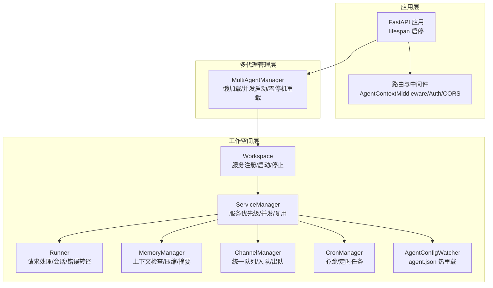
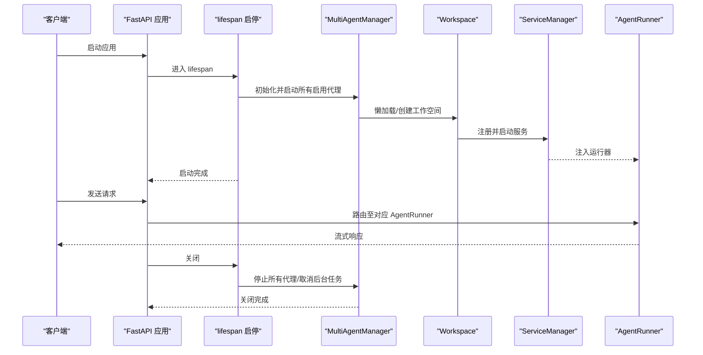
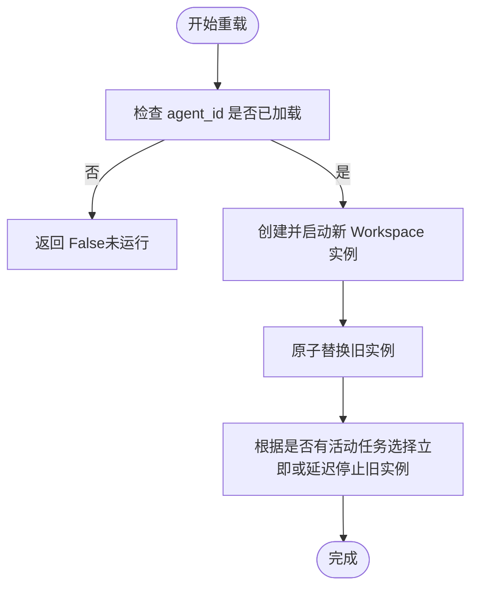
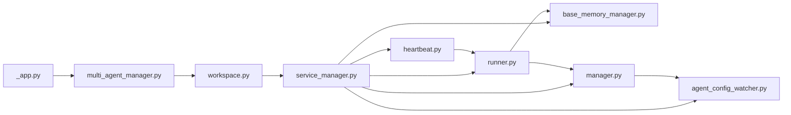

# 代理生命周期管理

<cite>
**本文引用的文件**
- [_app.py](file://src/qwenpaw/app/_app.py)
- [multi_agent_manager.py](file://src/qwenpaw/app/multi_agent_manager.py)
- [workspace.py](file://src/qwenpaw/app/workspace/workspace.py)
- [service_manager.py](file://src/qwenpaw/app/workspace/service_manager.py)
- [service_factories.py](file://src/qwenpaw/app/workspace/service_factories.py)
- [agent_config_watcher.py](file://src/qwenpaw/app/agent_config_watcher.py)
- [heartbeat.py](file://src/qwenpaw/app/crons/heartbeat.py)
- [manager.py](file://src/qwenpaw/app/channels/manager.py)
- [runner.py](file://src/qwenpaw/app/runner/runner.py)
- [bootstrap.py](file://src/qwenpaw/agents/hooks/bootstrap.py)
- [memory_compaction.py](file://src/qwenpaw/agents/hooks/memory_compaction.py)
- [base_memory_manager.py](file://src/qwenpaw/agents/memory/base_memory_manager.py)
- [agent_context.py](file://src/qwenpaw/app/agent_context.py)
- [daemon_commands.py](file://src/qwenpaw/app/runner/daemon_commands.py)
</cite>

## 目录
1. [引言](#引言)
2. [项目结构](#项目结构)
3. [核心组件](#核心组件)
4. [架构总览](#架构总览)
5. [详细组件分析](#详细组件分析)
6. [依赖分析](#依赖分析)
7. [性能考虑](#性能考虑)
8. [故障排查指南](#故障排查指南)
9. [结论](#结论)
10. [附录：代码示例与最佳实践](#附录代码示例与最佳实践)

## 引言
本技术文档围绕 QwenPaw 的“代理生命周期管理”主题，系统性阐述从代理创建、启动、运行、监控到销毁的全生命周期流程；重点解析以下方面：
- 多代理管理器对单个代理工作空间的生命周期编排
- 配置监视器对 agent.json 的变更检测、热重载与状态同步
- 代理钩子系统（引导钩子、内存压缩钩子等）在推理前后的扩展机制
- 代理状态监控与健康检查（心跳、通道队列、任务跟踪）
- 生命周期管理与其他系统组件（通道、定时任务、MCP、聊天存储）的集成关系
- 最佳实践：资源清理、错误处理、优雅关闭与零停机重载

## 项目结构
QwenPaw 将每个“代理实例”封装为独立的“工作空间”，由多代理管理器统一调度。应用启动时加载全局配置，初始化多代理管理器，并并发启动所有启用的代理；代理内部通过服务管理器装配运行器、内存管理、通道、定时任务、配置监视器等组件。

图示来源
- [_app.py:424-569](file://src/qwenpaw/app/_app.py#L424-L569)
- [multi_agent_manager.py:21-90](file://src/qwenpaw/app/multi_agent_manager.py#L21-L90)
- [workspace.py:47-120](file://src/qwenpaw/app/workspace/workspace.py#L47-L120)
- [service_manager.py:74-120](file://src/qwenpaw/app/workspace/service_manager.py#L74-L120)

章节来源
- [_app.py:166-423](file://src/qwenpaw/app/_app.py#L166-L423)
- [multi_agent_manager.py:21-90](file://src/qwenpaw/app/multi_agent_manager.py#L21-L90)

## 核心组件
- 多代理管理器（MultiAgentManager）：负责按需创建、并发启动、零停机重载与优雅停止单个代理工作空间；提供预加载、批量启动、清理后台任务等能力。
- 工作空间（Workspace）：封装单个代理的完整运行时，包含运行器、内存管理、通道、定时任务、配置监视器等服务；通过服务描述符声明式注册与启动。
- 服务管理器（ServiceManager）：统一管理服务的生命周期、依赖顺序、并发启动、可复用组件传递与停止策略。
- 运行器（AgentRunner）：接收请求、构建会话、注入工具与MCP客户端、执行推理、持久化会话状态、错误转译与清理。
- 配置监视器（AgentConfigWatcher）：轮询 agent.json 变更，自动热重载通道与心跳配置。
- 心跳（CronManager + heartbeat）：周期性读取 HEARTBEAT.md 并触发代理执行，支持按时间段与目标通道分发。
- 通道管理器（ChannelManager）：统一入队/出队、批量合并、优先级控制、替换通道与优雅停止。
- 内存管理（BaseMemoryManager 及其实现）：上下文检查、工具结果压缩、摘要生成、异步摘要任务管理。
- 钩子系统（BootstrapHook、MemoryCompactionHook）：在推理前注入引导提示或进行上下文压缩。

章节来源
- [multi_agent_manager.py:21-90](file://src/qwenpaw/app/multi_agent_manager.py#L21-L90)
- [workspace.py:47-120](file://src/qwenpaw/app/workspace/workspace.py#L47-L120)
- [service_manager.py:74-120](file://src/qwenpaw/app/workspace/service_manager.py#L74-L120)
- [runner.py:70-120](file://src/qwenpaw/app/runner/runner.py#L70-L120)
- [agent_config_watcher.py:35-96](file://src/qwenpaw/app/agent_config_watcher.py#L35-L96)
- [heartbeat.py:119-213](file://src/qwenpaw/app/crons/heartbeat.py#L119-L213)
- [manager.py:68-120](file://src/qwenpaw/app/channels/manager.py#L68-L120)
- [base_memory_manager.py:21-60](file://src/qwenpaw/agents/memory/base_memory_manager.py#L21-L60)
- [bootstrap.py:20-60](file://src/qwenpaw/agents/hooks/bootstrap.py#L20-L60)
- [memory_compaction.py:27-70](file://src/qwenpaw/agents/hooks/memory_compaction.py#L27-L70)

## 架构总览
下图展示应用启动、代理加载、请求路由与生命周期结束的整体流程。

图示来源
- [_app.py:166-423](file://src/qwenpaw/app/_app.py#L166-L423)
- [multi_agent_manager.py:407-464](file://src/qwenpaw/app/multi_agent_manager.py#L407-L464)
- [workspace.py:322-380](file://src/qwenpaw/app/workspace/workspace.py#L322-L380)
- [service_manager.py:171-200](file://src/qwenpaw/app/workspace/service_manager.py#L171-L200)
- [runner.py:349-598](file://src/qwenpaw/app/runner/runner.py#L349-L598)

## 详细组件分析

### 多代理管理器（MultiAgentManager）
- 懒加载：首次访问某 agent_id 才创建并启动其工作空间
- 并发启动：根据配置过滤启用的代理，使用 gather 并发启动
- 零停机重载：先创建新实例并启动，再原子替换旧实例，最后在后台安全清理旧实例
- 优雅停止：取消待完成清理任务，逐个停止代理，清空缓存映射

图示来源
- [multi_agent_manager.py:208-319](file://src/qwenpaw/app/multi_agent_manager.py#L208-L319)

章节来源
- [multi_agent_manager.py:208-319](file://src/qwenpaw/app/multi_agent_manager.py#L208-L319)

### 工作空间（Workspace）
- 服务注册：通过 ServiceDescriptor 声明式注册运行器、内存管理、MCP、聊天、通道、定时任务、配置监视器等
- 启动流程：先加载配置，再按优先级并发/顺序启动服务；支持复用组件（如内存管理、聊天管理）
- 停止流程：按优先级逆序停止，可选择是否停止可复用组件

章节来源
- [workspace.py:142-289](file://src/qwenpaw/app/workspace/workspace.py#L142-L289)
- [service_factories.py:64-108](file://src/qwenpaw/app/workspace/service_factories.py#L64-L108)
- [service_manager.py:171-200](file://src/qwenpaw/app/workspace/service_manager.py#L171-L200)

### 服务管理器（ServiceManager）
- 描述符驱动：以 ServiceDescriptor 组织服务类、初始化参数、后置初始化、启动/停止方法、可复用性、依赖与优先级
- 启动策略：同优先级并发，不同优先级顺序；可选择并发初始化
- 停止策略：可复用服务在非最终停止时跳过，避免重复销毁
- 可复用组件：支持在新实例中注入旧实例的可复用组件，减少重启成本

章节来源
- [service_manager.py:30-72](file://src/qwenpaw/app/workspace/service_manager.py#L30-L72)
- [service_manager.py:171-200](file://src/qwenpaw/app/workspace/service_manager.py#L171-L200)
- [service_manager.py:330-421](file://src/qwenpaw/app/workspace/service_manager.py#L330-L421)

### 运行器（AgentRunner）
- 请求处理：解析命令、注入会话、构建 QwenPawAgent、流式输出消息
- 会话与聊天：自动注册/触碰聊天记录，保存会话状态
- 错误处理：捕获模型异常并写入调试快照，转换为统一异常类型
- 控制命令：支持 /daemon restart 等命令，调用多代理管理器执行零停机重载

章节来源
- [runner.py:349-598](file://src/qwenpaw/app/runner/runner.py#L349-L598)
- [runner.py:709-735](file://src/qwenpaw/app/runner/runner.py#L709-L735)
- [daemon_commands.py:129-165](file://src/qwenpaw/app/runner/daemon_commands.py#L129-L165)

### 配置监视器（AgentConfigWatcher）
- 轮询 agent.json：基于 mtime 与哈希对比检测变更
- 热重载：逐通道替换、心跳重新调度；失败回滚
- 适用范围：仅在存在通道或定时任务时创建

章节来源
- [agent_config_watcher.py:35-96](file://src/qwenpaw/app/agent_config_watcher.py#L35-L96)
- [agent_config_watcher.py:252-278](file://src/qwenpaw/app/agent_config_watcher.py#L252-L278)

### 心跳与定时任务（CronManager + heartbeat）
- 解析心跳间隔/表达式：支持 cron 表达式与“每 N 分钟/小时/秒”
- 时间窗口：按用户时区与活跃时段判断是否执行
- 执行路径：读取 HEARTBEAT.md 作为查询文本，调用 Runner 流式执行；可选将事件回发至上次分发的目标通道

章节来源
- [heartbeat.py:48-117](file://src/qwenpaw/app/crons/heartbeat.py#L48-L117)
- [heartbeat.py:119-213](file://src/qwenpaw/app/crons/heartbeat.py#L119-L213)

### 通道管理器（ChannelManager）
- 入队/出队：统一队列管理器，按通道+会话+优先级路由；支持批量合并与超时保护
- 替换通道：新旧通道原子替换，保证零停机
- 优雅停止：取消挂起入队任务，停止队列与各通道

章节来源
- [manager.py:349-361](file://src/qwenpaw/app/channels/manager.py#L349-L361)
- [manager.py:571-630](file://src/qwenpaw/app/channels/manager.py#L571-L630)
- [manager.py:479-526](file://src/qwenpaw/app/channels/manager.py#L479-L526)

### 内存管理（BaseMemoryManager 及其实现）
- 接口职责：上下文检查、工具结果压缩、摘要生成、异步摘要任务管理、检索接口
- 钩子配合：MemoryCompactionHook 在推理前检查上下文并触发压缩/摘要

章节来源
- [base_memory_manager.py:21-60](file://src/qwenpaw/agents/memory/base_memory_manager.py#L21-L60)
- [memory_compaction.py:62-214](file://src/qwenpaw/agents/hooks/memory_compaction.py#L62-L214)

### 钩子系统（BootstrapHook、MemoryCompactionHook）
- BootstrapHook：首次用户交互时，从工作目录读取引导文件，向第一条用户消息前置引导内容
- MemoryCompactionHook：在推理前评估上下文占用，必要时压缩历史消息并更新压缩摘要

章节来源
- [bootstrap.py:20-104](file://src/qwenpaw/agents/hooks/bootstrap.py#L20-L104)
- [memory_compaction.py:27-70](file://src/qwenpaw/agents/hooks/memory_compaction.py#L27-L70)

## 依赖分析
- 应用层依赖多代理管理器；多代理管理器依赖工作空间；工作空间依赖服务管理器；服务管理器装配运行器、内存管理、通道、定时任务、配置监视器等。
- 运行器依赖聊天管理、MCP 管理器、会话持久化；通道管理器依赖统一队列管理器；心跳依赖配置函数与 Runner。
- 配置监视器依赖通道管理器与定时任务管理器；内存管理器被运行器与钩子共同使用。

图示来源
- [_app.py:204-234](file://src/qwenpaw/app/_app.py#L204-L234)
- [workspace.py:142-289](file://src/qwenpaw/app/workspace/workspace.py#L142-L289)
- [service_manager.py:171-200](file://src/qwenpaw/app/workspace/service_manager.py#L171-L200)
- [runner.py:446-470](file://src/qwenpaw/app/runner/runner.py#L446-L470)
- [manager.py:447-478](file://src/qwenpaw/app/channels/manager.py#L447-L478)
- [heartbeat.py:119-141](file://src/qwenpaw/app/crons/heartbeat.py#L119-L141)
- [agent_config_watcher.py:111-138](file://src/qwenpaw/app/agent_config_watcher.py#L111-L138)

章节来源
- [agent_context.py:52-93](file://src/qwenpaw/app/agent_context.py#L52-L93)

## 性能考虑
- 并发启动：多代理管理器并发启动启用的代理，显著缩短冷启动时间
- 可复用组件：零停机重载时复用内存管理与聊天管理，降低重建开销
- 统一队列：通道入队采用统一队列与批量合并，减少频繁调度与上下文切换
- 上下文压缩：在推理前进行上下文检查与压缩，避免超出模型上下文限制导致的失败
- 异步摘要：后台异步生成摘要，不阻塞主线推理流程

## 故障排查指南
- 启动失败：检查多代理管理器的日志，定位具体代理启动异常；确认配置文件与工作空间目录权限
- 零停机重载失败：查看新实例启动日志；若失败会尽力清理新实例并保留旧实例继续服务
- 通道替换失败：确认新通道启动成功后再进行替换；检查队列清理循环是否正常
- 心跳未执行：核对 HEARTBEAT.md 文件是否存在、用户时区与活跃时段设置；检查 Runner 流式执行是否超时
- 内存压缩无效：检查上下文阈值与保留数量配置；确认工具结果压缩阈值设置合理

章节来源
- [multi_agent_manager.py:282-296](file://src/qwenpaw/app/multi_agent_manager.py#L282-L296)
- [manager.py:571-630](file://src/qwenpaw/app/channels/manager.py#L571-L630)
- [heartbeat.py:119-141](file://src/qwenpaw/app/crons/heartbeat.py#L119-L141)
- [memory_compaction.py:128-141](file://src/qwenpaw/agents/hooks/memory_compaction.py#L128-L141)

## 结论
QwenPaw 的代理生命周期管理以“工作空间 + 服务管理器”的架构为核心，结合多代理管理器的懒加载与零停机重载能力，实现了高可用、可观测且可扩展的代理运行时。配置监视器与钩子系统进一步增强了运行期的自愈与智能化能力。通过合理的并发策略、可复用组件与优雅关闭流程，系统在保证稳定性的同时兼顾了性能与运维效率。

## 附录：代码示例与最佳实践

### 如何管理代理生命周期（示例路径）
- 启动所有启用的代理
  - [start_all_configured_agents:407-464](file://src/qwenpaw/app/multi_agent_manager.py#L407-L464)
- 获取指定代理实例（懒加载）
  - [get_agent:38-90](file://src/qwenpaw/app/multi_agent_manager.py#L38-L90)
- 零停机重载指定代理
  - [reload_agent:208-319](file://src/qwenpaw/app/multi_agent_manager.py#L208-L319)
- 停止所有代理（优雅关闭）
  - [stop_all:346-370](file://src/qwenpaw/app/multi_agent_manager.py#L346-L370)
- 在运行器中执行零停机重载（/daemon restart）
  - [run_daemon_restart:129-165](file://src/qwenpaw/app/runner/daemon_commands.py#L129-L165)
- 通过请求路由到指定代理（AgentContextMiddleware）
  - [get_current_agent_id:52-93](file://src/qwenpaw/app/agent_context.py#L52-L93)

### 配置监视器与热重载（示例路径）
- 启动配置监视器
  - [create_agent_config_watcher:111-138](file://src/qwenpaw/app/workspace/service_factories.py#L111-L138)
- 轮询与变更检测
  - [start/stop/_poll_loop/_check:74-96](file://src/qwenpaw/app/agent_config_watcher.py#L74-L96)
  - [AgentConfigWatcher:252-278](file://src/qwenpaw/app/agent_config_watcher.py#L252-L278)
- 通道热重载
  - [replace_channel:571-630](file://src/qwenpaw/app/channels/manager.py#L571-L630)

### 钩子系统（示例路径）
- 引导钩子（首次交互注入引导）
  - [BootstrapHook:20-104](file://src/qwenpaw/agents/hooks/bootstrap.py#L20-L104)
- 内存压缩钩子（推理前上下文压缩）
  - [MemoryCompactionHook:27-214](file://src/qwenpaw/agents/hooks/memory_compaction.py#L27-L214)

### 最佳实践
- 资源清理
  - 在应用关闭阶段调用 MultiAgentManager.stop_all，确保取消后台清理任务并停止所有代理
  - 通道管理器在停止时取消挂起入队任务并停止队列与各通道
- 错误处理
  - 运行器捕获模型异常并写入调试快照，转换为统一异常类型，便于前端与日志定位
  - 配置监视器在热重载失败时回滚到旧配置，保证服务连续性
- 优雅关闭
  - 使用零停机重载替代直接进程重启，确保在线请求平滑过渡
  - 在心跳与定时任务中设置超时保护，避免长时间阻塞