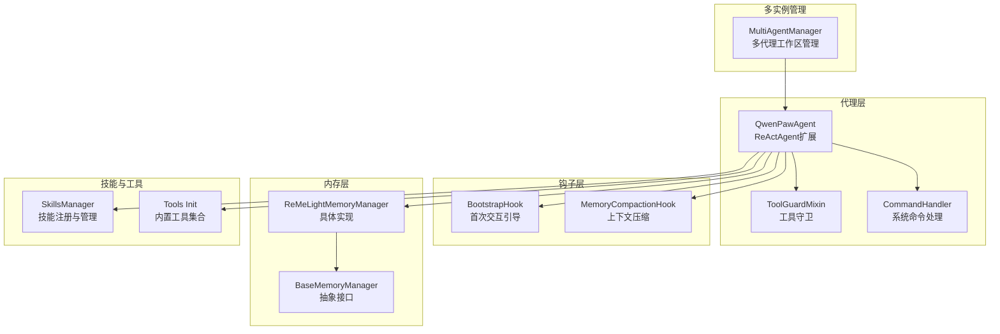
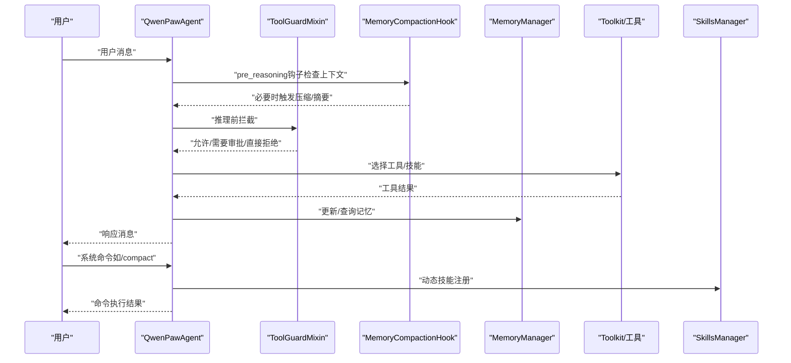
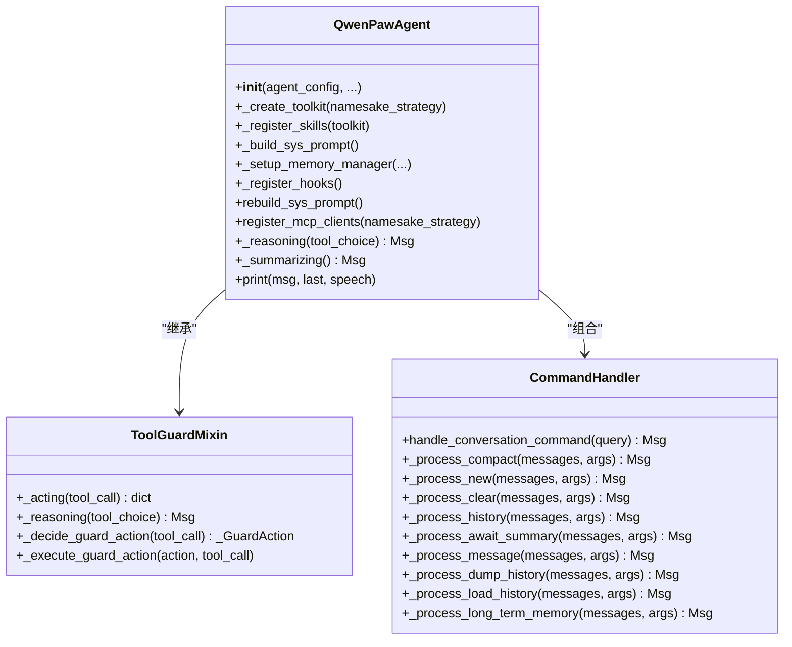
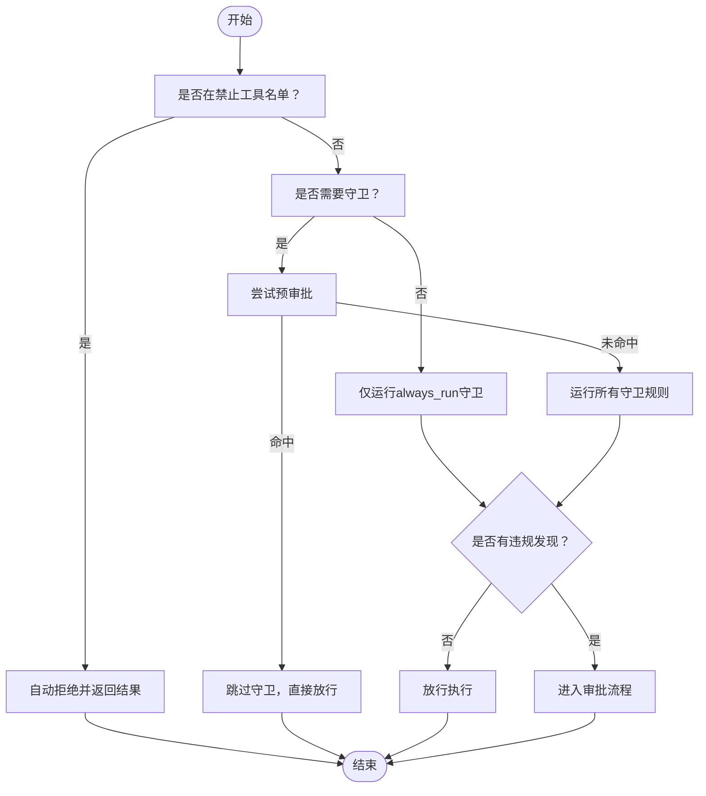
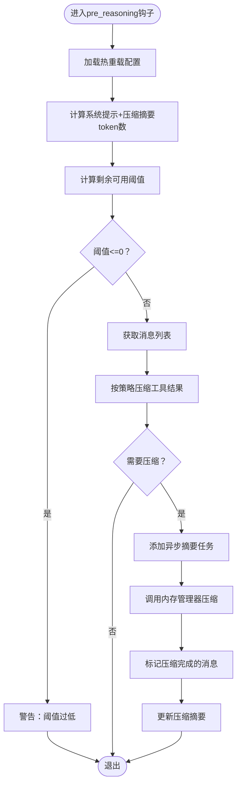
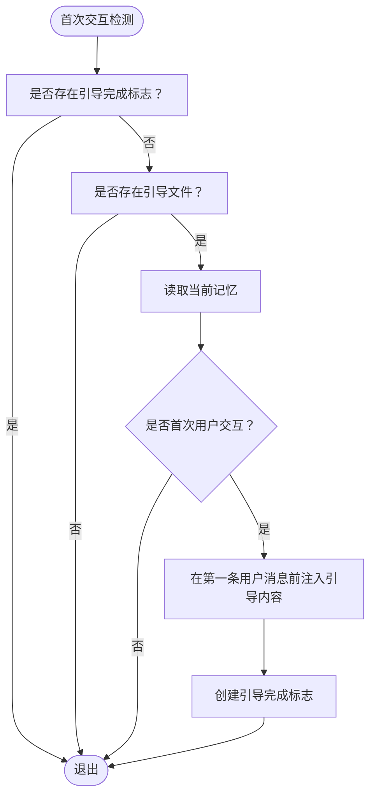
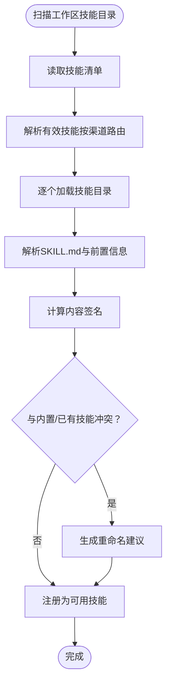
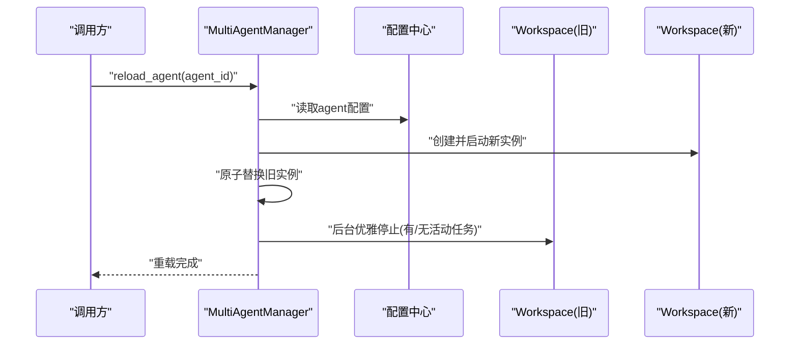
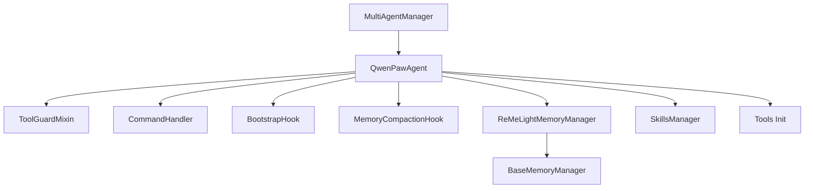

# 代理管理系统

<cite>
**本文档引用的文件**
- [react_agent.py](file://src/qwenpaw/agents/react_agent.py)
- [tool_guard_mixin.py](file://src/qwenpaw/agents/tool_guard_mixin.py)
- [command_handler.py](file://src/qwenpaw/agents/command_handler.py)
- [base_memory_manager.py](file://src/qwenpaw/agents/memory/base_memory_manager.py)
- [reme_light_memory_manager.py](file://src/qwenpaw/agents/memory/reme_light_memory_manager.py)
- [bootstrap.py](file://src/qwenpaw/agents/hooks/bootstrap.py)
- [memory_compaction.py](file://src/qwenpaw/agents/hooks/memory_compaction.py)
- [skills_manager.py](file://src/qwenpaw/agents/skills_manager.py)
- [multi_agent_manager.py](file://src/qwenpaw/app/multi_agent_manager.py)
- [constant.py](file://src/qwenpaw/constant.py)
- [config.py](file://src/qwenpaw/config/config.py)
- [__init__.py](file://src/qwenpaw/agents/tools/__init__.py)
</cite>

## 目录
1. [简介](#简介)
2. [项目结构](#项目结构)
3. [核心组件](#核心组件)
4. [架构总览](#架构总览)
5. [详细组件分析](#详细组件分析)
6. [依赖关系分析](#依赖关系分析)
7. [性能考虑](#性能考虑)
8. [故障排除指南](#故障排除指南)
9. [结论](#结论)
10. [附录](#附录)

## 简介
本文件面向QwenPaw的代理管理系统，系统化阐述智能代理的核心概念与ReAct框架实现，包括思考-行动-观察循环机制；详解代理的创建、配置与生命周期管理（含状态监控与错误处理）；说明多代理协作机制（通信协议与协调策略）；解释代理钩子系统（引导钩子与内存压缩钩子）；给出代理配置最佳实践（参数调优与性能优化）；并提供代理与技能系统、工具系统、内存系统的集成关系说明及故障排除指南。

## 项目结构
QwenPaw的代理系统围绕“智能体 + 钩子 + 内存 + 技能 + 工具 + 多实例管理”的架构展开，前端通过控制台/频道接入，后端以ReActAgent为核心，结合内存压缩钩子、引导钩子、工具守卫与命令处理器，形成可扩展、可观测、可协作的代理体系。

图示来源
- [react_agent.py:69-182](file://src/qwenpaw/agents/react_agent.py#L69-L182)
- [tool_guard_mixin.py:45-71](file://src/qwenpaw/agents/tool_guard_mixin.py#L45-L71)
- [command_handler.py:62-84](file://src/qwenpaw/agents/command_handler.py#L62-L84)
- [base_memory_manager.py:21-56](file://src/qwenpaw/agents/memory/base_memory_manager.py#L21-L56)
- [reme_light_memory_manager.py:38-64](file://src/qwenpaw/agents/memory/reme_light_memory_manager.py#L38-L64)
- [skills_manager.py:120-144](file://src/qwenpaw/agents/skills_manager.py#L120-L144)
- [multi_agent_manager.py:21-36](file://src/qwenpaw/app/multi_agent_manager.py#L21-L36)

章节来源
- [react_agent.py:1-1058](file://src/qwenpaw/agents/react_agent.py#L1-L1058)
- [multi_agent_manager.py:1-470](file://src/qwenpaw/app/multi_agent_manager.py#L1-L470)

## 核心组件
- QwenPawAgent：基于ReActAgent扩展的主代理类，集成工具、技能、内存管理、引导钩子、内存压缩钩子、命令处理与工具守卫拦截。
- ToolGuardMixin：在推理与行动阶段插入工具守卫拦截，支持预审批、风险检测与人工审批流程。
- CommandHandler：处理系统命令（如/compact、/new、/clear等），提供对话历史管理与调试能力。
- MemoryCompactionHook：在推理前检查上下文长度，必要时触发内存压缩与摘要生成。
- BootstrapHook：首次用户交互时自动注入引导提示，帮助建立代理身份与偏好。
- BaseMemoryManager/ReMeLightMemoryManager：抽象与具体内存管理实现，负责上下文压缩、摘要生成、向量检索与后台任务管理。
- SkillsManager：从工作区动态加载与注册技能，支持冲突检测、签名校验与环境变量注入。
- MultiAgentManager：多代理工作区的懒加载、零停机热重载与生命周期管理。

章节来源
- [react_agent.py:69-182](file://src/qwenpaw/agents/react_agent.py#L69-L182)
- [tool_guard_mixin.py:45-71](file://src/qwenpaw/agents/tool_guard_mixin.py#L45-L71)
- [command_handler.py:62-84](file://src/qwenpaw/agents/command_handler.py#L62-L84)
- [memory_compaction.py:27-83](file://src/qwenpaw/agents/hooks/memory_compaction.py#L27-L83)
- [bootstrap.py:20-55](file://src/qwenpaw/agents/hooks/bootstrap.py#L20-L55)
- [base_memory_manager.py:21-56](file://src/qwenpaw/agents/memory/base_memory_manager.py#L21-L56)
- [reme_light_memory_manager.py:38-64](file://src/qwenpaw/agents/memory/reme_light_memory_manager.py#L38-L64)
- [skills_manager.py:120-144](file://src/qwenpaw/agents/skills_manager.py#L120-L144)
- [multi_agent_manager.py:21-36](file://src/qwenpaw/app/multi_agent_manager.py#L21-L36)

## 架构总览
下图展示了ReAct代理在一次完整对话中的思考-行动-观察循环，以及与工具守卫、钩子、内存与命令系统的交互路径。

图示来源
- [react_agent.py:425-454](file://src/qwenpaw/agents/react_agent.py#L425-L454)
- [tool_guard_mixin.py:261-314](file://src/qwenpaw/agents/tool_guard_mixin.py#L261-L314)
- [command_handler.py:499-525](file://src/qwenpaw/agents/command_handler.py#L499-L525)
- [memory_compaction.py:62-83](file://src/qwenpaw/agents/hooks/memory_compaction.py#L62-L83)
- [reme_light_memory_manager.py:267-287](file://src/qwenpaw/agents/memory/reme_light_memory_manager.py#L267-L287)

## 详细组件分析

### QwenPawAgent：ReAct代理实现与生命周期
- 初始化流程：构建系统提示、创建模型与格式化器、注册工具与技能、初始化内存管理与命令处理器，并注册钩子。
- 推理与行动：重写推理与摘要生成方法，增加对多媒体块的主动/被动过滤，确保模型能力不匹配时的稳健性。
- MCP客户端：支持HTTP/STDIO状态客户端的恢复与重建，保证工具链稳定。
- 系统命令：通过CommandHandler处理/compact、/new、/clear、/history等命令，提供调试与运维能力。

图示来源
- [react_agent.py:69-182](file://src/qwenpaw/agents/react_agent.py#L69-L182)
- [tool_guard_mixin.py:45-71](file://src/qwenpaw/agents/tool_guard_mixin.py#L45-L71)
- [command_handler.py:62-84](file://src/qwenpaw/agents/command_handler.py#L62-L84)

章节来源
- [react_agent.py:89-182](file://src/qwenpaw/agents/react_agent.py#L89-L182)
- [react_agent.py:478-659](file://src/qwenpaw/agents/react_agent.py#L478-L659)
- [react_agent.py:675-800](file://src/qwenpaw/agents/react_agent.py#L675-L800)

### 工具守卫系统：deny/guard/approve 流程
- 拦截点：在推理与行动阶段插入锁保护的决策逻辑，避免并发竞态。
- 决策流程：先判定是否在“禁止工具”名单；再判断是否需要守卫；最后根据预审批与规则引擎决定放行、进入审批或直接拒绝。
- 审批队列：记录待审批项，支持会话维度的取消与合并，保障用户体验与安全性。

图示来源
- [tool_guard_mixin.py:316-371](file://src/qwenpaw/agents/tool_guard_mixin.py#L316-L371)
- [tool_guard_mixin.py:372-396](file://src/qwenpaw/agents/tool_guard_mixin.py#L372-L396)
- [tool_guard_mixin.py:497-616](file://src/qwenpaw/agents/tool_guard_mixin.py#L497-L616)

章节来源
- [tool_guard_mixin.py:261-314](file://src/qwenpaw/agents/tool_guard_mixin.py#L261-L314)
- [tool_guard_mixin.py:316-396](file://src/qwenpaw/agents/tool_guard_mixin.py#L316-L396)
- [tool_guard_mixin.py:497-616](file://src/qwenpaw/agents/tool_guard_mixin.py#L497-L616)

### 内存压缩钩子：上下文窗口管理
- 触发条件：在推理前检查系统提示+压缩摘要+消息的总token数是否超过阈值。
- 压缩策略：保留最近N条消息，对更早的历史进行摘要压缩；支持工具结果的字节级截断与保留策略。
- 异步摘要：后台启动摘要任务，避免阻塞主线推理；提供等待与汇总结果的能力。

图示来源
- [memory_compaction.py:62-83](file://src/qwenpaw/agents/hooks/memory_compaction.py#L62-L83)
- [memory_compaction.py:115-141](file://src/qwenpaw/agents/hooks/memory_compaction.py#L115-L141)
- [memory_compaction.py:167-202](file://src/qwenpaw/agents/hooks/memory_compaction.py#L167-L202)

章节来源
- [memory_compaction.py:62-214](file://src/qwenpaw/agents/hooks/memory_compaction.py#L62-L214)
- [base_memory_manager.py:73-82](file://src/qwenpaw/agents/memory/base_memory_manager.py#L73-L82)
- [base_memory_manager.py:116-139](file://src/qwenpaw/agents/memory/base_memory_manager.py#L116-L139)

### 引导钩子：首次交互指导
- 触发条件：检测到首次用户交互且存在引导文件。
- 行为：在第一条用户消息前注入引导内容，帮助建立代理身份与偏好；完成后写入完成标志，避免重复触发。

图示来源
- [bootstrap.py:42-104](file://src/qwenpaw/agents/hooks/bootstrap.py#L42-L104)

章节来源
- [bootstrap.py:20-104](file://src/qwenpaw/agents/hooks/bootstrap.py#L20-L104)

### 技能系统：动态加载与冲突管理
- 加载策略：从工作区skills目录解析SKILL.md，构建技能清单；支持内置技能与自定义技能混合。
- 冲突检测：基于内容签名比较，提供重命名建议；支持批量导入与冲突解决。
- 环境注入：根据技能声明的环境需求，注入受控的环境变量，确保运行时一致性。

图示来源
- [skills_manager.py:120-144](file://src/qwenpaw/agents/skills_manager.py#L120-L144)
- [skills_manager.py:207-247](file://src/qwenpaw/agents/skills_manager.py#L207-L247)
- [skills_manager.py:755-776](file://src/qwenpaw/agents/skills_manager.py#L755-L776)

章节来源
- [skills_manager.py:120-144](file://src/qwenpaw/agents/skills_manager.py#L120-L144)
- [skills_manager.py:207-247](file://src/qwenpaw/agents/skills_manager.py#L207-L247)
- [skills_manager.py:755-776](file://src/qwenpaw/agents/skills_manager.py#L755-L776)

### 多代理协作：零停机热重载与共享资源
- 懒加载：首次请求才创建并启动工作区实例。
- 零停机重载：新实例完全启动后原子替换旧实例，旧实例在后台清理，保证服务连续性。
- 可复用组件：支持在重载前后传递服务管理器中的可复用组件，减少初始化成本。

图示来源
- [multi_agent_manager.py:208-320](file://src/qwenpaw/app/multi_agent_manager.py#L208-L320)
- [multi_agent_manager.py:91-187](file://src/qwenpaw/app/multi_agent_manager.py#L91-L187)

章节来源
- [multi_agent_manager.py:21-470](file://src/qwenpaw/app/multi_agent_manager.py#L21-L470)

### 工具系统：内置工具与外部工具集成
- 内置工具：文件读写、搜索、终端执行、浏览器控制、截图、媒体查看、时间与时区、令牌用量统计等。
- 工具注册：根据配置启用/禁用工具，支持异步执行与后台任务管理工具的自动注册。
- 外部工具：通过MCP客户端注册，支持HTTP/STDIO传输，具备断线重连与重建能力。

章节来源
- [react_agent.py:183-304](file://src/qwenpaw/agents/react_agent.py#L183-L304)
- [react_agent.py:478-659](file://src/qwenpaw/agents/react_agent.py#L478-L659)
- [__init__.py:1-48](file://src/qwenpaw/agents/tools/__init__.py#L1-L48)

## 依赖关系分析
- 组件耦合：QwenPawAgent通过组合与继承方式整合工具守卫、命令处理、钩子与内存管理；与技能系统通过Toolkit解耦。
- 外部依赖：内存管理依赖ReMeLight；工具守卫依赖安全模块；MCP客户端依赖外部进程或HTTP服务。
- 循环依赖：未见直接循环导入；钩子与内存管理通过回调与接口解耦。

图示来源
- [react_agent.py:69-182](file://src/qwenpaw/agents/react_agent.py#L69-L182)
- [multi_agent_manager.py:21-36](file://src/qwenpaw/app/multi_agent_manager.py#L21-L36)
- [base_memory_manager.py:21-56](file://src/qwenpaw/agents/memory/base_memory_manager.py#L21-L56)
- [reme_light_memory_manager.py:38-64](file://src/qwenpaw/agents/memory/reme_light_memory_manager.py#L38-L64)

章节来源
- [react_agent.py:69-182](file://src/qwenpaw/agents/react_agent.py#L69-L182)
- [multi_agent_manager.py:21-36](file://src/qwenpaw/app/multi_agent_manager.py#L21-L36)

## 性能考虑
- 上下文压缩阈值：合理设置最大输入长度与压缩比率，避免频繁压缩导致的性能抖动。
- 并发与限流：LLM并发与QPM限制需与API配额匹配，避免429与超时。
- 工具结果截断：对大输出进行分段截断与保留策略，降低内存与网络压力。
- 异步摘要：后台摘要任务避免阻塞主线推理，但需关注任务堆积与资源占用。
- 模型能力适配：当模型不支持多媒体时，主动剥离媒体块，减少失败重试。

章节来源
- [config.py:453-606](file://src/qwenpaw/config/config.py#L453-L606)
- [constant.py:220-283](file://src/qwenpaw/constant.py#L220-L283)
- [reme_light_memory_manager.py:289-301](file://src/qwenpaw/agents/memory/reme_light_memory_manager.py#L289-L301)
- [react_agent.py:675-784](file://src/qwenpaw/agents/react_agent.py#L675-L784)

## 故障排除指南
- 工具守卫拦截：若工具被自动拒绝，检查“禁止工具”名单与规则引擎日志；使用预审批或调整规则。
- 内存压缩失败：检查阈值设置与摘要生成日志；必要时使用/new或/clear清空上下文。
- 引导钩子无效：确认引导文件存在且为首次交互；检查引导完成标志是否被提前创建。
- MCP客户端异常：查看断线/重建日志；确认外部工具服务可用性与认证配置。
- 技能冲突：根据冲突建议重命名或迁移技能；核对签名与前置要求。
- 多代理重载失败：关注旧实例清理任务与新实例启动日志；确保配置正确与资源充足。

章节来源
- [tool_guard_mixin.py:447-496](file://src/qwenpaw/agents/tool_guard_mixin.py#L447-L496)
- [command_handler.py:116-160](file://src/qwenpaw/agents/command_handler.py#L116-L160)
- [bootstrap.py:56-104](file://src/qwenpaw/agents/hooks/bootstrap.py#L56-L104)
- [react_agent.py:543-559](file://src/qwenpaw/agents/react_agent.py#L543-L559)
- [skills_manager.py:778-798](file://src/qwenpaw/agents/skills_manager.py#L778-L798)
- [multi_agent_manager.py:282-296](file://src/qwenpaw/app/multi_agent_manager.py#L282-L296)

## 结论
QwenPaw的代理管理系统以ReAct框架为核心，结合工具守卫、钩子、内存压缩与多代理管理，实现了高可用、可扩展、可协作的智能体平台。通过合理的配置与参数调优，可在不同场景下平衡性能与稳定性；借助命令处理与调试工具，能够快速定位与解决问题。

## 附录
- 代理创建与管理示例（路径参考）
  - 创建代理：[react_agent.py:89-182](file://src/qwenpaw/agents/react_agent.py#L89-L182)
  - 注册工具与技能：[react_agent.py:183-341](file://src/qwenpaw/agents/react_agent.py#L183-L341)
  - 启用内存管理与钩子：[react_agent.py:425-454](file://src/qwenpaw/agents/react_agent.py#L425-L454)
  - 工具守卫拦截流程：[tool_guard_mixin.py:261-314](file://src/qwenpaw/agents/tool_guard_mixin.py#L261-L314)
  - 系统命令处理：[command_handler.py:499-525](file://src/qwenpaw/agents/command_handler.py#L499-L525)
  - 内存压缩钩子：[memory_compaction.py:62-214](file://src/qwenpaw/agents/hooks/memory_compaction.py#L62-L214)
  - 引导钩子：[bootstrap.py:42-104](file://src/qwenpaw/agents/hooks/bootstrap.py#L42-L104)
  - 技能管理：[skills_manager.py:120-144](file://src/qwenpaw/agents/skills_manager.py#L120-L144)
  - 多代理管理：[multi_agent_manager.py:208-320](file://src/qwenpaw/app/multi_agent_manager.py#L208-L320)
  - 内存管理接口与实现：[base_memory_manager.py:21-226](file://src/qwenpaw/agents/memory/base_memory_manager.py#L21-L226)、[reme_light_memory_manager.py:38-438](file://src/qwenpaw/agents/memory/reme_light_memory_manager.py#L38-L438)
  - 常量与配置：[constant.py:196-307](file://src/qwenpaw/constant.py#L196-L307)、[config.py:453-712](file://src/qwenpaw/config/config.py#L453-L712)
  - 工具集合：[__init__.py:1-48](file://src/qwenpaw/agents/tools/__init__.py#L1-L48)