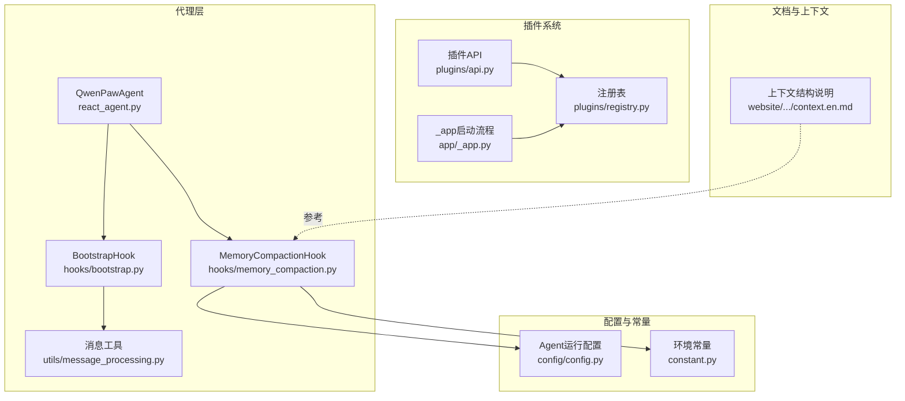
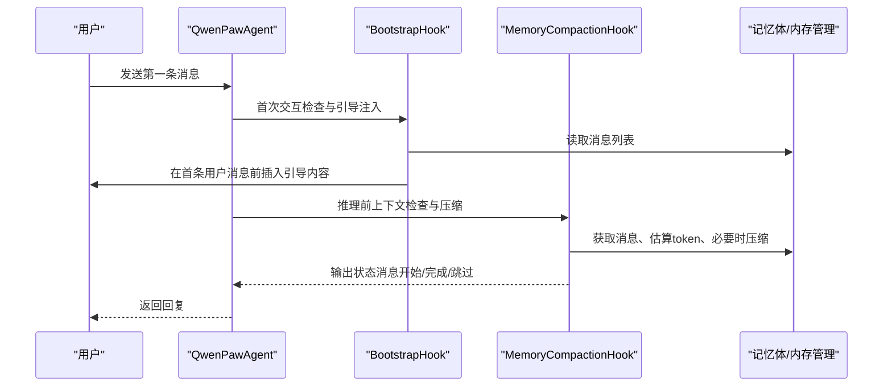
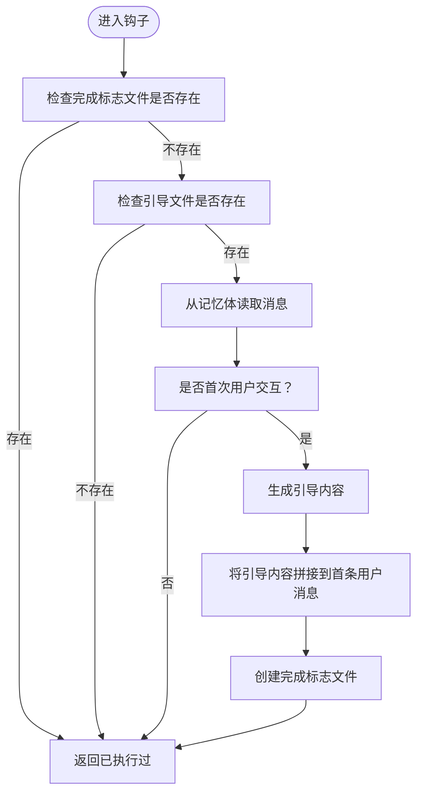
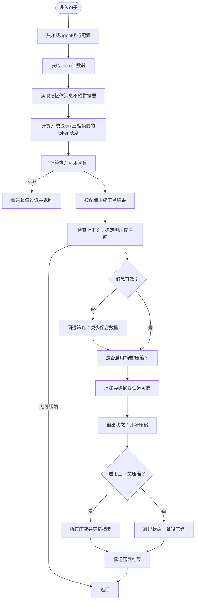
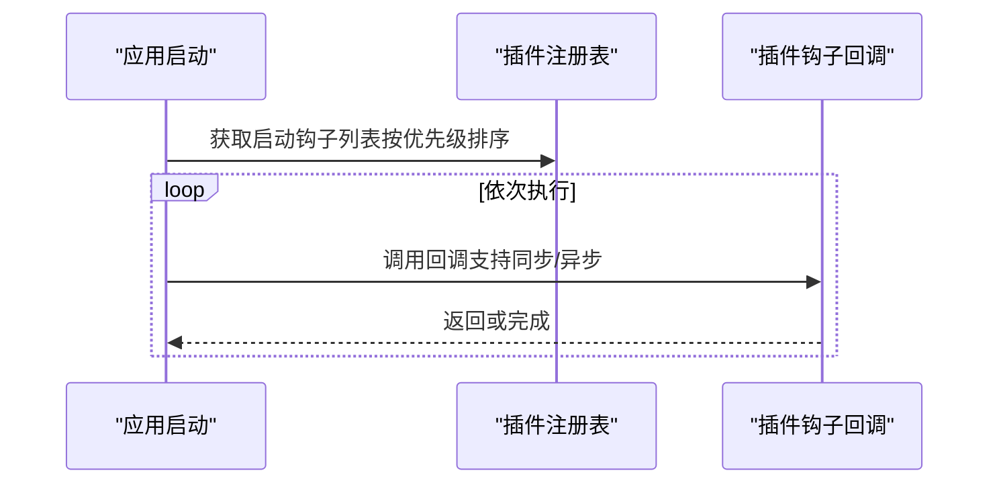
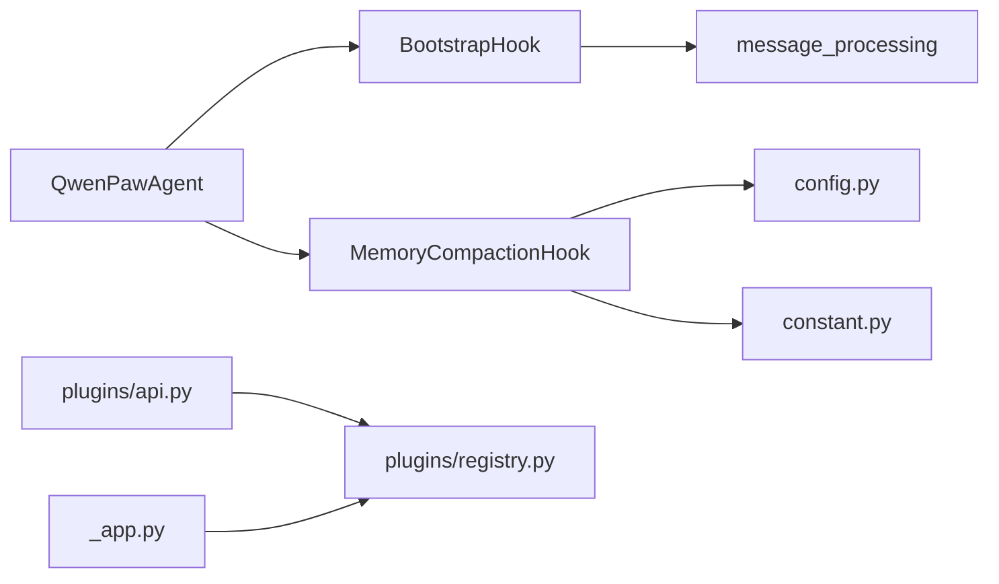

# 代理钩子系统

<cite>
**本文引用的文件**
- [src/qwenpaw/agents/hooks/__init__.py](file://src/qwenpaw/agents/hooks/__init__.py)
- [src/qwenpaw/agents/hooks/bootstrap.py](file://src/qwenpaw/agents/hooks/bootstrap.py)
- [src/qwenpaw/agents/hooks/memory_compaction.py](file://src/qwenpaw/agents/hooks/memory_compaction.py)
- [src/qwenpaw/agents/utils/message_processing.py](file://src/qwenpaw/agents/utils/message_processing.py)
- [src/qwenpaw/agents/react_agent.py](file://src/qwenpaw/agents/react_agent.py)
- [src/qwenpaw/constant.py](file://src/qwenpaw/constant.py)
- [src/qwenpaw/config/config.py](file://src/qwenpaw/config/config.py)
- [src/qwenpaw/plugins/api.py](file://src/qwenpaw/plugins/api.py)
- [src/qwenpaw/plugins/registry.py](file://src/qwenpaw/plugins/registry.py)
- [src/qwenpaw/app/_app.py](file://src/qwenpaw/app/_app.py)
- [website/public/docs/context.en.md](file://website/public/docs/context.en.md)
</cite>

## 目录
1. [引言](#引言)
2. [项目结构](#项目结构)
3. [核心组件](#核心组件)
4. [架构总览](#架构总览)
5. [组件详解](#组件详解)
6. [依赖关系分析](#依赖关系分析)
7. [性能考量](#性能考量)
8. [故障排查指南](#故障排查指南)
9. [结论](#结论)
10. [附录：自定义钩子开发指南](#附录自定义钩子开发指南)

## 引言
本文件面向QwenPaw代理钩子系统，系统性阐述钩子的设计理念、实现机制与集成方式。重点覆盖以下主题：
- 钩子注册、执行时机与参数传递
- 引导钩子（BootstrapHook）：首次交互检测、引导流程与用户指导
- 内存压缩钩子（MemoryCompactionHook）：上下文监控、触发条件与压缩策略
- 执行顺序与优先级管理：钩子链构建与异常处理
- 自定义钩子开发指南：接口定义、实现规范与调试技巧
- 与代理核心逻辑的集成与扩展机制

## 项目结构
钩子系统位于代理层，围绕ReActAgent进行扩展，通过统一的可调用接口（callable）实现“钩子”能力。核心文件分布如下：
- 钩子包与具体实现：agents/hooks
- 代理类与钩子注册：agents/react_agent.py
- 消息工具（首次交互判断、内容拼接等）：agents/utils/message_processing.py
- 环境常量与配置：constant.py、config/config.py
- 插件启动/关闭钩子（应用层）：plugins/api.py、plugins/registry.py、app/_app.py
- 文档与上下文说明：website/public/docs/context.en.md

**图表来源**
- [src/qwenpaw/agents/react_agent.py:1-200](file://src/qwenpaw/agents/react_agent.py#L1-L200)
- [src/qwenpaw/agents/hooks/bootstrap.py:1-104](file://src/qwenpaw/agents/hooks/bootstrap.py#L1-L104)
- [src/qwenpaw/agents/hooks/memory_compaction.py:1-214](file://src/qwenpaw/agents/hooks/memory_compaction.py#L1-L214)
- [src/qwenpaw/agents/utils/message_processing.py:433-476](file://src/qwenpaw/agents/utils/message_processing.py#L433-L476)
- [src/qwenpaw/config/config.py:1-200](file://src/qwenpaw/config/config.py#L1-L200)
- [src/qwenpaw/constant.py:196-210](file://src/qwenpaw/constant.py#L196-L210)
- [src/qwenpaw/plugins/api.py:89-132](file://src/qwenpaw/plugins/api.py#L89-L132)
- [src/qwenpaw/plugins/registry.py:149-221](file://src/qwenpaw/plugins/registry.py#L149-L221)
- [src/qwenpaw/app/_app.py:320-355](file://src/qwenpaw/app/_app.py#L320-L355)
- [website/public/docs/context.en.md:80-103](file://website/public/docs/context.en.md#L80-L103)

**章节来源**
- [src/qwenpaw/agents/hooks/__init__.py:1-19](file://src/qwenpaw/agents/hooks/__init__.py#L1-L19)
- [src/qwenpaw/agents/react_agent.py:1-200](file://src/qwenpaw/agents/react_agent.py#L1-L200)

## 核心组件
- 引导钩子（BootstrapHook）
  - 职责：在首次用户交互时检查工作目录中的引导文件，向第一条用户消息注入引导内容，帮助建立身份与偏好。
  - 关键点：仅在首次交互触发；通过标志文件避免重复；使用消息工具拼接引导文本。
- 内存压缩钩子（MemoryCompactionHook）
  - 职责：在推理前检查上下文长度，当接近阈值时触发压缩，保留系统提示与最近消息，摘要化历史。
  - 关键点：热加载运行配置；基于token计数估算；支持异步摘要任务；打印状态消息；标记压缩结果。
- 代理集成
  - QwenPawAgent在初始化时注册上述钩子，并在推理流程中按约定时机执行。

**章节来源**
- [src/qwenpaw/agents/hooks/bootstrap.py:20-104](file://src/qwenpaw/agents/hooks/bootstrap.py#L20-L104)
- [src/qwenpaw/agents/hooks/memory_compaction.py:27-214](file://src/qwenpaw/agents/hooks/memory_compaction.py#L27-L214)
- [src/qwenpaw/agents/react_agent.py:69-182](file://src/qwenpaw/agents/react_agent.py#L69-L182)

## 架构总览
钩子系统采用“可调用接口 + 代理生命周期”的设计模式：
- 接口契约：所有钩子均为可调用对象，接收agent实例与kwargs字典，返回None或修改后的kwargs（本实现中主要为None）。
- 执行时机：引导钩子通常在首次推理前执行；内存压缩钩子在推理前（pre-reasoning）执行。
- 参数传递：钩子通过kwargs接收推理方法的输入参数，便于读取但不强制修改。
- 优先级与顺序：代理内部注册顺序即执行顺序；应用层插件启动钩子按优先级排序执行。

**图表来源**
- [src/qwenpaw/agents/hooks/bootstrap.py:42-104](file://src/qwenpaw/agents/hooks/bootstrap.py#L42-L104)
- [src/qwenpaw/agents/hooks/memory_compaction.py:62-214](file://src/qwenpaw/agents/hooks/memory_compaction.py#L62-L214)
- [src/qwenpaw/agents/react_agent.py:69-182](file://src/qwenpaw/agents/react_agent.py#L69-L182)

## 组件详解

### 引导钩子（BootstrapHook）
- 设计理念
  - 通过工作目录中的引导文件（如BOOTSTRAP.md）与语言设置，为新用户首次交互提供定制化指导。
  - 使用“首次交互检测”确保只在对话起点生效，避免重复注入。
- 实现要点
  - 文件存在性与完成标志检查：若引导已完成或未找到引导文件则直接返回。
  - 首次交互判定：统计系统提示后首个用户消息，确认无助手回复。
  - 引导内容注入：调用消息工具将引导文本拼接到首条用户消息内容前。
  - 完成标记：创建完成标志文件，防止后续重复触发。
- 异常处理
  - 捕获并记录异常，不影响主流程继续执行。

**图表来源**
- [src/qwenpaw/agents/hooks/bootstrap.py:42-104](file://src/qwenpaw/agents/hooks/bootstrap.py#L42-L104)
- [src/qwenpaw/agents/utils/message_processing.py:433-476](file://src/qwenpaw/agents/utils/message_processing.py#L433-L476)

**章节来源**
- [src/qwenpaw/agents/hooks/bootstrap.py:20-104](file://src/qwenpaw/agents/hooks/bootstrap.py#L20-L104)
- [src/qwenpaw/agents/utils/message_processing.py:433-476](file://src/qwenpaw/agents/utils/message_processing.py#L433-L476)

### 内存压缩钩子（MemoryCompactionHook）
- 设计理念
  - 基于运行配置与token计数估算，动态控制上下文窗口大小，优先保留系统提示与近期消息，摘要化历史以维持长期对话能力。
- 实现要点
  - 配置与计数器：热加载Agent运行配置，获取token计数器。
  - 上下文估算：计算系统提示与压缩摘要的token长度，得到剩余可用阈值。
  - 工具结果压缩：根据配置对工具结果进行压缩与清理。
  - 上下文检查：调用内存管理器检查需要压缩的消息区间，必要时回退策略以保证有效性。
  - 摘要与压缩：可选开启异步摘要任务；按配置决定是否执行上下文压缩；输出状态消息；标记压缩结果并更新压缩摘要。
- 触发条件
  - 当剩余可用阈值小于等于0或需要压缩的消息集合非空时触发。
- 保留策略
  - 固定保留最近N条消息（由常量控制），确保上下文连贯性。

**图表来源**
- [src/qwenpaw/agents/hooks/memory_compaction.py:62-214](file://src/qwenpaw/agents/hooks/memory_compaction.py#L62-L214)
- [src/qwenpaw/constant.py:196-210](file://src/qwenpaw/constant.py#L196-L210)
- [website/public/docs/context.en.md:80-103](file://website/public/docs/context.en.md#L80-L103)

**章节来源**
- [src/qwenpaw/agents/hooks/memory_compaction.py:27-214](file://src/qwenpaw/agents/hooks/memory_compaction.py#L27-L214)
- [src/qwenpaw/constant.py:196-210](file://src/qwenpaw/constant.py#L196-L210)
- [website/public/docs/context.en.md:80-103](file://website/public/docs/context.en.md#L80-L103)

### 代理集成与钩子注册
- 注册位置：QwenPawAgent在构造函数末尾调用钩子注册逻辑，将引导与内存压缩钩子加入代理生命周期。
- 执行顺序：注册顺序即执行顺序；建议将引导钩子置于更早位置，以便在推理前完成引导注入。
- 参数传递：钩子通过kwargs接收推理方法输入，便于读取上下文但不强制修改。

**章节来源**
- [src/qwenpaw/agents/react_agent.py:69-182](file://src/qwenpaw/agents/react_agent.py#L69-L182)

### 应用层插件钩子（启动/关闭）
- 插件API提供注册启动/关闭钩子的能力，支持优先级排序（数值越小越早执行）。
- 应用启动时遍历注册表，同步或异步执行钩子回调，并记录日志。

**图表来源**
- [src/qwenpaw/plugins/api.py:89-132](file://src/qwenpaw/plugins/api.py#L89-L132)
- [src/qwenpaw/plugins/registry.py:149-221](file://src/qwenpaw/plugins/registry.py#L149-L221)
- [src/qwenpaw/app/_app.py:320-355](file://src/qwenpaw/app/_app.py#L320-L355)

**章节来源**
- [src/qwenpaw/plugins/api.py:89-132](file://src/qwenpaw/plugins/api.py#L89-L132)
- [src/qwenpaw/plugins/registry.py:149-221](file://src/qwenpaw/plugins/registry.py#L149-L221)
- [src/qwenpaw/app/_app.py:320-355](file://src/qwenpaw/app/_app.py#L320-L355)

## 依赖关系分析
- 组件耦合
  - BootstrapHook依赖消息工具（首次交互判断、内容拼接）与工作目录路径。
  - MemoryCompactionHook依赖Agent运行配置、token计数器与内存管理器。
- 外部依赖
  - 插件系统通过注册表维护钩子注册信息，支持优先级排序与异步回调。
- 潜在循环依赖
  - 钩子与代理之间为单向依赖（钩子被代理持有），未见循环。

**图表来源**
- [src/qwenpaw/agents/hooks/bootstrap.py:12-15](file://src/qwenpaw/agents/hooks/bootstrap.py#L12-L15)
- [src/qwenpaw/agents/hooks/memory_compaction.py:15-20](file://src/qwenpaw/agents/hooks/memory_compaction.py#L15-L20)
- [src/qwenpaw/agents/react_agent.py:23-24](file://src/qwenpaw/agents/react_agent.py#L23-L24)
- [src/qwenpaw/plugins/api.py:89-132](file://src/qwenpaw/plugins/api.py#L89-L132)
- [src/qwenpaw/plugins/registry.py:149-221](file://src/qwenpaw/plugins/registry.py#L149-L221)
- [src/qwenpaw/app/_app.py:320-355](file://src/qwenpaw/app/_app.py#L320-L355)

**章节来源**
- [src/qwenpaw/agents/hooks/bootstrap.py:12-15](file://src/qwenpaw/agents/hooks/bootstrap.py#L12-L15)
- [src/qwenpaw/agents/hooks/memory_compaction.py:15-20](file://src/qwenpaw/agents/hooks/memory_compaction.py#L15-L20)
- [src/qwenpaw/agents/react_agent.py:23-24](file://src/qwenpaw/agents/react_agent.py#L23-L24)
- [src/qwenpaw/plugins/api.py:89-132](file://src/qwenpaw/plugins/api.py#L89-L132)
- [src/qwenpaw/plugins/registry.py:149-221](file://src/qwenpaw/plugins/registry.py#L149-L221)
- [src/qwenpaw/app/_app.py:320-355](file://src/qwenpaw/app/_app.py#L320-L355)

## 性能考量
- Token估算与压缩
  - 通过估算系统提示与摘要的token长度，避免实际编码开销；在阈值不足时提前警告，提示重置上下文。
- 压缩策略
  - 优先保留最近N条消息（由常量控制），减少回溯成本；可选异步摘要任务，降低主线程阻塞。
- 工具结果压缩
  - 对旧/近期工具结果按字节阈值与保留天数进行压缩，减少冗余数据占用。
- 日志与可观测性
  - 在压缩开始/完成/跳过阶段输出状态消息，便于用户感知与问题定位。

**章节来源**
- [src/qwenpaw/agents/hooks/memory_compaction.py:84-214](file://src/qwenpaw/agents/hooks/memory_compaction.py#L84-L214)
- [src/qwenpaw/constant.py:196-210](file://src/qwenpaw/constant.py#L196-L210)

## 故障排查指南
- 引导钩子无效
  - 检查工作目录中引导文件是否存在；确认完成标志文件未提前创建；验证是否为首次用户交互。
  - 参考：首次交互判断与内容拼接工具。
- 内存压缩未触发
  - 检查运行配置中的阈值与保留设置；确认剩余可用阈值是否合理；查看日志中关于阈值过低的警告。
  - 若消息无效，钩子会回退策略，减少保留数量以保证有效性。
- 压缩失败
  - 查看状态消息提示；确认压缩功能是否启用；检查内存管理器的压缩实现与摘要任务状态。
- 插件启动钩子异常
  - 应用启动时会捕获并记录异常，检查日志中的错误堆栈与钩子名称、插件ID。

**章节来源**
- [src/qwenpaw/agents/hooks/bootstrap.py:56-104](file://src/qwenpaw/agents/hooks/bootstrap.py#L56-L104)
- [src/qwenpaw/agents/hooks/memory_compaction.py:104-214](file://src/qwenpaw/agents/hooks/memory_compaction.py#L104-L214)
- [src/qwenpaw/app/_app.py:341-347](file://src/qwenpaw/app/_app.py#L341-L347)

## 结论
QwenPaw钩子系统以简洁的可调用接口与明确的生命周期时机，实现了引导与上下文管理两大核心能力。通过热加载配置、token估算与保留策略，内存压缩钩子在保障对话质量的同时兼顾性能。应用层插件钩子进一步扩展了系统扩展性。建议在生产环境中结合日志与阈值监控，持续优化压缩策略与引导内容。

## 附录：自定义钩子开发指南
- 接口定义
  - 钩子应为可调用对象（类或函数），签名形如：__call__(agent, kwargs) -> dict[str, Any] | None。
  - kwargs为推理方法的输入参数，钩子可读取但不强制修改。
- 实现规范
  - 明确执行时机：在推理前（pre-reasoning）、推理后（post-reasoning）或特定事件发生时。
  - 严格异常处理：捕获并记录异常，避免影响主流程。
  - 保持幂等：确保多次执行不会产生副作用（如重复注入引导）。
  - 与配置解耦：尽量通过配置中心或运行时参数获取策略，避免硬编码。
- 调试技巧
  - 使用状态消息输出关键步骤（开始/完成/跳过），便于前端或日志观察。
  - 在关键分支增加日志级别（如warning/info/debug），区分正常与异常路径。
  - 单元测试：针对边界条件（首次交互、无效消息、阈值边界）编写测试用例。
- 与代理集成
  - 在代理初始化完成后注册钩子，确保注册顺序符合预期。
  - 如需跨模块共享状态，可通过代理实例或全局配置中心传递。

**章节来源**
- [src/qwenpaw/agents/hooks/bootstrap.py:42-104](file://src/qwenpaw/agents/hooks/bootstrap.py#L42-L104)
- [src/qwenpaw/agents/hooks/memory_compaction.py:62-214](file://src/qwenpaw/agents/hooks/memory_compaction.py#L62-L214)
- [src/qwenpaw/agents/react_agent.py:69-182](file://src/qwenpaw/agents/react_agent.py#L69-L182)