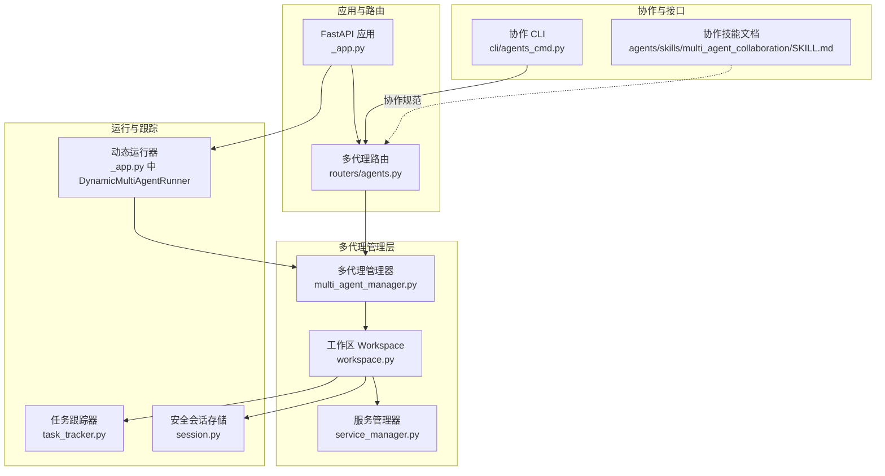
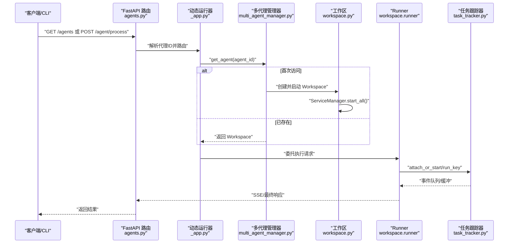
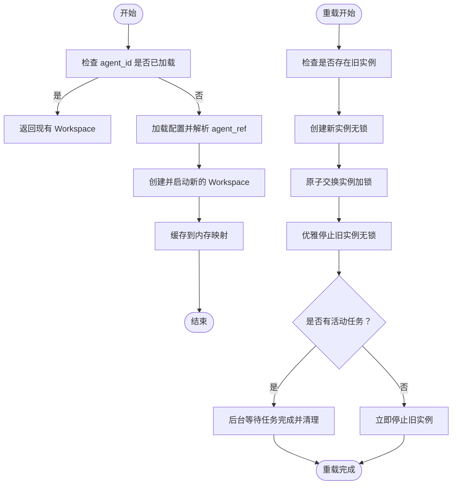
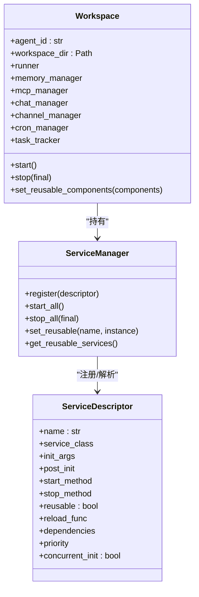
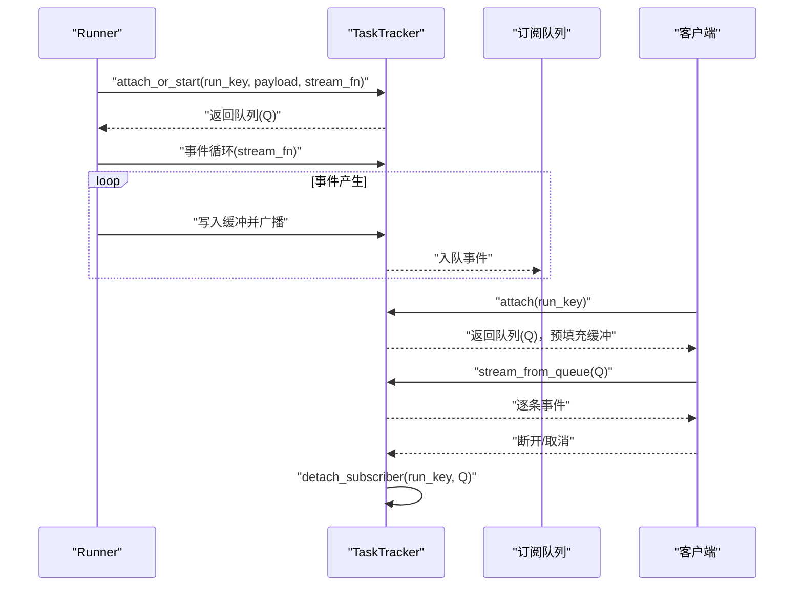
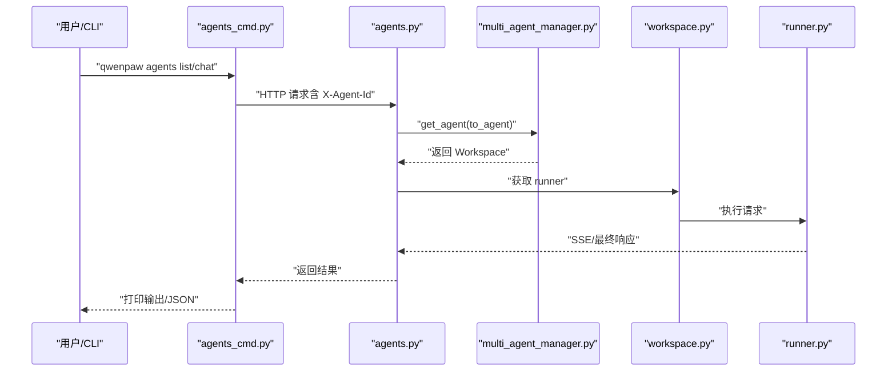
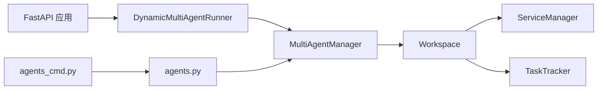

# 多代理协作机制

<cite>
**本文引用的文件**
- [multi_agent_manager.py](file://src/qwenpaw/app/multi_agent_manager.py)
- [workspace.py](file://src/qwenpaw/app/workspace/workspace.py)
- [service_manager.py](file://src/qwenpaw/app/workspace/service_manager.py)
- [task_tracker.py](file://src/qwenpaw/app/runner/task_tracker.py)
- [session.py](file://src/qwenpaw/app/runner/session.py)
- [_app.py](file://src/qwenpaw/app/_app.py)
- [agents.py](file://src/qwenpaw/app/routers/agents.py)
- [agents_cmd.py](file://src/qwenpaw/cli/agents_cmd.py)
- [SKILL.md](file://src/qwenpaw/agents/skills/multi_agent_collaboration/SKILL.md)
- [multi-agent.en.md](file://website/public/docs/multi-agent.en.md)
- [utils.py](file://src/qwenpaw/app/utils.py)
</cite>

## 目录
1. [引言](#引言)
2. [项目结构](#项目结构)
3. [核心组件](#核心组件)
4. [架构总览](#架构总览)
5. [详细组件分析](#详细组件分析)
6. [依赖分析](#依赖分析)
7. [性能考虑](#性能考虑)
8. [故障排除指南](#故障排除指南)
9. [结论](#结论)
10. [附录](#附录)

## 引言
本技术文档围绕 QwenPaw 的多代理协作机制展开，系统性阐述多代理管理器的设计架构、代理间协调策略、会话与任务管理、通信协议与状态同步、以及后台任务跟踪与错误恢复。文档还提供最佳实践、配置与管理示例、与单代理系统的差异说明，以及常见问题排查方法，帮助读者在生产环境中稳定、高效地部署与运维多代理系统。

## 项目结构
QwenPaw 将“多代理”拆分为两个层面：
- 多代理工作区（Multi-Agent Workspace）：每个代理拥有独立的配置、记忆、技能与会话历史，彼此隔离。
- 代理间协作（Inter-Agent Collaboration）：通过内置协作技能与 CLI/REST 接口，实现代理之间的双向通信与任务编排。

图示来源
- [_app.py:63-163](file://src/qwenpaw/app/_app.py#L63-L163)
- [agents.py:36-36](file://src/qwenpaw/app/routers/agents.py#L36-L36)
- [multi_agent_manager.py:21-37](file://src/qwenpaw/app/multi_agent_manager.py#L21-L37)
- [workspace.py:47-85](file://src/qwenpaw/app/workspace/workspace.py#L47-L85)
- [service_manager.py:74-91](file://src/qwenpaw/app/workspace/service_manager.py#L74-L91)
- [task_tracker.py:30-45](file://src/qwenpaw/app/runner/task_tracker.py#L30-L45)
- [session.py:39-57](file://src/qwenpaw/app/runner/session.py#L39-L57)
- [agents_cmd.py:374-388](file://src/qwenpaw/cli/agents_cmd.py#L374-L388)

章节来源
- [_app.py:166-231](file://src/qwenpaw/app/_app.py#L166-L231)
- [agents.py:152-197](file://src/qwenpaw/app/routers/agents.py#L152-L197)
- [multi_agent_manager.py:38-90](file://src/qwenpaw/app/multi_agent_manager.py#L38-L90)
- [workspace.py:142-290](file://src/qwenpaw/app/workspace/workspace.py#L142-L290)

## 核心组件
- 多代理管理器（MultiAgentManager）：负责代理实例的懒加载、生命周期管理、零停机热重载、并发安全与延迟清理。
- 工作区（Workspace）：封装单个代理的完整运行时组件（Runner、ChannelManager、MemoryManager、MCPClientManager、CronManager），统一注册与启动。
- 服务管理器（ServiceManager）：声明式注册与生命周期管理，支持可复用组件与并发初始化。
- 任务跟踪器（TaskTracker）：后台任务的运行状态、订阅队列、事件缓冲与断连重放。
- 安全会话存储（SafeJSONSession）：跨平台文件名合法性与异步 I/O 的会话状态持久化。
- 动态运行器（DynamicMultiAgentRunner）：根据请求头动态路由到对应代理的工作区运行器。
- 协作路由器与 CLI：提供代理列表、聊天、后台任务查询等 API 与命令行工具。
- 协作技能文档：定义何时调用、决策规则、会话复用与后台任务模式。

章节来源
- [multi_agent_manager.py:21-470](file://src/qwenpaw/app/multi_agent_manager.py#L21-L470)
- [workspace.py:47-389](file://src/qwenpaw/app/workspace/workspace.py#L47-L389)
- [service_manager.py:74-421](file://src/qwenpaw/app/workspace/service_manager.py#L74-L421)
- [task_tracker.py:30-231](file://src/qwenpaw/app/runner/task_tracker.py#L30-L231)
- [session.py:39-248](file://src/qwenpaw/app/runner/session.py#L39-L248)
- [_app.py:63-163](file://src/qwenpaw/app/_app.py#L63-L163)
- [agents.py:152-726](file://src/qwenpaw/app/routers/agents.py#L152-L726)
- [agents_cmd.py:374-680](file://src/qwenpaw/cli/agents_cmd.py#L374-L680)
- [SKILL.md:10-477](file://src/qwenpaw/agents/skills/multi_agent_collaboration/SKILL.md#L10-L477)

## 架构总览
多代理系统采用“集中式管理 + 动态路由”的架构：
- 应用启动时初始化多代理管理器并并发启动所有启用的代理。
- 请求到达时，根据请求头中的代理标识动态选择对应 Workspace 的 Runner。
- Workspace 内部通过 ServiceManager 注册并启动各子系统，TaskTracker 负责后台任务的事件广播与断连重放。
- 协作通过 REST/CLI 接口触发，遵循“先查代理、再发起对话、必要时后台任务、续聊需携带会话 ID”的规则。

图示来源
- [_app.py:79-140](file://src/qwenpaw/app/_app.py#L79-L140)
- [agents.py:152-197](file://src/qwenpaw/app/routers/agents.py#L152-L197)
- [multi_agent_manager.py:38-90](file://src/qwenpaw/app/multi_agent_manager.py#L38-L90)
- [workspace.py:322-380](file://src/qwenpaw/app/workspace/workspace.py#L322-L380)
- [task_tracker.py:142-208](file://src/qwenpaw/app/runner/task_tracker.py#L142-L208)

## 详细组件分析

### 多代理管理器（MultiAgentManager）
- 设计要点
  - 懒加载：首次请求才创建并启动 Workspace。
  - 生命周期管理：支持停止、重启、并发启动、零停机热重载。
  - 并发安全：全局锁保护实例替换与状态变更。
  - 延迟清理：旧实例在无活动任务时立即停止，否则后台等待任务完成后清理。
- 关键流程
  - 获取代理：若未加载则读取配置、创建 Workspace 并启动。
  - 零停机重载：先在无锁环境下创建新实例，再原子替换旧实例，最后优雅关闭旧实例。
  - 启动所有已启用代理：并发初始化，过滤 disabled 代理。
- 与 Workspace 的交互
  - 通过 set_reusable_components 传递可复用组件（如 MemoryManager、ChatManager）。
  - 通过 task_tracker.has_active_tasks/list_active_tasks 控制延迟清理。

图示来源
- [multi_agent_manager.py:38-90](file://src/qwenpaw/app/multi_agent_manager.py#L38-L90)
- [multi_agent_manager.py:208-319](file://src/qwenpaw/app/multi_agent_manager.py#L208-L319)

章节来源
- [multi_agent_manager.py:21-470](file://src/qwenpaw/app/multi_agent_manager.py#L21-L470)

### 工作区（Workspace）
- 设计要点
  - 统一注册：通过 ServiceDescriptor 声明式注册 Runner、MemoryManager、MCPClientManager、ChatManager、ChannelManager、CronManager 等。
  - 可复用组件：支持在热重载时复用 MemoryManager、ChatManager 等，减少重建成本。
  - 任务跟踪：内置 TaskTracker，供 Runner 使用以支持后台任务与断连重放。
- 启动顺序
  - 优先级分组并发启动，同优先级内可并发或串行，确保依赖满足。
- 与服务管理器的协作
  - ServiceManager.start_all()/stop_all() 统一生命周期管理，支持 final 停止与跳过可复用组件。

图示来源
- [workspace.py:47-141](file://src/qwenpaw/app/workspace/workspace.py#L47-L141)
- [workspace.py:142-290](file://src/qwenpaw/app/workspace/workspace.py#L142-L290)
- [service_manager.py:30-72](file://src/qwenpaw/app/workspace/service_manager.py#L30-L72)
- [service_manager.py:171-229](file://src/qwenpaw/app/workspace/service_manager.py#L171-L229)

章节来源
- [workspace.py:47-389](file://src/qwenpaw/app/workspace/workspace.py#L47-L389)
- [service_manager.py:74-421](file://src/qwenpaw/app/workspace/service_manager.py#L74-L421)

### 任务跟踪器（TaskTracker）
- 设计要点
  - per-run 状态：每个 run_key 对应一个 _RunState（包含 task、队列列表、事件缓冲）。
  - 订阅模型：attach/attach_or_start 返回队列，断连自动移除；detach_subscriber 防泄漏。
  - 断连重放：新订阅者可获得缓冲区事件，保证断线重连不丢消息。
  - 停止与清理：request_stop 取消任务；完成时清理队列与缓冲。
- 与 Runner 的集成
  - Runner 通过 attach_or_start 获取队列，将异步生成的事件写入缓冲并广播给所有订阅者。
  - stream_from_queue 负责消费队列并在结束时自动解绑。

图示来源
- [task_tracker.py:142-208](file://src/qwenpaw/app/runner/task_tracker.py#L142-L208)
- [task_tracker.py:210-231](file://src/qwenpaw/app/runner/task_tracker.py#L210-L231)

章节来源
- [task_tracker.py:30-231](file://src/qwenpaw/app/runner/task_tracker.py#L30-L231)

### 会话管理（SafeJSONSession）
- 设计要点
  - 跨平台文件名安全：对非法字符进行替换，避免 Windows 不兼容。
  - 异步 I/O：使用 aiofiles 避免阻塞事件循环。
  - 支持增量更新与键路径写入，便于细粒度状态维护。
- 与 Workspace 的关系
  - Workspace 在启动阶段加载配置并初始化 TaskTracker 与会话存储，用于保存/加载会话状态。

章节来源
- [session.py:28-248](file://src/qwenpaw/app/runner/session.py#L28-L248)
- [workspace.py:322-359](file://src/qwenpaw/app/workspace/workspace.py#L322-L359)

### 动态运行器与路由（DynamicMultiAgentRunner 与 /api/agent）
- 设计要点
  - 根据请求头中的代理标识动态选择 Workspace 的 Runner。
  - 通过 AgentApp 的 stream_query/query_handler 将请求委派给具体 Runner。
  - 支持后台任务队列与超时控制。
- 与多代理管理器的协作
  - 运行器在启动时绑定 MultiAgentManager，请求到来时通过 get_agent 获取 Workspace。

章节来源
- [_app.py:63-163](file://src/qwenpaw/app/_app.py#L63-L163)
- [agents.py:152-197](file://src/qwenpaw/app/routers/agents.py#L152-L197)

### 协作路由器与 CLI（/api/agents 与 qwenpaw agents）
- 路由器功能
  - 列出代理、获取/更新/删除代理、切换启用状态、读写代理工作区文件、列出/读取代理记忆文件。
  - 更新代理配置后通过 schedule_agent_reload 触发后台重载，避免阻塞响应。
- CLI 行为
  - 自动生成唯一会话 ID，确保并发安全；自动添加身份前缀；支持流式与最终模式；支持后台任务提交与状态查询。
- 协作规范
  - 先查代理列表，再发起对话；续聊必须携带 session_id；避免回调来源代理；后台任务提交后记录 task_id 与 session_id。

图示来源
- [agents.py:152-197](file://src/qwenpaw/app/routers/agents.py#L152-L197)
- [agents_cmd.py:511-680](file://src/qwenpaw/cli/agents_cmd.py#L511-L680)
- [multi_agent_manager.py:38-90](file://src/qwenpaw/app/multi_agent_manager.py#L38-L90)

章节来源
- [agents.py:152-726](file://src/qwenpaw/app/routers/agents.py#L152-L726)
- [agents_cmd.py:374-680](file://src/qwenpaw/cli/agents_cmd.py#L374-L680)
- [utils.py:15-59](file://src/qwenpaw/app/utils.py#L15-L59)
- [SKILL.md:10-477](file://src/qwenpaw/agents/skills/multi_agent_collaboration/SKILL.md#L10-L477)

## 依赖分析
- 组件耦合
  - MultiAgentManager 与 Workspace：管理与被管理关系，前者负责生命周期与热重载。
  - Workspace 与 ServiceManager：前者通过后者统一注册与启动组件。
  - Workspace 与 TaskTracker：前者持有并注入到 Runner，用于后台任务与断连重放。
  - DynamicMultiAgentRunner 与 MultiAgentManager：运行时动态路由。
  - 路由器与管理器：REST 接口通过 MultiAgentManager 获取 Workspace。
- 外部依赖
  - FastAPI、AgentApp、通道与渠道管理、模型提供者与本地模型管理等在应用生命周期中初始化并注入。

图示来源
- [_app.py:202-231](file://src/qwenpaw/app/_app.py#L202-L231)
- [agents.py:98-106](file://src/qwenpaw/app/routers/agents.py#L98-L106)
- [multi_agent_manager.py:31-37](file://src/qwenpaw/app/multi_agent_manager.py#L31-L37)
- [workspace.py:71-85](file://src/qwenpaw/app/workspace/workspace.py#L71-L85)

章节来源
- [_app.py:202-231](file://src/qwenpaw/app/_app.py#L202-L231)
- [agents.py:98-106](file://src/qwenpaw/app/routers/agents.py#L98-L106)

## 性能考虑
- 懒加载与并发启动：仅启动 enabled 的代理，利用并发初始化减少启动时间。
- 零停机热重载：最小化锁持有时间，后台等待任务完成，避免影响其他代理。
- 事件驱动与异步 I/O：TaskTracker 使用队列与弱引用，SafeJSONSession 使用异步文件 I/O，降低阻塞风险。
- 会话与任务分离：会话状态持久化与后台任务追踪解耦，便于扩展与优化。
- 建议
  - 合理设置后台任务查询间隔，避免频繁轮询。
  - 对高并发场景，确保 TaskTracker 的队列容量与缓冲策略满足峰值需求。
  - 使用可复用组件（如 MemoryManager）减少热重载成本。

## 故障排除指南
- 代理未找到或无法启动
  - 检查配置文件中 agent_id 是否存在，确认 enabled 状态。
  - 查看应用日志中的启动异常堆栈，定位具体组件初始化失败原因。
- 后台任务长时间 pending/running
  - 使用 qwenpaw agents chat --background --task-id 查询状态，确认任务是否仍在运行。
  - 检查目标代理的 Runner 日志与 TaskTracker 缓冲情况。
- 会话复用导致上下文错乱
  - 确保续聊时携带正确的 session_id；避免并发访问同一 session_id。
- 热重载后旧实例未清理
  - 检查 TaskTracker.has_active_tasks 与延迟清理任务状态；必要时手动触发停止。
- 权限与 CORS
  - 如遇跨域问题，检查 CORS_ORIGINS 配置；确保认证中间件正确设置。

章节来源
- [agents_cmd.py:272-372](file://src/qwenpaw/cli/agents_cmd.py#L272-L372)
- [task_tracker.py:79-98](file://src/qwenpaw/app/runner/task_tracker.py#L79-L98)
- [multi_agent_manager.py:91-187](file://src/qwenpaw/app/multi_agent_manager.py#L91-L187)

## 结论
QwenPaw 的多代理协作机制通过“集中管理 + 动态路由 + 事件驱动”的设计，在保证代理间隔离的同时，提供了高效的协作能力与稳定的后台任务支持。借助懒加载、并发启动与零停机热重载，系统在生产环境中具备良好的可维护性与可扩展性。配合清晰的协作规范与 CLI/REST 接口，用户可以灵活地构建复杂的多代理工作流。

## 附录

### 多代理与单代理系统的关系与差异
- 关系
  - 单代理系统可视为多代理系统的一种特例（仅有一个代理）。
- 差异
  - 多代理系统引入了集中式管理器、动态路由、会话隔离、后台任务追踪与热重载等能力。
  - 协作能力通过内置技能与 CLI/REST 接口实现，支持跨代理的双向通信与任务编排。

章节来源
- [multi-agent.en.md:1-200](file://website/public/docs/multi-agent.en.md#L1-L200)

### 最佳实践
- 代理分工
  - 按领域划分代理（如代码、写作、计划），明确描述信息，便于协作识别。
- 资源管理
  - 启用必要的代理，禁用的代理不会占用资源；使用可复用组件减少热重载成本。
- 性能优化
  - 合理设置后台任务查询间隔；避免频繁轮询；使用流式输出提升用户体验。
- 会话与任务
  - 续聊必须携带 session_id；复杂任务使用后台模式；及时清理已完成任务。

章节来源
- [SKILL.md:10-477](file://src/qwenpaw/agents/skills/multi_agent_collaboration/SKILL.md#L10-L477)
- [agents_cmd.py:431-680](file://src/qwenpaw/cli/agents_cmd.py#L431-L680)

### 配置与管理示例（路径指引）
- 启动与热重载
  - 应用启动时自动初始化 MultiAgentManager 并启动已启用代理。
  - 更新代理配置后通过 schedule_agent_reload 触发后台重载。
- 代理管理 API
  - 列出代理、获取/更新/删除代理、切换启用状态、读写工作区文件。
- 协作 CLI
  - 列出代理、发起实时/后台对话、续聊、查询任务状态。

章节来源
- [_app.py:202-231](file://src/qwenpaw/app/_app.py#L202-L231)
- [utils.py:15-59](file://src/qwenpaw/app/utils.py#L15-L59)
- [agents.py:152-726](file://src/qwenpaw/app/routers/agents.py#L152-L726)
- [agents_cmd.py:374-680](file://src/qwenpaw/cli/agents_cmd.py#L374-L680)