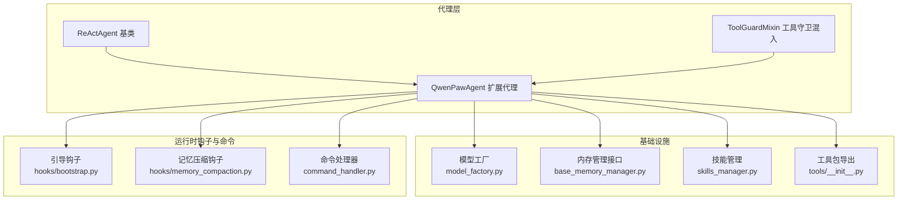
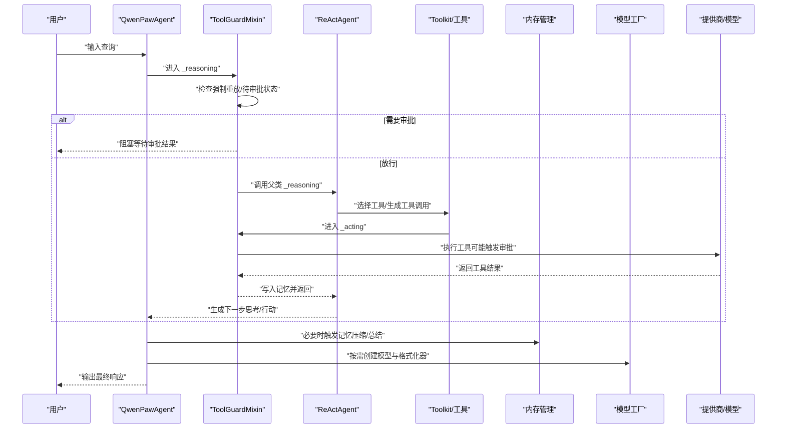
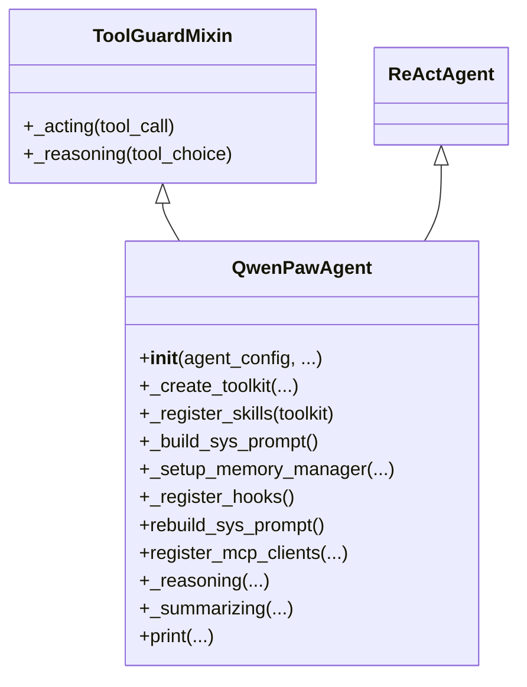
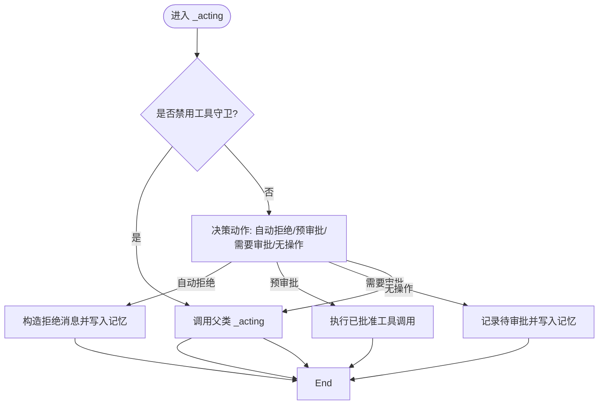
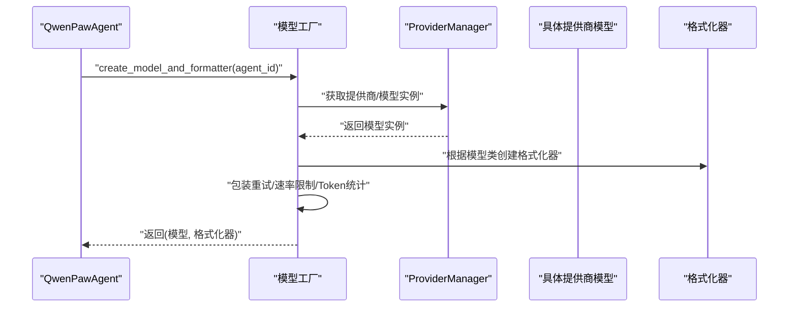
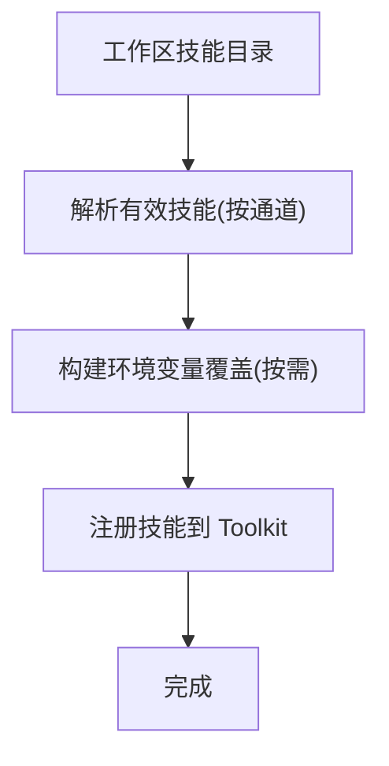
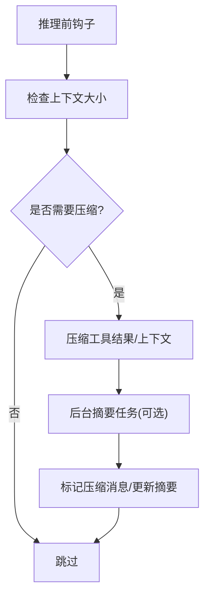
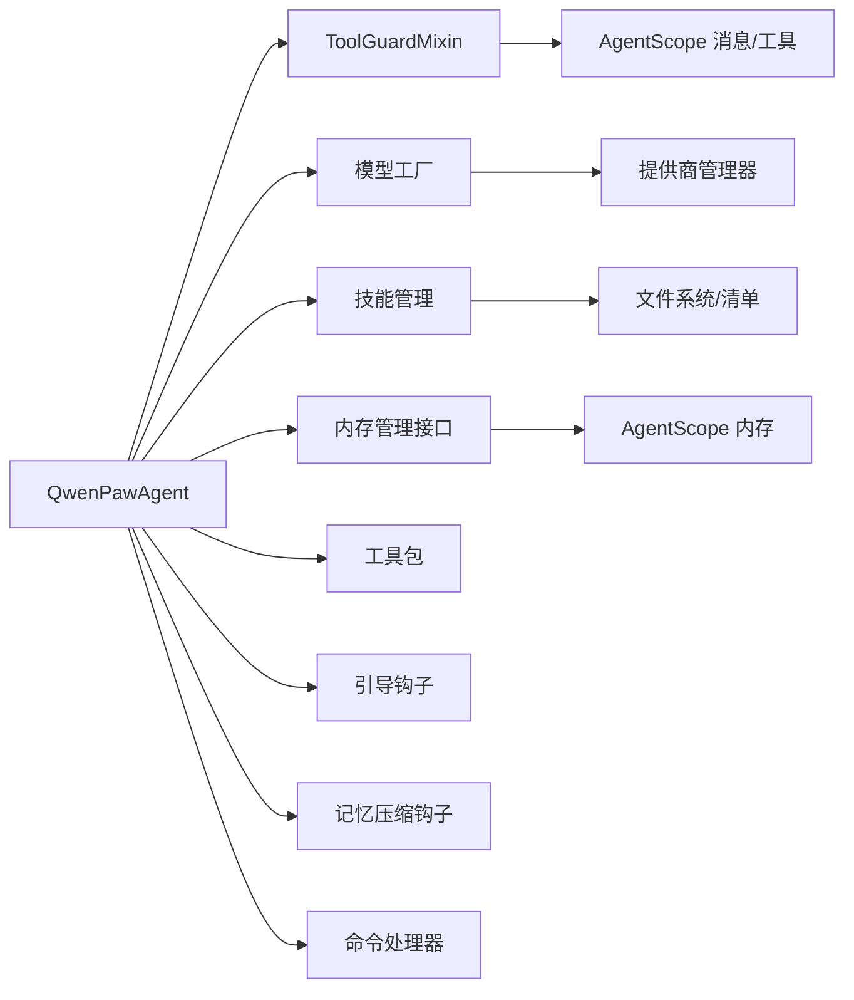

# 智能代理核心实现

<cite>
**本文引用的文件**
- [react_agent.py](file://src/qwenpaw/agents/react_agent.py)
- [model_factory.py](file://src/qwenpaw/agents/model_factory.py)
- [skills_manager.py](file://src/qwenpaw/agents/skills_manager.py)
- [base_memory_manager.py](file://src/qwenpaw/agents/memory/base_memory_manager.py)
- [__init__.py（工具包）](file://src/qwenpaw/agents/tools/__init__.py)
- [bootstrap.py](file://src/qwenpaw/agents/hooks/bootstrap.py)
- [memory_compaction.py](file://src/qwenpaw/agents/hooks/memory_compaction.py)
- [command_handler.py](file://src/qwenpaw/agents/command_handler.py)
- [tool_guard_mixin.py](file://src/qwenpaw/agents/tool_guard_mixin.py)
</cite>

## 目录
1. [引言](#引言)
2. [项目结构](#项目结构)
3. [核心组件](#核心组件)
4. [架构总览](#架构总览)
5. [详细组件分析](#详细组件分析)
6. [依赖分析](#依赖分析)
7. [性能考虑](#性能考虑)
8. [故障排查指南](#故障排查指南)
9. [结论](#结论)
10. [附录：最佳实践与示例](#附录最佳实践与示例)

## 引言
本文件面向希望深入理解 QwenPaw 智能代理核心实现的工程师与技术文档读者，系统性解析 ReActAgent 基础架构与 QwenPawAgent 的扩展实现，重点覆盖以下主题：
- 思考-行动-观察循环机制与工具守卫拦截流程
- 代理初始化过程：配置加载、工具注册、技能绑定、系统提示构建
- 核心方法实现：_reasoning、_acting、print 的工作原理
- 与模型工厂的集成：模型创建、格式化器配置、多模态支持
- 代理配置最佳实践：参数调优、性能优化、错误处理策略
- 代理与工具系统、技能系统、内存管理的集成关系

## 项目结构
QwenPaw 的智能代理位于 src/qwenpaw/agents 子目录下，围绕 ReActAgent 进行扩展，引入了工具守卫、技能管理、内存管理、引导钩子与命令处理器等模块，形成“基础推理 + 多模态 + 安全 + 记忆”的完整能力闭环。

图示来源
- [react_agent.py:1-1058](file://src/qwenpaw/agents/react_agent.py#L1-L1058)
- [model_factory.py:1-820](file://src/qwenpaw/agents/model_factory.py#L1-L820)
- [base_memory_manager.py:1-226](file://src/qwenpaw/agents/memory/base_memory_manager.py#L1-L226)
- [skills_manager.py:1-2628](file://src/qwenpaw/agents/skills_manager.py#L1-L2628)
- [__init__.py（工具包）:1-48](file://src/qwenpaw/agents/tools/__init__.py#L1-L48)
- [bootstrap.py:1-104](file://src/qwenpaw/agents/hooks/bootstrap.py#L1-L104)
- [memory_compaction.py:1-214](file://src/qwenpaw/agents/hooks/memory_compaction.py#L1-L214)
- [command_handler.py:1-530](file://src/qwenpaw/agents/command_handler.py#L1-L530)

章节来源
- [react_agent.py:1-1058](file://src/qwenpaw/agents/react_agent.py#L1-L1058)
- [model_factory.py:1-820](file://src/qwenpaw/agents/model_factory.py#L1-L820)
- [base_memory_manager.py:1-226](file://src/qwenpaw/agents/memory/base_memory_manager.py#L1-L226)
- [skills_manager.py:1-2628](file://src/qwenpaw/agents/skills_manager.py#L1-L2628)
- [__init__.py（工具包）:1-48](file://src/qwenpaw/agents/tools/__init__.py#L1-L48)
- [bootstrap.py:1-104](file://src/qwenpaw/agents/hooks/bootstrap.py#L1-L104)
- [memory_compaction.py:1-214](file://src/qwenpaw/agents/hooks/memory_compaction.py#L1-L214)
- [command_handler.py:1-530](file://src/qwenpaw/agents/command_handler.py#L1-L530)

## 核心组件
- ReActAgent 基类：提供思考-行动-观察的迭代推理框架，支持工具调用与消息队列管理。
- ToolGuardMixin：在推理与行动阶段插入安全拦截，实现“拒绝/审批/放行”三段式控制流。
- QwenPawAgent：在 ReActAgent 基础上集成工具、技能、内存、钩子与命令处理，提供生产级代理能力。
- 模型工厂：统一创建聊天模型与格式化器，适配多提供商与多模态场景。
- 技能管理：从工作区加载技能清单、解析前置条件、注入环境变量、注册技能函数。
- 内存管理接口：抽象记忆后端，提供压缩、总结、搜索与后台任务管理。
- 钩子与命令：引导首次交互、自动压缩上下文、提供会话级系统命令。

章节来源
- [react_agent.py:69-182](file://src/qwenpaw/agents/react_agent.py#L69-L182)
- [tool_guard_mixin.py:45-314](file://src/qwenpaw/agents/tool_guard_mixin.py#L45-L314)
- [model_factory.py:698-787](file://src/qwenpaw/agents/model_factory.py#L698-L787)
- [skills_manager.py:132-341](file://src/qwenpaw/agents/skills_manager.py#L132-L341)
- [base_memory_manager.py:21-226](file://src/qwenpaw/agents/memory/base_memory_manager.py#L21-L226)
- [bootstrap.py:20-104](file://src/qwenpaw/agents/hooks/bootstrap.py#L20-L104)
- [memory_compaction.py:27-214](file://src/qwenpaw/agents/hooks/memory_compaction.py#L27-L214)
- [command_handler.py:62-530](file://src/qwenpaw/agents/command_handler.py#L62-L530)

## 架构总览
QwenPawAgent 的核心数据流与控制流如下：

图示来源
- [tool_guard_mixin.py:261-314](file://src/qwenpaw/agents/tool_guard_mixin.py#L261-L314)
- [tool_guard_mixin.py:621-648](file://src/qwenpaw/agents/tool_guard_mixin.py#L621-L648)
- [react_agent.py:675-727](file://src/qwenpaw/agents/react_agent.py#L675-L727)
- [model_factory.py:698-787](file://src/qwenpaw/agents/model_factory.py#L698-L787)

## 详细组件分析

### ReActAgent 基础架构与 QwenPawAgent 扩展
- 初始化流程
  - 读取代理配置（运行参数、语言、心跳、记忆摘要开关）
  - 创建工具包 Toolkit 并注册内置工具（含异步任务管理工具）
  - 动态加载并注册技能（按通道路由）
  - 构建系统提示（含多模态提示、环境上下文）
  - 通过模型工厂创建模型与格式化器
  - 初始化内存与命令处理器
  - 注册钩子（引导、记忆压缩）
- 核心方法
  - _reasoning：在推理前进行多模态预过滤与失败回退；在总结阶段过滤 tool_use 块
  - _acting：由 ToolGuardMixin 拦截并执行审批/放行逻辑
  - print：在总结阶段过滤 tool_use，避免前端短暂渲染幻影调用

图示来源
- [react_agent.py:69-182](file://src/qwenpaw/agents/react_agent.py#L69-L182)
- [tool_guard_mixin.py:45-314](file://src/qwenpaw/agents/tool_guard_mixin.py#L45-L314)

章节来源
- [react_agent.py:89-182](file://src/qwenpaw/agents/react_agent.py#L89-L182)
- [react_agent.py:183-304](file://src/qwenpaw/agents/react_agent.py#L183-L304)
- [react_agent.py:306-341](file://src/qwenpaw/agents/react_agent.py#L306-L341)
- [react_agent.py:342-388](file://src/qwenpaw/agents/react_agent.py#L342-L388)
- [react_agent.py:390-454](file://src/qwenpaw/agents/react_agent.py#L390-L454)
- [react_agent.py:455-477](file://src/qwenpaw/agents/react_agent.py#L455-L477)
- [react_agent.py:478-658](file://src/qwenpaw/agents/react_agent.py#L478-L658)
- [react_agent.py:675-800](file://src/qwenpaw/agents/react_agent.py#L675-L800)

### 工具守卫与安全拦截（ToolGuardMixin）
- 关键机制
  - 在 _acting/_reasoning 中串行决策，使用锁避免并发竞态
  - 自动拒绝名单命中即直接拒绝
  - 受保护工具进入“预审批+守护者”检查，发现风险则进入审批队列
  - 支持强制重放（forced replay）以保持工具调用顺序一致性
- 输出与记忆
  - 拒绝时写入带标记的记忆条目，便于后续清理
  - 审批通过后恢复推理流程，保留思维块信息

图示来源
- [tool_guard_mixin.py:261-314](file://src/qwenpaw/agents/tool_guard_mixin.py#L261-L314)
- [tool_guard_mixin.py:316-396](file://src/qwenpaw/agents/tool_guard_mixin.py#L316-L396)
- [tool_guard_mixin.py:447-502](file://src/qwenpaw/agents/tool_guard_mixin.py#L447-L502)
- [tool_guard_mixin.py:572-615](file://src/qwenpaw/agents/tool_guard_mixin.py#L572-L615)

章节来源
- [tool_guard_mixin.py:57-70](file://src/qwenpaw/agents/tool_guard_mixin.py#L57-L70)
- [tool_guard_mixin.py:261-314](file://src/qwenpaw/agents/tool_guard_mixin.py#L261-L314)
- [tool_guard_mixin.py:316-396](file://src/qwenpaw/agents/tool_guard_mixin.py#L316-L396)
- [tool_guard_mixin.py:447-502](file://src/qwenpaw/agents/tool_guard_mixin.py#L447-L502)
- [tool_guard_mixin.py:572-615](file://src/qwenpaw/agents/tool_guard_mixin.py#L572-L615)

### 模型工厂与多模态支持（model_factory.py）
- 统一入口 create_model_and_formatter
  - 优先读取代理特定模型配置，否则回退至全局活跃模型
  - 基于真实模型类选择格式化器，增强对文件块、视频块、Gemini 思维签名等的支持
  - 包装重试与速率限制，记录 token 使用
- 多模态与媒体块处理
  - 对图片/视频块进行格式转换与占位替换，兼容不同提供商差异
  - 提供 Anthropic/Gemini/OpenAI 等格式化器的增强版本

图示来源
- [model_factory.py:698-787](file://src/qwenpaw/agents/model_factory.py#L698-L787)
- [model_factory.py:790-800](file://src/qwenpaw/agents/model_factory.py#L790-L800)

章节来源
- [model_factory.py:698-787](file://src/qwenpaw/agents/model_factory.py#L698-L787)
- [model_factory.py:454-681](file://src/qwenpaw/agents/model_factory.py#L454-L681)

### 技能系统与动态注册（skills_manager.py）
- 技能来源与目录结构
  - 工作区 skills 目录与内置技能目录
  - 技能清单 skill.json 与 frontmatter 元数据
- 有效技能解析与环境注入
  - 按通道路由确定有效技能集合
  - 将技能配置映射为环境变量，支持受控注入
- 同步与冲突处理
  - 基于内容签名的冲突检测与建议重命名
  - 文件锁保障清单写入一致性

图示来源
- [skills_manager.py:132-341](file://src/qwenpaw/agents/skills_manager.py#L132-L341)
- [skills_manager.py:674-718](file://src/qwenpaw/agents/skills_manager.py#L674-L718)

章节来源
- [skills_manager.py:132-341](file://src/qwenpaw/agents/skills_manager.py#L132-L341)
- [skills_manager.py:674-718](file://src/qwenpaw/agents/skills_manager.py#L674-L718)

### 内存管理接口与自动压缩（base_memory_manager.py）
- 接口职责
  - 启停生命周期、工具结果压缩、上下文检查、记忆压缩与总结
  - 后台摘要任务管理与结果收集
- 自动压缩钩子
  - 在推理前检查 token 上限，按阈值与保留策略压缩历史
  - 可选开启上下文压缩与摘要生成，保留最近消息与系统提示

图示来源
- [memory_compaction.py:62-214](file://src/qwenpaw/agents/hooks/memory_compaction.py#L62-L214)
- [base_memory_manager.py:57-226](file://src/qwenpaw/agents/memory/base_memory_manager.py#L57-L226)

章节来源
- [memory_compaction.py:62-214](file://src/qwenpaw/agents/hooks/memory_compaction.py#L62-L214)
- [base_memory_manager.py:57-226](file://src/qwenpaw/agents/memory/base_memory_manager.py#L57-L226)

### 引导钩子与首次交互（bootstrap.py）
- 首次交互识别与引导注入
  - 检测 BOOTSTRAP.md 与完成标志，仅在首次用户消息前注入引导
  - 将引导内容拼接到系统提示之后，帮助建立身份与偏好

章节来源
- [bootstrap.py:42-104](file://src/qwenpaw/agents/hooks/bootstrap.py#L42-L104)

### 命令处理器与会话命令（command_handler.py）
- 支持命令集：/compact、/new、/clear、/history、/compact_str、/await_summary、/message、/dump_history、/load_history、/long_term_memory
- 行为要点
  - /compact：触发摘要生成与压缩，支持额外指令
  - /new：清空当前会话并开始新对话
  - /clear：清空历史与摘要
  - /history：输出历史摘要与索引
  - /await_summary：等待所有后台摘要任务完成
  - /message：查看指定索引的消息详情
  - /dump/load_history：持久化/加载历史用于调试
  - /long_term_memory：访问长期记忆（若可用）

章节来源
- [command_handler.py:62-530](file://src/qwenpaw/agents/command_handler.py#L62-L530)

## 依赖分析
- 组件耦合
  - QwenPawAgent 与 ToolGuardMixin 通过多重继承共享 ReActAgent 的推理循环，确保安全拦截贯穿思考与行动阶段
  - 模型工厂与提供商管理解耦，便于切换与扩展
  - 技能管理与工具包解耦，支持动态注册与环境注入
  - 钩子与命令处理器作为横切关注点，通过注册机制接入代理生命周期
- 外部依赖
  - AgentScope 的 ReActAgent、Toolkit、消息模型与内存抽象
  - 提供商管理器与聊天模型实例
  - 安全子系统的工具守卫引擎与审批服务

图示来源
- [react_agent.py:69-182](file://src/qwenpaw/agents/react_agent.py#L69-L182)
- [tool_guard_mixin.py:45-314](file://src/qwenpaw/agents/tool_guard_mixin.py#L45-L314)
- [model_factory.py:698-787](file://src/qwenpaw/agents/model_factory.py#L698-L787)
- [skills_manager.py:132-341](file://src/qwenpaw/agents/skills_manager.py#L132-L341)
- [base_memory_manager.py:21-226](file://src/qwenpaw/agents/memory/base_memory_manager.py#L21-L226)
- [command_handler.py:62-530](file://src/qwenpaw/agents/command_handler.py#L62-L530)

章节来源
- [react_agent.py:69-182](file://src/qwenpaw/agents/react_agent.py#L69-L182)
- [tool_guard_mixin.py:45-314](file://src/qwenpaw/agents/tool_guard_mixin.py#L45-L314)
- [model_factory.py:698-787](file://src/qwenpaw/agents/model_factory.py#L698-L787)
- [skills_manager.py:132-341](file://src/qwenpaw/agents/skills_manager.py#L132-L341)
- [base_memory_manager.py:21-226](file://src/qwenpaw/agents/memory/base_memory_manager.py#L21-L226)
- [command_handler.py:62-530](file://src/qwenpaw/agents/command_handler.py#L62-L530)

## 性能考虑
- 工具异步执行
  - 当启用异步工具时，自动注册后台任务管理工具，提升长耗时任务体验
- 记忆压缩与摘要
  - 合理设置压缩阈值与保留策略，避免频繁压缩带来的开销
  - 后台摘要任务异步执行，减少主线推理阻塞
- 多模态媒体块处理
  - 在不支持多模态的模型上，提前剥离媒体块可显著降低 API 错误率与重试成本
- 模型与格式化器
  - 使用统一格式化器增强版本，减少跨提供商差异导致的请求失败
  - 启用重试与速率限制，平衡吞吐与稳定性

## 故障排查指南
- 工具守卫拦截
  - 若出现反复“需要审批”，检查审批服务状态与会话 ID 是否正确传递
  - 查看被拒绝的记忆条目标记，必要时清理后再重试
- 多模态错误
  - 当模型报错与媒体块相关时，确认模型能力标识与实际行为一致
  - 启用代理的主动剥离与被动回退逻辑，逐步定位问题
- 记忆压缩异常
  - 检查上下文阈值与保留策略配置，避免阈值过低导致无效压缩
  - 观察后台摘要任务状态，必要时使用 /await_summary 等待完成
- 历史加载/导出
  - 使用 /dump_history 与 /load_history 定位历史一致性问题

章节来源
- [tool_guard_mixin.py:222-256](file://src/qwenpaw/agents/tool_guard_mixin.py#L222-L256)
- [react_agent.py:675-727](file://src/qwenpaw/agents/react_agent.py#L675-L727)
- [memory_compaction.py:167-214](file://src/qwenpaw/agents/hooks/memory_compaction.py#L167-L214)
- [command_handler.py:343-474](file://src/qwenpaw/agents/command_handler.py#L343-L474)

## 结论
QwenPawAgent 通过在 ReActAgent 基础上叠加工具守卫、技能系统、内存管理与钩子命令，形成了一个具备安全、可扩展、可维护的智能代理实现。其核心优势在于：
- 明确的安全边界与可控的审批流程
- 动态技能与工具注册，适应多通道与多场景
- 面向生产的多模态与上下文管理能力
- 清晰的初始化与生命周期钩子，便于调试与运维

## 附录：最佳实践与示例
- 参数调优
  - 记忆压缩阈值与保留策略应结合模型上下文长度与业务对话节奏设定
  - 工具异步执行需谨慎评估资源占用与并发上限
- 性能优化
  - 合理拆分工具调用，避免单轮过多工具导致上下文膨胀
  - 使用后台摘要任务与延迟压缩策略，降低推理时延
- 错误处理策略
  - 对多模态错误采用“主动剥离 + 被动回退”双层防护
  - 对工具守卫拦截建立清晰的审批与重试策略
- 示例路径（不展示代码，仅提供定位）
  - 代理初始化与工具注册：[react_agent.py:89-182](file://src/qwenpaw/agents/react_agent.py#L89-L182)、[react_agent.py:183-304](file://src/qwenpaw/agents/react_agent.py#L183-L304)
  - 系统提示构建与多模态注入：[react_agent.py:342-388](file://src/qwenpaw/agents/react_agent.py#L342-L388)
  - 模型与格式化器创建：[model_factory.py:698-787](file://src/qwenpaw/agents/model_factory.py#L698-L787)
  - 技能注册与环境注入：[skills_manager.py:306-341](file://src/qwenpaw/agents/skills_manager.py#L306-L341)、[skills_manager.py:674-718](file://src/qwenpaw/agents/skills_manager.py#L674-L718)
  - 记忆压缩钩子：[memory_compaction.py:62-214](file://src/qwenpaw/agents/hooks/memory_compaction.py#L62-L214)
  - 引导钩子：[bootstrap.py:42-104](file://src/qwenpaw/agents/hooks/bootstrap.py#L42-L104)
  - 命令处理器：[command_handler.py:499-530](file://src/qwenpaw/agents/command_handler.py#L499-L530)