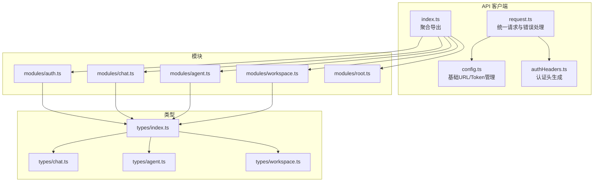
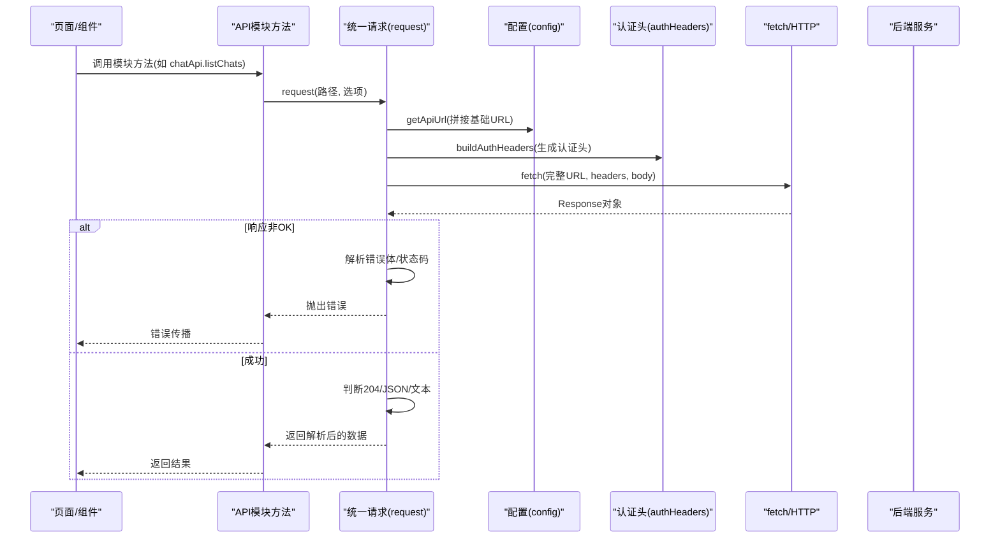
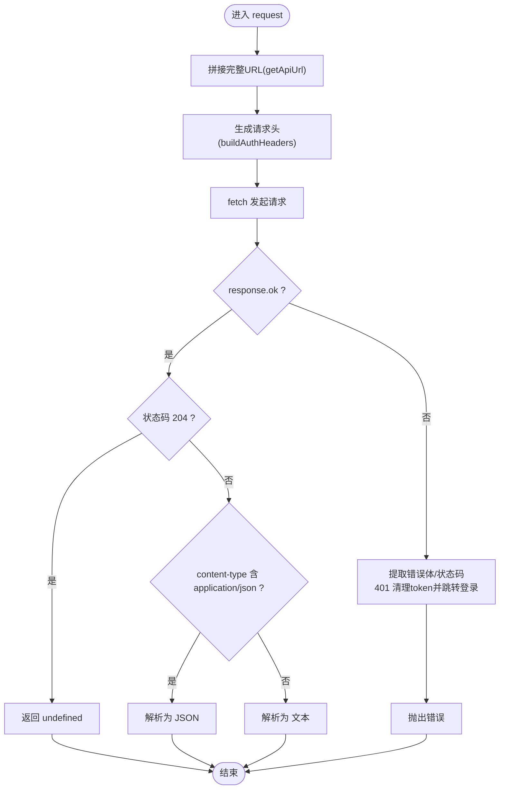
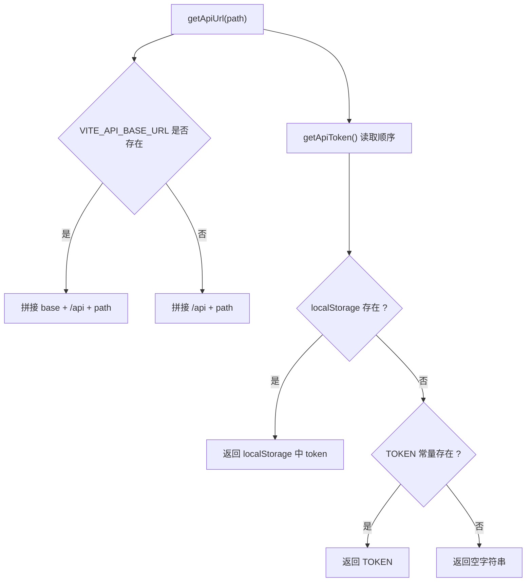
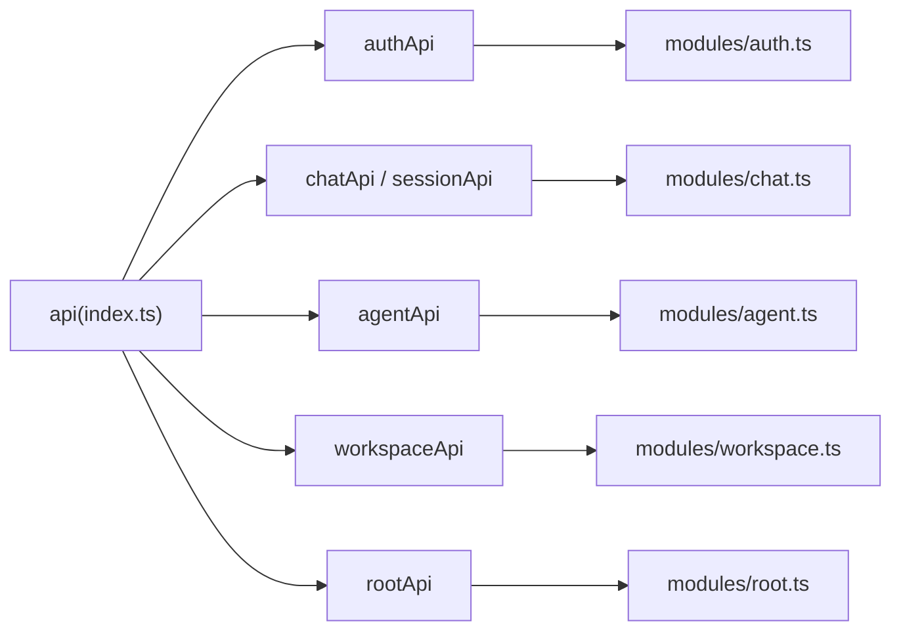
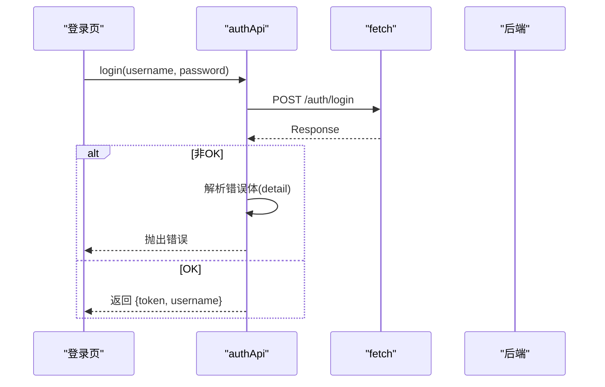
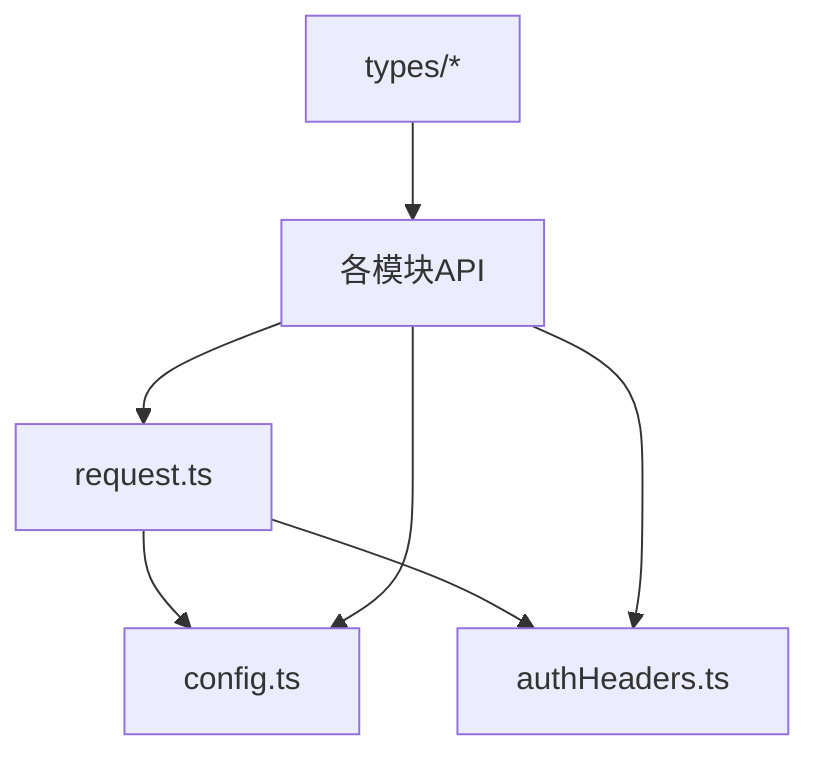

# API客户端

<cite>
**本文引用的文件**
- [console/src/api/request.ts](file://console/src/api/request.ts)
- [console/src/api/config.ts](file://console/src/api/config.ts)
- [console/src/api/authHeaders.ts](file://console/src/api/authHeaders.ts)
- [console/src/api/index.ts](file://console/src/api/index.ts)
- [console/src/api/modules/auth.ts](file://console/src/api/modules/auth.ts)
- [console/src/api/modules/root.ts](file://console/src/api/modules/root.ts)
- [console/src/api/modules/chat.ts](file://console/src/api/modules/chat.ts)
- [console/src/api/modules/agent.ts](file://console/src/api/modules/agent.ts)
- [console/src/api/modules/workspace.ts](file://console/src/api/modules/workspace.ts)
- [console/src/api/types/index.ts](file://console/src/api/types/index.ts)
- [console/src/api/types/chat.ts](file://console/src/api/types/chat.ts)
- [console/src/api/types/agent.ts](file://console/src/api/types/agent.ts)
- [console/src/api/types/workspace.ts](file://console/src/api/types/workspace.ts)
- [console/package.json](file://console/package.json)
</cite>

## 目录
1. [简介](#简介)
2. [项目结构](#项目结构)
3. [核心组件](#核心组件)
4. [架构总览](#架构总览)
5. [详细组件分析](#详细组件分析)
6. [依赖关系分析](#依赖关系分析)
7. [性能考虑](#性能考虑)
8. [故障排查指南](#故障排查指南)
9. [结论](#结论)
10. [附录](#附录)

## 简介
本文件为 QwenPaw 前端控制台的 API 客户端技术文档，聚焦于以下主题：
- 请求封装与设计模式：基于原生 fetch 的统一请求函数、请求/响应处理流程、错误提取策略
- 认证头管理：token 存储与读取、自动附加 Authorization 头、X-Agent-Id 代理头、401 自动登出
- API 配置管理：基础 URL 构建、构建期与运行时 token 注入、超时与错误处理策略
- 模块化 API 设计：按功能分层的模块组织、类型定义与接口规范
- 错误处理机制：网络错误、HTTP 状态码处理、用户可感知的错误提示
- 最佳实践与性能优化：请求头规范化、内容类型处理、二进制与 JSON 分流、上传下载流程
- 使用示例与场景：登录注册、聊天会话、工作区文件与打包下载、代理执行等

## 项目结构
控制台前端的 API 客户端位于 console/src/api 目录，采用“统一请求 + 按功能模块拆分”的组织方式：
- 统一入口与工具：request.ts（统一请求）、config.ts（基础 URL 与 token）、authHeaders.ts（认证头生成）
- 模块化 API：modules 下按领域划分（如 auth、chat、agent、workspace 等），每个模块导出一组强类型的 API 方法
- 类型系统：types 下集中定义各模块的数据模型与接口，供模块与上层页面共享

图表来源
- [console/src/api/request.ts:1-105](file://console/src/api/request.ts#L1-L105)
- [console/src/api/config.ts:1-42](file://console/src/api/config.ts#L1-L42)
- [console/src/api/authHeaders.ts:1-24](file://console/src/api/authHeaders.ts#L1-L24)
- [console/src/api/index.ts:1-85](file://console/src/api/index.ts#L1-L85)
- [console/src/api/modules/auth.ts:1-75](file://console/src/api/modules/auth.ts#L1-L75)
- [console/src/api/modules/chat.ts:1-137](file://console/src/api/modules/chat.ts#L1-L137)
- [console/src/api/modules/agent.ts:1-86](file://console/src/api/modules/agent.ts#L1-L86)
- [console/src/api/modules/workspace.ts:1-149](file://console/src/api/modules/workspace.ts#L1-L149)
- [console/src/api/types/index.ts:1-13](file://console/src/api/types/index.ts#L1-L13)
- [console/src/api/types/chat.ts:1-39](file://console/src/api/types/chat.ts#L1-L39)
- [console/src/api/types/agent.ts:1-67](file://console/src/api/types/agent.ts#L1-L67)
- [console/src/api/types/workspace.ts:1-22](file://console/src/api/types/workspace.ts#L1-L22)

章节来源
- [console/src/api/index.ts:1-85](file://console/src/api/index.ts#L1-L85)
- [console/src/api/request.ts:1-105](file://console/src/api/request.ts#L1-L105)
- [console/src/api/config.ts:1-42](file://console/src/api/config.ts#L1-L42)
- [console/src/api/authHeaders.ts:1-24](file://console/src/api/authHeaders.ts#L1-L24)
- [console/src/api/types/index.ts:1-13](file://console/src/api/types/index.ts#L1-L13)

## 核心组件
- 统一请求函数：封装 fetch 调用，负责 URL 拼接、默认请求头（含认证头）注入、响应体解析（JSON/文本/空）、错误提取与抛出
- 配置与认证：基础 URL 构建、运行时 token 读取与持久化、401 自动清理 token 并跳转登录
- 认证头生成：根据本地 token 添加 Authorization，从会话存储中读取选中代理并附加 X-Agent-Id
- 模块化 API：按领域拆分（认证、聊天、代理、工作区等），每个模块暴露强类型方法，内部复用统一请求或直接使用 fetch

章节来源
- [console/src/api/request.ts:60-104](file://console/src/api/request.ts#L60-L104)
- [console/src/api/config.ts:11-41](file://console/src/api/config.ts#L11-L41)
- [console/src/api/authHeaders.ts:4-23](file://console/src/api/authHeaders.ts#L4-L23)
- [console/src/api/index.ts:26-79](file://console/src/api/index.ts#L26-L79)

## 架构总览
下图展示从页面到后端的整体调用链路与关键处理点。

图表来源
- [console/src/api/request.ts:60-104](file://console/src/api/request.ts#L60-L104)
- [console/src/api/config.ts:11-16](file://console/src/api/config.ts#L11-L16)
- [console/src/api/authHeaders.ts:4-23](file://console/src/api/authHeaders.ts#L4-L23)
- [console/src/api/modules/chat.ts:56-62](file://console/src/api/modules/chat.ts#L56-L62)

## 详细组件分析

### 统一请求与错误处理（request.ts）
- URL 构建：基于环境变量与固定前缀拼接完整 API 地址，支持相对路径与绝对路径
- 请求头生成：仅对带请求体的方法自动设置 JSON Content-Type；自动注入 Authorization 与 X-Agent-Id；避免覆盖已显式提供的头
- 响应处理：204 视为空返回；非 200 抛出错误，优先从 JSON 错误体提取 detail/message/error 字段，否则回退为状态描述；成功时按 content-type 分支解析为 JSON 或文本
- 401 特殊处理：清空 token 并跳转登录页（若当前不在登录页）

图表来源
- [console/src/api/request.ts:60-104](file://console/src/api/request.ts#L60-L104)

章节来源
- [console/src/api/request.ts:1-105](file://console/src/api/request.ts#L1-L105)

### 配置与认证（config.ts、authHeaders.ts）
- 基础 URL：从构建期常量读取，支持开发/生产不同基座地址；固定前缀 /api
- Token 管理：优先从本地存储读取，其次回退到构建期常量；提供读取、设置、清理
- 认证头：自动附加 Authorization: Bearer <token>；从会话存储读取选中代理 ID 并附加 X-Agent-Id

图表来源
- [console/src/api/config.ts:11-41](file://console/src/api/config.ts#L11-L41)

章节来源
- [console/src/api/config.ts:1-42](file://console/src/api/config.ts#L1-L42)
- [console/src/api/authHeaders.ts:1-24](file://console/src/api/authHeaders.ts#L1-L24)

### 模块化 API 设计（index.ts 与各模块）
- 聚合导出：index.ts 将所有模块 API 聚合为一个命名空间，便于全局导入与使用
- 功能模块：
  - 认证模块：登录、注册、状态查询、更新资料
  - 聊天模块：文件上传、预览链接、列表/增删改查、批量删除、停止对话
  - 代理模块：健康检查、处理请求、运行配置、语言/音频/转录提供商设置、本地能力检测
  - 工作区模块：文件列表/读写、打包下载、文件上传、每日记忆读写、系统提示文件管理
  - 根模块：根路径访问、版本查询

图表来源
- [console/src/api/index.ts:7-79](file://console/src/api/index.ts#L7-L79)
- [console/src/api/modules/auth.ts:14-74](file://console/src/api/modules/auth.ts#L14-L74)
- [console/src/api/modules/chat.ts:21-97](file://console/src/api/modules/chat.ts#L21-L97)
- [console/src/api/modules/agent.ts:5-85](file://console/src/api/modules/agent.ts#L5-L85)
- [console/src/api/modules/workspace.ts:39-148](file://console/src/api/modules/workspace.ts#L39-L148)
- [console/src/api/modules/root.ts:4-7](file://console/src/api/modules/root.ts#L4-L7)

章节来源
- [console/src/api/index.ts:1-85](file://console/src/api/index.ts#L1-L85)
- [console/src/api/modules/auth.ts:1-75](file://console/src/api/modules/auth.ts#L1-L75)
- [console/src/api/modules/chat.ts:1-137](file://console/src/api/modules/chat.ts#L1-L137)
- [console/src/api/modules/agent.ts:1-86](file://console/src/api/modules/agent.ts#L1-L86)
- [console/src/api/modules/workspace.ts:1-149](file://console/src/api/modules/workspace.ts#L1-L149)
- [console/src/api/modules/root.ts:1-8](file://console/src/api/modules/root.ts#L1-L8)

### 类型系统与接口规范（types）
- 类型聚合：types/index.ts 导出各模块类型，便于模块间共享
- 数据模型：
  - 聊天：会话、消息、更新请求、删除响应、会话别名
  - 代理：请求载荷、运行配置、上下文压缩、工具结果压缩、嵌入配置等
  - 工作区：文件信息、内容、每日记忆文件、打包下载结果

章节来源
- [console/src/api/types/index.ts:1-13](file://console/src/api/types/index.ts#L1-L13)
- [console/src/api/types/chat.ts:1-39](file://console/src/api/types/chat.ts#L1-L39)
- [console/src/api/types/agent.ts:1-67](file://console/src/api/types/agent.ts#L1-L67)
- [console/src/api/types/workspace.ts:1-22](file://console/src/api/types/workspace.ts#L1-L22)

### 认证流程（登录/注册/状态）

图表来源
- [console/src/api/modules/auth.ts:14-26](file://console/src/api/modules/auth.ts#L14-L26)

章节来源
- [console/src/api/modules/auth.ts:1-75](file://console/src/api/modules/auth.ts#L1-L75)

### 聊天与文件上传
- 文件上传：FormData 提交，自动附加认证头；失败时解析文本错误并抛出
- 预览链接：带 token 查询参数，便于无权限访问的资源预览
- 会话管理：列表、创建、读取、更新、删除、批量删除、停止

章节来源
- [console/src/api/modules/chat.ts:21-97](file://console/src/api/modules/chat.ts#L21-L97)

### 代理与工作区
- 代理：健康检查、处理请求、运行配置读写、语言/音频/转录提供商设置、本地能力检测
- 工作区：文件 CRUD、打包下载（从响应头提取文件名）、文件上传、每日记忆、系统提示文件管理

章节来源
- [console/src/api/modules/agent.ts:1-86](file://console/src/api/modules/agent.ts#L1-L86)
- [console/src/api/modules/workspace.ts:1-149](file://console/src/api/modules/workspace.ts#L1-L149)

## 依赖关系分析
- 组件耦合：模块 API 通过统一请求函数与配置/认证头间接耦合，降低直接依赖
- 外部依赖：控制台前端使用 Vite + React 生态，API 层不引入额外 HTTP 库，保持轻量
- 可能的循环依赖：当前结构以工具函数与模块导出为主，未见明显循环

图表来源
- [console/src/api/request.ts:1-3](file://console/src/api/request.ts#L1-L3)
- [console/src/api/index.ts:1-85](file://console/src/api/index.ts#L1-L85)
- [console/src/api/types/index.ts:1-13](file://console/src/api/types/index.ts#L1-L13)

章节来源
- [console/src/api/index.ts:1-85](file://console/src/api/index.ts#L1-L85)
- [console/src/api/request.ts:1-105](file://console/src/api/request.ts#L1-L105)
- [console/src/api/types/index.ts:1-13](file://console/src/api/types/index.ts#L1-L13)

## 性能考虑
- 请求头最小化：仅在需要时设置 Content-Type，避免重复设置导致的开销
- 内容类型分流：204 空响应直接返回；非 JSON 文本直接读取文本，减少不必要的 JSON 解析
- 上传下载：文件上传使用 FormData，下载直接读取 Blob 并从响应头提取文件名，避免中间转换
- 代理头：X-Agent-Id 仅在存在时附加，减少无效头部
- 缓存与重试：当前未见内置缓存/重试逻辑，建议在上层业务或独立 Hook 中按需实现

## 故障排查指南
- 登录失败：检查后端返回的错误体字段（detail/message/error），确认用户名密码正确
- 401 未认证：确认 token 是否存在且未过期；确认是否被统一请求拦截并触发了自动登出
- 上传失败：检查后端返回的错误文本，确认文件大小与类型限制
- 预览链接失效：确认 token 查询参数是否正确附加，以及 token 是否有效
- JSON 解析异常：确认 content-type 是否为 application/json，或在非 JSON 场景下使用文本解析分支

章节来源
- [console/src/api/request.ts:73-91](file://console/src/api/request.ts#L73-L91)
- [console/src/api/modules/chat.ts:31-38](file://console/src/api/modules/chat.ts#L31-L38)

## 结论
该 API 客户端以“统一请求 + 模块化 API + 类型系统”为核心设计，具备清晰的职责分离与良好的扩展性。通过标准化的认证头管理、错误提取与响应处理，能够稳定支撑控制台前端的多类业务场景。建议在后续迭代中补充缓存/重试策略、统一的超时配置与更细粒度的错误分类，以进一步提升可靠性与可观测性。

## 附录
- 构建与运行：控制台前端使用 Vite + TypeScript，可通过脚本进行开发、构建与预览
- 关键文件路径参考：
  - 统一请求：[console/src/api/request.ts:60-104](file://console/src/api/request.ts#L60-L104)
  - 配置与认证：[console/src/api/config.ts:11-41](file://console/src/api/config.ts#L11-L41)、[console/src/api/authHeaders.ts:4-23](file://console/src/api/authHeaders.ts#L4-L23)
  - 模块聚合：[console/src/api/index.ts:26-79](file://console/src/api/index.ts#L26-L79)
  - 认证模块：[console/src/api/modules/auth.ts:14-74](file://console/src/api/modules/auth.ts#L14-L74)
  - 聊天模块：[console/src/api/modules/chat.ts:21-97](file://console/src/api/modules/chat.ts#L21-L97)
  - 代理模块：[console/src/api/modules/agent.ts:5-85](file://console/src/api/modules/agent.ts#L5-L85)
  - 工作区模块：[console/src/api/modules/workspace.ts:39-148](file://console/src/api/modules/workspace.ts#L39-L148)
  - 根模块：[console/src/api/modules/root.ts:4-7](file://console/src/api/modules/root.ts#L4-L7)
  - 类型系统：[console/src/api/types/index.ts:1-13](file://console/src/api/types/index.ts#L1-L13)

章节来源
- [console/package.json:1-62](file://console/package.json#L1-L62)