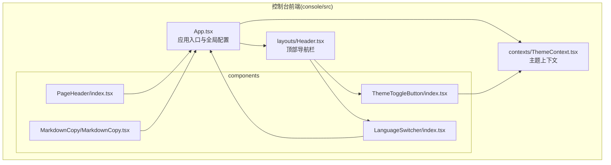
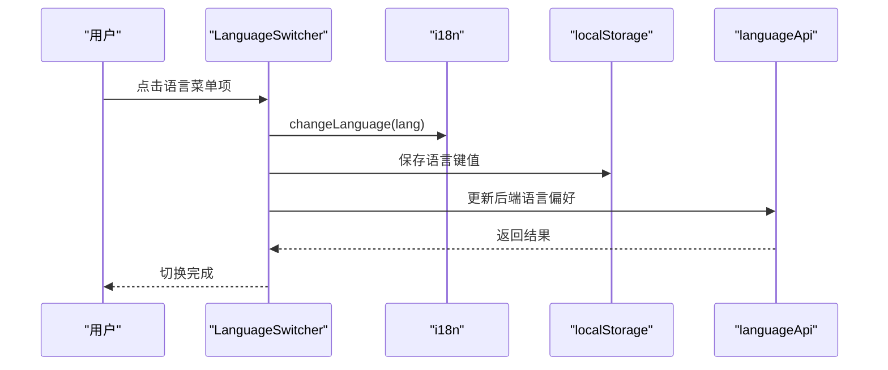
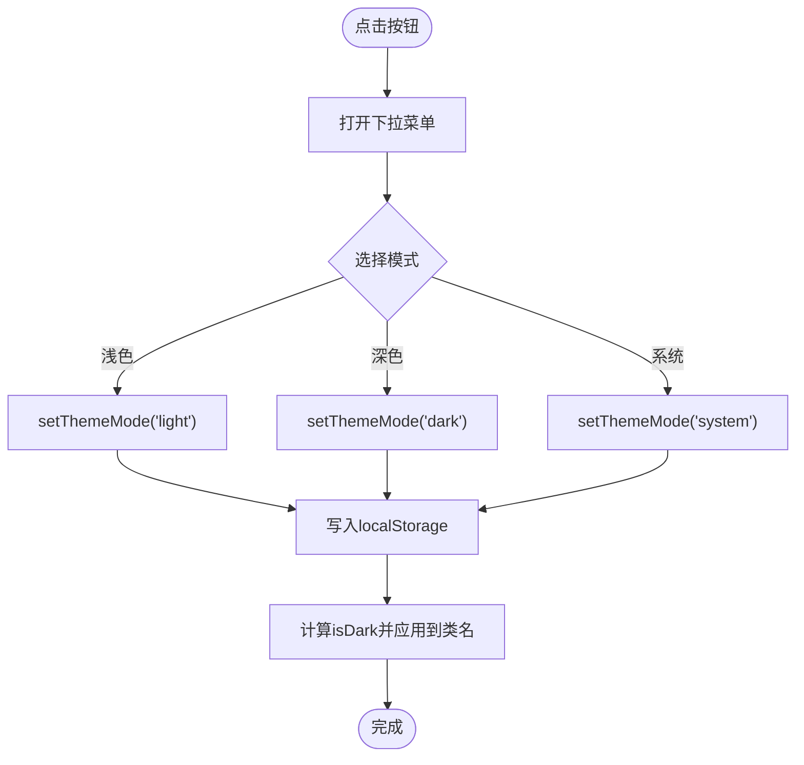
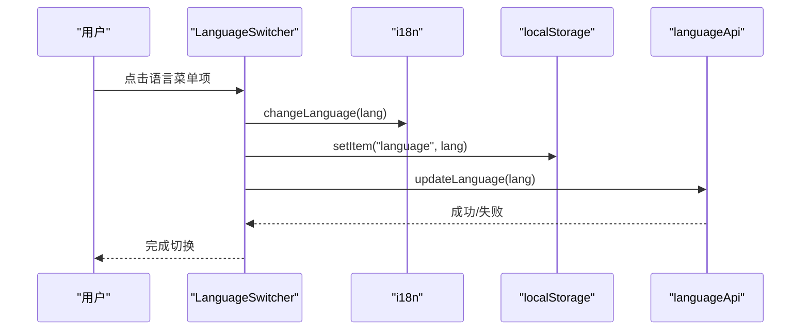
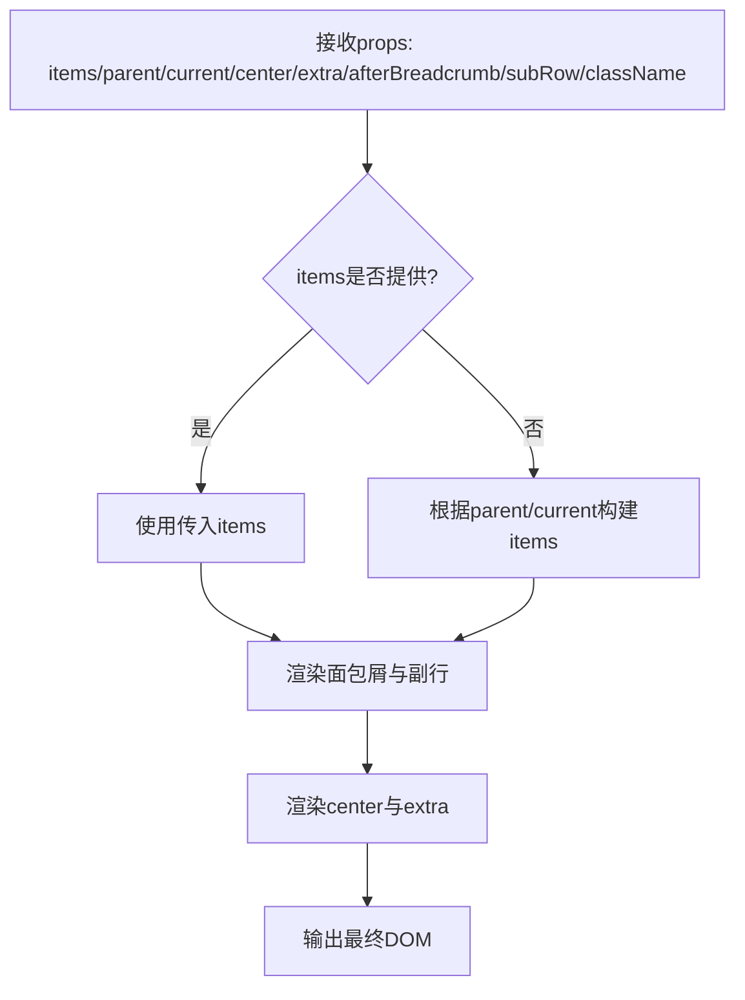
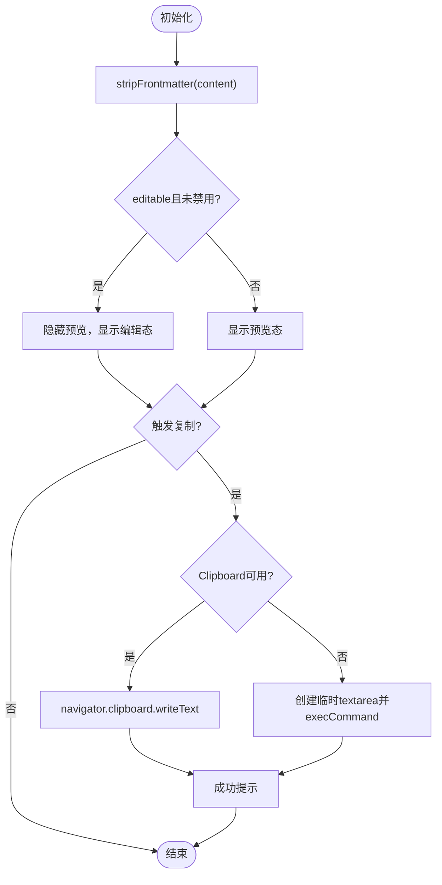
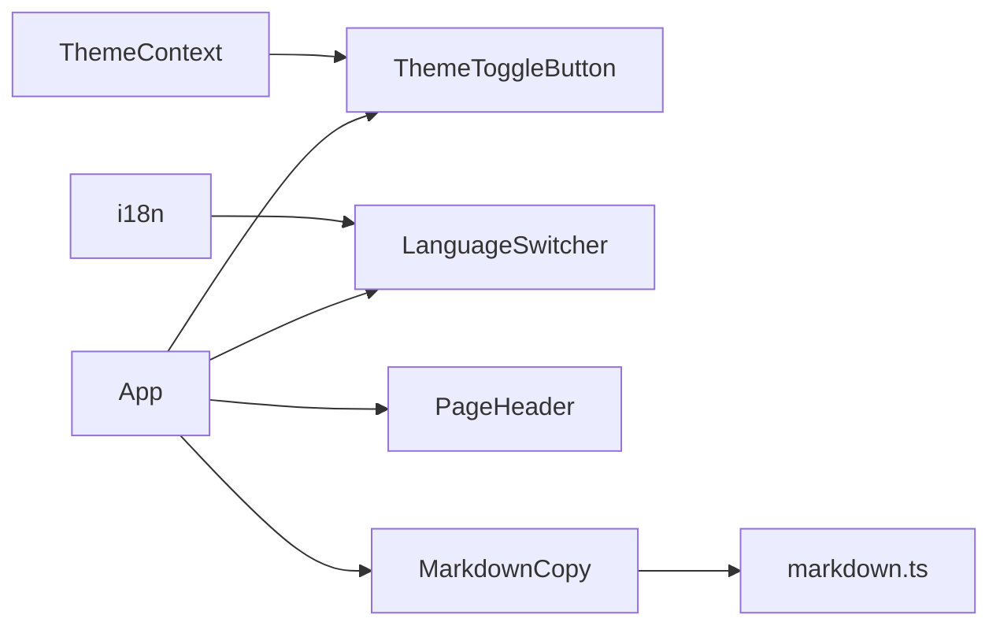

# UI组件库

<cite>
**本文引用的文件**
- [ThemeToggleButton/index.tsx](file://console/src/components/ThemeToggleButton/index.tsx)
- [ThemeToggleButton/index.module.less](file://console/src/components/ThemeToggleButton/index.module.less)
- [LanguageSwitcher/index.tsx](file://console/src/components/LanguageSwitcher/index.tsx)
- [LanguageSwitcher/index.module.less](file://console/src/components/LanguageSwitcher/index.module.less)
- [PageHeader/index.tsx](file://console/src/components/PageHeader/index.tsx)
- [PageHeader/index.module.less](file://console/src/components/PageHeader/index.module.less)
- [MarkdownCopy/MarkdownCopy.tsx](file://console/src/components/MarkdownCopy/MarkdownCopy.tsx)
- [MarkdownCopy/index.module.less](file://console/src/components/MarkdownCopy/index.module.less)
- [ThemeContext.tsx](file://console/src/contexts/ThemeContext.tsx)
- [Header.tsx](file://console/src/layouts/Header.tsx)
- [App.tsx](file://console/src/App.tsx)
- [markdown.ts](file://console/src/utils/markdown.ts)
- [en.json](file://console/src/locales/en.json)
- [main.tsx](file://console/src/main.tsx)
</cite>

## 目录
1. [简介](#简介)
2. [项目结构](#项目结构)
3. [核心组件](#核心组件)
4. [架构总览](#架构总览)
5. [组件详解](#组件详解)
6. [依赖关系分析](#依赖关系分析)
7. [性能考量](#性能考量)
8. [故障排查指南](#故障排查指南)
9. [结论](#结论)
10. [附录](#附录)

## 简介
本文件为 QwenPaw 控制台前端 UI 组件库的技术文档，聚焦以下四个核心组件：主题切换按钮、语言切换器、页面头部、Markdown 复制组件。文档从设计理念、实现细节、可复用性设计（props 接口、样式定制、行为扩展）、与主题系统集成（颜色、字号、间距统一管理）、无障碍与响应式支持、最佳实践与使用示例等方面进行系统化阐述，帮助开发者快速理解与扩展组件。

## 项目结构
控制台前端位于 console/src，组件集中在 console/src/components 下，主题上下文在 console/src/contexts，页面级布局在 console/src/layouts，国际化资源在 console/src/locales，应用入口在 console/src/main.tsx 与 console/src/App.tsx。

**图表来源**
- [App.tsx:1-196](file://console/src/App.tsx#L1-L196)
- [Header.tsx:1-306](file://console/src/layouts/Header.tsx#L1-L306)
- [ThemeContext.tsx:1-105](file://console/src/contexts/ThemeContext.tsx#L1-L105)
- [ThemeToggleButton/index.tsx:1-53](file://console/src/components/ThemeToggleButton/index.tsx#L1-L53)
- [LanguageSwitcher/index.tsx:1-69](file://console/src/components/LanguageSwitcher/index.tsx#L1-L69)
- [PageHeader/index.tsx:1-77](file://console/src/components/PageHeader/index.tsx#L1-L77)
- [MarkdownCopy/MarkdownCopy.tsx:1-197](file://console/src/components/MarkdownCopy/MarkdownCopy.tsx#L1-L197)

**章节来源**
- [App.tsx:1-196](file://console/src/App.tsx#L1-L196)
- [Header.tsx:1-306](file://console/src/layouts/Header.tsx#L1-L306)

## 核心组件
- 主题切换按钮：基于 Ant Design Dropdown 与自定义图标，提供浅色/深色/系统三种模式切换，并通过 ThemeContext 管理状态与持久化。
- 语言切换器：基于 @agentscope-ai/design 的 Dropdown，支持中英日俄四语种切换，持久化到本地存储并通过后端接口同步。
- 页面头部：通用页面头部容器，支持面包屑、副标题、右侧额外操作区等布局组合，便于复用。
- Markdown 复制组件：支持 Markdown 预览与文本编辑双态，一键复制，带前置元数据剥离与消息提示。

**章节来源**
- [ThemeToggleButton/index.tsx:1-53](file://console/src/components/ThemeToggleButton/index.tsx#L1-L53)
- [LanguageSwitcher/index.tsx:1-69](file://console/src/components/LanguageSwitcher/index.tsx#L1-L69)
- [PageHeader/index.tsx:1-77](file://console/src/components/PageHeader/index.tsx#L1-L77)
- [MarkdownCopy/MarkdownCopy.tsx:1-197](file://console/src/components/MarkdownCopy/MarkdownCopy.tsx#L1-L197)

## 架构总览
组件与主题系统通过上下文解耦，主题状态影响全局样式与组件外观；国际化由 i18n 驱动，语言切换器与 App 共同维护语言偏好；页面头部作为布局容器被多处复用；Markdown 复制组件内聚内容处理与交互逻辑。

**图表来源**
- [LanguageSwitcher/index.tsx:13-27](file://console/src/components/LanguageSwitcher/index.tsx#L13-L27)
- [App.tsx:119-149](file://console/src/App.tsx#L119-L149)

**章节来源**
- [ThemeContext.tsx:51-100](file://console/src/contexts/ThemeContext.tsx#L51-L100)
- [ThemeToggleButton/index.tsx:18-52](file://console/src/components/ThemeToggleButton/index.tsx#L18-L52)
- [LanguageSwitcher/index.tsx:13-27](file://console/src/components/LanguageSwitcher/index.tsx#L13-L27)
- [Header.tsx:52-219](file://console/src/layouts/Header.tsx#L52-L219)

## 组件详解

### 主题切换按钮
- 功能特性
  - 支持“浅色/深色/系统”三种模式，图标随当前模式变化。
  - 通过 Dropdown 提供下拉菜单，选中态高亮。
  - 模式变更持久化至 localStorage，并通过 HTML 类名驱动全局样式。
- 属性与行为
  - 无外部 props，内部通过 useTheme 获取 themeMode/isDark/setThemeMode/toggleTheme。
  - 选择项点击回调直接调用 setThemeMode。
- 样式定制
  - 使用模块化样式，支持暗色模式覆盖，按钮悬停与选中态颜色可按需调整。
- 可复用性
  - 作为独立按钮组件，可在任意顶部区域复用；如需扩展可暴露更多配置项（如尺寸、图标集）。

**图表来源**
- [ThemeToggleButton/index.tsx:18-52](file://console/src/components/ThemeToggleButton/index.tsx#L18-L52)
- [ThemeContext.tsx:51-100](file://console/src/contexts/ThemeContext.tsx#L51-L100)

**章节来源**
- [ThemeToggleButton/index.tsx:1-53](file://console/src/components/ThemeToggleButton/index.tsx#L1-L53)
- [ThemeToggleButton/index.module.less:1-86](file://console/src/components/ThemeToggleButton/index.module.less#L1-L86)
- [ThemeContext.tsx:1-105](file://console/src/contexts/ThemeContext.tsx#L1-L105)

### 语言切换器
- 功能特性
  - 四语种切换（中/英/日/俄），图标随语言变化。
  - 本地持久化语言键值，同时调用后端接口同步。
  - 与 i18n 事件联动，动态设置 Ant Design 与 dayjs 语言。
- 属性与行为
  - 无外部 props，内部读取当前 resolvedLanguage 或 language。
  - changeLanguage 内部封装了 i18n.changeLanguage、localStorage 与后端同步。
- 样式定制
  - 模块化样式支持暗色模式覆盖，菜单项 hover/选中态可定制。
- 可复用性
  - 作为顶部工具条组件，可直接复用；如需扩展可开放更多语言或图标映射。

**图表来源**
- [LanguageSwitcher/index.tsx:13-27](file://console/src/components/LanguageSwitcher/index.tsx#L13-L27)
- [App.tsx:119-149](file://console/src/App.tsx#L119-L149)

**章节来源**
- [LanguageSwitcher/index.tsx:1-69](file://console/src/components/LanguageSwitcher/index.tsx#L1-L69)
- [LanguageSwitcher/index.module.less:1-75](file://console/src/components/LanguageSwitcher/index.module.less#L1-L75)
- [App.tsx:119-149](file://console/src/App.tsx#L119-L149)

### 页面头部
- 功能特性
  - 支持自定义面包屑项数组或通过 parent/current 构建。
  - 支持中心区域与右侧 extra 区域，以及 afterBreadcrumb/subRow 副行。
- 属性与行为
  - items: 面包屑项数组（优先级高于 parent/current）。
  - parent/current: 简化场景下的父级与当前页标题。
  - center/extra/afterBreadcrumb/subRow/className: 布局与扩展点。
- 样式定制
  - 模块化样式，暗色模式下自动适配边框与文字颜色。
- 可复用性
  - 作为页面级通用头部，适合所有业务页面复用；可通过扩展 props 支持更多布局变体。

**图表来源**
- [PageHeader/index.tsx:31-76](file://console/src/components/PageHeader/index.tsx#L31-L76)

**章节来源**
- [PageHeader/index.tsx:1-77](file://console/src/components/PageHeader/index.tsx#L1-L77)
- [PageHeader/index.module.less:1-85](file://console/src/components/PageHeader/index.module.less#L1-L85)

### Markdown 复制组件
- 功能特性
  - 预览态渲染 Markdown，编辑态使用文本域；支持切换预览/编辑。
  - 一键复制，支持现代 Clipboard API 与回退方案；复制成功/失败消息提示。
  - 自动剥离 YAML 前置元数据，避免渲染异常。
- 属性与行为
  - content: Markdown 内容。
  - showMarkdown/onShowMarkdownChange: 预览开关与回调。
  - copyButtonProps/markdownViewerProps/textareaProps: 各子区域默认与透传属性。
  - showControls/editable/onContentChange: 控制区显示、可编辑与内容变更回调。
- 样式定制
  - 模块化样式，预览容器与文本域尺寸、边框、圆角可定制。
- 可复用性
  - 作为内容展示与编辑的通用组件，适合对话记录、技能描述、配置说明等场景；可进一步开放更多渲染选项与快捷键。

**图表来源**
- [MarkdownCopy/MarkdownCopy.tsx:54-196](file://console/src/components/MarkdownCopy/MarkdownCopy.tsx#L54-L196)
- [markdown.ts:8-9](file://console/src/utils/markdown.ts#L8-L9)

**章节来源**
- [MarkdownCopy/MarkdownCopy.tsx:1-197](file://console/src/components/MarkdownCopy/MarkdownCopy.tsx#L1-L197)
- [MarkdownCopy/index.module.less:1-63](file://console/src/components/MarkdownCopy/index.module.less#L1-L63)
- [markdown.ts:1-10](file://console/src/utils/markdown.ts#L1-L10)

## 依赖关系分析
- 主题系统
  - ThemeContext 提供 themeMode/isDark/setThemeMode/toggleTheme，并将 isDark 结果映射到 <html> 的 dark-mode 类，从而驱动组件样式覆盖。
- 国际化
  - App.tsx 监听语言变更，动态设置 Ant Design 与 dayjs 语言；LanguageSwitcher 负责切换与持久化。
- 组件间耦合
  - ThemeToggleButton 依赖 ThemeContext；LanguageSwitcher 依赖 i18n 与后端接口；PageHeader 与 MarkdownCopy 为纯展示/交互组件，低耦合高内聚。
- 外部依赖
  - Ant Design Dropdown/Button、@agentscope-ai/design、@ant-design/x-markdown、react-i18next、less 模块化样式。

**图表来源**
- [ThemeContext.tsx:1-105](file://console/src/contexts/ThemeContext.tsx#L1-L105)
- [ThemeToggleButton/index.tsx:1-53](file://console/src/components/ThemeToggleButton/index.tsx#L1-L53)
- [LanguageSwitcher/index.tsx:1-69](file://console/src/components/LanguageSwitcher/index.tsx#L1-L69)
- [PageHeader/index.tsx:1-77](file://console/src/components/PageHeader/index.tsx#L1-L77)
- [MarkdownCopy/MarkdownCopy.tsx:1-197](file://console/src/components/MarkdownCopy/MarkdownCopy.tsx#L1-L197)
- [markdown.ts:1-10](file://console/src/utils/markdown.ts#L1-L10)
- [App.tsx:119-149](file://console/src/App.tsx#L119-L149)

**章节来源**
- [ThemeContext.tsx:51-100](file://console/src/contexts/ThemeContext.tsx#L51-L100)
- [App.tsx:119-149](file://console/src/App.tsx#L119-L149)

## 性能考量
- 渲染优化
  - MarkdownCopy 使用 useMemo 对前置元数据剥离结果进行缓存，避免重复计算。
  - Markdown 预览容器高度固定，减少布局抖动。
- 交互体验
  - 复制流程异步执行，期间按钮 loading 状态提升反馈。
  - 语言切换与主题切换均采用本地存储，降低网络请求开销。
- 样式与主题
  - 通过 <html> 类名切换暗色模式，避免频繁重绘复杂样式树。

**章节来源**
- [MarkdownCopy/MarkdownCopy.tsx:60-63](file://console/src/components/MarkdownCopy/MarkdownCopy.tsx#L60-L63)
- [ThemeContext.tsx:57-65](file://console/src/contexts/ThemeContext.tsx#L57-L65)

## 故障排查指南
- 复制功能不可用
  - 若浏览器不支持 Clipboard API，组件会回退到临时 textarea 方案；若仍失败，请检查安全上下文与权限。
  - 查看控制台错误信息与消息提示，确认是否抛出异常。
- 语言切换无效
  - 确认 i18n.changeLanguage 已执行，localStorage 中 language 键已更新，后端接口返回成功。
  - 若后端失败，组件会打印错误日志，可重试或检查网络。
- 主题切换不生效
  - 检查 <html> 是否正确添加/移除 dark-mode 类；确认样式覆盖规则是否被其他样式覆盖。
- 国际化文案缺失
  - 检查对应语言包键值是否存在，确保 i18n 初始化与语言加载顺序正确。

**章节来源**
- [MarkdownCopy/MarkdownCopy.tsx:105-111](file://console/src/components/MarkdownCopy/MarkdownCopy.tsx#L105-L111)
- [LanguageSwitcher/index.tsx:22-26](file://console/src/components/LanguageSwitcher/index.tsx#L22-L26)
- [ThemeContext.tsx:57-65](file://console/src/contexts/ThemeContext.tsx#L57-L65)
- [App.tsx:119-149](file://console/src/App.tsx#L119-L149)

## 结论
本组件库以简洁的上下文与模块化样式为核心，实现了主题与语言的统一管理，提供了高复用的页面头部与 Markdown 编辑/展示能力。通过 props 扩展、样式覆盖与行为回调，组件可在不同业务场景中灵活适配。建议后续在国际化与主题变量层面引入更细粒度的 CSS 变量体系，以进一步提升一致性与可维护性。

## 附录

### 组件使用示例与扩展方法
- 主题切换按钮
  - 在顶部导航栏直接引入组件即可；如需自定义图标集或菜单项，可在组件内部扩展。
  - 参考路径：[ThemeToggleButton/index.tsx:1-53](file://console/src/components/ThemeToggleButton/index.tsx#L1-L53)
- 语言切换器
  - 在顶部导航栏引入；如需新增语言，扩展图标映射与菜单项列表。
  - 参考路径：[LanguageSwitcher/index.tsx:1-69](file://console/src/components/LanguageSwitcher/index.tsx#L1-L69)
- 页面头部
  - 传入 items 或 parent/current 即可；需要更多布局时，可扩展 center/extra 子区域。
  - 参考路径：[PageHeader/index.tsx:1-77](file://console/src/components/PageHeader/index.tsx#L1-L77)
- Markdown 复制组件
  - 传入 content，按需开启/关闭预览与控制区；如需自定义复制按钮样式，通过 copyButtonProps 透传。
  - 参考路径：[MarkdownCopy/MarkdownCopy.tsx:1-197](file://console/src/components/MarkdownCopy/MarkdownCopy.tsx#L1-L197)

### 最佳实践
- 命名规范
  - 组件目录与文件采用 PascalCase；样式文件使用模块化命名，前缀与项目一致。
- 代码组织
  - 将样式与逻辑分离，尽量保持组件纯函数式；上下文与工具函数集中管理。
- 文档编写
  - 为每个组件提供 props 表格、使用示例与注意事项；国际化文案统一在 locales 中维护。
- 无障碍与响应式
  - 使用语义化标签与可访问性属性；在样式中使用相对单位与媒体查询，保证在不同设备上的可读性与可触达性。

**章节来源**
- [en.json:1-28](file://console/src/locales/en.json#L1-L28)
- [main.tsx:1-31](file://console/src/main.tsx#L1-L31)