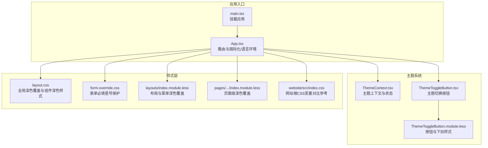
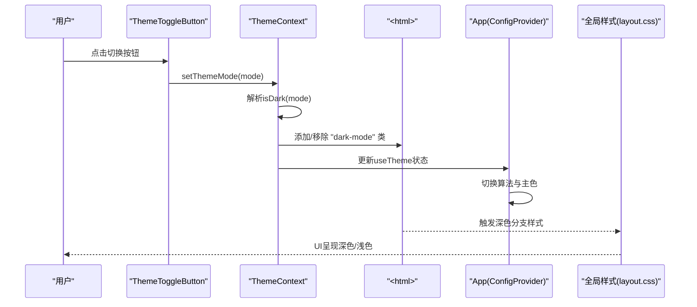
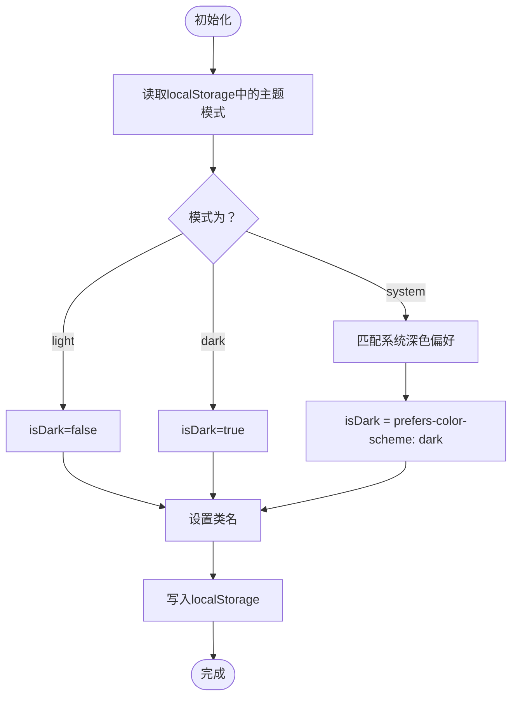
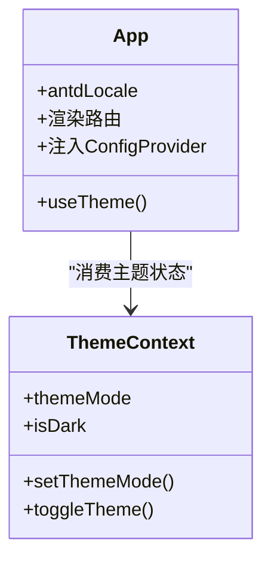
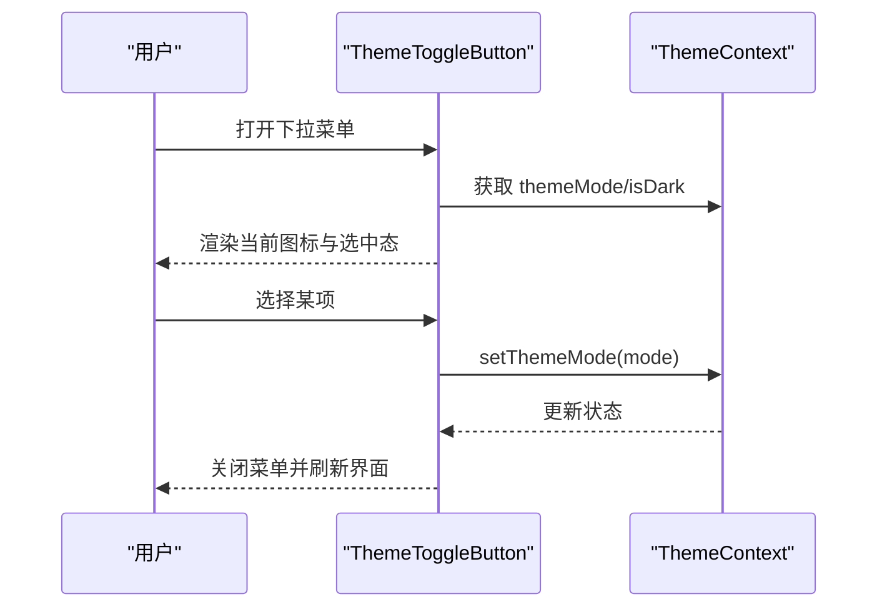
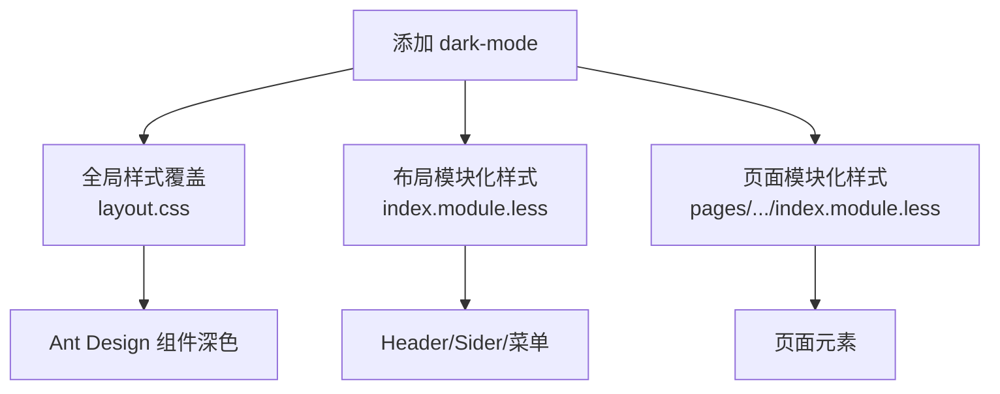
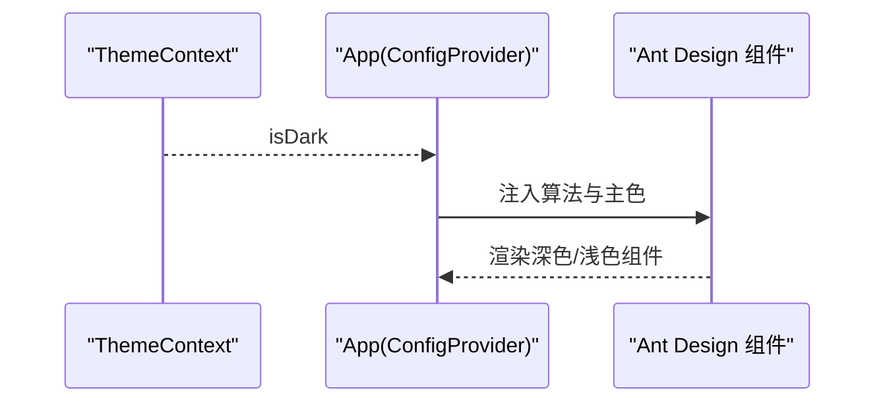
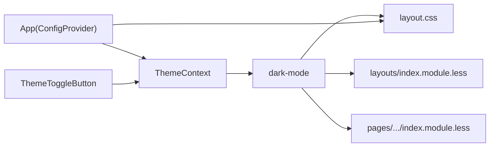

# 主题系统

<cite>
**本文引用的文件**   
- [ThemeContext.tsx](file://console/src/contexts/ThemeContext.tsx)
- [ThemeToggleButton.tsx](file://console/src/components/ThemeToggleButton/index.tsx)
- [ThemeToggleButton.module.less](file://console/src/components/ThemeToggleButton/index.module.less)
- [layout.css](file://console/src/styles/layout.css)
- [form-override.css](file://console/src/styles/form-override.css)
- [App.tsx](file://console/src/App.tsx)
- [main.tsx](file://console/src/main.tsx)
- [index.module.less（布局）](file://console/src/layouts/index.module.less)
- [index.module.less（页面：Agent/Config）](file://console/src/pages/Agent/Config/index.module.less)
- [index.css（网站根样式）](file://website/src/index.css)
</cite>

## 目录
1. [简介](#简介)
2. [项目结构](#项目结构)
3. [核心组件](#核心组件)
4. [架构总览](#架构总览)
5. [详细组件分析](#详细组件分析)
6. [依赖关系分析](#依赖关系分析)
7. [性能考量](#性能考量)
8. [故障排查指南](#故障排查指南)
9. [结论](#结论)
10. [附录](#附录)

## 简介
本文件面向QwenPaw前端控制台的主题系统，系统性阐述主题上下文、CSS变量管理、动态主题切换机制与暗/亮模式实现；解释Ant Design主题定制、全局样式覆盖与组件样式隔离策略；并给出主题与UI组件的集成方式、最佳实践与自定义主题开发指南。

## 项目结构
主题系统主要由以下部分组成：
- 主题上下文与切换逻辑：ThemeContext 提供主题模式选择、解析与持久化，并在DOM上应用“dark-mode”类名以驱动全局样式覆盖。
- UI入口与主题注入：App 将主题状态注入到Ant Design的ConfigProvider中，动态切换算法与主色。
- 样式覆盖层：通过全局CSS与模块化样式对Ant Design组件进行深色覆盖与局部样式隔离。
- 主题切换按钮：ThemeToggleButton 提供下拉菜单以切换主题模式。

**图表来源**
- [main.tsx:30-31](file://console/src/main.tsx#L30-L31)
- [App.tsx:187-196](file://console/src/App.tsx#L187-L196)
- [ThemeContext.tsx:51-105](file://console/src/contexts/ThemeContext.tsx#L51-L105)
- [ThemeToggleButton.tsx:18-53](file://console/src/components/ThemeToggleButton/index.tsx#L18-L53)
- [ThemeToggleButton.module.less:1-86](file://console/src/components/ThemeToggleButton/index.module.less#L1-L86)
- [layout.css:1-1036](file://console/src/styles/layout.css#L1-L1036)
- [form-override.css:1-16](file://console/src/styles/form-override.css#L1-L16)
- [index.module.less（布局）:535-635](file://console/src/layouts/index.module.less#L535-L635)
- [index.module.less（页面：Agent/Config）:173-199](file://console/src/pages/Agent/Config/index.module.less#L173-L199)
- [index.css（网站根样式）:31-80](file://website/src/index.css#L31-L80)

**章节来源**
- [main.tsx:1-31](file://console/src/main.tsx#L1-L31)
- [App.tsx:1-196](file://console/src/App.tsx#L1-L196)
- [ThemeContext.tsx:1-105](file://console/src/contexts/ThemeContext.tsx#L1-L105)
- [ThemeToggleButton.tsx:1-53](file://console/src/components/ThemeToggleButton/index.tsx#L1-L53)
- [ThemeToggleButton.module.less:1-86](file://console/src/components/ThemeToggleButton/index.module.less#L1-L86)
- [layout.css:1-1036](file://console/src/styles/layout.css#L1-L1036)
- [form-override.css:1-16](file://console/src/styles/form-override.css#L1-L16)
- [index.module.less（布局）:1-635](file://console/src/layouts/index.module.less#L1-L635)
- [index.module.less（页面：Agent/Config）:173-199](file://console/src/pages/Agent/Config/index.module.less#L173-L199)
- [index.css（网站根样式）:31-80](file://website/src/index.css#L31-L80)

## 核心组件
- 主题上下文（ThemeContext）
  - 负责主题模式（light/dark/system）的读取、解析与持久化，计算最终是否深色，并在<html>上添加/移除“dark-mode”类名以驱动全局样式。
  - 对系统主题变化进行监听，当模式为“system”时自动同步深色状态。
- 应用注入（App）
  - 使用Ant Design的ConfigProvider注入主题算法与主色；根据主题上下文动态切换算法（默认/深色），并设置前缀与本地化。
- 切换按钮（ThemeToggleButton）
  - 基于Ant Design的Dropdown与Button，提供light/dark/system三态切换，图标随当前模式或系统偏好变化而变化。
- 样式覆盖（layout.css、form-override.css、模块化样式）
  - 通过全局CSS对Ant Design组件进行深色覆盖；通过模块化样式对按钮、下拉菜单等进行深色覆盖与交互样式隔离。

**章节来源**
- [ThemeContext.tsx:10-105](file://console/src/contexts/ThemeContext.tsx#L10-L105)
- [App.tsx:154-168](file://console/src/App.tsx#L154-L168)
- [ThemeToggleButton.tsx:18-53](file://console/src/components/ThemeToggleButton/index.tsx#L18-L53)
- [ThemeToggleButton.module.less:1-86](file://console/src/components/ThemeToggleButton/index.module.less#L1-L86)
- [layout.css:14-1036](file://console/src/styles/layout.css#L14-L1036)
- [form-override.css:1-16](file://console/src/styles/form-override.css#L1-L16)

## 架构总览
主题系统采用“上下文状态 + DOM类名 + 全局样式覆盖”的组合方案：
- 上下文状态决定最终深色与否；
- 在<html>上添加“dark-mode”类名，使所有全局样式与组件样式进入深色分支；
- Ant Design的ConfigProvider根据深色状态切换算法，保证组件主题一致性；
- 模块化样式对特定组件进行深色覆盖与交互优化。

**图表来源**
- [ThemeToggleButton.tsx:18-53](file://console/src/components/ThemeToggleButton/index.tsx#L18-L53)
- [ThemeContext.tsx:51-105](file://console/src/contexts/ThemeContext.tsx#L51-L105)
- [App.tsx:154-168](file://console/src/App.tsx#L154-L168)
- [layout.css:14-1036](file://console/src/styles/layout.css#L14-L1036)

## 详细组件分析

### 主题上下文（ThemeContext）
- 主题模式类型与解析
  - 支持light/dark/system三种模式；当为system时，依据系统媒体查询“(prefers-color-scheme: dark)”解析深色状态。
- 状态持久化
  - 使用localStorage保存用户选择，初始化优先读取存储值，兜底为system。
- DOM类名注入
  - 在<html>上添加/移除“dark-mode”类名，作为全局样式覆盖的触发条件。
- 事件监听
  - 当模式为system时，监听系统深色偏好变化，实时更新isDark。

**图表来源**
- [ThemeContext.tsx:32-49](file://console/src/contexts/ThemeContext.tsx#L32-L49)
- [ThemeContext.tsx:57-77](file://console/src/contexts/ThemeContext.tsx#L57-L77)
- [ThemeContext.tsx:79-91](file://console/src/contexts/ThemeContext.tsx#L79-L91)

**章节来源**
- [ThemeContext.tsx:10-105](file://console/src/contexts/ThemeContext.tsx#L10-L105)

### 应用注入（App）
- Ant Design主题注入
  - 通过ConfigProvider注入bailian主题与前缀，动态设置算法（默认/深色）与主色。
- 国际化与语言环境
  - 维护AntD与dayjs的多语言映射，支持语言变更事件。
- 路由与鉴权
  - 通过AuthGuard处理登录态校验，未登录跳转至登录页。

**图表来源**
- [App.tsx:110-185](file://console/src/App.tsx#L110-L185)
- [ThemeContext.tsx:102-105](file://console/src/contexts/ThemeContext.tsx#L102-L105)

**章节来源**
- [App.tsx:1-196](file://console/src/App.tsx#L1-L196)

### 主题切换按钮（ThemeToggleButton）
- 功能
  - 下拉菜单提供light/dark/system三态切换；图标根据当前模式或系统偏好动态变化。
- 样式
  - 按钮与下拉菜单在浅色与深色模式下分别有不同颜色与阴影；使用模块化样式隔离作用域。

**图表来源**
- [ThemeToggleButton.tsx:18-53](file://console/src/components/ThemeToggleButton/index.tsx#L18-L53)
- [ThemeToggleButton.module.less:1-86](file://console/src/components/ThemeToggleButton/index.module.less#L1-L86)
- [ThemeContext.tsx:79-91](file://console/src/contexts/ThemeContext.tsx#L79-L91)

**章节来源**
- [ThemeToggleButton.tsx:1-53](file://console/src/components/ThemeToggleButton/index.tsx#L1-L53)
- [ThemeToggleButton.module.less:1-86](file://console/src/components/ThemeToggleButton/index.module.less#L1-L86)

### 样式覆盖策略
- 全局深色覆盖（layout.css）
  - 在<html class="dark-mode">下对Ant Design组件（布局、卡片、表格、输入、选择器、日期选择器、模态框、抽屉、滑块、Tooltip等）进行统一深色覆盖。
  - 针对聊天区域、禁用覆盖、表单标签等场景进行专项覆盖。
- 表单必填星号保护（form-override.css）
  - 保护Ant Design与自定义组件的必填星号颜色，避免第三方样式覆盖。
- 布局与菜单深色覆盖（layouts/index.module.less）
  - 对Header、Sider、菜单项、折叠按钮等在深色模式下的颜色与交互进行覆盖。
- 页面级深色覆盖（pages/.../index.module.less）
  - 对特定页面（如Agent/Config）的面包屑、页脚、滑块数值等进行深色覆盖。

**图表来源**
- [layout.css:14-1036](file://console/src/styles/layout.css#L14-L1036)
- [form-override.css:1-16](file://console/src/styles/form-override.css#L1-L16)
- [index.module.less（布局）:535-635](file://console/src/layouts/index.module.less#L535-L635)
- [index.module.less（页面：Agent/Config）:173-199](file://console/src/pages/Agent/Config/index.module.less#L173-L199)

**章节来源**
- [layout.css:1-1036](file://console/src/styles/layout.css#L1-L1036)
- [form-override.css:1-16](file://console/src/styles/form-override.css#L1-L16)
- [index.module.less（布局）:535-635](file://console/src/layouts/index.module.less#L535-L635)
- [index.module.less（页面：Agent/Config）:173-199](file://console/src/pages/Agent/Config/index.module.less#L173-L199)

### Ant Design主题定制与动态切换
- 算法切换
  - 根据isDark选择antd默认算法或深色算法，确保组件整体风格一致。
- 主色与前缀
  - 设置主色为固定值，统一品牌视觉；设置prefix与prefixCls以避免命名冲突。
- 前缀隔离
  - 使用“qwenpaw”前缀隔离组件命名空间，避免与第三方组件冲突。

**图表来源**
- [App.tsx:154-168](file://console/src/App.tsx#L154-L168)
- [ThemeContext.tsx:102-105](file://console/src/contexts/ThemeContext.tsx#L102-L105)

**章节来源**
- [App.tsx:154-168](file://console/src/App.tsx#L154-L168)

### 暗色模式与亮色模式实现
- 模式解析
  - light：强制浅色；dark：强制深色；system：跟随系统偏好。
- DOM触发
  - 通过<html>上的“dark-mode”类名驱动全局样式分支。
- 组件适配
  - Ant Design组件通过算法切换；自定义组件通过模块化样式覆盖实现深色分支。

**章节来源**
- [ThemeContext.tsx:32-49](file://console/src/contexts/ThemeContext.tsx#L32-L49)
- [layout.css:14-1036](file://console/src/styles/layout.css#L14-L1036)
- [index.module.less（布局）:535-635](file://console/src/layouts/index.module.less#L535-L635)

### 用户偏好检测、状态管理与持久化
- 偏好检测
  - 读取localStorage中的主题模式；若无则system；系统模式下监听window.matchMedia变化。
- 状态管理
  - React状态与useEffect驱动DOM类名与isDark状态；回调函数用于切换与持久化。
- 持久化
  - setThemeMode后写入localStorage，确保刷新后仍保持用户选择。

**章节来源**
- [ThemeContext.tsx:32-49](file://console/src/contexts/ThemeContext.tsx#L32-L49)
- [ThemeContext.tsx:79-91](file://console/src/contexts/ThemeContext.tsx#L79-L91)

### CSS样式覆盖策略与组件样式隔离
- 全局覆盖
  - 通过全局CSS对Ant Design组件进行深色覆盖，确保一致性。
- 模块化隔离
  - 使用模块化样式对按钮、下拉菜单等进行作用域隔离，避免跨组件污染。
- 必填星号保护
  - 通过form-override.css保护必填标记颜色，防止第三方样式覆盖。
- 前缀隔离
  - Ant Design与自定义组件均使用“qwenpaw”前缀，避免命名冲突。

**章节来源**
- [layout.css:1-1036](file://console/src/styles/layout.css#L1-L1036)
- [ThemeToggleButton.module.less:1-86](file://console/src/components/ThemeToggleButton/index.module.less#L1-L86)
- [form-override.css:1-16](file://console/src/styles/form-override.css#L1-L16)
- [App.tsx:154-158](file://console/src/App.tsx#L154-L158)

### 主题与UI组件的集成
- 颜色变量使用
  - Ant Design通过算法与主色统一；自定义组件通过模块化样式与全局深色分支实现颜色一致性。
- 动画与视觉反馈
  - 按钮悬停、菜单选中、折叠按钮等在深色模式下具有明确的颜色与背景反馈。
- 可访问性
  - 深色模式下文本与背景对比度提升，提高可读性；必要处保留高对比度强调色。

**章节来源**
- [ThemeToggleButton.module.less:18-22](file://console/src/components/ThemeToggleButton/index.module.less#L18-L22)
- [index.module.less（布局）:598-619](file://console/src/layouts/index.module.less#L598-L619)
- [layout.css:14-1036](file://console/src/styles/layout.css#L14-L1036)

## 依赖关系分析
- ThemeContext 依赖 window.matchMedia 与 localStorage，负责状态解析与持久化。
- App 依赖 Ant Design 的 ConfigProvider，动态注入算法与主色。
- 全局样式依赖<html>的“dark-mode”类名，形成全局覆盖链路。
- 模块化样式与全局样式共同作用于Ant Design组件，实现深色覆盖与隔离。

**图表来源**
- [ThemeContext.tsx:57-77](file://console/src/contexts/ThemeContext.tsx#L57-L77)
- [App.tsx:154-168](file://console/src/App.tsx#L154-L168)
- [layout.css:14-1036](file://console/src/styles/layout.css#L14-L1036)
- [index.module.less（布局）:535-635](file://console/src/layouts/index.module.less#L535-L635)

**章节来源**
- [ThemeContext.tsx:51-105](file://console/src/contexts/ThemeContext.tsx#L51-L105)
- [App.tsx:154-168](file://console/src/App.tsx#L154-L168)
- [layout.css:14-1036](file://console/src/styles/layout.css#L14-L1036)

## 性能考量
- DOM类名切换成本低，仅影响全局样式分支，不触发大规模重排。
- Ant Design算法切换在ConfigProvider内完成，按需渲染，避免重复计算。
- 模块化样式作用域明确，减少全局样式冲突带来的重绘。
- 建议：避免在深色切换时频繁创建/销毁组件实例，尽量复用现有组件树。

## 故障排查指南
- 深色模式未生效
  - 检查<html>是否正确添加“dark-mode”类名；确认localStorage中主题模式是否被持久化。
- 组件颜色异常
  - 检查全局样式覆盖是否命中；确认Ant Design算法是否正确切换；检查模块化样式是否被正确引入。
- 必填星号颜色异常
  - 检查form-override.css是否加载；确认第三方组件是否覆盖了必填标记样式。
- 切换按钮无效
  - 检查ThemeToggleButton是否正确消费useTheme；确认setThemeMode是否被调用且未抛错。

**章节来源**
- [ThemeContext.tsx:57-91](file://console/src/contexts/ThemeContext.tsx#L57-L91)
- [layout.css:1-1036](file://console/src/styles/layout.css#L1-L1036)
- [form-override.css:1-16](file://console/src/styles/form-override.css#L1-L16)
- [ThemeToggleButton.tsx:18-53](file://console/src/components/ThemeToggleButton/index.tsx#L18-L53)

## 结论
QwenPaw前端主题系统通过“上下文状态 + DOM类名 + 全局样式覆盖 + Ant Design动态注入”的组合，实现了稳定、可扩展的暗/亮主题体系。模块化样式与前缀隔离确保了组件间的样式安全；持久化与系统偏好监听提升了用户体验。该架构易于扩展，适合进一步引入更多主题变体与品牌色彩。

## 附录

### 最佳实践
- 颜色搭配
  - 使用统一主色与辅助色；深色模式下提高文本对比度，确保可读性。
- 可访问性
  - 注意高对比度与键盘导航；避免纯色闪烁与动画过度。
- 性能优化
  - 减少全局样式重绘；优先使用模块化样式；避免在切换时重建大型组件树。
- 主题扩展
  - 引入更多主题变量与算法；为第三方组件提供覆盖层；保持前缀与命名规范一致。

### 自定义主题开发指南
- 定义主题变量
  - 在全局CSS中定义颜色变量，作为Ant Design与自定义组件的统一来源。
- 编写深色覆盖
  - 在<html class="dark-mode">下编写组件深色覆盖规则，确保与默认样式互补。
- 注入Ant Design
  - 在App中通过ConfigProvider注入算法与主色，保持组件风格一致。
- 按需模块化
  - 对按钮、下拉菜单等组件使用模块化样式，避免全局污染。
- 测试与验证
  - 在light/dark/system三种模式下测试关键页面与组件；关注第三方组件的兼容性。

**章节来源**
- [index.css（网站根样式）:31-80](file://website/src/index.css#L31-L80)
- [App.tsx:154-168](file://console/src/App.tsx#L154-L168)
- [layout.css:14-1036](file://console/src/styles/layout.css#L14-L1036)
- [ThemeContext.tsx:57-77](file://console/src/contexts/ThemeContext.tsx#L57-L77)