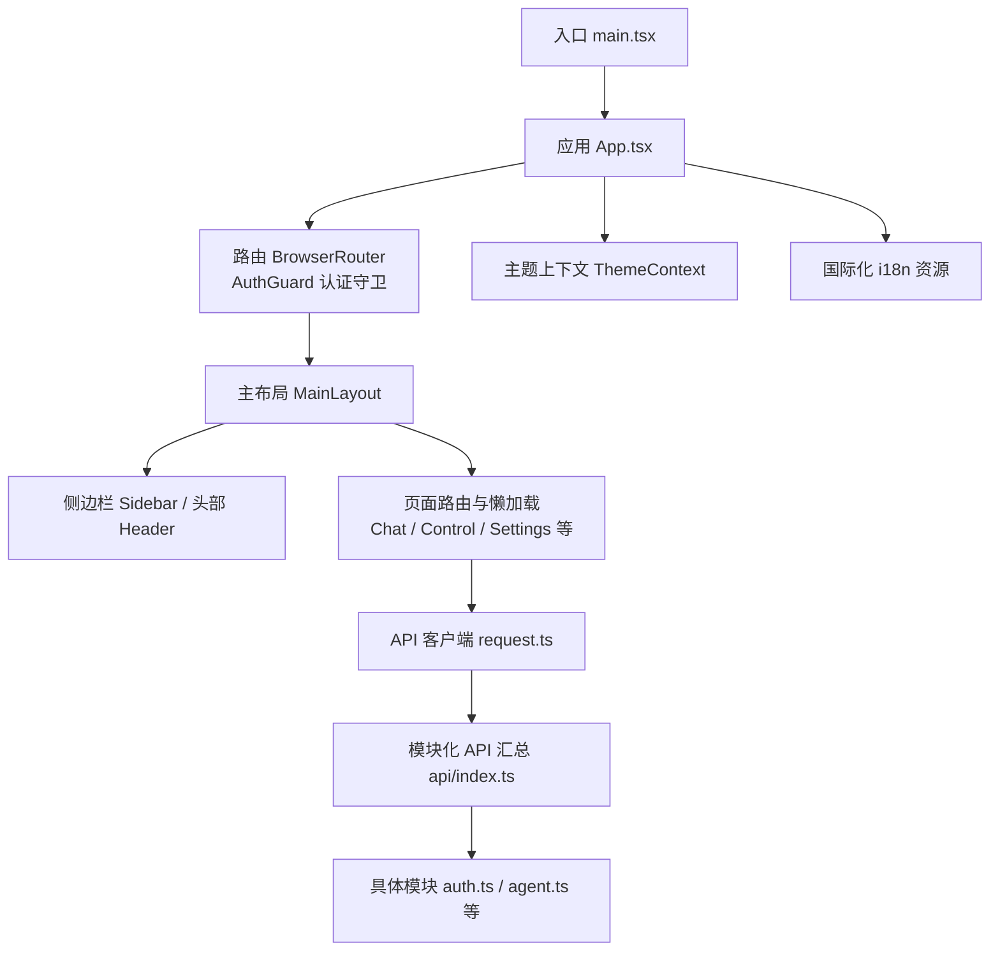
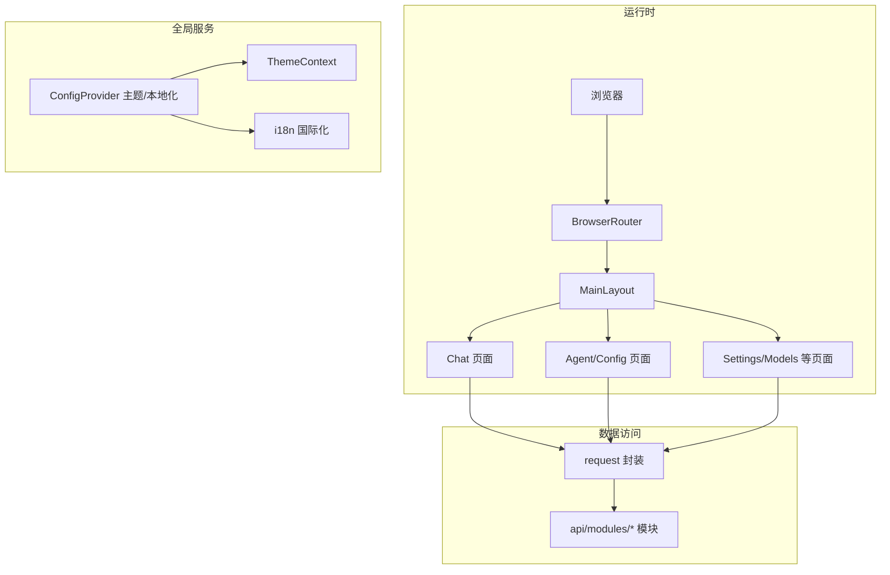
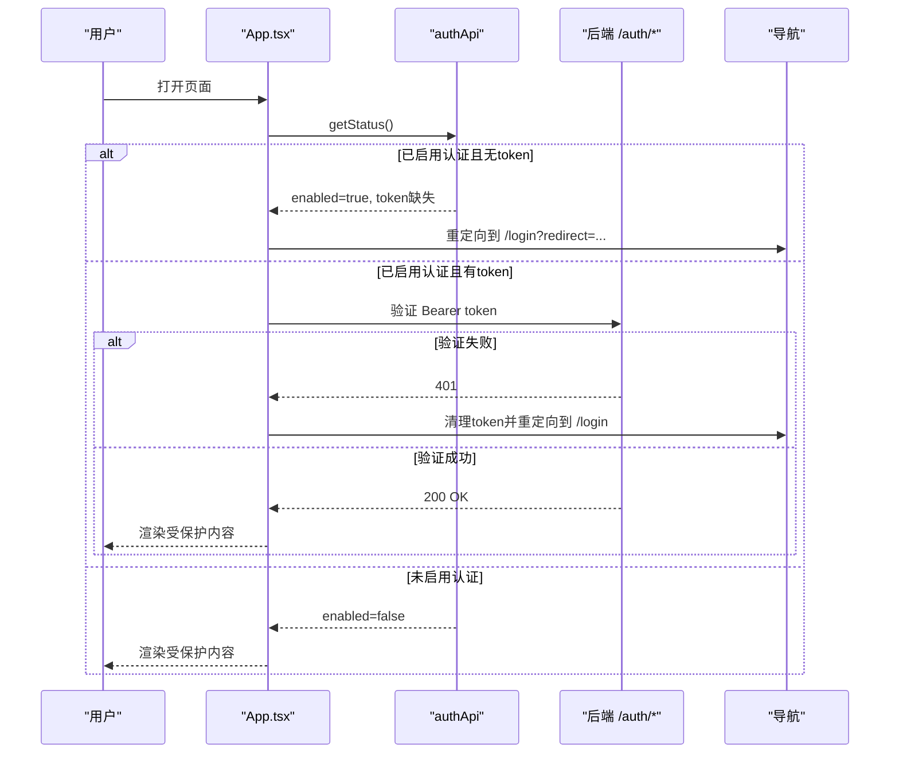
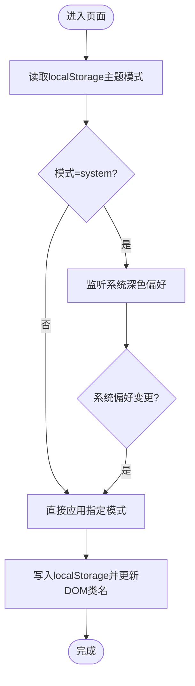
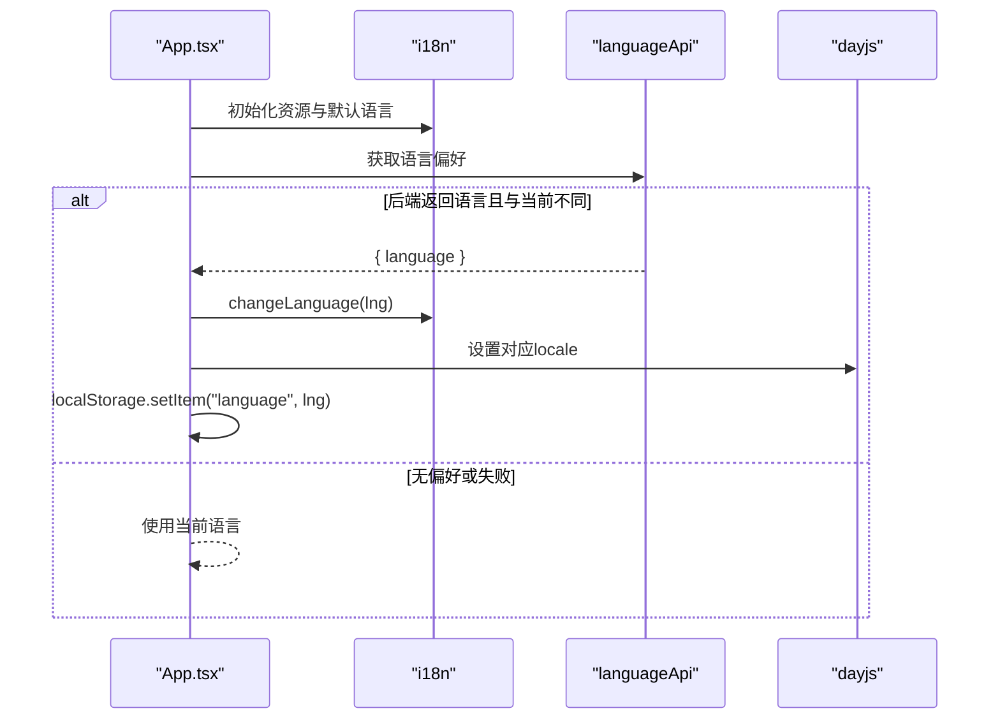
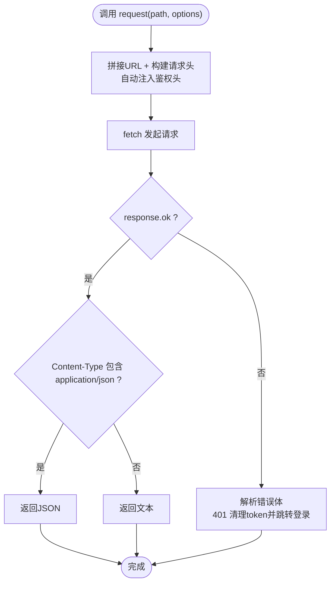
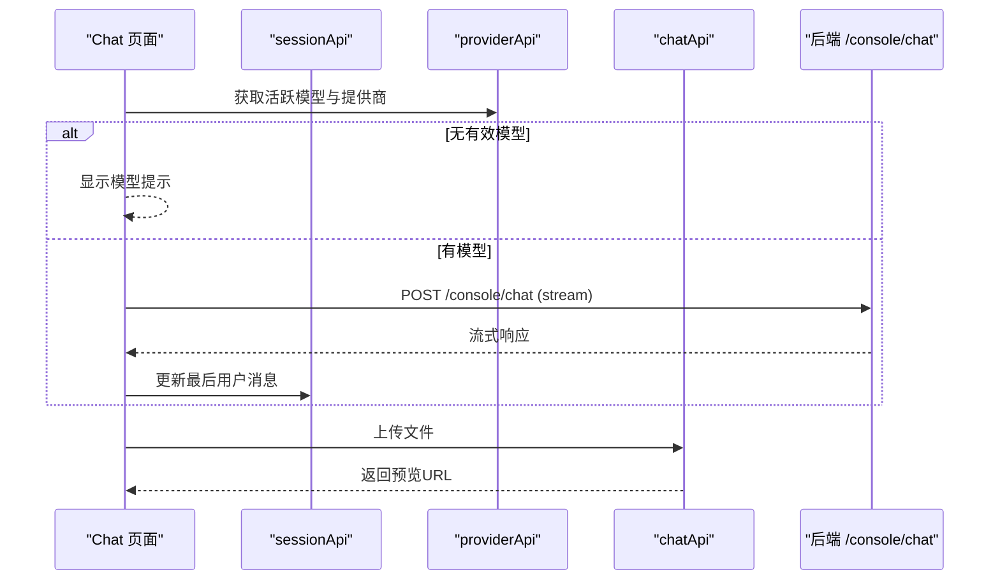
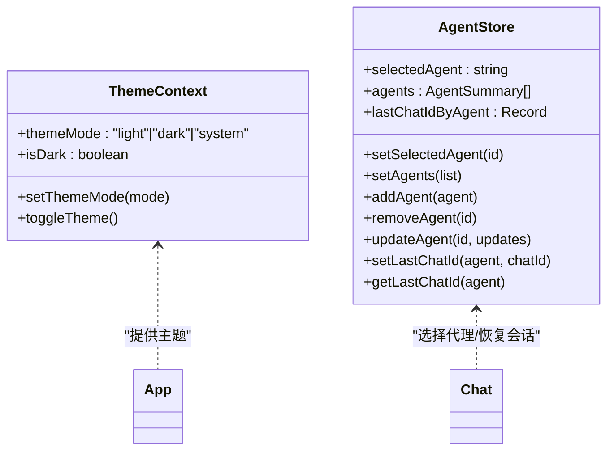
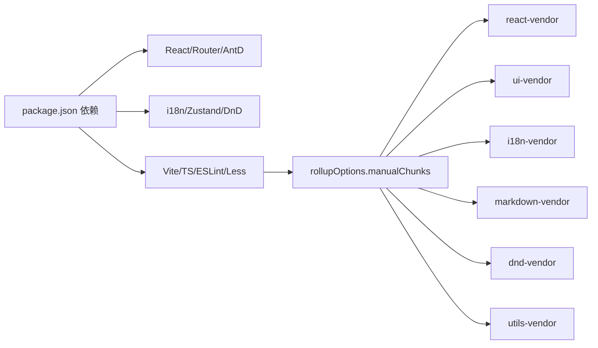

# 前端控制台

<cite>
**本文引用的文件**
- [package.json](file://console/package.json)
- [main.tsx](file://console/src/main.tsx)
- [App.tsx](file://console/src/App.tsx)
- [vite.config.ts](file://console/vite.config.ts)
- [i18n.ts](file://console/src/i18n.ts)
- [request.ts](file://console/src/api/request.ts)
- [api/index.ts](file://console/src/api/index.ts)
- [auth.ts](file://console/src/api/modules/auth.ts)
- [agent.ts](file://console/src/api/modules/agent.ts)
- [ThemeContext.tsx](file://console/src/contexts/ThemeContext.tsx)
- [ThemeToggleButton/index.tsx](file://console/src/components/ThemeToggleButton/index.tsx)
- [MainLayout/index.tsx](file://console/src/layouts/MainLayout/index.tsx)
- [Chat/index.tsx](file://console/src/pages/Chat/index.tsx)
- [Agent/Config/index.tsx](file://console/src/pages/Agent/Config/index.tsx)
- [agentStore.ts](file://console/src/stores/agentStore.ts)
</cite>

## 目录
1. [引言](#引言)
2. [项目结构](#项目结构)
3. [核心组件](#核心组件)
4. [架构总览](#架构总览)
5. [详细组件分析](#详细组件分析)
6. [依赖分析](#依赖分析)
7. [性能考虑](#性能考虑)
8. [故障排查指南](#故障排查指南)
9. [结论](#结论)
10. [附录](#附录)

## 引言
本文件面向QwenPaw前端控制台（React + TypeScript）的开发者与维护者，系统性梳理其架构设计、组件层次、状态管理、路由配置、主题与国际化、API客户端设计、页面功能实现、UI组件使用与自定义、构建与部署流程、性能优化与调试技巧，以及前后端交互协议与数据格式。目标是帮助读者快速理解并高效扩展控制台能力。

## 项目结构
控制台采用Vite + React 18 + TypeScript + Ant Design + Ant Design X（@agentscope-ai/design）的现代前端栈，按“布局-页面-组件-API-上下文-状态”分层组织。关键目录与职责概览：
- console/src：源代码根目录
  - api：统一API客户端与模块化接口（modules），类型定义（types）
  - pages：页面级组件（聊天、控制、设置等）
  - layouts：布局与导航（主布局、侧边栏、头部）
  - components：通用UI组件（主题切换、语言切换、Markdown复制等）
  - contexts：全局上下文（主题）
  - stores：轻量状态（如代理选择器）
  - utils/hooks：工具与自定义Hook
  - styles：样式覆盖
  - i18n与locales：国际化资源
- console/vite.config.ts：构建与开发服务器配置
- console/package.json：依赖与脚本

图表来源
- [main.tsx:1-31](file://console/src/main.tsx#L1-L31)
- [App.tsx:1-196](file://console/src/App.tsx#L1-L196)
- [MainLayout/index.tsx:1-129](file://console/src/layouts/MainLayout/index.tsx#L1-L129)
- [api/index.ts:1-85](file://console/src/api/index.ts#L1-L85)
- [request.ts:1-105](file://console/src/api/request.ts#L1-L105)

章节来源
- [package.json:1-62](file://console/package.json#L1-L62)
- [vite.config.ts:1-109](file://console/vite.config.ts#L1-L109)

## 核心组件
- 应用入口与初始化
  - 入口：创建根节点并渲染App
  - 初始化：引入国际化配置，抑制特定控制台警告
- 应用外壳与路由
  - 使用BrowserRouter，基于路径前缀自动判断basename
  - ConfigProvider注入主题与本地化，支持暗色/亮色/系统模式
  - AuthGuard进行登录态校验与重定向
- 主布局
  - Header/Sidebar + 页面内容区
  - 路由按需懒加载，配合Suspense与ChunkErrorBoundary提升稳定性
- 主题系统
  - ThemeContext提供主题模式（light/dark/system）、持久化与系统偏好监听
  - ThemeToggleButton用于切换主题模式
- 国际化
  - i18n初始化资源，支持zh/en/ja/ru；与Antd locale联动
- API客户端
  - request封装fetch，统一鉴权头、错误解析、401处理、JSON/文本响应
  - api/index聚合各模块API，统一导出

章节来源
- [main.tsx:1-31](file://console/src/main.tsx#L1-L31)
- [App.tsx:1-196](file://console/src/App.tsx#L1-L196)
- [ThemeContext.tsx:1-105](file://console/src/contexts/ThemeContext.tsx#L1-L105)
- [ThemeToggleButton/index.tsx:1-53](file://console/src/components/ThemeToggleButton/index.tsx#L1-L53)
- [i18n.ts:1-32](file://console/src/i18n.ts#L1-L32)
- [api/index.ts:1-85](file://console/src/api/index.ts#L1-L85)
- [request.ts:1-105](file://console/src/api/request.ts#L1-L105)

## 架构总览
前端采用“单页应用 + 模块化API + 组件化页面”的架构。路由负责页面切换，布局负责导航与容器，API模块负责与后端交互，主题与国际化贯穿全局，状态管理以上下文与轻量store为主。

图表来源
- [App.tsx:150-184](file://console/src/App.tsx#L150-L184)
- [MainLayout/index.tsx:75-128](file://console/src/layouts/MainLayout/index.tsx#L75-L128)
- [api/index.ts:26-79](file://console/src/api/index.ts#L26-L79)
- [request.ts:60-104](file://console/src/api/request.ts#L60-L104)

## 详细组件分析

### 路由与认证守卫
- basename根据当前路径自动识别是否位于“/console”前缀下
- AuthGuard在挂载时检查后端认证状态与本地token，未通过则重定向至登录页
- 登录页仅在未认证或关闭安全策略时可见

图表来源
- [App.tsx:49-104](file://console/src/App.tsx#L49-L104)
- [auth.ts:44-48](file://console/src/api/modules/auth.ts#L44-L48)

章节来源
- [App.tsx:106-108](file://console/src/App.tsx#L106-L108)
- [App.tsx:49-104](file://console/src/App.tsx#L49-L104)
- [auth.ts:14-74](file://console/src/api/modules/auth.ts#L14-L74)

### 主题系统与切换
- 主题模式存储于localStorage，支持light/dark/system
- 当模式为system时监听系统配色变化，动态更新isDark
- 在<html>上添加/移除“dark-mode”类，便于全局CSS变量覆盖
- ThemeToggleButton提供下拉菜单切换模式

图表来源
- [ThemeContext.tsx:51-100](file://console/src/contexts/ThemeContext.tsx#L51-L100)
- [ThemeToggleButton/index.tsx:18-52](file://console/src/components/ThemeToggleButton/index.tsx#L18-L52)

章节来源
- [ThemeContext.tsx:1-105](file://console/src/contexts/ThemeContext.tsx#L1-L105)
- [ThemeToggleButton/index.tsx:1-53](file://console/src/components/ThemeToggleButton/index.tsx#L1-L53)

### 国际化与本地化
- i18n初始化：资源包含zh/en/ja/ru；默认语言来自localStorage或回退到英语
- Antd locale与dayjs locale随语言切换动态更新
- App在启动时尝试从后端获取语言偏好并持久化

图表来源
- [i18n.ts:1-32](file://console/src/i18n.ts#L1-L32)
- [App.tsx:119-149](file://console/src/App.tsx#L119-L149)
- [App.tsx:120-132](file://console/src/App.tsx#L120-L132)

章节来源
- [i18n.ts:1-32](file://console/src/i18n.ts#L1-L32)
- [App.tsx:119-149](file://console/src/App.tsx#L119-L149)

### API客户端设计
- 请求封装
  - 自动拼接API基础地址
  - 自动注入鉴权头（Authorization）
  - 对POST/PUT/PATCH自动设置Content-Type为application/json（未显式覆盖时）
  - 统一错误处理：401清理token并跳转登录；非204非JSON响应按文本处理；提取detail/message/error作为错误信息
  - 成功响应：204返回undefined；非JSON按文本；否则按JSON解析
- 模块化聚合
  - api/index聚合所有模块API，统一导出，便于页面直接调用
- 认证与安全
  - request在401时清理token并跳转登录
  - auth模块提供登录/注册/状态查询/更新资料

图表来源
- [request.ts:60-104](file://console/src/api/request.ts#L60-L104)

章节来源
- [request.ts:1-105](file://console/src/api/request.ts#L1-L105)
- [api/index.ts:1-85](file://console/src/api/index.ts#L1-L85)
- [auth.ts:14-74](file://console/src/api/modules/auth.ts#L14-L74)

### 主要页面组件

#### 聊天页面（Chat）
- 集成 @agentscope-ai/chat 的运行时UI，提供会话管理、消息流、附件上传、语音输入、命令建议等
- 与后端交互通过自定义fetch，携带鉴权头与会话信息
- 支持多代理切换与上次会话恢复（结合agentStore）
- 附件上传前进行多模态能力检测与大小限制提示

图表来源
- [Chat/index.tsx:566-642](file://console/src/pages/Chat/index.tsx#L566-L642)
- [Chat/index.tsx:644-686](file://console/src/pages/Chat/index.tsx#L644-L686)

章节来源
- [Chat/index.tsx:1-800](file://console/src/pages/Chat/index.tsx#L1-L800)

#### 代理配置页面（Agent/Config）
- 使用表单集中展示与编辑代理运行配置（如重试、限速、上下文压缩、嵌入配置等）
- 支持语言与时区的单独保存
- 提供重置与保存按钮，加载/错误状态友好提示

章节来源
- [Agent/Config/index.tsx:1-106](file://console/src/pages/Agent/Config/index.tsx#L1-L106)

#### 控制与设置页面
- 控制面板：通道、会话、定时任务、心跳等
- 设置面板：模型、环境变量、安全、令牌用量、语音转写、代理列表等
- 均采用懒加载与错误边界，保证稳定性

章节来源
- [MainLayout/index.tsx:15-51](file://console/src/layouts/MainLayout/index.tsx#L15-L51)

### 状态管理模式
- 全局主题状态：ThemeContext提供模式与切换函数，持久化于localStorage
- 全局页面状态：MainLayout中按需懒加载页面，保持路由级状态隔离
- 轻量业务状态：agentStore使用zustand + persist，存储选中的代理、代理列表与按代理的最后会话ID，使用sessionStorage持久化，异常时清理损坏数据

图表来源
- [ThemeContext.tsx:15-30](file://console/src/contexts/ThemeContext.tsx#L15-L30)
- [agentStore.ts:5-17](file://console/src/stores/agentStore.ts#L5-L17)

章节来源
- [ThemeContext.tsx:1-105](file://console/src/contexts/ThemeContext.tsx#L1-L105)
- [agentStore.ts:1-89](file://console/src/stores/agentStore.ts#L1-L89)

### UI组件使用与自定义
- 主题切换：ThemeToggleButton提供下拉菜单，图标随模式变化
- 语言切换：可结合LanguageSwitcher组件（同目录存在）实现语言切换
- 表单与卡片：代理配置页面使用@agentscope-ai/design的卡片组件组合复杂配置项
- 样式：通过CSS Modules与全局样式覆盖实现组件级样式隔离与主题适配

章节来源
- [ThemeToggleButton/index.tsx:1-53](file://console/src/components/ThemeToggleButton/index.tsx#L1-L53)
- [Agent/Config/index.tsx:1-106](file://console/src/pages/Agent/Config/index.tsx#L1-L106)

## 依赖分析
- 运行时依赖
  - React 18、React Router DOM 7、Ant Design 5、Ant Design X、Day.js、i18next、Zustand、@dnd-kit 等
- 开发依赖
  - Vite、@vitejs/plugin-react、TypeScript、ESLint、Prettier、Less
- 构建优化
  - Vite按模块拆分vendor包（react-vendor、ui-vendor、i18n-vendor、markdown-vendor、dnd-vendor、utils-vendor）
  - CSS代码分割、Source Map按模式开启、chunkSize告警阈值调整

图表来源
- [package.json:18-41](file://console/package.json#L18-L41)
- [vite.config.ts:51-102](file://console/vite.config.ts#L51-L102)

章节来源
- [package.json:1-62](file://console/package.json#L1-L62)
- [vite.config.ts:1-109](file://console/vite.config.ts#L1-L109)

## 性能考虑
- 代码分割与懒加载
  - 主布局对大部分页面采用lazyWithRetry + Suspense，减少首屏体积
  - 路由级chunk拆分，避免单体bundle过大
- 依赖拆分
  - 通过manualChunks将常用库独立打包，提升缓存命中率
- 样式与资源
  - CSS Modules作用域命名，Less预处理开启
  - Source Map仅在非生产模式生成，减小生产包体积
- 交互体验
  - Chat页面对IM组合事件与历史消息导航进行节流与防抖处理，提升输入体验

章节来源
- [MainLayout/index.tsx:15-97](file://console/src/layouts/MainLayout/index.tsx#L15-L97)
- [vite.config.ts:41-106](file://console/vite.config.ts#L41-L106)
- [Chat/index.tsx:84-141](file://console/src/pages/Chat/index.tsx#L84-L141)

## 故障排查指南
- 登录失败/被重定向
  - 检查后端认证状态与token有效性；401时客户端会自动清理token并跳转登录
  - 参考：[auth.ts:14-48](file://console/src/api/modules/auth.ts#L14-L48)、[request.ts:74-80](file://console/src/api/request.ts#L74-L80)
- 国际化不生效
  - 确认i18n资源已初始化，语言偏好是否被localStorage覆盖；必要时清除localStorage的language键
  - 参考：[i18n.ts:22-29](file://console/src/i18n.ts#L22-L29)、[App.tsx:120-132](file://console/src/App.tsx#L120-L132)
- 主题切换无效
  - 检查localStorage键值是否正确；确认系统模式监听是否生效
  - 参考：[ThemeContext.tsx:58-77](file://console/src/contexts/ThemeContext.tsx#L58-L77)
- 页面白块/加载失败
  - 查看ChunkErrorBoundary与Suspense降级提示；检查网络与后端接口可用性
  - 参考：[MainLayout/index.tsx:89-96](file://console/src/layouts/MainLayout/index.tsx#L89-L96)
- 代理配置无法保存
  - 检查表单字段与保存流程；查看页面错误提示与重试按钮
  - 参考：[Agent/Config/index.tsx:36-57](file://console/src/pages/Agent/Config/index.tsx#L36-L57)

章节来源
- [auth.ts:14-48](file://console/src/api/modules/auth.ts#L14-L48)
- [request.ts:74-80](file://console/src/api/request.ts#L74-L80)
- [i18n.ts:22-29](file://console/src/i18n.ts#L22-L29)
- [App.tsx:120-132](file://console/src/App.tsx#L120-L132)
- [ThemeContext.tsx:58-77](file://console/src/contexts/ThemeContext.tsx#L58-L77)
- [MainLayout/index.tsx:89-96](file://console/src/layouts/MainLayout/index.tsx#L89-L96)
- [Agent/Config/index.tsx:36-57](file://console/src/pages/Agent/Config/index.tsx#L36-L57)

## 结论
该前端控制台以清晰的分层架构、完善的主题与国际化、模块化的API客户端、稳定的路由与懒加载策略，提供了良好的可维护性与扩展性。通过Zustand与上下文实现轻量状态管理，结合Vite的工程化优化，兼顾了开发效率与运行性能。后续可在以下方向持续演进：增强错误边界与监控、完善测试体系、细化权限与鉴权策略、扩展更多可视化配置卡片与数据面板。

## 附录

### 前端构建与部署流程
- 开发环境
  - 使用Vite开发服务器，host绑定0.0.0.0，端口5173
  - 通过VITE_API_BASE_URL注入API基础地址，支持同源或跨源部署
- 生产构建
  - 使用Vite打包，按模块拆分vendor包，开启CSS代码分割与Source Map（非生产关闭）
  - 输出目录可配置为项目内console目录，便于集成后端发布
- 预览
  - 提供预览脚本，支持不同模式（production/test）

章节来源
- [vite.config.ts:34-40](file://console/vite.config.ts#L34-L40)
- [vite.config.ts:41-106](file://console/vite.config.ts#L41-L106)
- [package.json:6-16](file://console/package.json#L6-L16)

### 前端与后端API交互协议与数据格式
- 认证
  - 登录/注册/状态查询/更新资料
  - 401时客户端清理token并跳转登录
- 代理相关
  - 代理健康检查、进程状态、运行配置获取与更新、语言与时区设置、音频模式、转录提供商与类型、本地Whisper状态
- 聊天与会话
  - 上传文件、停止会话、流式聊天接口
- 其他
  - 环境变量、提供商、技能、工作空间、本地模型、MCP、令牌用量、工具、安全、用户时区、语言偏好等

章节来源
- [auth.ts:14-74](file://console/src/api/modules/auth.ts#L14-L74)
- [agent.ts:5-85](file://console/src/api/modules/agent.ts#L5-L85)
- [Chat/index.tsx:632-642](file://console/src/pages/Chat/index.tsx#L632-L642)