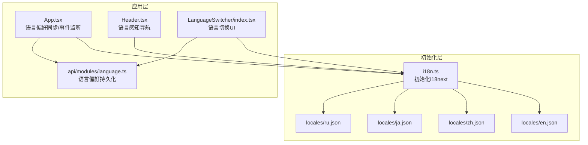
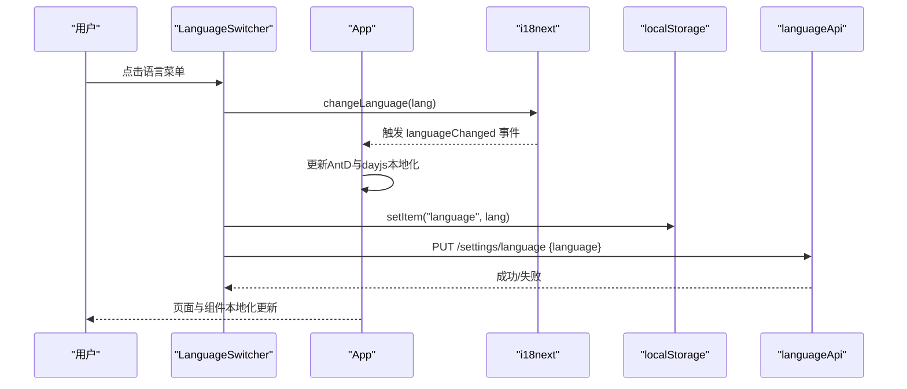
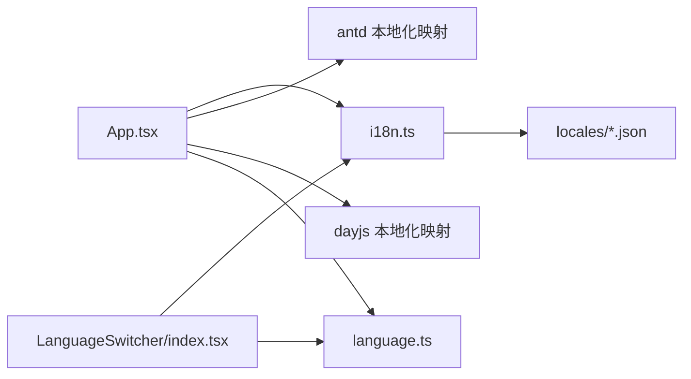

# 国际化支持

<cite>
**本文档引用的文件**
- [i18n.ts](file://console/src/i18n.ts)
- [en.json](file://console/src/locales/en.json)
- [zh.json](file://console/src/locales/zh.json)
- [ja.json](file://console/src/locales/ja.json)
- [ru.json](file://console/src/locales/ru.json)
- [LanguageSwitcher/index.tsx](file://console/src/components/LanguageSwitcher/index.tsx)
- [App.tsx](file://console/src/App.tsx)
- [language.ts](file://console/src/api/modules/language.ts)
- [Header.tsx](file://console/src/layouts/Header.tsx)
</cite>

## 目录
1. [简介](#简介)
2. [项目结构](#项目结构)
3. [核心组件](#核心组件)
4. [架构总览](#架构总览)
5. [详细组件分析](#详细组件分析)
6. [依赖关系分析](#依赖关系分析)
7. [性能考虑](#性能考虑)
8. [故障排查指南](#故障排查指南)
9. [结论](#结论)
10. [附录](#附录)

## 简介
本文件面向QwenPaw前端国际化（i18n）子系统，系统性梳理了i18n架构设计、多语言配置、翻译资源管理、语言切换机制、动态语言加载、日期与数字格式化、以及国际化开发最佳实践。文档旨在帮助开发者快速理解并扩展多语言支持，确保界面文案、组件本地化与系统级格式化的一致性与可维护性。

## 项目结构
QwenPaw前端的国际化主要集中在console子项目中，采用“资源文件+运行时初始化+组件消费”的三层结构：
- 运行时初始化：通过i18next初始化器加载多语言资源，设置默认语言与回退语言。
- 翻译资源：按语言拆分的JSON文件，采用命名空间（namespace）组织，便于模块化维护。
- 组件消费：通过useTranslation/Hook或i18n.t函数在组件中读取翻译文本，结合Ant Design与dayjs实现UI与格式化的本地化。

图表来源
- [i18n.ts:1-32](file://console/src/i18n.ts#L1-L32)
- [en.json:1-200](file://console/src/locales/en.json#L1-L200)
- [zh.json:1-200](file://console/src/locales/zh.json#L1-L200)
- [ja.json:1-200](file://console/src/locales/ja.json#L1-L200)
- [ru.json:1-200](file://console/src/locales/ru.json#L1-L200)
- [App.tsx:110-149](file://console/src/App.tsx#L110-L149)
- [Header.tsx:111-139](file://console/src/layouts/Header.tsx#L111-L139)
- [LanguageSwitcher/index.tsx:13-27](file://console/src/components/LanguageSwitcher/index.tsx#L13-L27)
- [language.ts:1-12](file://console/src/api/modules/language.ts#L1-L12)

章节来源
- [i18n.ts:1-32](file://console/src/i18n.ts#L1-L32)
- [App.tsx:110-149](file://console/src/App.tsx#L110-L149)

## 核心组件
- i18n初始化器：集中定义资源映射、默认语言、回退语言与插值选项，确保运行时统一接入。
- 多语言资源：按语言拆分的JSON文件，采用命名空间组织（如common、nav、agent等），便于按功能域维护。
- 语言切换器：提供语言菜单与切换逻辑，写入localStorage并持久化到后端。
- 应用入口：在启动阶段读取用户偏好，监听语言变化，同步Ant Design与dayjs的本地化。

章节来源
- [i18n.ts:7-29](file://console/src/i18n.ts#L7-L29)
- [LanguageSwitcher/index.tsx:13-27](file://console/src/components/LanguageSwitcher/index.tsx#L13-L27)
- [App.tsx:110-149](file://console/src/App.tsx#L110-L149)

## 架构总览
整体流程：应用启动时从localStorage或后端获取语言偏好，初始化i18n；用户在UI中切换语言后，更新i18n、localStorage与后端；应用监听语言变化事件，同步Ant Design与dayjs的本地化。

图表来源
- [LanguageSwitcher/index.tsx:13-27](file://console/src/components/LanguageSwitcher/index.tsx#L13-L27)
- [App.tsx:135-149](file://console/src/App.tsx#L135-L149)
- [language.ts:6-11](file://console/src/api/modules/language.ts#L6-L11)

## 详细组件分析

### i18n初始化与资源配置
- 资源映射：将各语言JSON文件映射到translation命名空间，便于统一读取。
- 默认语言与回退：优先从localStorage读取，否则回退到英语。
- 插值：关闭escapeValue，允许在翻译中使用HTML标签（如换行）。

章节来源
- [i18n.ts:7-29](file://console/src/i18n.ts#L7-L29)

### 语言切换器组件
- 交互：下拉菜单提供四种语言选项，图标随语言变化。
- 切换逻辑：调用i18n.changeLanguage，写入localStorage，并通过languageApi持久化到后端。
- 用户偏好：组件根据resolvedLanguage或language计算当前语言短码，用于高亮选中项。

章节来源
- [LanguageSwitcher/index.tsx:13-69](file://console/src/components/LanguageSwitcher/index.tsx#L13-L69)

### 应用入口的语言同步与事件监听
- 启动阶段：若localStorage无语言偏好，则从后端获取并设置i18n语言。
- 事件监听：订阅languageChanged事件，动态切换Ant Design与dayjs的本地化。
- 初始dayjs本地化：根据当前语言设置dayjs语言包。

章节来源
- [App.tsx:110-149](file://console/src/App.tsx#L110-L149)

### 语言偏好持久化API
- GET /settings/language：获取用户当前语言偏好。
- PUT /settings/language：更新语言偏好并返回结果。

章节来源
- [language.ts:1-12](file://console/src/api/modules/language.ts#L1-L12)

### 语言感知的头部导航
- 文档与发布说明链接：根据i18n.language选择对应语言的文档与FAQ。
- 语言判断：基于语言前缀（如zh、ru）决定文档语言，回退到英语。

章节来源
- [Header.tsx:111-139](file://console/src/layouts/Header.tsx#L111-L139)

### 翻译资源组织与命名空间
- 命名空间：常见命名空间包括common、nav、agent、skills、channels、sessions、environments、models、tokenUsage、mcp、heartbeat、chunkError等。
- 占位符：大量使用双花括号占位符（如{{count}}、{{name}}、{{limit}}等）实现复数与动态内容注入。
- 多语言文件：英文、中文、日文、俄文四套资源，覆盖导航、设置、模型、频道、会话、技能等模块。

章节来源
- [en.json:1-200](file://console/src/locales/en.json#L1-L200)
- [zh.json:1-200](file://console/src/locales/zh.json#L1-L200)
- [ja.json:1-200](file://console/src/locales/ja.json#L1-L200)
- [ru.json:1-200](file://console/src/locales/ru.json#L1-L200)

## 依赖关系分析
- 初始化依赖：i18n.ts依赖各语言JSON资源文件。
- 组件依赖：LanguageSwitcher与App均依赖i18n实例；App依赖Ant Design与dayjs本地化映射。
- 后端依赖：languageApi负责语言偏好的读取与写入。

图表来源
- [i18n.ts:1-32](file://console/src/i18n.ts#L1-L32)
- [App.tsx:28-40](file://console/src/App.tsx#L28-L40)
- [LanguageSwitcher/index.tsx:1-12](file://console/src/components/LanguageSwitcher/index.tsx#L1-L12)
- [language.ts:1-12](file://console/src/api/modules/language.ts#L1-L12)

章节来源
- [App.tsx:28-40](file://console/src/App.tsx#L28-L40)
- [language.ts:1-12](file://console/src/api/modules/language.ts#L1-L12)

## 性能考虑
- 资源加载：当前实现将所有语言资源在初始化时引入，适合中等规模的多语言项目；若未来语言资源增长，可考虑按需动态加载（Dynamic Imports）以减少首屏体积。
- 事件监听：languageChanged事件触发时同步AntD与dayjs本地化，避免重复渲染；建议在组件中尽量使用useTranslation的轻量更新策略。
- 缓存策略：localStorage用于短期缓存用户偏好，后端持久化用于跨设备同步；注意在切换语言时的错误兜底与重试逻辑。

## 故障排查指南
- 语言未生效：检查localStorage中是否存在"language"键；确认i18n初始化时的默认语言与回退逻辑。
- UI未本地化：确认组件是否正确使用useTranslation；检查命名空间与键名是否一致。
- AntD或dayjs未本地化：确认App.tsx中languageChanged事件监听是否注册；检查antd与dayjs本地化映射表。
- 后端持久化失败：检查languageApi的请求地址与权限；观察控制台错误日志。

章节来源
- [App.tsx:118-149](file://console/src/App.tsx#L118-L149)
- [LanguageSwitcher/index.tsx:22-26](file://console/src/components/LanguageSwitcher/index.tsx#L22-L26)
- [language.ts:6-11](file://console/src/api/modules/language.ts#L6-L11)

## 结论
QwenPaw前端的国际化体系以i18next为核心，配合Ant Design与dayjs实现了UI与格式化的本地化；通过语言切换器与后端API实现了用户偏好的持久化与跨设备同步。现有命名空间与资源组织方式便于模块化维护与扩展。建议在后续迭代中引入动态语言加载与更完善的错误处理与监控，以进一步提升性能与稳定性。

## 附录

### 国际化开发最佳实践
- 键命名规范
  - 使用点分命名空间区分功能域（如agent.createSuccess）。
  - 使用语义化键名，避免冗余（如nav.chat、common.save）。
- 占位符使用
  - 使用双花括号占位符（如{{count}}、{{name}}），并在调用时传入对应值。
  - 对于复数与数值，优先使用命名空间下的通用键（如common.total）。
- 上下文相关翻译
  - 对于多义词，使用不同命名空间或在键名中体现上下文（如agent.switchSuccess vs agent.switchFailed）。
- 资源组织
  - 按功能域划分命名空间，避免单一大文件。
  - 保持各语言资源键集合一致，定期校验缺失键。
- 本地化更新
  - 切换语言后，确保AntD与dayjs本地化同步更新。
  - 在组件中使用useTranslation进行细粒度更新，避免整树重渲染。

### 多语言开发指南
- 新增语言
  - 在locales目录新增对应语言JSON文件，键集合与现有语言保持一致。
  - 在i18n.ts中加入资源映射与fallback配置。
  - 在App.tsx中完善antd与dayjs的本地化映射。
- 新增命名空间
  - 在各语言JSON中新增命名空间与键值。
  - 在组件中通过命名空间读取翻译（如t("agent.createSuccess")）。
- 动态语言加载（建议）
  - 使用动态import按需加载语言资源，减少首屏体积。
  - 在切换语言时异步加载资源并更新i18n实例。