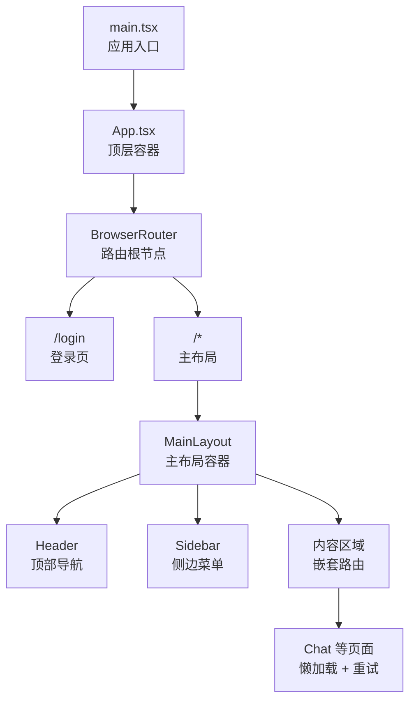
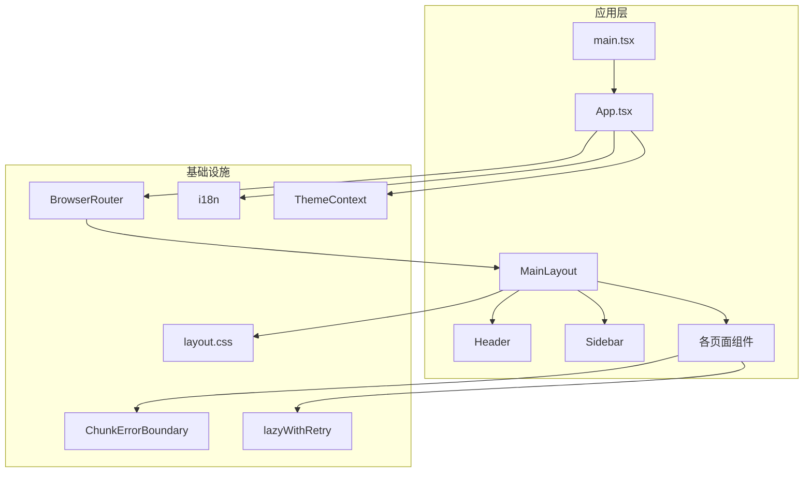
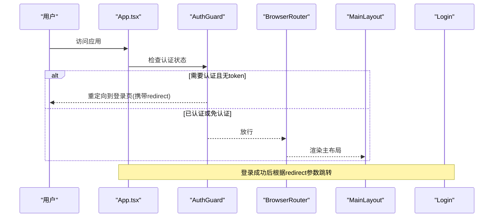
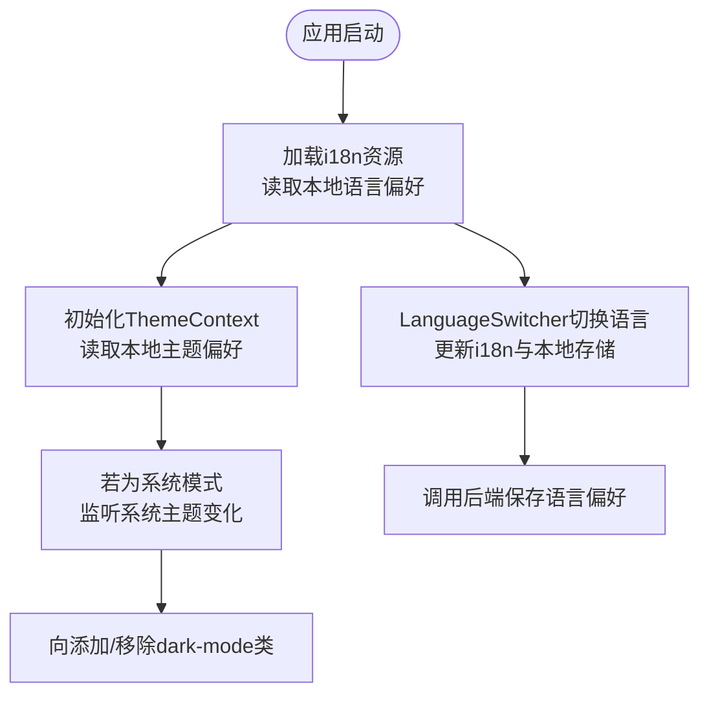
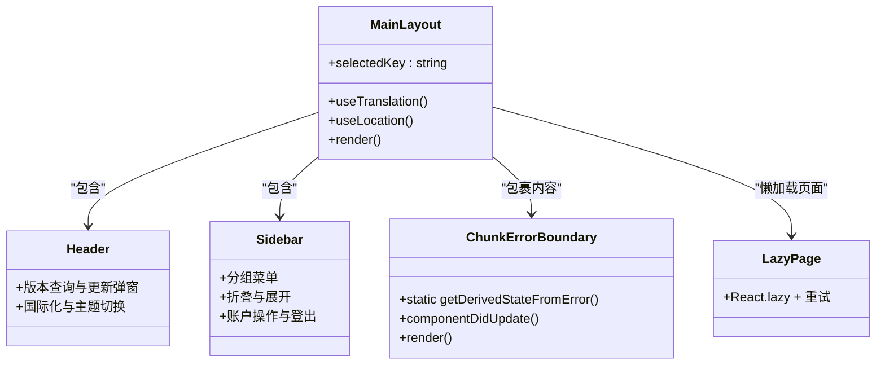
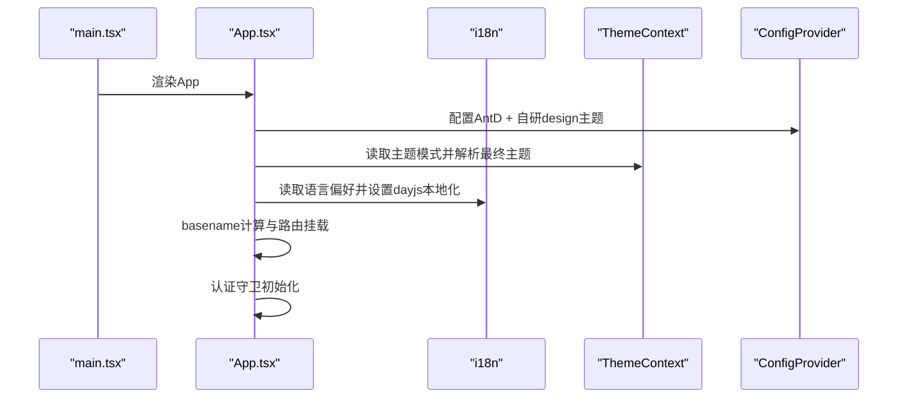
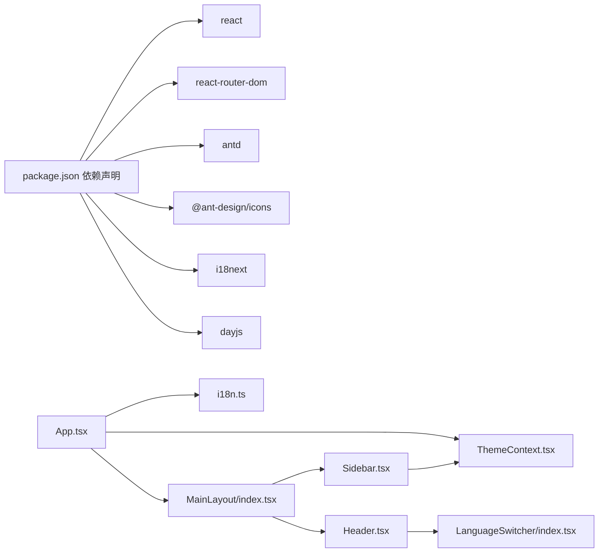

# 应用架构设计

<cite>
**本文档引用的文件**
- [App.tsx](file://console/src/App.tsx)
- [main.tsx](file://console/src/main.tsx)
- [i18n.ts](file://console/src/i18n.ts)
- [MainLayout/index.tsx](file://console/src/layouts/MainLayout/index.tsx)
- [Header.tsx](file://console/src/layouts/Header.tsx)
- [Sidebar.tsx](file://console/src/layouts/Sidebar.tsx)
- [constants.ts](file://console/src/layouts/constants.ts)
- [ThemeContext.tsx](file://console/src/contexts/ThemeContext.tsx)
- [layout.css](file://console/src/styles/layout.css)
- [LanguageSwitcher/index.tsx](file://console/src/components/LanguageSwitcher/index.tsx)
- [ThemeToggleButton/index.tsx](file://console/src/components/ThemeToggleButton/index.tsx)
- [package.json](file://console/package.json)
- [Login/index.tsx](file://console/src/pages/Login/index.tsx)
- [auth.ts](file://console/src/api/modules/auth.ts)
- [language.ts](file://console/src/api/modules/language.ts)
- [lazyWithRetry.ts](file://console/src/utils/lazyWithRetry.ts)
- [ChunkErrorBoundary.tsx](file://console/src/components/ChunkErrorBoundary.tsx)
</cite>

## 目录
1. [引言](#引言)
2. [项目结构](#项目结构)
3. [核心组件](#核心组件)
4. [架构总览](#架构总览)
5. [详细组件分析](#详细组件分析)
6. [依赖关系分析](#依赖关系分析)
7. [性能考量](#性能考量)
8. [故障排查指南](#故障排查指南)
9. [结论](#结论)

## 引言
本文件面向QwenPaw控制台前端（console）应用，系统性梳理其基于React + TypeScript的架构设计与实现细节。重点覆盖：应用入口与初始化流程、路由与嵌套布局、认证守卫、国际化与主题系统、全局样式与暗色模式支持、错误边界与懒加载策略等。文档旨在帮助开发者快速理解并高效扩展该控制台前端。

## 项目结构
控制台前端采用“按功能域分层 + 页面/组件分离”的组织方式：
- 应用入口与初始化：main.tsx负责根节点挂载与i18n初始化；App.tsx作为顶层容器，承载路由、认证守卫、国际化与主题配置。
- 布局系统：MainLayout封装头部、侧边栏与内容区；Header与Sidebar分别负责顶部导航与左侧菜单。
- 路由与页面：BrowserRouter统一管理路由，MainLayout内嵌套多级子路由，部分页面采用懒加载与重试机制。
- 国际化与主题：i18n集中配置多语言资源；ThemeContext提供主题状态与持久化。
- 全局样式：layout.css定义暗色模式全局变量与组件覆盖规则，配合Ant Design与自研design库。

图表来源
- [main.tsx:1-31](file://console/src/main.tsx#L1-L31)
- [App.tsx:151-184](file://console/src/App.tsx#L151-L184)
- [MainLayout/index.tsx:75-128](file://console/src/layouts/MainLayout/index.tsx#L75-L128)

章节来源
- [main.tsx:1-31](file://console/src/main.tsx#L1-L31)
- [App.tsx:151-184](file://console/src/App.tsx#L151-L184)
- [MainLayout/index.tsx:75-128](file://console/src/layouts/MainLayout/index.tsx#L75-L128)

## 核心组件
- 应用入口与初始化
  - main.tsx：创建根节点并渲染App，同时对控制台输出进行轻量过滤，避免无意义告警刷屏。
  - i18n.ts：初始化i18next，加载多语言资源，设置默认语言与回退语言。
- 顶层容器与路由
  - App.tsx：配置BrowserRouter、ConfigProvider（AntD + 自研design）、全局样式、国际化与主题联动、认证守卫与基础路由。
- 主布局系统
  - MainLayout：组合Header、Sidebar与内容区，内置懒加载页面与错误边界。
  - Header：版本信息、更新弹窗、国际化与主题切换入口。
  - Sidebar：分组菜单、折叠交互、账户操作与登出。
- 国际化与主题
  - LanguageSwitcher：语言切换下拉菜单，写入本地存储并调用后端保存偏好。
  - ThemeContext：主题模式（浅色/深色/系统）持久化与系统主题监听。
- 错误边界与懒加载
  - ChunkErrorBoundary：识别动态导入失败并引导刷新。
  - lazyWithRetry：对路由级组件进行带重试的懒加载。

章节来源
- [main.tsx:1-31](file://console/src/main.tsx#L1-L31)
- [i18n.ts:1-32](file://console/src/i18n.ts#L1-L32)
- [App.tsx:49-104](file://console/src/App.tsx#L49-L104)
- [MainLayout/index.tsx:75-128](file://console/src/layouts/MainLayout/index.tsx#L75-L128)
- [Header.tsx:52-305](file://console/src/layouts/Header.tsx#L52-L305)
- [Sidebar.tsx:57-515](file://console/src/layouts/Sidebar.tsx#L57-L515)
- [LanguageSwitcher/index.tsx:13-68](file://console/src/components/LanguageSwitcher/index.tsx#L13-L68)
- [ThemeContext.tsx:51-104](file://console/src/contexts/ThemeContext.tsx#L51-L104)
- [ChunkErrorBoundary.tsx:41-84](file://console/src/components/ChunkErrorBoundary.tsx#L41-L84)
- [lazyWithRetry.ts:16-35](file://console/src/utils/lazyWithRetry.ts#L16-L35)

## 架构总览
应用采用“单页应用 + 懒加载 + 错误边界”的现代前端架构，结合Ant Design与自研design库，提供一致的UI体验与主题能力。

图表来源
- [main.tsx:1-31](file://console/src/main.tsx#L1-L31)
- [App.tsx:151-184](file://console/src/App.tsx#L151-L184)
- [MainLayout/index.tsx:75-128](file://console/src/layouts/MainLayout/index.tsx#L75-L128)
- [Header.tsx:52-305](file://console/src/layouts/Header.tsx#L52-L305)
- [Sidebar.tsx:57-515](file://console/src/layouts/Sidebar.tsx#L57-L515)
- [i18n.ts:1-32](file://console/src/i18n.ts#L1-L32)
- [ThemeContext.tsx:51-104](file://console/src/contexts/ThemeContext.tsx#L51-L104)
- [layout.css:1-800](file://console/src/styles/layout.css#L1-L800)
- [ChunkErrorBoundary.tsx:41-84](file://console/src/components/ChunkErrorBoundary.tsx#L41-L84)
- [lazyWithRetry.ts:16-35](file://console/src/utils/lazyWithRetry.ts#L16-L35)

## 详细组件分析

### 认证守卫与路由配置
- 认证守卫（AuthGuard）
  - 在首次渲染时检查后端认证状态与本地token，决定是否跳转至登录页或放行。
  - 支持“免认证”场景与“需要令牌验证”的场景，并在验证失败时清理token。
- 路由与basename
  - 根据当前路径判断是否启用basename（如“/console”），以适配部署在子路径的场景。
  - 主路由包含登录页与主布局的通配路由，后者包裹认证守卫。
- 嵌套路由
  - MainLayout内部定义多条子路由，覆盖聊天、控制、代理、设置等模块，部分页面采用懒加载与重试。

图表来源
- [App.tsx:49-104](file://console/src/App.tsx#L49-L104)
- [App.tsx:106-111](file://console/src/App.tsx#L106-L111)
- [App.tsx:151-184](file://console/src/App.tsx#L151-L184)
- [MainLayout/index.tsx:98-120](file://console/src/layouts/MainLayout/index.tsx#L98-L120)
- [Login/index.tsx:37-72](file://console/src/pages/Login/index.tsx#L37-L72)

章节来源
- [App.tsx:49-104](file://console/src/App.tsx#L49-L104)
- [App.tsx:106-111](file://console/src/App.tsx#L106-L111)
- [App.tsx:151-184](file://console/src/App.tsx#L151-L184)
- [MainLayout/index.tsx:98-120](file://console/src/layouts/MainLayout/index.tsx#L98-L120)
- [Login/index.tsx:37-72](file://console/src/pages/Login/index.tsx#L37-L72)

### 国际化与主题系统
- 国际化（i18n）
  - 初始化i18next，加载英文、俄文、中文、日文资源，优先读取本地存储的语言偏好。
  - Header与LanguageSwitcher组件通过i18n.changeLanguage切换语言，并同步保存到本地与后端。
- 主题系统（ThemeContext）
  - 支持“浅色/深色/系统”三种模式，持久化到localStorage。
  - 当模式为“系统”时监听系统主题变化；通过向<html>添加dark-mode类实现全局CSS变量覆盖。
  - ThemeToggleButton提供下拉菜单切换主题模式。

图表来源
- [i18n.ts:1-32](file://console/src/i18n.ts#L1-L32)
- [LanguageSwitcher/index.tsx:13-68](file://console/src/components/LanguageSwitcher/index.tsx#L13-L68)
- [ThemeContext.tsx:51-104](file://console/src/contexts/ThemeContext.tsx#L51-L104)
- [layout.css:14-710](file://console/src/styles/layout.css#L14-L710)

章节来源
- [i18n.ts:1-32](file://console/src/i18n.ts#L1-L32)
- [LanguageSwitcher/index.tsx:13-68](file://console/src/components/LanguageSwitcher/index.tsx#L13-L68)
- [ThemeContext.tsx:51-104](file://console/src/contexts/ThemeContext.tsx#L51-L104)
- [layout.css:14-710](file://console/src/styles/layout.css#L14-L710)

### 主布局系统（MainLayout）
- 组织方式
  - Header：顶部导航、版本与更新提示、国际化与主题切换。
  - Sidebar：分组菜单（控制、代理、设置）、折叠交互、账户操作与登出。
  - 内容区：嵌套路由与页面，采用Suspense占位与ChunkErrorBoundary兜底。
- 懒加载与重试
  - 使用lazyWithRetry包装页面组件，提升首屏性能并增强网络波动下的稳定性。
- 错误边界
  - 对动态导入失败进行识别与友好提示，支持手动刷新恢复。

图表来源
- [MainLayout/index.tsx:75-128](file://console/src/layouts/MainLayout/index.tsx#L75-L128)
- [Header.tsx:52-305](file://console/src/layouts/Header.tsx#L52-L305)
- [Sidebar.tsx:57-515](file://console/src/layouts/Sidebar.tsx#L57-L515)
- [ChunkErrorBoundary.tsx:41-84](file://console/src/components/ChunkErrorBoundary.tsx#L41-L84)
- [lazyWithRetry.ts:16-35](file://console/src/utils/lazyWithRetry.ts#L16-L35)

章节来源
- [MainLayout/index.tsx:75-128](file://console/src/layouts/MainLayout/index.tsx#L75-L128)
- [Header.tsx:52-305](file://console/src/layouts/Header.tsx#L52-L305)
- [Sidebar.tsx:57-515](file://console/src/layouts/Sidebar.tsx#L57-L515)
- [lazyWithRetry.ts:16-35](file://console/src/utils/lazyWithRetry.ts#L16-L35)
- [ChunkErrorBoundary.tsx:41-84](file://console/src/components/ChunkErrorBoundary.tsx#L41-L84)

### 应用初始化流程
- 初始化步骤
  - main.tsx：创建根节点，渲染App，初始化i18n。
  - App.tsx：设置BrowserRouter、ConfigProvider、全局样式、国际化与主题联动、认证守卫与基础路由。
  - 语言检测：若本地无语言偏好，则从后端获取并设置默认语言。
  - 主题切换：根据ThemeContext解析最终主题，向<html>注入dark-mode类，触发CSS变量覆盖。
- 关键点
  - basename动态计算，适配子路径部署。
  - Ant Design与自研design库的ConfigProvider统一配置前缀、类名与主题算法。
  - dayjs本地化随语言切换同步更新。

图表来源
- [main.tsx:1-31](file://console/src/main.tsx#L1-L31)
- [App.tsx:110-149](file://console/src/App.tsx#L110-L149)
- [App.tsx:151-184](file://console/src/App.tsx#L151-L184)
- [ThemeContext.tsx:51-104](file://console/src/contexts/ThemeContext.tsx#L51-L104)
- [i18n.ts:1-32](file://console/src/i18n.ts#L1-L32)

章节来源
- [main.tsx:1-31](file://console/src/main.tsx#L1-L31)
- [App.tsx:110-149](file://console/src/App.tsx#L110-L149)
- [App.tsx:151-184](file://console/src/App.tsx#L151-L184)
- [ThemeContext.tsx:51-104](file://console/src/contexts/ThemeContext.tsx#L51-L104)
- [i18n.ts:1-32](file://console/src/i18n.ts#L1-L32)

## 依赖关系分析
- 外部依赖
  - React 18、React Router DOM 7、Ant Design 5、Ant Design Icons、i18next、dayjs、antd-style等。
- 内部依赖
  - App.tsx依赖ThemeContext、i18n、API模块与样式；MainLayout依赖Header、Sidebar与懒加载工具；Header/Sidebar依赖ThemeContext与API模块。
- 耦合与内聚
  - 路由与布局解耦，通过嵌套路由实现页面级模块化；主题与国际化通过上下文注入，降低耦合度。
- 循环依赖
  - 未发现明显循环依赖迹象；组件间通过上下文与路由传递数据。

图表来源
- [package.json:18-42](file://console/package.json#L18-L42)
- [App.tsx:18-26](file://console/src/App.tsx#L18-L26)
- [ThemeContext.tsx:102-104](file://console/src/contexts/ThemeContext.tsx#L102-L104)
- [i18n.ts:1-32](file://console/src/i18n.ts#L1-L32)
- [MainLayout/index.tsx:1-11](file://console/src/layouts/MainLayout/index.tsx#L1-L11)
- [Header.tsx:1-25](file://console/src/layouts/Header.tsx#L1-L25)
- [Sidebar.tsx:1-44](file://console/src/layouts/Sidebar.tsx#L1-L44)
- [LanguageSwitcher/index.tsx:1-11](file://console/src/components/LanguageSwitcher/index.tsx#L1-L11)

章节来源
- [package.json:18-42](file://console/package.json#L18-L42)
- [App.tsx:18-26](file://console/src/App.tsx#L18-L26)
- [ThemeContext.tsx:102-104](file://console/src/contexts/ThemeContext.tsx#L102-L104)
- [i18n.ts:1-32](file://console/src/i18n.ts#L1-L32)
- [MainLayout/index.tsx:1-11](file://console/src/layouts/MainLayout/index.tsx#L1-L11)
- [Header.tsx:1-25](file://console/src/layouts/Header.tsx#L1-L25)
- [Sidebar.tsx:1-44](file://console/src/layouts/Sidebar.tsx#L1-L44)
- [LanguageSwitcher/index.tsx:1-11](file://console/src/components/LanguageSwitcher/index.tsx#L1-L11)

## 性能考量
- 懒加载与重试
  - 对非首屏页面采用React.lazy与lazyWithRetry，减少初始包体积，提高首屏加载速度，并在网络波动时自动重试。
- Suspense占位
  - 在MainLayout中对懒加载组件提供Spin占位，改善用户体验。
- 动态导入失败处理
  - ChunkErrorBoundary识别chunk加载错误并提供刷新按钮，避免整页崩溃。
- 主题与国际化
  - ThemeContext仅在模式变更时更新DOM类名，避免频繁重排；i18n切换语言时同步更新dayjs本地化，减少重复计算。

章节来源
- [lazyWithRetry.ts:16-35](file://console/src/utils/lazyWithRetry.ts#L16-L35)
- [MainLayout/index.tsx:89-97](file://console/src/layouts/MainLayout/index.tsx#L89-L97)
- [ChunkErrorBoundary.tsx:41-84](file://console/src/components/ChunkErrorBoundary.tsx#L41-L84)
- [App.tsx:135-149](file://console/src/App.tsx#L135-L149)

## 故障排查指南
- 登录相关
  - 登录页会先检查认证状态，若后端禁用认证则直接跳转到聊天页；首次无用户时自动切换为注册流程。
  - 登录/注册成功后写入token并按redirect参数跳转。
- 认证守卫
  - 若token缺失或验证失败，会清空token并跳转到登录页，携带当前路径作为redirect参数。
- 语言与主题
  - 语言切换后需确保后端保存成功；主题切换后可通过浏览器开发者工具观察<html>类名变化。
- 动态导入失败
  - 出现“加载chunk失败”时，可点击错误界面的刷新按钮；必要时清理浏览器缓存或等待CDN缓存更新。
- 版本更新提示
  - Header中的版本检测逻辑会对比PyPI发布时间与本地版本，超过阈值显示更新徽章；点击可查看更新说明。

章节来源
- [Login/index.tsx:21-35](file://console/src/pages/Login/index.tsx#L21-L35)
- [Login/index.tsx:44-72](file://console/src/pages/Login/index.tsx#L44-L72)
- [App.tsx:49-104](file://console/src/App.tsx#L49-L104)
- [App.tsx:119-149](file://console/src/App.tsx#L119-L149)
- [Header.tsx:60-109](file://console/src/layouts/Header.tsx#L60-L109)
- [ChunkErrorBoundary.tsx:17-28](file://console/src/components/ChunkErrorBoundary.tsx#L17-L28)

## 结论
QwenPaw控制台前端采用清晰的分层架构与现代化工程实践：以BrowserRouter为核心路由载体，结合MainLayout实现稳定的布局与导航；通过ThemeContext与i18n提供一致的主题与国际化体验；借助懒加载、重试与错误边界提升性能与稳定性。整体设计在保证可维护性的同时兼顾了用户体验与可扩展性，适合在多语言、多主题与复杂业务场景下持续演进。