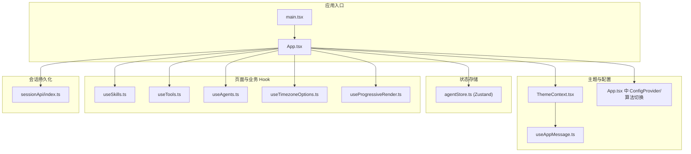
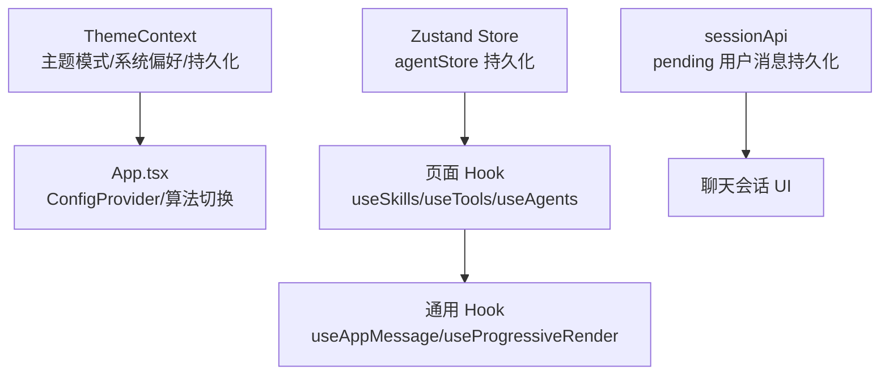
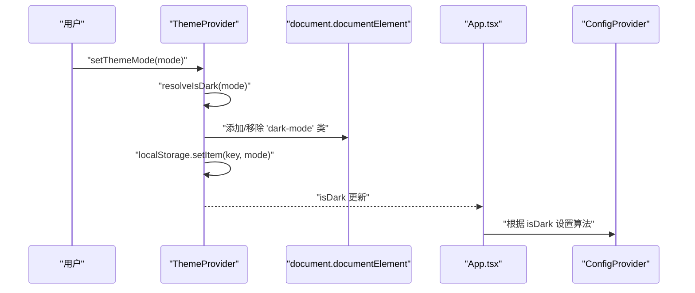
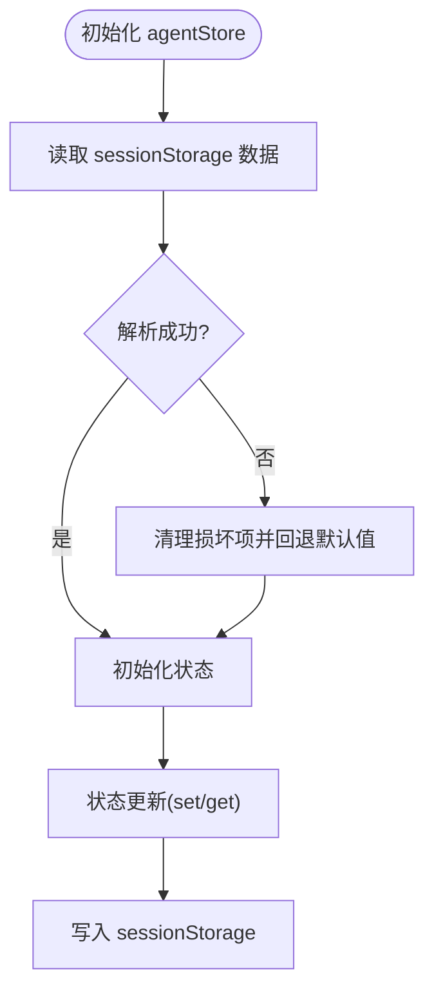
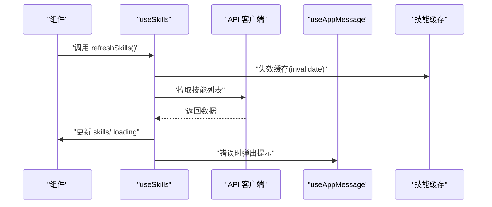
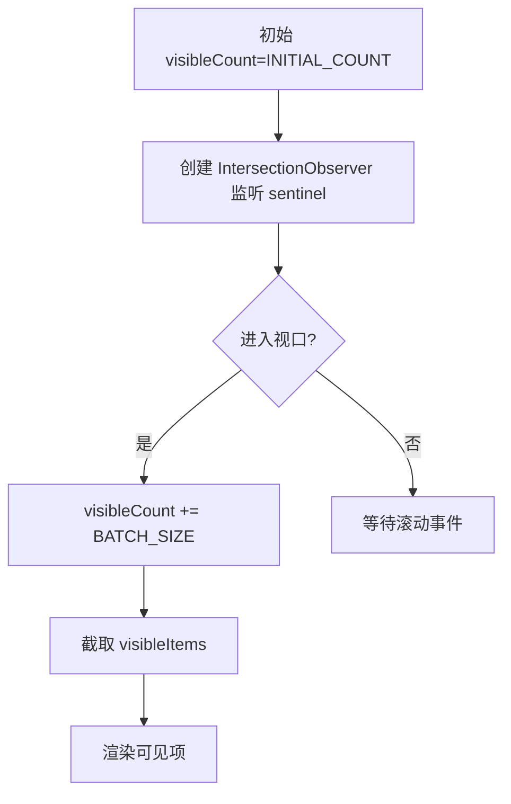
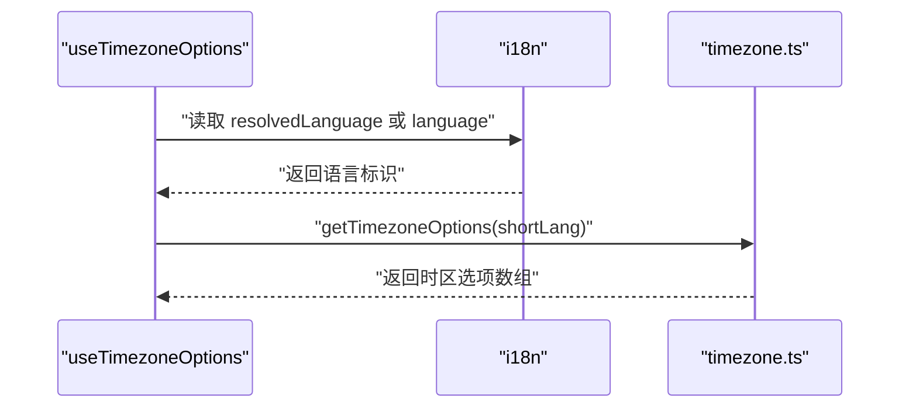
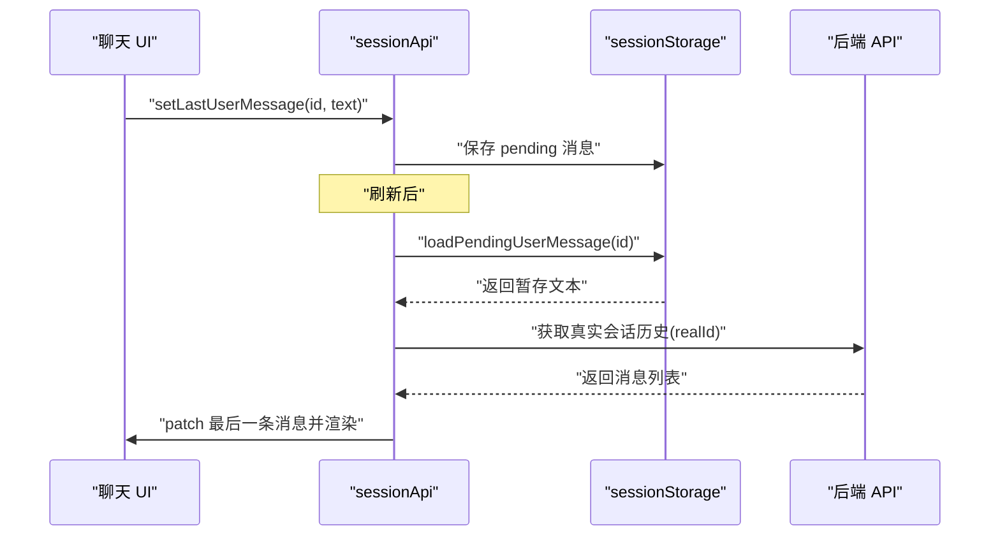
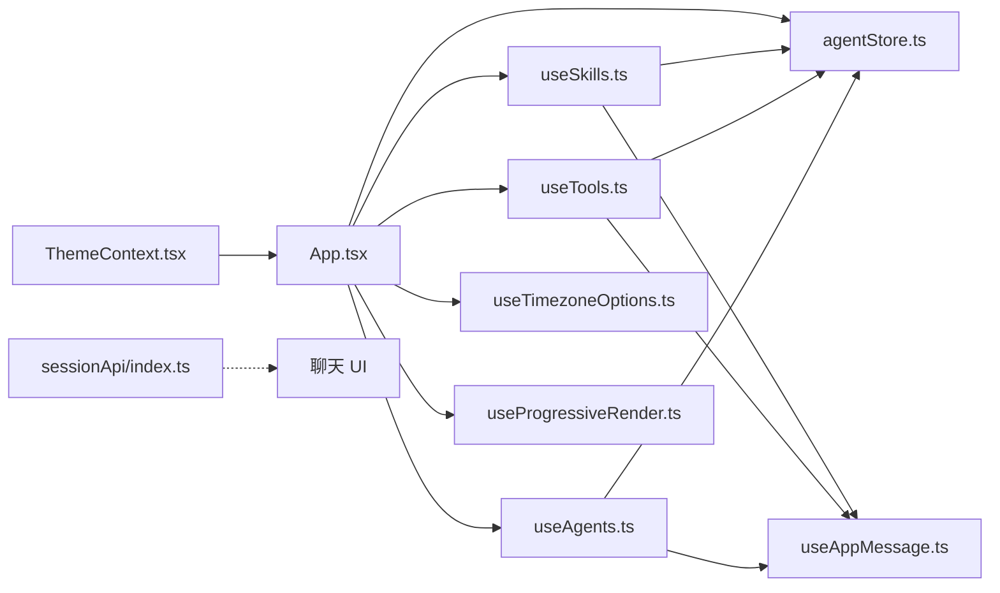

# 状态管理

<cite>
**本文引用的文件**
- [console/src/hooks/useAppMessage.ts](file://console/src/hooks/useAppMessage.ts)
- [console/src/hooks/useProgressiveRender.ts](file://console/src/hooks/useProgressiveRender.ts)
- [console/src/hooks/useTimezoneOptions.ts](file://console/src/hooks/useTimezoneOptions.ts)
- [console/src/contexts/ThemeContext.tsx](file://console/src/contexts/ThemeContext.tsx)
- [console/src/stores/agentStore.ts](file://console/src/stores/agentStore.ts)
- [console/src/App.tsx](file://console/src/App.tsx)
- [console/src/main.tsx](file://console/src/main.tsx)
- [console/src/pages/Agent/Skills/useSkills.ts](file://console/src/pages/Agent/Skills/useSkills.ts)
- [console/src/pages/Agent/Tools/useTools.ts](file://console/src/pages/Agent/Tools/useTools.ts)
- [console/src/pages/Settings/Agents/useAgents.ts](file://console/src/pages/Settings/Agents/useAgents.ts)
- [console/src/constants/timezone.ts](file://console/src/constants/timezone.ts)
- [console/src/pages/Chat/sessionApi/index.ts](file://console/src/pages/Chat/sessionApi/index.ts)
</cite>

## 目录
1. [简介](#简介)
2. [项目结构](#项目结构)
3. [核心组件](#核心组件)
4. [架构总览](#架构总览)
5. [详细组件分析](#详细组件分析)
6. [依赖关系分析](#依赖关系分析)
7. [性能考量](#性能考量)
8. [故障排查指南](#故障排查指南)
9. [结论](#结论)
10. [附录](#附录)

## 简介
本文件系统性梳理 QwenPaw 前端的状态管理方案，覆盖以下关键主题：
- 全局状态与组件内部状态的分离策略
- 自定义 Hook 的设计模式与使用场景（如 useAppMessage、useProgressiveRender、useTimezoneOptions）
- 主题状态管理（暗色模式切换、主题上下文、样式动态更新）
- 状态持久化策略（本地存储、会话存储、状态恢复）
- 状态更新触发机制与性能优化
- 最佳实践与调试技巧
- 结合实际代码路径给出使用指南与参考示例

## 项目结构
前端状态管理主要分布在以下模块：
- 上下文与全局主题：ThemeContext 提供主题模式选择、系统偏好监听、持久化与根节点样式类切换
- 状态库：Zustand Store（agentStore）用于跨页面的全局状态（如选中智能体、最近会话等），并采用持久化中间件
- 页面级 Hook：封装业务状态与副作用（useSkills、useTools、useAgents 等）
- 自定义 Hook：useAppMessage（统一消息通知）、useProgressiveRender（长列表渐进渲染）、useTimezoneOptions（时区选项）
- 会话持久化：聊天会话 API 对用户未发送消息进行 sessionStorage 持久化，支持刷新后恢复

图表来源
- [console/src/main.tsx:1-31](file://console/src/main.tsx#L1-L31)
- [console/src/App.tsx:1-196](file://console/src/App.tsx#L1-L196)
- [console/src/contexts/ThemeContext.tsx:1-105](file://console/src/contexts/ThemeContext.tsx#L1-L105)
- [console/src/hooks/useAppMessage.ts:1-16](file://console/src/hooks/useAppMessage.ts#L1-L16)
- [console/src/stores/agentStore.ts:1-89](file://console/src/stores/agentStore.ts#L1-L89)
- [console/src/pages/Agent/Skills/useSkills.ts:1-323](file://console/src/pages/Agent/Skills/useSkills.ts#L1-L323)
- [console/src/pages/Agent/Tools/useTools.ts:1-178](file://console/src/pages/Agent/Tools/useTools.ts#L1-L178)
- [console/src/pages/Settings/Agents/useAgents.ts:1-87](file://console/src/pages/Settings/Agents/useAgents.ts#L1-L87)
- [console/src/hooks/useTimezoneOptions.ts:1-13](file://console/src/hooks/useTimezoneOptions.ts#L1-L13)
- [console/src/hooks/useProgressiveRender.ts:1-52](file://console/src/hooks/useProgressiveRender.ts#L1-L52)
- [console/src/pages/Chat/sessionApi/index.ts:281-668](file://console/src/pages/Chat/sessionApi/index.ts#L281-L668)

章节来源
- [console/src/main.tsx:1-31](file://console/src/main.tsx#L1-L31)
- [console/src/App.tsx:1-196](file://console/src/App.tsx#L1-L196)

## 核心组件
- 主题上下文与 Hook
  - ThemeProvider：维护 themeMode、isDark，并在系统偏好变化时自动同步；将 dark 类名写入 html，驱动全局 CSS 变量；持久化到 localStorage
  - useTheme：消费上下文，暴露设置与切换方法
  - useAppMessage：从 Ant Design App 组件获取 message、modal、notification 实例，确保与 ConfigProvider 的前缀一致
- 状态存储（Zustand）
  - agentStore：保存选中智能体、智能体列表、按智能体记录的最近会话 ID；通过 persist 中间件以 sessionStorage 存储，避免刷新丢失
- 页面级 Hook
  - useSkills：封装技能列表加载、上传、导入、启用/禁用、删除等业务状态与副作用
  - useTools：封装工具列表加载、启用/禁用、异步执行开关、批量操作等
  - useAgents：封装智能体列表加载、启用/禁用、删除等
- 自定义 Hook
  - useProgressiveRender：长列表渐进渲染，基于 IntersectionObserver 触发分批加载
  - useTimezoneOptions：根据当前语言生成时区选项列表
- 会话持久化
  - sessionApi：对“新建但尚未发送”的会话，将最后一条用户输入暂存至 sessionStorage，刷新后恢复

章节来源
- [console/src/contexts/ThemeContext.tsx:1-105](file://console/src/contexts/ThemeContext.tsx#L1-L105)
- [console/src/hooks/useAppMessage.ts:1-16](file://console/src/hooks/useAppMessage.ts#L1-L16)
- [console/src/stores/agentStore.ts:1-89](file://console/src/stores/agentStore.ts#L1-L89)
- [console/src/pages/Agent/Skills/useSkills.ts:1-323](file://console/src/pages/Agent/Skills/useSkills.ts#L1-L323)
- [console/src/pages/Agent/Tools/useTools.ts:1-178](file://console/src/pages/Agent/Tools/useTools.ts#L1-L178)
- [console/src/pages/Settings/Agents/useAgents.ts:1-87](file://console/src/pages/Settings/Agents/useAgents.ts#L1-L87)
- [console/src/hooks/useProgressiveRender.ts:1-52](file://console/src/hooks/useProgressiveRender.ts#L1-L52)
- [console/src/hooks/useTimezoneOptions.ts:1-13](file://console/src/hooks/useTimezoneOptions.ts#L1-L13)
- [console/src/pages/Chat/sessionApi/index.ts:281-668](file://console/src/pages/Chat/sessionApi/index.ts#L281-L668)

## 架构总览
整体采用“上下文 + 状态库 + 页面 Hook”的分层设计：
- 上下文层：ThemeContext 提供主题态与系统偏好联动，影响 ConfigProvider 的算法与全局样式
- 状态层：Zustand Store 负责可跨路由共享的全局状态，并通过持久化中间件控制存储介质
- Hook 层：页面级 Hook 将业务状态与副作用封装，复用通用 Hook（如 useAppMessage、useProgressiveRender）
- 会话层：针对聊天会话的输入内容进行 sessionStorage 持久化，保证刷新后体验连续

图表来源
- [console/src/contexts/ThemeContext.tsx:1-105](file://console/src/contexts/ThemeContext.tsx#L1-L105)
- [console/src/App.tsx:154-182](file://console/src/App.tsx#L154-L182)
- [console/src/stores/agentStore.ts:1-89](file://console/src/stores/agentStore.ts#L1-L89)
- [console/src/pages/Agent/Skills/useSkills.ts:1-323](file://console/src/pages/Agent/Skills/useSkills.ts#L1-L323)
- [console/src/pages/Agent/Tools/useTools.ts:1-178](file://console/src/pages/Agent/Tools/useTools.ts#L1-L178)
- [console/src/pages/Settings/Agents/useAgents.ts:1-87](file://console/src/pages/Settings/Agents/useAgents.ts#L1-L87)
- [console/src/hooks/useAppMessage.ts:1-16](file://console/src/hooks/useAppMessage.ts#L1-L16)
- [console/src/hooks/useProgressiveRender.ts:1-52](file://console/src/hooks/useProgressiveRender.ts#L1-L52)
- [console/src/pages/Chat/sessionApi/index.ts:281-333](file://console/src/pages/Chat/sessionApi/index.ts#L281-L333)

## 详细组件分析

### 主题上下文与样式动态更新
- 设计要点
  - 支持用户选择 light/dark/system；当为 system 时监听系统配色变化
  - 将 dark 类名写入 html，使全局 CSS 变量生效
  - 使用 localStorage 持久化用户选择
  - App.tsx 中根据 isDark 切换 ConfigProvider 的算法
- 关键流程

图表来源
- [console/src/contexts/ThemeContext.tsx:51-100](file://console/src/contexts/ThemeContext.tsx#L51-L100)
- [console/src/App.tsx:159-167](file://console/src/App.tsx#L159-L167)

章节来源
- [console/src/contexts/ThemeContext.tsx:1-105](file://console/src/contexts/ThemeContext.tsx#L1-L105)
- [console/src/App.tsx:154-182](file://console/src/App.tsx#L154-L182)

### Zustand 全局状态与持久化
- 设计要点
  - 以 create/persist 包装，将 selectedAgent、agents、lastChatIdByAgent 等状态持久化
  - 存储介质：自定义 storage 使用 sessionStorage，避免跨标签页污染
  - 异常处理：解析失败时清理损坏数据，防止反复报错
- 使用建议
  - 仅存放需要跨页面共享且体量适中的状态
  - 避免将大对象或频繁变更的数据放入持久化，降低 IO 成本

图表来源
- [console/src/stores/agentStore.ts:19-88](file://console/src/stores/agentStore.ts#L19-L88)

章节来源
- [console/src/stores/agentStore.ts:1-89](file://console/src/stores/agentStore.ts#L1-L89)

### 页面级 Hook 的状态与副作用
- useSkills：封装技能列表加载、缓存失效、上传/导入、启用/禁用、删除、硬刷新等
- useTools：封装工具列表加载、启用/禁用、异步执行开关、批量操作；采用乐观更新与错误回滚
- useAgents：封装智能体列表加载、启用/禁用、删除；同时更新全局 store

图表来源
- [console/src/pages/Agent/Skills/useSkills.ts:55-86](file://console/src/pages/Agent/Skills/useSkills.ts#L55-L86)
- [console/src/hooks/useAppMessage.ts:12-15](file://console/src/hooks/useAppMessage.ts#L12-L15)

章节来源
- [console/src/pages/Agent/Skills/useSkills.ts:1-323](file://console/src/pages/Agent/Skills/useSkills.ts#L1-L323)
- [console/src/pages/Agent/Tools/useTools.ts:1-178](file://console/src/pages/Agent/Tools/useTools.ts#L1-L178)
- [console/src/pages/Settings/Agents/useAgents.ts:1-87](file://console/src/pages/Settings/Agents/useAgents.ts#L1-L87)
- [console/src/hooks/useAppMessage.ts:1-16](file://console/src/hooks/useAppMessage.ts#L1-L16)

### 渐进式渲染 Hook（长列表性能）
- 设计要点
  - 初始显示固定数量条目，滚动到底部时通过 IntersectionObserver 加载更多
  - 保持现有布局（如 CSS Grid）不变，仅通过 sentinelRef 控制观察目标
  - 重置可见数量以响应数据源变化（过滤/排序/新增）
- 性能收益
  - 减少首屏渲染压力，提升交互流畅度
  - 适合技能/工具等可能大量数据的列表

图表来源
- [console/src/hooks/useProgressiveRender.ts:17-51](file://console/src/hooks/useProgressiveRender.ts#L17-L51)

章节来源
- [console/src/hooks/useProgressiveRender.ts:1-52](file://console/src/hooks/useProgressiveRender.ts#L1-L52)

### 时区选项 Hook
- 设计要点
  - 基于当前语言计算短语言码，再生成时区选项列表
  - 依赖常量模块提供预设时区集合与本地化名称
- 使用场景
  - 表单控件、日历组件、时间显示等需要按用户语言展示的场景

图表来源
- [console/src/hooks/useTimezoneOptions.ts:5-12](file://console/src/hooks/useTimezoneOptions.ts#L5-L12)
- [console/src/constants/timezone.ts:43-60](file://console/src/constants/timezone.ts#L43-L60)

章节来源
- [console/src/hooks/useTimezoneOptions.ts:1-13](file://console/src/hooks/useTimezoneOptions.ts#L1-L13)
- [console/src/constants/timezone.ts:1-61](file://console/src/constants/timezone.ts#L1-L61)

### 会话持久化与状态恢复
- 设计要点
  - 对“本地时间戳会话”在首次生成后，将最后一条用户输入暂存至 sessionStorage
  - 刷新后优先从 sessionStorage 恢复，再与后端历史合并
  - 支持 realId 解析后重新拉取历史并打补丁
- 流程示意

图表来源
- [console/src/pages/Chat/sessionApi/index.ts:311-333](file://console/src/pages/Chat/sessionApi/index.ts#L311-L333)
- [console/src/pages/Chat/sessionApi/index.ts:562-661](file://console/src/pages/Chat/sessionApi/index.ts#L562-L661)

章节来源
- [console/src/pages/Chat/sessionApi/index.ts:281-668](file://console/src/pages/Chat/sessionApi/index.ts#L281-L668)

## 依赖关系分析
- 组件耦合与内聚
  - ThemeContext 与 App.tsx 高内聚，主题态直接影响全局 UI 算法
  - 页面 Hook 依赖通用 Hook（useAppMessage）与全局 Store（agentStore），形成清晰的依赖链
  - sessionApi 与聊天 UI 松耦合，通过接口抽象实现持久化与恢复
- 外部依赖
  - Ant Design 的 App.useApp 与 ConfigProvider
  - Zustand 与 persist 中间件
  - IntersectionObserver（渐进渲染）

图表来源
- [console/src/contexts/ThemeContext.tsx:1-105](file://console/src/contexts/ThemeContext.tsx#L1-L105)
- [console/src/App.tsx:1-196](file://console/src/App.tsx#L1-L196)
- [console/src/stores/agentStore.ts:1-89](file://console/src/stores/agentStore.ts#L1-L89)
- [console/src/pages/Agent/Skills/useSkills.ts:1-323](file://console/src/pages/Agent/Skills/useSkills.ts#L1-L323)
- [console/src/pages/Agent/Tools/useTools.ts:1-178](file://console/src/pages/Agent/Tools/useTools.ts#L1-L178)
- [console/src/pages/Settings/Agents/useAgents.ts:1-87](file://console/src/pages/Settings/Agents/useAgents.ts#L1-L87)
- [console/src/hooks/useAppMessage.ts:1-16](file://console/src/hooks/useAppMessage.ts#L1-L16)
- [console/src/hooks/useProgressiveRender.ts:1-52](file://console/src/hooks/useProgressiveRender.ts#L1-L52)
- [console/src/hooks/useTimezoneOptions.ts:1-13](file://console/src/hooks/useTimezoneOptions.ts#L1-L13)
- [console/src/pages/Chat/sessionApi/index.ts:281-668](file://console/src/pages/Chat/sessionApi/index.ts#L281-L668)

## 性能考量
- 渐进式渲染
  - 通过分批加载与根边距阈值减少一次性渲染开销
  - 保持现有布局，避免额外的重排/重绘成本
- 乐观更新与错误回滚
  - 工具启用/禁用、异步执行开关等操作先本地更新，失败时回滚，提升交互即时性
- 持久化策略
  - sessionStorage 用于轻量、易变状态（如会话输入），避免跨标签页干扰
  - localStorage 用于用户偏好（主题模式），减少每次启动 IO
- 主题算法切换
  - 仅在 isDark 变化时切换 ConfigProvider 算法，避免不必要的重算

章节来源
- [console/src/hooks/useProgressiveRender.ts:1-52](file://console/src/hooks/useProgressiveRender.ts#L1-L52)
- [console/src/pages/Agent/Tools/useTools.ts:33-102](file://console/src/pages/Agent/Tools/useTools.ts#L33-L102)
- [console/src/contexts/ThemeContext.tsx:57-77](file://console/src/contexts/ThemeContext.tsx#L57-L77)

## 故障排查指南
- 主题不生效或切换无效
  - 检查 html 是否正确添加/移除 dark 类
  - 确认 localStorage 中的主题键值是否被修改
  - 确认系统偏好监听是否正常（仅在 system 模式下生效）
- 消息通知不可用
  - 确保在 Ant Design App 包裹下使用 useAppMessage 获取实例
  - 检查 ConfigProvider 的 prefixCls 是否与组件前缀一致
- 列表渲染卡顿
  - 为长列表启用渐进式渲染，检查 sentinelRef 是否正确绑定
  - 控制批次大小与初始数量，避免一次性加载过多
- 会话输入丢失
  - 检查 sessionStorage 中对应键是否存在
  - 确认刷新后是否正确从 sessionStorage 读取并 patch 到消息列表
- Store 恢复异常
  - 若 sessionStorage 数据损坏，store 会清理该项并回退默认值；检查控制台错误日志

章节来源
- [console/src/contexts/ThemeContext.tsx:57-77](file://console/src/contexts/ThemeContext.tsx#L57-L77)
- [console/src/hooks/useAppMessage.ts:12-15](file://console/src/hooks/useAppMessage.ts#L12-L15)
- [console/src/hooks/useProgressiveRender.ts:34-45](file://console/src/hooks/useProgressiveRender.ts#L34-L45)
- [console/src/pages/Chat/sessionApi/index.ts:311-333](file://console/src/pages/Chat/sessionApi/index.ts#L311-L333)
- [console/src/stores/agentStore.ts:63-85](file://console/src/stores/agentStore.ts#L63-L85)

## 结论
QwenPaw 前端状态管理以“上下文 + 状态库 + 页面 Hook + 会话持久化”为核心，实现了：
- 明确的全局与局部状态边界
- 可靠的主题与国际化集成
- 面向业务的 Hook 抽象与通用能力复用
- 针对长列表与会话的性能优化与恢复机制
遵循本文最佳实践，可在保证开发效率的同时获得良好的用户体验与可维护性。

## 附录
- 使用指南（示例路径）
  - 在任意页面中使用主题 Hook：[console/src/hooks/useAppMessage.ts:12-15](file://console/src/hooks/useAppMessage.ts#L12-L15)
  - 在聊天页面启用渐进式渲染：[console/src/hooks/useProgressiveRender.ts:17-51](file://console/src/hooks/useProgressiveRender.ts#L17-L51)
  - 在设置页面生成时区选项：[console/src/hooks/useTimezoneOptions.ts:5-12](file://console/src/hooks/useTimezoneOptions.ts#L5-L12)
  - 在页面中使用 agentStore：[console/src/stores/agentStore.ts:19-60](file://console/src/stores/agentStore.ts#L19-L60)
  - 在页面中使用会话持久化：[console/src/pages/Chat/sessionApi/index.ts:311-333](file://console/src/pages/Chat/sessionApi/index.ts#L311-L333)