# MCP配置管理

<cite>
**本文档引用的文件**
- [index.tsx](file://console/src/pages/Agent/MCP/index.tsx)
- [useMCP.ts](file://console/src/pages/Agent/MCP/useMCP.ts)
- [MCPClientCard.tsx](file://console/src/pages/Agent/MCP/components/MCPClientCard.tsx)
- [index.module.less](file://console/src/pages/Agent/MCP/index.module.less)
- [mcp.ts](file://console/src/api/types/mcp.ts)
- [mcp.ts](file://console/src/api/modules/mcp.ts)
- [mcp.py](file://src/qwenpaw/app/routers/mcp.py)
- [manager.py](file://src/qwenpaw/app/mcp/manager.py)
- [stateful_client.py](file://src/qwenpaw/app/mcp/stateful_client.py)
- [watcher.py](file://src/qwenpaw/app/mcp/watcher.py)
</cite>

## 目录
1. [简介](#简介)
2. [项目结构](#项目结构)
3. [核心组件](#核心组件)
4. [架构概览](#架构概览)
5. [详细组件分析](#详细组件分析)
6. [依赖关系分析](#依赖关系分析)
7. [性能考虑](#性能考虑)
8. [故障排除指南](#故障排除指南)
9. [结论](#结论)

## 简介

MCP（Model Context Protocol）配置管理页面是QwenPaw系统中用于管理MCP客户端连接的核心功能模块。该模块实现了完整的MCP客户端生命周期管理，包括服务器连接管理、客户端卡片组件设计、MCP协议支持和配置验证机制。

MCP协议是一种标准化的模型上下文协议，允许AI代理与各种工具和服务进行交互。本系统支持多种传输方式，包括本地进程通信（stdio）、HTTP流式传输和Server-Sent Events（SSE），为用户提供灵活的MCP服务器连接选项。

## 项目结构

MCP配置管理模块采用分层架构设计，主要包含以下层次：

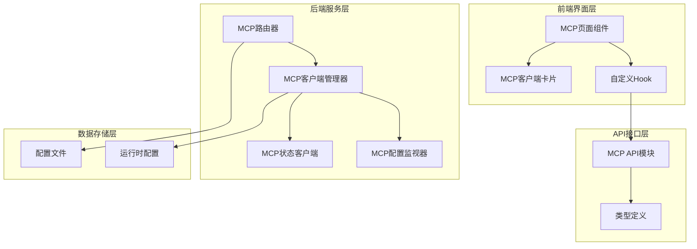

**图表来源**
- [index.tsx:1-245](file://console/src/pages/Agent/MCP/index.tsx#L1-L245)
- [useMCP.ts:1-132](file://console/src/pages/Agent/MCP/useMCP.ts#L1-L132)
- [mcp.py:1-484](file://src/qwenpaw/app/routers/mcp.py#L1-L484)

**章节来源**
- [index.tsx:1-245](file://console/src/pages/Agent/MCP/index.tsx#L1-L245)
- [useMCP.ts:1-132](file://console/src/pages/Agent/MCP/useMCP.ts#L1-L132)

## 核心组件

### MCP客户端信息模型

系统定义了完整的MCP客户端信息模型，支持多种传输方式和配置选项：

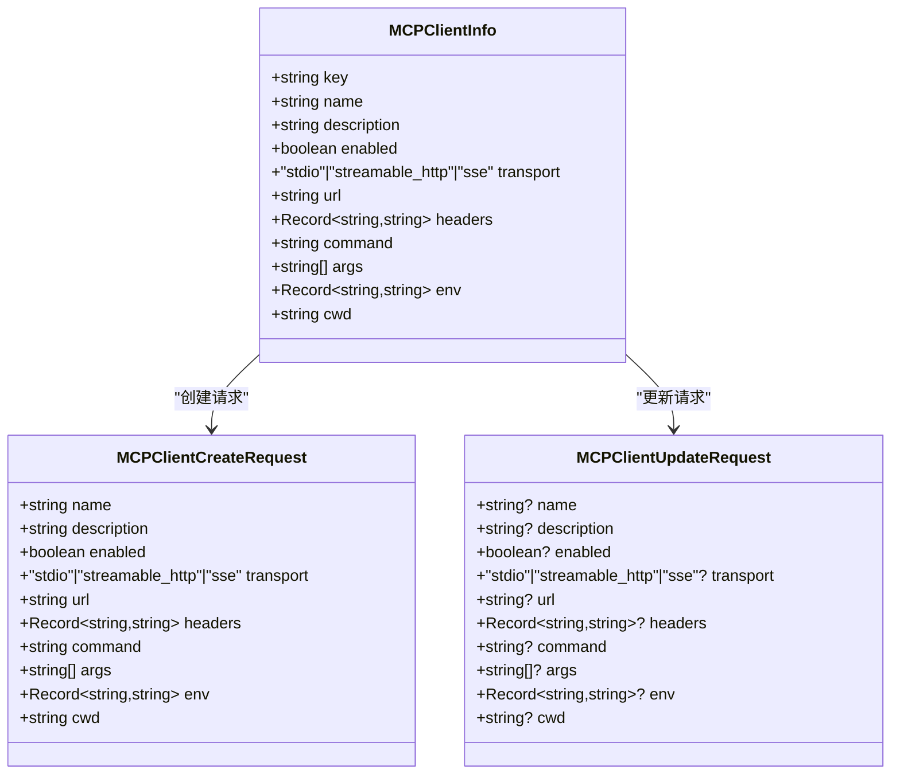

**图表来源**
- [mcp.ts:5-89](file://console/src/api/types/mcp.ts#L5-L89)

### 传输方式支持

系统支持三种MCP传输方式，每种都有特定的使用场景和配置要求：

| 传输方式 | 描述 | 使用场景 | 配置参数 |
|---------|------|----------|----------|
| stdio | 本地进程通信 | 本地MCP服务器 | command, args, env, cwd |
| streamable_http | HTTP流式传输 | 远程HTTP MCP服务器 | url, headers, timeout |
| sse | Server-Sent Events | 实时事件推送 | url, headers, sse_read_timeout |

**章节来源**
- [mcp.ts:14-27](file://console/src/api/types/mcp.ts#L14-L27)
- [stateful_client.py:322-501](file://src/qwenpaw/app/mcp/stateful_client.py#L322-L501)

## 架构概览

MCP配置管理系统采用前后端分离架构，实现了完整的客户端生命周期管理：

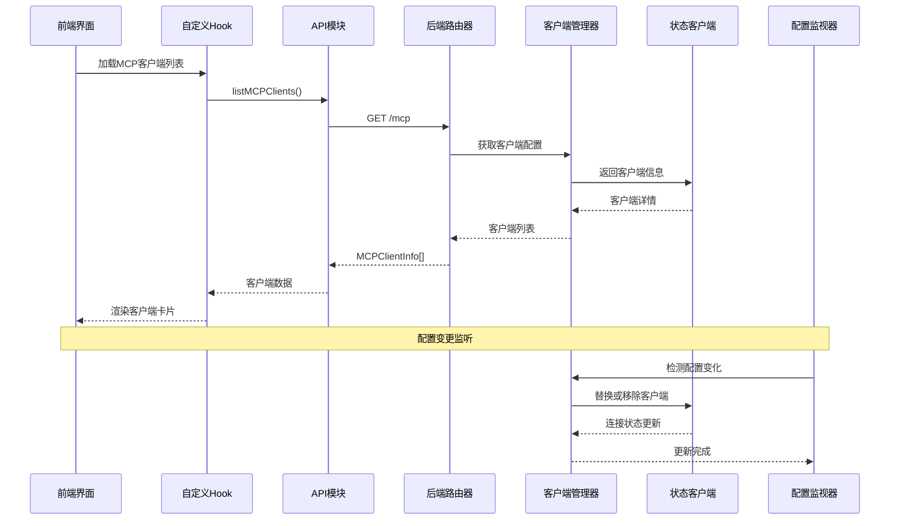

**图表来源**
- [index.tsx:55-64](file://console/src/pages/Agent/MCP/index.tsx#L55-L64)
- [useMCP.ts:15-26](file://console/src/pages/Agent/MCP/useMCP.ts#L15-L26)
- [mcp.py:286-298](file://src/qwenpaw/app/routers/mcp.py#L286-L298)

## 详细组件分析

### MCP页面组件分析

MCP页面组件是整个配置管理的核心入口，负责展示和管理所有MCP客户端：

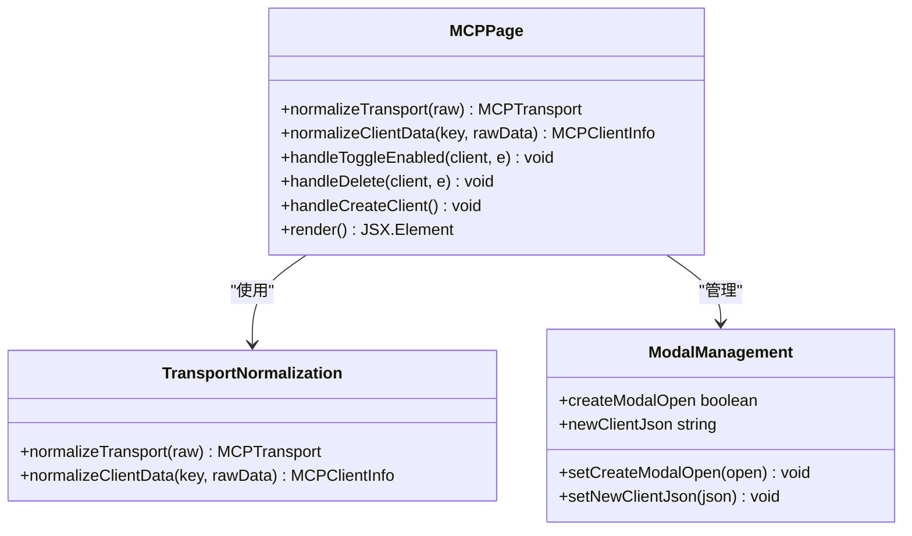

**图表来源**
- [index.tsx:13-53](file://console/src/pages/Agent/MCP/index.tsx#L13-L53)
- [index.tsx:91-161](file://console/src/pages/Agent/MCP/index.tsx#L91-L161)

#### 传输方式规范化流程

页面组件实现了智能的传输方式规范化功能，支持多种输入格式：

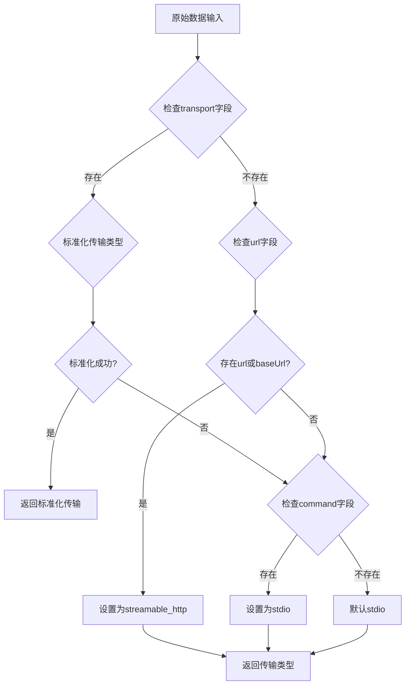

**图表来源**
- [index.tsx:13-36](file://console/src/pages/Agent/MCP/index.tsx#L13-L36)

**章节来源**
- [index.tsx:1-245](file://console/src/pages/Agent/MCP/index.tsx#L1-L245)

### MCP客户端卡片组件分析

MCP客户端卡片组件提供了丰富的用户交互功能，包括配置编辑、工具查询和状态监控：

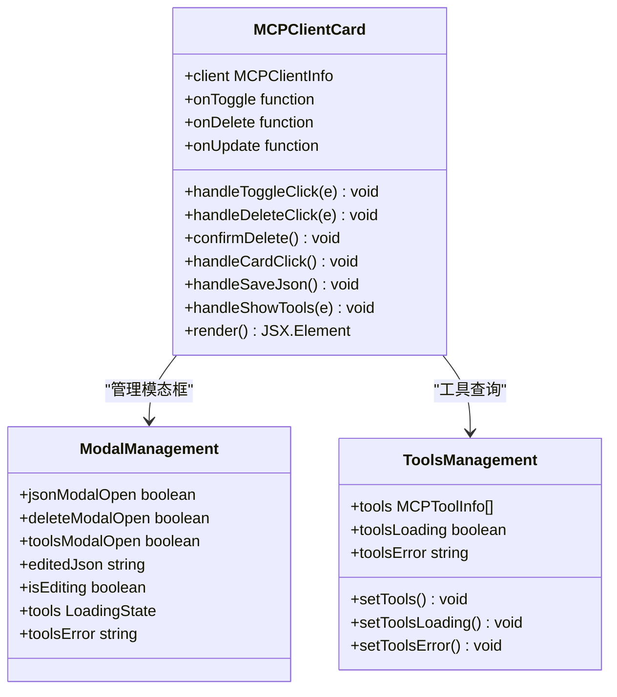

**图表来源**
- [MCPClientCard.tsx:43-48](file://console/src/pages/Agent/MCP/components/MCPClientCard.tsx#L43-L48)
- [MCPClientCard.tsx:104-126](file://console/src/pages/Agent/MCP/components/MCPClientCard.tsx#L104-L126)

#### 工具查询流程

卡片组件实现了完整的工具查询功能，支持实时状态监控：

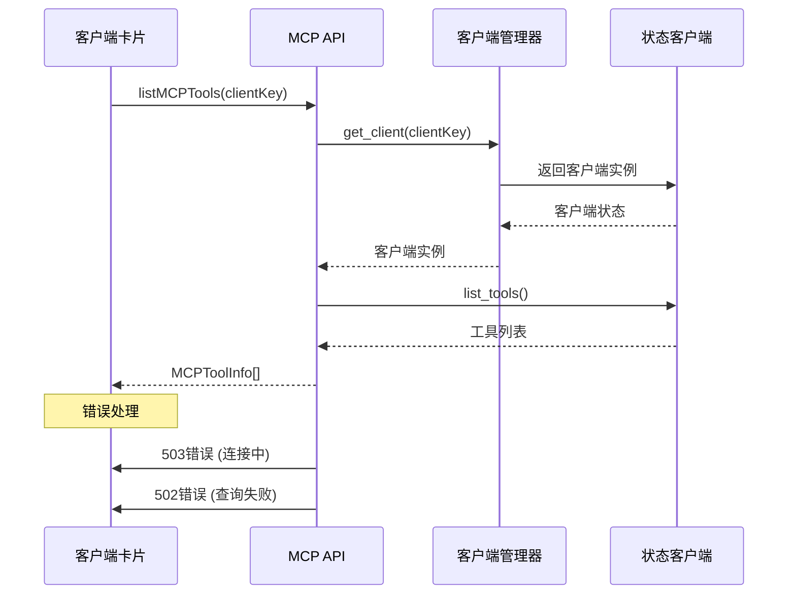

**图表来源**
- [MCPClientCard.tsx:104-126](file://console/src/pages/Agent/MCP/components/MCPClientCard.tsx#L104-L126)
- [mcp.py:225-278](file://src/qwenpaw/app/routers/mcp.py#L225-L278)

**章节来源**
- [MCPClientCard.tsx:1-309](file://console/src/pages/Agent/MCP/components/MCPClientCard.tsx#L1-L309)

### useMCP自定义Hook分析

useMCP Hook实现了完整的数据管理逻辑，包括配置获取、更新和持久化存储：

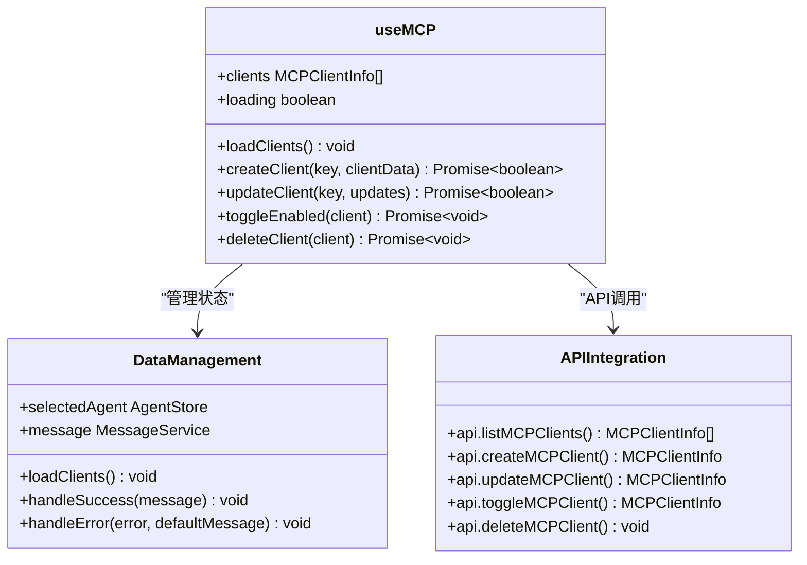

**图表来源**
- [useMCP.ts:8-131](file://console/src/pages/Agent/MCP/useMCP.ts#L8-L131)

#### 数据加载和缓存机制

Hook实现了智能的数据加载和缓存策略：

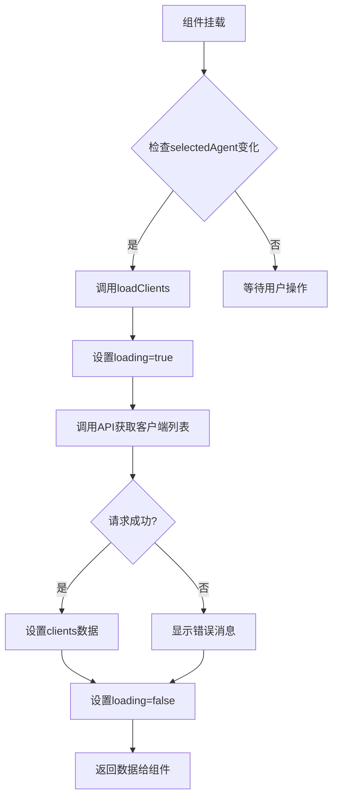

**图表来源**
- [useMCP.ts:15-26](file://console/src/pages/Agent/MCP/useMCP.ts#L15-L26)

**章节来源**
- [useMCP.ts:1-132](file://console/src/pages/Agent/MCP/useMCP.ts#L1-L132)

## 依赖关系分析

MCP配置管理模块的依赖关系体现了清晰的分层架构：

```mermaid
graph TB
subgraph "前端依赖"
A[index.tsx] --> B[useMCP.ts]
B --> C[MCPClientCard.tsx]
B --> D[mcp.ts (API模块)]
D --> E[mcp.ts (类型定义)]
C --> F[index.module.less]
end
subgraph "后端依赖"
G[mcp.py] --> H[manager.py]
H --> I[stateful_client.py]
H --> J[watcher.py]
G --> K[agent_context.py]
G --> L[config.py]
end
subgraph "外部依赖"
M[FastAPI] --> G
N[asyncio] --> H
O[mcp库] --> I
P[httpx] --> I
end
A -.-> G
C -.-> G
B -.-> G
```

**图表来源**
- [index.tsx:1-10](file://console/src/pages/Agent/MCP/index.tsx#L1-L10)
- [mcp.py:1-17](file://src/qwenpaw/app/routers/mcp.py#L1-L17)

### 组件耦合度分析

系统在设计上实现了良好的内聚性和低耦合性：

- **前端组件**：MCP页面、卡片组件和Hook之间通过清晰的接口通信
- **API层**：统一的API模块封装了所有后端调用
- **后端服务**：管理器、客户端和监视器职责明确分离
- **配置管理**：独立的配置监视器确保热重载的可靠性

**章节来源**
- [manager.py:23-38](file://src/qwenpaw/app/mcp/manager.py#L23-L38)
- [watcher.py:24-66](file://src/qwenpaw/app/mcp/watcher.py#L24-L66)

## 性能考虑

### 连接池和资源管理

系统采用了高效的连接管理和资源回收机制：

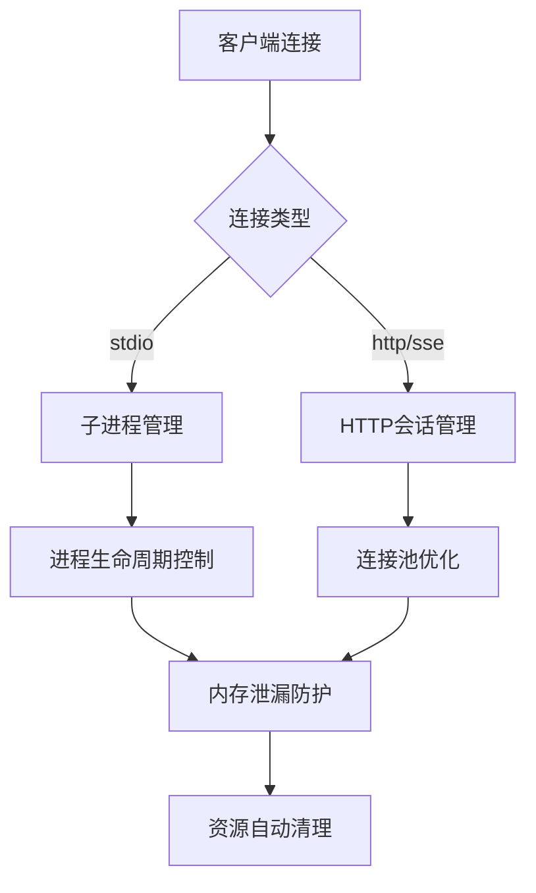

### 异步处理和并发控制

系统通过异步编程模式实现了高并发处理能力：

- **事件驱动**：使用asyncio事件循环处理并发任务
- **连接复用**：HTTP客户端连接池减少重复建立连接的开销
- **超时控制**：智能的超时机制防止长时间阻塞
- **重试机制**：配置变更失败时的自动重试策略

## 故障排除指南

### 常见问题诊断

#### 连接问题排查

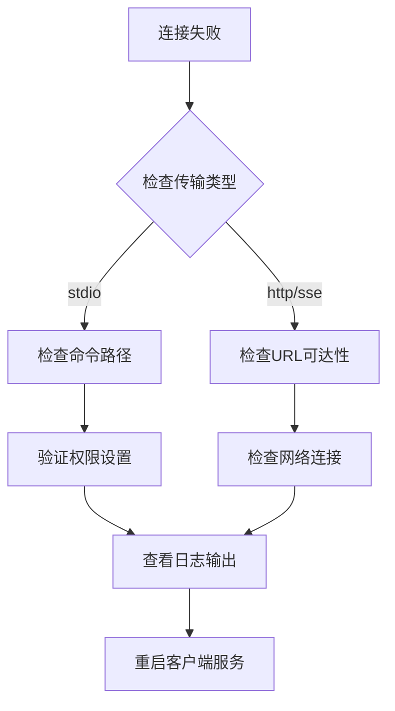

#### 配置验证错误

系统提供了多层次的配置验证机制：

1. **前端验证**：JSON格式验证和必填字段检查
2. **后端验证**：Pydantic模型验证和业务规则检查
3. **运行时验证**：连接测试和工具可用性检查

**章节来源**
- [mcp.py:135-178](file://src/qwenpaw/app/routers/mcp.py#L135-L178)
- [stateful_client.py:177-209](file://src/qwenpaw/app/mcp/stateful_client.py#L177-L209)

### 错误处理策略

系统实现了完善的错误处理和恢复机制：

- **连接超时**：自动重连和超时重试
- **配置变更冲突**：版本控制和回滚机制
- **资源泄漏防护**：强制清理和异常恢复
- **用户反馈**：详细的错误消息和解决方案提示

## 结论

MCP配置管理页面展现了现代Web应用的优秀实践，通过清晰的架构设计、完善的错误处理和高效的性能优化，为用户提供了可靠的MCP客户端管理体验。

该系统的成功之处在于：

1. **架构清晰**：前后端分离、职责明确的分层设计
2. **扩展性强**：支持多种传输方式和配置选项
3. **用户体验好**：直观的界面设计和流畅的操作流程
4. **可靠性高**：完善的错误处理和恢复机制
5. **性能优异**：异步处理和资源优化的实现

未来可以考虑的改进方向包括：增加配置模板功能、支持批量操作、增强安全审计等。