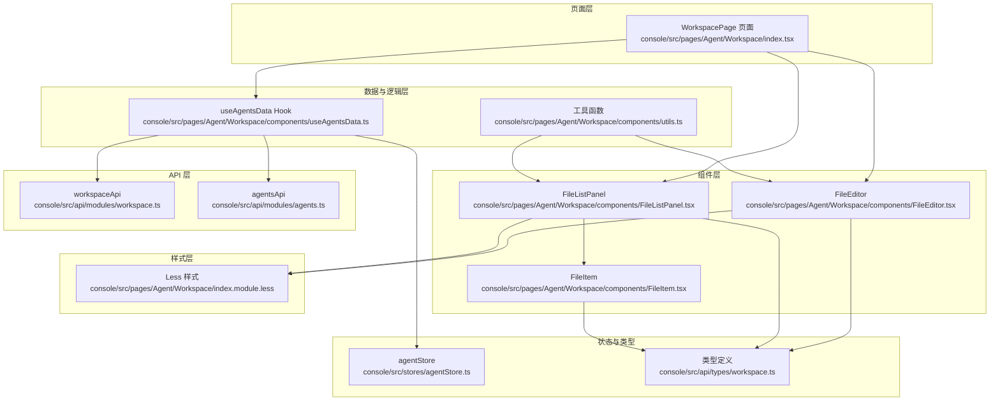
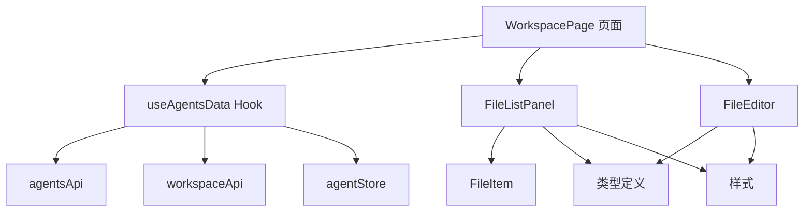
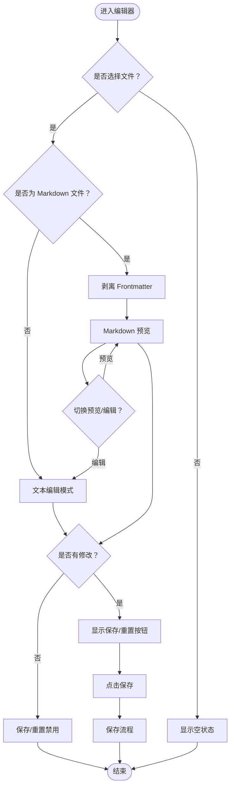
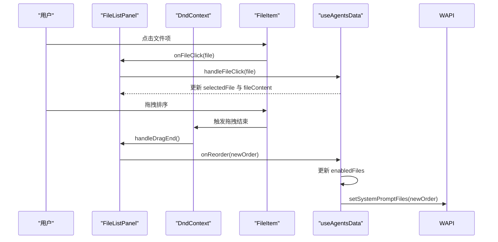
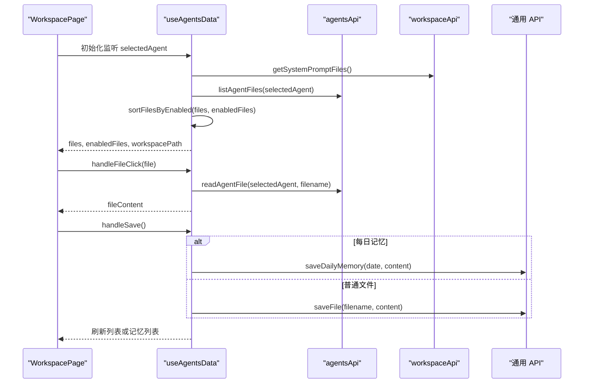
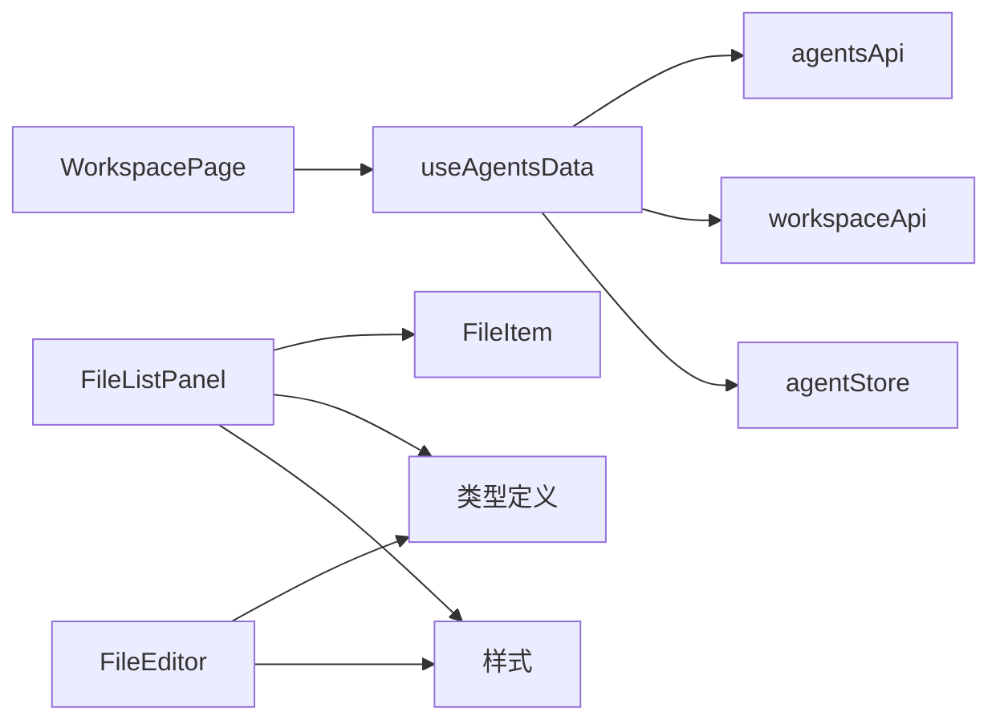

# 代理工作空间管理

<cite>
**本文引用的文件**
- [WorkspacePage 页面](file://console/src/pages/Agent/Workspace/index.tsx)
- [FileEditor 组件](file://console/src/pages/Agent/Workspace/components/FileEditor.tsx)
- [FileListPanel 组件](file://console/src/pages/Agent/Workspace/components/FileListPanel.tsx)
- [FileItem 子项组件](file://console/src/pages/Agent/Workspace/components/FileItem.tsx)
- [useAgentsData 自定义 Hook](file://console/src/pages/Agent/Workspace/components/useAgentsData.ts)
- [Workspace API 模块](file://console/src/api/modules/workspace.ts)
- [Agents API 模块](file://console/src/api/modules/agents.ts)
- [样式文件（Less）](file://console/src/pages/Agent/Workspace/index.module.less)
- [类型定义：工作区与文件信息](file://console/src/api/types/workspace.ts)
- [Zustand 代理状态存储](file://console/src/stores/agentStore.ts)
- [通用工具函数](file://console/src/pages/Agent/Workspace/components/utils.ts)
</cite>

## 目录
1. [简介](#简介)
2. [项目结构](#项目结构)
3. [核心组件](#核心组件)
4. [架构总览](#架构总览)
5. [详细组件分析](#详细组件分析)
6. [依赖关系分析](#依赖关系分析)
7. [性能考量](#性能考量)
8. [故障排查指南](#故障排查指南)
9. [结论](#结论)
10. [附录](#附录)

## 简介
本技术文档聚焦于 QwenPaw 控制台中“代理工作空间管理”页面的实现，系统性解析其架构设计与关键组件职责，包括文件编辑器、文件列表面板以及代理数据管理等。文档同时给出 FileEditor 的功能实现要点（内容编辑、语法高亮、保存机制、撤销重做）、FileListPanel 的设计原理（文件树结构展示、文件操作菜单与拖拽排序）、useAgentsData Hook 的数据管理逻辑（代理文件获取、缓存策略与实时同步），并提供文件操作的安全控制、权限管理与版本管理的实现示例与最佳实践。

## 项目结构
工作空间管理页面位于控制台前端工程的 Agent 页面下，采用“页面 + 组件 + 自定义 Hook + API 模块 + 类型 + 样式”的分层组织方式。页面负责编排与交互，组件负责 UI 展示与事件处理，Hook 负责跨组件的状态与副作用管理，API 模块封装后端接口调用，类型定义确保前后端契约一致，样式文件提供主题化与响应式布局。

图表来源
- [WorkspacePage 页面:1-186](file://console/src/pages/Agent/Workspace/index.tsx#L1-L186)
- [FileListPanel 组件:1-127](file://console/src/pages/Agent/Workspace/components/FileListPanel.tsx#L1-L127)
- [FileEditor 组件:1-143](file://console/src/pages/Agent/Workspace/components/FileEditor.tsx#L1-L143)
- [FileItem 子项组件:1-145](file://console/src/pages/Agent/Workspace/components/FileItem.tsx#L1-L145)
- [useAgentsData 自定义 Hook:1-300](file://console/src/pages/Agent/Workspace/components/useAgentsData.ts#L1-L300)
- [Workspace API 模块:1-149](file://console/src/api/modules/workspace.ts#L1-L149)
- [Agents API 模块:1-79](file://console/src/api/modules/agents.ts#L1-L79)
- [Zustand 代理状态存储:1-89](file://console/src/stores/agentStore.ts#L1-L89)
- [类型定义：工作区与文件信息:1-22](file://console/src/api/types/workspace.ts#L1-L22)
- [样式文件（Less）:1-561](file://console/src/pages/Agent/Workspace/index.module.less#L1-L561)

章节来源
- [WorkspacePage 页面:1-186](file://console/src/pages/Agent/Workspace/index.tsx#L1-L186)
- [FileListPanel 组件:1-127](file://console/src/pages/Agent/Workspace/components/FileListPanel.tsx#L1-L127)
- [FileEditor 组件:1-143](file://console/src/pages/Agent/Workspace/components/FileEditor.tsx#L1-L143)
- [useAgentsData 自定义 Hook:1-300](file://console/src/pages/Agent/Workspace/components/useAgentsData.ts#L1-L300)

## 核心组件
- 工作空间页面（WorkspacePage）
  - 负责承载文件列表面板与文件编辑器，并提供工作区打包下载、ZIP 文件上传入口。
  - 通过 useAgentsData 提供的文件列表、选中文件、内容、加载状态、变更标记、启用文件列表等数据与操作方法。
- 文件列表面板（FileListPanel）
  - 展示代理工作区中的核心文件，支持刷新、拖拽排序、启用/禁用切换。
  - 集成 DnD Kit 实现可拖拽排序，基于 enabledFiles 控制排序可用性。
- 文件编辑器（FileEditor）
  - 支持 Markdown 预览与纯文本编辑，提供复制、保存、重置等操作。
  - 对 Markdown 文件自动剥离 Frontmatter 并进行预览渲染。
- 自定义 Hook（useAgentsData）
  - 负责文件列表初始化、文件内容读取、保存、重置、启用文件列表管理、每日记忆文件加载与更新。
  - 基于 agentsApi 与 workspaceApi 进行文件与工作区配置的读写。
- API 模块
  - workspaceApi：工作区打包下载、文件上传、系统提示词文件列表读写、每日记忆读写。
  - agentsApi：代理维度的文件列表与读写接口。
- 类型与状态
  - MarkdownFile/DailyMemoryFile 等类型定义，确保前后端契约一致。
  - agentStore 使用 sessionStorage 持久化当前选中代理，保障代理切换时的数据一致性。

章节来源
- [WorkspacePage 页面:11-186](file://console/src/pages/Agent/Workspace/index.tsx#L11-L186)
- [FileListPanel 组件:22-127](file://console/src/pages/Agent/Workspace/components/FileListPanel.tsx#L22-L127)
- [FileEditor 组件:11-143](file://console/src/pages/Agent/Workspace/components/FileEditor.tsx#L11-L143)
- [useAgentsData 自定义 Hook:16-300](file://console/src/pages/Agent/Workspace/components/useAgentsData.ts#L16-L300)
- [Workspace API 模块:39-149](file://console/src/api/modules/workspace.ts#L39-L149)
- [Agents API 模块:57-78](file://console/src/api/modules/agents.ts#L57-L78)
- [类型定义：工作区与文件信息:1-22](file://console/src/api/types/workspace.ts#L1-L22)
- [Zustand 代理状态存储:1-89](file://console/src/stores/agentStore.ts#L1-L89)

## 架构总览
工作空间管理页面采用“页面编排 + 组件拆分 + Hook 抽象 + API 封装”的分层架构。页面负责交互与编排，组件负责展示与事件，Hook 负责状态与副作用，API 模块负责网络请求与错误处理，类型与状态保证数据一致性与可维护性。

图表来源
- [WorkspacePage 页面:1-186](file://console/src/pages/Agent/Workspace/index.tsx#L1-L186)
- [useAgentsData 自定义 Hook:1-300](file://console/src/pages/Agent/Workspace/components/useAgentsData.ts#L1-L300)
- [Agents API 模块:1-79](file://console/src/api/modules/agents.ts#L1-L79)
- [Workspace API 模块:1-149](file://console/src/api/modules/workspace.ts#L1-L149)
- [FileListPanel 组件:1-127](file://console/src/pages/Agent/Workspace/components/FileListPanel.tsx#L1-L127)
- [FileEditor 组件:1-143](file://console/src/pages/Agent/Workspace/components/FileEditor.tsx#L1-L143)
- [FileItem 子项组件:1-145](file://console/src/pages/Agent/Workspace/components/FileItem.tsx#L1-L145)
- [类型定义：工作区与文件信息:1-22](file://console/src/api/types/workspace.ts#L1-L22)
- [Zustand 代理状态存储:1-89](file://console/src/stores/agentStore.ts#L1-L89)
- [样式文件（Less）:1-561](file://console/src/pages/Agent/Workspace/index.module.less#L1-L561)

## 详细组件分析

### FileEditor 组件
- 功能要点
  - 内容编辑：使用受控的 TextArea 接收 onContentChange 回调以更新内存中的内容。
  - Markdown 预览：对 .md 文件自动剥离 Frontmatter 后交由 XMarkdown 渲染；支持预览/编辑切换。
  - 复制能力：优先使用 Clipboard API，回退到临时 textarea 方案，统一消息反馈。
  - 保存与重置：调用 onSave/onReset，结合 hasChanges 控制按钮可用性；保存时区分每日记忆与普通文件。
  - 加载态：loading 状态用于禁用保存按钮并显示加载指示。
- 数据流
  - 输入：selectedFile、fileContent、loading、hasChanges。
  - 输出：onContentChange、onSave、onReset。
- 错误处理
  - 复制失败时记录日志并提示用户。
  - 无选中文件时显示空状态文案。

图表来源
- [FileEditor 组件:21-143](file://console/src/pages/Agent/Workspace/components/FileEditor.tsx#L21-L143)

章节来源
- [FileEditor 组件:11-143](file://console/src/pages/Agent/Workspace/components/FileEditor.tsx#L11-L143)

### FileListPanel 设计原理
- 文件树结构展示
  - 列表顶部提供刷新按钮与说明文字，中部为滚动容器，底部为空状态提示。
  - 文件项 FileItem 展示文件名、大小、修改时间、启用开关与展开图标（针对 MEMORY.md）。
- 拖拽上传功能
  - 使用 @dnd-kit 实现拖拽排序，仅在文件处于启用状态时允许拖拽。
  - 通过 enabledFiles 数组维护排序顺序，拖拽结束后触发 onReorder 回调更新后端配置。
- 文件操作菜单
  - 启用/禁用：通过 onToggleEnabled 切换文件在系统提示词中的启用状态。
  - 点击文件：触发 onFileClick 打开对应文件内容。
  - 点击每日记忆：触发 onDailyMemoryClick 打开对应日期的记忆文件。

图表来源
- [FileListPanel 组件:36-127](file://console/src/pages/Agent/Workspace/components/FileListPanel.tsx#L36-L127)
- [FileItem 子项组件:27-145](file://console/src/pages/Agent/Workspace/components/FileItem.tsx#L27-L145)
- [useAgentsData 自定义 Hook:237-275](file://console/src/pages/Agent/Workspace/components/useAgentsData.ts#L237-L275)
- [Workspace API 模块:140-147](file://console/src/api/modules/workspace.ts#L140-L147)

章节来源
- [FileListPanel 组件:22-127](file://console/src/pages/Agent/Workspace/components/FileListPanel.tsx#L22-L127)
- [FileItem 子项组件:16-145](file://console/src/pages/Agent/Workspace/components/FileItem.tsx#L16-L145)

### useAgentsData 自定义 Hook 数据管理逻辑
- 初始化与依赖
  - 监听 selectedAgent 变化，重新拉取启用文件列表与文件列表，并尝试恢复上次选中的文件。
  - 计算工作区路径（兼容 Unix 与 Windows 分隔符）。
- 文件列表与排序
  - 从 agentsApi 获取文件列表，结合 enabledFiles 的顺序进行稳定排序。
  - 当 enabledFiles 变化时，重新计算排序结果并避免不必要的更新。
- 文件内容读取与保存
  - handleFileClick：根据文件名判断是否为每日记忆文件，分别调用 agentsApi 或 api 的读取接口。
  - handleSave：区分每日记忆与普通文件，调用对应保存接口；成功后刷新列表或记忆列表。
  - handleReset：将当前内容回滚到原始内容。
- 启用文件管理
  - handleToggleFileEnabled：切换文件在系统提示词中的启用状态，必要时弹出警告提示。
  - handleReorderFiles：更新系统提示词文件顺序并持久化到后端。
- 缓存策略与实时同步
  - 本地缓存：enabledFiles、files、selectedFile、fileContent、originalContent。
  - 后端同步：通过 workspaceApi 与 agentsApi 保持与服务端一致。
  - 代理维度：所有文件操作均绑定到当前选中代理，确保多代理隔离。

图表来源
- [useAgentsData 自定义 Hook:30-299](file://console/src/pages/Agent/Workspace/components/useAgentsData.ts#L30-L299)
- [Agents API 模块:57-78](file://console/src/api/modules/agents.ts#L57-L78)
- [Workspace API 模块:140-147](file://console/src/api/modules/workspace.ts#L140-L147)

章节来源
- [useAgentsData 自定义 Hook:16-300](file://console/src/pages/Agent/Workspace/components/useAgentsData.ts#L16-L300)
- [Agents API 模块:1-79](file://console/src/api/modules/agents.ts#L1-L79)
- [Workspace API 模块:1-149](file://console/src/api/modules/workspace.ts#L1-L149)

### 文件操作的安全控制、权限管理与版本管理
- 安全控制
  - 上传限制：仅接受 .zip 格式，限制最大体积，校验失败时清空输入并提示。
  - 下载：通过 workspaceApi.downloadWorkspace 返回 Blob 与文件名，前端触发浏览器下载。
  - 复制：优先 Clipboard API，失败回退至临时 textarea，避免跨域与权限问题。
- 权限管理
  - 代理维度隔离：所有文件读写均通过 agentsApi 指定 agentId，确保不同代理之间互不干扰。
  - 启用文件控制：通过 workspaceApi.setSystemPromptFiles 管理哪些文件参与系统提示词构建。
- 版本管理
  - 文件元信息：size、created_time、modified_time、updated_at 等字段可用于版本对比与审计。
  - 每日记忆：按日期命名的 .md 文件，支持独立保存与加载，便于历史版本追踪。
  - 工作区打包：downloadWorkspace 提供完整工作区快照，便于备份与迁移。

章节来源
- [WorkspacePage 页面:36-108](file://console/src/pages/Agent/Workspace/index.tsx#L36-L108)
- [Workspace API 模块:60-114](file://console/src/api/modules/workspace.ts#L60-L114)
- [Agents API 模块:57-78](file://console/src/api/modules/agents.ts#L57-L78)
- [类型定义：工作区与文件信息:1-22](file://console/src/api/types/workspace.ts#L1-L22)

## 依赖关系分析
- 组件耦合
  - WorkspacePage 依赖 useAgentsData 提供的数据与方法，依赖 FileListPanel 与 FileEditor 进行展示与交互。
  - FileListPanel 依赖 FileItem 进行单个文件项渲染，依赖 DnD Kit 实现拖拽排序。
  - FileEditor 依赖 XMarkdown 进行 Markdown 渲染，依赖剪贴板 API 进行复制。
- 外部依赖
  - agentsApi/workspaceApi：后端接口封装，负责与服务端通信。
  - agentStore：Zustand 状态管理，持久化当前选中代理。
  - dnd-kit：拖拽排序库，提供可访问的拖拽体验。
  - dayjs/pretty-bytes：时间格式化与文件大小格式化。
- 循环依赖
  - 未发现直接循环依赖；组件间通过 props 与回调传递数据，避免相互引用。

图表来源
- [WorkspacePage 页面:1-186](file://console/src/pages/Agent/Workspace/index.tsx#L1-L186)
- [useAgentsData 自定义 Hook:1-300](file://console/src/pages/Agent/Workspace/components/useAgentsData.ts#L1-L300)
- [Agents API 模块:1-79](file://console/src/api/modules/agents.ts#L1-L79)
- [Workspace API 模块:1-149](file://console/src/api/modules/workspace.ts#L1-L149)
- [FileListPanel 组件:1-127](file://console/src/pages/Agent/Workspace/components/FileListPanel.tsx#L1-L127)
- [FileEditor 组件:1-143](file://console/src/pages/Agent/Workspace/components/FileEditor.tsx#L1-L143)
- [FileItem 子项组件:1-145](file://console/src/pages/Agent/Workspace/components/FileItem.tsx#L1-L145)
- [类型定义：工作区与文件信息:1-22](file://console/src/api/types/workspace.ts#L1-L22)
- [Zustand 代理状态存储:1-89](file://console/src/stores/agentStore.ts#L1-L89)
- [样式文件（Less）:1-561](file://console/src/pages/Agent/Workspace/index.module.less#L1-L561)

章节来源
- [WorkspacePage 页面:1-186](file://console/src/pages/Agent/Workspace/index.tsx#L1-L186)
- [FileListPanel 组件:1-127](file://console/src/pages/Agent/Workspace/components/FileListPanel.tsx#L1-L127)
- [FileEditor 组件:1-143](file://console/src/pages/Agent/Workspace/components/FileEditor.tsx#L1-L143)
- [useAgentsData 自定义 Hook:1-300](file://console/src/pages/Agent/Workspace/components/useAgentsData.ts#L1-L300)

## 性能考量
- 渲染优化
  - FileListPanel 使用滚动容器与固定尺寸布局，避免大列表导致的重排。
  - FileEditor 在 Markdown 预览模式下仅渲染内容区域，减少不必要的 DOM 更新。
- 状态更新
  - useAgentsData 中对排序与刷新进行条件判断，避免不必要的 setFiles 调用。
  - enabledFiles 变更时仅在顺序实际变化时更新文件列表。
- 网络请求
  - 读取文件与保存文件均设置 loading 状态，防止重复提交。
  - 上传前进行格式与大小校验，减少无效请求。
- 主题与样式
  - Less 样式中包含深色模式适配，减少运行时样式切换成本。

## 故障排查指南
- 无法加载文件列表
  - 检查 selectedAgent 是否正确，确认 agentsApi.listAgentFiles 调用返回正常。
  - 查看控制台错误日志与消息提示，确认网络请求状态码。
- 保存失败
  - 确认 handleSave 流程中区分了每日记忆与普通文件；检查对应保存接口返回。
  - 若为每日记忆，保存后需刷新记忆列表；否则刷新文件列表。
- 拖拽排序无效
  - 确认文件处于启用状态（enabledFiles 包含该文件），否则拖拽句柄不可用。
  - 检查 onReorder 回调是否正确触发 workspaceApi.setSystemPromptFiles。
- 上传失败
  - 检查文件格式是否为 .zip，大小是否超过限制。
  - 查看后端返回的错误信息，确认权限与磁盘配额。

章节来源
- [useAgentsData 自定义 Hook:208-275](file://console/src/pages/Agent/Workspace/components/useAgentsData.ts#L208-L275)
- [Workspace API 模块:93-114](file://console/src/api/modules/workspace.ts#L93-L114)
- [FileListPanel 组件:58-68](file://console/src/pages/Agent/Workspace/components/FileListPanel.tsx#L58-L68)

## 结论
代理工作空间管理页面通过清晰的分层架构与职责划分，实现了文件列表展示、内容编辑、拖拽排序、启用控制与工作区打包下载/上传等核心能力。useAgentsData Hook 将数据获取、缓存与同步逻辑集中抽象，配合 agentsApi/workspaceApi 提供稳定的后端交互；FileEditor 与 FileListPanel 则分别承担内容编辑与文件管理的 UI 职责。整体设计兼顾易用性与可维护性，为后续扩展（如权限细化、版本对比、批量操作等）提供了良好基础。

## 附录
- 关键流程图与类图请参考上文各小节的可视化图示。
- 如需进一步了解后端实现细节，可参考 Python 后端模块（例如 workspace 服务工厂与管理器、路由等），但本文件聚焦前端实现与集成。