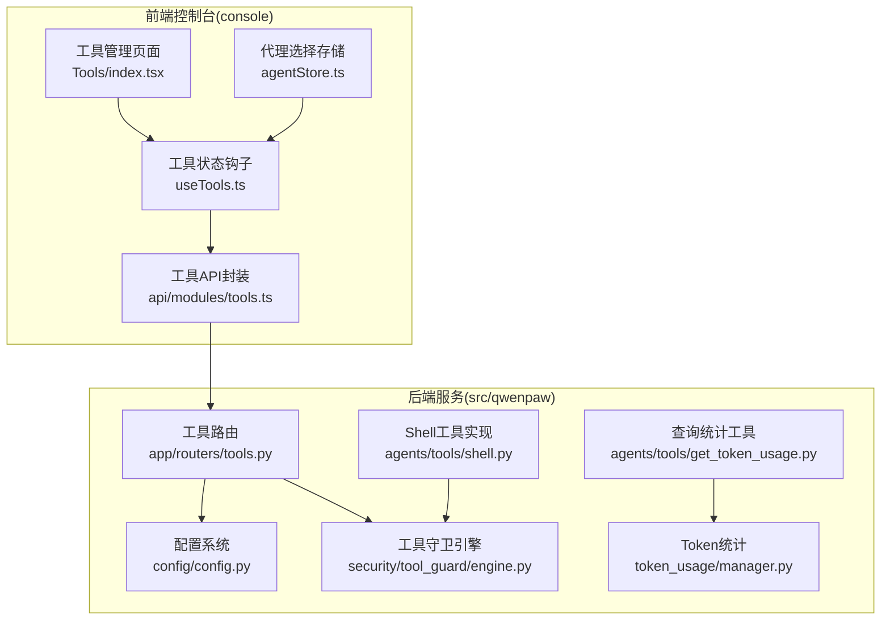
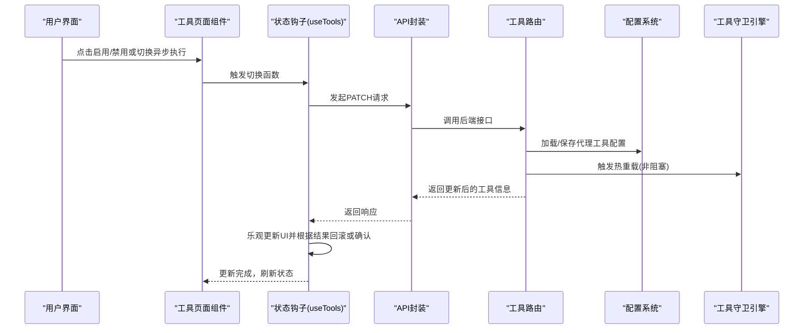
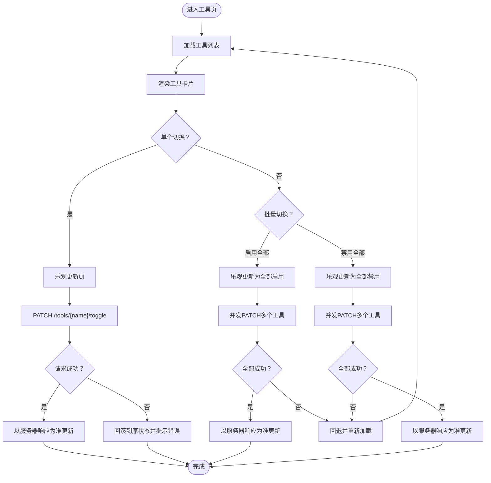
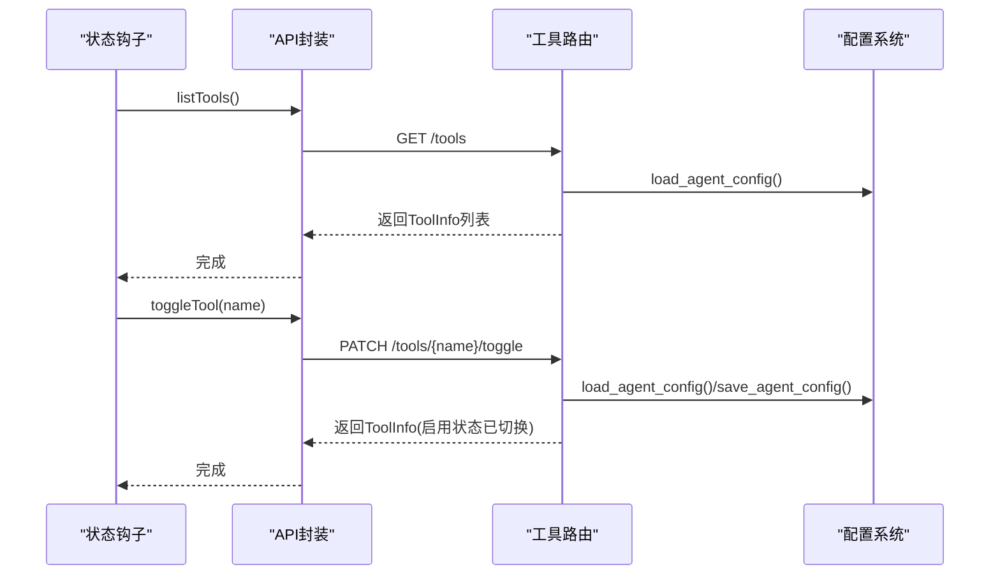
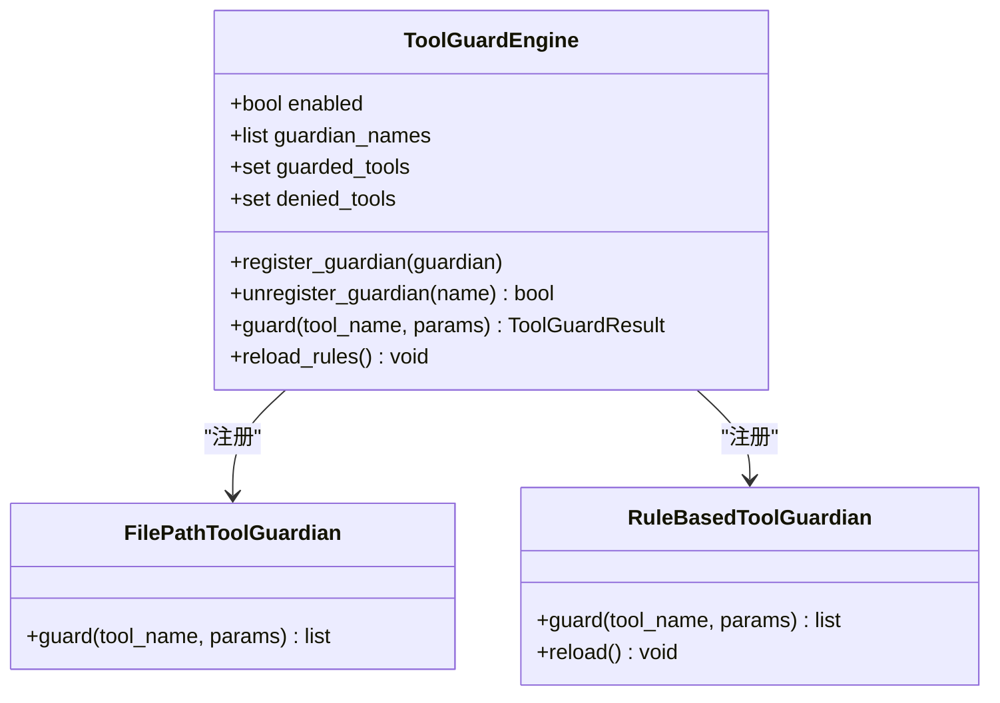
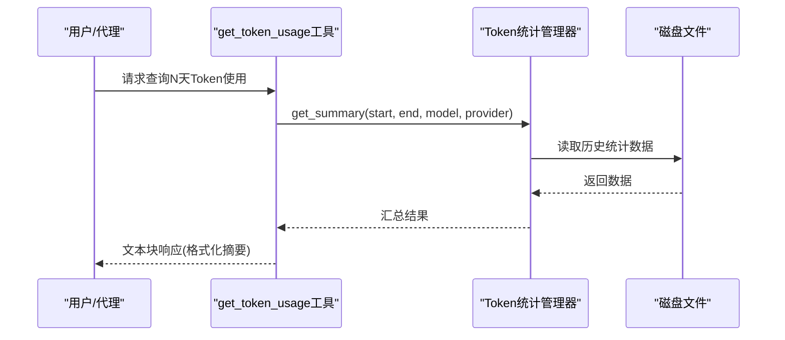
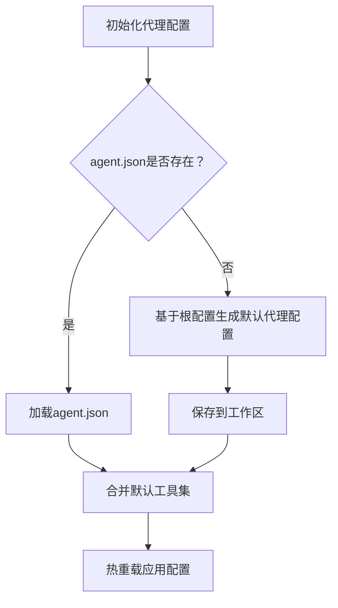
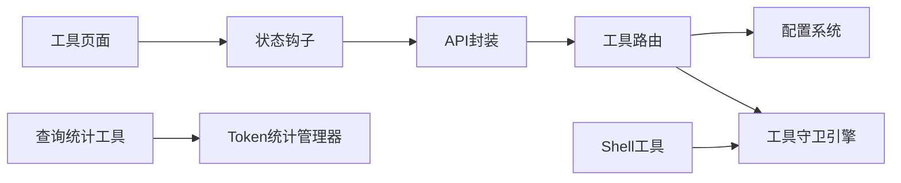

# 代理工具管理

<cite>
**本文引用的文件**
- [console/src/pages/Agent/Tools/index.tsx](file://console/src/pages/Agent/Tools/index.tsx)
- [console/src/pages/Agent/Tools/useTools.ts](file://console/src/pages/Agent/Tools/useTools.ts)
- [console/src/api/modules/tools.ts](file://console/src/api/modules/tools.ts)
- [src/qwenpaw/app/routers/tools.py](file://src/qwenpaw/app/routers/tools.py)
- [src/qwenpaw/config/config.py](file://src/qwenpaw/config/config.py)
- [src/qwenpaw/agents/tools/__init__.py](file://src/qwenpaw/agents/tools/__init__.py)
- [src/qwenpaw/agents/tools/shell.py](file://src/qwenpaw/agents/tools/shell.py)
- [src/qwenpaw/security/tool_guard/engine.py](file://src/qwenpaw/security/tool_guard/engine.py)
- [src/qwenpaw/token_usage/manager.py](file://src/qwenpaw/token_usage/manager.py)
- [src/qwenpaw/agents/tools/get_token_usage.py](file://src/qwenpaw/agents/tools/get_token_usage.py)
- [console/src/stores/agentStore.ts](file://console/src/stores/agentStore.ts)
</cite>

## 目录
1. [简介](#简介)
2. [项目结构](#项目结构)
3. [核心组件](#核心组件)
4. [架构总览](#架构总览)
5. [详细组件分析](#详细组件分析)
6. [依赖分析](#依赖分析)
7. [性能考虑](#性能考虑)
8. [故障排查指南](#故障排查指南)
9. [结论](#结论)
10. [附录](#附录)

## 简介
本文件面向QwenPaw代理工具管理页面，系统性梳理工具列表展示、工具状态管理、权限控制与使用统计等模块的实现架构与交互流程。重点覆盖以下方面：
- 工具数据来源与更新机制：工具配置信息、启用/禁用切换、异步执行开关、批量操作与状态同步。
- 权限控制体系：工具守卫引擎、规则与白名单、拒绝工具集、路径级防护。
- 使用统计能力：调用次数记录、按模型/提供商/日期聚合、成功度量与资源消耗概览。
- 配置管理与持久化：多代理工作区隔离、默认工具集与合并策略、热重载与状态同步。

## 项目结构
代理工具管理涉及前端页面与后端API、配置与安全、统计与工具实现的协同：
- 前端页面负责展示工具卡片、状态切换与批量操作，并通过API与后端交互。
- 后端路由提供工具列表、启用/禁用切换、异步执行开关等接口。
- 配置系统承载工具默认定义、代理工作区隔离与热重载。
- 安全模块提供工具调用前的守卫与规则校验。
- 统计模块记录与汇总Token使用情况，供工具查询。

图表来源
- [console/src/pages/Agent/Tools/index.tsx:15-124](file://console/src/pages/Agent/Tools/index.tsx#L15-L124)
- [console/src/pages/Agent/Tools/useTools.ts:1-178](file://console/src/pages/Agent/Tools/useTools.ts#L1-L178)
- [console/src/api/modules/tools.ts:1-37](file://console/src/api/modules/tools.ts#L1-L37)
- [src/qwenpaw/app/routers/tools.py:1-181](file://src/qwenpaw/app/routers/tools.py#L1-L181)
- [src/qwenpaw/config/config.py:1007-1044](file://src/qwenpaw/config/config.py#L1007-L1044)
- [src/qwenpaw/security/tool_guard/engine.py:1-238](file://src/qwenpaw/security/tool_guard/engine.py#L1-L238)
- [src/qwenpaw/token_usage/manager.py:1-309](file://src/qwenpaw/token_usage/manager.py#L1-L309)
- [src/qwenpaw/agents/tools/get_token_usage.py:1-86](file://src/qwenpaw/agents/tools/get_token_usage.py#L1-L86)
- [src/qwenpaw/agents/tools/shell.py:1-454](file://src/qwenpaw/agents/tools/shell.py#L1-L454)

章节来源
- [console/src/pages/Agent/Tools/index.tsx:1-124](file://console/src/pages/Agent/Tools/index.tsx#L1-L124)
- [console/src/pages/Agent/Tools/useTools.ts:1-178](file://console/src/pages/Agent/Tools/useTools.ts#L1-L178)
- [console/src/api/modules/tools.ts:1-37](file://console/src/api/modules/tools.ts#L1-L37)
- [src/qwenpaw/app/routers/tools.py:1-181](file://src/qwenpaw/app/routers/tools.py#L1-L181)
- [src/qwenpaw/config/config.py:1007-1044](file://src/qwenpaw/config/config.py#L1007-L1044)

## 核心组件
- 工具管理页面与状态钩子
  - 页面组件负责渲染工具卡片、显示状态、提供启用/禁用与异步执行切换按钮，并支持全选/全不选的批量操作。
  - 状态钩子封装加载、切换、异步执行开关、批量切换逻辑，包含乐观更新与错误回滚。
- 工具API封装
  - 提供列表、切换启用状态、更新异步执行开关的请求方法，统一处理响应与错误提示。
- 工具路由与配置
  - 路由返回当前代理的工作区下工具配置（含默认回退），支持切换启用状态与异步执行设置，并触发热重载。
  - 配置系统定义工具默认集合、代理工作区隔离、工具合并策略与保存。
- 安全与权限控制
  - 工具守卫引擎按配置与环境变量决定是否启用，注册多种守卫器并聚合结果；支持受保护工具集与拒绝工具集。
- 使用统计
  - Token统计管理器以文件形式持久化每日/模型维度的Token用量与调用次数，提供查询与汇总接口；查询统计工具可输出格式化摘要。

章节来源
- [console/src/pages/Agent/Tools/index.tsx:15-124](file://console/src/pages/Agent/Tools/index.tsx#L15-L124)
- [console/src/pages/Agent/Tools/useTools.ts:8-178](file://console/src/pages/Agent/Tools/useTools.ts#L8-L178)
- [console/src/api/modules/tools.ts:11-36](file://console/src/api/modules/tools.ts#L11-L36)
- [src/qwenpaw/app/routers/tools.py:36-181](file://src/qwenpaw/app/routers/tools.py#L36-L181)
- [src/qwenpaw/config/config.py:1007-1044](file://src/qwenpaw/config/config.py#L1007-L1044)
- [src/qwenpaw/security/tool_guard/engine.py:53-238](file://src/qwenpaw/security/tool_guard/engine.py#L53-L238)
- [src/qwenpaw/token_usage/manager.py:62-309](file://src/qwenpaw/token_usage/manager.py#L62-L309)
- [src/qwenpaw/agents/tools/get_token_usage.py:12-86](file://src/qwenpaw/agents/tools/get_token_usage.py#L12-L86)

## 架构总览
前端通过API与后端路由交互，后端在请求中解析当前代理上下文，读取或写入对应工作区的工具配置，同时触发热重载以应用变更。安全模块在工具调用前进行参数检查与规则匹配，统计模块记录Token使用情况供查询工具使用。

图表来源
- [console/src/pages/Agent/Tools/useTools.ts:33-134](file://console/src/pages/Agent/Tools/useTools.ts#L33-L134)
- [console/src/api/modules/tools.ts:15-36](file://console/src/api/modules/tools.ts#L15-L36)
- [src/qwenpaw/app/routers/tools.py:77-181](file://src/qwenpaw/app/routers/tools.py#L77-L181)
- [src/qwenpaw/config/config.py:1176-1302](file://src/qwenpaw/config/config.py#L1176-L1302)
- [src/qwenpaw/security/tool_guard/engine.py:169-227](file://src/qwenpaw/security/tool_guard/engine.py#L169-L227)

## 详细组件分析

### 工具列表与状态管理（前端）
- 列表渲染：遍历工具数组，展示名称、图标、描述、启用状态与异步执行状态；根据启用状态为卡片添加样式。
- 单个切换：点击“启用/禁用”按钮，先乐观更新UI，再发起PATCH请求；失败时回滚到原状态并提示错误。
- 异步执行切换：针对特定工具（如Shell命令）提供异步执行开关，同样采用乐观更新与回滚策略。
- 批量操作：根据当前列表筛选已启用/未启用工具，使用Promise.all并发调用切换接口；失败时整体回退并重新拉取最新状态。
- 代理选择联动：当所选代理变化时，自动重新加载工具列表，确保不同工作区的工具状态独立。

图表来源
- [console/src/pages/Agent/Tools/useTools.ts:16-166](file://console/src/pages/Agent/Tools/useTools.ts#L16-L166)
- [console/src/pages/Agent/Tools/index.tsx:26-114](file://console/src/pages/Agent/Tools/index.tsx#L26-L114)

章节来源
- [console/src/pages/Agent/Tools/index.tsx:15-124](file://console/src/pages/Agent/Tools/index.tsx#L15-L124)
- [console/src/pages/Agent/Tools/useTools.ts:8-178](file://console/src/pages/Agent/Tools/useTools.ts#L8-L178)

### 工具API封装与后端路由
- API封装
  - listTools：GET /tools，返回工具列表。
  - toggleTool：PATCH /tools/{name}/toggle，切换启用状态。
  - updateAsyncExecution：PATCH /tools/{name}/async-execution，更新异步执行开关。
- 后端路由
  - list_tools：根据当前代理上下文加载配置，若代理配置缺失则回退至全局配置；组装ToolInfo列表返回。
  - toggle_tool：校验工具存在性，切换enabled字段，保存配置并触发热重载。
  - update_tool_async_execution：校验工具存在性，更新async_execution字段，保存配置并触发热重载。

图表来源
- [console/src/api/modules/tools.ts:11-36](file://console/src/api/modules/tools.ts#L11-L36)
- [src/qwenpaw/app/routers/tools.py:36-181](file://src/qwenpaw/app/routers/tools.py#L36-L181)
- [src/qwenpaw/config/config.py:1176-1302](file://src/qwenpaw/config/config.py#L1176-L1302)

章节来源
- [console/src/api/modules/tools.ts:1-37](file://console/src/api/modules/tools.ts#L1-L37)
- [src/qwenpaw/app/routers/tools.py:36-181](file://src/qwenpaw/app/routers/tools.py#L36-L181)
- [src/qwenpaw/config/config.py:1176-1302](file://src/qwenpaw/config/config.py#L1176-L1302)

### 工具权限控制系统
- 工具守卫引擎
  - 支持从环境变量与配置中读取启用状态，注册默认守卫器（路径级与规则级），聚合检查结果并记录耗时。
  - 提供受保护工具集与拒绝工具集，支持动态重载规则与守护范围。
- Shell工具与安全
  - Shell工具在执行前会经过守卫引擎检查；平台差异处理（Windows任务树终止、Unix换行折叠等）保证安全性与稳定性。
- 配置与策略
  - 安全配置位于根配置的security段，包含工具守卫、文件守卫与技能扫描等子配置。

图表来源
- [src/qwenpaw/security/tool_guard/engine.py:53-238](file://src/qwenpaw/security/tool_guard/engine.py#L53-L238)

章节来源
- [src/qwenpaw/security/tool_guard/engine.py:1-238](file://src/qwenpaw/security/tool_guard/engine.py#L1-L238)
- [src/qwenpaw/agents/tools/shell.py:284-454](file://src/qwenpaw/agents/tools/shell.py#L284-L454)
- [src/qwenpaw/config/config.py:1122-1130](file://src/qwenpaw/config/config.py#L1122-L1130)

### 使用统计与资源消耗监控
- Token统计管理器
  - 记录每日、模型维度的prompt/completion token数与调用次数，支持按日期范围、模型名、提供商过滤查询与汇总。
  - 采用文件锁与异步IO保障并发安全与可靠性。
- 查询统计工具
  - 提供get_token_usage工具，按天数窗口查询并格式化输出，便于在对话中直接展示统计摘要。
- 工具集成
  - get_token_usage工具内部调用统计管理器，返回文本块作为工具响应内容。

图表来源
- [src/qwenpaw/agents/tools/get_token_usage.py:12-86](file://src/qwenpaw/agents/tools/get_token_usage.py#L12-L86)
- [src/qwenpaw/token_usage/manager.py:198-294](file://src/qwenpaw/token_usage/manager.py#L198-L294)

章节来源
- [src/qwenpaw/token_usage/manager.py:62-309](file://src/qwenpaw/token_usage/manager.py#L62-L309)
- [src/qwenpaw/agents/tools/get_token_usage.py:1-86](file://src/qwenpaw/agents/tools/get_token_usage.py#L1-L86)

### 工具配置管理与默认集
- 默认工具集
  - 内置工具集合包含文件读写、搜索、浏览器自动化、截图、媒体查看、发送文件、时间与时区、Token统计等。
- 代理工作区隔离
  - 每个代理拥有独立工作区与agent.json配置文件；加载时若不存在则回退到根配置并生成默认代理配置。
- 合并与保存
  - 配置合并策略确保新增工具在旧配置中也能保留；修改后保存到对应工作区，触发热重载以应用变更。

图表来源
- [src/qwenpaw/config/config.py:1176-1302](file://src/qwenpaw/config/config.py#L1176-L1302)
- [src/qwenpaw/config/config.py:1007-1044](file://src/qwenpaw/config/config.py#L1007-L1044)

章节来源
- [src/qwenpaw/config/config.py:1007-1044](file://src/qwenpaw/config/config.py#L1007-L1044)
- [src/qwenpaw/config/config.py:1176-1302](file://src/qwenpaw/config/config.py#L1176-L1302)

### 工具实现与导出
- 工具导出入口
  - 聚合内置工具函数，统一对外暴露，便于在代理运行时按需调用。
- 典型工具
  - Shell工具：跨平台命令执行、超时控制、进程树清理、输出解码与错误处理。
  - Token统计工具：按日期窗口聚合统计并格式化输出。

章节来源
- [src/qwenpaw/agents/tools/__init__.py:1-48](file://src/qwenpaw/agents/tools/__init__.py#L1-L48)
- [src/qwenpaw/agents/tools/shell.py:284-454](file://src/qwenpaw/agents/tools/shell.py#L284-L454)
- [src/qwenpaw/agents/tools/get_token_usage.py:1-86](file://src/qwenpaw/agents/tools/get_token_usage.py#L1-L86)

## 依赖分析
- 前端依赖
  - 页面组件依赖状态钩子；状态钩子依赖API封装与应用消息提示；API封装依赖请求库；代理选择依赖全局状态存储。
- 后端依赖
  - 工具路由依赖代理上下文解析、配置加载/保存与热重载调度；安全模块依赖配置与环境变量；统计模块依赖工作目录与文件系统。
- 耦合与内聚
  - 前端与后端通过明确的REST接口耦合；后端内部通过配置与安全模块形成清晰职责边界；统计模块与工具实现松耦合，仅通过工具接口调用。

图表来源
- [console/src/pages/Agent/Tools/index.tsx:1-124](file://console/src/pages/Agent/Tools/index.tsx#L1-L124)
- [console/src/pages/Agent/Tools/useTools.ts:1-178](file://console/src/pages/Agent/Tools/useTools.ts#L1-L178)
- [console/src/api/modules/tools.ts:1-37](file://console/src/api/modules/tools.ts#L1-L37)
- [src/qwenpaw/app/routers/tools.py:1-181](file://src/qwenpaw/app/routers/tools.py#L1-L181)
- [src/qwenpaw/config/config.py:1-1439](file://src/qwenpaw/config/config.py#L1-L1439)
- [src/qwenpaw/security/tool_guard/engine.py:1-238](file://src/qwenpaw/security/tool_guard/engine.py#L1-L238)
- [src/qwenpaw/token_usage/manager.py:1-309](file://src/qwenpaw/token_usage/manager.py#L1-L309)
- [src/qwenpaw/agents/tools/get_token_usage.py:1-86](file://src/qwenpaw/agents/tools/get_token_usage.py#L1-L86)
- [src/qwenpaw/agents/tools/shell.py:1-454](file://src/qwenpaw/agents/tools/shell.py#L1-L454)

章节来源
- [console/src/stores/agentStore.ts:1-89](file://console/src/stores/agentStore.ts#L1-L89)

## 性能考虑
- 前端
  - 乐观更新减少等待时间，Promise.all提升批量操作吞吐；错误回滚避免UI状态不一致。
- 后端
  - 热重载为异步非阻塞，避免阻塞请求响应；配置加载/保存采用最小化写入策略。
- 统计
  - 文件锁与异步IO降低并发冲突风险；按日期窗口查询避免全量扫描。
- 安全
  - 守卫引擎聚合检查，仅在启用状态下执行；规则可动态重载，兼顾灵活性与性能。

## 故障排查指南
- 工具切换失败
  - 检查后端日志与HTTP状态码；确认工具名称正确且存在于当前代理配置；若批量操作失败，优先回退并重新加载。
- 工具不可用或被拒绝
  - 检查工具守卫配置与拒绝列表；确认环境变量QWENPAW_TOOL_GUARD_ENABLED设置；必要时临时关闭守卫定位问题。
- 统计数据异常
  - 检查统计文件是否存在与可读写；确认日期范围与模型/提供商过滤条件；核对磁盘空间与权限。
- Shell工具执行异常
  - 关注超时与进程树清理逻辑；检查工作目录与环境变量PATH；确认平台差异处理（Windows任务树、Unix换行折叠）。

章节来源
- [console/src/pages/Agent/Tools/useTools.ts:51-98](file://console/src/pages/Agent/Tools/useTools.ts#L51-L98)
- [src/qwenpaw/security/tool_guard/engine.py:35-51](file://src/qwenpaw/security/tool_guard/engine.py#L35-L51)
- [src/qwenpaw/token_usage/manager.py:73-109](file://src/qwenpaw/token_usage/manager.py#L73-L109)
- [src/qwenpaw/agents/tools/shell.py:284-454](file://src/qwenpaw/agents/tools/shell.py#L284-L454)

## 结论
QwenPaw代理工具管理页面通过前后端协作实现了工具列表展示、状态切换与批量操作，结合配置系统与热重载确保不同代理工作区的独立性与一致性。安全模块在工具调用前提供多层守卫，统计模块提供Token使用度量，共同构成完整的工具生命周期管理体系。建议在生产环境中开启工具守卫、定期核对统计文件完整性，并通过批量操作优化运维效率。

## 附录
- 关键实现路径参考
  - 工具页面与钩子：[console/src/pages/Agent/Tools/index.tsx:15-124](file://console/src/pages/Agent/Tools/index.tsx#L15-L124)，[console/src/pages/Agent/Tools/useTools.ts:8-178](file://console/src/pages/Agent/Tools/useTools.ts#L8-L178)
  - API封装与路由：[console/src/api/modules/tools.ts:11-36](file://console/src/api/modules/tools.ts#L11-L36)，[src/qwenpaw/app/routers/tools.py:36-181](file://src/qwenpaw/app/routers/tools.py#L36-L181)
  - 配置与默认工具集：[src/qwenpaw/config/config.py:1007-1044](file://src/qwenpaw/config/config.py#L1007-L1044)，[src/qwenpaw/config/config.py:1176-1302](file://src/qwenpaw/config/config.py#L1176-L1302)
  - 安全与守卫：[src/qwenpaw/security/tool_guard/engine.py:53-238](file://src/qwenpaw/security/tool_guard/engine.py#L53-L238)
  - 统计与查询：[src/qwenpaw/token_usage/manager.py:62-309](file://src/qwenpaw/token_usage/manager.py#L62-L309)，[src/qwenpaw/agents/tools/get_token_usage.py:12-86](file://src/qwenpaw/agents/tools/get_token_usage.py#L12-L86)
  - Shell工具实现：[src/qwenpaw/agents/tools/shell.py:284-454](file://src/qwenpaw/agents/tools/shell.py#L284-L454)