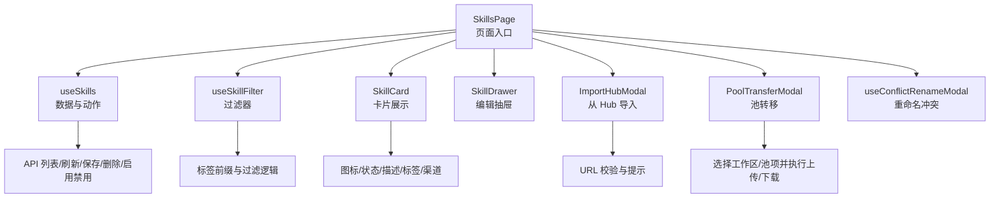
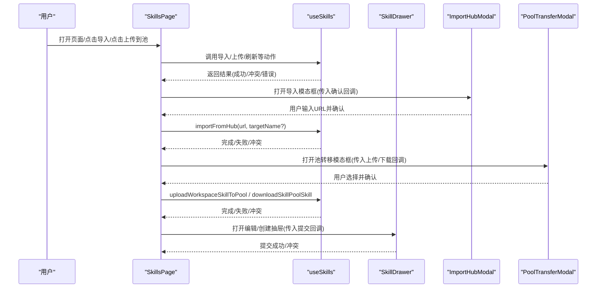
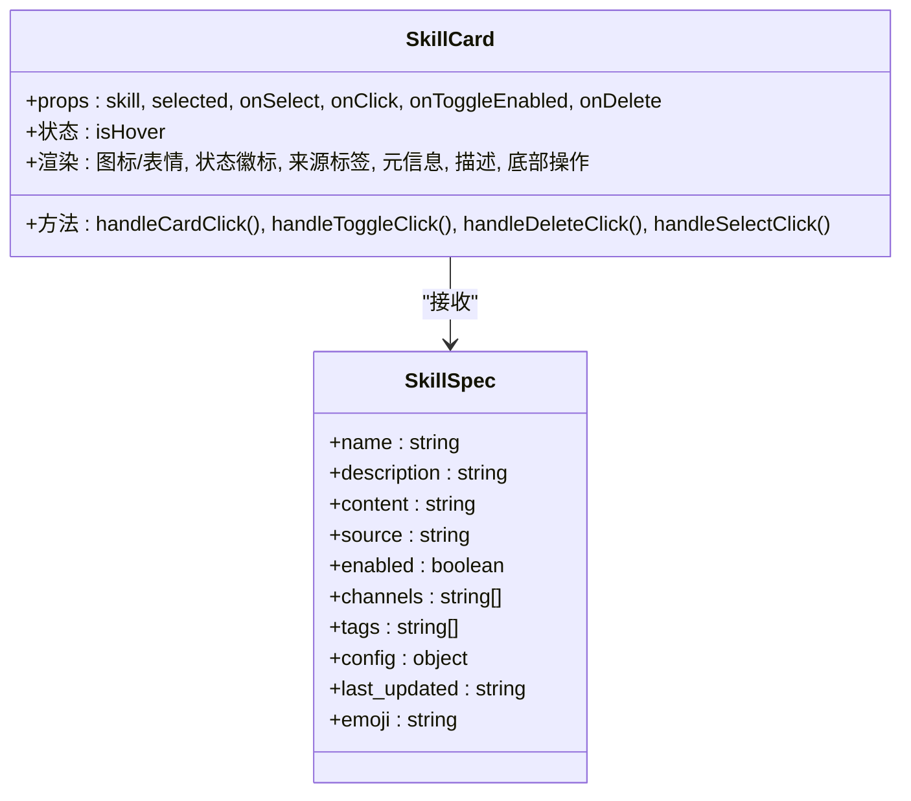
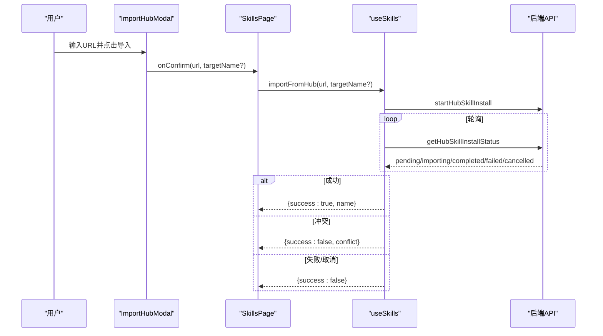
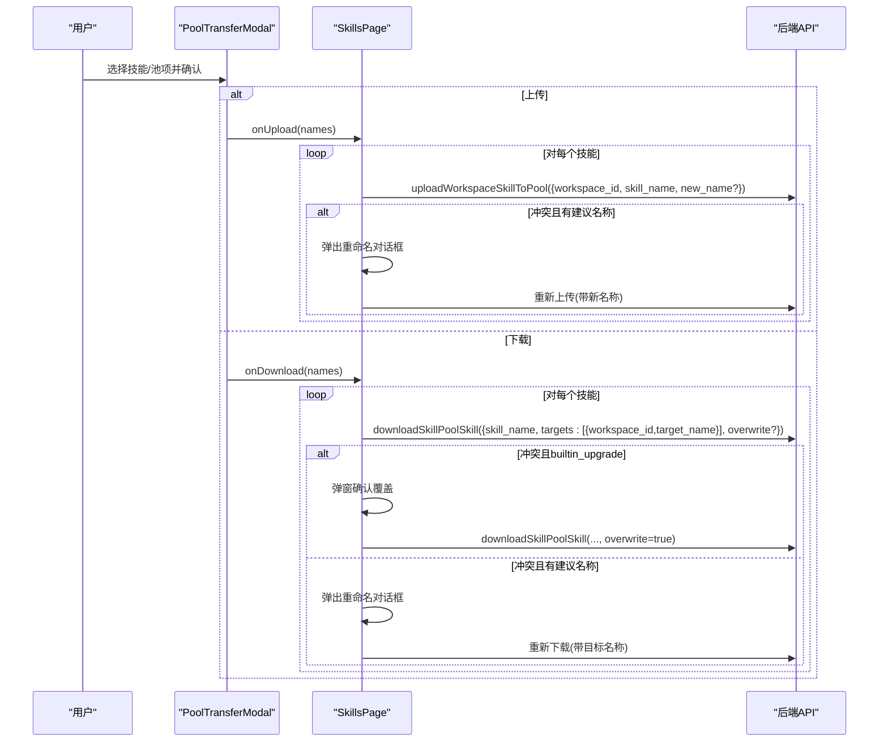
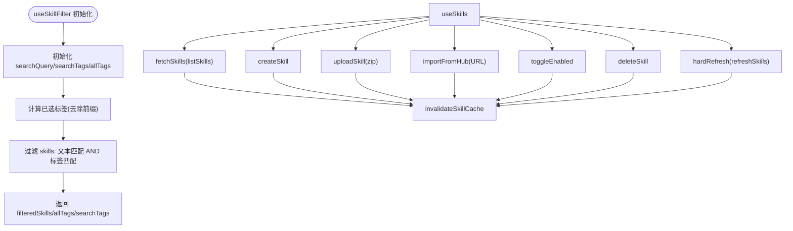
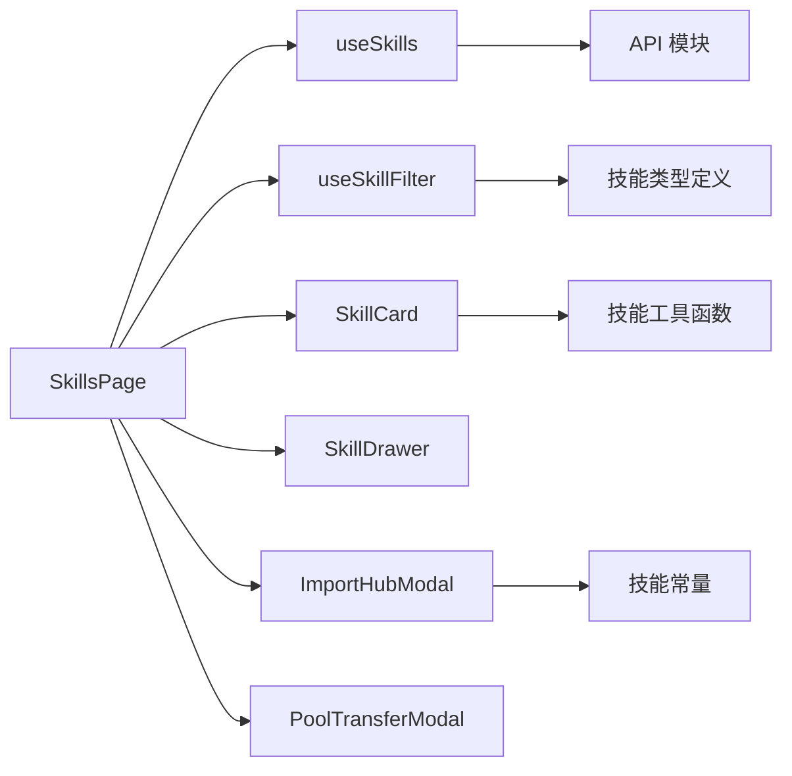

# 代理技能管理

<cite>
**本文引用的文件**
- [SkillsPage 组件](file://console/src/pages/Agent/Skills/index.tsx)
- [useSkills 自定义 Hook](file://console/src/pages/Agent/Skills/useSkills.ts)
- [useSkillFilter 自定义 Hook](file://console/src/pages/Agent/Skills/useSkillFilter.ts)
- [SkillCard 组件](file://console/src/pages/Agent/Skills/components/SkillCard.tsx)
- [ImportHubModal 组件](file://console/src/pages/Agent/Skills/components/ImportHubModal.tsx)
- [PoolTransferModal 组件](file://console/src/pages/Agent/Skills/components/PoolTransferModal.tsx)
- [SkillDrawer 抽屉](file://console/src/pages/Agent/Skills/components/SkillDrawer.tsx)
- [useConflictRenameModal 自定义 Hook](file://console/src/pages/Agent/Skills/components/useConflictRenameModal.tsx)
- [技能常量与 URL 校验](file://console/src/constants/skill.ts)
- [技能 API 类型定义](file://console/src/api/types/skill.ts)
- [技能工具函数（内置/来源判断）](file://console/src/utils/skill.ts)
- [样式模块 index.module.less](file://console/src/pages/Agent/Skills/index.module.less)
</cite>

## 目录
1. [简介](#简介)
2. [项目结构](#项目结构)
3. [核心组件](#核心组件)
4. [架构总览](#架构总览)
5. [详细组件分析](#详细组件分析)
6. [依赖关系分析](#依赖关系分析)
7. [性能考量](#性能考量)
8. [故障排查指南](#故障排查指南)
9. [结论](#结论)
10. [附录](#附录)

## 简介
本文件面向 QwenPaw 控制台“代理技能管理”页面，系统性梳理技能列表展示、技能过滤机制、导入功能、技能池转移与冲突处理等核心能力。重点解析 SkillCard 组件设计、ImportHubModal 与 PoolTransferModal 的实现逻辑、useSkills 与 useSkillFilter 的数据管理机制，并给出技能元数据管理、版本控制与批量操作的实践路径。

## 项目结构
技能管理页面位于控制台前端工程中，采用“页面 + 组件 + 自定义 Hook + 工具”的分层组织方式：
- 页面入口：SkillsPage 负责聚合状态、调用 Hook、渲染卡片与抽屉、触发导入与池转移。
- 组件层：SkillCard、SkillDrawer、ImportHubModal、PoolTransferModal、SkillFilterDropdown、useConflictRenameModal。
- 数据层：useSkills 提供 CRUD、导入、启用禁用、缓存失效；useSkillFilter 提供搜索与标签筛选。
- 常量与类型：技能来源校验、URL 前缀、技能与池技能类型定义。
- 样式：统一使用 index.module.less 进行模块化样式隔离。

图表来源
- [SkillsPage 组件:52-876](file://console/src/pages/Agent/Skills/index.tsx#L52-L876)
- [useSkills 自定义 Hook:21-323](file://console/src/pages/Agent/Skills/useSkills.ts#L21-L323)
- [useSkillFilter 自定义 Hook:10-50](file://console/src/pages/Agent/Skills/useSkillFilter.ts#L10-L50)
- [SkillCard 组件:125-289](file://console/src/pages/Agent/Skills/components/SkillCard.tsx#L125-L289)
- [ImportHubModal 组件:19-132](file://console/src/pages/Agent/Skills/components/ImportHubModal.tsx#L19-L132)
- [PoolTransferModal 组件:17-142](file://console/src/pages/Agent/Skills/components/PoolTransferModal.tsx#L17-L142)
- [useConflictRenameModal 自定义 Hook:15-84](file://console/src/pages/Agent/Skills/components/useConflictRenameModal.tsx#L15-L84)
- [技能常量与 URL 校验:3-21](file://console/src/constants/skill.ts#L3-L21)
- [技能 API 类型定义:8-85](file://console/src/api/types/skill.ts#L8-L85)

章节来源
- [SkillsPage 组件:52-876](file://console/src/pages/Agent/Skills/index.tsx#L52-L876)
- [useSkills 自定义 Hook:21-323](file://console/src/pages/Agent/Skills/useSkills.ts#L21-L323)
- [useSkillFilter 自定义 Hook:10-50](file://console/src/pages/Agent/Skills/useSkillFilter.ts#L10-L50)
- [SkillCard 组件:125-289](file://console/src/pages/Agent/Skills/components/SkillCard.tsx#L125-L289)
- [ImportHubModal 组件:19-132](file://console/src/pages/Agent/Skills/components/ImportHubModal.tsx#L19-L132)
- [PoolTransferModal 组件:17-142](file://console/src/pages/Agent/Skills/components/PoolTransferModal.tsx#L17-L142)
- [useConflictRenameModal 自定义 Hook:15-84](file://console/src/pages/Agent/Skills/components/useConflictRenameModal.tsx#L15-L84)
- [技能常量与 URL 校验:3-21](file://console/src/constants/skill.ts#L3-L21)
- [技能 API 类型定义:8-85](file://console/src/api/types/skill.ts#L8-L85)

## 核心组件
- 技能卡片 SkillCard：负责单个技能的可视化展示（图标/表情、启用状态、内置/自定义标签、渠道、更新时间、标签集合、描述），并在悬停或批量模式下显示启用/禁用与删除按钮。
- 技能抽屉 SkillDrawer：提供技能编辑/创建界面，支持内容校验（Frontmatter）、通道选择、标签输入、配置 JSON 编辑与 AI 优化流式输出。
- 导入 Hub 模态框 ImportHubModal：提供外部 Hub 技能 URL 输入与校验，支持取消导入任务。
- 池转移模态框 PoolTransferModal：在工作区技能与技能池之间进行批量选择与上传/下载。
- 冲突重命名 Hook useConflictRenameModal：在导入/上传/下载发生命名冲突时弹窗收集新名称映射。
- 过滤 Hook useSkillFilter：基于文本与标签的组合过滤，支持标签前缀区分。
- 数据 Hook useSkills：封装技能 CRUD、导入 Hub、启用/禁用、删除、缓存失效与安全扫描提示。

章节来源
- [SkillCard 组件:125-289](file://console/src/pages/Agent/Skills/components/SkillCard.tsx#L125-L289)
- [SkillDrawer 抽屉:74-380](file://console/src/pages/Agent/Skills/components/SkillDrawer.tsx#L74-L380)
- [ImportHubModal 组件:19-132](file://console/src/pages/Agent/Skills/components/ImportHubModal.tsx#L19-L132)
- [PoolTransferModal 组件:17-142](file://console/src/pages/Agent/Skills/components/PoolTransferModal.tsx#L17-L142)
- [useConflictRenameModal 自定义 Hook:15-84](file://console/src/pages/Agent/Skills/components/useConflictRenameModal.tsx#L15-L84)
- [useSkillFilter 自定义 Hook:10-50](file://console/src/pages/Agent/Skills/useSkillFilter.ts#L10-L50)
- [useSkills 自定义 Hook:21-323](file://console/src/pages/Agent/Skills/useSkills.ts#L21-L323)

## 架构总览
技能管理页面采用“页面 + 多个子组件 + 自定义 Hook + API”的分层架构。页面负责状态编排与事件调度，Hook 负责数据获取与业务动作，组件负责 UI 展示与交互，API 层负责与后端通信与缓存管理。

图表来源
- [SkillsPage 组件:52-876](file://console/src/pages/Agent/Skills/index.tsx#L52-L876)
- [useSkills 自定义 Hook:21-323](file://console/src/pages/Agent/Skills/useSkills.ts#L21-L323)
- [ImportHubModal 组件:19-132](file://console/src/pages/Agent/Skills/components/ImportHubModal.tsx#L19-L132)
- [PoolTransferModal 组件:17-142](file://console/src/pages/Agent/Skills/components/PoolTransferModal.tsx#L17-L142)
- [SkillDrawer 抽屉:74-380](file://console/src/pages/Agent/Skills/components/SkillDrawer.tsx#L74-L380)

## 详细组件分析

### SkillCard 组件设计
- 展示要素
  - 图标/表情：优先使用技能自带 emoji，否则根据文件名或扩展名推断类型图标。
  - 状态徽标：启用/禁用状态与点状指示。
  - 来源标签：内置/自定义来源标识。
  - 渠道、更新时间、标签、描述等元信息。
- 交互行为
  - 悬停或批量模式显示操作按钮（启用/禁用、删除）。
  - 单击卡片：进入编辑；批量模式下切换选中。
  - 支持内置/自定义来源识别与国际化文案。
- 性能与可访问性
  - 使用 React.memo 降低重渲染成本。
  - 鼠标进入/离开事件用于控制操作栏显隐。

图表来源
- [SkillCard 组件:125-289](file://console/src/pages/Agent/Skills/components/SkillCard.tsx#L125-L289)
- [技能 API 类型定义:8-20](file://console/src/api/types/skill.ts#L8-L20)

章节来源
- [SkillCard 组件:125-289](file://console/src/pages/Agent/Skills/components/SkillCard.tsx#L125-L289)
- [技能 API 类型定义:8-20](file://console/src/api/types/skill.ts#L8-L20)

### ImportHubModal 实现逻辑
- 功能要点
  - URL 输入与校验：仅允许受支持的 Hub 前缀。
  - 导入流程：启动安装任务 -> 轮询状态 -> 成功/失败/取消。
  - 取消导入：设置取消原因并调用取消接口。
  - 错误处理：安全扫描失败弹窗、冲突返回、超时自动取消。
- 用户体验
  - 加载态禁用交互，错误提示清晰，支持查看受支持的 URL 前缀与示例。

图表来源
- [ImportHubModal 组件:19-132](file://console/src/pages/Agent/Skills/components/ImportHubModal.tsx#L19-L132)
- [useSkills 自定义 Hook:151-240](file://console/src/pages/Agent/Skills/useSkills.ts#L151-L240)
- [技能常量与 URL 校验:3-21](file://console/src/constants/skill.ts#L3-L21)

章节来源
- [ImportHubModal 组件:19-132](file://console/src/pages/Agent/Skills/components/ImportHubModal.tsx#L19-L132)
- [useSkills 自定义 Hook:151-240](file://console/src/pages/Agent/Skills/useSkills.ts#L151-L240)
- [技能常量与 URL 校验:3-21](file://console/src/constants/skill.ts#L3-L21)

### PoolTransferModal 实现逻辑
- 功能要点
  - 上传模式：从工作区技能中选择，逐个上传至技能池，冲突时弹出重命名对话框。
  - 下载模式：从技能池中选择，逐个下载到工作区，支持覆盖策略与内置升级提示。
  - 选择与批量：清空/全选，网格卡片选择，确认后执行对应动作。
- 错误与冲突处理
  - 内置升级：当冲突原因为 builtin_upgrade 时，弹窗确认是否覆盖。
  - 建议名称：若返回建议名称，弹出重命名对话框，收集新名称映射后重试。

图表来源
- [PoolTransferModal 组件:17-142](file://console/src/pages/Agent/Skills/components/PoolTransferModal.tsx#L17-L142)
- [SkillsPage 组件:374-478](file://console/src/pages/Agent/Skills/index.tsx#L374-L478)
- [useConflictRenameModal 自定义 Hook:15-84](file://console/src/pages/Agent/Skills/components/useConflictRenameModal.tsx#L15-L84)

章节来源
- [PoolTransferModal 组件:17-142](file://console/src/pages/Agent/Skills/components/PoolTransferModal.tsx#L17-L142)
- [SkillsPage 组件:374-478](file://console/src/pages/Agent/Skills/index.tsx#L374-L478)
- [useConflictRenameModal 自定义 Hook:15-84](file://console/src/pages/Agent/Skills/components/useConflictRenameModal.tsx#L15-L84)

### useSkills 与 useSkillFilter 数据管理机制
- useSkills
  - 状态：技能列表、加载/上传/导入状态、任务 ID 与取消原因。
  - 动作：创建、上传 ZIP、导入 Hub、启用/禁用、删除、硬刷新、取消导入。
  - 缓存：每次变更后调用缓存失效，确保下次拉取最新数据。
  - 安全扫描：导入/启用后检查扫描警告，必要时弹窗提示。
- useSkillFilter
  - 状态：查询文本、标签数组、所有标签集合、已选标签（带前缀）。
  - 过滤：按名称/描述匹配文本，按标签集合匹配（标签前缀区分）。
  - 性能：使用 useMemo 避免重复计算。

图表来源
- [useSkillFilter 自定义 Hook:10-50](file://console/src/pages/Agent/Skills/useSkillFilter.ts#L10-L50)
- [useSkills 自定义 Hook:21-323](file://console/src/pages/Agent/Skills/useSkills.ts#L21-L323)

章节来源
- [useSkills 自定义 Hook:21-323](file://console/src/pages/Agent/Skills/useSkills.ts#L21-L323)
- [useSkillFilter 自定义 Hook:10-50](file://console/src/pages/Agent/Skills/useSkillFilter.ts#L10-L50)

### 技能元数据管理与版本控制
- 元数据字段
  - 名称、描述、内容、来源、启用状态、渠道、标签、配置、最后更新时间、emoji。
- 版本控制
  - 池技能包含版本文本、同步状态、最新版本文本等字段，便于内置/系统技能的同步状态展示与升级提示。
- 冲突与重命名
  - 导入/上传/下载返回冲突详情时，通过重命名对话框收集新名称映射，避免覆盖冲突。

章节来源
- [技能 API 类型定义:8-36](file://console/src/api/types/skill.ts#L8-L36)
- [useConflictRenameModal 自定义 Hook:15-84](file://console/src/pages/Agent/Skills/components/useConflictRenameModal.tsx#L15-L84)

### 批量操作实现
- 批量模式
  - 开启后卡片右上角显示复选框，支持全选/清空/批量上传到池/批量删除。
- 批量删除
  - 弹窗二次确认，列出待删技能名称，完成后统计部分失败情况并提示。
- 批量上传/下载
  - 与 PoolTransferModal 协同，逐个处理冲突与重命名。

章节来源
- [SkillsPage 组件:128-135](file://console/src/pages/Agent/Skills/index.tsx#L128-L135)
- [SkillsPage 组件:480-524](file://console/src/pages/Agent/Skills/index.tsx#L480-L524)
- [SkillsPage 组件:374-412](file://console/src/pages/Agent/Skills/index.tsx#L374-L412)
- [SkillsPage 组件:414-478](file://console/src/pages/Agent/Skills/index.tsx#L414-L478)

## 依赖关系分析
- 组件耦合
  - SkillsPage 是中枢，依赖 useSkills/useSkillFilter 与多个子组件。
  - 子组件之间低耦合，通过 props 传递回调与数据。
- 外部依赖
  - API 层负责技能 CRUD、导入 Hub、池上传/下载、启用/禁用、刷新与缓存。
  - 国际化与消息提示贯穿各环节。
- 潜在循环依赖
  - 当前结构以页面为中心向外辐射，未见循环依赖迹象。

图表来源
- [SkillsPage 组件:52-876](file://console/src/pages/Agent/Skills/index.tsx#L52-L876)
- [useSkills 自定义 Hook:21-323](file://console/src/pages/Agent/Skills/useSkills.ts#L21-L323)
- [useSkillFilter 自定义 Hook:10-50](file://console/src/pages/Agent/Skills/useSkillFilter.ts#L10-L50)
- [SkillCard 组件:125-289](file://console/src/pages/Agent/Skills/components/SkillCard.tsx#L125-L289)
- [SkillDrawer 抽屉:74-380](file://console/src/pages/Agent/Skills/components/SkillDrawer.tsx#L74-L380)
- [ImportHubModal 组件:19-132](file://console/src/pages/Agent/Skills/components/ImportHubModal.tsx#L19-L132)
- [PoolTransferModal 组件:17-142](file://console/src/pages/Agent/Skills/components/PoolTransferModal.tsx#L17-L142)
- [技能 API 类型定义:8-85](file://console/src/api/types/skill.ts#L8-L85)
- [技能工具函数（内置/来源判断）:6-12](file://console/src/utils/skill.ts#L6-L12)
- [技能常量与 URL 校验:3-21](file://console/src/constants/skill.ts#L3-L21)

章节来源
- [SkillsPage 组件:52-876](file://console/src/pages/Agent/Skills/index.tsx#L52-L876)
- [useSkills 自定义 Hook:21-323](file://console/src/pages/Agent/Skills/useSkills.ts#L21-L323)
- [useSkillFilter 自定义 Hook:10-50](file://console/src/pages/Agent/Skills/useSkillFilter.ts#L10-L50)
- [技能 API 类型定义:8-85](file://console/src/api/types/skill.ts#L8-L85)
- [技能工具函数（内置/来源判断）:6-12](file://console/src/utils/skill.ts#L6-L12)
- [技能常量与 URL 校验:3-21](file://console/src/constants/skill.ts#L3-L21)

## 性能考量
- 渲染优化
  - 使用 useMemo 对过滤结果与排序后的技能列表进行缓存，减少不必要的重渲染。
  - 使用 useProgressiveRender 实现长列表的渐进渲染，提升首屏与滚动性能。
- 状态与副作用
  - useSkills 中对导入任务使用 ref 记录任务 ID 与取消原因，避免闭包陷阱。
  - 每次写操作后调用缓存失效，确保后续读取最新数据，避免脏缓存。
- 交互反馈
  - 导入/上传/下载过程中禁用相关按钮，防止重复提交。
  - 冲突处理采用对话框逐步收集重命名映射，避免一次性大量请求。

## 故障排查指南
- 导入 Hub 失败
  - 检查 URL 是否以受支持前缀开头；确认网络可达；查看轮询状态与错误信息。
  - 若返回安全扫描失败，需根据弹窗提示处理。
- 冲突与重命名
  - 导入/上传/下载返回冲突时，使用重命名对话框为冲突项提供新名称映射。
  - 内置升级冲突需用户确认覆盖。
- 删除失败
  - 确认二次确认弹窗是否被取消；查看后端返回结果中的失败条目并重试。
- 启用/禁用异常
  - 查看消息提示与后端返回；必要时执行硬刷新以清除缓存。

章节来源
- [useSkills 自定义 Hook:151-240](file://console/src/pages/Agent/Skills/useSkills.ts#L151-L240)
- [SkillsPage 组件:215-241](file://console/src/pages/Agent/Skills/index.tsx#L215-L241)
- [SkillsPage 组件:374-412](file://console/src/pages/Agent/Skills/index.tsx#L374-L412)
- [SkillsPage 组件:414-478](file://console/src/pages/Agent/Skills/index.tsx#L414-L478)
- [useConflictRenameModal 自定义 Hook:15-84](file://console/src/pages/Agent/Skills/components/useConflictRenameModal.tsx#L15-L84)

## 结论
该技能管理页面通过清晰的分层架构与完善的冲突处理机制，实现了从技能浏览、编辑、导入到池转移的完整闭环。SkillCard 与多个子组件配合，结合 useSkills/useSkillFilter 的数据管理，既保证了良好的用户体验，也兼顾了性能与可维护性。后续可在以下方面持续优化：
- 增强导入进度与错误详情的可视化反馈；
- 优化批量操作的并发策略与错误恢复；
- 补充技能版本对比与变更记录的展示。

## 附录
- 样式模块：统一使用 index.module.less，确保组件样式隔离与主题适配。
- 国际化：页面文案与提示均通过 i18n 提供，支持多语言切换。
- 安全扫描：导入与启用后自动检查扫描结果，必要时弹窗提示。

章节来源
- [样式模块 index.module.less:1-800](file://console/src/pages/Agent/Skills/index.module.less#L1-L800)
- [SkillsPage 组件:52-876](file://console/src/pages/Agent/Skills/index.tsx#L52-L876)
- [useSkills 自定义 Hook:21-323](file://console/src/pages/Agent/Skills/useSkills.ts#L21-L323)