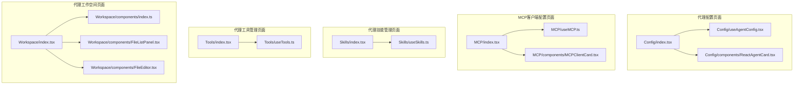
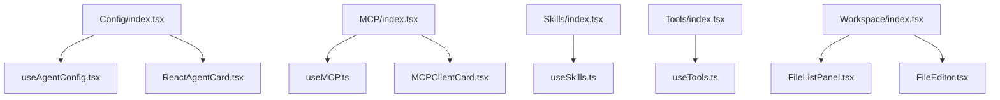
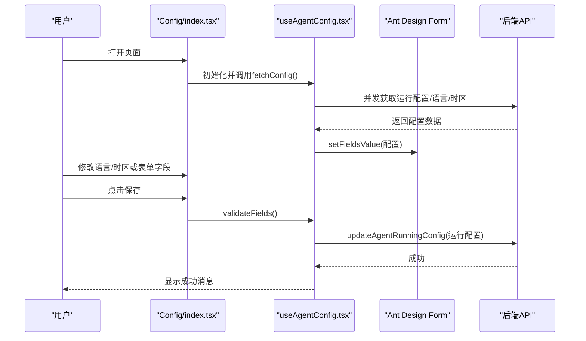
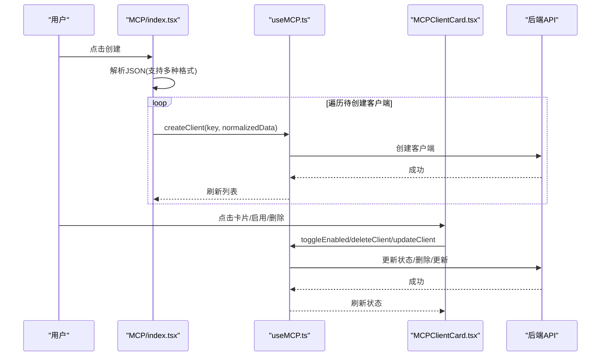
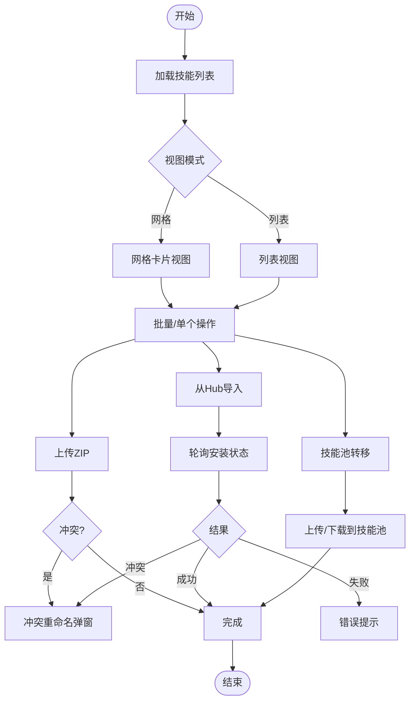
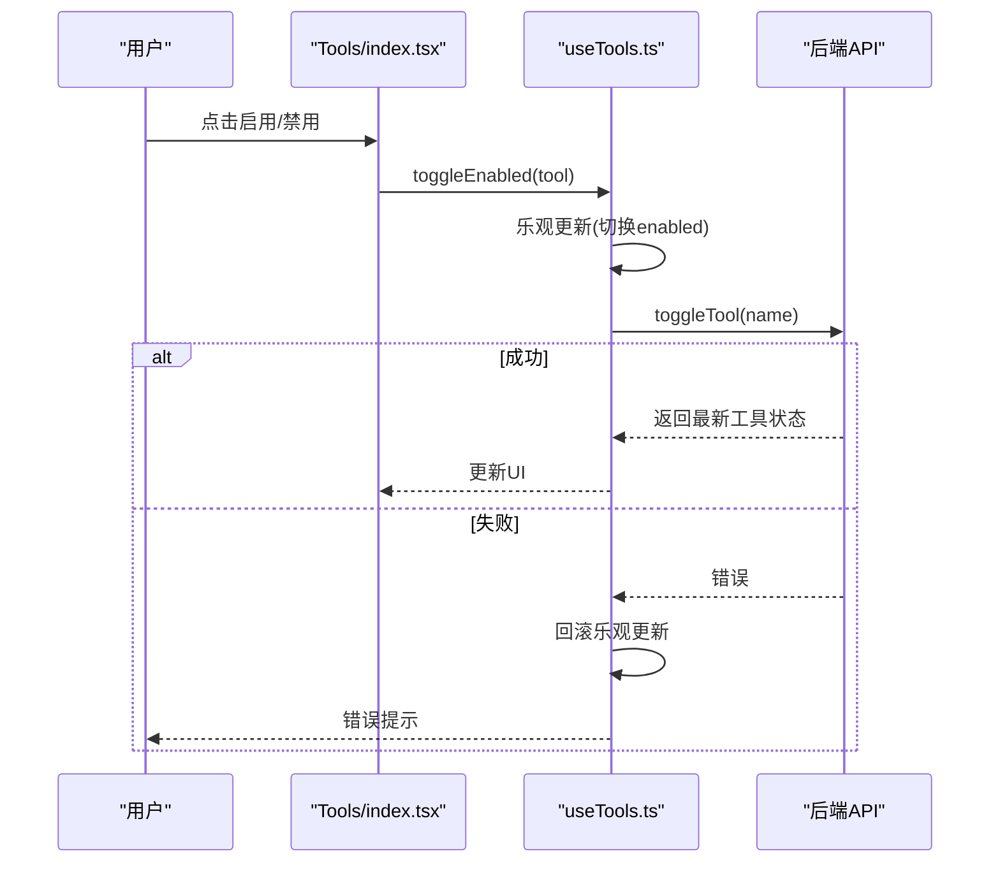
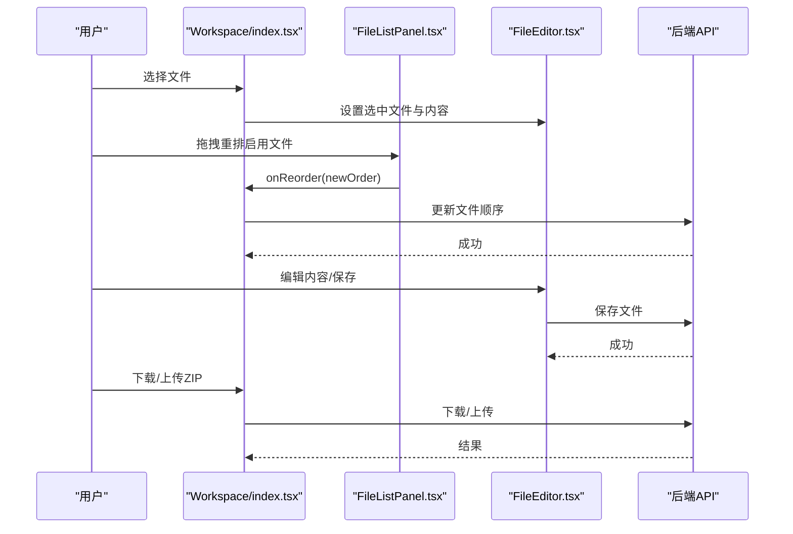
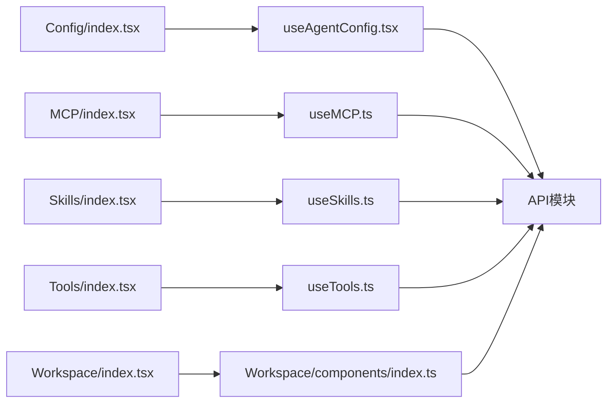

# 代理管理页面

<cite>
**本文档引用的文件**
- [console/src/pages/Agent/Config/index.tsx](file://console/src/pages/Agent/Config/index.tsx)
- [console/src/pages/Agent/Config/useAgentConfig.tsx](file://console/src/pages/Agent/Config/useAgentConfig.tsx)
- [console/src/pages/Agent/Config/components/ReactAgentCard.tsx](file://console/src/pages/Agent/Config/components/ReactAgentCard.tsx)
- [console/src/pages/Agent/MCP/index.tsx](file://console/src/pages/Agent/MCP/index.tsx)
- [console/src/pages/Agent/MCP/useMCP.ts](file://console/src/pages/Agent/MCP/useMCP.ts)
- [console/src/pages/Agent/MCP/components/MCPClientCard.tsx](file://console/src/pages/Agent/MCP/components/MCPClientCard.tsx)
- [console/src/pages/Agent/Skills/index.tsx](file://console/src/pages/Agent/Skills/index.tsx)
- [console/src/pages/Agent/Skills/useSkills.ts](file://console/src/pages/Agent/Skills/useSkills.ts)
- [console/src/pages/Agent/Tools/index.tsx](file://console/src/pages/Agent/Tools/index.tsx)
- [console/src/pages/Agent/Tools/useTools.ts](file://console/src/pages/Agent/Tools/useTools.ts)
- [console/src/pages/Agent/Workspace/index.tsx](file://console/src/pages/Agent/Workspace/index.tsx)
- [console/src/pages/Agent/Workspace/components/index.ts](file://console/src/pages/Agent/Workspace/components/index.ts)
- [console/src/pages/Agent/Workspace/components/FileListPanel.tsx](file://console/src/pages/Agent/Workspace/components/FileListPanel.tsx)
- [console/src/pages/Agent/Workspace/components/FileEditor.tsx](file://console/src/pages/Agent/Workspace/components/FileEditor.tsx)
</cite>

## 目录
1. [简介](#简介)
2. [项目结构](#项目结构)
3. [核心组件](#核心组件)
4. [架构总览](#架构总览)
5. [详细组件分析](#详细组件分析)
6. [依赖关系分析](#依赖关系分析)
7. [性能考量](#性能考量)
8. [故障排查指南](#故障排查指南)
9. [结论](#结论)

## 简介
本文件面向QwenPaw控制台中的“代理管理”相关页面，系统性梳理并解释以下页面的实现架构与技术要点：
- 代理配置页面：代理参数配置、上下文管理、嵌入配置、LLM限流与重试机制、内存管理、React代理配置等。
- MCP客户端配置页面：MCP服务器连接、客户端卡片组件与配置管理。
- 代理技能管理页面：技能列表展示、导入功能、技能池转移与冲突处理机制。
- 代理工具管理页面：工具列表、权限控制与使用统计。
- 代理工作空间页面：文件编辑器、文件列表面板与代理数据管理。

同时，提供页面组件的状态管理、数据绑定与用户交互的具体实现示例，并以可视化图示呈现关键流程。

## 项目结构
“代理管理”页面位于控制台前端目录下，采用按页面分层的组织方式：
- 页面入口：各页面在pages/Agent下以子目录划分（Config、MCP、Skills、Tools、Workspace）。
- 页面逻辑：每个页面包含一个入口组件与对应的自定义Hook（如useAgentConfig、useMCP、useSkills、useTools、useAgentsData）。
- 组件拆分：页面内进一步拆分为可复用的子组件（如MCPClientCard、ReactAgentCard、FileListPanel、FileEditor）。
- 样式与国际化：页面样式通过独立module.less组织；页面标题与文案通过i18n注入。

图表来源
- [console/src/pages/Agent/Config/index.tsx:1-106](file://console/src/pages/Agent/Config/index.tsx#L1-L106)
- [console/src/pages/Agent/Config/useAgentConfig.tsx:1-138](file://console/src/pages/Agent/Config/useAgentConfig.tsx#L1-L138)
- [console/src/pages/Agent/Config/components/ReactAgentCard.tsx:1-135](file://console/src/pages/Agent/Config/components/ReactAgentCard.tsx#L1-L135)
- [console/src/pages/Agent/MCP/index.tsx:1-245](file://console/src/pages/Agent/MCP/index.tsx#L1-L245)
- [console/src/pages/Agent/MCP/useMCP.ts:1-132](file://console/src/pages/Agent/MCP/useMCP.ts#L1-L132)
- [console/src/pages/Agent/MCP/components/MCPClientCard.tsx:1-309](file://console/src/pages/Agent/MCP/components/MCPClientCard.tsx#L1-L309)
- [console/src/pages/Agent/Skills/index.tsx:1-876](file://console/src/pages/Agent/Skills/index.tsx#L1-L876)
- [console/src/pages/Agent/Skills/useSkills.ts:1-323](file://console/src/pages/Agent/Skills/useSkills.ts#L1-L323)
- [console/src/pages/Agent/Tools/index.tsx:1-124](file://console/src/pages/Agent/Tools/index.tsx#L1-L124)
- [console/src/pages/Agent/Tools/useTools.ts:1-178](file://console/src/pages/Agent/Tools/useTools.ts#L1-L178)
- [console/src/pages/Agent/Workspace/index.tsx:1-186](file://console/src/pages/Agent/Workspace/index.tsx#L1-L186)
- [console/src/pages/Agent/Workspace/components/index.ts:1-6](file://console/src/pages/Agent/Workspace/components/index.ts#L1-L6)
- [console/src/pages/Agent/Workspace/components/FileListPanel.tsx:1-127](file://console/src/pages/Agent/Workspace/components/FileListPanel.tsx#L1-L127)
- [console/src/pages/Agent/Workspace/components/FileEditor.tsx:1-143](file://console/src/pages/Agent/Workspace/components/FileEditor.tsx#L1-L143)

章节来源
- [console/src/pages/Agent/Config/index.tsx:1-106](file://console/src/pages/Agent/Config/index.tsx#L1-L106)
- [console/src/pages/Agent/MCP/index.tsx:1-245](file://console/src/pages/Agent/MCP/index.tsx#L1-L245)
- [console/src/pages/Agent/Skills/index.tsx:1-876](file://console/src/pages/Agent/Skills/index.tsx#L1-L876)
- [console/src/pages/Agent/Tools/index.tsx:1-124](file://console/src/pages/Agent/Tools/index.tsx#L1-L124)
- [console/src/pages/Agent/Workspace/index.tsx:1-186](file://console/src/pages/Agent/Workspace/index.tsx#L1-L186)

## 核心组件
- 代理配置页面
  - 入口组件负责聚合表单与多个配置卡片，统一状态管理与保存流程。
  - 自定义Hook封装加载、校验、保存与语言/时区变更逻辑。
- MCP客户端配置页面
  - 入口组件支持多客户端批量导入与创建，提供标准化JSON导入格式解析。
  - 自定义Hook封装客户端生命周期操作（创建、更新、启用/禁用、删除）。
- 代理技能管理页面
  - 入口组件提供技能列表、筛选、批量操作、上传/导入、技能池转移与冲突处理。
  - 自定义Hook封装技能增删改查、扫描与导入任务轮询。
- 代理工具管理页面
  - 入口组件提供工具列表、启用/禁用、异步执行开关与全量批量控制。
  - 自定义Hook封装乐观更新与错误回滚策略。
- 代理工作空间页面
  - 入口组件整合文件列表面板与文件编辑器，支持拖拽排序、预览切换与内容复制。
  - 子组件职责清晰：文件列表面板负责文件项渲染与拖拽重排；文件编辑器负责内容编辑与保存。

章节来源
- [console/src/pages/Agent/Config/index.tsx:16-103](file://console/src/pages/Agent/Config/index.tsx#L16-L103)
- [console/src/pages/Agent/Config/useAgentConfig.tsx:8-137](file://console/src/pages/Agent/Config/useAgentConfig.tsx#L8-L137)
- [console/src/pages/Agent/MCP/index.tsx:55-242](file://console/src/pages/Agent/MCP/index.tsx#L55-L242)
- [console/src/pages/Agent/MCP/useMCP.ts:8-131](file://console/src/pages/Agent/MCP/useMCP.ts#L8-L131)
- [console/src/pages/Agent/Skills/index.tsx:52-800](file://console/src/pages/Agent/Skills/index.tsx#L52-L800)
- [console/src/pages/Agent/Skills/useSkills.ts:21-322](file://console/src/pages/Agent/Skills/useSkills.ts#L21-L322)
- [console/src/pages/Agent/Tools/index.tsx:15-123](file://console/src/pages/Agent/Tools/index.tsx#L15-L123)
- [console/src/pages/Agent/Tools/useTools.ts:8-177](file://console/src/pages/Agent/Tools/useTools.ts#L8-L177)
- [console/src/pages/Agent/Workspace/index.tsx:11-185](file://console/src/pages/Agent/Workspace/index.tsx#L11-L185)
- [console/src/pages/Agent/Workspace/components/FileListPanel.tsx:36-126](file://console/src/pages/Agent/Workspace/components/FileListPanel.tsx#L36-L126)
- [console/src/pages/Agent/Workspace/components/FileEditor.tsx:21-142](file://console/src/pages/Agent/Workspace/components/FileEditor.tsx#L21-L142)

## 架构总览
整体采用“页面组件 + 自定义Hook + 可复用子组件”的分层架构：
- 页面组件负责布局、交互与状态聚合。
- 自定义Hook封装业务逻辑与副作用（请求、缓存失效、轮询、乐观更新）。
- 子组件聚焦UI与事件回调，保持高内聚低耦合。

图表来源
- [console/src/pages/Agent/Config/index.tsx:1-106](file://console/src/pages/Agent/Config/index.tsx#L1-L106)
- [console/src/pages/Agent/Config/useAgentConfig.tsx:1-138](file://console/src/pages/Agent/Config/useAgentConfig.tsx#L1-L138)
- [console/src/pages/Agent/Config/components/ReactAgentCard.tsx:1-135](file://console/src/pages/Agent/Config/components/ReactAgentCard.tsx#L1-L135)
- [console/src/pages/Agent/MCP/index.tsx:1-245](file://console/src/pages/Agent/MCP/index.tsx#L1-L245)
- [console/src/pages/Agent/MCP/useMCP.ts:1-132](file://console/src/pages/Agent/MCP/useMCP.ts#L1-L132)
- [console/src/pages/Agent/MCP/components/MCPClientCard.tsx:1-309](file://console/src/pages/Agent/MCP/components/MCPClientCard.tsx#L1-L309)
- [console/src/pages/Agent/Skills/index.tsx:1-876](file://console/src/pages/Agent/Skills/index.tsx#L1-L876)
- [console/src/pages/Agent/Skills/useSkills.ts:1-323](file://console/src/pages/Agent/Skills/useSkills.ts#L1-L323)
- [console/src/pages/Agent/Tools/index.tsx:1-124](file://console/src/pages/Agent/Tools/index.tsx#L1-L124)
- [console/src/pages/Agent/Tools/useTools.ts:1-178](file://console/src/pages/Agent/Tools/useTools.ts#L1-L178)
- [console/src/pages/Agent/Workspace/index.tsx:1-186](file://console/src/pages/Agent/Workspace/index.tsx#L1-L186)
- [console/src/pages/Agent/Workspace/components/FileListPanel.tsx:1-127](file://console/src/pages/Agent/Workspace/components/FileListPanel.tsx#L1-L127)
- [console/src/pages/Agent/Workspace/components/FileEditor.tsx:1-143](file://console/src/pages/Agent/Workspace/components/FileEditor.tsx#L1-L143)

## 详细组件分析

### 代理配置页面
- 功能要点
  - 聚合React代理参数（语言、时区、最大迭代次数、上下文长度）、内存管理后端选择、嵌入配置等卡片。
  - 表单校验与保存，语言与时区变更采用二次确认与消息提示。
  - 加载失败时提供重试按钮。
- 关键实现
  - useAgentConfig：并发拉取运行配置、语言与用户时区，统一表单初始化；保存时进行字段校验并调用更新接口；语言变更触发复制文件提示。
  - ReactAgentCard：提供语言/时区选择、最大迭代次数与上下文长度输入，以及内存管理后端选择与提示。
- 数据绑定与状态
  - 页面组件通过Form实例绑定字段值；useAgentConfig内部维护loading/saving/error/language/timezone等状态。
- 用户交互
  - 顶部页头导航；底部操作区包含重置与保存按钮；语言/时区变更弹窗确认。

图表来源
- [console/src/pages/Agent/Config/index.tsx:16-103](file://console/src/pages/Agent/Config/index.tsx#L16-L103)
- [console/src/pages/Agent/Config/useAgentConfig.tsx:20-59](file://console/src/pages/Agent/Config/useAgentConfig.tsx#L20-L59)
- [console/src/pages/Agent/Config/components/ReactAgentCard.tsx:25-134](file://console/src/pages/Agent/Config/components/ReactAgentCard.tsx#L25-L134)

章节来源
- [console/src/pages/Agent/Config/index.tsx:16-103](file://console/src/pages/Agent/Config/index.tsx#L16-L103)
- [console/src/pages/Agent/Config/useAgentConfig.tsx:8-137](file://console/src/pages/Agent/Config/useAgentConfig.tsx#L8-L137)
- [console/src/pages/Agent/Config/components/ReactAgentCard.tsx:16-134](file://console/src/pages/Agent/Config/components/ReactAgentCard.tsx#L16-L134)

### MCP客户端配置页面
- 功能要点
  - 支持三种JSON导入格式：标准格式、直接格式、单个客户端格式；自动归一化传输类型（stdio/streamable_http/sse）。
  - 客户端卡片展示名称、描述、启用状态、类型（本地/远程），并提供查看工具清单、启用/禁用、删除与JSON编辑能力。
- 关键实现
  - useMCP：封装客户端列表加载、创建、更新、启用/禁用、删除；监听选中代理变化以刷新列表。
  - MCPClientCard：卡片点击进入JSON编辑模式（支持编辑与保存），远程客户端禁用工具查看；工具列表加载失败时区分“未就绪/连接中”与一般错误。
  - MCPPage：导入弹窗支持多种JSON格式解析与批量创建；提供空态与加载态处理。
- 数据绑定与状态
  - 页面组件维护创建模态框状态与JSON输入；useMCP维护客户端列表与加载状态。
- 用户交互
  - 创建/更新/删除均采用二次确认与消息提示；工具列表支持展开查看输入schema。

图表来源
- [console/src/pages/Agent/MCP/index.tsx:55-242](file://console/src/pages/Agent/MCP/index.tsx#L55-L242)
- [console/src/pages/Agent/MCP/useMCP.ts:15-121](file://console/src/pages/Agent/MCP/useMCP.ts#L15-L121)
- [console/src/pages/Agent/MCP/components/MCPClientCard.tsx:43-308](file://console/src/pages/Agent/MCP/components/MCPClientCard.tsx#L43-L308)

章节来源
- [console/src/pages/Agent/MCP/index.tsx:13-242](file://console/src/pages/Agent/MCP/index.tsx#L13-L242)
- [console/src/pages/Agent/MCP/useMCP.ts:8-131](file://console/src/pages/Agent/MCP/useMCP.ts#L8-L131)
- [console/src/pages/Agent/MCP/components/MCPClientCard.tsx:36-308](file://console/src/pages/Agent/MCP/components/MCPClientCard.tsx#L36-L308)

### 代理技能管理页面
- 功能要点
  - 技能列表支持网格/列表视图、标签筛选、搜索、批量选择与批量删除；支持上传ZIP、从Hub导入、创建/编辑技能。
  - 技能池转移：从工作区上传到技能池、从技能池下载到工作区；内置冲突处理与重命名建议。
- 关键实现
  - useSkills：封装技能列表加载、创建、上传、导入Hub（含轮询与超时控制）、启用/禁用、删除；提供缓存失效与安全扫描提示。
  - Skills/index.tsx：提供工具栏、视图切换、进度渲染、冲突重命名弹窗、导入Hub弹窗与批量操作。
- 数据绑定与状态
  - 页面组件维护选中集合、批量模式、视图模式、过滤条件；useSkills维护加载、上传/导入中、技能列表与任务状态。
- 用户交互
  - 上传ZIP前进行格式与大小校验；导入Hub支持取消与超时；冲突场景引导用户选择重命名方案。

图表来源
- [console/src/pages/Agent/Skills/index.tsx:52-800](file://console/src/pages/Agent/Skills/index.tsx#L52-L800)
- [console/src/pages/Agent/Skills/useSkills.ts:55-322](file://console/src/pages/Agent/Skills/useSkills.ts#L55-L322)

章节来源
- [console/src/pages/Agent/Skills/index.tsx:52-800](file://console/src/pages/Agent/Skills/index.tsx#L52-L800)
- [console/src/pages/Agent/Skills/useSkills.ts:21-322](file://console/src/pages/Agent/Skills/useSkills.ts#L21-L322)

### 代理工具管理页面
- 功能要点
  - 工具列表展示工具图标、名称、描述与启用状态；支持启用/禁用、异步执行开关（部分工具）与全量批量控制。
- 关键实现
  - useTools：封装工具列表加载、启用/禁用、异步执行开关；采用乐观更新策略并在错误时回滚；提供全量启用/禁用。
- 数据绑定与状态
  - 页面组件维护工具列表与批量加载状态；useTools维护加载、批量加载与工具数组。
- 用户交互
  - 启用/禁用与异步执行切换均采用乐观更新，失败时自动回滚；全量操作提供状态反馈。

图表来源
- [console/src/pages/Agent/Tools/index.tsx:15-123](file://console/src/pages/Agent/Tools/index.tsx#L15-L123)
- [console/src/pages/Agent/Tools/useTools.ts:33-102](file://console/src/pages/Agent/Tools/useTools.ts#L33-L102)

章节来源
- [console/src/pages/Agent/Tools/index.tsx:15-123](file://console/src/pages/Agent/Tools/index.tsx#L15-L123)
- [console/src/pages/Agent/Tools/useTools.ts:8-177](file://console/src/pages/Agent/Tools/useTools.ts#L8-L177)

### 代理工作空间页面
- 功能要点
  - 文件列表面板：核心文件列表、每日记忆、启用/禁用开关、拖拽重排；支持刷新。
  - 文件编辑器：支持Markdown预览/编辑、复制内容、保存/重置。
  - 工作区打包下载与ZIP上传（大小限制与格式校验）。
- 关键实现
  - Workspace/index.tsx：组合文件列表面板与文件编辑器，处理下载/上传与消息提示。
  - FileListPanel：基于@drag-and-drop库实现拖拽排序，根据启用文件列表计算新顺序并调用onReorder。
  - FileEditor：根据文件扩展名决定是否显示Markdown预览；提供复制到剪贴板能力。
- 数据绑定与状态
  - 页面组件维护文件列表、选中文件、每日记忆、启用文件列表、工作区路径、变更状态与内容。
- 用户交互
  - 拖拽排序即时生效；Markdown文件支持预览切换与一键复制；上传ZIP支持重复上传同一文件。

图表来源
- [console/src/pages/Agent/Workspace/index.tsx:11-185](file://console/src/pages/Agent/Workspace/index.tsx#L11-L185)
- [console/src/pages/Agent/Workspace/components/FileListPanel.tsx:58-68](file://console/src/pages/Agent/Workspace/components/FileListPanel.tsx#L58-L68)
- [console/src/pages/Agent/Workspace/components/FileEditor.tsx:40-62](file://console/src/pages/Agent/Workspace/components/FileEditor.tsx#L40-L62)

章节来源
- [console/src/pages/Agent/Workspace/index.tsx:11-185](file://console/src/pages/Agent/Workspace/index.tsx#L11-L185)
- [console/src/pages/Agent/Workspace/components/FileListPanel.tsx:22-126](file://console/src/pages/Agent/Workspace/components/FileListPanel.tsx#L22-L126)
- [console/src/pages/Agent/Workspace/components/FileEditor.tsx:11-142](file://console/src/pages/Agent/Workspace/components/FileEditor.tsx#L11-L142)

## 依赖关系分析
- 页面到Hook
  - Config/MCP/Skills/Tools/Workspace各自拥有独立的自定义Hook，封装网络请求与状态管理。
- Hook到API
  - 各Hook通过统一的API模块发起请求，集中处理错误与消息提示。
- 组件到Hook
  - 页面组件仅负责事件绑定与状态传递，具体业务逻辑由Hook承担，降低页面复杂度。
- 组件到组件
  - MCP客户端卡片与工作空间文件编辑器均为纯函数组件，通过props接收回调，避免跨组件共享状态。

图表来源
- [console/src/pages/Agent/Config/index.tsx:1-106](file://console/src/pages/Agent/Config/index.tsx#L1-L106)
- [console/src/pages/Agent/MCP/index.tsx:1-245](file://console/src/pages/Agent/MCP/index.tsx#L1-L245)
- [console/src/pages/Agent/Skills/index.tsx:1-876](file://console/src/pages/Agent/Skills/index.tsx#L1-L876)
- [console/src/pages/Agent/Tools/index.tsx:1-124](file://console/src/pages/Agent/Tools/index.tsx#L1-L124)
- [console/src/pages/Agent/Workspace/index.tsx:1-186](file://console/src/pages/Agent/Workspace/index.tsx#L1-L186)

章节来源
- [console/src/pages/Agent/Config/index.tsx:1-106](file://console/src/pages/Agent/Config/index.tsx#L1-L106)
- [console/src/pages/Agent/MCP/index.tsx:1-245](file://console/src/pages/Agent/MCP/index.tsx#L1-L245)
- [console/src/pages/Agent/Skills/index.tsx:1-876](file://console/src/pages/Agent/Skills/index.tsx#L1-L876)
- [console/src/pages/Agent/Tools/index.tsx:1-124](file://console/src/pages/Agent/Tools/index.tsx#L1-L124)
- [console/src/pages/Agent/Workspace/index.tsx:1-186](file://console/src/pages/Agent/Workspace/index.tsx#L1-L186)

## 性能考量
- 渲染优化
  - 技能页面采用渐进渲染（progressive render）减少长列表首屏压力。
  - MCP客户端卡片使用React.memo以避免不必要的重渲染。
- 网络优化
  - 代理配置页面并发拉取运行配置、语言与时区，减少多次请求。
  - 技能导入采用轮询+超时控制，避免长时间阻塞UI。
- 交互体验
  - 工具管理采用乐观更新策略，提升响应速度；失败时自动回滚。
  - 工作区文件列表支持拖拽排序，结合启用文件列表计算新顺序，避免全量刷新。

## 故障排查指南
- 代理配置
  - 加载失败：检查网络与后端服务；点击重试按钮重新加载。
  - 语言变更：若出现复制文件提示，确认目标语言资源已准备完毕。
- MCP客户端
  - 导入失败：核对JSON格式是否符合支持的三种格式之一；检查命令/URL/传输类型是否正确。
  - 工具列表为空：确认客户端已启用且处于可用状态；若提示“未就绪/连接中”，等待服务启动后再试。
- 技能管理
  - 上传ZIP失败：检查文件格式是否为ZIP、大小是否超过限制；冲突时根据弹窗提示进行重命名。
  - 从Hub导入超时：导入任务存在最长超时时间，超时会自动取消；可重试或更换源地址。
- 工具管理
  - 启用/禁用失败：检查网络与权限；页面会自动回滚乐观更新并提示错误。
- 工作空间
  - 下载/上传失败：检查文件格式与大小限制；确保浏览器允许下载/上传操作。

章节来源
- [console/src/pages/Agent/Config/useAgentConfig.tsx:20-59](file://console/src/pages/Agent/Config/useAgentConfig.tsx#L20-L59)
- [console/src/pages/Agent/MCP/index.tsx:91-161](file://console/src/pages/Agent/MCP/index.tsx#L91-L161)
- [console/src/pages/Agent/MCP/components/MCPClientCard.tsx:104-126](file://console/src/pages/Agent/MCP/components/MCPClientCard.tsx#L104-L126)
- [console/src/pages/Agent/Skills/index.tsx:155-197](file://console/src/pages/Agent/Skills/index.tsx#L155-L197)
- [console/src/pages/Agent/Skills/useSkills.ts:151-240](file://console/src/pages/Agent/Skills/useSkills.ts#L151-L240)
- [console/src/pages/Agent/Tools/useTools.ts:33-102](file://console/src/pages/Agent/Tools/useTools.ts#L33-L102)
- [console/src/pages/Agent/Workspace/index.tsx:36-104](file://console/src/pages/Agent/Workspace/index.tsx#L36-L104)

## 结论
本文档系统梳理了QwenPaw控制台“代理管理”相关页面的实现架构与关键技术点，覆盖代理配置、MCP客户端、技能管理、工具管理与工作空间五大模块。通过页面组件、自定义Hook与可复用子组件的分层设计，实现了清晰的职责分离与良好的用户体验。建议在后续迭代中持续关注：
- 进一步完善错误恢复与重试策略；
- 增强导入/导出流程的可视化反馈；
- 优化大列表场景下的渲染性能与内存占用。