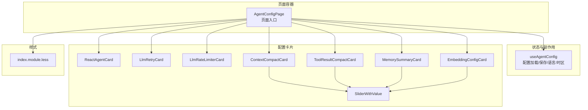
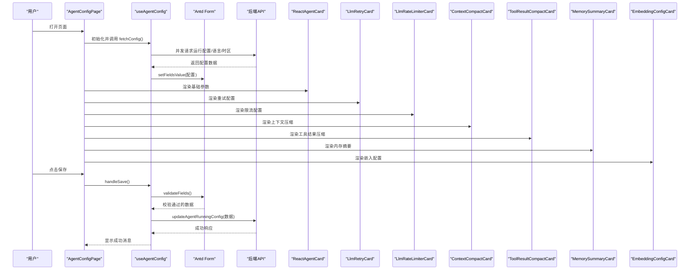
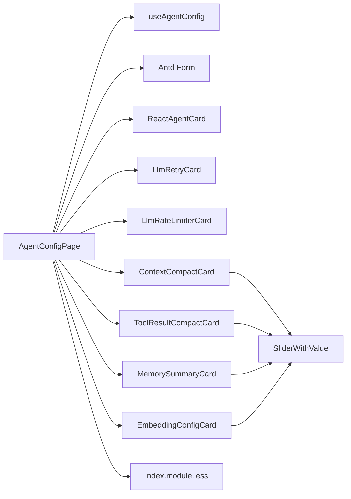

# 代理配置组件

<cite>
**本文引用的文件**
- [ReactAgentCard.tsx](file://console/src/pages/Agent/Config/components/ReactAgentCard.tsx)
- [LlmRetryCard.tsx](file://console/src/pages/Agent/Config/components/LlmRetryCard.tsx)
- [LlmRateLimiterCard.tsx](file://console/src/pages/Agent/Config/components/LlmRateLimiterCard.tsx)
- [ContextCompactCard.tsx](file://console/src/pages/Agent/Config/components/ContextCompactCard.tsx)
- [ToolResultCompactCard.tsx](file://console/src/pages/Agent/Config/components/ToolResultCompactCard.tsx)
- [MemorySummaryCard.tsx](file://console/src/pages/Agent/Config/components/MemorySummaryCard.tsx)
- [EmbeddingConfigCard.tsx](file://console/src/pages/Agent/Config/components/EmbeddingConfigCard.tsx)
- [SliderWithValue.tsx](file://console/src/pages/Agent/Config/components/SliderWithValue.tsx)
- [AgentConfigPage.tsx](file://console/src/pages/Agent/Config/index.tsx)
- [useAgentConfig.tsx](file://console/src/pages/Agent/Config/useAgentConfig.tsx)
- [index.module.less](file://console/src/pages/Agent/Config/index.module.less)
- [agents.ts](file://console/src/api/types/agents.ts)
</cite>

## 目录
1. [简介](#简介)
2. [项目结构](#项目结构)
3. [核心组件](#核心组件)
4. [架构总览](#架构总览)
5. [组件详细分析](#组件详细分析)
6. [依赖关系分析](#依赖关系分析)
7. [性能考量](#性能考量)
8. [故障排查指南](#故障排查指南)
9. [结论](#结论)
10. [附录](#附录)

## 简介
本技术文档聚焦于 QwenPaw 控制台中“代理配置”页面的配置卡片组件体系，涵盖以下组件：ReactAgentCard（代理参数配置）、LlmRetryCard（LLM 重试机制）、LlmRateLimiterCard（LLM 限流配置）、ContextCompactCard（上下文管理）、ToolResultCompactCard（工具结果管理）、MemorySummaryCard（内存摘要）与 EmbeddingConfigCard（嵌入配置）。文档从架构设计、状态管理、表单验证、数据绑定、用户交互到组件间通信与错误处理进行系统化阐述，并提供可视化图示帮助理解。

## 项目结构
“代理配置”页面采用分层组织：页面容器负责加载与保存配置，useAgentHook 负责状态与副作用，各配置卡片作为独立 UI 组件组合在表单中。样式通过模块化 CSS 实现响应式布局与主题适配。

图表来源
- [AgentConfigPage.tsx:16-103](file://console/src/pages/Agent/Config/index.tsx#L16-L103)
- [useAgentConfig.tsx:8-137](file://console/src/pages/Agent/Config/useAgentConfig.tsx#L8-L137)
- [ReactAgentCard.tsx:25-134](file://console/src/pages/Agent/Config/components/ReactAgentCard.tsx#L25-L134)
- [LlmRetryCard.tsx:9-121](file://console/src/pages/Agent/Config/components/LlmRetryCard.tsx#L9-L121)
- [LlmRateLimiterCard.tsx:9-153](file://console/src/pages/Agent/Config/components/LlmRateLimiterCard.tsx#L9-L153)
- [ContextCompactCard.tsx:10-145](file://console/src/pages/Agent/Config/components/ContextCompactCard.tsx#L10-L145)
- [ToolResultCompactCard.tsx:6-123](file://console/src/pages/Agent/Config/components/ToolResultCompactCard.tsx#L6-L123)
- [MemorySummaryCard.tsx:6-75](file://console/src/pages/Agent/Config/components/MemorySummaryCard.tsx#L6-L75)
- [EmbeddingConfigCard.tsx:12-151](file://console/src/pages/Agent/Config/components/EmbeddingConfigCard.tsx#L12-L151)
- [SliderWithValue.tsx:13-45](file://console/src/pages/Agent/Config/components/SliderWithValue.tsx#L13-L45)
- [index.module.less:1-200](file://console/src/pages/Agent/Config/index.module.less#L1-L200)

章节来源
- [AgentConfigPage.tsx:16-103](file://console/src/pages/Agent/Config/index.tsx#L16-L103)
- [useAgentConfig.tsx:8-137](file://console/src/pages/Agent/Config/useAgentConfig.tsx#L8-L137)
- [index.module.less:1-200](file://console/src/pages/Agent/Config/index.module.less#L1-L200)

## 核心组件
本节概述各配置卡片的核心职责与关键实现点：
- ReactAgentCard：负责语言、时区、最大迭代次数、记忆后端、上下文长度等基础运行参数的配置与校验。
- LlmRetryCard：控制 LLM 重试开关及重试次数、退避基数与上限等参数，支持动态禁用与字段间依赖校验。
- LlmRateLimiterCard：配置并发数、QPM、限流暂停/抖动、获取超时等参数，包含跨字段校验。
- ContextCompactCard：基于最大输入长度与滑块比例计算阈值，支持思考块压缩开关。
- ToolResultCompactCard：控制工具结果压缩策略，包括最近条数、旧阈值、近期阈值与保留天数。
- MemorySummaryCard：控制内存摘要开关、强制搜索、最大结果数、最小分数与启动重建索引。
- EmbeddingConfigCard：配置嵌入服务地址、模型名、密钥、维度、缓存与批处理等参数，支持联动启用/禁用。

章节来源
- [ReactAgentCard.tsx:25-134](file://console/src/pages/Agent/Config/components/ReactAgentCard.tsx#L25-L134)
- [LlmRetryCard.tsx:9-121](file://console/src/pages/Agent/Config/components/LlmRetryCard.tsx#L9-L121)
- [LlmRateLimiterCard.tsx:9-153](file://console/src/pages/Agent/Config/components/LlmRateLimiterCard.tsx#L9-L153)
- [ContextCompactCard.tsx:10-145](file://console/src/pages/Agent/Config/components/ContextCompactCard.tsx#L10-L145)
- [ToolResultCompactCard.tsx:6-123](file://console/src/pages/Agent/Config/components/ToolResultCompactCard.tsx#L6-L123)
- [MemorySummaryCard.tsx:6-75](file://console/src/pages/Agent/Config/components/MemorySummaryCard.tsx#L6-L75)
- [EmbeddingConfigCard.tsx:12-151](file://console/src/pages/Agent/Config/components/EmbeddingConfigCard.tsx#L12-L151)

## 架构总览
页面容器负责初始化表单、加载运行时配置、处理保存与错误提示；useAgentHook 提供统一的状态与副作用逻辑；各卡片组件通过 Ant Design 表单项与受控/非受控控件完成数据绑定与校验；样式模块化确保布局与主题一致性。

图表来源
- [AgentConfigPage.tsx:16-103](file://console/src/pages/Agent/Config/index.tsx#L16-L103)
- [useAgentConfig.tsx:20-59](file://console/src/pages/Agent/Config/useAgentConfig.tsx#L20-L59)
- [ReactAgentCard.tsx:25-134](file://console/src/pages/Agent/Config/components/ReactAgentCard.tsx#L25-L134)
- [LlmRetryCard.tsx:9-121](file://console/src/pages/Agent/Config/components/LlmRetryCard.tsx#L9-L121)
- [LlmRateLimiterCard.tsx:9-153](file://console/src/pages/Agent/Config/components/LlmRateLimiterCard.tsx#L9-L153)
- [ContextCompactCard.tsx:10-145](file://console/src/pages/Agent/Config/components/ContextCompactCard.tsx#L10-L145)
- [ToolResultCompactCard.tsx:6-123](file://console/src/pages/Agent/Config/components/ToolResultCompactCard.tsx#L6-L123)
- [MemorySummaryCard.tsx:6-75](file://console/src/pages/Agent/Config/components/MemorySummaryCard.tsx#L6-L75)
- [EmbeddingConfigCard.tsx:12-151](file://console/src/pages/Agent/Config/components/EmbeddingConfigCard.tsx#L12-L151)

## 组件详细分析

### ReactAgentCard（代理参数配置）
- 设计要点
  - 使用三列栅格布局展示语言、时区与最大迭代次数。
  - 记忆管理后端选项固定为单一后端，同时给出重启提示。
  - 上下文最大长度支持步进与最小阈值限制。
- 状态与数据绑定
  - 语言与时区通过外部传入的回调与状态更新，支持加载/禁用态。
  - 表单字段使用受控组件，规则包含必填与数值范围校验。
- 用户交互
  - 语言切换触发二次确认弹窗，保存成功后可提示复制文件数量。
- 错误处理
  - 页面级错误显示与重试按钮，避免阻塞用户操作。

章节来源
- [ReactAgentCard.tsx:25-134](file://console/src/pages/Agent/Config/components/ReactAgentCard.tsx#L25-L134)
- [AgentConfigPage.tsx:65-72](file://console/src/pages/Agent/Config/index.tsx#L65-L72)
- [useAgentConfig.tsx:61-121](file://console/src/pages/Agent/Config/useAgentConfig.tsx#L61-L121)

### LlmRetryCard（LLM 重试机制）
- 设计要点
  - 开关控制是否启用重试；启用后允许设置重试次数、退避基数与退避上限。
  - 退避上限必须不小于退避基数，通过自定义校验器实现。
- 状态与数据绑定
  - 通过 Form.useWatch 获取重试开关状态，动态禁用相关输入。
  - 字段依赖链：上限字段依赖基数字段，触发联动校验。
- 用户交互
  - 开关切换即时影响输入可用性，提升可操作性。
- 错误处理
  - 自定义校验失败时抛出错误，由表单框架统一展示。

章节来源
- [LlmRetryCard.tsx:9-121](file://console/src/pages/Agent/Config/components/LlmRetryCard.tsx#L9-L121)
- [AgentConfigPage.tsx:74-74](file://console/src/pages/Agent/Config/index.tsx#L74-L74)

### LlmRateLimiterCard（LLM 限流配置）
- 设计要点
  - 配置并发数、QPM、限流暂停时间、抖动与获取超时。
  - 获取超时必须大于暂停与抖动之和，通过自定义校验器实现。
- 状态与数据绑定
  - 通过 Form.useWatch 获取暂停与抖动值，实现跨字段校验。
- 用户交互
  - 数字输入框支持步进与最小阈值，保证合理范围。
- 错误处理
  - 校验失败时抛出错误，提示用户修正。

章节来源
- [LlmRateLimiterCard.tsx:9-153](file://console/src/pages/Agent/Config/components/LlmRateLimiterCard.tsx#L9-L153)
- [AgentConfigPage.tsx:76-76](file://console/src/pages/Agent/Config/index.tsx#L76-L76)

### ContextCompactCard（上下文管理）
- 设计要点
  - 基于最大输入长度与滑块比例实时计算压缩与保留阈值。
  - 支持“按思考块压缩”的开关。
- 状态与数据绑定
  - 使用 Form.useWatch 监听两个比例字段，自动刷新阈值展示。
  - 滑块组件 SliderWithValue 提供数值格式化显示。
- 用户交互
  - 滑块右侧实时显示当前值，便于精确调整。
- 错误处理
  - 仅展示阈值，不参与表单提交校验。

章节来源
- [ContextCompactCard.tsx:10-145](file://console/src/pages/Agent/Config/components/ContextCompactCard.tsx#L10-L145)
- [SliderWithValue.tsx:13-45](file://console/src/pages/Agent/Config/components/SliderWithValue.tsx#L13-L45)
- [AgentConfigPage.tsx:78-78](file://console/src/pages/Agent/Config/index.tsx#L78-L78)

### ToolResultCompactCard（工具结果管理）
- 设计要点
  - 控制工具结果压缩策略：最近条数、旧阈值、近期阈值与保留天数。
  - 近期阈值必须不小于旧阈值，通过自定义校验器实现。
- 状态与数据绑定
  - 通过 Form.useWatch 获取旧阈值，实现跨字段校验。
- 用户交互
  - 滑块组件用于最近条数与保留天数，数字输入框用于阈值配置。
- 错误处理
  - 校验失败时抛出错误，提示用户修正。

章节来源
- [ToolResultCompactCard.tsx:6-123](file://console/src/pages/Agent/Config/components/ToolResultCompactCard.tsx#L6-L123)
- [AgentConfigPage.tsx:80-80](file://console/src/pages/Agent/Config/index.tsx#L80-L80)

### MemorySummaryCard（内存摘要）
- 设计要点
  - 控制内存摘要开关、强制搜索、最大结果数、最小分数与启动重建索引。
  - 最小分数通过滑块组件配置，支持区间校验。
- 状态与数据绑定
  - 使用 SliderWithValue 提供数值格式化显示。
- 用户交互
  - 开关与数值输入结合，满足不同偏好。
- 错误处理
  - 数值字段具备必填与范围校验。

章节来源
- [MemorySummaryCard.tsx:6-75](file://console/src/pages/Agent/Config/components/MemorySummaryCard.tsx#L6-L75)
- [AgentConfigPage.tsx:82-82](file://console/src/pages/Agent/Config/index.tsx#L82-L82)

### EmbeddingConfigCard（嵌入配置）
- 设计要点
  - 嵌入服务启用需同时提供基础地址与模型名；否则维度、缓存、批处理等字段禁用。
  - 支持 API 密钥输入、维度、缓存开关、最大缓存大小、最大输入长度与最大批处理大小。
- 状态与数据绑定
  - 通过 Form.useWatch 监听基础地址与模型名，动态启用/禁用相关字段。
- 用户交互
  - 密码输入框隐藏敏感信息；禁用状态下不可编辑。
- 错误处理
  - 启用条件不满足时，相关字段不可用，避免无效配置。

章节来源
- [EmbeddingConfigCard.tsx:12-151](file://console/src/pages/Agent/Config/components/EmbeddingConfigCard.tsx#L12-L151)
- [AgentConfigPage.tsx:84-84](file://console/src/pages/Agent/Config/index.tsx#L84-L84)

### SliderWithValue（滑块增强组件）
- 设计要点
  - 将滑块与数值显示结合，支持自定义步进、标记与格式化。
  - 右侧实时显示当前值，便于用户感知精确数值。
- 状态与数据绑定
  - 接收 min/max/step/marks/value 回调，内部格式化输出。
- 用户交互
  - 滑块拖动时同步更新右侧数值，提升交互反馈。

章节来源
- [SliderWithValue.tsx:13-45](file://console/src/pages/Agent/Config/components/SliderWithValue.tsx#L13-L45)

## 依赖关系分析
- 页面容器与状态钩子
  - AgentConfigPage 依赖 useAgentConfig 提供的表单实例、加载/保存状态与回调。
- 卡片组件与表单
  - 各卡片均通过 Antd Form.Item 与表单字段绑定，部分卡片使用 Form.useWatch 实现跨字段联动。
- 样式模块
  - index.module.less 定义栅格布局、滑块主题与暗色模式适配，确保组件视觉一致性。

图表来源
- [AgentConfigPage.tsx:16-103](file://console/src/pages/Agent/Config/index.tsx#L16-L103)
- [useAgentConfig.tsx:8-137](file://console/src/pages/Agent/Config/useAgentConfig.tsx#L8-L137)
- [ContextCompactCard.tsx:10-145](file://console/src/pages/Agent/Config/components/ContextCompactCard.tsx#L10-L145)
- [ToolResultCompactCard.tsx:6-123](file://console/src/pages/Agent/Config/components/ToolResultCompactCard.tsx#L6-L123)
- [MemorySummaryCard.tsx:6-75](file://console/src/pages/Agent/Config/components/MemorySummaryCard.tsx#L6-L75)
- [EmbeddingConfigCard.tsx:12-151](file://console/src/pages/Agent/Config/components/EmbeddingConfigCard.tsx#L12-L151)
- [SliderWithValue.tsx:13-45](file://console/src/pages/Agent/Config/components/SliderWithValue.tsx#L13-L45)
- [index.module.less:1-200](file://console/src/pages/Agent/Config/index.module.less#L1-L200)

章节来源
- [AgentConfigPage.tsx:16-103](file://console/src/pages/Agent/Config/index.tsx#L16-L103)
- [useAgentConfig.tsx:8-137](file://console/src/pages/Agent/Config/useAgentConfig.tsx#L8-L137)
- [index.module.less:1-200](file://console/src/pages/Agent/Config/index.module.less#L1-L200)

## 性能考量
- 表单渲染优化
  - 使用 Form.useWatch 监听必要字段，避免全量重渲染。
  - 将计算型阈值在组件内局部计算，减少重复计算。
- 异步加载与保存
  - useAgentConfig 中并发加载运行配置、语言与时区，缩短首屏等待。
  - 保存流程中仅在验证通过后发起请求，减少无效网络调用。
- UI 交互优化
  - 滑块组件右侧实时显示数值，降低用户试错成本。
  - 启用/禁用联动减少无效输入，提升配置效率。

## 故障排查指南
- 加载失败
  - 现象：页面显示错误文本与重试按钮。
  - 处理：点击重试重新拉取配置；检查网络与后端接口连通性。
- 保存失败
  - 现象：保存过程中出现错误消息。
  - 处理：根据表单校验提示修正字段；若为网络异常，重试保存。
- 校验失败
  - 现象：字段报错或跨字段校验失败。
  - 处理：依据提示调整数值范围或相对关系（如退避上限≥基数、近期阈值≥旧阈值等）。
- 语言切换确认
  - 现象：切换语言触发二次确认弹窗。
  - 处理：确认后等待保存完成；若出现复制文件提示，注意后续生效范围。

章节来源
- [AgentConfigPage.tsx:46-57](file://console/src/pages/Agent/Config/index.tsx#L46-L57)
- [useAgentConfig.tsx:45-59](file://console/src/pages/Agent/Config/useAgentConfig.tsx#L45-L59)
- [LlmRetryCard.tsx:95-105](file://console/src/pages/Agent/Config/components/LlmRetryCard.tsx#L95-L105)
- [LlmRateLimiterCard.tsx:128-140](file://console/src/pages/Agent/Config/components/LlmRateLimiterCard.tsx#L128-L140)
- [ToolResultCompactCard.tsx:75-89](file://console/src/pages/Agent/Config/components/ToolResultCompactCard.tsx#L75-L89)

## 结论
该配置页面通过清晰的组件拆分与统一的状态钩子，实现了对代理运行时行为的精细化控制。各卡片围绕表单验证与联动校验构建稳健的用户体验，配合模块化样式与滑块增强组件，兼顾易用性与一致性。建议在后续迭代中持续完善默认值策略与更细粒度的错误提示，以进一步提升配置体验。

## 附录
- 类型参考
  - 运行时配置类型 AgentsRunningConfig 由 useAgentConfig 在保存时作为参数提交至后端，具体字段结构以实际后端接口为准。

章节来源
- [useAgentConfig.tsx:49-49](file://console/src/pages/Agent/Config/useAgentConfig.tsx#L49-L49)
- [agents.ts:1-47](file://console/src/api/types/agents.ts#L1-L47)