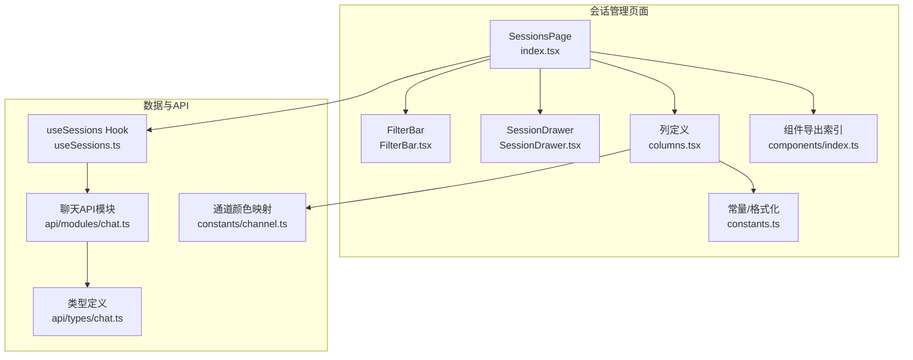
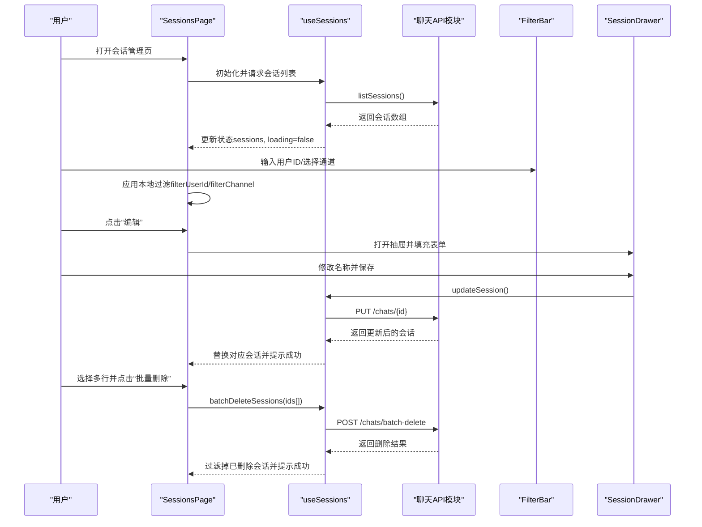
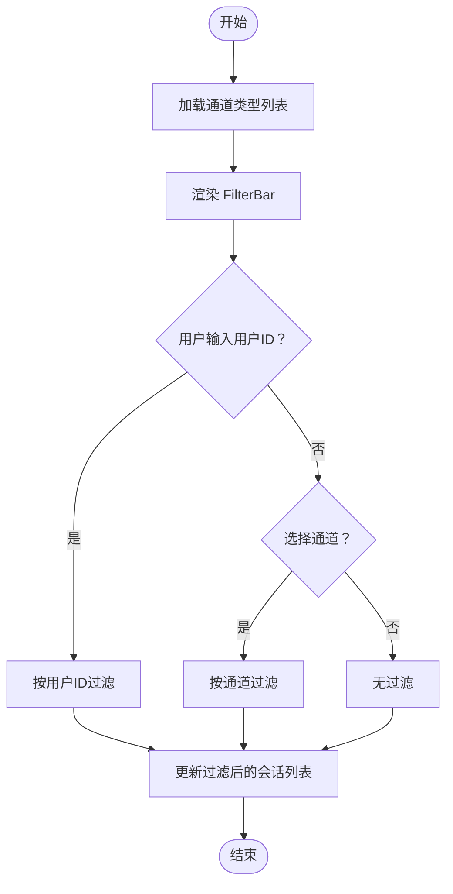
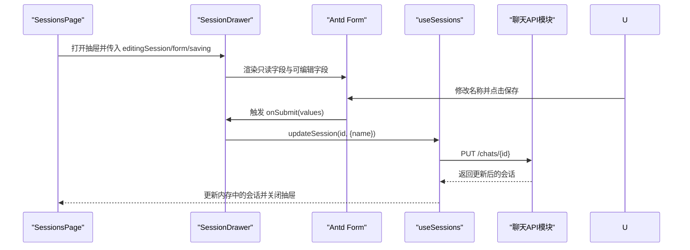
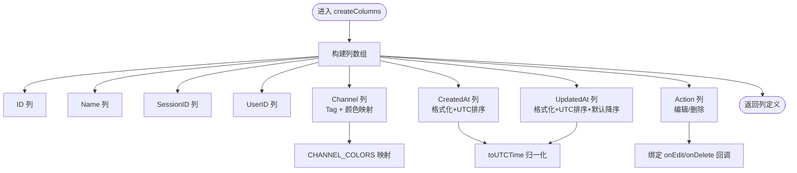
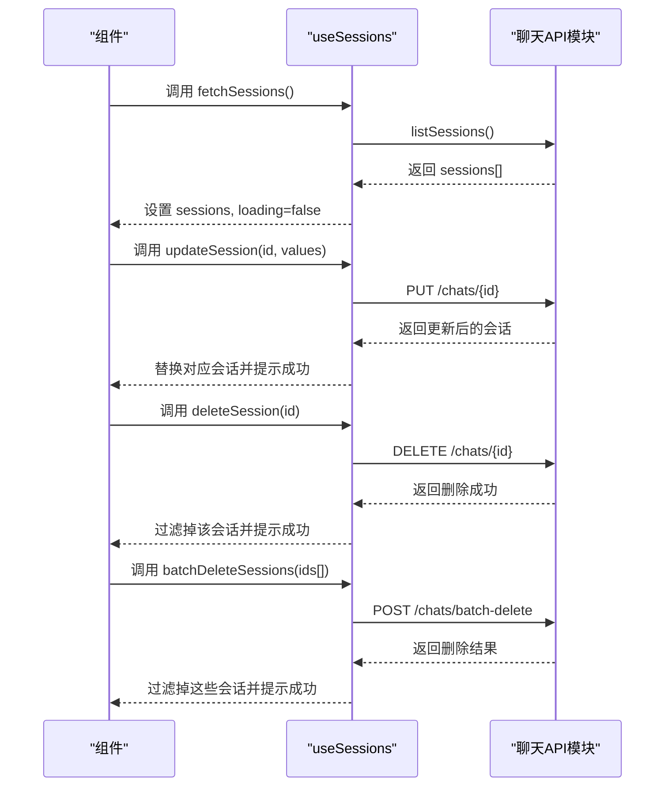
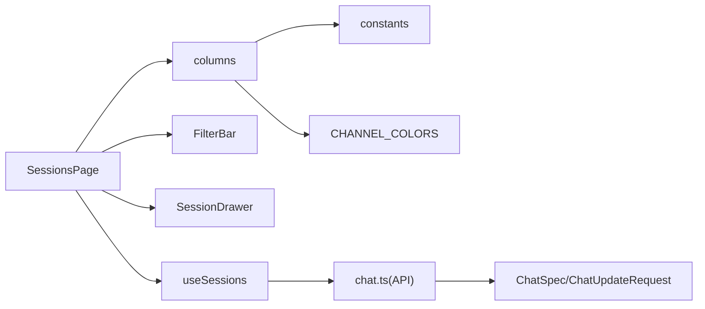

# 会话管理

<cite>
**本文引用的文件**
- [SessionsPage/index.tsx](file://console/src/pages/Control/Sessions/index.tsx)
- [useSessions.ts](file://console/src/pages/Control/Sessions/useSessions.ts)
- [FilterBar.tsx](file://console/src/pages/Control/Sessions/components/FilterBar.tsx)
- [SessionDrawer.tsx](file://console/src/pages/Control/Sessions/components/SessionDrawer.tsx)
- [columns.tsx](file://console/src/pages/Control/Sessions/components/columns.tsx)
- [constants.ts](file://console/src/pages/Control/Sessions/components/constants.ts)
- [index.ts（components 导出）](file://console/src/pages/Control/Sessions/components/index.ts)
- [chat.ts（API 类型）](file://console/src/api/types/chat.ts)
- [chat.ts（API 模块）](file://console/src/api/modules/chat.ts)
- [channel.ts（通道颜色映射）](file://console/src/constants/channel.ts)
- [index.module.less（样式）](file://console/src/pages/Control/Sessions/index.module.less)
</cite>

## 目录
1. [简介](#简介)
2. [项目结构](#项目结构)
3. [核心组件](#核心组件)
4. [架构总览](#架构总览)
5. [详细组件分析](#详细组件分析)
6. [依赖关系分析](#依赖关系分析)
7. [性能考量](#性能考量)
8. [故障排查指南](#故障排查指南)
9. [结论](#结论)
10. [附录：操作指南与最佳实践](#附录操作指南与最佳实践)

## 简介
本文件面向 QwenPaw 控制台“会话管理”功能，系统性梳理会话管理页面的实现架构与交互流程，覆盖以下主题：
- 活跃会话列表展示、会话过滤功能与会话详情查看
- FilterBar 过滤栏的实现细节（用户ID筛选、通道筛选）
- SessionDrawer 抽屉组件设计（会话详情展示、表单编辑、提交）
- columns.ts 表格列定义（基本信息、状态显示、排序与批量操作）
- useSessions 自定义 Hook 的职责（数据获取、状态管理、实时更新）
- 操作指南（清理、批量删除、导出等）
- 安全与性能优化建议

## 项目结构
会话管理页面位于控制台前端模块下，采用“页面 + 组件 + Hook”的分层组织方式：
- 页面入口负责状态编排、过滤逻辑、弹窗与批量操作
- 组件层拆分 FilterBar、SessionDrawer、columns 定义
- useSessions Hook 聚合数据获取与 CRUD 操作
- API 层通过 chat.ts 模块暴露会话相关接口

图表来源
- [SessionsPage/index.tsx:1-203](file://console/src/pages/Control/Sessions/index.tsx#L1-L203)
- [FilterBar.tsx:1-49](file://console/src/pages/Control/Sessions/components/FilterBar.tsx#L1-L49)
- [SessionDrawer.tsx:1-77](file://console/src/pages/Control/Sessions/components/SessionDrawer.tsx#L1-L77)
- [columns.tsx:1-108](file://console/src/pages/Control/Sessions/components/columns.tsx#L1-L108)
- [constants.ts:1-33](file://console/src/pages/Control/Sessions/components/constants.ts#L1-L33)
- [index.ts（components 导出）:1-6](file://console/src/pages/Control/Sessions/components/index.ts#L1-L6)
- [useSessions.ts:1-98](file://console/src/pages/Control/Sessions/useSessions.ts#L1-L98)
- [chat.ts（API 模块）:99-136](file://console/src/api/modules/chat.ts#L99-L136)
- [chat.ts（API 类型）:1-39](file://console/src/api/types/chat.ts#L1-L39)
- [channel.ts（通道颜色映射）:1-32](file://console/src/constants/channel.ts#L1-L32)

章节来源
- [SessionsPage/index.tsx:1-203](file://console/src/pages/Control/Sessions/index.tsx#L1-L203)
- [useSessions.ts:1-98](file://console/src/pages/Control/Sessions/useSessions.ts#L1-L98)
- [FilterBar.tsx:1-49](file://console/src/pages/Control/Sessions/components/FilterBar.tsx#L1-L49)
- [SessionDrawer.tsx:1-77](file://console/src/pages/Control/Sessions/components/SessionDrawer.tsx#L1-L77)
- [columns.tsx:1-108](file://console/src/pages/Control/Sessions/components/columns.tsx#L1-L108)
- [constants.ts:1-33](file://console/src/pages/Control/Sessions/components/constants.ts#L1-L33)
- [index.ts（components 导出）:1-6](file://console/src/pages/Control/Sessions/components/index.ts#L1-L6)
- [chat.ts（API 模块）:99-136](file://console/src/api/modules/chat.ts#L99-L136)
- [chat.ts（API 类型）:1-39](file://console/src/api/types/chat.ts#L1-L39)
- [channel.ts（通道颜色映射）:1-32](file://console/src/constants/channel.ts#L1-L32)

## 核心组件
- 会话管理页面（SessionsPage）
  - 负责加载会话列表、应用本地过滤、处理行选中与批量删除、打开抽屉进行编辑、调用 useSessions 执行 CRUD
- useSessions Hook
  - 封装会话数据获取、更新、删除、批量删除，并在成功/失败时反馈消息
- FilterBar 过滤栏
  - 提供用户ID关键词输入与通道下拉筛选
- SessionDrawer 抽屉
  - 展示并编辑会话字段（名称、ID、会话ID、用户ID、通道），支持保存
- 列定义（columns）
  - 定义表格列、渲染通道标签、时间格式化与排序、右侧操作按钮
- 常量与工具
  - 时间格式化、通道颜色映射、会话类型别名

章节来源
- [SessionsPage/index.tsx:16-203](file://console/src/pages/Control/Sessions/index.tsx#L16-L203)
- [useSessions.ts:9-98](file://console/src/pages/Control/Sessions/useSessions.ts#L9-L98)
- [FilterBar.tsx:13-49](file://console/src/pages/Control/Sessions/components/FilterBar.tsx#L13-L49)
- [SessionDrawer.tsx:16-77](file://console/src/pages/Control/Sessions/components/SessionDrawer.tsx#L16-L77)
- [columns.tsx:23-108](file://console/src/pages/Control/Sessions/components/columns.tsx#L23-L108)
- [constants.ts:3-33](file://console/src/pages/Control/Sessions/components/constants.ts#L3-L33)
- [chat.ts（API 类型）:3-14](file://console/src/api/types/chat.ts#L3-L14)

## 架构总览
会话管理采用“页面 + 组件 + Hook + API”的分层架构，数据流从 API 层流向 Hook，再由 Hook 注入页面，页面通过组件完成 UI 渲染与交互。

图表来源
- [SessionsPage/index.tsx:16-203](file://console/src/pages/Control/Sessions/index.tsx#L16-L203)
- [useSessions.ts:16-88](file://console/src/pages/Control/Sessions/useSessions.ts#L16-L88)
- [chat.ts（API 模块）:99-136](file://console/src/api/modules/chat.ts#L99-L136)

## 详细组件分析

### FilterBar 过滤栏
- 功能
  - 用户ID关键词过滤：对 user_id 字段进行不区分大小写的包含匹配
  - 通道筛选：基于可用通道列表进行精确匹配
- 实现要点
  - 使用受控组件接收父级回调，保持状态在父组件中统一管理
  - 通道下拉选项来源于页面初始化时从后端获取的通道类型列表
- 交互流程

图表来源
- [SessionsPage/index.tsx:40-70](file://console/src/pages/Control/Sessions/index.tsx#L40-L70)
- [FilterBar.tsx:13-49](file://console/src/pages/Control/Sessions/components/FilterBar.tsx#L13-L49)

章节来源
- [FilterBar.tsx:13-49](file://console/src/pages/Control/Sessions/components/FilterBar.tsx#L13-L49)
- [SessionsPage/index.tsx:40-70](file://console/src/pages/Control/Sessions/index.tsx#L40-L70)

### SessionDrawer 抽屉组件
- 功能
  - 展示当前编辑会话的只读信息（ID、会话ID、用户ID、通道）
  - 编辑名称字段并通过表单提交
  - 支持取消与保存，保存时显示加载态
- 设计细节
  - 使用 Ant Design 抽屉组件，右侧抽屉宽度适配
  - 表单布局垂直，底部操作区包含取消与保存按钮
  - 关闭时销毁 DOM，避免状态残留

图表来源
- [SessionDrawer.tsx:16-77](file://console/src/pages/Control/Sessions/components/SessionDrawer.tsx#L16-L77)
- [SessionsPage/index.tsx:72-134](file://console/src/pages/Control/Sessions/index.tsx#L72-L134)
- [useSessions.ts:46-60](file://console/src/pages/Control/Sessions/useSessions.ts#L46-L60)
- [chat.ts（API 模块）:122-126](file://console/src/api/modules/chat.ts#L122-L126)

章节来源
- [SessionDrawer.tsx:16-77](file://console/src/pages/Control/Sessions/components/SessionDrawer.tsx#L16-L77)
- [SessionsPage/index.tsx:72-134](file://console/src/pages/Control/Sessions/index.tsx#L72-L134)
- [useSessions.ts:46-60](file://console/src/pages/Control/Sessions/useSessions.ts#L46-L60)

### columns.ts 表格列定义
- 列项
  - ID、名称、SessionID、UserID、Channel（带颜色标签）、CreatedAt、UpdatedAt、Action
- 排序与时间格式化
  - 使用 UTC 归一化函数确保跨时区时间排序一致
  - CreatedAt 与 UpdatedAt 使用统一的时间格式化函数
- 操作列
  - 右侧固定操作列，包含“编辑”“删除”两个链接按钮
- 颜色映射
  - 通道颜色来自全局映射，用于 Tag 展示

图表来源
- [columns.tsx:23-108](file://console/src/pages/Control/Sessions/components/columns.tsx#L23-L108)
- [constants.ts:13-33](file://console/src/pages/Control/Sessions/components/constants.ts#L13-L33)
- [channel.ts（通道颜色映射）:17-31](file://console/src/constants/channel.ts#L17-L31)

章节来源
- [columns.tsx:23-108](file://console/src/pages/Control/Sessions/components/columns.tsx#L23-L108)
- [constants.ts:13-33](file://console/src/pages/Control/Sessions/components/constants.ts#L13-L33)
- [channel.ts（通道颜色映射）:17-31](file://console/src/constants/channel.ts#L17-L31)

### useSessions 自定义 Hook
- 职责
  - 获取会话列表（listSessions）
  - 更新会话（updateSession）
  - 删除单个会话（deleteSession）
  - 批量删除（batchDeleteSessions）
  - 统一的消息反馈与加载状态管理
- 生命周期
  - 在挂载时发起一次请求；当“已选代理”变化时重新拉取（通过依赖项 selectedAgent）
- 数据更新策略
  - 成功更新/删除后，直接在内存中替换或过滤对应会话，保证 UI 即时反馈

图表来源
- [useSessions.ts:16-88](file://console/src/pages/Control/Sessions/useSessions.ts#L16-L88)
- [chat.ts（API 模块）:99-136](file://console/src/api/modules/chat.ts#L99-L136)

章节来源
- [useSessions.ts:9-98](file://console/src/pages/Control/Sessions/useSessions.ts#L9-L98)
- [chat.ts（API 模块）:99-136](file://console/src/api/modules/chat.ts#L99-L136)

### 会话详情查看与消息历史
- 当前实现
  - 会话列表页未直接展示消息历史，编辑抽屉仅展示基础字段
- 扩展建议
  - 在抽屉内增加“查看消息历史”按钮，点击后在新抽屉或模态框中展示消息列表
  - 或者在页面中新增“详情”列按钮，跳转到独立详情页（参考控制台其他详情页模式）

章节来源
- [SessionDrawer.tsx:16-77](file://console/src/pages/Control/Sessions/components/SessionDrawer.tsx#L16-L77)
- [columns.tsx:82-105](file://console/src/pages/Control/Sessions/components/columns.tsx#L82-L105)

## 依赖关系分析
- 组件耦合
  - SessionsPage 与 useSessions 强耦合，负责状态与副作用
  - columns.tsx 依赖 constants.ts 的时间格式化与 CHANNEL_COLORS
  - FilterBar 与 SessionDrawer 作为子组件被页面直接使用
- 外部依赖
  - API 层通过 chat.ts 模块封装会话 CRUD
  - Ant Design 组件库提供 Table、Form、Drawer、Button、Tag 等
  - 国际化与主题样式通过 i18n 与 Less 样式文件注入

图表来源
- [SessionsPage/index.tsx:1-203](file://console/src/pages/Control/Sessions/index.tsx#L1-L203)
- [useSessions.ts:1-98](file://console/src/pages/Control/Sessions/useSessions.ts#L1-L98)
- [columns.tsx:1-108](file://console/src/pages/Control/Sessions/components/columns.tsx#L1-L108)
- [constants.ts:1-33](file://console/src/pages/Control/Sessions/components/constants.ts#L1-L33)
- [chat.ts（API 模块）:99-136](file://console/src/api/modules/chat.ts#L99-L136)
- [chat.ts（API 类型）:1-39](file://console/src/api/types/chat.ts#L1-L39)
- [channel.ts（通道颜色映射）:1-32](file://console/src/constants/channel.ts#L1-L32)

章节来源
- [SessionsPage/index.tsx:1-203](file://console/src/pages/Control/Sessions/index.tsx#L1-L203)
- [useSessions.ts:1-98](file://console/src/pages/Control/Sessions/useSessions.ts#L1-L98)
- [columns.tsx:1-108](file://console/src/pages/Control/Sessions/components/columns.tsx#L1-L108)
- [chat.ts（API 模块）:99-136](file://console/src/api/modules/chat.ts#L99-L136)

## 性能考量
- 列表渲染
  - 表格启用横向滚动，适合宽列场景；建议在大数据量时引入虚拟滚动（如 antd 的虚拟化表格能力）
- 过滤策略
  - 本地过滤在 sessions 已加载后执行，避免重复网络请求；若数据量大，建议后端支持分页与查询参数（user_id、channel）
- 请求去重
  - 可在 Hook 中引入请求去重（类似聊天会话 API 的并发请求去重思路），避免重复刷新
- 时间排序
  - UTC 归一化确保排序稳定，避免因本地时区差异导致的错乱

## 故障排查指南
- 无法加载会话列表
  - 检查网络请求是否成功返回；确认后端 /chats 接口可用
  - 查看控制台错误日志与消息提示
- 过滤无效
  - 确认 FilterBar 的回调是否正确传递至父组件；检查本地过滤逻辑是否生效
- 编辑保存失败
  - 查看 updateSession 的错误分支与消息提示；确认后端返回的会话字段完整
- 批量删除异常
  - 检查所选行键值是否正确；确认后端批量删除接口返回结构与数量一致

章节来源
- [useSessions.ts:16-88](file://console/src/pages/Control/Sessions/useSessions.ts#L16-L88)
- [SessionsPage/index.tsx:78-112](file://console/src/pages/Control/Sessions/index.tsx#L78-L112)

## 结论
会话管理页面通过清晰的分层设计实现了“列表展示—本地过滤—抽屉编辑—批量操作”的完整闭环。columns.ts 的列定义与时间归一化保障了排序一致性与可读性；useSessions Hook 将数据获取与状态更新集中在一处，便于维护与扩展。后续可在消息历史查看、后端分页与请求去重等方面进一步完善。

## 附录：操作指南与最佳实践
- 活跃会话列表
  - 打开“控制台 → 会话管理”，页面自动加载会话列表
- 会话过滤
  - 在顶部过滤栏输入用户ID关键词或选择通道，即可实时筛选
- 会话详情与编辑
  - 点击“编辑”打开抽屉，修改名称后点击“保存”
- 会话删除
  - 点击“删除”进行单条删除；或勾选多行后点击“批量删除”
- 导出功能
  - 当前页面未提供导出按钮；如需导出，请在后端新增导出接口并在页面添加导出按钮
- 安全与性能建议
  - 后端应限制每页最大记录数并支持分页参数
  - 对用户ID与通道字段进行参数校验与长度限制
  - 在 Hook 中引入请求去重与缓存策略，减少重复请求
  - 对时间字段统一使用 UTC 存储与展示，避免时区问题