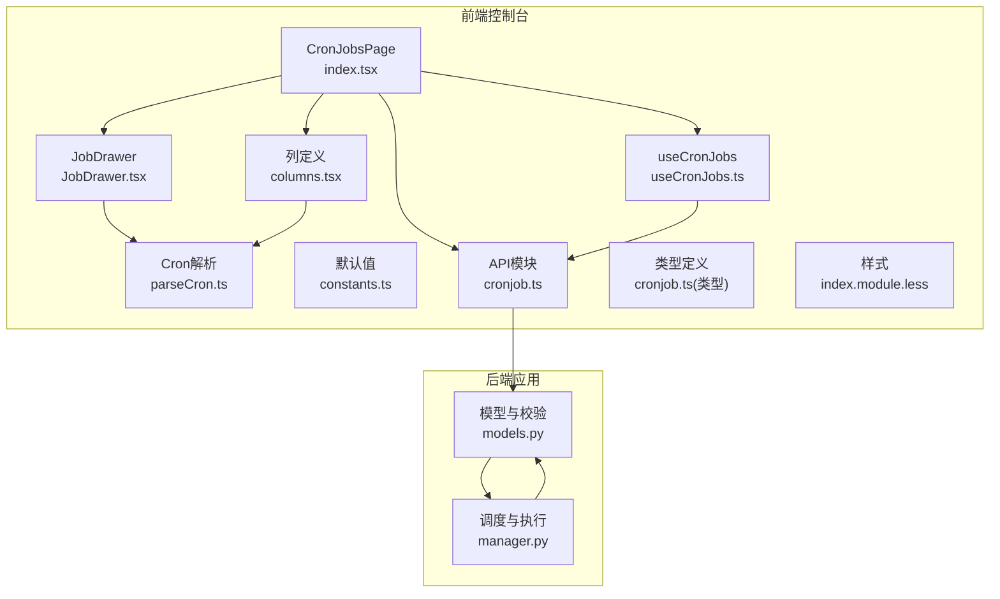
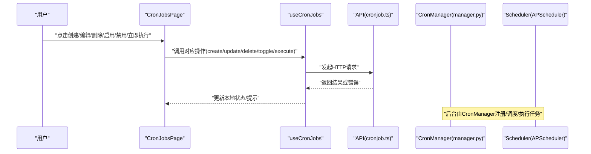
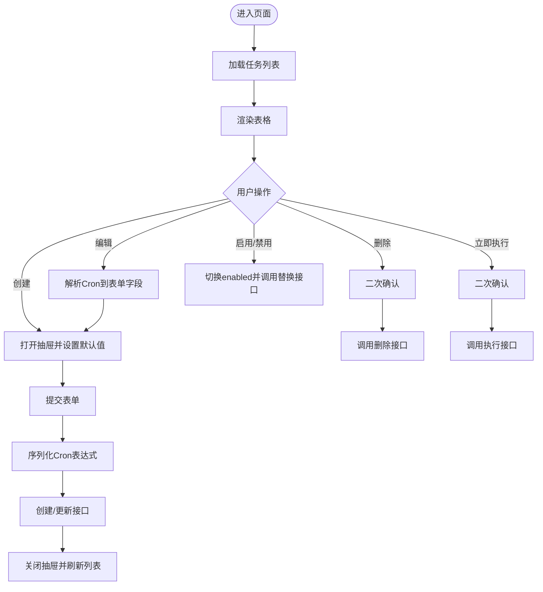
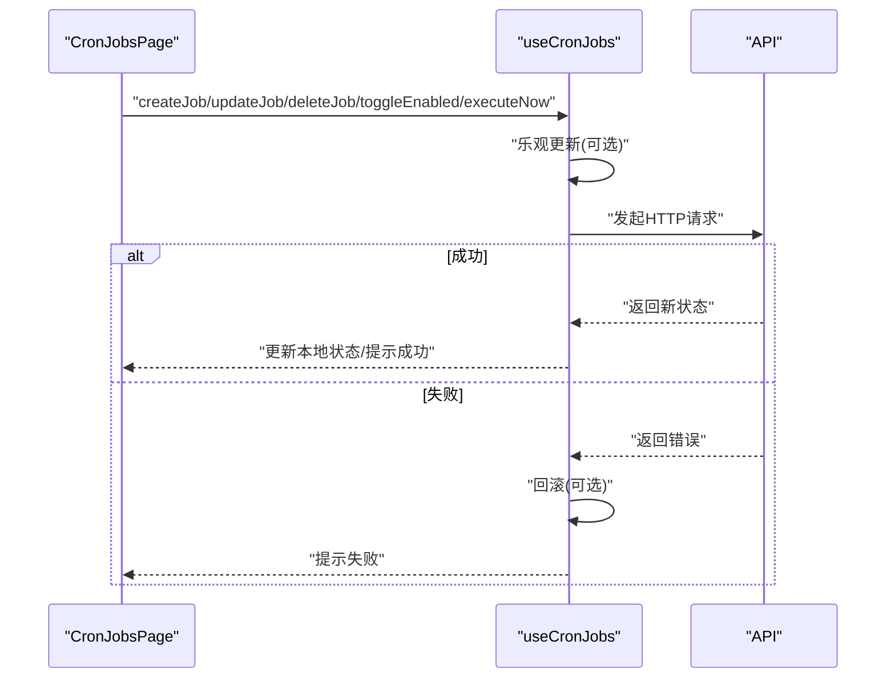
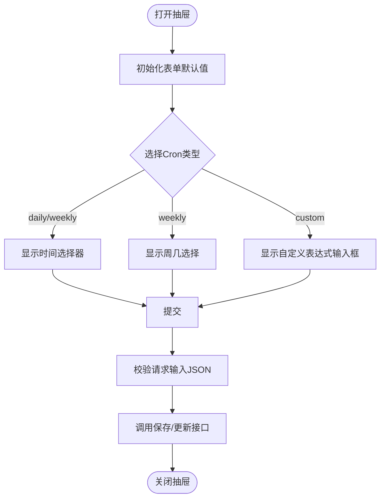
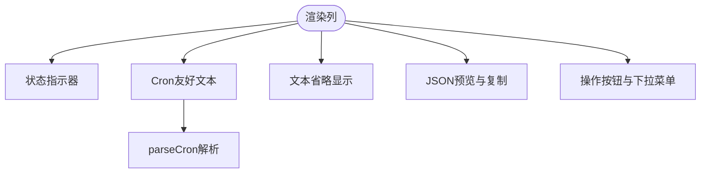
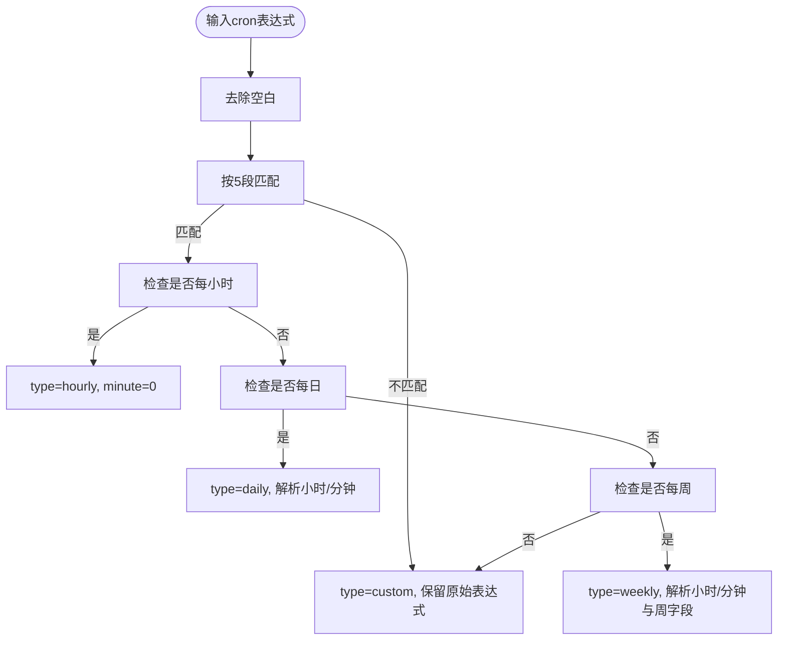
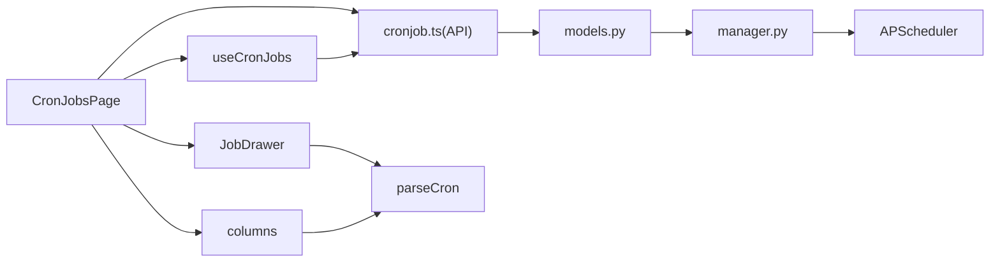

# 定时任务管理

<cite>
**本文引用的文件**
- [index.tsx](file://console/src/pages/Control/CronJobs/index.tsx)
- [useCronJobs.ts](file://console/src/pages/Control/CronJobs/useCronJobs.ts)
- [JobDrawer.tsx](file://console/src/pages/Control/CronJobs/components/JobDrawer.tsx)
- [columns.tsx](file://console/src/pages/Control/CronJobs/components/columns.tsx)
- [parseCron.ts](file://console/src/pages/Control/CronJobs/components/parseCron.ts)
- [constants.ts](file://console/src/pages/Control/CronJobs/components/constants.ts)
- [index.ts（组件导出）](file://console/src/pages/Control/CronJobs/components/index.ts)
- [cronjob.ts（前端API模块）](file://console/src/api/modules/cronjob.ts)
- [cronjob.ts（前端类型定义）](file://console/src/api/types/cronjob.ts)
- [index.module.less（样式）](file://console/src/pages/Control/CronJobs/index.module.less)
- [models.py（后端模型与校验）](file://src/qwenpaw/app/crons/models.py)
- [manager.py（后端调度器与执行）](file://src/qwenpaw/app/crons/manager.py)
</cite>

## 目录
1. [简介](#简介)
2. [项目结构](#项目结构)
3. [核心组件](#核心组件)
4. [架构总览](#架构总览)
5. [详细组件分析](#详细组件分析)
6. [依赖分析](#依赖分析)
7. [性能考虑](#性能考虑)
8. [故障排查指南](#故障排查指南)
9. [结论](#结论)
10. [附录](#附录)

## 简介
本技术文档围绕 QwenPaw 控制台中的“定时任务管理”功能展开，系统性阐述前端页面实现与后端调度执行的整体架构。重点包括：
- 定时任务列表展示与操作（启用/禁用、立即执行、编辑、删除）
- JobDrawer 抽屉表单的设计与交互，涵盖 Cron 表达式解析与序列化、任务参数配置与提交处理
- columns.ts 中表格列定义，包括状态显示、操作按钮、复制与提示信息
- parseCron 组件的 Cron 解析算法，覆盖语法验证、友好文本生成与错误处理
- useCronJobs 自定义 Hook 的数据获取、状态管理与实时同步策略
- Cron 表达式语法说明与常见示例
- 执行监控、日志记录与故障恢复机制

## 项目结构
定时任务管理位于控制台页面下的 Control/CronJobs 目录，采用“页面 + 组件 + Hook + API 类型”的分层组织方式：
- 页面入口负责加载数据、渲染表格、打开抽屉并处理用户交互
- 组件层包含 JobDrawer 表单、columns 列定义、parseCron 解析器与默认值常量
- Hook 层封装 CRUD 操作与状态管理
- API 层对接后端 REST 接口
- 后端使用 APScheduler 进行调度，结合 Pydantic 校验与状态持久化

图表来源
- [index.tsx:19-238](file://console/src/pages/Control/CronJobs/index.tsx#L19-L238)
- [useCronJobs.ts:9-140](file://console/src/pages/Control/CronJobs/useCronJobs.ts#L9-L140)
- [JobDrawer.tsx:30-420](file://console/src/pages/Control/CronJobs/components/JobDrawer.tsx#L30-L420)
- [columns.tsx:46-347](file://console/src/pages/Control/CronJobs/components/columns.tsx#L46-L347)
- [parseCron.ts:55-148](file://console/src/pages/Control/CronJobs/components/parseCron.ts#L55-L148)
- [constants.ts:3-28](file://console/src/pages/Control/CronJobs/components/constants.ts#L3-L28)
- [cronjob.ts:8-54](file://console/src/api/modules/cronjob.ts#L8-L54)
- [cronjob.ts（类型）:1-58](file://console/src/api/types/cronjob.ts#L1-L58)
- [models.py:59-180](file://src/qwenpaw/app/crons/models.py#L59-L180)
- [manager.py:38-388](file://src/qwenpaw/app/crons/manager.py#L38-L388)

章节来源
- [index.tsx:1-238](file://console/src/pages/Control/CronJobs/index.tsx#L1-L238)
- [useCronJobs.ts:1-140](file://console/src/pages/Control/CronJobs/useCronJobs.ts#L1-L140)
- [JobDrawer.tsx:1-420](file://console/src/pages/Control/CronJobs/components/JobDrawer.tsx#L1-L420)
- [columns.tsx:1-347](file://console/src/pages/Control/CronJobs/components/columns.tsx#L1-L347)
- [parseCron.ts:1-259](file://console/src/pages/Control/CronJobs/components/parseCron.ts#L1-L259)
- [constants.ts:1-28](file://console/src/pages/Control/CronJobs/components/constants.ts#L1-L28)
- [index.ts（组件导出）:1-5](file://console/src/pages/Control/CronJobs/components/index.ts#L1-L5)
- [cronjob.ts:1-54](file://console/src/api/modules/cronjob.ts#L1-L54)
- [cronjob.ts（类型）:1-58](file://console/src/api/types/cronjob.ts#L1-L58)
- [models.py:1-180](file://src/qwenpaw/app/crons/models.py#L1-L180)
- [manager.py:1-388](file://src/qwenpaw/app/crons/manager.py#L1-L388)

## 核心组件
- CronJobsPage 页面：负责加载任务列表、打开/关闭抽屉、处理创建/更新、删除、启用/禁用与立即执行等操作，并将 columns 与 JobDrawer 组合使用。
- useCronJobs Hook：封装任务的增删改查与状态切换，支持乐观更新与错误回滚，统一消息提示。
- JobDrawer 抽屉：提供任务创建/编辑的表单，支持 Cron 类型选择、时间选择、周几选择、自定义表达式、请求输入 JSON 校验、运行时参数配置等。
- columns 列定义：定义表格列、状态指示器、Cron 友好文本展示、复制 JSON 内容、操作下拉菜单（编辑/删除）、启用/禁用与立即执行按钮。
- parseCron 解析器：将 Cron 表达式解析为结构化对象，支持 hourly/daily/weekly/custom 四类；同时支持将结构化对象序列化回 Cron 表达式。
- 常量 DEFAULT_FORM_VALUES：提供表单默认值，确保新建任务具备合理初始状态。

章节来源
- [index.tsx:19-238](file://console/src/pages/Control/CronJobs/index.tsx#L19-L238)
- [useCronJobs.ts:9-140](file://console/src/pages/Control/CronJobs/useCronJobs.ts#L9-L140)
- [JobDrawer.tsx:30-420](file://console/src/pages/Control/CronJobs/components/JobDrawer.tsx#L30-L420)
- [columns.tsx:46-347](file://console/src/pages/Control/CronJobs/components/columns.tsx#L46-L347)
- [parseCron.ts:55-148](file://console/src/pages/Control/CronJobs/components/parseCron.ts#L55-L148)
- [constants.ts:3-28](file://console/src/pages/Control/CronJobs/components/constants.ts#L3-L28)

## 架构总览
前端通过 API 模块与后端交互，后端基于 APScheduler 调度 Cron 任务，执行器负责实际工作流调用与状态维护。页面层负责用户交互与展示，组件层负责表单与表格，Hook 层负责数据与状态管理。

图表来源
- [index.tsx:19-238](file://console/src/pages/Control/CronJobs/index.tsx#L19-L238)
- [useCronJobs.ts:9-140](file://console/src/pages/Control/CronJobs/useCronJobs.ts#L9-L140)
- [cronjob.ts:8-54](file://console/src/api/modules/cronjob.ts#L8-L54)
- [manager.py:38-388](file://src/qwenpaw/app/crons/manager.py#L38-L388)

## 详细组件分析

### CronJobsPage 页面
- 数据加载：初始化时通过 useCronJobs 获取任务列表，并在选中代理变化时重新加载。
- 用户交互：
  - 创建：重置表单并设置默认时区与类型，打开抽屉。
  - 编辑：解析 Cron 表达式到表单字段，填充时间与周几，打开抽屉。
  - 删除：二次确认后调用删除接口。
  - 启用/禁用：切换 enabled 字段并调用替换接口。
  - 立即执行：二次确认后触发执行接口。
- 表格列：通过 createColumns 生成列定义，包含状态、Cron 友好文本、请求输入预览、操作按钮等。
- 抽屉：传递 form 实例、保存状态、关闭回调与提交回调。

图表来源
- [index.tsx:36-191](file://console/src/pages/Control/CronJobs/index.tsx#L36-L191)
- [parseCron.ts:124-148](file://console/src/pages/Control/CronJobs/components/parseCron.ts#L124-L148)

章节来源
- [index.tsx:19-238](file://console/src/pages/Control/CronJobs/index.tsx#L19-L238)

### useCronJobs Hook
- 数据获取：首次挂载与代理切换时拉取任务列表。
- 创建：调用创建接口，乐观地将新任务插入列表顶部。
- 更新：先进行乐观更新，再调用替换接口，失败则回滚。
- 删除：先从列表移除，再调用删除接口，失败则恢复。
- 启用/禁用：切换本地 enabled，调用替换接口，失败回滚。
- 立即执行：调用触发接口并提示结果。
- 错误处理：统一使用消息提示组件反馈错误或成功。

图表来源
- [useCronJobs.ts:15-128](file://console/src/pages/Control/CronJobs/useCronJobs.ts#L15-L128)
- [cronjob.ts:8-54](file://console/src/api/modules/cronjob.ts#L8-L54)

章节来源
- [useCronJobs.ts:1-140](file://console/src/pages/Control/CronJobs/useCronJobs.ts#L1-L140)

### JobDrawer 抽屉组件
- 结构与布局：垂直表单，包含基础字段（id、name、enabled）、Cron 类型选择、时间选择、周几选择、自定义表达式、时区、任务类型（text/agent）、请求输入 JSON 校验、会话与用户标识、分发通道与目标、分发模式、并发与超时等。
- 动态字段：
  - cronType 为 daily/weekly 时显示时间选择器。
  - cronType 为 weekly 时显示周几复选框组。
  - cronType 为 custom 时显示自定义表达式输入框，并提供示例与外部链接。
- JSON 校验：对请求输入字段进行 JSON 格式校验，错误时阻止提交。
- 提交流程：序列化 Cron 表达式，解析请求输入 JSON，调用提交回调。

图表来源
- [JobDrawer.tsx:58-417](file://console/src/pages/Control/CronJobs/components/JobDrawer.tsx#L58-L417)
- [constants.ts:3-28](file://console/src/pages/Control/CronJobs/components/constants.ts#L3-L28)
- [parseCron.ts:124-148](file://console/src/pages/Control/CronJobs/components/parseCron.ts#L124-L148)

章节来源
- [JobDrawer.tsx:1-420](file://console/src/pages/Control/CronJobs/components/JobDrawer.tsx#L1-L420)
- [constants.ts:1-28](file://console/src/pages/Control/CronJobs/components/constants.ts#L1-L28)

### columns 列定义
- 列项：
  - id、name：固定宽度与左固定。
  - enabled：状态指示器（圆点+文案），区分启用/禁用。
  - schedule.type：固定为 cron。
  - schedule.cron：解析 Cron 并生成友好文本（hourly/daily/weekly/custom），支持复制到剪贴板与 Tooltip 展示原始表达式。
  - schedule.timezone：时区显示。
  - task_type：任务类型。
  - text：文本内容省略显示，溢出时 Tooltip 提示。
  - request.input：JSON 预览，过长时截断并提供复制按钮。
  - request.session_id、request.user_id：直接展示。
  - dispatch.*：分发相关字段。
  - runtime.*：并发、超时、宽限期。
  - action：操作列，包含启用/禁用、立即执行与更多菜单（编辑/删除），编辑/删除在任务启用时禁用。
- 交互：
  - 复制：支持 Clipboard API 或降级方案。
  - Tooltip：展示完整 Cron 与格式说明。
  - 下拉菜单：根据任务状态动态禁用编辑/删除。

图表来源
- [columns.tsx:46-347](file://console/src/pages/Control/CronJobs/components/columns.tsx#L46-L347)
- [parseCron.ts:55-102](file://console/src/pages/Control/CronJobs/components/parseCron.ts#L55-L102)

章节来源
- [columns.tsx:1-347](file://console/src/pages/Control/CronJobs/components/columns.tsx#L1-L347)

### parseCron Cron 表达式解析算法
- 输入输出：
  - 输入：Cron 表达式字符串
  - 输出：CronParts 对象，包含 type、hour、minute、daysOfWeek、rawCron
- 解析规则：
  - hourly：当小时、日、月、周均为通配且分钟为 0 时识别为每小时。
  - daily：当日、月、周均为通配时，解析小时与分钟。
  - weekly：当日、月为通配且周不为通配时，解析小时与分钟，并解析周字段（支持数字与英文缩写，范围与去重）。
  - custom：其他情况归类为自定义表达式。
- 序列化：
  - hourly 返回 "0 * * * *"
  - daily 返回 "{minute} {hour} * * *"
  - weekly 返回 "{minute} {hour} * * {daysOfWeek}"
  - custom 返回原始表达式
- 错误处理：
  - 不合法表达式或越界数值返回 custom 或空集合，保证调用方能安全回退。

图表来源
- [parseCron.ts:55-102](file://console/src/pages/Control/CronJobs/components/parseCron.ts#L55-L102)
- [parseCron.ts:124-148](file://console/src/pages/Control/CronJobs/components/parseCron.ts#L124-L148)
- [parseCron.ts:158-219](file://console/src/pages/Control/CronJobs/components/parseCron.ts#L158-L219)

章节来源
- [parseCron.ts:1-259](file://console/src/pages/Control/CronJobs/components/parseCron.ts#L1-L259)

### DEFAULT_FORM_VALUES 默认值
- 提供新建任务的默认初始值，包括 enabled、schedule（type、cron、timezone）、cronType、cronTime、task_type、dispatch、runtime 等，确保表单可用性与一致性。

章节来源
- [constants.ts:3-28](file://console/src/pages/Control/CronJobs/components/constants.ts#L3-L28)

### API 与类型定义
- API 模块提供列出、创建、查询、替换、删除、暂停、恢复、运行、触发与状态查询等接口。
- 类型定义涵盖 CronJobSchedule、CronJobDispatch、CronJobRuntime、CronJobRequest、CronJobSpecInput/Output/View 等，确保前后端契约一致。

章节来源
- [cronjob.ts:8-54](file://console/src/api/modules/cronjob.ts#L8-L54)
- [cronjob.ts（类型）:1-58](file://console/src/api/types/cronjob.ts#L1-L58)

## 依赖分析
- 页面依赖 Hook、组件与 API 模块；Hook 依赖 API；组件依赖解析器与常量；后端依赖模型与调度器。
- 前后端契约通过类型定义与 API 模块约束，避免字段不一致导致的错误。
- Cron 表达式在前端与后端均进行规范化处理，前端用于 UI 友好展示与表单序列化，后端用于 APScheduler 触发器构建。

图表来源
- [index.tsx:19-238](file://console/src/pages/Control/CronJobs/index.tsx#L19-L238)
- [useCronJobs.ts:9-140](file://console/src/pages/Control/CronJobs/useCronJobs.ts#L9-L140)
- [JobDrawer.tsx:30-420](file://console/src/pages/Control/CronJobs/components/JobDrawer.tsx#L30-L420)
- [columns.tsx:46-347](file://console/src/pages/Control/CronJobs/components/columns.tsx#L46-L347)
- [parseCron.ts:55-148](file://console/src/pages/Control/CronJobs/components/parseCron.ts#L55-L148)
- [cronjob.ts:8-54](file://console/src/api/modules/cronjob.ts#L8-L54)
- [models.py:59-180](file://src/qwenpaw/app/crons/models.py#L59-L180)
- [manager.py:38-388](file://src/qwenpaw/app/crons/manager.py#L38-L388)

章节来源
- [index.tsx:1-238](file://console/src/pages/Control/CronJobs/index.tsx#L1-L238)
- [useCronJobs.ts:1-140](file://console/src/pages/Control/CronJobs/useCronJobs.ts#L1-L140)
- [JobDrawer.tsx:1-420](file://console/src/pages/Control/CronJobs/components/JobDrawer.tsx#L1-L420)
- [columns.tsx:1-347](file://console/src/pages/Control/CronJobs/components/columns.tsx#L1-L347)
- [parseCron.ts:1-259](file://console/src/pages/Control/CronJobs/components/parseCron.ts#L1-L259)
- [cronjob.ts:1-54](file://console/src/api/modules/cronjob.ts#L1-L54)
- [models.py:1-180](file://src/qwenpaw/app/crons/models.py#L1-L180)
- [manager.py:1-388](file://src/qwenpaw/app/crons/manager.py#L1-L388)

## 性能考虑
- 表格滚动：开启横向滚动以适配较多列。
- 列渲染优化：对长文本与 JSON 使用省略与 Tooltip，减少 DOM 渲染压力。
- 乐观更新：在更新与删除场景中先本地更新，降低等待时间，失败时回滚。
- 并发控制：后端通过信号量限制每个任务的最大并发数，避免资源争用。
- 超时与宽限期：提供超时与错失触发宽限期，平衡及时性与稳定性。

## 故障排查指南
- Cron 表达式无效：
  - 前端：parseCron 将无效表达式归类为 custom，建议检查表达式格式。
  - 后端：模型校验要求 5 段（不含秒），不合法将抛出配置异常并可能自动禁用任务。
- 请求输入 JSON 校验失败：
  - 表单会阻止提交并提示 JSON 格式错误，请检查 JSON 语法。
- 任务无法执行：
  - 检查 enabled 状态与后端调度器状态；查看任务状态与最后运行时间。
  - 后端执行异常会记录日志并通过控制台推送错误消息。
- 立即执行失败：
  - 确认任务存在且未被禁用；查看触发接口返回与后端日志。

章节来源
- [parseCron.ts:55-102](file://console/src/pages/Control/CronJobs/components/parseCron.ts#L55-L102)
- [models.py:64-88](file://src/qwenpaw/app/crons/models.py#L64-L88)
- [manager.py:217-239](file://src/qwenpaw/app/crons/manager.py#L217-L239)
- [JobDrawer.tsx:299-312](file://console/src/pages/Control/CronJobs/components/JobDrawer.tsx#L299-L312)

## 结论
定时任务管理功能通过清晰的分层设计实现了从前端表单配置到后端调度执行的完整闭环。前端以组件化与 Hook 化的方式提升可维护性与用户体验，后端以 APScheduler 与 Pydantic 校验保障任务的正确性与稳定性。整体架构具备良好的扩展性与可观测性，便于后续迭代与运维。

## 附录

### Cron 表达式语法与示例
- 语法格式：分钟 小时 日 月 星期
- 常见用法：
  - 每小时：0 * * * *
  - 每日固定时间：例如 0 9 * * *（每天 09:00）
  - 每周一/三/五：0 9 * * 1,3,5 或 0 9 * * mon,wed,fri
  - 每月最后一天：0 0 L * *
  - 每月第 15 天：0 0 15 * *
  - 支持范围与步进：例如 0 0-12/2 * * *（每 2 小时一次）
- 注意事项：
  - 后端强制 5 段（不含秒），周字段支持数字与英文缩写（mon-sun），并做规范化处理。
  - 周日数字为 0 或 7 在转换时统一为 sun。

章节来源
- [parseCron.ts:20-45](file://console/src/pages/Control/CronJobs/components/parseCron.ts#L20-L45)
- [models.py:38-56](file://src/qwenpaw/app/crons/models.py#L38-L56)
- [models.py:64-88](file://src/qwenpaw/app/crons/models.py#L64-L88)