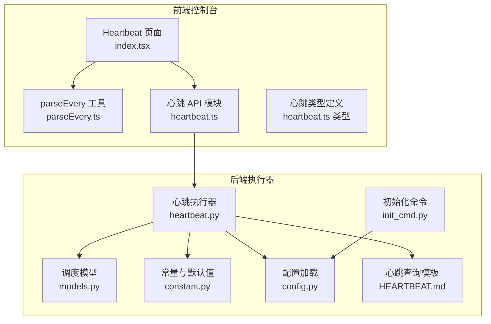
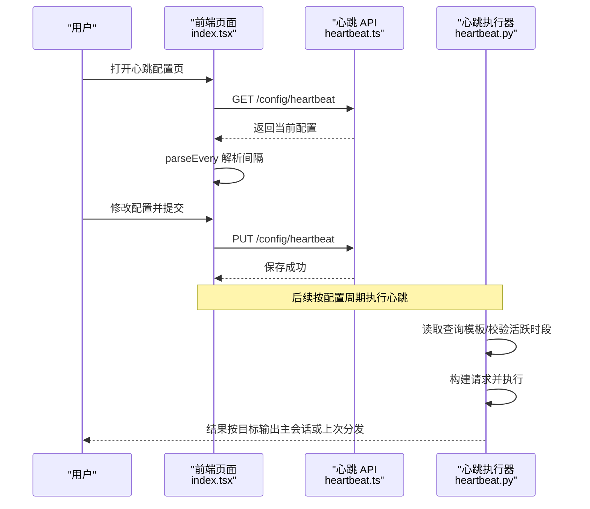
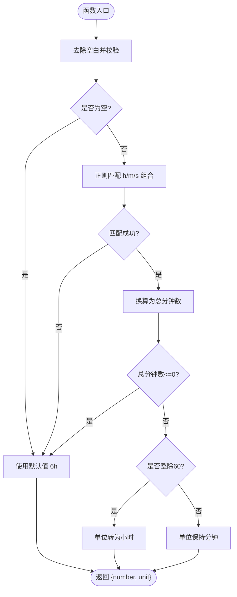
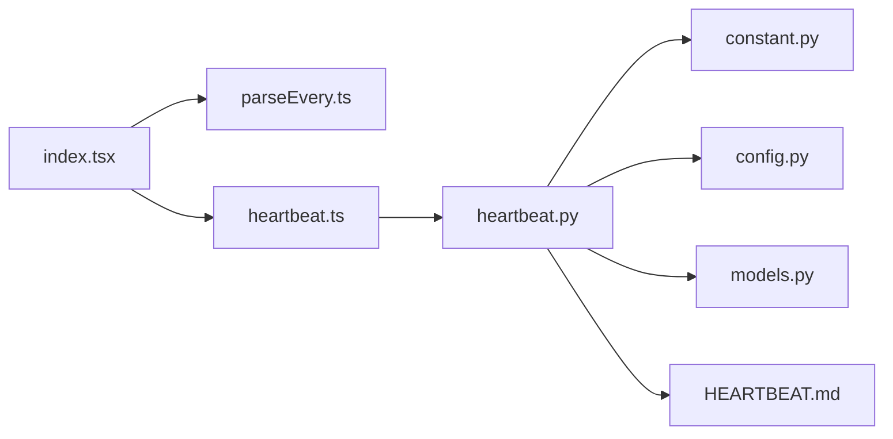

# 心跳监控

<cite>
**本文引用的文件**
- [console/src/pages/Control/Heartbeat/index.tsx](file://console/src/pages/Control/Heartbeat/index.tsx)
- [console/src/pages/Control/Heartbeat/parseEvery.ts](file://console/src/pages/Control/Heartbeat/parseEvery.ts)
- [console/src/api/modules/heartbeat.ts](file://console/src/api/modules/heartbeat.ts)
- [console/src/api/types/heartbeat.ts](file://console/src/api/types/heartbeat.ts)
- [src/qwenpaw/app/crons/heartbeat.py](file://src/qwenpaw/app/crons/heartbeat.py)
- [src/qwenpaw/app/crons/models.py](file://src/qwenpaw/app/crons/models.py)
- [src/qwenpaw/constant.py](file://src/qwenpaw/constant.py)
- [src/qwenpaw/config/config.py](file://src/qwenpaw/config/config.py)
- [src/qwenpaw/cli/init_cmd.py](file://src/qwenpaw/cli/init_cmd.py)
- [src/qwenpaw/agents/md_files/en/HEARTBEAT.md](file://src/qwenpaw/agents/md_files/en/HEARTBEAT.md)
- [website/public/docs/heartbeat.en.md](file://website/public/docs/heartbeat.en.md)
</cite>

## 目录
1. [简介](#简介)
2. [项目结构](#项目结构)
3. [核心组件](#核心组件)
4. [架构总览](#架构总览)
5. [详细组件分析](#详细组件分析)
6. [依赖分析](#依赖分析)
7. [性能考虑](#性能考虑)
8. [故障排查指南](#故障排查指南)
9. [结论](#结论)
10. [附录](#附录)

## 简介
本技术文档围绕 QwenPaw 的“心跳监控”功能展开，系统性阐述心跳监控页面的实现架构、系统健康状态展示、监控指标采集与告警机制。重点解析 parseEvery 函数的时间间隔解析与序列化逻辑、心跳频率计算与异常检测、心跳监控的数据采集机制（系统资源监控、服务状态检查、响应时间统计）、心跳告警系统的阈值设置与触发条件、通知机制，以及可视化展示（图表绘制、实时更新、历史数据查询）等。同时提供配置项说明（监控间隔、告警级别、通知方式）、性能优化策略与故障排查指南。

## 项目结构
心跳监控功能由前端控制台页面与后端执行器协同完成：
- 前端：提供心跳配置表单、时间间隔解析与序列化、配置保存与加载。
- 后端：按配置周期执行心跳任务，读取工作区中的查询模板，调度到指定目标（主会话或上次分发通道），并记录运行状态。

图示来源
- [console/src/pages/Control/Heartbeat/index.tsx:71-138](file://console/src/pages/Control/Heartbeat/index.tsx#L71-L138)
- [console/src/pages/Control/Heartbeat/parseEvery.ts:16-43](file://console/src/pages/Control/Heartbeat/parseEvery.ts#L16-L43)
- [console/src/api/modules/heartbeat.ts:4-12](file://console/src/api/modules/heartbeat.ts#L4-L12)
- [src/qwenpaw/app/crons/heartbeat.py:119-213](file://src/qwenpaw/app/crons/heartbeat.py#L119-L213)
- [src/qwenpaw/app/crons/models.py:59-180](file://src/qwenpaw/app/crons/models.py#L59-L180)
- [src/qwenpaw/constant.py:147-151](file://src/qwenpaw/constant.py#L147-L151)
- [src/qwenpaw/config/config.py:1-200](file://src/qwenpaw/config/config.py#L1-L200)
- [src/qwenpaw/cli/init_cmd.py:212-278](file://src/qwenpaw/cli/init_cmd.py#L212-L278)
- [src/qwenpaw/agents/md_files/en/HEARTBEAT.md:1-12](file://src/qwenpaw/agents/md_files/en/HEARTBEAT.md#L1-L12)

章节来源
- [console/src/pages/Control/Heartbeat/index.tsx:71-138](file://console/src/pages/Control/Heartbeat/index.tsx#L71-L138)
- [console/src/pages/Control/Heartbeat/parseEvery.ts:16-43](file://console/src/pages/Control/Heartbeat/parseEvery.ts#L16-L43)
- [console/src/api/modules/heartbeat.ts:4-12](file://console/src/api/modules/heartbeat.ts#L4-L12)
- [src/qwenpaw/app/crons/heartbeat.py:119-213](file://src/qwenpaw/app/crons/heartbeat.py#L119-L213)
- [src/qwenpaw/app/crons/models.py:59-180](file://src/qwenpaw/app/crons/models.py#L59-L180)
- [src/qwenpaw/constant.py:147-151](file://src/qwenpaw/constant.py#L147-L151)
- [src/qwenpaw/config/config.py:1-200](file://src/qwenpaw/config/config.py#L1-L200)
- [src/qwenpaw/cli/init_cmd.py:212-278](file://src/qwenpaw/cli/init_cmd.py#L212-L278)
- [src/qwenpaw/agents/md_files/en/HEARTBEAT.md:1-12](file://src/qwenpaw/agents/md_files/en/HEARTBEAT.md#L1-L12)

## 核心组件
- 前端心跳页面：负责加载/保存心跳配置，解析/序列化时间间隔，支持启用开关、间隔单位（分钟/小时）、目标选择（主会话/上次分发）、活跃时段设置。
- parseEvery 工具：将后端字符串格式的间隔解析为表单可用的数字+单位，并可反向序列化回字符串。
- 后端心跳执行器：根据配置读取查询模板，构建请求，按目标执行并记录状态；支持活跃时段过滤与超时保护。
- 配置与常量：定义默认心跳文件名、默认间隔、默认目标、目标标识等。
- 文档与模板：官方文档说明字段语义，模板文件用于存放心跳查询内容。

章节来源
- [console/src/pages/Control/Heartbeat/index.tsx:51-138](file://console/src/pages/Control/Heartbeat/index.tsx#L51-L138)
- [console/src/pages/Control/Heartbeat/parseEvery.ts:16-43](file://console/src/pages/Control/Heartbeat/parseEvery.ts#L16-L43)
- [src/qwenpaw/app/crons/heartbeat.py:119-213](file://src/qwenpaw/app/crons/heartbeat.py#L119-L213)
- [src/qwenpaw/constant.py:147-151](file://src/qwenpaw/constant.py#L147-L151)
- [website/public/docs/heartbeat.en.md:77-89](file://website/public/docs/heartbeat.en.md#L77-L89)

## 架构总览
心跳监控的端到端流程如下：

图示来源
- [console/src/pages/Control/Heartbeat/index.tsx:79-138](file://console/src/pages/Control/Heartbeat/index.tsx#L79-L138)
- [console/src/api/modules/heartbeat.ts:4-12](file://console/src/api/modules/heartbeat.ts#L4-L12)
- [src/qwenpaw/app/crons/heartbeat.py:119-213](file://src/qwenpaw/app/crons/heartbeat.py#L119-L213)

## 详细组件分析

### parseEvery 函数实现原理
parseEvery 负责将后端返回的“间隔字符串”解析为表单可用的数字+单位，并在保存时反序列化回字符串。其核心逻辑包括：
- 正则匹配：支持小时、分钟、秒三种单位组合，如“6h”、“30m”、“90s”、“2h30m”等。
- 单位换算：统一换算为分钟，若整除60则以小时显示，否则以分钟显示。
- 异常处理：输入为空或不合法时，回退到默认值（6小时）。
- 序列化：将数字+单位还原为“Nh”或“Nm”的字符串。

图示来源
- [console/src/pages/Control/Heartbeat/parseEvery.ts:16-43](file://console/src/pages/Control/Heartbeat/parseEvery.ts#L16-L43)

章节来源
- [console/src/pages/Control/Heartbeat/parseEvery.ts:16-43](file://console/src/pages/Control/Heartbeat/parseEvery.ts#L16-L43)

### 心跳频率计算与异常检测
- 频率计算：后端将“间隔字符串”解析为总秒数，作为心跳调度的基础。若输入为空或非法，采用默认值（例如 30 分钟）。
- 异常检测：
  - 输入格式不合法：记录警告并回退默认值。
  - 总秒数非正：回退默认值。
  - 活跃时段判断：若当前时间不在设定的 start~end 内，则跳过本次心跳。
  - 超时保护：心跳执行设置超时上限，避免长时间阻塞。

章节来源
- [src/qwenpaw/app/crons/heartbeat.py:59-117](file://src/qwenpaw/app/crons/heartbeat.py#L59-L117)
- [src/qwenpaw/app/crons/heartbeat.py:119-213](file://src/qwenpaw/app/crons/heartbeat.py#L119-L213)

### 数据采集机制
- 查询模板：后端从工作区读取 HEARTBEAT.md 作为心跳查询内容，若文件不存在或为空则跳过。
- 请求构建：将查询文本封装为用户消息请求，固定会话与用户标识，便于后续分发。
- 目标分发：
  - 主会话（main）：仅执行，不进行通道分发。
  - 上次分发（last）：读取 agent 的 last_dispatch，将事件流发送至对应通道与会话。
- 超时与错误：执行过程设置超时保护，超时记录警告日志。

章节来源
- [src/qwenpaw/app/crons/heartbeat.py:119-213](file://src/qwenpaw/app/crons/heartbeat.py#L119-L213)
- [src/qwenpaw/agents/md_files/en/HEARTBEAT.md:1-12](file://src/qwenpaw/agents/md_files/en/HEARTBEAT.md#L1-L12)

### 告警系统与通知机制
- 当前实现：心跳执行器未内置独立的“告警阈值/触发条件/通知渠道”逻辑。心跳运行状态通过日志记录（如跳过、超时、失败）与外部可观测性工具结合使用。
- 建议扩展方向（概念性）：
  - 在心跳执行器中增加运行状态上报接口，结合外部监控系统（如 Prometheus、Grafana）进行可视化与告警。
  - 将“活跃时段”与“超时”等关键事件纳入告警规则，设置阈值与通知渠道（邮件、IM、Webhook）。
  - 提供配置项：告警级别（严重/警告/提示）、通知方式（静默/立即/延迟）、重试策略。

章节来源
- [src/qwenpaw/app/crons/heartbeat.py:119-213](file://src/qwenpaw/app/crons/heartbeat.py#L119-L213)

### 可视化展示与历史查询
- 前端页面：提供配置表单与加载状态展示，但未包含心跳执行结果的实时图表或历史查询界面。
- 建议扩展方向（概念性）：
  - 引入运行状态视图：显示最近一次/下一次心跳时间、状态（成功/跳过/超时/错误）。
  - 图表绘制：基于历史运行记录绘制成功率、耗时分布等。
  - 历史查询：提供筛选器（日期范围、状态）与导出能力。

章节来源
- [console/src/pages/Control/Heartbeat/index.tsx:71-138](file://console/src/pages/Control/Heartbeat/index.tsx#L71-L138)

### 配置选项
- 字段说明（来自官方文档与类型定义）：
  - enabled：布尔，开启/关闭心跳。
  - every：字符串，间隔表达式（如“30m”、“1h”、“2h30m”、“90s”）或五字段 cron 表达式。
  - target：目标类型（main 或 last）。
  - activeHours：可选的每日活跃时段（start/end）。
- 默认值与常量：
  - 默认心跳文件名、默认间隔、默认目标等由常量定义。
- 初始化与迁移：
  - CLI 初始化时可交互设置心跳间隔、目标与活跃时段，并写入配置。
  - 新版本可能将旧版默认配置迁移到当前 agent 的 agent.json 中。

章节来源
- [website/public/docs/heartbeat.en.md:77-89](file://website/public/docs/heartbeat.en.md#L77-L89)
- [console/src/api/types/heartbeat.ts:1-12](file://console/src/api/types/heartbeat.ts#L1-L12)
- [src/qwenpaw/constant.py:147-151](file://src/qwenpaw/constant.py#L147-L151)
- [src/qwenpaw/cli/init_cmd.py:212-278](file://src/qwenpaw/cli/init_cmd.py#L212-L278)

## 依赖分析
- 前端页面依赖 parseEvery 进行时间间隔解析与序列化，依赖 heartbeat API 进行配置读写。
- 后端心跳执行器依赖配置加载、常量定义、查询模板路径与 last_dispatch 信息。
- 调度模型（models.py）提供通用的任务/调度/运行时规范，心跳执行器遵循该模型的请求与运行约束。

图示来源
- [console/src/pages/Control/Heartbeat/index.tsx:18-18](file://console/src/pages/Control/Heartbeat/index.tsx#L18-L18)
- [console/src/pages/Control/Heartbeat/parseEvery.ts:16-43](file://console/src/pages/Control/Heartbeat/parseEvery.ts#L16-L43)
- [console/src/api/modules/heartbeat.ts:4-12](file://console/src/api/modules/heartbeat.ts#L4-L12)
- [src/qwenpaw/app/crons/heartbeat.py:119-213](file://src/qwenpaw/app/crons/heartbeat.py#L119-L213)
- [src/qwenpaw/app/crons/models.py:59-180](file://src/qwenpaw/app/crons/models.py#L59-L180)
- [src/qwenpaw/constant.py:147-151](file://src/qwenpaw/constant.py#L147-L151)
- [src/qwenpaw/config/config.py:1-200](file://src/qwenpaw/config/config.py#L1-L200)
- [src/qwenpaw/agents/md_files/en/HEARTBEAT.md:1-12](file://src/qwenpaw/agents/md_files/en/HEARTBEAT.md#L1-L12)

章节来源
- [console/src/pages/Control/Heartbeat/index.tsx:18-18](file://console/src/pages/Control/Heartbeat/index.tsx#L18-L18)
- [console/src/pages/Control/Heartbeat/parseEvery.ts:16-43](file://console/src/pages/Control/Heartbeat/parseEvery.ts#L16-L43)
- [console/src/api/modules/heartbeat.ts:4-12](file://console/src/api/modules/heartbeat.ts#L4-L12)
- [src/qwenpaw/app/crons/heartbeat.py:119-213](file://src/qwenpaw/app/crons/heartbeat.py#L119-L213)
- [src/qwenpaw/app/crons/models.py:59-180](file://src/qwenpaw/app/crons/models.py#L59-L180)
- [src/qwenpaw/constant.py:147-151](file://src/qwenpaw/constant.py#L147-L151)
- [src/qwenpaw/config/config.py:1-200](file://src/qwenpaw/config/config.py#L1-L200)
- [src/qwenpaw/agents/md_files/en/HEARTBEAT.md:1-12](file://src/qwenpaw/agents/md_files/en/HEARTBEAT.md#L1-L12)

## 性能考虑
- 超时控制：心跳执行设置超时上限，防止长时间阻塞影响系统稳定性。
- 活跃时段：通过 start~end 控制执行频次，降低非必要负载。
- 日志与可观测性：建议结合日志聚合与监控系统，对心跳成功率、耗时分布进行统计与告警。
- 并发与限速：若引入多 agent/多工作区的心跳，需考虑并发与速率限制，避免对下游服务造成冲击。

章节来源
- [src/qwenpaw/app/crons/heartbeat.py:119-213](file://src/qwenpaw/app/crons/heartbeat.py#L119-L213)

## 故障排查指南
- 配置加载失败：
  - 检查后端配置路径与权限，确认 agent.json/全局配置中 heartbeat 字段存在且格式正确。
  - 查看前端错误提示与网络请求状态码。
- 间隔解析异常：
  - 确认 every 字符串符合“Nh/Nm/Ns”或“NhNm”等格式；非法输入会被回退到默认值。
- 查询模板问题：
  - 确认 HEARTBEAT.md 存在且非空；空模板将导致跳过心跳。
- 活跃时段不生效：
  - 检查用户时区配置与 start/end 时间格式；异常时将回退为全天执行。
- 执行超时：
  - 检查下游服务可用性与网络状况；适当调整超时阈值。

章节来源
- [console/src/pages/Control/Heartbeat/index.tsx:79-99](file://console/src/pages/Control/Heartbeat/index.tsx#L79-L99)
- [console/src/pages/Control/Heartbeat/parseEvery.ts:16-43](file://console/src/pages/Control/Heartbeat/parseEvery.ts#L16-L43)
- [src/qwenpaw/app/crons/heartbeat.py:81-117](file://src/qwenpaw/app/crons/heartbeat.py#L81-L117)
- [src/qwenpaw/app/crons/heartbeat.py:119-213](file://src/qwenpaw/app/crons/heartbeat.py#L119-L213)
- [src/qwenpaw/agents/md_files/en/HEARTBEAT.md:1-12](file://src/qwenpaw/agents/md_files/en/HEARTBEAT.md#L1-L12)

## 结论
心跳监控功能通过前后端协作实现了“配置—执行—状态记录”的闭环。前端提供直观的配置界面与时间间隔解析，后端按配置周期执行心跳任务并具备活跃时段与超时保护。当前未内置独立告警与可视化模块，建议在现有基础上扩展运行状态上报与监控告警能力，以满足生产环境的可观测性需求。

## 附录
- 相关文档与模板：
  - 官方文档说明了 heartbeat 字段含义与配置来源。
  - 心跳查询模板文件用于存放心跳任务内容。

章节来源
- [website/public/docs/heartbeat.en.md:77-89](file://website/public/docs/heartbeat.en.md#L77-L89)
- [src/qwenpaw/agents/md_files/en/HEARTBEAT.md:1-12](file://src/qwenpaw/agents/md_files/en/HEARTBEAT.md#L1-L12)