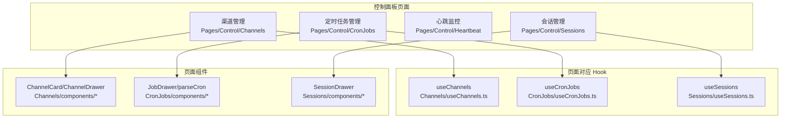
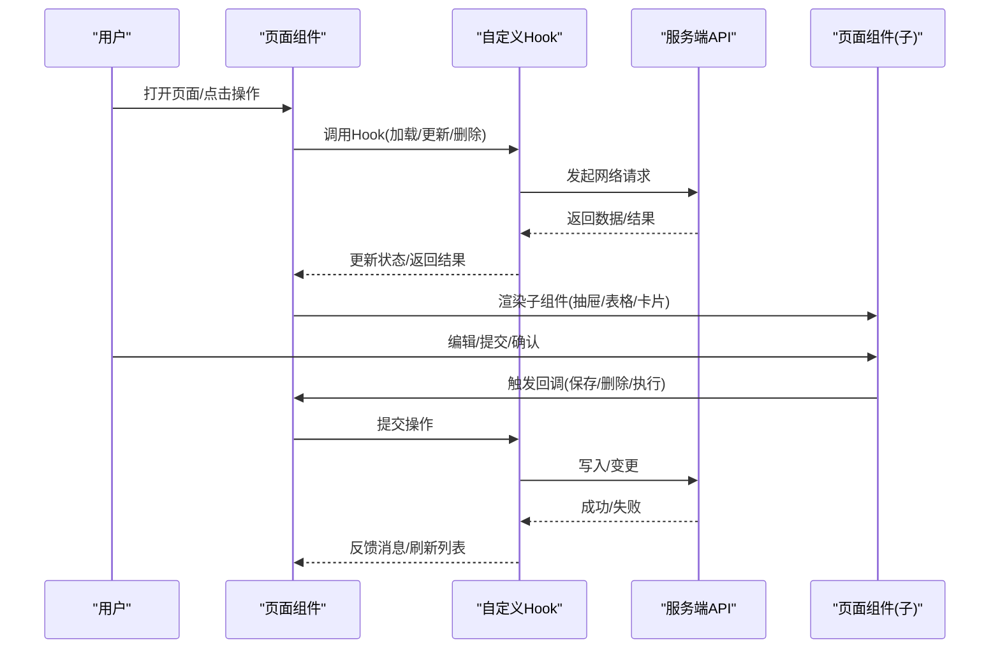
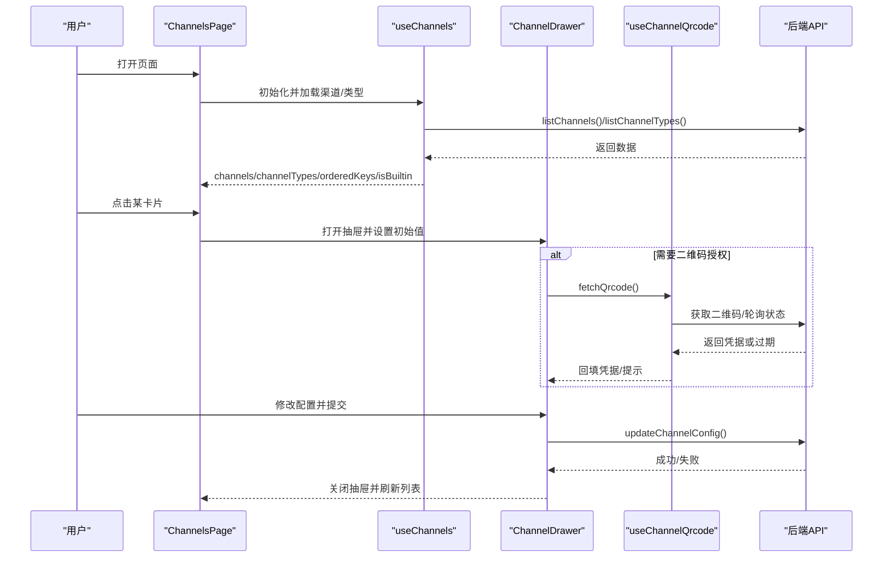
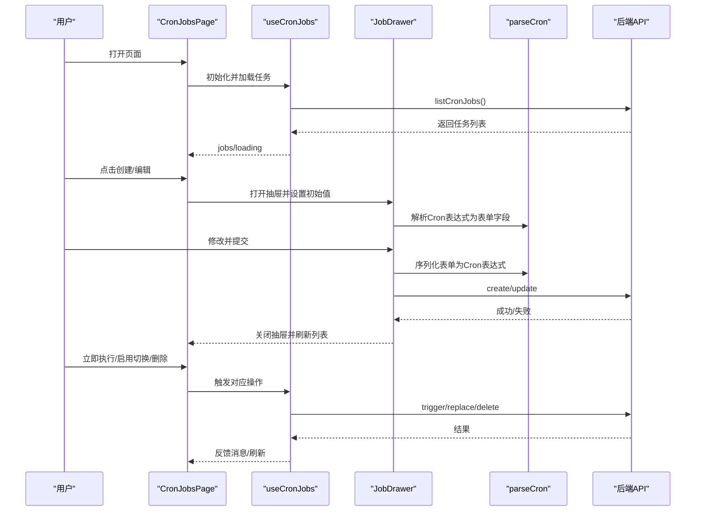
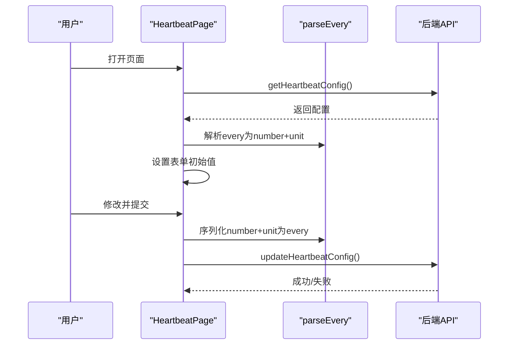
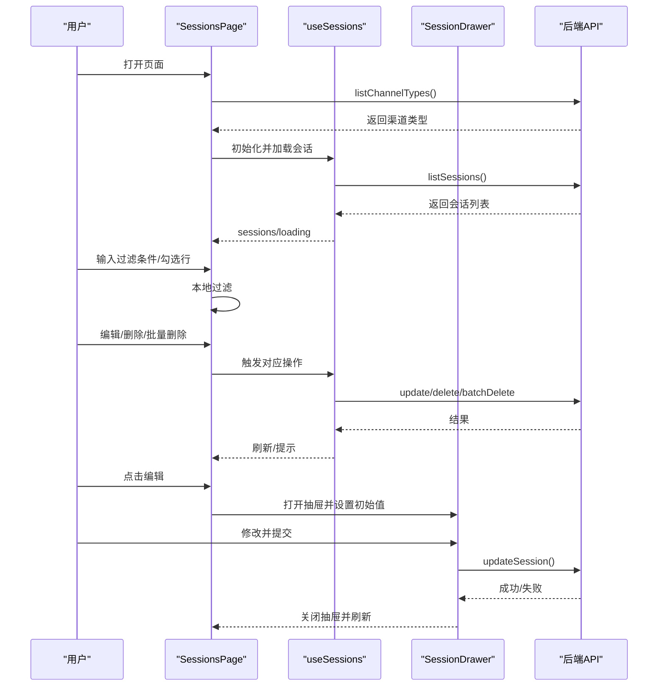
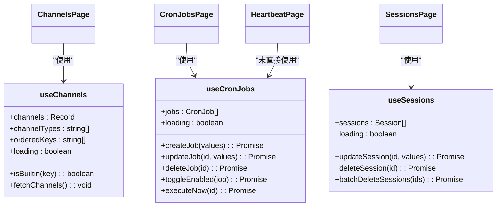
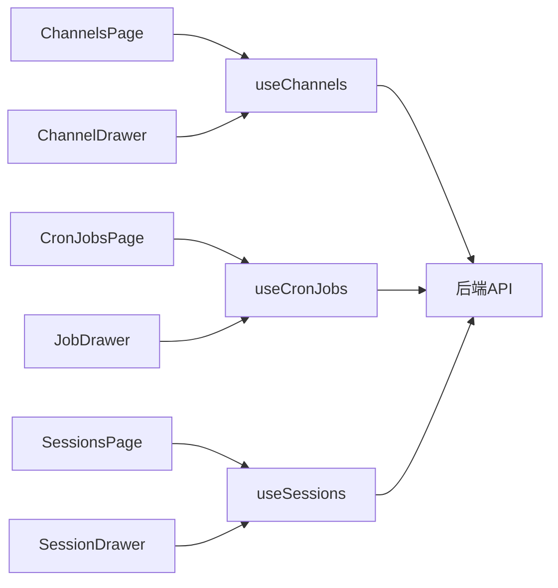

# 控制面板页面

<cite>
**本文引用的文件**
- [console/src/pages/Control/Channels/index.tsx](file://console/src/pages/Control/Channels/index.tsx)
- [console/src/pages/Control/Channels/useChannels.ts](file://console/src/pages/Control/Channels/useChannels.ts)
- [console/src/pages/Control/Channels/components/ChannelCard.tsx](file://console/src/pages/Control/Channels/components/ChannelCard.tsx)
- [console/src/pages/Control/Channels/components/ChannelDrawer.tsx](file://console/src/pages/Control/Channels/components/ChannelDrawer.tsx)
- [console/src/pages/Control/Channels/components/useChannelQrcode.ts](file://console/src/pages/Control/Channels/components/useChannelQrcode.ts)
- [console/src/pages/Control/CronJobs/index.tsx](file://console/src/pages/Control/CronJobs/index.tsx)
- [console/src/pages/Control/CronJobs/useCronJobs.ts](file://console/src/pages/Control/CronJobs/useCronJobs.ts)
- [console/src/pages/Control/CronJobs/components/JobDrawer.tsx](file://console/src/pages/Control/CronJobs/components/JobDrawer.tsx)
- [console/src/pages/Control/CronJobs/components/parseCron.ts](file://console/src/pages/Control/CronJobs/components/parseCron.ts)
- [console/src/pages/Control/Heartbeat/index.tsx](file://console/src/pages/Control/Heartbeat/index.tsx)
- [console/src/pages/Control/Heartbeat/parseEvery.ts](file://console/src/pages/Control/Heartbeat/parseEvery.ts)
- [console/src/pages/Control/Sessions/index.tsx](file://console/src/pages/Control/Sessions/index.tsx)
- [console/src/pages/Control/Sessions/useSessions.ts](file://console/src/pages/Control/Sessions/useSessions.ts)
- [console/src/pages/Control/Sessions/components/SessionDrawer.tsx](file://console/src/pages/Control/Sessions/components/SessionDrawer.tsx)
</cite>

## 目录
1. [简介](#简介)
2. [项目结构](#项目结构)
3. [核心组件](#核心组件)
4. [架构总览](#架构总览)
5. [详细组件分析](#详细组件分析)
6. [依赖关系分析](#依赖关系分析)
7. [性能考虑](#性能考虑)
8. [故障排查指南](#故障排查指南)
9. [结论](#结论)
10. [附录](#附录)

## 简介
本文件面向 QwenPaw 控制面板中的“控制”模块页面，系统性梳理以下页面与自定义 Hook 的实现与交互：渠道管理、定时任务管理、心跳监控、会话管理。内容涵盖数据获取、状态管理、用户交互、权限控制、错误处理与性能优化策略，并通过图示帮助读者快速理解各页面的代码级架构。

## 项目结构
控制面板页面位于前端控制台目录下，采用按功能分页的组织方式，每个页面均配套独立的 Hook 与组件集合，便于复用与维护。

图表来源
- [console/src/pages/Control/Channels/index.tsx:1-164](file://console/src/pages/Control/Channels/index.tsx#L1-L164)
- [console/src/pages/Control/CronJobs/index.tsx:1-238](file://console/src/pages/Control/CronJobs/index.tsx#L1-L238)
- [console/src/pages/Control/Heartbeat/index.tsx:1-272](file://console/src/pages/Control/Heartbeat/index.tsx#L1-L272)
- [console/src/pages/Control/Sessions/index.tsx:1-203](file://console/src/pages/Control/Sessions/index.tsx#L1-L203)

章节来源
- [console/src/pages/Control/Channels/index.tsx:1-164](file://console/src/pages/Control/Channels/index.tsx#L1-L164)
- [console/src/pages/Control/CronJobs/index.tsx:1-238](file://console/src/pages/Control/CronJobs/index.tsx#L1-L238)
- [console/src/pages/Control/Heartbeat/index.tsx:1-272](file://console/src/pages/Control/Heartbeat/index.tsx#L1-L272)
- [console/src/pages/Control/Sessions/index.tsx:1-203](file://console/src/pages/Control/Sessions/index.tsx#L1-L203)

## 核心组件
- 渠道管理页面：负责渠道列表展示、筛选、配置编辑与二维码授权流程。
- 定时任务管理页面：负责 Cron 作业的增删改查、启用/禁用、立即执行与表单序列化/反序列化。
- 心跳监控页面：负责心跳周期、目标选择、时段限制等配置的读取与保存。
- 会话管理页面：负责活跃会话列表、过滤、编辑与批量删除。

章节来源
- [console/src/pages/Control/Channels/index.tsx:1-164](file://console/src/pages/Control/Channels/index.tsx#L1-L164)
- [console/src/pages/Control/CronJobs/index.tsx:1-238](file://console/src/pages/Control/CronJobs/index.tsx#L1-L238)
- [console/src/pages/Control/Heartbeat/index.tsx:1-272](file://console/src/pages/Control/Heartbeat/index.tsx#L1-L272)
- [console/src/pages/Control/Sessions/index.tsx:1-203](file://console/src/pages/Control/Sessions/index.tsx#L1-L203)

## 架构总览
控制面板页面遵循“页面组件 + 自定义 Hook + 页面级组件”的分层设计。页面组件负责 UI 呈现与用户交互；自定义 Hook 负责数据获取、状态管理与业务操作；页面级组件（如抽屉、卡片、列定义）封装可复用 UI 逻辑。

图表来源
- [console/src/pages/Control/Channels/index.tsx:18-161](file://console/src/pages/Control/Channels/index.tsx#L18-L161)
- [console/src/pages/Control/CronJobs/index.tsx:19-235](file://console/src/pages/Control/CronJobs/index.tsx#L19-L235)
- [console/src/pages/Control/Heartbeat/index.tsx:71-269](file://console/src/pages/Control/Heartbeat/index.tsx#L71-L269)
- [console/src/pages/Control/Sessions/index.tsx:16-202](file://console/src/pages/Control/Sessions/index.tsx#L16-L202)

## 详细组件分析

### 渠道管理页面
- 功能要点
  - 列表展示：内置渠道优先、自定义渠道次之；按启用/禁用分组排序。
  - 过滤：全部、内置、自定义三类标签切换。
  - 配置：点击卡片打开抽屉，支持基础字段与各渠道特有字段。
  - 二维码授权：针对部分渠道提供扫码授权流程，自动填充凭据并提示。
- 数据流
  - useChannels 负责拉取渠道清单与类型列表，计算内置顺序与是否内置标识。
  - ChannelDrawer 抽屉根据渠道类型渲染不同表单项，并在需要时触发二维码授权流程。
  - 提交时对工具消息与思考消息过滤开关进行取反处理，再调用后端接口更新。
- 关键交互
  - 卡片点击 -> 设置抽屉初始值 -> 表单提交 -> 刷新列表 -> 成功/失败提示。

图表来源
- [console/src/pages/Control/Channels/index.tsx:18-161](file://console/src/pages/Control/Channels/index.tsx#L18-L161)
- [console/src/pages/Control/Channels/useChannels.ts:5-72](file://console/src/pages/Control/Channels/useChannels.ts#L5-L72)
- [console/src/pages/Control/Channels/components/ChannelDrawer.tsx:99-110](file://console/src/pages/Control/Channels/components/ChannelDrawer.tsx#L99-L110)
- [console/src/pages/Control/Channels/components/useChannelQrcode.ts:35-129](file://console/src/pages/Control/Channels/components/useChannelQrcode.ts#L35-L129)

章节来源
- [console/src/pages/Control/Channels/index.tsx:1-164](file://console/src/pages/Control/Channels/index.tsx#L1-L164)
- [console/src/pages/Control/Channels/useChannels.ts:1-73](file://console/src/pages/Control/Channels/useChannels.ts#L1-L73)
- [console/src/pages/Control/Channels/components/ChannelCard.tsx:1-90](file://console/src/pages/Control/Channels/components/ChannelCard.tsx#L1-L90)
- [console/src/pages/Control/Channels/components/ChannelDrawer.tsx:1-1115](file://console/src/pages/Control/Channels/components/ChannelDrawer.tsx#L1-L1115)
- [console/src/pages/Control/Channels/components/useChannelQrcode.ts:1-130](file://console/src/pages/Control/Channels/components/useChannelQrcode.ts#L1-L130)

### 定时任务管理页面
- 功能要点
  - 列表：表格展示任务，提供启用/禁用、立即执行、编辑、删除等操作。
  - 创建/编辑：统一 JobDrawer 抽屉，支持多种 Cron 类型（每小时/每日/每周/自定义）。
  - 表单解析：parseCron 将 Cron 表达式解析为表单友好格式，再序列化回表达式。
  - 用户时区：首次加载时获取用户时区，作为默认时区写入表单。
- 数据流
  - useCronJobs 统一管理任务列表与 CRUD 操作，支持乐观更新与回滚。
  - 表单提交前将多字段组合为 Cron 表达式，同时对请求输入 JSON 进行校验与解析。
  - 删除/启用切换均弹出二次确认，避免误操作。

图表来源
- [console/src/pages/Control/CronJobs/index.tsx:19-235](file://console/src/pages/Control/CronJobs/index.tsx#L19-L235)
- [console/src/pages/Control/CronJobs/useCronJobs.ts:9-139](file://console/src/pages/Control/CronJobs/useCronJobs.ts#L9-L139)
- [console/src/pages/Control/CronJobs/components/JobDrawer.tsx:30-418](file://console/src/pages/Control/CronJobs/components/JobDrawer.tsx#L30-L418)
- [console/src/pages/Control/CronJobs/components/parseCron.ts:55-148](file://console/src/pages/Control/CronJobs/components/parseCron.ts#L55-L148)

章节来源
- [console/src/pages/Control/CronJobs/index.tsx:1-238](file://console/src/pages/Control/CronJobs/index.tsx#L1-L238)
- [console/src/pages/Control/CronJobs/useCronJobs.ts:1-140](file://console/src/pages/Control/CronJobs/useCronJobs.ts#L1-L140)
- [console/src/pages/Control/CronJobs/components/JobDrawer.tsx:1-420](file://console/src/pages/Control/CronJobs/components/JobDrawer.tsx#L1-L420)
- [console/src/pages/Control/CronJobs/components/parseCron.ts:1-259](file://console/src/pages/Control/CronJobs/components/parseCron.ts#L1-L259)

### 心跳监控页面
- 功能要点
  - 配置项：启用开关、间隔（分钟/小时）、目标（主代理/最后代理）、时段限制（开始/结束）。
  - 表单解析：parseEvery 将后端字符串解析为数字+单位，保存时序列化回字符串。
  - 代理联动：配置加载与 selectedAgent 变更绑定，确保不同代理的心跳配置独立。
- 数据流
  - 加载配置 -> 解析 every -> 设置表单初始值。
  - 提交时将表单值序列化为 HeartbeatConfig，调用后端接口保存。

图表来源
- [console/src/pages/Control/Heartbeat/index.tsx:71-269](file://console/src/pages/Control/Heartbeat/index.tsx#L71-L269)
- [console/src/pages/Control/Heartbeat/parseEvery.ts:16-43](file://console/src/pages/Control/Heartbeat/parseEvery.ts#L16-L43)

章节来源
- [console/src/pages/Control/Heartbeat/index.tsx:1-272](file://console/src/pages/Control/Heartbeat/index.tsx#L1-L272)
- [console/src/pages/Control/Heartbeat/parseEvery.ts:1-44](file://console/src/pages/Control/Heartbeat/parseEvery.ts#L1-L44)

### 会话管理页面
- 功能要点
  - 列表：表格展示活跃会话，支持按用户 ID 与渠道类型过滤。
  - 编辑：打开抽屉修改会话名称，提交后刷新列表。
  - 批量删除：勾选多条后弹出确认，成功后清空选中。
  - 渠道类型：首次加载时拉取可用渠道类型用于过滤。
- 数据流
  - useSessions 统一管理会话列表与 CRUD 操作，支持批量删除。
  - 过滤器变化时本地过滤，不触发后端请求。

图表来源
- [console/src/pages/Control/Sessions/index.tsx:16-202](file://console/src/pages/Control/Sessions/index.tsx#L16-L202)
- [console/src/pages/Control/Sessions/useSessions.ts:9-97](file://console/src/pages/Control/Sessions/useSessions.ts#L9-L97)
- [console/src/pages/Control/Sessions/components/SessionDrawer.tsx:16-76](file://console/src/pages/Control/Sessions/components/SessionDrawer.tsx#L16-L76)

章节来源
- [console/src/pages/Control/Sessions/index.tsx:1-203](file://console/src/pages/Control/Sessions/index.tsx#L1-L203)
- [console/src/pages/Control/Sessions/useSessions.ts:1-98](file://console/src/pages/Control/Sessions/useSessions.ts#L1-L98)
- [console/src/pages/Control/Sessions/components/SessionDrawer.tsx:1-77](file://console/src/pages/Control/Sessions/components/SessionDrawer.tsx#L1-L77)

### 自定义 Hook 实现与使用方法
- useChannels
  - 职责：拉取渠道与类型、计算内置顺序、暴露 isBuiltin 判断、提供刷新方法。
  - 使用：在 ChannelsPage 中解构使用，配合 ChannelCard/ChannelDrawer。
- useCronJobs
  - 职责：统一管理任务列表与 CRUD，支持乐观更新、启用切换、立即执行、删除。
  - 使用：在 CronJobsPage 中解构使用，配合 JobDrawer 与列定义。
- useSessions
  - 职责：统一管理会话列表与 CRUD，支持批量删除。
  - 使用：在 SessionsPage 中解构使用，配合 SessionDrawer 与过滤栏。

图表来源
- [console/src/pages/Control/Channels/useChannels.ts:5-72](file://console/src/pages/Control/Channels/useChannels.ts#L5-L72)
- [console/src/pages/Control/CronJobs/useCronJobs.ts:9-139](file://console/src/pages/Control/CronJobs/useCronJobs.ts#L9-L139)
- [console/src/pages/Control/Sessions/useSessions.ts:9-97](file://console/src/pages/Control/Sessions/useSessions.ts#L9-L97)

章节来源
- [console/src/pages/Control/Channels/useChannels.ts:1-73](file://console/src/pages/Control/Channels/useChannels.ts#L1-L73)
- [console/src/pages/Control/CronJobs/useCronJobs.ts:1-140](file://console/src/pages/Control/CronJobs/useCronJobs.ts#L1-L140)
- [console/src/pages/Control/Sessions/useSessions.ts:1-98](file://console/src/pages/Control/Sessions/useSessions.ts#L1-L98)

## 依赖关系分析
- 页面到 Hook：页面组件通过解构 Hook 的状态与方法完成数据与行为的绑定。
- Hook 到 API：Hook 内部封装网络请求，统一错误处理与消息反馈。
- 组件到 Hook：子组件（抽屉、卡片、列定义）通过回调与 Hook 交互，实现数据回传与状态刷新。
- 时序与并发：useCronJobs 在更新/删除/启用切换时采用乐观更新并在失败时回滚，提升交互体验。

图表来源
- [console/src/pages/Control/Channels/index.tsx:18-161](file://console/src/pages/Control/Channels/index.tsx#L18-L161)
- [console/src/pages/Control/CronJobs/index.tsx:19-235](file://console/src/pages/Control/CronJobs/index.tsx#L19-L235)
- [console/src/pages/Control/Sessions/index.tsx:16-202](file://console/src/pages/Control/Sessions/index.tsx#L16-L202)
- [console/src/pages/Control/Channels/useChannels.ts:13-28](file://console/src/pages/Control/Channels/useChannels.ts#L13-L28)
- [console/src/pages/Control/CronJobs/useCronJobs.ts:15-28](file://console/src/pages/Control/CronJobs/useCronJobs.ts#L15-L28)
- [console/src/pages/Control/Sessions/useSessions.ts:16-28](file://console/src/pages/Control/Sessions/useSessions.ts#L16-L28)

章节来源
- [console/src/pages/Control/Channels/index.tsx:1-164](file://console/src/pages/Control/Channels/index.tsx#L1-L164)
- [console/src/pages/Control/CronJobs/index.tsx:1-238](file://console/src/pages/Control/CronJobs/index.tsx#L1-L238)
- [console/src/pages/Control/Sessions/index.tsx:1-203](file://console/src/pages/Control/Sessions/index.tsx#L1-L203)
- [console/src/pages/Control/Channels/useChannels.ts:1-73](file://console/src/pages/Control/Channels/useChannels.ts#L1-L73)
- [console/src/pages/Control/CronJobs/useCronJobs.ts:1-140](file://console/src/pages/Control/CronJobs/useCronJobs.ts#L1-L140)
- [console/src/pages/Control/Sessions/useSessions.ts:1-98](file://console/src/pages/Control/Sessions/useSessions.ts#L1-L98)

## 性能考虑
- 列表渲染
  - ChannelsPage 对卡片进行分组与排序，避免每次渲染重复计算，使用 useMemo 保持稳定顺序。
  - CronJobsPage 与 SessionsPage 使用分页与横向滚动，减少 DOM 节点数量。
- 异步加载
  - useCronJobs 与 useSessions 在挂载时仅加载一次，避免频繁请求；useChannels 在代理切换时才重新加载。
- 乐观更新
  - useCronJobs 在更新/删除/启用切换时先本地更新，失败时回滚，降低等待时间。
- 表单解析
  - parseCron 与 parseEvery 仅在必要时解析/序列化，避免重复计算。
- 资源释放
  - useChannelQrcode 在卸载时清理轮询定时器，防止内存泄漏。

章节来源
- [console/src/pages/Control/Channels/index.tsx:30-52](file://console/src/pages/Control/Channels/index.tsx#L30-L52)
- [console/src/pages/Control/CronJobs/index.tsx:212-222](file://console/src/pages/Control/CronJobs/index.tsx#L212-L222)
- [console/src/pages/Control/Sessions/index.tsx:173-187](file://console/src/pages/Control/Sessions/index.tsx#L173-L187)
- [console/src/pages/Control/CronJobs/useCronJobs.ts:60-78](file://console/src/pages/Control/CronJobs/useCronJobs.ts#L60-L78)
- [console/src/pages/Control/Channels/components/useChannelQrcode.ts:53-64](file://console/src/pages/Control/Channels/components/useChannelQrcode.ts#L53-L64)

## 故障排查指南
- 渠道配置保存失败
  - 现象：提交后弹出错误提示。
  - 排查：检查后端返回与网络状态；确认表单必填项与格式；查看日志输出。
  - 处理：重试提交或检查渠道凭据有效性。
- 二维码授权失败/过期
  - 现象：二维码加载失败或提示过期。
  - 排查：确认网络连通性与后端二维码接口；检查轮询令牌与状态字段。
  - 处理：重新获取二维码；若过期则重新发起授权。
- 定时任务立即执行失败
  - 现象：弹出执行失败提示。
  - 排查：检查任务是否存在、调度器状态、后端触发接口。
  - 处理：修复任务配置后重试。
- 会话批量删除失败
  - 现象：弹出删除失败提示。
  - 排查：确认所选会话 ID 是否有效；检查后端批量删除接口。
  - 处理：单独删除或修正参数后重试。

章节来源
- [console/src/pages/Control/Channels/components/ChannelDrawer.tsx:116-139](file://console/src/pages/Control/Channels/components/ChannelDrawer.tsx#L116-L139)
- [console/src/pages/Control/CronJobs/index.tsx:113-124](file://console/src/pages/Control/CronJobs/index.tsx#L113-L124)
- [console/src/pages/Control/Sessions/index.tsx:91-112](file://console/src/pages/Control/Sessions/index.tsx#L91-L112)

## 结论
控制面板页面通过清晰的分层设计与自定义 Hook，实现了渠道、定时任务、心跳与会话的高效管理。页面组件专注于交互与呈现，Hook 负责状态与数据，组件库与解析器提供可复用能力。整体具备良好的扩展性与可维护性，适合后续继续完善权限控制、告警机制与国际化支持。

## 附录
- 权限控制建议
  - 页面路由与菜单项应结合用户角色进行鉴权；对敏感操作（删除、启用切换、二维码授权）增加二次确认与审计日志。
- 错误处理建议
  - 统一错误边界与全局消息提示；对网络异常与业务异常分别处理；在 Hook 层集中处理错误并反馈给页面。
- 性能优化建议
  - 对长列表启用虚拟滚动；对高频轮询（如二维码状态）设置合理的超时与退避策略；缓存静态配置与类型列表。
- 数据模型与字段映射
  - 渠道配置：基础字段 + 各渠道特有字段；提交前对布尔字段取反处理。
  - 定时任务：Cron 表达式与表单字段双向转换；请求输入需校验 JSON 格式。
  - 心跳配置：every 字符串解析为数字+单位；支持时段限制。
  - 会话管理：支持按用户 ID 与渠道类型过滤；批量删除与单条删除分离。