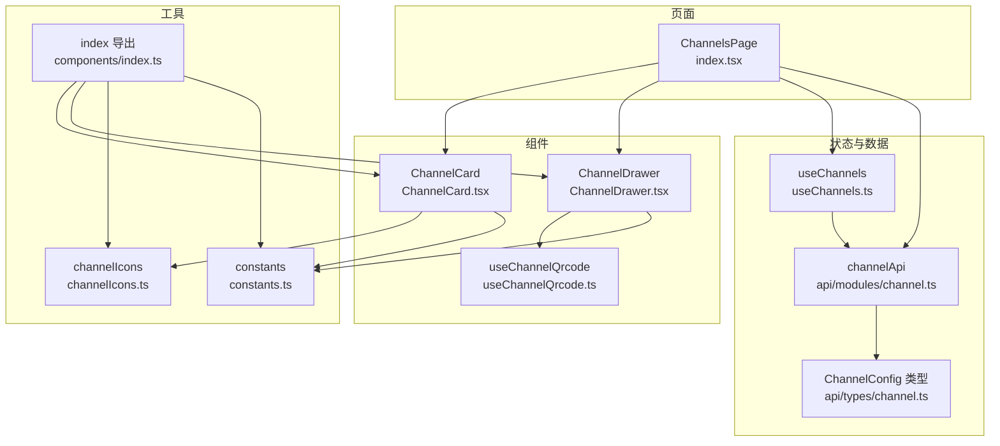
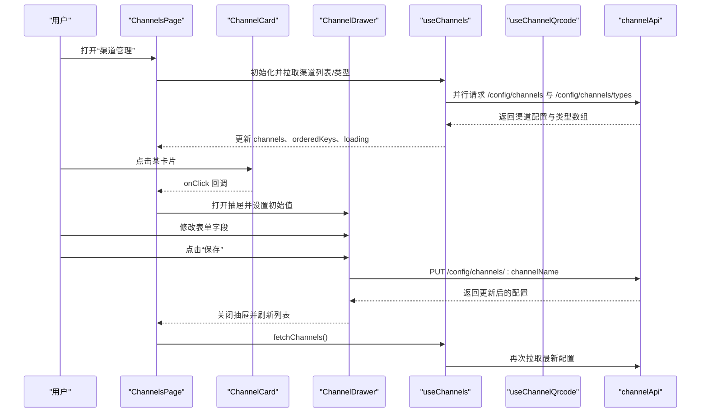
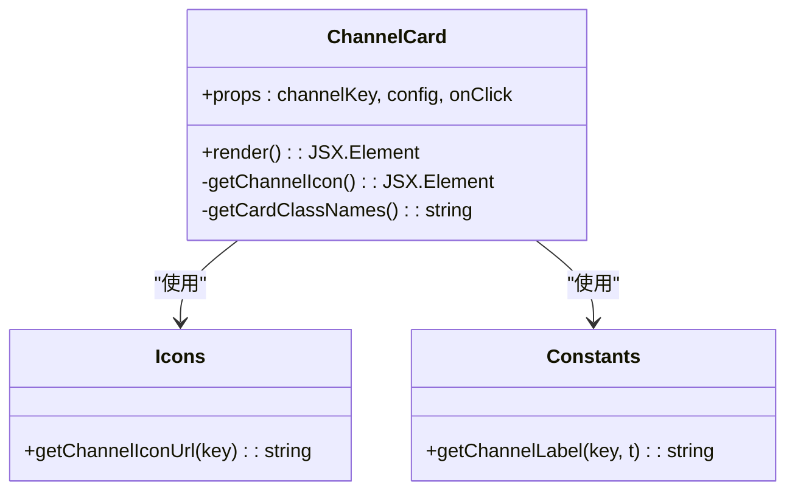
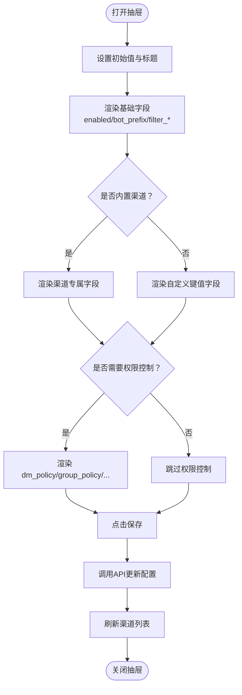
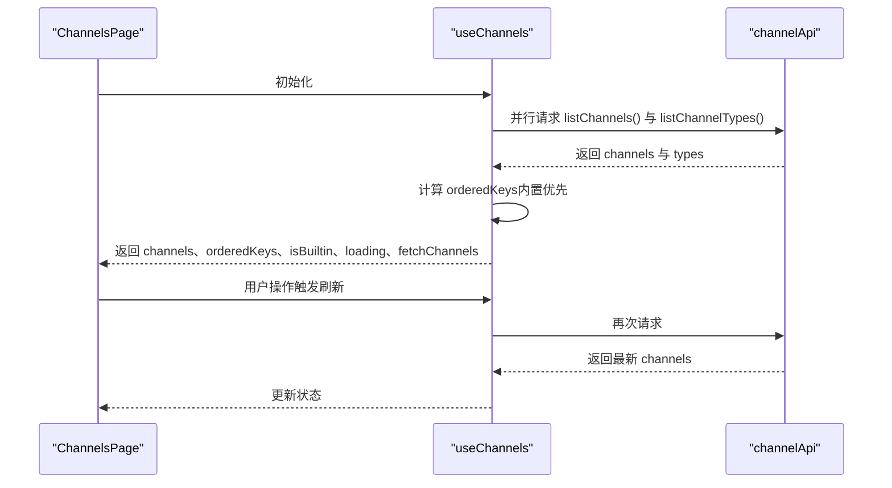
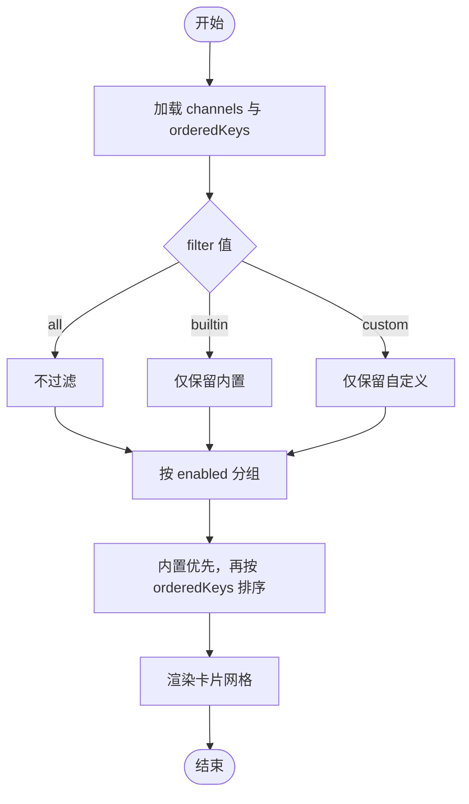
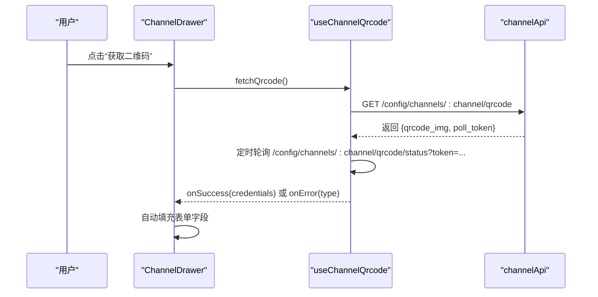
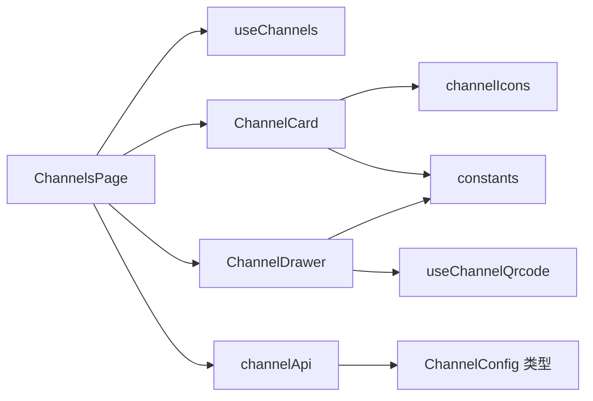

# 渠道管理

<cite>
**本文引用的文件**
- [index.tsx](file://console/src/pages/Control/Channels/index.tsx)
- [useChannels.ts](file://console/src/pages/Control/Channels/useChannels.ts)
- [ChannelCard.tsx](file://console/src/pages/Control/Channels/components/ChannelCard.tsx)
- [ChannelDrawer.tsx](file://console/src/pages/Control/Channels/components/ChannelDrawer.tsx)
- [channelIcons.ts](file://console/src/pages/Control/Channels/components/channelIcons.ts)
- [constants.ts](file://console/src/pages/Control/Channels/components/constants.ts)
- [useChannelQrcode.ts](file://console/src/pages/Control/Channels/components/useChannelQrcode.ts)
- [index.module.less](file://console/src/pages/Control/Channels/index.module.less)
- [channel.ts](file://console/src/api/modules/channel.ts)
- [channel.ts（类型）](file://console/src/api/types/channel.ts)
- [index.ts（组件导出）](file://console/src/pages/Control/Channels/components/index.ts)
</cite>

## 目录
1. [简介](#简介)
2. [项目结构](#项目结构)
3. [核心组件](#核心组件)
4. [架构总览](#架构总览)
5. [详细组件分析](#详细组件分析)
6. [依赖关系分析](#依赖关系分析)
7. [性能考量](#性能考量)
8. [故障排查指南](#故障排查指南)
9. [结论](#结论)
10. [附录](#附录)

## 简介
本文件面向QwenPaw控制台“渠道管理”功能，系统性解析前端页面架构与交互流程，覆盖以下主题：
- 渠道卡片展示：图标、启用状态、内置/自定义标签、Bot前缀提示
- 渠道配置抽屉：表单渲染、字段类型、权限控制、二维码登录
- 渠道状态切换与过滤：内置/自定义过滤、启用/禁用排序
- 自定义Hook：useChannels的数据获取、状态管理与实时刷新
- 配置字段说明：bot_prefix、filter_tool_messages、filter_thinking等
- 二维码生成与权限控制：基于useChannelQrcode的通用授权流程

## 项目结构
控制台渠道管理位于控制页下的“Channels”目录，采用按功能分层组织：
- 页面入口：ChannelsPage（负责过滤、排序、抽屉打开/关闭、提交）
- 组件：ChannelCard（卡片）、ChannelDrawer（抽屉）、useChannelQrcode（二维码钩子）
- 工具：channelIcons（图标映射）、constants（标签与键类型）、useChannels（数据钩子）
- API：channel.ts（后端接口封装）

图表来源
- [index.tsx:18-161](file://console/src/pages/Control/Channels/index.tsx#L18-L161)
- [useChannels.ts:5-72](file://console/src/pages/Control/Channels/useChannels.ts#L5-L72)
- [ChannelCard.tsx:14-89](file://console/src/pages/Control/Channels/components/ChannelCard.tsx#L14-L89)
- [ChannelDrawer.tsx:99-1114](file://console/src/pages/Control/Channels/components/ChannelDrawer.tsx#L99-L1114)
- [useChannelQrcode.ts:35-129](file://console/src/pages/Control/Channels/components/useChannelQrcode.ts#L35-L129)
- [channelIcons.ts:34-36](file://console/src/pages/Control/Channels/components/channelIcons.ts#L34-L36)
- [constants.ts:33-39](file://console/src/pages/Control/Channels/components/constants.ts#L33-L39)
- [channel.ts:4-43](file://console/src/api/modules/channel.ts#L4-L43)
- [channel.ts（类型）:121-153](file://console/src/api/types/channel.ts#L121-L153)

章节来源
- [index.tsx:1-164](file://console/src/pages/Control/Channels/index.tsx#L1-L164)
- [useChannels.ts:1-73](file://console/src/pages/Control/Channels/useChannels.ts#L1-L73)
- [ChannelCard.tsx:1-90](file://console/src/pages/Control/Channels/components/ChannelCard.tsx#L1-L90)
- [ChannelDrawer.tsx:1-1115](file://console/src/pages/Control/Channels/components/ChannelDrawer.tsx#L1-L1115)
- [useChannelQrcode.ts:1-130](file://console/src/pages/Control/Channels/components/useChannelQrcode.ts#L1-L130)
- [channelIcons.ts:1-37](file://console/src/pages/Control/Channels/components/channelIcons.ts#L1-L37)
- [constants.ts:1-40](file://console/src/pages/Control/Channels/components/constants.ts#L1-L40)
- [channel.ts:1-44](file://console/src/api/modules/channel.ts#L1-L44)
- [channel.ts（类型）:1-153](file://console/src/api/types/channel.ts#L1-L153)
- [index.module.less:1-417](file://console/src/pages/Control/Channels/index.module.less#L1-L417)

## 核心组件
- ChannelsPage：聚合过滤、排序、抽屉、表单与提交逻辑；调用useChannels获取渠道数据并维护本地状态
- ChannelCard：展示渠道图标、启用状态、内置/自定义标签、Bot前缀；支持悬停态与点击事件
- ChannelDrawer：渲染基础字段与渠道专属字段，支持权限控制字段、二维码登录、表单提交
- useChannels：统一拉取渠道列表与类型，计算内置/自定义顺序，暴露加载状态与刷新函数
- useChannelQrcode：通用二维码授权流程（获取二维码、轮询状态、自动填充凭据）
- channelIcons/constants：图标URL与渠道标签国际化

章节来源
- [index.tsx:18-161](file://console/src/pages/Control/Channels/index.tsx#L18-L161)
- [useChannels.ts:5-72](file://console/src/pages/Control/Channels/useChannels.ts#L5-L72)
- [ChannelCard.tsx:14-89](file://console/src/pages/Control/Channels/components/ChannelCard.tsx#L14-L89)
- [ChannelDrawer.tsx:99-1114](file://console/src/pages/Control/Channels/components/ChannelDrawer.tsx#L99-L1114)
- [useChannelQrcode.ts:35-129](file://console/src/pages/Control/Channels/components/useChannelQrcode.ts#L35-L129)
- [channelIcons.ts:34-36](file://console/src/pages/Control/Channels/components/channelIcons.ts#L34-L36)
- [constants.ts:33-39](file://console/src/pages/Control/Channels/components/constants.ts#L33-L39)

## 架构总览
整体采用“页面-组件-钩子-API-类型”的分层设计，页面负责编排，组件负责渲染与交互，钩子负责状态与副作用，API封装请求，类型约束配置结构。

图表来源
- [index.tsx:21-100](file://console/src/pages/Control/Channels/index.tsx#L21-L100)
- [useChannels.ts:13-32](file://console/src/pages/Control/Channels/useChannels.ts#L13-L32)
- [channel.ts:4-43](file://console/src/api/modules/channel.ts#L4-L43)

## 详细组件分析

### ChannelCard 组件
职责与行为
- 展示渠道图标（CDN地址）、启用/禁用状态指示、内置/自定义标签、Bot前缀
- 支持悬停态与点击回调，用于打开配置抽屉
- 图标与标签通过工具模块提供

实现要点
- 图标：根据渠道键从图标映射中取URL，兜底默认图标
- 标签：优先使用国际化键，否则格式化自定义键
- 状态：根据config.enabled与isBuiltin决定样式与文案

图表来源
- [ChannelCard.tsx:14-89](file://console/src/pages/Control/Channels/components/ChannelCard.tsx#L14-L89)
- [channelIcons.ts:34-36](file://console/src/pages/Control/Channels/components/channelIcons.ts#L34-L36)
- [constants.ts:33-39](file://console/src/pages/Control/Channels/components/constants.ts#L33-L39)

章节来源
- [ChannelCard.tsx:14-89](file://console/src/pages/Control/Channels/components/ChannelCard.tsx#L14-L89)
- [channelIcons.ts:34-36](file://console/src/pages/Control/Channels/components/channelIcons.ts#L34-L36)
- [constants.ts:33-39](file://console/src/pages/Control/Channels/components/constants.ts#L33-L39)

### ChannelDrawer 抽屉组件
职责与行为
- 渲染基础字段：enabled、bot_prefix、filter_tool_messages、filter_thinking
- 渲染渠道专属字段：按渠道类型动态渲染（如Discord、DingTalk、WeCom、WeChat、MQTT等）
- 权限控制字段：dm_policy、group_policy、require_mention、allow_from（对特定渠道生效）
- 二维码登录：集成useChannelQrcode，支持WeChat、DingTalk、WeCom的扫码授权
- 表单提交：校验后调用API更新单个渠道配置，并刷新页面

字段说明（基础与通用）
- enabled：布尔开关，控制渠道是否启用
- bot_prefix：字符串，用于识别@bot消息的前缀
- filter_tool_messages：布尔开关，过滤工具消息
- filter_thinking：布尔开关，过滤思考过程
- isBuiltin：布尔标记，来自后端响应，标识是否内置渠道

渠道专属字段（节选）
- Discord：bot_token、http_proxy、http_proxy_auth、accept_bot_messages
- DingTalk：client_id、client_secret、message_type、card_template_id、card_template_key、robot_code
- WeCom：bot_id、secret、media_dir、welcome_text
- WeChat：bot_token、bot_token_file、media_dir
- MQTT：host、port、transport、clean_session、qos、username、password、subscribe_topic、publish_topic、tls_* 系列
- Telegram：bot_token、http_proxy、http_proxy_auth、show_typing
- Voice/Twilio：twilio_account_sid、twilio_auth_token、phone_number、phone_number_sid、tts_provider、tts_voice、stt_provider、language、welcome_greeting
- Matrix：homeserver、user_id、access_token
- Mattermost：url、bot_token、media_dir、show_typing、thread_follow_without_mention
- XiaoYi：ak、sk、agent_id、ws_url
- OneBot：ws_host、ws_port、access_token、share_session_in_group

权限控制字段（对部分渠道生效）
- dm_policy：私聊策略（open/allowlist）
- group_policy：群组策略（open/allowlist）
- require_mention：是否必须@机器人
- allow_from：允许来源白名单（多值）

图表来源
- [ChannelDrawer.tsx:1052-1114](file://console/src/pages/Control/Channels/components/ChannelDrawer.tsx#L1052-L1114)
- [ChannelDrawer.tsx:249-955](file://console/src/pages/Control/Channels/components/ChannelDrawer.tsx#L249-L955)
- [channel.ts:20-27](file://console/src/api/modules/channel.ts#L20-L27)

章节来源
- [ChannelDrawer.tsx:99-1114](file://console/src/pages/Control/Channels/components/ChannelDrawer.tsx#L99-L1114)
- [channel.ts:4-43](file://console/src/api/modules/channel.ts#L4-L43)
- [channel.ts（类型）:121-153](file://console/src/api/types/channel.ts#L121-L153)

### useChannels 自定义Hook
职责与行为
- 拉取渠道列表与类型：并行请求，避免串行阻塞
- 计算内置渠道优先顺序与最终排序：内置在前，自定义在后
- 提供 isBuiltin 判断与 fetchChannels 刷新函数
- 管理 loading 状态与 channels 数据

图表来源
- [useChannels.ts:13-32](file://console/src/pages/Control/Channels/useChannels.ts#L13-L32)
- [useChannels.ts:50-62](file://console/src/pages/Control/Channels/useChannels.ts#L50-L62)
- [channel.ts:5-7](file://console/src/api/modules/channel.ts#L5-L7)

章节来源
- [useChannels.ts:5-72](file://console/src/pages/Control/Channels/useChannels.ts#L5-L72)
- [channel.ts:5-7](file://console/src/api/modules/channel.ts#L5-L7)

### 渠道过滤与排序
- 过滤类型：全部、内置、自定义
- 排序规则：启用的渠道优先于禁用的渠道；同组内保持 orderedKeys 的相对顺序
- 内置渠道顺序：固定顺序（console、dingtalk、feishu、imessage、discord、telegram、qq、matrix、xiaoyi），仅包含已注册类型

图表来源
- [index.tsx:30-52](file://console/src/pages/Control/Channels/index.tsx#L30-L52)
- [useChannels.ts:34-56](file://console/src/pages/Control/Channels/useChannels.ts#L34-L56)

章节来源
- [index.tsx:30-52](file://console/src/pages/Control/Channels/index.tsx#L30-L52)
- [useChannels.ts:34-56](file://console/src/pages/Control/Channels/useChannels.ts#L34-L56)

### 二维码生成与权限控制
- 适用渠道：WeChat、DingTalk、WeCom（部分渠道）
- 流程：获取二维码 -> 轮询状态 -> 成功则自动填充凭据 -> 失败或过期提示
- Hook参数：channel、successStatus、successCredentialKey、pollInterval、onSuccess/onExpired/onError
- UI：按钮触发获取二维码，显示二维码图片与提示，暗色模式下适配

图表来源
- [ChannelDrawer.tsx:116-194](file://console/src/pages/Control/Channels/components/ChannelDrawer.tsx#L116-L194)
- [useChannelQrcode.ts:66-123](file://console/src/pages/Control/Channels/components/useChannelQrcode.ts#L66-L123)
- [channel.ts:29-42](file://console/src/api/modules/channel.ts#L29-L42)

章节来源
- [ChannelDrawer.tsx:116-194](file://console/src/pages/Control/Channels/components/ChannelDrawer.tsx#L116-L194)
- [useChannelQrcode.ts:35-129](file://console/src/pages/Control/Channels/components/useChannelQrcode.ts#L35-L129)
- [channel.ts:29-42](file://console/src/api/modules/channel.ts#L29-L42)

## 依赖关系分析
- 页面依赖：useChannels、ChannelCard、ChannelDrawer、Form、PageHeader、国际化与消息提示
- 组件依赖：icons、constants、useChannelQrcode
- 数据依赖：channelApi（类型安全的请求封装）、ChannelConfig 类型定义
- 样式：index.module.less 提供卡片与抽屉的视觉规范

图表来源
- [index.tsx:18-161](file://console/src/pages/Control/Channels/index.tsx#L18-L161)
- [useChannels.ts:5-72](file://console/src/pages/Control/Channels/useChannels.ts#L5-L72)
- [ChannelCard.tsx:14-89](file://console/src/pages/Control/Channels/components/ChannelCard.tsx#L14-L89)
- [ChannelDrawer.tsx:99-1114](file://console/src/pages/Control/Channels/components/ChannelDrawer.tsx#L99-L1114)
- [useChannelQrcode.ts:35-129](file://console/src/pages/Control/Channels/components/useChannelQrcode.ts#L35-L129)
- [channel.ts:4-43](file://console/src/api/modules/channel.ts#L4-L43)
- [channel.ts（类型）:121-153](file://console/src/api/types/channel.ts#L121-L153)

章节来源
- [index.tsx:18-161](file://console/src/pages/Control/Channels/index.tsx#L18-L161)
- [channel.ts:4-43](file://console/src/api/modules/channel.ts#L4-L43)
- [channel.ts（类型）:121-153](file://console/src/api/types/channel.ts#L121-L153)

## 性能考量
- 并行请求：useChannels内部对列表与类型请求进行并行，减少首屏等待时间
- 计算缓存：orderedKeys与isBuiltin通过 useMemo 缓存，避免重复计算
- 表单与渲染：抽屉按需渲染，销毁时清理轮询，降低内存占用
- 图标与标签：静态映射与纯函数，渲染成本低

## 故障排查指南
常见问题与定位建议
- 无法加载渠道列表
  - 检查网络与后端接口连通性
  - 查看useChannels中的错误日志与loading状态
- 保存失败
  - 查看提交流程中的错误提示与后端返回
  - 确认字段类型与必填项（如各渠道的专属字段）
- 二维码未成功
  - 确认 fetchQrcode 是否成功返回qrcode_img与poll_token
  - 观察轮询状态是否变为成功状态并携带凭据
  - 若提示过期，重新获取二维码
- 权限控制无效
  - 确认当前渠道是否在权限控制列表中
  - 检查dm_policy/group_policy/require_mention/allow_from 的取值范围

章节来源
- [index.tsx:94-99](file://console/src/pages/Control/Channels/index.tsx#L94-L99)
- [useChannels.ts:23-27](file://console/src/pages/Control/Channels/useChannels.ts#L23-L27)
- [useChannelQrcode.ts:66-123](file://console/src/pages/Control/Channels/components/useChannelQrcode.ts#L66-L123)

## 结论
渠道管理页面以清晰的分层架构实现了“卡片展示—配置抽屉—数据钩子—API请求”的闭环。通过useChannels统一管理渠道数据与排序，ChannelDrawer灵活渲染不同渠道的专属字段与权限控制，配合useChannelQrcode简化了扫码授权流程。整体设计兼顾可扩展性与易用性，便于后续新增渠道类型与增强配置能力。

## 附录

### 字段说明与使用方法
- enabled
  - 类型：布尔
  - 作用：控制渠道启停
  - 使用：抽屉基础字段，卡片状态指示
- bot_prefix
  - 类型：字符串
  - 作用：识别@bot消息的前缀
  - 使用：抽屉基础字段；卡片底部显示
- filter_tool_messages
  - 类型：布尔
  - 作用：过滤工具消息
  - 使用：抽屉基础字段
- filter_thinking
  - 类型：布尔
  - 作用：过滤思考过程
  - 使用：抽屉基础字段
- isBuiltin
  - 类型：布尔
  - 作用：标识是否内置渠道
  - 来源：后端响应字段
- 渠道专属字段（示例）
  - Discord：bot_token、http_proxy、http_proxy_auth、accept_bot_messages
  - DingTalk：client_id、client_secret、message_type、card_template_id、card_template_key、robot_code
  - WeCom：bot_id、secret、media_dir、welcome_text
  - WeChat：bot_token、bot_token_file、media_dir
  - MQTT：host、port、transport、clean_session、qos、username、password、subscribe_topic、publish_topic、tls_* 系列
  - Telegram：bot_token、http_proxy、http_proxy_auth、show_typing
  - Voice/Twilio：twilio_account_sid、twilio_auth_token、phone_number、phone_number_sid、tts_provider、tts_voice、stt_provider、language、welcome_greeting
  - Matrix：homeserver、user_id、access_token
  - Mattermost：url、bot_token、media_dir、show_typing、thread_follow_without_mention
  - XiaoYi：ak、sk、agent_id、ws_url
  - OneBot：ws_host、ws_port、access_token、share_session_in_group

章节来源
- [ChannelDrawer.tsx:1077-1102](file://console/src/pages/Control/Channels/components/ChannelDrawer.tsx#L1077-L1102)
- [channel.ts（类型）:121-153](file://console/src/api/types/channel.ts#L121-L153)