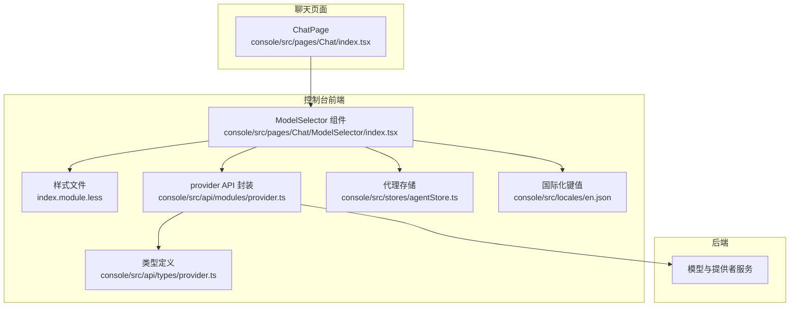
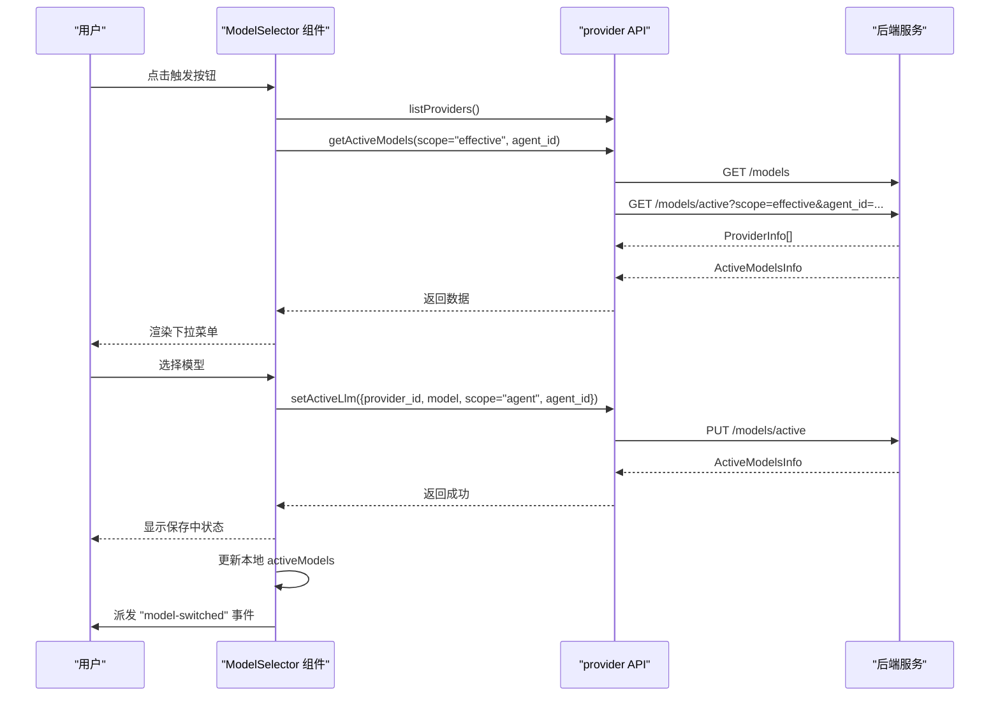
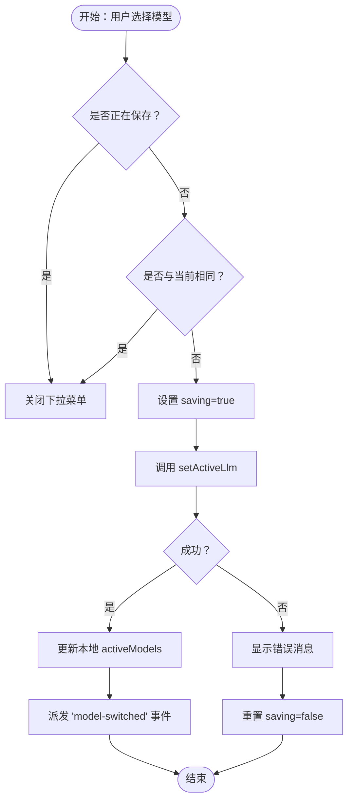
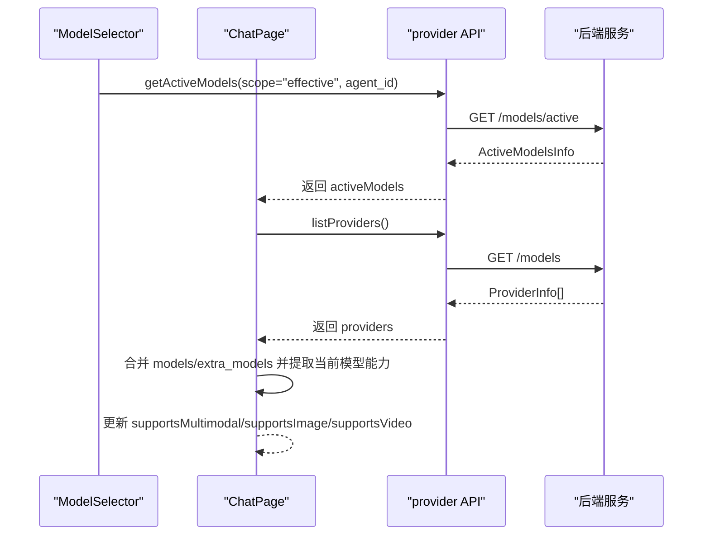
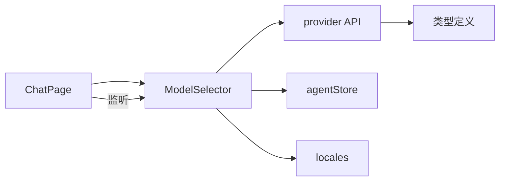

# 模型选择器组件

<cite>
**本文档引用的文件**
- [console/src/pages/Chat/ModelSelector/index.tsx](file://console/src/pages/Chat/ModelSelector/index.tsx)
- [console/src/pages/Chat/ModelSelector/index.module.less](file://console/src/pages/Chat/ModelSelector/index.module.less)
- [console/src/api/modules/provider.ts](file://console/src/api/modules/provider.ts)
- [console/src/api/types/provider.ts](file://console/src/api/types/provider.ts)
- [console/src/pages/Chat/index.tsx](file://console/src/pages/Chat/index.tsx)
- [src/qwenpaw/providers/multimodal_prober.py](file://src/qwenpaw/providers/multimodal_prober.py)
- [console/src/stores/agentStore.ts](file://console/src/stores/agentStore.ts)
- [console/src/locales/en.json](file://console/src/locales/en.json)
</cite>

## 目录
1. [简介](#简介)
2. [项目结构](#项目结构)
3. [核心组件](#核心组件)
4. [架构总览](#架构总览)
5. [详细组件分析](#详细组件分析)
6. [依赖关系分析](#依赖关系分析)
7. [性能考虑](#性能考虑)
8. [故障排除指南](#故障排除指南)
9. [结论](#结论)

## 简介
本文件为 QwenPaw 控制台中“模型选择器”组件的深度技术文档。该组件负责在聊天界面顶部展示并允许用户切换当前生效的 LLM（大语言模型），并与后端 API 进行交互以获取可用模型列表、查询当前激活模型，并在切换时更新后端状态。组件还与聊天页面协作，实现多模态能力检测与 UI 提示联动。

## 项目结构
模型选择器位于控制台前端的聊天页面中，采用 React 组件形式实现，样式通过 CSS Modules 管理，数据通过 provider API 访问后端。

图表来源
- [console/src/pages/Chat/ModelSelector/index.tsx:1-267](file://console/src/pages/Chat/ModelSelector/index.tsx#L1-L267)
- [console/src/pages/Chat/ModelSelector/index.module.less:1-261](file://console/src/pages/Chat/ModelSelector/index.module.less#L1-L261)
- [console/src/api/modules/provider.ts:1-152](file://console/src/api/modules/provider.ts#L1-L152)
- [console/src/api/types/provider.ts:1-177](file://console/src/api/types/provider.ts#L1-L177)
- [console/src/pages/Chat/index.tsx:1-894](file://console/src/pages/Chat/index.tsx#L1-L894)
- [console/src/stores/agentStore.ts:1-89](file://console/src/stores/agentStore.ts#L1-L89)
- [console/src/locales/en.json:650-654](file://console/src/locales/en.json#L650-L654)

章节来源
- [console/src/pages/Chat/ModelSelector/index.tsx:1-267](file://console/src/pages/Chat/ModelSelector/index.tsx#L1-L267)
- [console/src/pages/Chat/ModelSelector/index.module.less:1-261](file://console/src/pages/Chat/ModelSelector/index.module.less#L1-L261)
- [console/src/api/modules/provider.ts:1-152](file://console/src/api/modules/provider.ts#L1-L152)
- [console/src/api/types/provider.ts:1-177](file://console/src/api/types/provider.ts#L1-L177)
- [console/src/pages/Chat/index.tsx:1-894](file://console/src/pages/Chat/index.tsx#L1-L894)
- [console/src/stores/agentStore.ts:1-89](file://console/src/stores/agentStore.ts#L1-L89)
- [console/src/locales/en.json:650-654](file://console/src/locales/en.json#L650-L654)

## 核心组件
- 组件职责
  - 获取并筛选可配置且有模型的提供者列表。
  - 展示当前激活模型名称与提供者图标。
  - 下拉菜单分两级：一级为提供者项，二级为该提供者的模型子菜单。
  - 切换模型时调用后端接口更新激活模型，并通知聊天页面刷新多模态能力。
  - 在路由回到聊天页或打开下拉菜单时，重新同步后端激活模型状态。
  - 处理加载、保存状态与错误提示。

- 关键状态
  - providers：后端返回的提供者列表。
  - activeModels：当前生效的模型槽位信息。
  - loading/saving：加载与保存状态。
  - open：下拉菜单展开状态。
  - eligibleProviders：根据配置与模型数量筛选后的提供者集合。

- 与后端交互
  - 并发请求提供者列表与当前激活模型。
  - 打开下拉菜单时再次同步激活模型。
  - 切换模型时调用设置激活模型接口。

- 与聊天页面联动
  - 切换成功后派发自定义事件，聊天页面监听并刷新多模态能力检测结果。

章节来源
- [console/src/pages/Chat/ModelSelector/index.tsx:24-166](file://console/src/pages/Chat/ModelSelector/index.tsx#L24-L166)
- [console/src/pages/Chat/index.tsx:144-227](file://console/src/pages/Chat/index.tsx#L144-L227)

## 架构总览
模型选择器的前后端交互遵循“前端组件 + API 封装 + 类型定义”的分层设计，组件通过 provider API 封装访问后端，使用类型定义确保数据结构一致性。

图表来源
- [console/src/pages/Chat/ModelSelector/index.tsx:38-55](file://console/src/pages/Chat/ModelSelector/index.tsx#L38-L55)
- [console/src/pages/Chat/ModelSelector/index.tsx:118-135](file://console/src/pages/Chat/ModelSelector/index.tsx#L118-L135)
- [console/src/pages/Chat/ModelSelector/index.tsx:137-166](file://console/src/pages/Chat/ModelSelector/index.tsx#L137-L166)
- [console/src/api/modules/provider.ts:37-53](file://console/src/api/modules/provider.ts#L37-L53)
- [console/src/pages/Chat/index.tsx:217-224](file://console/src/pages/Chat/index.tsx#L217-L224)

## 详细组件分析

### 数据结构与类型
- ProviderInfo
  - 字段：id、name、api_key_prefix、chat_model、models、extra_models、is_custom、is_local、support_model_discovery、support_connection_check、freeze_url、require_api_key、api_key、base_url、generate_kwargs。
  - 作用：描述一个模型提供者及其内置/用户添加的模型集合。

- ModelInfo
  - 字段：id、name、supports_multimodal、supports_image、supports_video、generate_kwargs。
  - 作用：描述具体模型的能力标记与生成参数。

- ActiveModelsInfo
  - 字段：active_llm（可选）。
  - 作用：表示当前生效的模型槽位配置。

- ModelSlotRequest / GetActiveModelsRequest
  - 作用：切换模型与查询激活模型的请求体与查询参数。

章节来源
- [console/src/api/types/provider.ts:1-177](file://console/src/api/types/provider.ts#L1-L177)

### 组件状态管理机制
- 状态来源
  - providers：来自 listProviders 的异步结果。
  - activeModels：来自 getActiveModels 的异步结果。
  - eligibleProviders：基于 providers 过滤与合并 models/extra_models 得到。
  - 当前选中模型：从 activeModels.active_llm.provider_id 与 active_llm.model 推导。

- 同步策略
  - 首次渲染时并发获取 providers 与 activeModels。
  - 路由进入 /chat 时再次同步 activeModels。
  - 打开下拉菜单时每次重新获取 activeModels，保证 UI 与后端一致。

- 错误处理
  - 加载失败时记录日志，保持 UI 可用。
  - 切换失败时弹出消息提示，避免重复提交。

章节来源
- [console/src/pages/Chat/ModelSelector/index.tsx:26-55](file://console/src/pages/Chat/ModelSelector/index.tsx#L26-L55)
- [console/src/pages/Chat/ModelSelector/index.tsx:61-79](file://console/src/pages/Chat/ModelSelector/index.tsx#L61-L79)
- [console/src/pages/Chat/ModelSelector/index.tsx:118-135](file://console/src/pages/Chat/ModelSelector/index.tsx#L118-L135)

### 模型切换逻辑
- 选择流程
  - 若正在保存或目标与当前相同，则直接关闭下拉菜单。
  - 设置 saving 状态，调用 setActiveLlm 更新后端。
  - 成功后更新本地 activeModels，并派发 "model-switched" 自定义事件。
  - 失败时弹出错误消息，恢复 saving 状态。

- 事件联动
  - 聊天页面监听 "model-switched" 事件，触发多模态能力重新检测。

图表来源
- [console/src/pages/Chat/ModelSelector/index.tsx:137-166](file://console/src/pages/Chat/ModelSelector/index.tsx#L137-L166)
- [console/src/pages/Chat/index.tsx:217-224](file://console/src/pages/Chat/index.tsx#L217-L224)

章节来源
- [console/src/pages/Chat/ModelSelector/index.tsx:137-166](file://console/src/pages/Chat/ModelSelector/index.tsx#L137-L166)
- [console/src/pages/Chat/index.tsx:217-224](file://console/src/pages/Chat/index.tsx#L217-L224)

### 多模态能力检测
- 能力字段
  - supports_multimodal、supports_image、supports_video。
- 前端检测
  - 使用 useMultimodalCapabilities 钩子，首次挂载与刷新键变化时获取 providers 与 activeModels，拼接所有模型后提取当前模型的能力标记。
  - 路由回到聊天页或收到 "model-switched" 事件时再次检测。
- 后端探测
  - 提供 probeMultimodal 接口用于探测具体模型的多模态支持情况，返回 supports_image、supports_video、supports_multimodal 以及辅助消息。

图表来源
- [console/src/pages/Chat/index.tsx:144-227](file://console/src/pages/Chat/index.tsx#L144-L227)
- [console/src/api/modules/provider.ts:144-150](file://console/src/api/modules/provider.ts#L144-L150)
- [src/qwenpaw/providers/multimodal_prober.py:75-102](file://src/qwenpaw/providers/multimodal_prober.py#L75-L102)

章节来源
- [console/src/pages/Chat/index.tsx:144-227](file://console/src/pages/Chat/index.tsx#L144-L227)
- [console/src/api/modules/provider.ts:144-150](file://console/src/api/modules/provider.ts#L144-L150)
- [src/qwenpaw/providers/multimodal_prober.py:75-102](file://src/qwenpaw/providers/multimodal_prober.py#L75-L102)

### UI 设计与交互
- 触发按钮
  - 显示当前激活模型名称与提供者图标，支持悬停与展开态样式。
  - 保存中状态显示加载图标。
- 下拉面板
  - 一级菜单：提供者项，包含图标、名称与右箭头。
  - 二级菜单：鼠标悬停时显示的模型子菜单，高亮当前激活模型。
  - 空状态：当无可用模型时显示提示文案。
- 国际化
  - 通过 t 函数读取 modelSelector.* 键值，如“选择模型”、“无已配置模型”、“切换失败”。

章节来源
- [console/src/pages/Chat/ModelSelector/index.module.less:1-261](file://console/src/pages/Chat/ModelSelector/index.module.less#L1-L261)
- [console/src/pages/Chat/ModelSelector/index.tsx:102-112](file://console/src/pages/Chat/ModelSelector/index.tsx#L102-L112)
- [console/src/locales/en.json:650-654](file://console/src/locales/en.json#L650-L654)

### 与聊天页面的集成
- 注入位置
  - 在聊天页面头部右侧注入 ModelSelector 组件。
- 能力检测
  - 通过 useMultimodalCapabilities 钩子获取多模态能力，用于上传附件时的提示与限制。
- 请求拦截
  - 发送消息前检查 activeModels 是否存在，不存在则弹出配置提示。

章节来源
- [console/src/pages/Chat/index.tsx:726-736](file://console/src/pages/Chat/index.tsx#L726-L736)
- [console/src/pages/Chat/index.tsx:144-227](file://console/src/pages/Chat/index.tsx#L144-L227)
- [console/src/pages/Chat/index.tsx:566-642](file://console/src/pages/Chat/index.tsx#L566-L642)

## 依赖关系分析
- 组件依赖
  - provider API：封装了 listProviders、getActiveModels、setActiveLlm、probeMultimodal 等方法。
  - 类型定义：ProviderInfo、ModelInfo、ActiveModelsInfo、ModelSlotRequest 等。
  - 代理存储：useAgentStore 提供 selectedAgent，影响 getActiveModels 的 agent_id 参数。
  - 国际化：通过 t 读取 modelSelector.* 键值。
- 聊天页面依赖
  - 监听 "model-switched" 事件，触发多模态能力重新检测。
  - 在发送消息前校验 activeModels，防止未配置模型导致的错误。

图表来源
- [console/src/pages/Chat/ModelSelector/index.tsx:12-16](file://console/src/pages/Chat/ModelSelector/index.tsx#L12-L16)
- [console/src/api/modules/provider.ts:1-19](file://console/src/api/modules/provider.ts#L1-L19)
- [console/src/stores/agentStore.ts:19-60](file://console/src/stores/agentStore.ts#L19-L60)
- [console/src/pages/Chat/index.tsx:217-224](file://console/src/pages/Chat/index.tsx#L217-L224)

章节来源
- [console/src/pages/Chat/ModelSelector/index.tsx:12-16](file://console/src/pages/Chat/ModelSelector/index.tsx#L12-L16)
- [console/src/api/modules/provider.ts:1-19](file://console/src/api/modules/provider.ts#L1-L19)
- [console/src/stores/agentStore.ts:19-60](file://console/src/stores/agentStore.ts#L19-L60)
- [console/src/pages/Chat/index.tsx:217-224](file://console/src/pages/Chat/index.tsx#L217-L224)

## 性能考虑
- 并发请求
  - 首次加载时并发获取 providers 与 activeModels，减少总等待时间。
- 缓存与去抖
  - 打开下拉菜单时才重新获取 activeModels，避免频繁轮询。
- 渲染优化
  - 下拉菜单为空时直接渲染提示，避免不必要的 DOM 结构。
- 状态最小化
  - 仅在切换成功后更新本地 activeModels，避免不必要重渲染。

## 故障排除指南
- 无法切换模型
  - 检查网络与后端响应；组件会在失败时弹出错误消息。
  - 确认 selectedAgent 已正确传入 getActiveModels 与 setActiveLlm。
- 下拉菜单无模型
  - 确认提供者已配置且具备 models 或 extra_models。
  - 某些提供者可能要求 api_key 或 base_url，需满足条件才会被纳入 eligibleProviders。
- 多模态能力异常
  - 聊天页面会监听 "model-switched" 事件并重新检测；若仍异常，检查后端 probeMultimodal 返回值。
- 国际化文案缺失
  - 确认 locales 中 modelSelector.* 键值存在。

章节来源
- [console/src/pages/Chat/ModelSelector/index.tsx:50-55](file://console/src/pages/Chat/ModelSelector/index.tsx#L50-L55)
- [console/src/pages/Chat/ModelSelector/index.tsx:82-96](file://console/src/pages/Chat/ModelSelector/index.tsx#L82-L96)
- [console/src/pages/Chat/index.tsx:217-224](file://console/src/pages/Chat/index.tsx#L217-L224)
- [console/src/locales/en.json:650-654](file://console/src/locales/en.json#L650-L654)

## 结论
模型选择器组件通过清晰的前后端分层设计，实现了模型列表获取、模型切换与状态同步、UI 交互与多模态能力检测的完整闭环。其并发加载、事件驱动刷新与错误处理机制确保了良好的用户体验与稳定性。建议后续可在以下方面持续优化：
- 增加模型探测的缓存与降级策略，避免频繁探测带来的性能开销。
- 在 UI 上增加“最近使用”或“常用模型”排序，提升切换效率。
- 对于多模态能力检测，可考虑在前端进行更细粒度的缓存与预热。